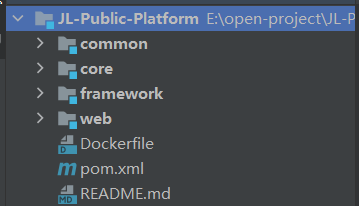
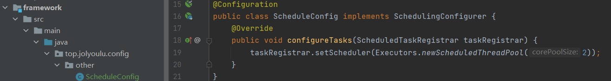
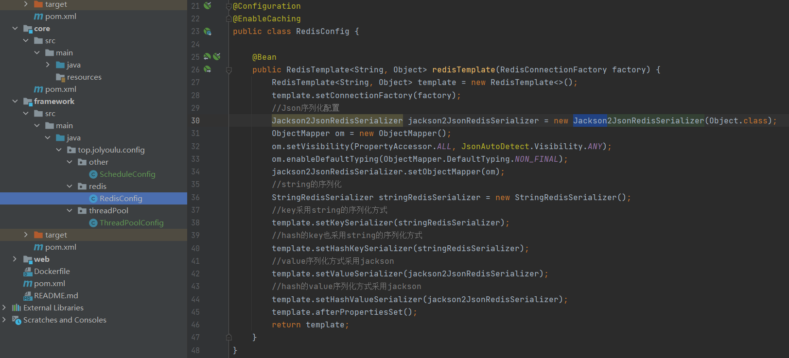
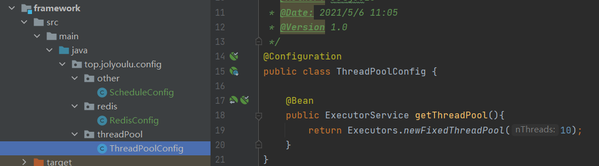
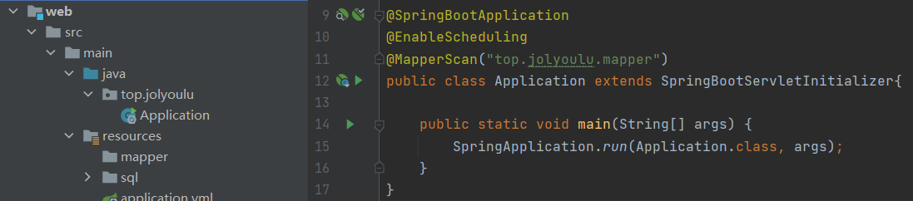
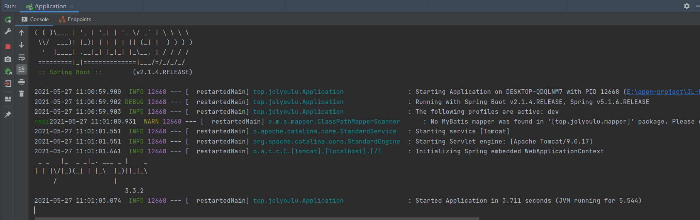

# 公众号开发-基础框架搭建

> 本项目为开源项目，大家可以通过GitHub或Gitee获取并且进行二次开发
>
> GitHub仓库地址：https://github.com/JolyouLu/JL-Public-Platform.git
>
> Gitee仓库地址：https://gitee.com/smallpage/jl-public-platform.git

## 项目介绍

> 在开发之前我们需要搭建一个基础的框架
>
> 本项目是基于SpringBoot 2.X构建，按子模块拆分

### 项目结构

> 项目结构主要分为4大基础模块(觉得不够的可以自己扩展)，
>
> common模块：通用的工具类、枚举类、配置类等
>
> core模块：公众号接入必备的核心业务都写在这里
>
> framework模块：框架的依赖的配置如Redis配置、数据配置、Mybatis配置等
>
> web模块：你自己定制化的业务都写在这里

### 技术选型

> 项目主要涉及到的依赖组件有
>
> 系统环境：Docker，Java8，Maven
>
> 主框架：SpringBoot 2.X
>
> 持久层：mysql，MyBatis-plus 3.x，alibaba-druid 1.x
>
> 缓存：Redis

## 依赖添加

### 父pom文件

~~~xml
<properties>
    <maven.compiler.source>8</maven.compiler.source>
    <maven.compiler.target>8</maven.compiler.target>
    <java.version>1.8</java.version>
    <springboot.version>2.1.4.RELEASE</springboot.version>
    <httpclient.version>4.5.2</httpclient.version>
    <fastjson.version>1.2.62</fastjson.version>
    <dom4j.version>1.6.1</dom4j.version>
    <lombok.version>1.16.22</lombok.version>
    <mybatisPlus.version>3.3.2</mybatisPlus.version>
    <druid.version>1.1.22</druid.version>
    <mysql.version>8.0.15</mysql.version>
    <p6spy.version>3.9.0</p6spy.version>
    <junit.version>4.12</junit.version>
    <lang3.version>3.9</lang3.version>
    <commonsio.version>2.6</commonsio.version>
</properties>
<dependencies>
    <!--springboot 相关依赖-->
    <dependency>
        <groupId>org.springframework.boot</groupId>
        <artifactId>spring-boot-starter-web</artifactId>
    </dependency>
    <dependency>
        <groupId>org.springframework.boot</groupId>
        <artifactId>spring-boot-starter-aop</artifactId>
    </dependency>
    <dependency>
        <groupId>org.springframework.boot</groupId>
        <artifactId>spring-boot-devtools</artifactId>
        <optional>true</optional> <!-- 表示依赖不会传递 -->
    </dependency>
    <!-- commons-io -->
    <dependency>
        <groupId>commons-io</groupId>
        <artifactId>commons-io</artifactId>
        <version>${commonsio.version}</version>
    </dependency>
    <!-- 数据库监控 -->
    <dependency>
        <groupId>com.alibaba</groupId>
        <artifactId>druid</artifactId>
    </dependency>
    <!-- 数据库连接 -->
    <dependency>
        <groupId>mysql</groupId>
        <artifactId>mysql-connector-java</artifactId>
    </dependency>
    <!--框架配置依赖-->
    <dependency>
        <groupId>com.jolyoulu</groupId>
        <artifactId>framework</artifactId>
        <version>1.0-SNAPSHOT</version>
    </dependency>
    <!--通用依赖-->
    <dependency>
        <groupId>com.jolyoulu</groupId>
        <artifactId>common</artifactId>
        <version>1.0-SNAPSHOT</version>
    </dependency>
    <!--核心模块-->
    <dependency>
        <groupId>com.jolyoulu</groupId>
        <artifactId>core</artifactId>
        <version>1.0-SNAPSHOT</version>
    </dependency>
</dependencies>
~~~

### common

~~~xml
<dependencies>
    <!--springboot 相关依赖-->
    <dependency>
        <groupId>org.springframework.boot</groupId>
        <artifactId>spring-boot-starter-web</artifactId>
    </dependency>
    <dependency>
        <groupId>org.springframework.boot</groupId>
        <artifactId>spring-boot-starter-data-redis</artifactId>
    </dependency>
    <!-- lombok -->
    <dependency>
        <groupId>org.projectlombok</groupId>
        <artifactId>lombok</artifactId>
    </dependency>
    <!-- mybatis-plus -->
    <dependency>
        <groupId>com.baomidou</groupId>
        <artifactId>mybatis-plus-boot-starter</artifactId>
    </dependency>
    <!-- lang3 -->
    <dependency>
        <groupId>org.apache.commons</groupId>
        <artifactId>commons-lang3</artifactId>
    </dependency>
    <!-- 阿里json工具 -->
    <dependency>
        <groupId>com.alibaba</groupId>
        <artifactId>fastjson</artifactId>
    </dependency>
    <!-- dom4j解析器 -->
    <dependency>
        <groupId>dom4j</groupId>
        <artifactId>dom4j</artifactId>
    </dependency>
    <!--http 请求相关-->
    <dependency>
        <groupId>org.apache.httpcomponents</groupId>
        <artifactId>httpclient</artifactId>
    </dependency>
    <dependency>
        <groupId>org.apache.httpcomponents</groupId>
        <artifactId>httpmime</artifactId>
    </dependency>
</dependencies>
~~~

### core

~~~xml
<dependencies>
    <dependency>
        <groupId>org.springframework.boot</groupId>
        <artifactId>spring-boot-starter-web</artifactId>
    </dependency>
    <dependency>
        <groupId>org.springframework.boot</groupId>
        <artifactId>spring-boot-starter-aop</artifactId>
    </dependency>
    <dependency>
        <groupId>com.jolyoulu</groupId>
        <artifactId>common</artifactId>
        <version>1.0-SNAPSHOT</version>
    </dependency>
</dependencies>
~~~

### framework

~~~xml
<dependencies>
    <!-- SpringBoot Web容器 -->
    <dependency>
        <groupId>org.springframework.boot</groupId>
        <artifactId>spring-boot-starter-web</artifactId>
    </dependency>

    <dependency>
        <groupId>com.jolyoulu</groupId>
        <artifactId>common</artifactId>
        <version>1.0-SNAPSHOT</version>
    </dependency>
</dependencies>
~~~

### web

~~~xml
<dependencies>
    <!--springboot 相关依赖-->
    <dependency>
        <groupId>org.springframework.boot</groupId>
        <artifactId>spring-boot-starter-web</artifactId>
    </dependency>
    <dependency>
        <groupId>org.springframework.boot</groupId>
        <artifactId>spring-boot-starter-aop</artifactId>
    </dependency>
    <dependency>
        <groupId>org.springframework.boot</groupId>
        <artifactId>spring-boot-devtools</artifactId>
        <optional>true</optional> <!-- 表示依赖不会传递 -->
    </dependency>
    <!-- commons-io -->
    <dependency>
        <groupId>commons-io</groupId>
        <artifactId>commons-io</artifactId>
        <version>${commonsio.version}</version>
    </dependency>
    <!-- 数据库监控 -->
    <dependency>
        <groupId>com.alibaba</groupId>
        <artifactId>druid</artifactId>
    </dependency>
    <!-- 数据库连接 -->
    <dependency>
        <groupId>mysql</groupId>
        <artifactId>mysql-connector-java</artifactId>
    </dependency>
    <!--框架配置依赖-->
    <dependency>
        <groupId>com.jolyoulu</groupId>
        <artifactId>framework</artifactId>
        <version>1.0-SNAPSHOT</version>
    </dependency>
    <!--通用依赖-->
    <dependency>
        <groupId>com.jolyoulu</groupId>
        <artifactId>common</artifactId>
        <version>1.0-SNAPSHOT</version>
    </dependency>
    <!--核心模块-->
    <dependency>
        <groupId>com.jolyoulu</groupId>
        <artifactId>core</artifactId>
        <version>1.0-SNAPSHOT</version>
    </dependency>
</dependencies>
~~~

## 项目构建设置

### web

> 在web的pom文件中添加如下内容，配置项目热部署，以及构建时跳过测试

~~~xml
<build>
    <plugins>
        <!--jar启动springboot项目-->
        <plugin>
            <groupId>org.springframework.boot</groupId>
            <artifactId>spring-boot-maven-plugin</artifactId>
            <version>2.1.1.RELEASE</version>
            <configuration>
                <fork>true</fork> <!-- 如果没有该配置，devtools不会生效 -->
            </configuration>
            <executions>
                <execution>
                    <goals>
                        <goal>repackage</goal>
                    </goals>
                </execution>
            </executions>
        </plugin>
        <!-- maven 打包时跳过测试 -->
        <plugin>
            <groupId>org.apache.maven.plugins</groupId>
            <artifactId>maven-surefire-plugin</artifactId>
            <configuration>
                <skip>true</skip>
            </configuration>
        </plugin>
    </plugins>
</build>
~~~

## 框架组件配置

> 框架组件的配置类都创建在framework模块下

### 并发定时任务配置

> 由于Springboot默认的定时任务是多线程阻塞执行的效率低，通过实现`SchedulingConfigurer`接口可以实现并发执行定时任务
>
> 在framework包下创建一个类并且实现SchedulingConfigurer返回一个定时任务线程池即可

### Redis序列化配置

> 默认提供的Redis使用会经常的出现一些莫名其妙的问题，而且默认的Redis序列化使用的是`Serializable`序列化效率低，我们修改使用`Jackson`进行序列化

> 配置类的源文件在这，这也是一个通用的Redis配置文件

~~~java
@Configuration
@EnableCaching
public class RedisConfig {

    @Bean
    public RedisTemplate<String, Object> redisTemplate(RedisConnectionFactory factory) {
        RedisTemplate<String, Object> template = new RedisTemplate<>();
        template.setConnectionFactory(factory);
        //Json序列化配置
        Jackson2JsonRedisSerializer jackson2JsonRedisSerializer = new Jackson2JsonRedisSerializer(Object.class);
        ObjectMapper om = new ObjectMapper();
        om.setVisibility(PropertyAccessor.ALL, JsonAutoDetect.Visibility.ANY);
        om.enableDefaultTyping(ObjectMapper.DefaultTyping.NON_FINAL);
        jackson2JsonRedisSerializer.setObjectMapper(om);
        //string的序列化
        StringRedisSerializer stringRedisSerializer = new StringRedisSerializer();
        //key采用string的序列化方式
        template.setKeySerializer(stringRedisSerializer);
        //hash的key也采用string的序列化方式
        template.setHashKeySerializer(stringRedisSerializer);
        //value序列化方式采用jackson
        template.setValueSerializer(jackson2JsonRedisSerializer);
        //hash的value序列化方式采用jackson
        template.setHashValueSerializer(jackson2JsonRedisSerializer);
        template.afterPropertiesSet();
        return template;
    }
}
~~~

### 线程池注入Bean工厂

> 注入一个线程池到SpringBoot中这样我们可以使用`@Autowired`获取到这个线程池，方便使用而且可复用

## 编写yml文件

> 由于项目开发时候会分多个配置，生产环境、测试环境，这里yml编写使用文件后缀区分不同环境

### application.yml

> application.yml 里面是没有内容的，里面使用 `spring.profiles.active: dev`切换不同的配置文件

### application-dev.yml

~~~xml
server:
  port: 80
  servlet:
    context-path: /
  tomcat:
    uri-encoding: UTF-8

# 日志配置
logging:
  level:
    top.jolyoulu: debug
    org.springframework: warn

spring:
  # redis 配置
  redis:
    # 地址
    host: localhost
    # 端口，默认为6379
    port: 6379
    # 数据库索引
    database: 1
    # 密码
    password:

  # DataSource Config
  datasource:
    driver-class-name: com.mysql.cj.jdbc.Driver
    url: jdbc:mysql://localhost:3306/weixin?useSSL=false&useUnicode=true&characterEncoding=utf-8&zeroDateTimeBehavior=convertToNull&allowMultiQueries=true&serverTimezone=UTC
    username: root
    password: 123456
    type: com.alibaba.druid.pool.DruidDataSource
    druid:
      # 下面为连接池的补充设置，应用到上面所有数据源中
      # 初始化大小，最小，最大
      initial-size: 5
      min-idle: 5
      max-active: 200
      # 配置获取连接等待超时的时间
      max-wait: 60000
      # 配置间隔多久才进行一次检测，检测需要关闭的空闲连接，单位是毫秒
      time-between-eviction-runs-millis: 60000
      # 配置一个连接在池中最小生存的时间，单位是毫秒
      min-evictable-idle-time-millis: 300000
      validation-query: SELECT 1
      test-while-idle: true
      test-on-borrow: false
      test-on-return: false
      # 打开PSCache，并且指定每个连接上PSCache的大小
      pool-prepared-statements: true
      #   配置监控统计拦截的filters，去掉后监控界面sql无法统计，'wall'用于防火墙
      max-pool-prepared-statement-per-connection-size: 20
      filters: stat,wall
      use-global-data-source-stat: true
      # 通过connectProperties属性来打开mergeSql功能；慢SQL记录
      connect-properties: druid.stat.mergeSql=true;druid.stat.slowSqlMillis=5000
      # 配置监控服务器
      stat-view-servlet:
        login-username: admin
        login-password: 123456
        reset-enable: false
        url-pattern: /druid/*
        # 添加IP白名单
        #allow:
        # 添加IP黑名单，当白名单和黑名单重复时，黑名单优先级更高
        #deny:
      web-stat-filter:
        # 添加过滤规则
        url-pattern: /*
        # 忽略过滤格式
        exclusions: "*.js,*.gif,*.jpg,*.png,*.css,*.ico,/druid/*"
~~~

## 编写启动类

> 在web模块中编写启动类`Application`
>
> `@EnableScheduling`开启定时任务
>
> `@MapperScan("top.jolyoulu.mapper")`Mybatis扫码包路径

## 测试启动

> 启动时如没发现任何报错表示启动成功，基础项目框架以及搭建完成了

