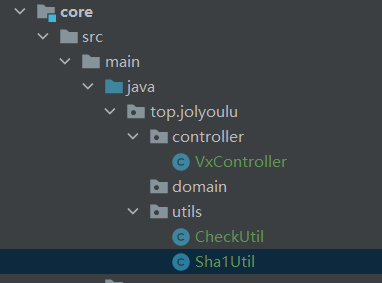

# 公众号开发-公众号接入

> 在开始开发我们公众号之前，首先让我们注册的公众号接入到我们自己的服务这样用户访问就会被转发到我们的服务上

## 接入介绍

> 公众号接入是每一个公众号开发都必须完成的一个步骤，我们需要告诉微信公众平台我们的接入的服务的URL，微信服务器就会发送HttpGet请求来验证这个服务是否可用，并且通过双方相互定好的加密方式辨认出该服务是不是你本人部署的
>
> 这里是微信公众平台官方文档：接入指南`https://developers.weixin.qq.com/doc/offiaccount/Basic_Information/Access_Overview.html`

## 流程说明

> 要编写公众号接入接口，首先需要清楚这个业务的一个执行流程
>
> 1. 首先用户登录到公众平台设置好服务器的`URL`以及`Token`
> 2. 点击确认后，微信服务器会向你设置好的`URL`发送一个Get请求
> 3. 后台收到Get请求对指定的参数进行加密并且返回加密后对比结果
> 4. 公众平台提示设置成功标识完成了公众号接入

## 编写代码

> 清楚了大致的流程后我们可用开始编写我们的代码了

### common包

> 通用的一些类都会保存在common包下，我们需要在common包下保存微信公众平台的一些常量
>
> common新建`VxParameterConfig`类，`vx.yml`文件

#### vx.yml

> 由于微信token、appId、appSecret以及各种的http请求链接都是常量，所以我们创建一个统一的`vx.yml`保存这些常量，当然也可用使用一个类来保存看个人爱好

~~~yml
vxparameter:
  # 令牌自己定义(Token)
  token: myToken
~~~

#### VxParameterConfig

> VxParameterConfig类是用于读取`vx.yml`中的配置用的，这样在任何地方将来该对象注入就可用通过get方式获取到yml的常量了

~~~java
@Component
@ConfigurationProperties(prefix = "vxparameter")
@PropertySource(value = "classpath:vx.yml")
public class VxParameterConfig {

    private String token;

    public String getToken() {
        return token;
    }

    @Value("${token}")
    public void setToken(String token) {
        this.token = token;
    }
}
~~~

### core包

>核心业务存入到core包下
>
>common新建`VxController`类，`CheckUtil`类，`Sha1Util`类

#### Sha1Util

> 一个加密Sha1的工具类，这个种类似的工具类很多可以通过百度找到

~~~java
public class Sha1Util {
    public static String getSha1(String str){
        if(str==null||str.length()==0){
            return null;
        }
        char hexDigits[] = {'0','1','2','3','4','5','6','7','8','9',
                'a','b','c','d','e','f'};
        try {
            MessageDigest mdTemp = MessageDigest.getInstance("SHA1");
            mdTemp.update(str.getBytes("UTF-8"));
            byte[] md = mdTemp.digest();
            int j = md.length;
            char buf[] = new char[j*2];
            int k = 0;
            for (int i = 0; i < j; i++) {
                byte byte0 = md[i];
                buf[k++] = hexDigits[byte0 >>> 4 & 0xf];
                buf[k++] = hexDigits[byte0 & 0xf];
            }
            return new String(buf);
        } catch (Exception e) {
            // TODO: handle exception
            return null;
        }
    }
}
~~~

#### CheckUtil

> 该类拥有一个方法`checkSignature`是用来对微信服务器请求过来的参数进行加密，并且对比返回相应的结果给微信服务器

~~~java
public class CheckUtil {

    /**
     * 验证微信get请求
     * @param token
     * @param signature
     * @param timestamp
     * @param nonce
     * @return
     */
    public static boolean checkSignature(String token,String signature,String timestamp,String nonce){
        String[] arr = new String[]{token,timestamp,nonce};
        Arrays.sort(arr);
        StringBuffer content = new StringBuffer();
        for(int i = 0 ; i < arr.length ; i++){
            content.append(arr[i]);
        }
        String temp = Sha1Util.getSha1(content.toString());
        return temp.equals(signature);
    }
}
~~~

#### VxController

> 接收于处理微信服务器发现的Get请求，在Controller会调用CheckUtil的checkSignature方法去进行加密并且对比，是符合条件的返回echostr到微信服务器，不符合不做任何处理

~~~java
@Slf4j
@Controller
@RequestMapping("/myWeXin")
public class VxController {

    @Autowired
    private VxParameterConfig vxParameterConfig;

    @GetMapping("/master")
    @ResponseBody
    public String init(@RequestParam("signature") String signature,
                       @RequestParam("timestamp") String timestamp,
                       @RequestParam("nonce") String nonce,
                       @RequestParam("echostr") String echostr){
        if (CheckUtil.checkSignature(vxParameterConfig.getToken(),signature,timestamp,nonce)){
            return echostr;
        }
        return null;
    }
}
~~~

## 运行项目测试

> 完成以上内容编写后，启动我们的SpringBoot

### 开启Natapp

> Nataapp这里我简单说一下不清楚的小伙伴请看[(1)公众号开发-开发准备]((1)公众号开发-开发准备.md)
>
> 登录Natapp官网配置好你要映射的端口

> 运行`natapp.exe`得到临时访问域名

### 登录公众平台配置参数

> 登录到公众平台测试账号，不清楚的小伙伴请看[(1)公众号开发-开发准备]((1)公众号开发-开发准备.md)
>
> 配置URL，这里要`注意是映射的域名+VxController访问路径，如果修改过VxController类的请求路径请使用你修改的`
>
> 配置Token，你在yml写的Token拷贝到里面即可

### 

> 点击提交，若看到提示`配置成功`表示微信公众号接入成功了
>
> 如果提示`配置失败`请检查你的代码以及Natapp是否有误，可以尝试打一个断点在你的Controller点击提交如何接收到请求表示Natapp没问题是代码出问题了，如果没反应表示Natapp或者你的Controller路径设置错误了
>
> `注意：由于Natapp提供的域名是临时的所以经常会变，如果不来程序好好的突然就交互不来了可以检查一下域名是不是变了`

