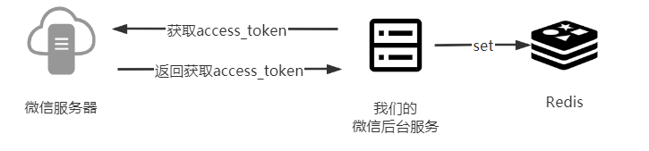
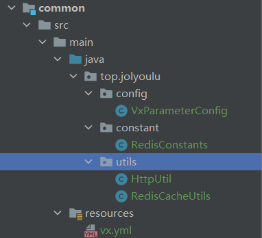
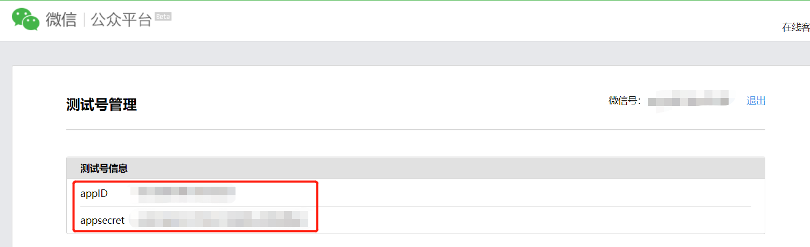
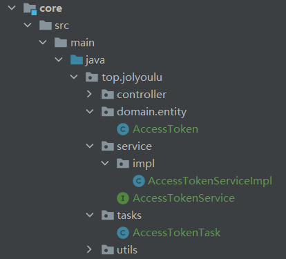
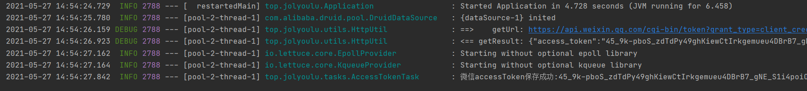
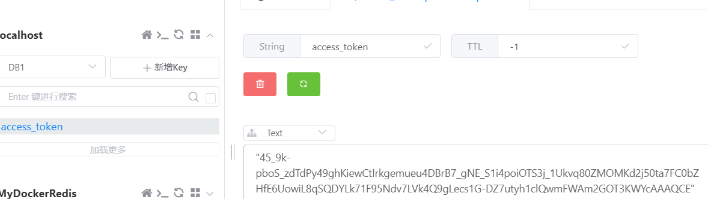

# 公众号开发-AccessToken获取

> 是一个非常重要的东西，你的服务于微信服务器的交互的令牌所有请求都需要带上该参数，否则你将无法于微信服务器交交互

## AccessToken介绍

> AccessToken是与微信服务器交互的令牌，AccessToken特点每过2小时会失效，需重新去微信服务器获取AccessToken
>
> 这里是微信公众平台官方文档：[获取Access token](https://developers.weixin.qq.com/doc/offiaccount/Basic_Information/Get_access_token.html)

## 流程说明

> 由于AccessToken特点，2小时有效时间需重新获取，并且几乎所有请求都用到，所以我们使用Redis保存，利用SpringBoot定时任务定时获取最新的Access token

## 代码编写

> 清楚了大致的流程后我们可用开始编写我们的代码了

### common包

> 修改：vx.yml、VxParameterConfig
>
> 增加：RedisConstants、HttpUtil、RedisCacheUtils

#### vx.yml

> vx.yml需要增加几个参数appId与appSecret，将你测试账号的拷贝进去即可

~~~yml
vxparameter:
  # 令牌(Token)
  token: xxx
  # 开发者ID(AppID)
  appId: xxx
  # 开发者密码(AppSecret)
  appSecret: xxx
  
  accessTokenUrl: https://api.weixin.qq.com/cgi-bin/token?grant_type=client_credential&appid=APPID&secret=APPSECRET
~~~

#### VxParameterConfig

> `vx.yml`修改了也要做相应的修改

~~~java
@Component
@ConfigurationProperties(prefix = "vxparameter")
@PropertySource(value = "classpath:vx.yml")
public class VxParameterConfig {

    private String token;

    private String appId;

    private String appSecret;
    
    private String accessTokenUrl;

    public String getToken() {
        return token;
    }

    @Value("${token}")
    public void setToken(String token) {
        this.token = token;
    }

    public String getAppId() {
        return appId;
    }

    @Value("${appId}")
    public void setAppId(String appId) {
        this.appId = appId;
    }

    public String getAppSecret() {
        return appSecret;
    }

    @Value("${appSecret}")
    public void setAppSecret(String appSecret) {
        this.appSecret = appSecret;
    }
    
    public String getAccessTokenUrl() {
        return accessTokenUrl;
    }

    @Value("${accessTokenUrl}")
    public void setAccessTokenUrl(String accessTokenUrl) {
        this.accessTokenUrl = accessTokenUrl;
    }
}
~~~

#### RedisConstants

> 该类用于保存Redis的key常量值

~~~java
public class RedisConstants {

    /**
     * 微信令牌
     */
    public static final String ACCESS_TOKEN = "access_token";

}
~~~

#### RedisCacheUtils

> 封装RedisTemplate的Redis工具类

~~~java
@Component
public class RedisCacheUtils {

    @Autowired
    public RedisTemplate redisTemplate;

    /**
     * 缓存基本的对象
     * @param key 缓存的键
     * @param value 缓存的值
     */
    public <T> void setCacheObj(final String key,final T value){
        redisTemplate.opsForValue().set(key,value);
    }

    /**
     * 获取缓存基本的对象
     * @param key 缓存的键
     * @return 缓存的值
     */
    public <T> T getCacheObj(final String key){
        ValueOperations<String,T> operations = redisTemplate.opsForValue();
        return operations.get(key);
    }

    /**
     * 监测缓存是否存在指定key
     * @param key 缓存的键
     * @return
     */
    public boolean existsCacheObj(final String key){
        return redisTemplate.hasKey(key);
    }

}
~~~

#### HttpUtil

> 发送Http请求的工具类，可发post请求与get请求

~~~java
@Slf4j
public class HttpUtil {

    private final static int SUCCESS = 200;

    /**
     * 向指定 URL 发送GET方法的请求
     * @param url 发送请求的 URL https://xxx
     * @param param 请求参数，请求参数应该是 name1=value1&name2=value2 的形式
     * @return 所代表远程资源的响应结果
     */
    public static String sendGet(String url, String param){
        return sendGet(url+"?"+param);
    }

    /**
     * 向指定 URL 发送GET方法的请求
     * @param url url 发送请求的 URL https://xxx?name1=value1&name2=value2
     * @return 所代表远程资源的响应结果
     */
    public static String sendGet(String url){
        String jsonString = "";
        try {
            CloseableHttpClient client = HttpClients.createDefault();
            HttpGet get = new HttpGet(url);

            log.debug("==>    getUrl: " + url);
            CloseableHttpResponse response = client.execute(get);
            int statusCode = response.getStatusLine().getStatusCode();

            if (SUCCESS == statusCode){
                HttpEntity entity = response.getEntity();
                jsonString = EntityUtils.toString(entity);
                log.debug("<== getResult: " + jsonString);
            }else {
                log.error("<== getResult: " + response);
            }

        } catch (IOException e) {
            log.error("调用HttpUtils.sendGet IOException, getUrl: " + url);
        }
        return jsonString;
    }

    /**
     * 向指定 URL 发送POST方法的请求
     * @param url url 发送请求的 URL https://xxx
     * @param body Json格式请求体
     * @return 所代表远程资源的响应结果
     */
    public static String sendJsonPost(String url,String body){
        String jsonString = "";
        try {
            CloseableHttpClient client = HttpClients.createDefault();
            HttpPost post = new HttpPost(url);
            log.debug("==>    postUrl: " + url);
            post.addHeader("Content-Type","application/json");
            StringEntity reqEntity = new StringEntity(body, ContentType.APPLICATION_JSON);
            post.setEntity(reqEntity);
            CloseableHttpResponse response = client.execute(post);
            int statusCode = response.getStatusLine().getStatusCode();
            if (SUCCESS == statusCode){
                HttpEntity entity = response.getEntity();
                jsonString = EntityUtils.toString(entity);
                log.debug("<== postResult: " + jsonString);
            }else {
                log.error("<== postResult: " + response);
            }
        }catch (IOException e) {
            log.error("调用HttpUtils.sendPost IOException, postUrl: " + url);
        }
        return jsonString;
    }
}
~~~

### core包

> 增加：AccessToken、AccessTokenService、AccessTokenServiceImpl、AccessTokenTask

#### AccessToken

> 微信服务器返回的body内容

~~~java
@Data
public class AccessToken {

    private String access_token;

    private Long expires_in;
}
~~~

#### AccessTokenService

> 定义获取AccessToken的接口与方法

~~~java
public interface AccessTokenService{

    /**
     * 请求获取AccessToken
     * @return
     */
    String getAccessToken();

}
~~~

#### AccessTokenServiceImpl

> 实现AccessTokenService，实现具体的获取AccessToken

~~~java
@Slf4j
@Service
@Transactional
public class AccessTokenServiceImpl implements AccessTokenService {

    @Autowired
    private VxParameterConfig vxParameterConfig;

    @Override
    public String getAccessToken() {
        String url = vxParameterConfig.getAccessTokenUrl();
        String appId = vxParameterConfig.getAppId();
        String appSecret = vxParameterConfig.getAppSecret();
        url = url.replaceAll("APPID",appId);
        url = url.replaceAll("APPSECRET",appSecret);
        return HttpUtil.sendGet(url);
    }
}
~~~

#### AccessTokenTask

> 编写定时任务每过2小时获取异常accessToken并且将其保存到Redis中

~~~java
@Slf4j
@Component
@EnableScheduling
public class AccessTokenTask {

    @Autowired
    private AccessTokenService accessTokenService;

    @Autowired
    private RedisCacheUtils redisCacheUtils;

    /**
     * access_token 是公众的全局唯一调用凭据
     * access_token 的有效期为 2 个小时，需要定时刷新 access_token，重复获取会导致之前一次获取的失效
     * 延迟一秒执行
     */
    @Scheduled(initialDelay = 1000, fixedDelay = 7000*1000 )
    public void getTouTiaoAccessToken(){
        try {
            String json = accessTokenService.getAccessToken();
            AccessToken accessToken = JSONObject.parseObject(json, AccessToken.class);
            String token = accessToken.getAccess_token();
            redisCacheUtils.setCacheObj(RedisConstants.ACCESS_TOKEN,token);
            log.info("微信accessToken保存成功:{}",token);
        } catch (Exception e) {
            log.error("获取微信adcessToken保存失败!");
            e.printStackTrace();
        }

    }
}
~~~

## 运行项目测试

> 启动运行项目如看到该日志表示AccessToken获取成功

> Redis中可以查看到保存的AccessToken

