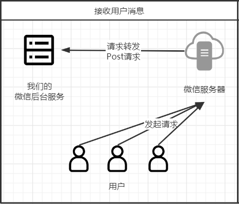

# 公众号开发-接收普通消息

>用户对微信公众号发送的每一个消息包括，文本、图片、语言等都会被微信服务器转发到我们部署的应用服务中

## 接收普通消息介绍

> 用户对公众号发送的每一个消息都会被通过Post请求转发到我们设置服务器URL中，所以一定要区分好请求的类型，GET请求URL是验证服务器的接口，POST请求URL是微信服务器转发的接口，`微信服务器所以需要转发的请求都会从这个POST接口进入`
>
> 这里是微信公众平台官方文档接收`普通消息：https://developers.weixin.qq.com/doc/offiaccount/Message_Management/Receiving_standard_messages.html、接收事件消息：https://developers.weixin.qq.com/doc/offiaccount/Message_Management/Receiving_event_pushes.html`

### 普通消息格式

> 普通消息一般是用户直接在公众号发送的文本、图片、语言等；每一种消息的说明包括各个字段的含义在微信公众平台上都有详细的说明
>
> 接收普通消息：`https://developers.weixin.qq.com/doc/offiaccount/Message_Management/Receiving_standard_messages.html`

### 事件消息

> 用户对公众号关注/取关等操作都会收到一个事件消息，事件消息多用于菜单，后面会讲到如何自定义菜单，设置菜单事件可以工具用户点击不同的事件做出相应的业务处理；每一种消息的说明包括各个字段的含义在微信公众平台上都有详细的说明
>
> 接收事件消息：`https://developers.weixin.qq.com/doc/offiaccount/Message_Management/Receiving_event_pushes.html`

## 流程说明

> 用户发送的任何消息都会先经过微信服务器，最后通过我们设置好的URL以POST请求转发给我们

## 代码编写

> 清楚了大致的流程后我们可用开始编写我们的代码了

### common包

> 增加：MessageUtil

#### MessageUtil

> 由于微信服务器转发的的body格式是xml格式的所以我们需要解析接收到的xml并且将它转化为map方便后期获取相应的参数

~~~java
public class MessageUtil {

    /**
     * 解析reqString中xml格式消息
     * @param reqString HttpServletRequest
     * @return Map<节点名,值>
     */
    public static Map<String,String> string2Map(String reqString) {
        try {
            String xml = reqString;
            Map<String,String> maps = new HashMap<>();
            Document document = DocumentHelper.parseText(xml);
            Element root = document.getRootElement();
            List<Element> eles = root.elements();
            for (Element e:eles){
                maps.put(e.getName(),e.getTextTrim());
            }
            return maps;
        }catch (DocumentException e){
            e.printStackTrace();
        }
        return null;
    }
}
~~~

### core包

> 修改：VxController

#### VxController

> 增加一个相应的Post请求接口，`注意Post请求与Get请求的接口路径是一样的只是请求方式不一样不要搞错了不然接收不了消息`

~~~java
@Slf4j
@Controller
@RequestMapping("/myWeXin")
public class VxController {

    @Autowired
    private VxParameterConfig vxParameterConfig;

    @GetMapping("/master")
    @ResponseBody
    public String init(@RequestParam("signature") String signature,
                       @RequestParam("timestamp") String timestamp,
                       @RequestParam("nonce") String nonce,
                       @RequestParam("echostr") String echostr){
        if (CheckUtil.checkSignature(vxParameterConfig.getToken(),signature,timestamp,nonce)){
            return echostr;
        }
        return null;
    }
//增加部分=====================================================================
    @PostMapping(value = "/master")
    public void receiver(@RequestBody String xml, HttpServletResponse resp, HttpServletRequest request){
        try {
            Map<String, String> msgMap = MessageUtil.string2Map(xml);
            log.info("收到用户消息:{}",msgMap);
        } catch (Exception e) {
            e.printStackTrace();
        }
    }
//增加部分=====================================================================
}
~~~

## 运行项目测试

> 打开我们的测试号并且发送消息给测试号，发现后台能够成功接收到消息

## 消息重排

> 经过以上修改已经可以正常接收用户消息了，但是还有一个问题没有处理，就是消息重排问题，什么是消息重排？
>
> 消息重排就是用户消息重复排除问题，由于微信服务器有一个设定就是在转发请求到我们服务器中，如果我们服务在5秒内未进行返回消息，那么就会断开当前连接然后连续发送3次重复的请求到我们服务器，这样如果一些业务处理较长的代码就会经常出现这个问题，会严重影响到接口的并发量，所以我们需要利用一些手段解决这个办法，解决这个问题阅读下博客

[公众号开发-2种消息重排方案](公众号开发-2种消息重排方案.md)

## 优雅的实现接收普通消息接口

> 写到这里相信大家也发现了一个问题就是，微信服务器啥乱七八糟的请求都往同一个接口发送，我以及可以现象到生产环境上加上业务后的这个接收消息的接口，会被套上一大堆的if else来判断消息内容/消息事件，维护极其困难，那么怎么解决这个问题呢，可以使用到Pipline模式(责任链设计模式)解决这个问题，阅读如下博客

[公众号开发-pipline模式改造接收消息接口.md]()

