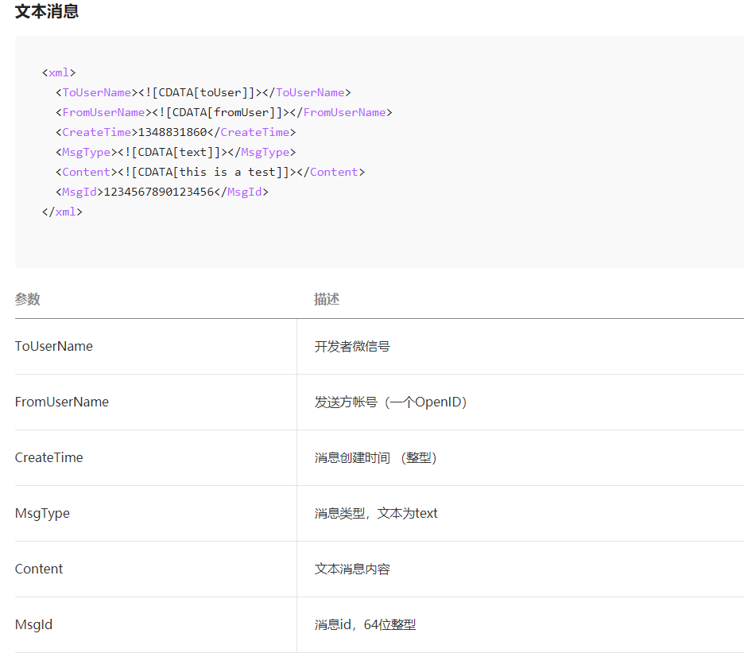
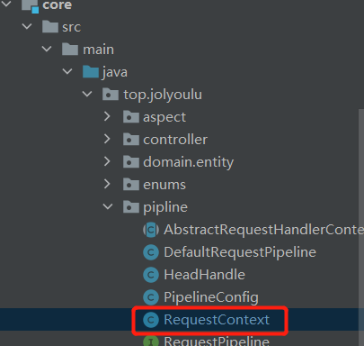

# 公众号开发-被动消息回复

> 在上一篇[(5)公众号开发-接收用户消息]((5)公众号开发-接收用户消息.md)博客中已讲如何接收用户消息，接收消息已没问题，接下来讲一下如何返回消息了

## 被动消息回复消息介绍

> 用户对公众号发送的每一个消息都会被通过Post请求转发到我们设置服务器URL中，我们可以从Request中解析出用户发送的消息类型以及内容，处理完成用户消息后我们需要返回一个消息给用户，这样用户才能找到到底有没有收到消息
>
> 这里是微信公众平台官方文档：被动回复用户消息：`https://developers.weixin.qq.com/doc/offiaccount/Message_Management/Passive_user_reply_message.html`

## 被动消息回复格式

> 被动消息回复目前只支持6种消息格式，分别是文本、图片、语音、视频、音乐、图文
>
> 具体的消息格式请参照官方文档：被动回复用户消息：`https://developers.weixin.qq.com/doc/offiaccount/Message_Management/Passive_user_reply_message.html`

## 消息内容说明

### 用户发消息给公众号

> 首先我们向公众号发送一段文本消息，将收到消息内容转化未Map后查看内容
>
> 首先通过`MsgType`知道当前发送过来的消息是文本消息
>
> `Content`字段中，保存的是发送的内容
>
> `ToUserName`(重要)，这里是接收者是id，因为现在是用户发消息给公众号所以消息接收者是公众号的id
>
> `FromUserName`(重要)，这里是发送者id，因为现在是用户发消息给公众号所以消息发送者就是用户的OpenId(每一个关注了公众号的用户都会有一个唯一的OpenId)

### 公众号发消息给用户

> 用户发消息给公众号说明后，我们注意到几个重要的属性
>
> `FromUserName与ToUserName`它标致着这条消息由谁发出，由谁接收
>
> `MsgType`它标志着这条消息是什么类型的消息
>
> 知道这几个属性的含义后那么我们就知道如何给用户回复消息了，我们只需要将来`ToUserName`设置成用户的OpenId，`FromUserName`设置成公众号Id那么我们就可以给用户发送消息啦
>
> 如果我将来刚刚收到的消息回复一个你好给用户那么我应该这样写，注意`FromUserName与ToUserName`发送的变化，我们只需要将2个属性呼唤一下就可以回复用户消息了

## 代码编写

### common包

> 增加：PassiveMsgUtil

#### PassiveMsgUtil

> 生成消息体的类，该类使用的是静态内部类实现的单例模式由于该类肯定是使用最多的类，如果不设置未单例模式会造成jvm内存消耗高，这里只是展示了一个文本消息体，其实其它消息回复以此类推，字符串拼接就行了
>
> 如果想了解单例模式更加多的实现可以阅读[23设计模式-单例模式（创建型模式）](../设计模式专栏/23设计模式-单例模式(创建型模式).md)

### core包

> 修改：RequestContext

#### RequestContext

> RequestContext在文章[公众号开发-Ppline设计模式改造接收消息接口](公众号开发-pipline模式改造接收消息接口.md)提到过，即在Pipeline的上下文，里面保存着可以操作的内容，我们可以通过上下文的response给用户回复消息，把消息回复的方法统一封装到该类下，方便使用

### web包

> 修改：TextTypeHandle

#### TextTypeHandle

> 在处理业务的Handle中获取passiveMsgUtil，调用相应的方法构建出需要返回的内容，调用一下requestContext.resultMsg方法即可，细心的小伙伴会发现`PassiveMsgUtil`已经是一个不推荐使用的工具类了，`如果大家想了解更加高级的生成xml的写法请往后面看，后面我会介绍高级写法如何使用自定义注解+java反射实现消息回复的内容生成`

## 运行测试

> 我们可以看到每当我们发送一个内容给公众号，公众号就会返回你好这个消息，表示成功了

## 利用自定义注解与反射生成消息体

> 经过上面的编写后我们可以发现，我们编写的passiveMsgUtil太简单粗暴了，返回体都是写死的，这就产生一个问题就是，如果有一天微信官方文档修改了，或者微信增加了消息返回体类型，那么我们修改起来就比较麻烦，那么接下来我们利用`自定义注解+java反射`优化我们的代码，让代码更加灵活更加优雅，阅读如需博客

[公众号开发-自定义注解+JAVA反射优雅的实现消息回复](公众号开发-自定义注解+JAVA反射优雅的实现消息回复.md)