# 公众号开发-被动消息回复

> 自定义菜单是公众号开发必备功能，公众号用户与后台交互基本都在菜单中完成，自定义菜单可以让公众号下菜单拥有更加丰富的菜单事件，以及菜单功能

## 自定义菜单介绍

> 自定义菜单在创建时需要注意以下几个内容
>
> 1. 自定义菜单最多包括3个一级菜单，每个一级菜单最多包含5个二级菜单
> 2. 一级菜单最多4个汉字，二级菜单最多7个汉字，多出来的部分将会以“...”代替
> 3. 创建自定义菜单后，菜单的刷新策略是，在用户进入公众号会话页或公众号profile页时，如果发现上一次拉取菜单的请求在5分钟以前，就会拉取一下菜单，如果菜单有更新，就会刷新客户端的菜单。测试时可以尝试取消关注公众账号后再次关注，则可以看到创建后的效果
>
> 这里是微信公众平台官方文档：[自定义菜单](https://developers.weixin.qq.com/doc/offiaccount/Custom_Menus/Creating_Custom-Defined_Menu.html)

## 数据表设计

> 自定义菜单需要使用到数据库，将我们的自定义菜单格式保存下来，所有首先我们需要设计数据库，根据官方文档最终设计出如下表

~~~sql
create table weixin.vx_menu
(
    id             bigint auto_increment comment '主键' primary key,
    parent_id      bigint                  null comment '父级id',
    tree_level     varchar(20) default '0' null comment '菜单级别',
    tree_sort      bigint                  null comment '本级排序号（升序）',
    menu_type      varchar(12)             null comment '菜单类型',
    menu_name      char(16)                not null comment '菜单名称',
    menu_key       char(128)               null comment '菜单KEY值，用于消息接口推送，不超过128字节(click等点击类型必须)',
    menu_url       varchar(500)            null comment '用户点击菜单可打开链接(view、miniprogram类型必须)',
    menu_media_id  varchar(64)             null comment '调用新增永久素材接口返回的合法media_id(media_id类型和view_limited类型必须)',
    menu_app_id    varchar(64)             null comment '小程序的appid(miniprogram类型必须)',
    menu_page_path varchar(64)             null comment '小程序的页面路径(miniprogram类型必须)'
);
~~~

> 表格创建完毕后插入几条测试数据方便等一下测试

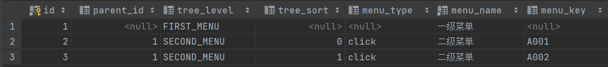

## 代码编写

### common包

> 增加：VxResult
>
> 修改：VxParameterConfig、vx.yml

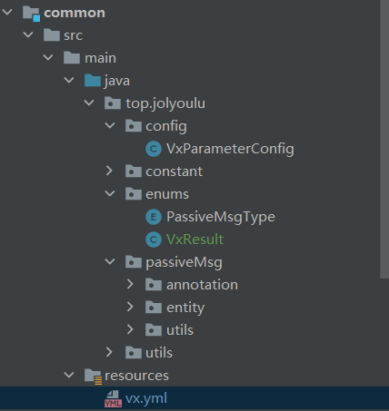

#### VxResult

> 该类用于处理发起请求后收到的返回消息处理

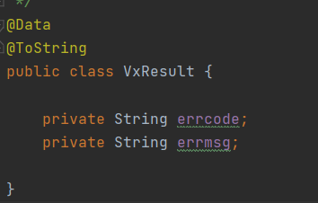

#### vx.yml

> 需要在yml增加创建菜单的请求地址

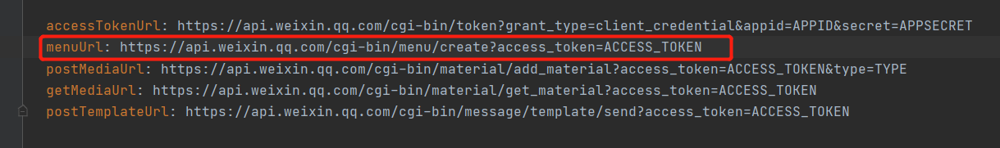

#### VxParameterConfig

> 增加menuUrl属性并且生成相应的set/get方法

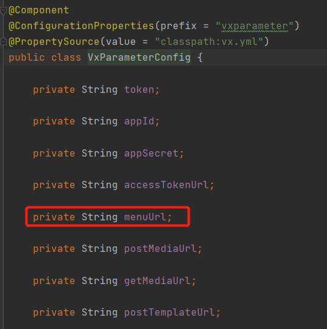

### core包

> 增加：VxMenu，InitMenuFormBody，MenuType，TreeLevel，VxMenuMapper，VxMenuServiceImpl，VxMenuService，VxMenuMapper.xml

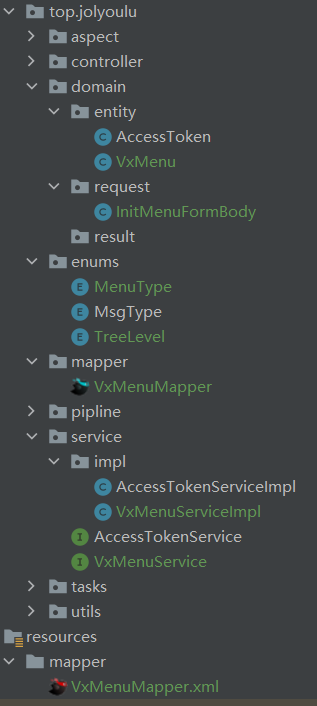

#### VxMenu

> 对应数据库表字段

~~~java
@Data
@TableName(value = "vx_menu")
public class VxMenu {
    @TableId(type = IdType.AUTO)
    private Long id;
    private Long parentId;
    private TreeLevel treeLevel;
    private Long treeSort;
    private MenuType menuType;
    private String menuName;
    private String menuKey;
    private String menuUrl;
    private String menuMediaId;
    private String menuAppId;
    private String menuPagePath;
}
~~~

#### InitMenuFormBody

> 发生请求时所需要用到的json格式对象

~~~java
@Data
public class InitMenuFormBody {
    private String name;
    private String type;
    private String url;
    private String key;
    private List<InitMenuFormBody> sub_button;
}
~~~

#### MenuType和TreeLevel

> MenuType：菜单类型的枚举类
>
> TreeLevel：菜单级别枚举类

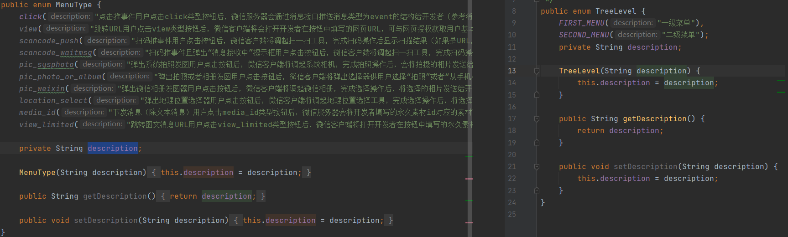

#### VxMenuMapper

> 这里使用到的是mybatis-plus，需要基础一个通用的Mapper，编写一个selectMenuTree获取树结构的自定义sql

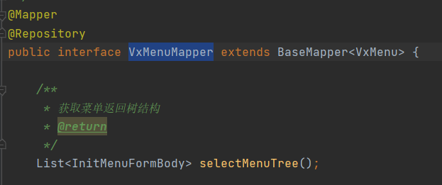

#### VxMenuMapper.xml

> 编写自定义sql利用Mybatisxml映射，生成菜单数结构

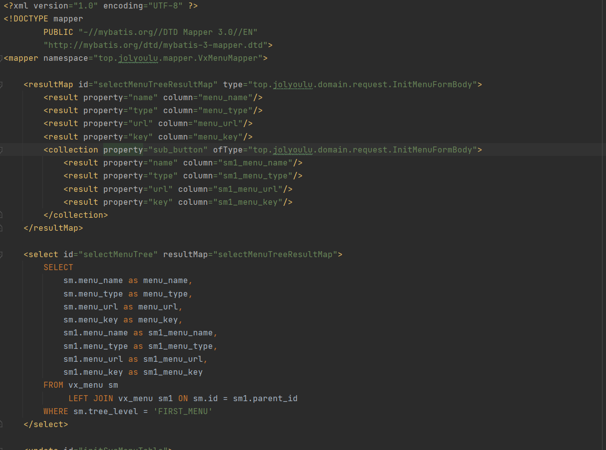

#### VxMenuService

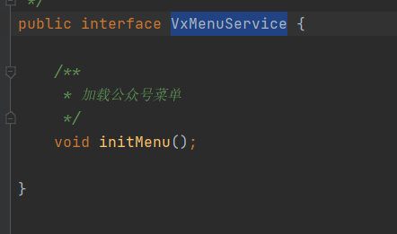

#### VxMenuServiceImpl

> 编写创建菜单的方法

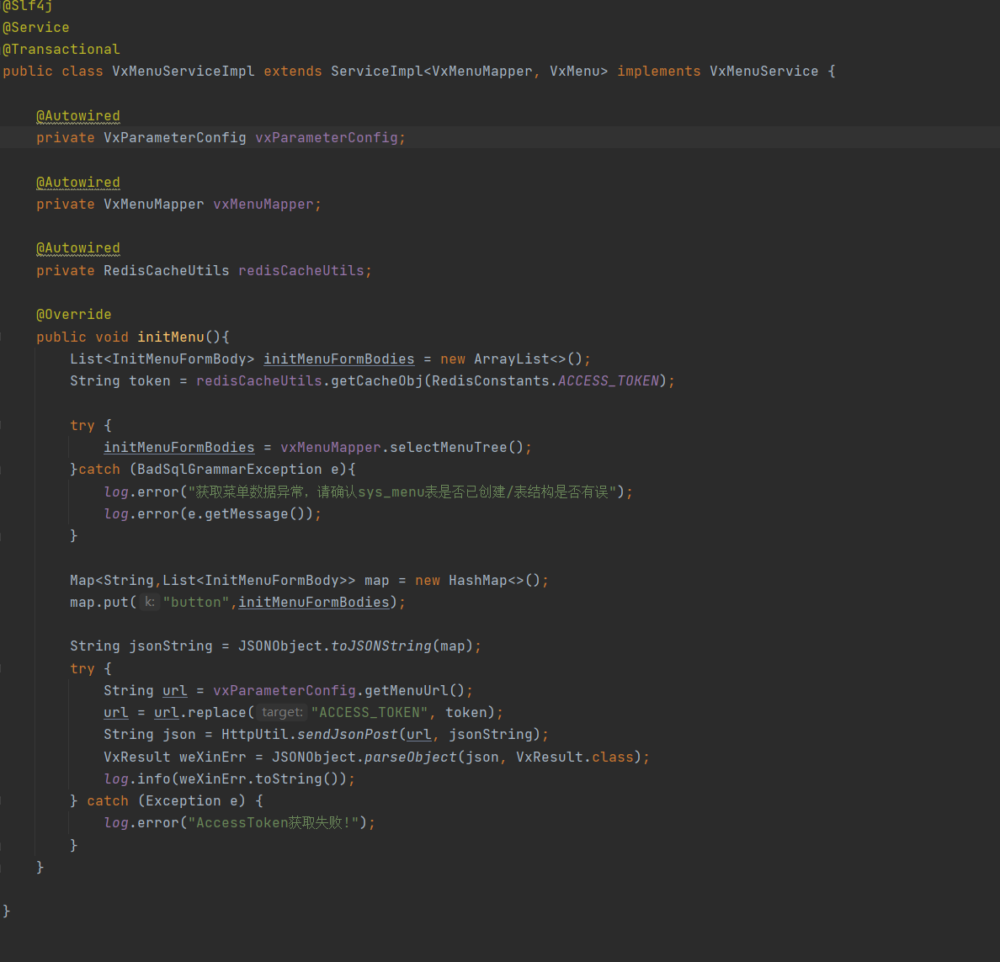

## 启动异步创建菜单

> 编写以上的类与方法后，我们通过menuService.initMenu();就可以调用方法创建菜单了，但是这显然不够灵活，需要进行改造一下，如果在项目启动后自动初始化菜单那就是最好的了，接下来我们就实现它

### LoadVxMenu

> 编写一个LoadVxMenu的类
>
> 1. 实现CommandLineRunner，重写run方法，这样当项目启动完毕后就会调用run方法
> 2. 编写内部类LoadMenuTask，实现Runnable重写run方法，利用while轮询Redis中ACCESS_TOKEN，当获取到ACCESS_TOKEN才会进行初始化菜单的操作
> 3. 将来编写好的LoadMenuTask对象传入到CommandLineRunner的run方法中即可

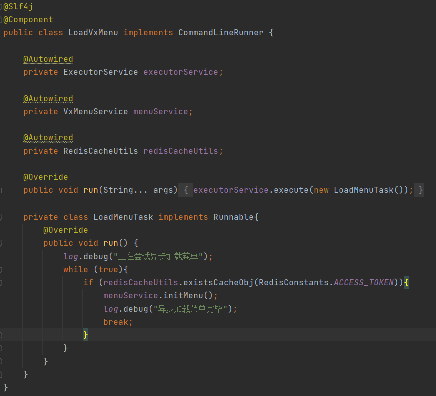

## 运行测试

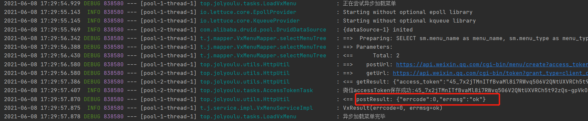

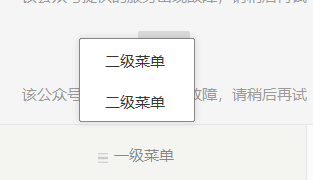
