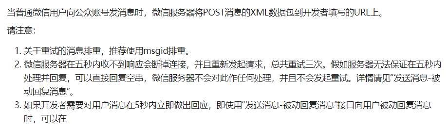
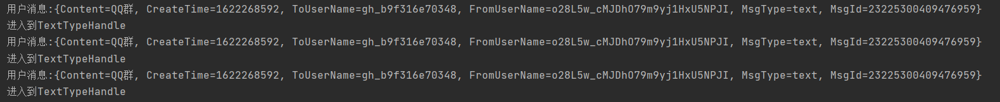
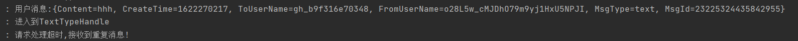

# 公众号开发-2种消息重排方案

> 在进行微信公众号开发时，经常会发现接收到用户重复消息那是为什么呢，这是因为如果我们的服务没有在5秒内返回消息给微信服务器，微信服务器会断开我们的连接并且重新发起请求总共3次，这样会增大服务器的压力

## 解决思路

> 经过观察我们发现重复的消息都有一个相同的特点，就是内容都是重复的，那么我们只需要将接收到的用户消息保存下来，每一次收到消息就去检查一下是否是已保存过了，如果是就丢弃，如果不是就处理请求
>
> 那么保存什么字段呢？微信官方推荐是`MsgId`但是这有一个问题就是，事件消息是没有`MsgId`的，所以这里我使用的是`CreateTime+FromUserName`
>
> 怎么连接用户请求呢？当然是利用SpringAop面向切面编程拉，如果对SpringAop不是很连接可以阅读我的这篇文章[Spring AOP原理深度解析-架构学习笔记14](https://blog.csdn.net/weixin_44642403/article/details/104111028)

## 代码实现

### SpringAop+Map

> 利用SpringAop+Map适合单机服务，或没有部署Redis的项目
>
> 首先准备一个切面，一个HashMap
>
> 编写切入点，对切点使用环绕通知，在接口接收到用户消息时，获取消息中的`FromUserName+CreateTime`判断是否存在map中，不存在保存到map中就执行业务代码，`如果在期间再次收到用户消息获取FromUserName+CreateTime发现已存在就会不做任何处理`，当业务代码执行完毕后，将结果返回即可

~~~shell
@Slf4j
@Aspect
@Component
public class VxMsgAspect {

    //线程安全的HashMap
    private static final ConcurrentHashMap<String,String> map = new ConcurrentHashMap<>();

    //定义切入点
    @Pointcut("execution(* top.jolyoulu.controller.VxController.receiver(..))")
    public void pointCutVXReceiver(){};

    //环绕通知
    @Around("pointCutVXReceiver()")
    public Object around(ProceedingJoinPoint pjp) throws Throwable {
        Object retVal = null;
        //从连接点中获取参数
        Object[] args = pjp.getArgs();
        String xml = (String) args[0];
        //将来获取到的参数格式化
        Map<String, String> msgMap = MessageUtil.string2Map(xml);
        String msgId = msgMap.get("FromUserName") + msgMap.get("CreateTime");
        //如果已经存在于map中不做任何处理
        if (map.containsKey(msgId)){
            log.error("请求处理超时,接收到重复消息!");
            //直接返回空
            return null;
        }else {
            //否则将消息存入到map中
            map.put(msgId,msgId);
            //执行切面的方法，得到接口返回结果
            retVal = pjp.proceed(args);
            //执行完毕后删除map中保存的值
            map.remove(msgId);
        }
        //返回执行结果
        return retVal;
    }
}
~~~

### SpringAop+Redis

> 利用SpringAop+Redis适合分布式项目，或有了部署Redis的项目
> 首先准备一个切面，一个Redis
> 编写切入点，对切点使用环绕通知，在接口接收到用户消息时，获取消息中的FromUserName+CreateTime判断是否存在redis中，不存在保存到redis中就执行业务代码，如果在期间再次收到用户消息获取>FromUserName+CreateTime发现已存在就会不做任何处理，当业务代码执行完毕后，将结果返回即可

~~~java
@Slf4j
@Aspect
@Component
public class VxMsgAspect {

    //定义切入点
    @Pointcut("execution(* top.jolyoulu.controller.VxController.receiver(..))")
    public void pointCutVXReceiver(){};

    @Autowired
    private RedisCacheUtils redisCacheUtils;

    //环绕通知
    @Around("pointCutVXReceiver()")
    public Object before(ProceedingJoinPoint pjp) throws Throwable {
        Object retVal = null;
        //从连接点中获取参数
        Object[] args = pjp.getArgs();
        String xml = (String) args[0];
        //将来获取到的参数格式化
        Map<String, String> msgMap = MessageUtil.string2Map(xml);
        String msgId = msgMap.get("FromUserName") + msgMap.get("CreateTime");
        if (redisCacheUtils.existsCacheObj(msgId)){
            log.error("请求处理超时,接收到重复消息!");
            //直接返回空
            return null;
        }else {
            redisCacheUtils.setExCacheObj(msgId,msgId,10);
            //执行切面的方法，得到接口返回结果
            retVal = pjp.proceed(args);
        }
        return retVal;
    }
}
~~~

## 测试

