# 公众号开发-pipline模式改造接收消息接口

> 相信做个公众号开发的小伙伴都找到，微信服务器会把接收到的用户消息，用户事件等都会通过同一个接口返回给我们，那么我们要按不同类型来处理这写请求时，就会编写很多的`if else`当然定期图片只是第一次，在事件消息下也分不同的事件，这就造成后期代码难以维护，而且难以阅读

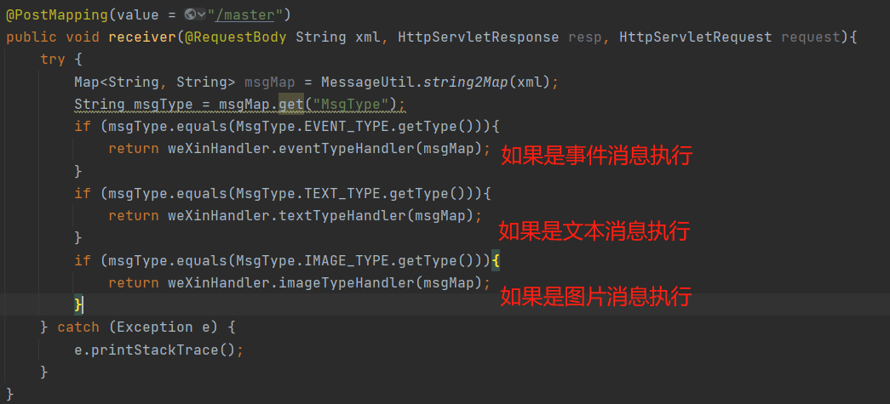

## 前言

阅读本篇文章若掌握如下知识点会让你看的更加轻松（若还没掌握的可以点击标题阅读）

- [23设计模式-职责链模式(行为型模式)](../设计模式专栏/23设计模式-职责链模式(行为型模式).md)

## Pipeline模式

> 那么使用什么办法可以解决这个问题呢？我们可以把接收请求的接口当成一股水流，我们提供一个管道水流会经过一整条管道在管道之间设置一些阀门，如果当前水流有阀门感兴趣的事件阀门就会处理这个水流，如果没有着继续让他流下去，这种模式称为Pipeline模式也叫责任链模式
>
> 如图可以看出Pipeline模式的优点
>
> 1. 可扩展性强，如果我增加或减少一个处理类只需要丢到管道中即可
>
> 2. 每一个类只关心一个业务，只处理一个业务

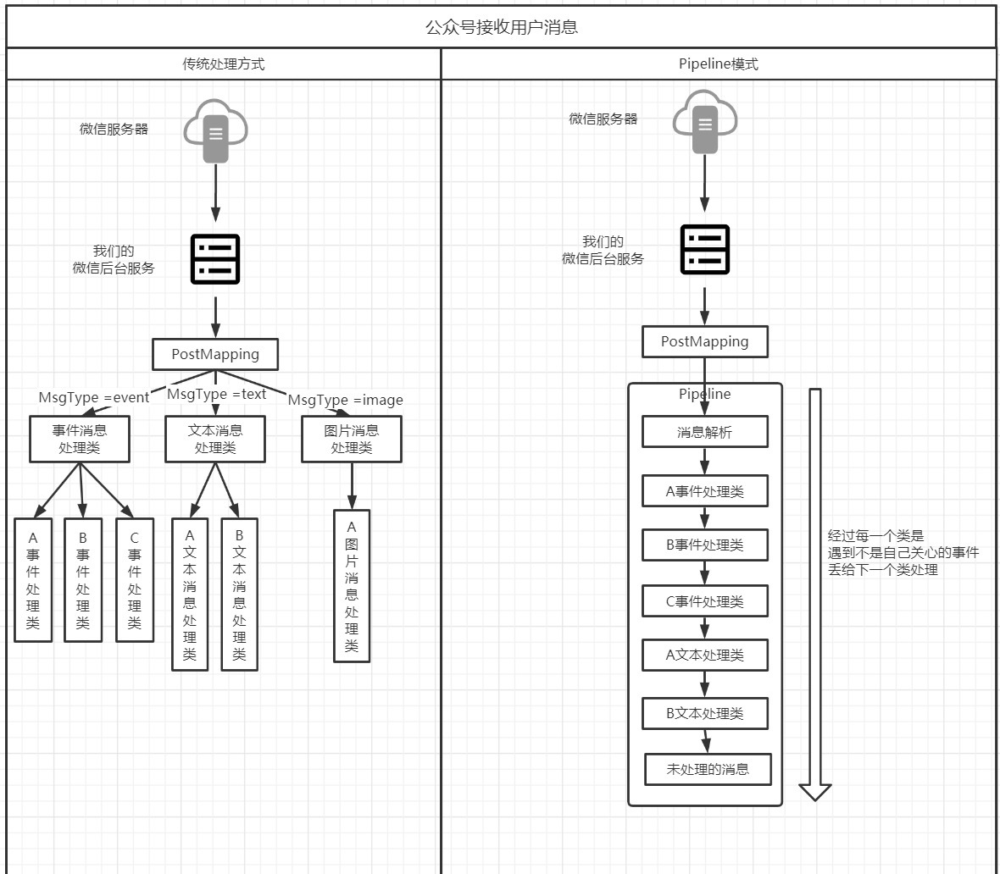

## 类设计

> RequestContext：用于封装请求过来的内容，需要处理的数据都在这个对象获取
>
> AbstractRequestHandlerContext：抽象的请求处理类，该类中嵌套着下一个处理者对象，提供一个requestHandle处理请求方法给子类实现
>
> HeadHandle/TailHandle/EventTypeHandler：继承父类并且事件具体的处理方法
>
> RequestPipeline：一个管道的接口，提供添加内容方法
>
> DefaultRequestPipeline：一个管道的具体实现，里面维护着所有的Handler

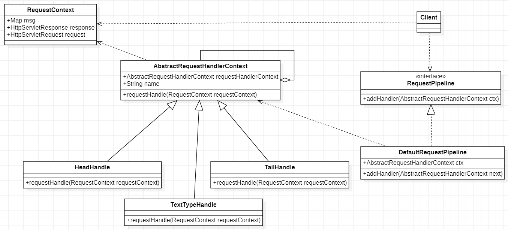

## 代码编写

### RequestContext

> RequestContext：用于保存着上下文，以及需要处理的数据

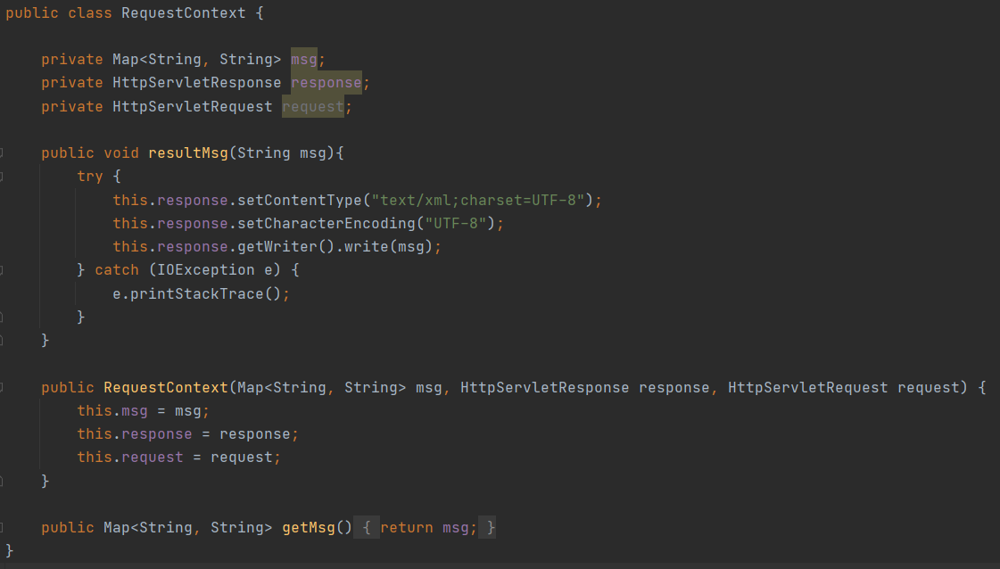

### AbstractRequestHandlerContext

> AbstractRequestHandlerContext：抽象的处理类，所有的处理业务的类都需要实现该父类，并且重新requestHandle

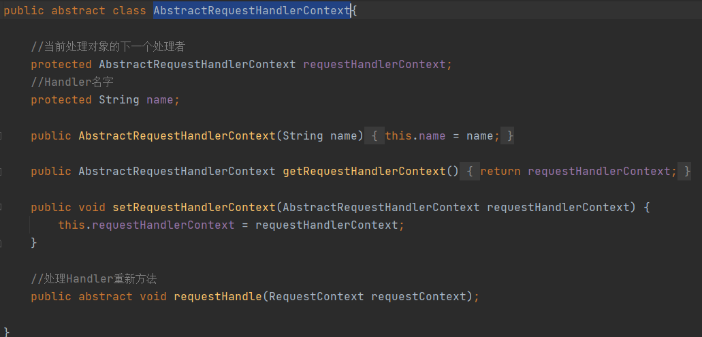

### HeadHandle

> HeadHandle：一般情况下一个管道需要一个头和一个尾，该类是管道头(就是第一个Handle)，这个类一般不处理具体的业务只是打印一些日志，直接通过requestHandle将来RequestContext传入下一个Handle处理

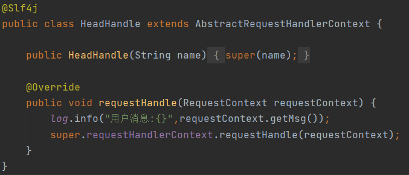

### TailHandle

> TailHandle：一般情况下一个管道需要一个头和一个尾，该类是管道尾(就是最后一个Handle)，能进入到该类表示请求流经整个管道没有任何Handle进行处理，一般打印一些日志即可

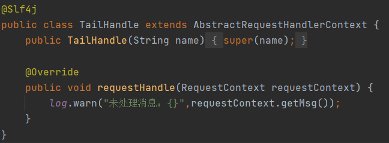

### TextTypeHandle

> TextTypeHandle：这个Handle是一个主要的Handle了，一般业务处理的Handle都这样编写，在管道流动的时候，流经这个处理对象时通过判断RequestContext里的数据是不是所关心的数据，如果是着进行相应业务处理，若不是则进行传到下一个Handle中

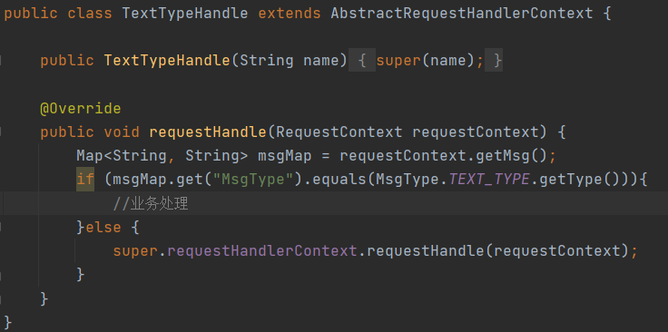

### RequestPipeline

> RequestPipeline：定义一种新的管道都需要实现给接口

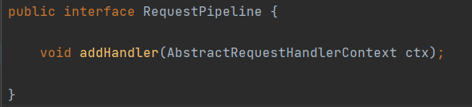

### DefaultRequestPipeline

> DefaultRequestPipeline：默认的管道实现，初始化时需要传入一个Handle，addHandler是整个管道的核心方法，它管理Handler的添加，所有编写的Handle都需要添加到管道中，管道会将所有的Handle连接到一起像一个链条那样

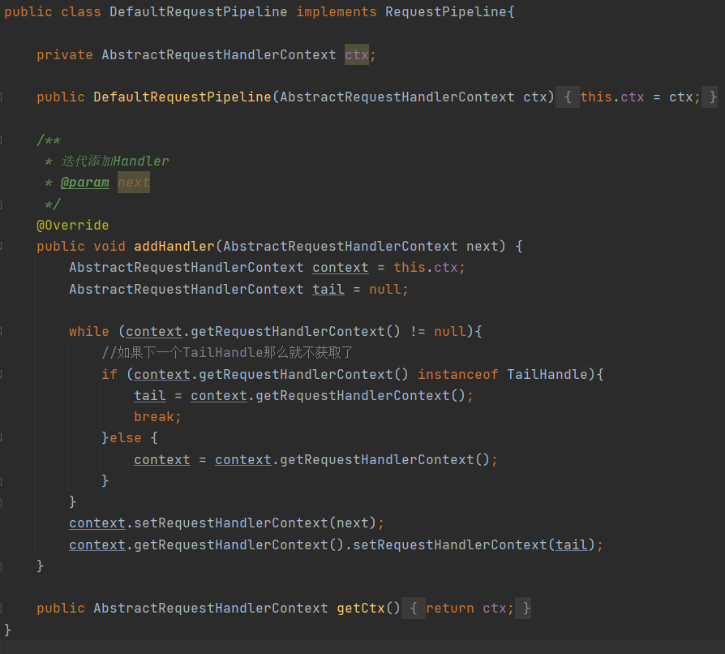

## 依赖注入

> 依赖注入是最重要的一步，我们需要将来整个管道交由Spring管理这样我们可以通过`@Autowired`得到管道

### PipelineConfig

> 创建一个管道，并且在初始化的时候传入HeadHandle与TailHandle

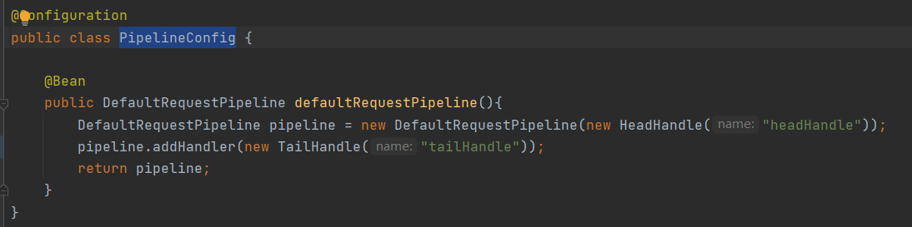

### HandleConfig

> 在其它地方需要往管道中添加Handler只需要通过`@Autowired`获取，然后调用add方法即可

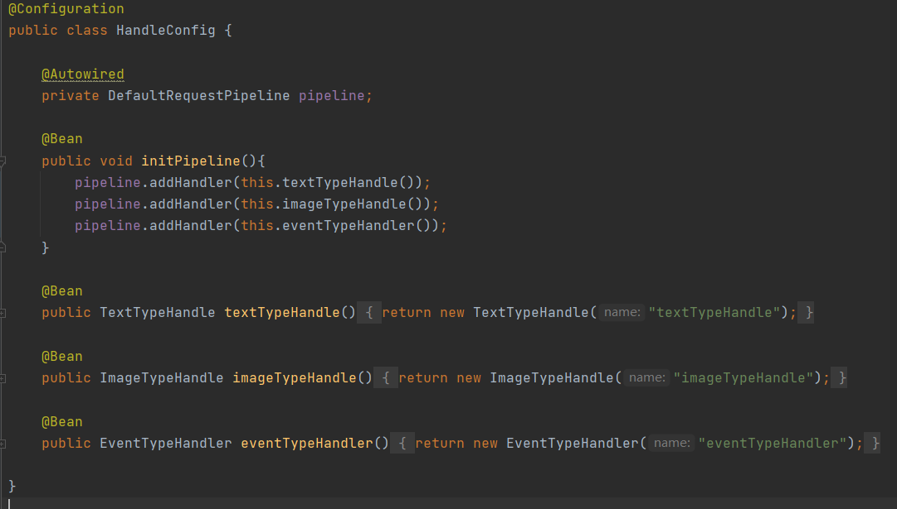

## 运行测试

> 修改公众号接收用户消息的Controller，构建一个通过RequestContext对象`@Autowired`获取到Pipeline，直接获取管道中的Handler链条调用requestHandle方法即可
>
> 可以通过断点的方式查看到DefaultRequestPipeline结构是一个一个Handle层层嵌套表示Pipeline没有任何问题，在执行到每一个Handle时都会保存着下一个准备执行的Handle，你可以选择将RequestContext传入到下一个Handle也可以选择不传

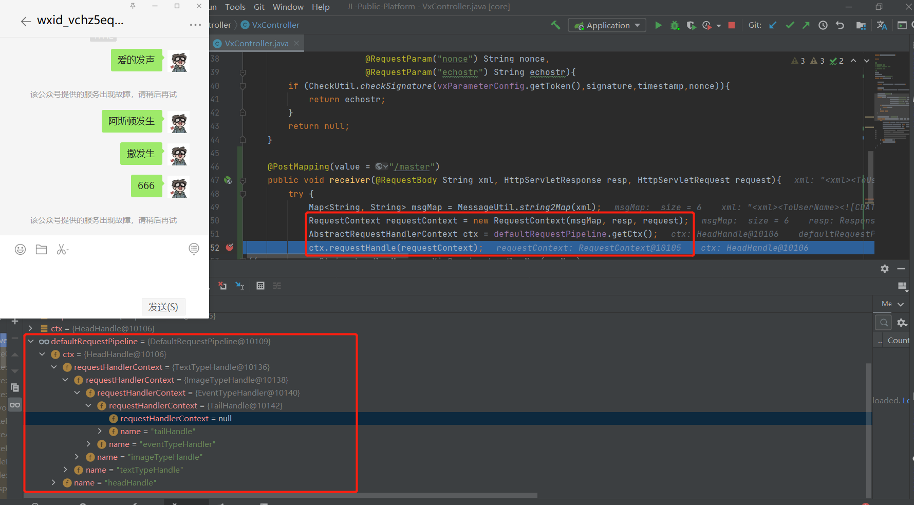
