# 公众号开发-自定义注解+JAVA反射优雅的实现消息回复

> 相信很多小伙伴在做微信开发时，做被动消息回复时经常会遇到一个很棘手的事情，就是回复消息的内容与日常开发的json不同的是，微信公众号回复消息需要回复xml格式的内容，所以这时就会出现很多简单粗暴的写法，就直接用字符串拼接，显然这种写法也太粗暴了而且当微信官方如果对文档内容变得修改起来也是一个头疼的事情，所以今天我就交大家利用`自定义注解+Java反射`来实现xml格式的生成

## 前言

> 本项目所有代码都提交到git中大家可以下载参考
>
> **gitHub仓库：**`https://github.com/JolyouLu/JL-Public-Platform.git`
> **gitee仓库：**`https://gitee.com/smallpage/jl-public-platform.git`

## 被动消息回复特征

> 首先我们观察这3个消息返回体，可以发现有以下几个特征
>
> 1. 所有的消息都是已`<xml>`开头`</xml>`结尾
> 2. 所有标签都是大驼峰写法
> 3. 所有消息的`ToUserName、FromUserName、CreateTime`标签内容都是相同的
> 4. 文本消息没有标签嵌套的情况
> 5. 图片、语音、视频、音乐消息都有一个标签下嵌套一组标签的情况
> 6. 图文消息有一个标签下嵌套多组标签的情况
> 7. 有的标签是被`<![CDATA[]]>`包裹注的，有的标签没被包裹住

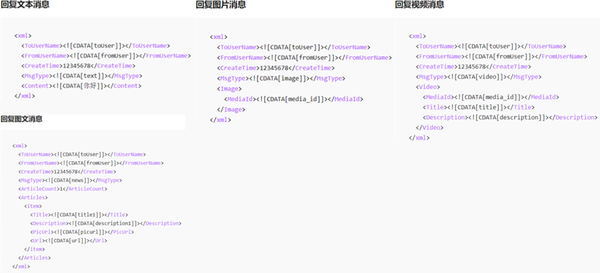

## 根据特征得出的方案

> 1. 由于所有消息的`ToUserName、FromUserName、CreateTime`标签内容都是相同的，`那么可以使用一个基类保存这些标签`
> 2. 文本消息没有标签嵌套的情况，`那么可以将它封装称为对象`
> 3. 图片、语音、视频、音乐消息都有一个标签下嵌套一组标签的情况，`嵌套对象即可`
> 4. 图文消息有一个标签下嵌套多组标签的情况，`嵌套List对象即可`
> 5. 所有标签都是大驼峰写法，而java命名规范是小驼峰，`那么需要给每一个字段标记好他要转化成什么字段`
> 6. 有的标签是被`<![CDATA[]]>`包裹注的，有的标签没被包裹住，`那么需要标记每一个字段在生成时是否需要包裹<![CDATA[]]>`

## 编写代码

### PassiveMsg

> 该注解用于类上，表示这个类是需要转xml的对象

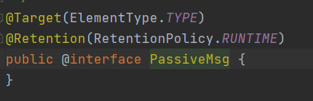

### PassiveMsgProperty

> 该注解用于用于类的字段中
>
> name：标记这个字段转化成xml后标签名是什么
>
> addCDATA：标记这个字段转化成xml后是否需要添加`<![CDATA[]]>`标签默认是不需要
>
> contentObj：如果像图片这种消息体就需要对Image属性进行标记，这个属性是与那个对象关联，这样可以获取到关联对象下的`PassiveMsgProperty`内容

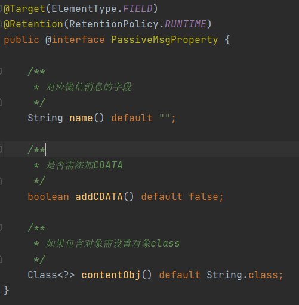

### BaseMessage

> 所有被动回复消息的基类

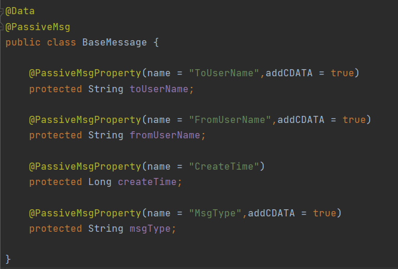

### PassiveMsgUtil

> 将传入对象通过反射获取到PassiveMsgProperty参数，根据参数生成相应xml格式，该类使用的是枚举类实现的单例模式

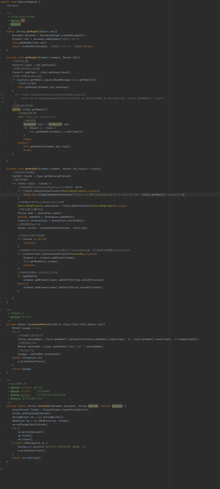

## 编写实体类

> 选择几个比较典型的xml，利用注解实现实体类并且测试看一下

### 文本消息实体类

> 官方要求如图

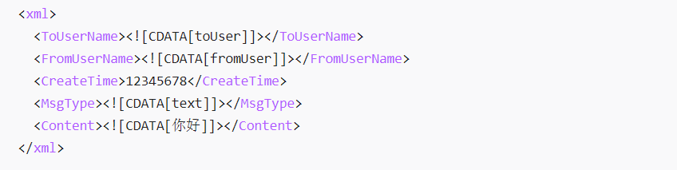

#### TextMessage

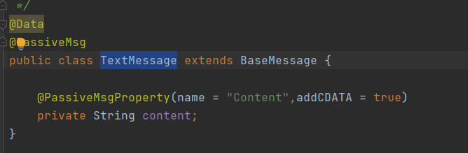

#### 单元测试

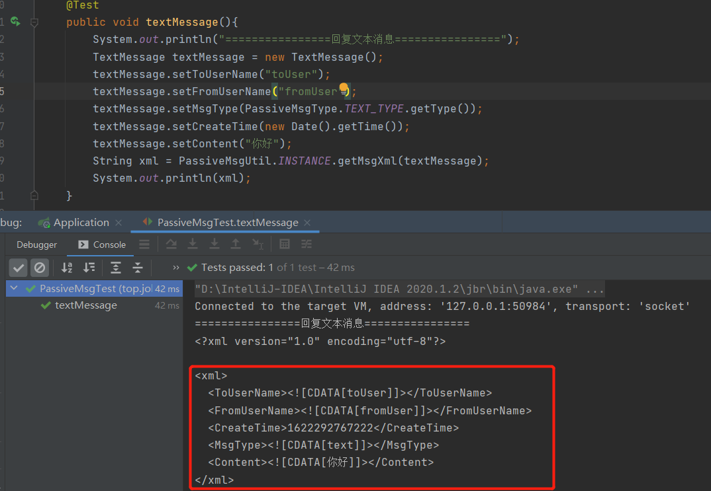

### 图片消息实体类

> 官方要求如图

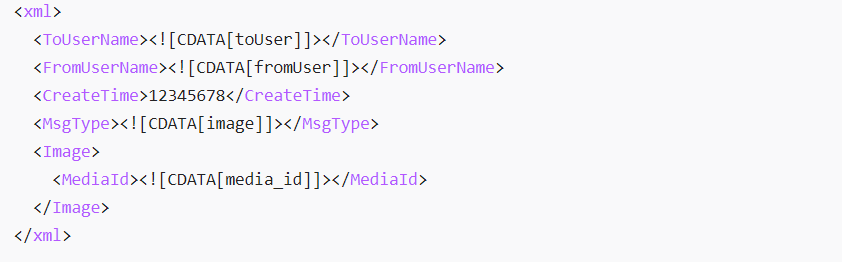

#### ImageCtx

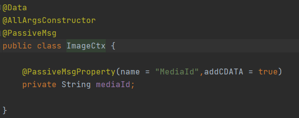

#### ImageMessage

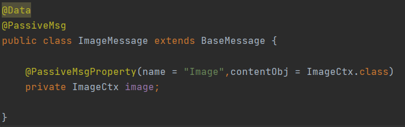

#### 单元测试

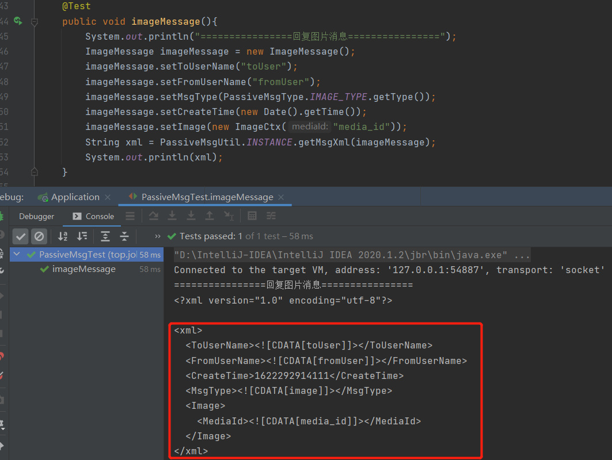

### 图文消息实体类

> 官方要求如图

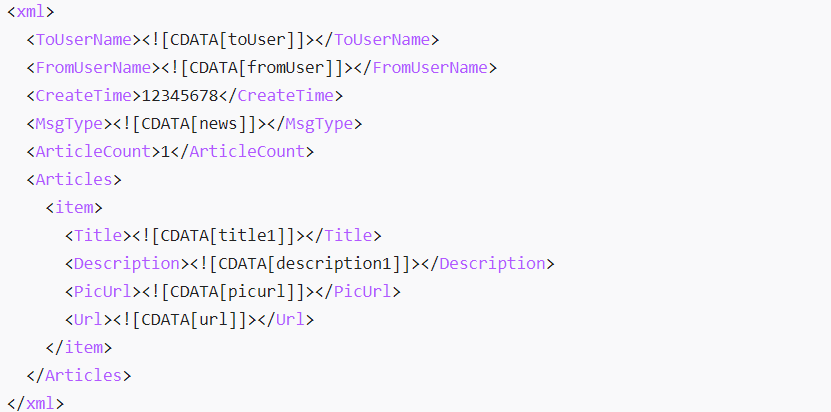

#### ArticlesCtx

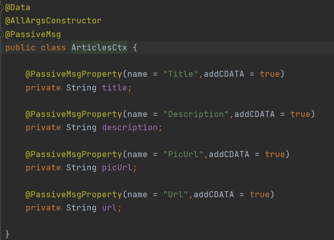

#### ArticlesItem

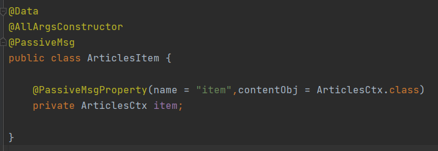

#### ArticlesMessage

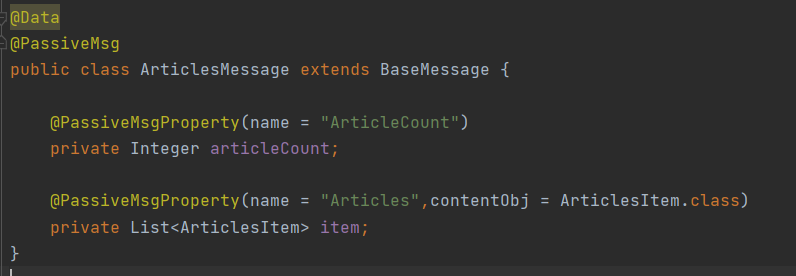

#### 单元测试

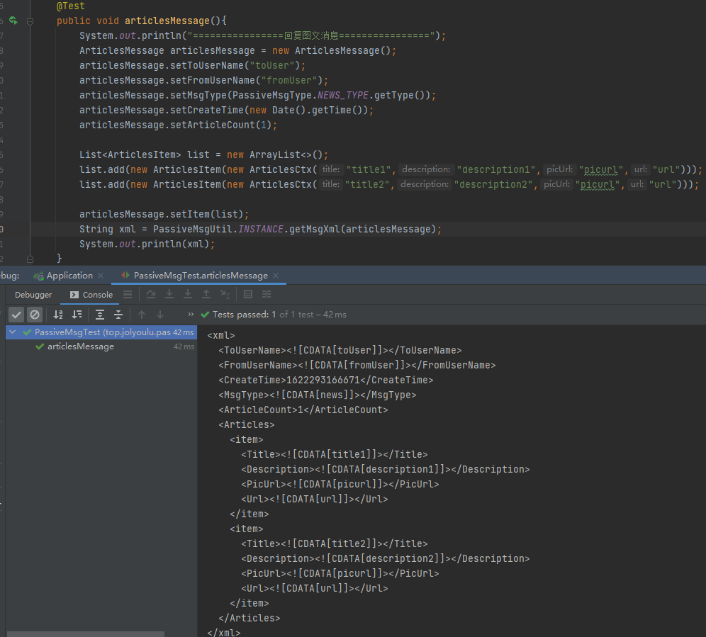

## 运行项目测试

> 修改Web包下的TextTypeHandle与ImageTypeHandle将刚刚写好的构建运用到项目上

### TextTypeHandle

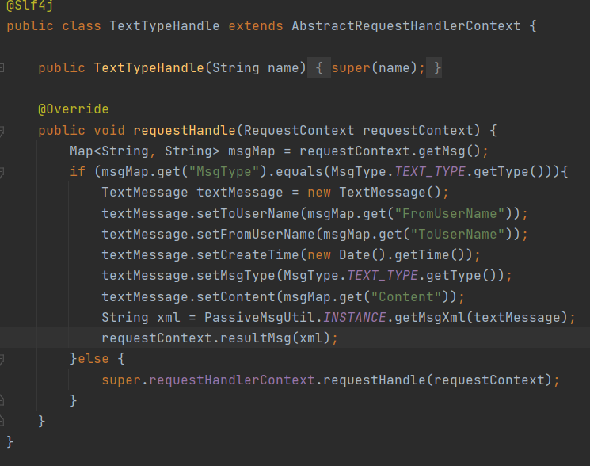

### ImageTypeHandle

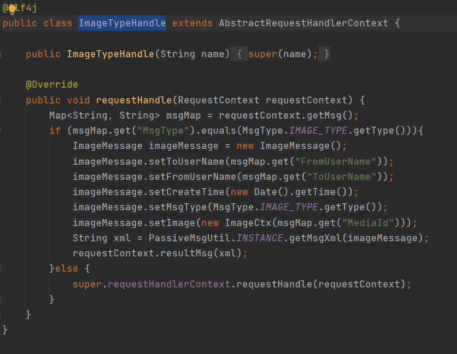

### 测试

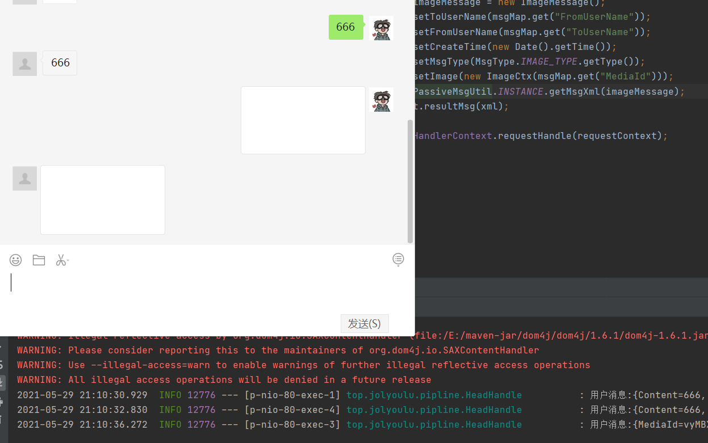