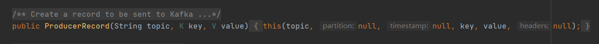
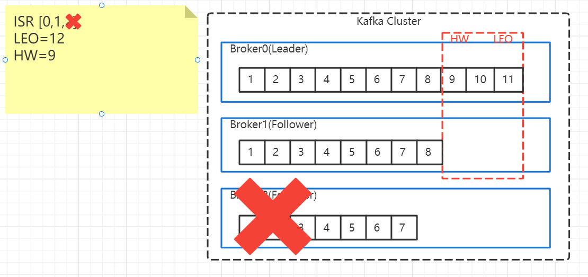
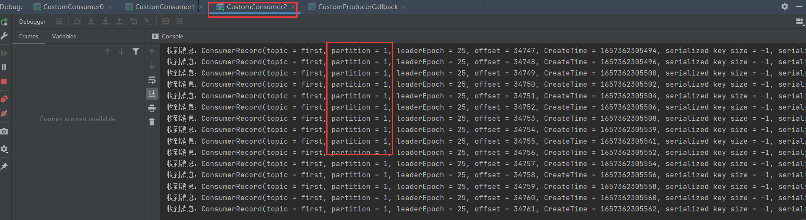

# Kafka-基础

> Kafka是基于发布/订阅的消息 队列，主要用于大数据实时处理领域，Kafka是一个开源的分布式事件流平台，被数千家公式用于高性能数据管道、流分析、数据集成、关键任务应用等

## 消息队列类型

> 目前在企业中比较常见的消息队列重排主要有Kafka、ActiveMQ、RabbitMQ、RocketMQ等
>
> 在大数据场景主要采用Kafka作为消息队列，在JavaEE开发中主要用ActiveMQ、RabbitMQ、RocketMQ作为消息队列

## 基础架构

> Zookepper：注册中心，所有的Kafka都会注册到Zookeeper中进行管理Zookeeper中保存了broker信息和Leader/Follower信息，2.8.0后可以直接部署
>
> Kafka Cluster：一个Kafka集群，里面的每一个Broker就是一个Kafka示例
>
> Broker：Kafka示例，在生产环境上就是每一台不同IP的主机
>
> Topic XX：Kafka可将消息分类不同的Topic(主题)用相应的消费者消费
>
> Topic XX Parition X：主题分片，为了应对一些大量消息的Topic如果只是用一个消费者消费显然是不行的，所有Kafka支持将主题分成多个Parition(分片)分布在不同的主机上
>
> Leader/Follower：为了确保服务的高可用，Kafka可以对每一个Topic XX Parition X建立一个副本，Leader与Follower是分布在不同的Broker上的，确保某个主机出问题了消息仍然能被消费
>
> Producer：消息生产者一个生产者可以生成不同主题的消息，Kafka收到后会将消息入到不同分片
>
> Consumer Group：消息消费者组，每个消费者组会包含多个消费者，消费者组中多个消费者不能同时消费一同的Topic XX Parition X
>
> Consumer ：消费者，指定消费某个Topic XX Parition X

## 单机/集群部署

[Linux-Kafka单机部署](../分布式中间件专栏/Liunx-Kafka单机部署.md)

[Linux-Kafka集群部署](../分布式中间件专栏/Liunx-Kafka集群部署.md)

## 脚本使用

> 在Kafka的bin目录下有很多脚本，通过这些脚本我们可以操作Kafka进行消息生产、消费、主题创建等

### 主题命令行操作

> 使用`bin/kafka-topics.sh`脚本可以操作主题，常用命令如下

#### 常用命令

| 参数                                               | 说明                           |
| -------------------------------------------------- | ------------------------------ |
| --bootstrap-server <String: server to  connect to> | 连接Kafka Broker主机名称和端口 |
| --topic <String: topic>                            | 操作的topic名称                |
| --create                                           | 创建主题                       |
| --delete                                           | 删除主题                       |
| --alter                                            | 修改主题                       |
| --list                                             | 查看主题列表                   |
| --describe                                         | 查看主题描述信息               |
| --partitions <Integer: # of partitions>            | 设置分区数                     |
| --replication-factor <Integer: replication factor> | 设置分区副本                   |
| --config <String: name=value>                      | 更新系统默认的配置             |

#### 列表查询

~~~shell
#查看集群主题列表
./bin/kafka-topics.sh --bootstrap-server 192.168.100.101:9092 --list
~~~
#### 创建主题
~~~shell
#创建名为first主题，1个分区，3个副本
./bin/kafka-topics.sh --bootstrap-server 192.168.100.101:9092 --topic first --create --partitions 1 --replication-factor 3
~~~
#### 主题信息
~~~shell
#查看first主题，详细信息
./bin/kafka-topics.sh --bootstrap-server 192.168.100.101:9092 --topic first --describe
~~~

#### 修改主题
~~~shell
#修改主题分区数（只能增加不能减少）
./bin/kafka-topics.sh --bootstrap-server 192.168.100.101:9092 --topic first --alter --partitions 3
~~~

> 修改完毕后分区有所增加

### 生产者命令行操作

> 使用`bin/kafka-console-producer.sh`脚本可以操作主题，常用命令如下

| 参数                                               | 说明                           |
| -------------------------------------------------- | ------------------------------ |
| --bootstrap-server <String: server to  connect to> | 连接Kafka Broker主机名称和端口 |
| --topic <String: topic>                            | 操作的topic名称                |

#### 发送消息

~~~shell
#连接kafka 往first主题发送消息
./bin/kafka-console-producer.sh --bootstrap-server 192.168.100.101:9092 --topic first
~~~

### 消费者命令行操作

> 使用`bin/kafka-console-consumer.sh`脚本可以操作主题，常用传输如下

| 参数                                               | 说明                           |
| -------------------------------------------------- | ------------------------------ |
| --bootstrap-server <String: server to  connect to> | 连接Kafka Broker主机名称和端口 |
| --topic <String: topic>                            | 操作的topic名称                |
| --from-beginning                                   | 从最早的消息开始消费           |

#### 消费消息

~~~shell
#增量消费主题消息
./bin/kafka-console-consumer.sh --bootstrap-server 192.168.100.101:9092 --topic first
~~~

~~~shell
#增量消费以及之前的主题消息
./bin/kafka-console-consumer.sh --bootstrap-server 192.168.100.101:9092 --topic first --from-beginning
~~~

## Producer生产者

> Kafka中消息的生产者，生产消息后会经过拦截器、序列化器、分区器，分区是在生产者端盖的分区器完成的，分好区的数据会被先放入到生产者内存，有专门发送数据的线程将数据发送给kafka

### 消息发送流程

> 生产者线程main
>
> 首先生产者生成消息后调用send方法，然后会经过拦截器、序列化器、分区器，分区器会对消息进行分区放入不同的本地队列，本地队列保存在计算机的内存中，每个队列32m，每16k数据形成一批消息
>
> sender线程
>
> 专门从内存中获取数据发送到kafka集群中，这里有2个主要参数
>
> batch.size：只有数据累加到batch.size之后，sender线程才会发送数据到kafka，默认16k
>
> linger.ms：如果数据一直都没达到batch.size，sender可以设置等待时间linger.ms，到了设定时间后就会发送数据，单位ms，默认是0ms，表示默认情况下内存不会保留数据有数据就会被发送
>
> Network Client：里面保存着数据已发送等待应答的请求，每个broker最大缓存5个请求
>
> Selector：选择器，由于与Kafka集群进行网络通信，发消息与收ack都通过这里，当收到ACK成功消息后会清除Network Client中的请求和内存中的batch数据，若失败会重试，重试次数可设置
>
> 

### 异步消息案例

> 异步消息生产者案例

### 同步消息案例

> 在异步消息之后加上get方法后表示同步消息

### 事务消息案例

> 生产者在使用事务功能时，必须先自定义一个唯一的transactional.id，有了事务id即使客户端挂掉了重启后也能继续未完成的事务

### 生产者分区器

> Kafka生产者使用时拦截器与序列化器很少需要配置，最主要的就是分区器，分区器可以将海里的数据按照分区切割成一块数据存储在多台的broker上，合理的控制分区任务，可以实现负载均衡

### 默认分区规则

> DefaultPartitioner即默认的生产者分区器，具体的说明如下

**指定分区**

> 调用如下方法着会触发第一种策略，先指定的分区发送消息

 **未指定分区，存在Key**

> 调用如下方法着会触发第二种策略，取key的has值模与分区大小，得出向那个分区发消息

**未指定分区，无key**

> 调用如下方法着会触发第三种策略，使用一个分区一直发，直到这个分区批次满了(16k)，随机切换一个分区(一定不能是刚刚用过的分区)，在切换的新分区下一直发直到下一次满了再次随机切换这样一种轮回下去

### 自定义分区器

> 在某些特点的业务下默认分区器无法满足需求，可以实现Partitioner接口自定义实现分区器

### 高吞吐生产者

> 在生产环境下调整如下出可以控制生产者的吞吐量，但是修改需要根据时间情况
>
> batch.size 批次大小，默认16k
>
> linger.ms 等待时间改为5-100ms
>
> compression.type 压缩snappy
>
> RecordAccnumulator 缓冲区大小，修改未64m

~~~java
//RecordAccnumulator 缓冲区大小，默认32m
properties.put(ProducerConfig.BUFFER_MEMORY_CONFIG,1024 * 1024 * 64); //64m
//batch.size 批次大小，默认16k
properties.put(ProducerConfig.BATCH_SIZE_CONFIG,1024 * 16); //16k
//linger.ms 等待时间改为5-100ms
properties.put(ProducerConfig.LINGER_MS_CONFIG,1); //1ms
//compression.type 压缩snappy
properties.put(ProducerConfig.COMPRESSION_TYPE_CONFIG,"snappy");
~~~

### 数据可靠性

> 通过应答ack可以确保数据可靠性，可靠性从左往又依次递增 0 > 1 >  -1
>
> 0：生产者发来的数据，无需等落盘应答
>
> 1：生产者发来的数据，Leader收到应答
>
> -1：生产者发来的数据，Leader和ISR队列都收到后才应答
>
> `ISR可理解为当前存活Broker,如图Leader位于Broker1 ISR 1,2,0当ACK-1时需要ISR队列中的全部Broker都收到消息才会返回，如果ISR中有Broker 30秒没有心跳会被踢出ISR队列 `

**数据可靠方案**

> 数据可靠性的方案有3个，显然第三种最安全的方案
>
> 1. 最可靠，数据可能会重复=ACK级别-1+分区副本大于等于2+ISR应答最少副本数大于等于2
>
> 2. 数据不可能重复，不可靠=ACK设置0
>
> 3. 最可靠，不可能重复(0.11版本后重大更新) = 幂等性+(ACK级别-1+分区副本大于等于2+ISR应答最少副本数大于等于2)
>
> `幂等性判断标准，每条消息都根据PID+Partition+SeqNumber组合，Broker只会持久化一条，幂等性开关默认是打开的无需手动打开，可以通过enable.idempotence设置false关闭`

## Broker

### Zk中的kafka信息

> 这里给大家推荐一个ZK可视化工具 PrettyZoo`https://github.com/vran-dev/PrettyZoo/releases`，这个工具使用很简单

| 路径                                           | 说明                                  |
| ---------------------------------------------- | ------------------------------------- |
| /kafka/brokers/ids                             | 保留着当前存活的节点broker.id         |
| /kafka/brokers/topics/first/partitions/0/state | 记录那个节点是leader，以及那些isr可用 |
| /kafka/controller                              | 辅助选举Leader                        |

### Broker注册流程

### 节点数据转移

> 新节点的添加这里就说了，只需要启动一个kafka连接相同的zookeeper即可，这里要说的是新节点服役后的负载均衡问题，Kafka集群中新增的节点不会将旧节点的主题信息同步过来，但是有很多情况下新增节点就是为了能缓解旧主题消息太多的压力，那么要想新增节点能够获取到其它旧节点主题信息就需要手动做负载均衡

**旧主题分区规则**

> 当前有一个主题test5，在一台2个broker节点是分布在broker 0和1上的，当有新节点2服役了我将test5主题数据重新分配到1,2节点上

**首先编写一个配置文件**

~~~shell
#在任意kafka旧节点上编写一个配置文件
vim topics-to-move.json
~~~

**生成负载均衡计划生成**

~~~shell
#--topics-to-move-json-file 需要做负载均衡的主题json文件
#--broker-list 重新分配到指定节点上，节点数量需要>=旧的分区数量
./bin/kafka-reassign-partitions.sh --bootstrap-server 192.168.100.101:9092 --topics-to-move-json-file topics-to-move.json --broker-list "1,2" --generate
~~~

**执行计划**

~~~shell
#生成的计划拷贝到json文件中
vim increase-replication-factor.json
~~~

~~~shell
#执行
./bin/kafka-reassign-partitions.sh --bootstrap-server 192.168.100.101:9092 --reassignment-json-file increase-replication-factor.json --execute
~~~

**验证**

~~~shell
#验证执行是否完成
./bin/kafka-reassign-partitions.sh --bootstrap-server 192.168.100.101:9092 --reassignment-json-file increase-replication-factor.json --verify
#验证分区是否改变
./bin/kafka-topics.sh --bootstrap-server 192.168.100.101:9092 --topic test5 --describe
~~~

### 分区副本解释

> 副本优点：可用提升提升数据的可靠性，默认情况下副本是1个，在生产环境一般设置为2个确保数据的可靠性
>
> 副本缺点：若副本太多会增加磁盘存储口径，增加网络上数据传输，降低效率
>
> Kafka中副本分为：leader和follower，生产者只会把消息发往leader然后follower向leader同步数据
>
> Kafka中分区副本全部统称为AR(Assigned Repllicas) = ISR+OSR
>
> * ISR：表示和leader保持同步的follower集合，如果follower长时间未向leader发送心跳或同步数据，则该follower将被踢出ISR，该时间阈值由replica.lag.time.max.ms参数设定，默认30S，leader发生故障之后就会从ISR中选举新的leader
>
> * OSR：表示Follower与Leader副本同步时，杨长春过多的副本

### Leader选举规则

> 创建一个test6主题3分区3副本，查看当前主题详细信息，可以看到当前每个分区leader都是平均分布在3台机器上

**关闭其中一个节点**

> 假如将broker2主机关闭，猜想一下那个broker会成为leader，通过查看被关闭分区Replicas值是[2,1,0]，当该分区被关闭后leader就是isr队列存活的，在ar中排在最前的broker1成为

> broker2关闭后可以看到isr队列的2节点已经被移除，并且broker1成为leader与预测的一样

### Follower故障恢复处理

**前置知识**

> 假如一个Follower在故障宕机后过了几分钟后又恢复了，那么消息岂不是错乱了？Kafka是如何应对这样的情况让故障恢复的Follower同步Leader的消息的呢？
>
> 我们看下图，图中有3个Broker，id=0是Leader可以看到每个Broker中的消息长度都不一样但是可以确定的是Leader消息是最多的，那么消费者能消费到哪里的消息呢，答案是5因为6-9消息尚未完成同步到Follower所以消费者是不能消费的，这里就引入了一个HW与LEO的概念
>
> LEO(Log End Offse)：每个副本最后一个offset，LEO其实就是最先的offset+1
>
> HW(High Watermark)：所有副本最小的LEO

**Broker2宕机**

> 当Broker2宕机后，首先ISR队列的2会被移除，并且Broker0/1继续工作，HW与LEO也继续往后移动

**Broker2恢复**

> Broker2恢复时不会立刻在ISR队列中显示，而是先将之前HW-LEO中的数据全部删除，如何去同步直到自己的LEO追上了Leader的HW后，恢复的Broker才会被假如ISR队列，这样就能保住所有的副本对消费者可见的都是8

### Leader故障

> 当Leader发生了故障后会立刻从ISR队列移除，接下来就由Broker1成为Leader，由于Broker1成为了Leader那么其它的Follower的HW需要与Leader的LEO一致，所以多余的数据需要被丢弃，导致最初Leader接收的数据丢失

### 手动调整Follower分区

> Kafka某人的分区与副本是均匀分布的，但是生产环境上由于各电脑配置不一样所以需要根据不同的配置设置不同数量的分区
>
> 假如当前有一个主题test7，3个分区2个副本，可以看到副本都平均分布在3台服务器上，但是由于2号服务器配置较低，我想将副本都放在1,2号服务器上

**首先编写一个配置文件**

~~~shell
#创建一个json格式的配置文件
vim increase-replication-factor.json
~~~

~~~shell
#执行
./bin/kafka-reassign-partitions.sh --bootstrap-server 192.168.100.101:9092 --reassignment-json-file increase-replication-factor.json --execute
~~~
**验证**

~~~shell
#验证执行是否完成
./bin/kafka-reassign-partitions.sh --bootstrap-server 192.168.100.101:9092 --reassignment-json-file increase-replication-factor.json --verify
#验证分区是否改变
./bin/kafka-topics.sh --bootstrap-server 192.168.100.101:9092 --topic test5 --describe
~~~

### 自动调整Leader分区

> Kafka在生成主题时会让各分区的Leader平均分布在各服务器上，但是由于多次宕机重启后可能会出现多个Leader同时出现在一台主机上，这样会导致存在多个Leader的节点压力过大，集群负载不均衡，其实Kafka是会对负载不均衡的Leader重新分配的通过以下几个参数可以调整

| 参数                                    | 说明                                                         |
| --------------------------------------- | ------------------------------------------------------------ |
| auto.leader.rebalance.enable            | 是否开启自动Leader平衡，默认是true                           |
| leader.imbalance.per.broker.percentage  | 每个broker允许不平衡leader的比率，如果超过这个比率会触发leader平衡，默认10% |
| leader.imbalance.check.interval.seconds | 检查负载是否平衡的间隔时间，默认300s                         |

### 手动副本增加
> 有时候刚刚开始副本存的很少，后面发现数据很重要需要跟多的副本，那么就需要增加副本，如当前主题test7只有2个副本，我希望增加到3个

**首先编写一个配置文件**

~~~shell
#创建一个json格式的配置文件
vim increase-replication-factor.json
~~~

~~~shell
#执行
./bin/kafka-reassign-partitions.sh --bootstrap-server 192.168.100.101:9092 --reassignment-json-file increase-replication-factor.json --execute
~~~
**验证**

~~~shell
#验证执行是否完成
./bin/kafka-reassign-partitions.sh --bootstrap-server 192.168.100.101:9092 --reassignment-json-file increase-replication-factor.json --verify
#验证分区是否改变
./bin/kafka-topics.sh --bootstrap-server 192.168.100.101:9092 --topic test5 --describe
~~~

## Kafka文件系统

### 文件存储机制

> Kafka的Topic是逻辑的概念，而Partition是物理上的概念，每一个Partition对应于一个log文件，log文件是用于存储生产者发送的数据的，生产者会将数据不断的追加到log的末端，为了防止log文件过大Kafka采用了分片+索引的方式将每个Partition才分成多个segment，每个segment会包含着.index文件.log文件和.timeindex文件等(通过各个文件名可以发现文件名都是以当前第一条消息的offset命名的)，这些文件都在同一个文件夹下，该文件夹命名是topic名称+分区序号，例如first-0

### segment包含文件

> segment文件夹中包含着几个重要的后缀文件

| 文件后缀   | 说明           |
| ---------- | -------------- |
| .log       | 日志文件       |
| .index     | 偏移量索引文件 |
| .timeindex | 时间索引文件   |

### 查看文件内容

> 由于文件内容都是序列化后的，无法阅读如果想阅读需要使用kafka提供的命令反序列化后即可查看

~~~shell
#查看文件内容
./bin/kafka-run-class.sh kafka.tools.DumpLogSegments --files datas/first-0/00000000000000000000.log
~~~

### index与log文件关系

> index使用的是稀疏索引，大约每往log文件写入4kb数据，会往index文件中写入一条索引，参数log.index.interval.bytes默认4kb
>
> 假设需要找到log文件中offset=587的数据，那么首先找到距离587最近的index文件000000522.index，然后找到在522的基础上+相对offset=587的数据即相对offset是65的数据，拿到postition后去到log文件中直接得postition=6410的数据

### 文件清除策略

> 在kafka中默认会清理7天前的数据，当然可以通过如下配置修改
>
> 参数设置的优先级是 ms>minutes>hours，设置了优先级高的时间单位会用优先级高的作为清理策略

| 参数                            | 说明                    |
| ------------------------------- | ----------------------- |
| log.retention.hours             | 最低优先级小时，默认7天 |
| log.retention.munutes           | 分钟                    |
| log.retention.ms                | 最高优先级毫秒          |
| log.retention.check.interval.ms | 设置检查周期，默认5分钟 |

**超期数据处理规则**

> 对于超期的数据，有2个策略delete和compact
>
> * delete：删除数据
> * compact：压缩数据
>
> 通过log.cleanup.policy=delete可以修改不同的处理规则

**delete说明**

> delete的清理策略有2种
>
> 1. 基于时间清理，默认打开：以segment中所记录的最大时间戳的记录作为该文件的时间戳，达到条件后删除该文件
> 2. 基于大小清理，默认关闭：超过设置大小的日志，删除最早的segment

**compact说明**

> compact对数据进行压缩
>
> 压缩规则：对于相同的key不同值的数据，只保留最后一个版本的数据
>
> 应用环境：如一些key是用户id，value是用户资料的这些数据旧数据是无用的可以使用压缩方式清理过期数据

## consumer消费者

> kafka的消费者采用的是从broker主动拉取数据
>
> kafka的消费者可以分2中，单独一个消费者、消费者组
>
> 单独消费者：单个消费者无归属组，可以同时向多个broker拉取Topic X Parition X消费
>
> 消费组：其实就是由多个消费者组成的在消费者组中的每个消费者也可以同时向多个broker拉取Topic X Parition X消费，但是不能有多个消费者同时消费相同的Topic X Parition X
>
> 每个消费者消费到那条记录(offset)，在0.9之前版本是存在zookeeper上，现在新版都放在kafka的一个系统主题`_consumer_offse`

### 消费者组

> ConsumerGroup(消费者组)：由多个consumer组成形成一个消费者组，当有几个消费者的groupid相同那么这几个消费者就会形成消费者组，消费者组特点
>
> 1. 消费者组内每个消费者负责消费不同分区的数据，一个分区数据只能由一个组内消费消费
> 2. 消费者组之间相互不影响，所有消费者都属于某个消费者组，即消费者是逻辑上的一个订阅者

### 消费者组初始化流程

> 消费者组的初始化流程需要通过broker上的一个coordinator组件来赋值消费者组，首先消费者会需要计算连接那个broker上的coordinator，计算规则 = groupid的hashcode值 % 50(\_\_consumer\_offsets的分区数默认值)，由于多个消费者组的groupid一样所有得出的\_\_consumer\_offsets是一致的，得出的值找到对应\_\_consumer\_offsets分区所在的broker发送joinGroup请求
>
> `__consumer_offsets分区是用于记录消费者消费消息的offset`

> 消费者组的消费者经过计算纷纷都连接上了coordinator后，coordinator就会在这个组中随机抽取一个消费者将其设为leader，并且发送收集到的消费者情况与topic发送给leader消费者，leader消费者收到消息后会生成相应的消费计划

>  coordinator收到leader的消费计划后，会将计划转发给组中的每一个消费者，其它消费者收到计划后根据计划去指定的topic X parotopn X拉取消息消费
>
> 每个消费者会和coordinate保持一个心跳(默认3s)，当发现异常情况消费者无法消费时会重新计算消费计划
>
> 1. 一旦超时(session.timeout.ms=45s)，该消费者会被移除，并触发再平衡
> 2. 消费者处理消息时间过长(max.poll.interval.ms-5min)也会触发再平衡

### 消费者工作流程

> 消费者的消费数据流程如下
>
> 1. 首先消费者会发送send消息给broker，发消息时携带着几个重要参数，最小抓取大小、最大抓取大小、最小一直未达到500ms后抓一次
> 2. broker将消息发送到消费者的completedFetches队列中
> 3. 消费者从队列中获取消息进行反序列化、拦截器、数据处理

### 单个主题消费者

> 编写一个主题消费者，该消费者会消费该主题中的所有分片数据

> 当生产者往first主题发送消息时，消费者就可以拉取到消息并且消费

### 单个主题+分区消费者

> 主题+分区消费者会指定主题+指定分区的数据

> 消费者只会消费分区0的数据

### 消费者组

> 设置消费者组，只需要在启动消费者是将它们都配置为相同的组id即可

> 相同消费者组中的每一个消费者都会被分到消费不同分区的数据，不存在多个消费者消费相同主题+分区的消息

### 分区分配再平衡规则

> 在前面初始化消费者中了解到消费者组在初始化时leader会制定消费计划，leader是根据什么策略进行分区分配呢
>
> kafka有四种主流的分区分配策略：Range、RoundRobin、Sticky、CooperativeSticky
>
> 可以通过配置参数partition.assignment.strategy修改分区的分配策略。默认的策略是Range+CooperativeSticky

#### Range策略

> Range是对每个topic而言的，首先对同一个topic里面的分区按照序号进行排序，对消费者也按照字母顺序进行排序
>
> 通过partition数/consumer数，来决定每个消费者应该消费几个分区，如果除不尽，那么前面的几个消费者会多消费一个分区
>
> 假如：当前有7个分区，3个消费者，先将分区与消费者按顺序排好，用7/3=2余1(除不尽)，那么c0消费者需要多消费一个分区，其余消费者每人消费2个分区
>
> 再平衡策略：当consumerA宕机后会将consumerA未消费的消息全部发给consumerB完成消费，超过45s Coordinator感知，然后重新使用Range策略对剩余的2个消费者重新制定消费计划

#### RundRobin策略

> RundRobin策略是把所有的partition和所有的consumer都列出来，然后通过hashcode进行排序，最后通过轮询算法来分配partition给消费者
>
> 再平衡策略：当consumerA宕机后会将consumerA未消费的消息通过轮询的方式分配给B、C消费者，超过45s Coordinator感知到会重新使用RundRobin策略对消费者B、C重新分配

### 消息offset

#### 自动offset

> kafka提供了自动提交offset的功能，自动offset的相关参数
>
> enble.auto.commit：是否开启自动提交offset功能，默认是true
>
> auto.commit.interval.ms：自动提交offset的时间间隔，默认是5s
>
> 自动offset提交逻辑：消费者每隔5s会向broker提交一次offset，提交的是当时获取到的offset，所以消费者实际消费的offset与broker上记录的offset会有一定的延迟，不过可以通过锁定offset的间隔来确保一致性

#### 手动提交offset

> 前面自动自动offset难免还是有点不精准，可以使用手动提交精准控制offset

**同步提交**

> 必须等待offset提交完毕，再去消费下一批数据

**异步提交**

> 发送完毕offset后，就开始消费下一批数据了

#### 指定offset消费

> 消费者连接上kafka后需要告知brocker从那个offset开始消费，可通过修改如下参数改变消费起始点
>
> auto.offset.reset=earliest/latest/none，默认是lastest
>
> earliest：自动将偏移量重制为最早的偏移量，就是从最开始消费
>
> latest：自动将偏移量重制为最新的偏移量
>
> none：如果未找到消费者组的先前偏移量，则抛出异常

**自定义offset消费**

> 除了上面的offset也可以自定义重指定的offset处开始消费

#### 指定时间消费

> 假如某一个时间点有几个小时数据异常，需要消费者重新消费就可以指定消费者重新消费某个时间段的消息

#### 重复消费

> 重复消费场景：offset自动提交当一个消费者消费到offset=2时，这时也正好触发了offset自动提交当前记录值2，消费者继续消费消息，假如offset未到下一个5秒时消费者突然宕机了这时消费者消费到了4，由于未触发自动offset消费者就宕机了所以broker种的`consumer_offset=2`，假如有其它消费者接替或当前消费者恢复了都会从offset=2处开始消费，那么3与4offset消息就会被重复消费

#### 漏消费

> 漏消费场景：设置offset手动提交，消费者在消费完毕数据后提交offset，提交的一瞬间请求发送出去了，问题是消费者处理的数据在内存中还没持久化到磁盘，这一瞬间被进程被kill了，那么offset已经提交成功了，然而消费者处理的数据在内存中丢失了
