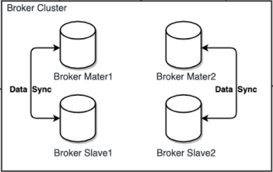

# RocketMQ单机部署

> 这里说到的集群部署主要是Broker集群的部署，因为NameServer集群与生产/消费者集群部署方式都比较简单，但是本文也会提到不会做过多的步骤演示

## NameServer集群部署

## 生产/消费者集群部署

## Broker集群部署

> Broker是RocketMQ集群配置中难度最高的集群配置，在集群搭建前首先需要了解几样东西，数据复与磁盘IO策略

### 前置知识

#### 数据复与磁盘IO策略

> 复制策略：Broker的Master与Slave间的数据同步方式，分为同步复制与异步复制
>
> * 同步复制：消息写入master后，master会等待slave同步数据成功后才会向producer(消费者)返回成功ACK
> * 异步复制：消息写入master后，master立即回向producer(消费者)返回成功ACK，无需等待Slave同步数据成功
>
> 持久化策略：Broker中消息的从内存持久化到磁盘的方式，分为同步持久化与异步持久化
>
> * 同步持久化：当消息持久化到broker的磁盘后才算消息写入成功
> * 异步持久化：当消息写入到broker内存后即表示消息写入成功，无需等待消息持久化到磁盘
>
> `总结：如当前复制策略是同步，持久化策略也是同步，那么一个生产者发送消息给broker后，消息写入给master并且slave完成数据同步，并且master与slave都把数据持久化到磁盘后才会返回成功ACK给生产者，告诉生产者可以发送下一条消息了`

#### 集群部署模式分类

> Broker集群的部署模式是分好几种每一种都有不同的特点，下面分别介绍一下常见的几种集群模式，并且再这里面涉及到一个知识点`RAID10磁盘阵列`由于该知识点不属于RocketMQ范围内所以不做过多的说明，需要了解的小伙伴可直行百度
>
> RAID10磁盘阵列粗略说明：一种高性能，高可靠的存储技术                                                                             

##### 多Master模式

> 该模式下的Broker集群仅有多个master组成，同一个Topic的各个Queue会发布再各个的master上
>
> 总结：这种模式缺点显而易见，那就是无法保证高可用如果有一个master带着他所收到的消息一起宕机了，那么那个master中的消息将无法被消费了

##### 多Master多Slave模式-异步复制

> 该模式下的Broker集群由多个Master构成，每个Master又配置了多个slave(在配置了RAID磁盘阵列的情况下，一个master一般配置一个slave即可)，master与slave是主备关系，master负责处理消息的读写请求，而slave只负责消息的备份，当master宕机后slave就会切换成master角色
>
> 异步复制策略：指当消息写入到master成功后，master立刻返回producer成功ACK，无需等待slave数据同步成功
>
> 特点：该模式的最大特点是，当master宕机后slave能够自动切换master，不通过由于slave与master同步具有短暂的延迟(毫秒级)，所以master宕机后，可能会存在少了的数据还没同步到slave中造成数据丢失

##### 多Master多Slave模式-同步双写

> 该模式与异步复制模式相比不同点
>
> 1. 当消息写入到master后，master会等待slave写入成功后才返回producer成功ACK，无需等待slave数据同步成功
> 2. `重点注意该模式有一个重大问题!!! 对于目前版本，master宕机，slave不会自动切换到master`

##### 最佳部署模式

> 总结集群的几种集群模式后最佳的集群模式是**多Master多Slave模式-异步复制**，这也最广泛也是最可靠的模式
>
> 使用多Master多Slave模式-异步复制模式，并且为mster配置RAID10磁盘阵列，然后给master配置一个slave，即利用RAID10的高效，又解决了可能会影响订阅的问题

### 集群搭建

#### 双主双从-异步复制模式

> 双主双从-异步复制模式也是使用最多的模式，也正是官方图中的集群模式

#### 前期准备

> 1. 准备2台Linux系统
>
> 2. 下载RocketMQ压缩包：`https://rocketmq.apache.org/dowloading/releases/`
>
> 3. 将压缩包拷贝到自己喜欢的目录
> 4. 解压压缩包`unzip rocketmq-all-4.9.0-bin-release.zip`

#### 修改配置文件

> 进入到RocketMQ的conf目录下可以看到里面默认提供了3种配置的模板
>
> 1. 2m-2s-async：双主双从-异步复制
> 2. 2m-2s-sync：双主双从-同步复制
> 3. 2m-noslave：双主无从
>
> 左边为主机A
>
> 1. 修改`broker-a.properties`配置文件，本机(主机A)生成一个Master(主节点)
> 2. 修改`broker-b-s.properties`配置文件，本机(主机A)生成一个主机B的Slave(从节点)，它的Master是主机B
>
> 右边为主机B
>
> 1. 修改`broker-b.properties`配置文件，本机(主机B)生成一个Master(主节点)
> 2. 修改`broker-a-s.properties`配置文件，本机(主机B)生成一个Slave(从节点)，它的Master是主机A

##### 主机A配置

###### 修改broker-a.properties

~~~shell
# 整个broker集群的名称，或者说是RocketMQ集群名称(一般情况下都是同一个)
brokerClusterName=DefaultCluster
# 指定的master-slave集群的名称(小集群名称)， 整个broker下会有多个master-slave集群
brokerName=broker-a
# master的brokerId为0(非0都是slave)
brokerId=0
# 指定删除消息存储过期的文件的时间为凌晨4点
deleteWhen=04
# 指定未发生更新的消息存储文件的保留时长为48小时，48小时后过期，会被删除
fileReservedTime=48
# 指定在当前broker为MASTER异步复制模式
brokerRole=ASYNC_MASTER
# 指定持久化策略为异步持久化
flushDiskType=ASYNC_FLUSH
# 指定NameServer的地址
namesrvAddr=192.168.100.101:9876;192.168.100.102:9876
# 指定broker对外提供服务的端口，即与生产者消费者通讯的端口，由于默认是10911(如果1机部署多broker必须指定否则冲突)
listenPort=10911
# 指定消息存储相关路径不指定默认都在~/store下(如果1机部署多broker必须指定否则冲突)
storePathRootDir=~/store-m
storePathCommitLog=~/store-m/commitlog
storePathConsumeQueue=~/store-m/consumequeue
storePathIndex=~/store-m/index
storeCheckpoint=~/store-m/checkpoint
abortFile=~/store-m/abort
~~~

###### 修改broker-b-s.properties

~~~shell
# 整个broker集群的名称，或者说是RocketMQ集群名称(一般情况下都是同一个)
brokerClusterName=DefaultCluster
# 指定的master-slave集群的名称(小集群名称)， 整个broker下会有多个master-slave集群
brokerName=broker-b
# 非0表示自己为slave
brokerId=1
# 指定删除消息存储过期的文件的时间为凌晨4点
deleteWhen=04
# 指定未发生更新的消息存储文件的保留时长为48小时，48小时后过期，会被删除
fileReservedTime=48
# 指定在当前broker为SLAVE
brokerRole=SLAVE
# 指定持久化策略为异步持久化
flushDiskType=ASYNC_FLUSH
# 指定NameServer的地址
namesrvAddr=192.168.100.101:9876;192.168.100.102:9876
# 指定broker对外提供服务的端口，即与生产者消费者通讯的端口，由于默认是10911
# 并且当前是一台主机上部署了2个broker所以要修改一下否则和上面的broker-a.properties端口冲突
listenPort=11911
# 指定消息存储相关路径不指定默认都在~/store下(如果1机部署多broker必须指定否则冲突)
storePathRootDir=~/store-s
storePathCommitLog=~/store-s/commitlog
storePathConsumeQueue=~/store-s/consumequeue
storePathIndex=~/store-s/index
storeCheckpoint=~/store-s/checkpoint
abortFile=~/store-s/abort
~~~

##### 主机B配置

> 主机B与主机A配置类似所以这里我就不加配置注释了

###### 修改broker-b.properties

~~~shell
brokerClusterName=DefaultCluster
brokerName=broker-b
brokerId=0
deleteWhen=04
fileReservedTime=48
brokerRole=ASYNC_MASTER
flushDiskType=ASYNC_FLUSH
namesrvAddr=192.168.100.101:9876;192.168.100.102:9876
listenPort=10911
storePathRootDir=~/store-m
storePathCommitLog=~/store-m/commitlog
storePathConsumeQueue=~/store-m/consumequeue
storePathIndex=~/store-m/index
storeCheckpoint=~/store-m/checkpoint
abortFile=~/store-m/abort
~~~

###### 修改broker-a-s.properties

~~~shell
brokerClusterName=DefaultCluster
brokerName=broker-a
brokerId=1
deleteWhen=04
fileReservedTime=48
brokerRole=SLAVE
flushDiskType=ASYNC_FLUSH
namesrvAddr=192.168.100.101:9876;192.168.100.102:9876
listenPort=11911
storePathRootDir=~/store-s
storePathCommitLog=~/store-s/commitlog
storePathConsumeQueue=~/store-s/consumequeue
storePathIndex=~/store-s/index
storeCheckpoint=~/store-s/checkpoint
abortFile=~/store-s/abort
~~~

##### 常用配置表

| 属性                            | 默认 | 说明                                                         |
| --------------------------------|---- | ------------------------------------------------------------ |
| brokerClusterName              | DefaultCluster | 整个broker集群的名称，或者说是RocketMQ集群名称(一般情况下都是同一个) |
| brokerName                    |   | 指定的master-slave集群的名称(小集群名称)， 整个broker下会有多个master-slave集群 |
| brokerId                       | 0 | 0表示master，大于0的表示slave                                |
| namesrvAddr                   | 4 | nameServer地址，分号分割 |
| defaultTopicQueueNums          | true | 默认为新建Topic所创建的队列数 |
| autoCreateTopicEnable          | true | 是否允许 Broker 自动创建Topic，建议生产环境中关闭 |
| autoCreateSubscriptionGroup   | true | 是否允许 Broker 自动创建订阅组，建议生产环境中关闭 |
| listenPort                    | 10911 | Broker对外提供服务的端口，即Broker与producer与consumer通信的端口 |
| haListenPort                  | 10912 | HA高可用监听端口，即Master与Slave间通信的端口，默认值为listenPort+1 |
| deleteWhen                    | 04 | 指定删除消息存储过期文件的时间为凌晨4点 |
| fileReservedTime              | 48 | 指定未发生更新的消息存储文件的保留时长为48小时，48小时后过期，将会被删除 |
| mapedFileSizeCommitLog        | 1073741824 | 指定commitLog目录中每个文件的大小，默认1G |
| mapedFileSizeConsumeQueue     | 300000 | 指定ConsumeQueue的每个Topic的每个Queue文件中可以存放的消息数量，默认30w条 |
| destroyMapedFileIntervalForcibly| 120000 | 在清除过期文件时，如果该文件被其他线程所占用（引用数大于0，比如读取消息），此时会阻止 此次删除任务，同时在第一次试图删除该文件时记录当前时间戳。该属性则表示从第一次拒绝删除 后开始计时，该文件最多可以保留的时长。在此时间内若引用数仍不为0，则删除仍会被拒绝。不过 时间到后，文件将被强制删除 |
| diskMaxUsedSpaceRatio          | 88 | 指定commitlog、consumequeue所在磁盘分区的最大使用率，超过该值，则需立即清除过期文 件 |
| storePathRootDir               | ~/store | 指定store目录的路径                             |
| storePathCommitLog           | ~/store/commitlog | commitLog目录路径                     |
| storePathConsumeQueue        | ~/store/consumequeue | consumeueue目录路径                |
| storePathIndex               | ~/store/index | index目录路径                             |
| storeCheckpoint             | ~/store/checkpoint | checkpoint文件路径                   |
| abortFile                   | ~/store/abort | abort文件路径                             |
| maxMessageSize              | 65536 | 指定消息的最大大小                                           |
| brokerRole                  |     | Broker的角色 ASYNC_MASTER(异步复制Master) SYNC_MASTER(同步双写Master) SLAVE(从节点) |
| flushDiskType                |    | 刷盘策略 1.ASYNC_FLUSH(异步刷盘) 2.SYNC_FLUSH(同步刷盘) |
| sendMessageThreadPoolNums    | 128 | 发消息线程池数量                                             |
| pullMessageThreadPoolNums    | 128 | 拉消息线程池数量                                             |
| brokerIP1                   |     | 强制指定本机IP，需要根据每台机器进行修改。官方介绍可为空，系统默认自动识别，但多网卡 时IP地址可能读取错误 |

#### 服务启动

##### 启动NameServer

> 执行`nohup sh bin/mqnamesrv &`命令启动nameServer，启动后使用`jps`命令查看若看到jvm进程表示启动成功

##### 启动2个Master

~~~shell
# 主机A执行该命令
nohup sh bin/mqbroker -c conf/2m-2s-async/broker-a.properties &
# 主机B执行该命令
nohup sh bin/mqbroker -c conf/2m-2s-async/broker-b.properties &
~~~

##### 启动2个Slave

~~~shell
# 主机A执行该命令
nohup sh bin/mqbroker -c conf/2m-2s-async/broker-b-s.properties &
# 主机B执行该命令
nohup sh bin/mqbroker -c conf/2m-2s-async/broker-a-s.properties &
~~~

