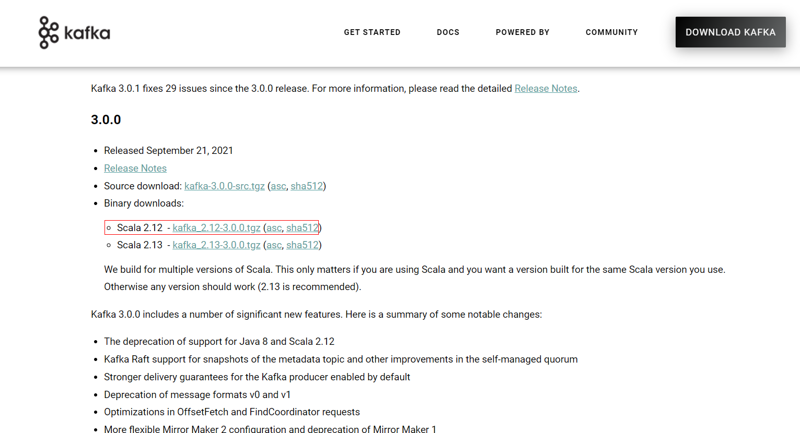
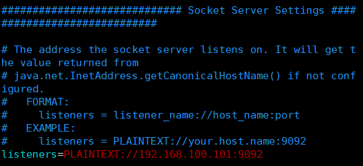

## Linux-Kafka单机部署

### 前置环境

[Zookeeper-快速入门](../分布式框架专栏/Zookeeper-快速入门.md)

#### 安装包下载

> 进入到 Apache Kafka：`https://kafka.apache.org/`官方，下载Kafka安装包

### 单机部署

#### 修改配置文件

~~~shell
#进入到config目录
cd kafka/config
#修改server配置文件
vim server.properties
~~~

**broker.id**

> broker.id是kafka的唯一标识，在集群环境下不能重复，当然这里是单机所有可以不该

**listeners**

> listeners修改监听的域名与端口

**log.dirs**

> log.dirs是Kafka数据文件，默认是保存在temp目录下的会丢失，需要修改路径

**zookeeper.connect**

> zookeeper.connect修改Kafka连接Zookeeper的地址，`IP,IP,IP/kafka`后面的`/kafka`是指定保存到Zookeeper的kafka目录下，这样方便管理

#### 启动项目

~~~shell
#进入到kafka的bin目录
cd /data/software/kafka/bin
#启动Kafka server 指定配置文件启动
./bin/kafka-server-start.sh -daemon config/server.properties
~~~

> 使用jps看到Kafka表示启动成功

