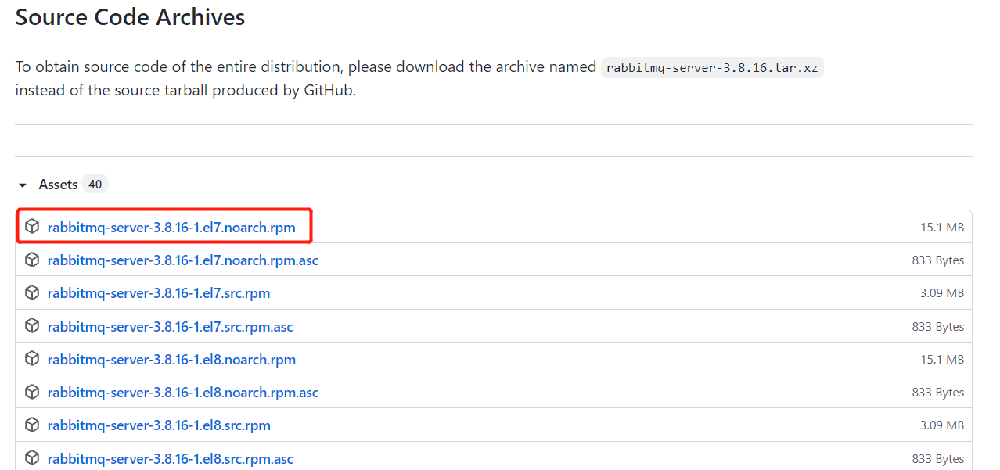

# RabbitMQ单机部署

**前置环境**

> 使用RabbitMQ那么需要准备Erlang环境才能运行，通过[Erlang安装包下载](https://packagecloud.io/rabbitmq/erlang/packages/el/8/erlang-24.1-1.el8.x86_64.rpm)下载对应的rpm包，并且拷贝到liunx上

**执行如下命令安装Erlang**

~~~shell
curl -s https://packagecloud.io/install/repositories/rabbitmq/erlang/script.rpm.sh | sudo bash
# 我这里使用的是23版本
sudo yum install erlang-23.2.1-1.el7.x86_64
~~~

> 注意安装的版本需要与RabbitMQ匹配否则安装RabbitMQ会出现如下错误
>
> 解决方案：`sudo yum install erlang-23.2.1-1.el7.x86_64`再次安装一下erlang安装相应的版本

**安装包下载**

> 进入到[RabbitMQ](https://github.com/rabbitmq/rabbitmq-server)官方Github，下载RocketMQ安装包
>
> 也可直接在Liunx上执行wget` https://github.com/rabbitmq/rabbitmq-server/releases/download/v3.9.7/rabbitmq-server-3.9.7-1.el8.noarch.rpm`获取压缩包

**执行如下命令安装RabbitMQ**

~~~shell
yum -y install socat
rpm -ivh rabbitmq-server-3.8.16-1.el7.noarch.rpm 
~~~

> 看到如下内容表示安装成功

## 常用命令

~~~shell
# 添加开机启动rabbitmq服务
chkconfig rabbitmq-server on
# 启动服务
/sbin/service rabbitmq-server start
# 查看服务状态
/sbin/service rabbitmq-server status
# 停止服务
/sbin/service rabbitmq-server stop
~~~

## 图形化界面安装

> 为了更加方便的操作，我们需要为rabbitmq安装一个图形化的管理界面，执行如下命令即可安装

~~~shell
# 首先停止rabbitmq服务
/sbin/service rabbitmq-server stop
# 安装图形化插件
rabbitmq-plugins enable rabbitmq_management
~~~

> 安装成功后通过访问本地的15672端口会进入一个后台的管理界面，默认账号密码是guest，可以发现是无法登录的请往下面看如何添加用户与权限

### 用户与权限

> 执行如下命令新增一个用户

~~~shell
# 创建账号
rabbitmqctl add_user admin 123
# 设置用户角色
rabbitmqctl set_user_tags admin administrator
# 查看当前创建订单用户列表
rabbitmqctl list_users
~~~

> 如下命令为设置权限

~~~shell
# 设置admin具有"/" 这个virtual host中所有资源的配置、写、读权限
# 例 rabbitmqctl set_permissions -p "/" admin ".*" ".*" ".*"
set_permissions [-p <vhostpath>] <user> <conf> <write> <read>
~~~

> 利用admin账号登录

