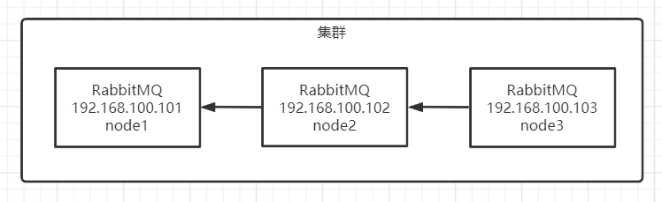
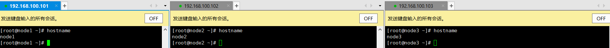
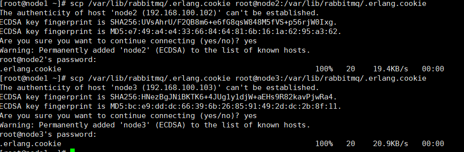
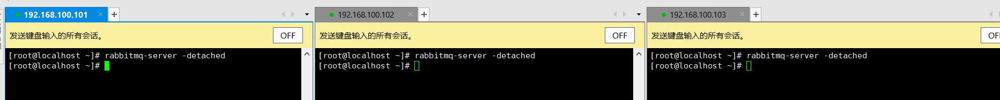
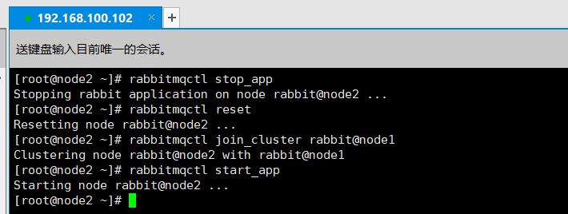
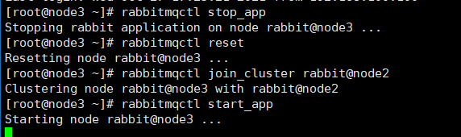
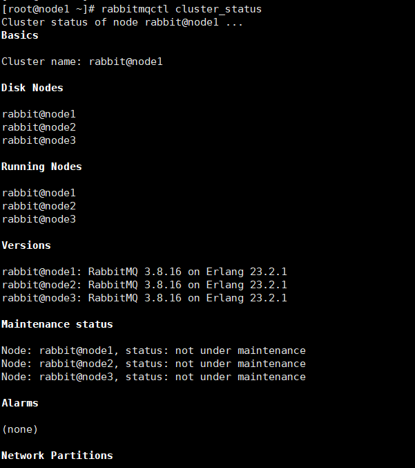
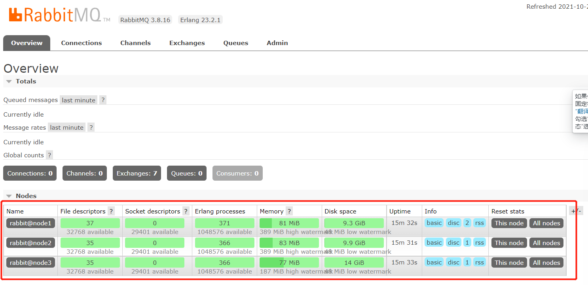
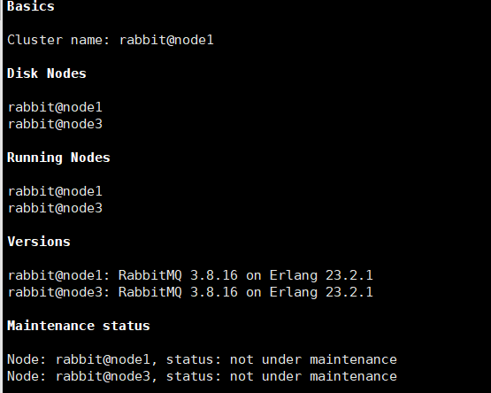

# Liunx-RabbitMQ集群部署

> 以下说明的是RabbitMQ集群部署，在部署集群之前首先需要准备3台机器，并且都安装上RabbitMQ单机版，如果未安装的可以阅读Liunx-RabbitMQ单机部署文章

[Liunx-RabbitMQ单机部署](https://blog.csdn.net/weixin_44642403/article/details/120931857)

## 搭建示意图

> 首先准备3台装有单机版的RabbitMQ的服务器，让102与103连接上101，3台MQ构成一个集群

## 修改主机HostName

~~~shell
#修改主机hostname
vim /etc/hostname
#修改主机host文件让各节点相互访问
#增加其它主机的IP与hostname
#192.168.100.101 node1
#192.168.100.102 node2
#192.168.100.103 node3
vim /etc/hosts
#重启服务器
reboot
~~~

## 拷贝cookie 

> 使用`scp /var/lib/rabbitmq/.erlang.cookie root@node:/var/lib/rabbitmq/.erlang.cookie `命令将erlang.cookie拷贝到另外的2台主机上，让3台主机的erlang.cookie保持一致
>
> `拷贝后记得重启一下rabbitmq`

## 重启MQ

> 使用`rabbitmq-server -detached`重启rabbitmq服务，宋代启动Erlang虚拟机和rabbitmq应用服务

## 加入集群

### 将节点2加入到集群

~~~shell
#停止RabbitMQ服务，但不会停止Erlang虚拟机
rabbitmqctl stop_app
#重置RabbitMQ服务
rabbitmqctl reset
#将当前节点加入到node1
rabbitmqctl join_cluster rabbit@node1
#只启动RabbitMQ服务
rabbitmqctl start_app
~~~

### 将节点3加入到集群

~~~shell
#停止RabbitMQ服务，但不会停止Erlang虚拟机
rabbitmqctl stop_app
#重置RabbitMQ服务
rabbitmqctl reset
#将当前节点加入到node1
rabbitmqctl join_cluster rabbit@node2
#只启动RabbitMQ服务
rabbitmqctl start_app
~~~

## 查看集群状态

> 使用`rabbitmqctl cluster_status`查看集群状态，可以看到当前集群有3个节点

## 重新设置用户

> 由于之前重置过rabbitmq使用现在需要重新添加用户，执行如下命令

~~~shell
# 创建账号
rabbitmqctl add_user admin 123
# 设置用户角色
rabbitmqctl set_user_tags admin administrator
# 设置admin具有"/" 这个virtual host中所有资源的配置、写、读权限
# 例 rabbitmqctl set_permissions -p "/" admin ".*" ".*" ".*"
set_permissions [-p <vhostpath>] <user> <conf> <write> <read>
~~~

### 登录控制面板

> 登录后可以在控制面板中看到集群的3个节点的信息

## 脱离集群

> 演示将node2脱离集群，node2主机上执行如下命令

~~~shell
#停止RabbitMQ服务，但不会停止Erlang虚拟机
rabbitmqctl stop_app
#重置RabbitMQ服务
rabbitmqctl reset
#只启动RabbitMQ服务
rabbitmqctl start_app
#查看集群状态
rabbitmqctl cluster_status
~~~

> node1主机上执行如下命令

~~~shell
#在node1机器上忘记到node2
rabbitmqctl forget_cluster_node rabbit@node2
~~~

> 再次查看集群信息，节点2已经脱离了

