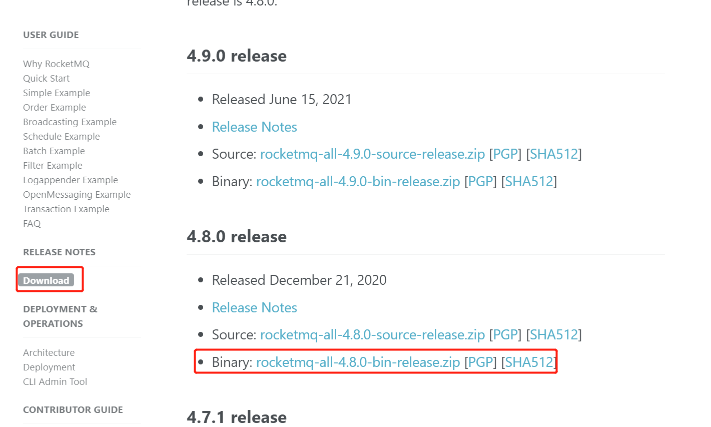
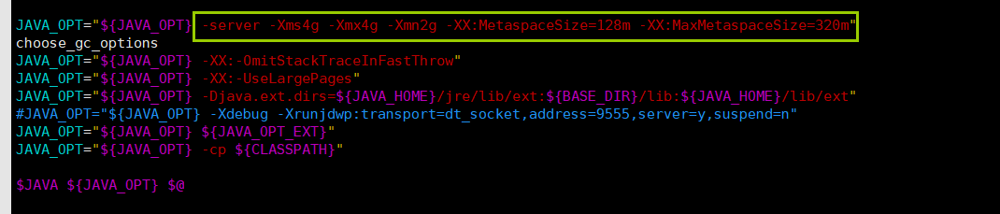
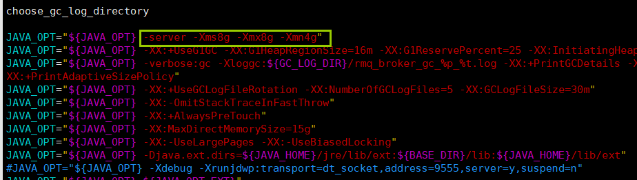
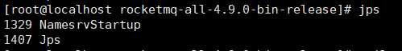
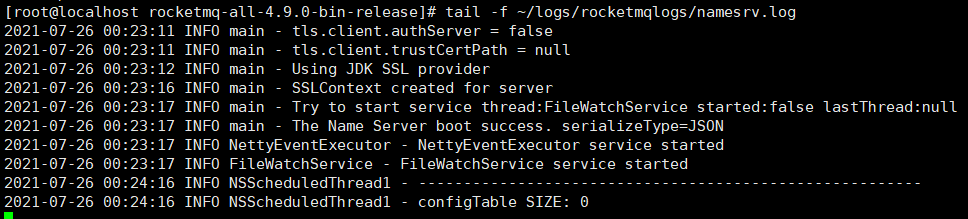
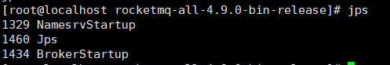
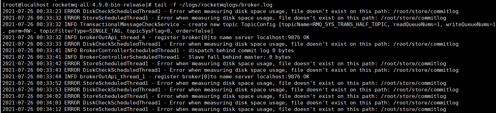
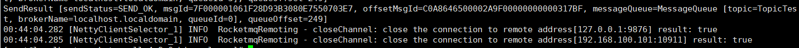
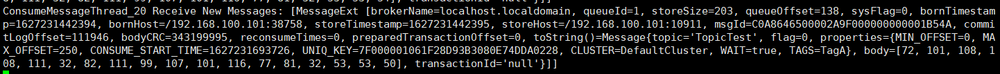
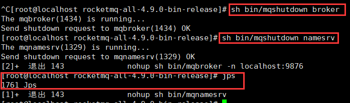

# RocketMQ单机部署

**前置环境**

> 使用RocketMQ那么需要准备JDK环境才能运行
>
> JDK安装教程：[Linux-安装JDK](../Liunx专栏/Linux-安装JDK.md)

**安装包下载**

> 进入到Apache RocketMQ：`https://rocketmq.apache.org/dowloading/releases/`官网，下载RocketMQ安装包
>
> 也可直接在Linux上执行wget` https://archive.apache.org/dist/rocketmq/4.7.1/rocketmq-all-4.7.1-bin-release.zip`获取压缩包

**解压压缩包**

~~~shell
# 解压压缩包
unzip rocketmq-all-4.7.1-bin-release.zip
~~~

**配置环境变量**

~~~shell
# 修改环境变量
vim /etc/profile
# 在profile文件最后增加2个环境变量
export ROCKETMQ_HOME=/usr/local/rocketmq-all-4.7.1-bin-release
export PATH=$PATH::$ROCKETMQ_HOME/bin
# 保存后执行如下命令查询加载环境变量
source /etc/profile
~~~

## 单机部署

### 修改初始化内存

> 由于RocketMQ默认启动初始化JVM是设置了很大内存的，如果当前机器内存很小的话会发现怎么都启动不了，所以我们要修改2个启动脚本的JVM参数，如果自己的Linux内存大于8G可跳过这步骤

#### runserver.sh

~~~shell
# 修改bin目录下的runserver.sh脚本
vim runserver.sh
# 修改jvm启动时最小堆内存，与最大堆内存，新生代大小，由于我是使用虚拟机的所以这里我设置的很小，如果是生产环境请根据实际情况设置
JAVA_OPT="${JAVA_OPT} -server -Xms256m -Xmx256m -Xmn128m -XX:MetaspaceSize=64m -XX:MaxMetaspaceSize=128m"
~~~

#### runbroker.sh 

~~~shell
# 修改bin目录下的runbroker.sh脚本
vim runserver.sh
# 修改jvm启动时最小堆内存，与最大堆内存，新生代大小，由于我是使用虚拟机的所以这里我设置的很小，如果是生产环境请根据实际情况设置
JAVA_OPT="${JAVA_OPT} -server -Xms256m -Xmx256m -Xmn128m"
~~~

#### 

### 启动服务

> RocketMQ启动需先启动NameServer，后启动Broker

#### 启动NameServer

~~~shell
# 进入到rocketmq-all-4.9.0-bin-release目录下执行如下命令
nohup sh bin/mqnamesrv &
~~~

#### 验证NameServer

> 方式1，执行`jps`命令如果看到一个叫NamesrvStartup的java进程表示成功

> 方式2，通过`tail -f ~/logs/rocketmqlogs/namesrv.log`执行如下命令可以看到日志信息中`The Name Server boot success`表示启动成功

#### 启动Broker

~~~shell
# 进入到rocketmq-all-4.9.0-bin-release目录下执行如下命令
nohup sh bin/mqbroker -n localhost:9876 &
~~~

#### 验证Broker

> 方式1，执行`jps`命令如果看到一个叫BrokerStartup的java进程表示成功

> 方式2，通过`tail -f ~/logs/rocketmqlogs/broker.log`执行如下命令可以看到日志一直在打印，不过这里一直提示我/root/store下有2个文件夹不存在，大家可以手动创建一下就可以消除这个报错了

#### 发送与接收消息测试

~~~shell
# 添加一个环境变量，接下来测试的生产者与消费者都会重环境变量读取到nameServer的地址
export NAMESRV_ADDR=localhost:9876
# 执行官方提供的消息生产者demo
sh bin/tools.sh org.apache.rocketmq.example.quickstart.Producer
# 执行官方提供的消息消费者者demo
sh bin/tools.sh org.apache.rocketmq.example.quickstart.Consumer
~~~

> 执行官方提供的生产者demo后可以看到打印SendResult信息，如msgId、offsetMsgId、messageQueue等信息

> 执行官方提供的消费者demo后可以看到打印消费信息

### 关闭服务

> RocketMQ关闭服务先关闭Broker，后关闭NameServer

~~~shell
# 关闭Broker
sh bin/mqshutdown broker
# 关闭NameServer
sh bin/mqshutdown namesrv
~~~

> 关闭后通过`jps`如果查看不到任何进程表示关闭成功

