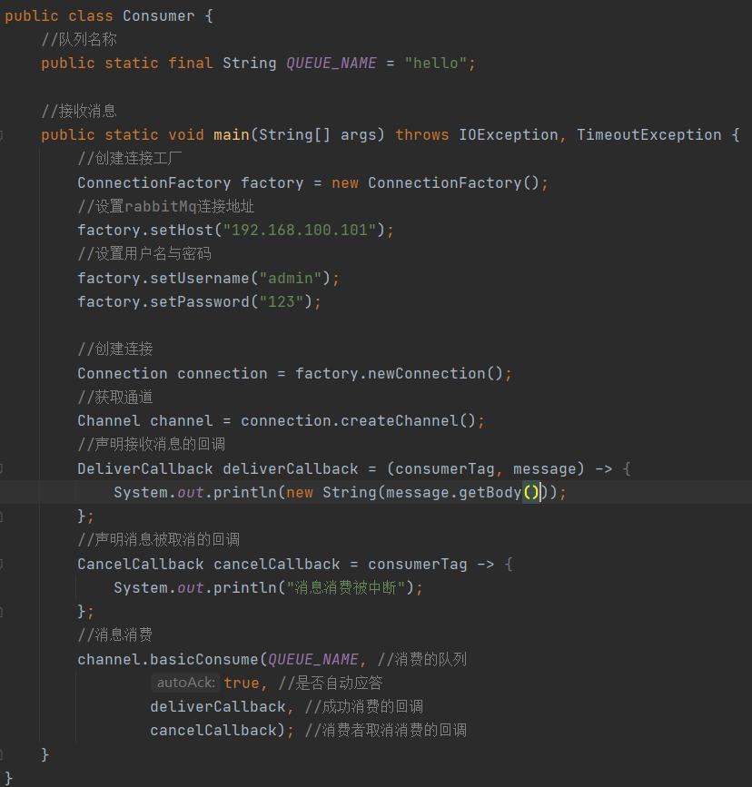
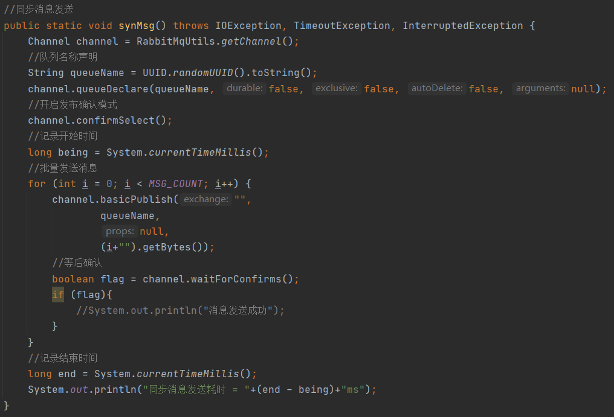
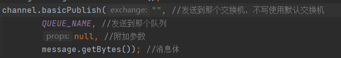
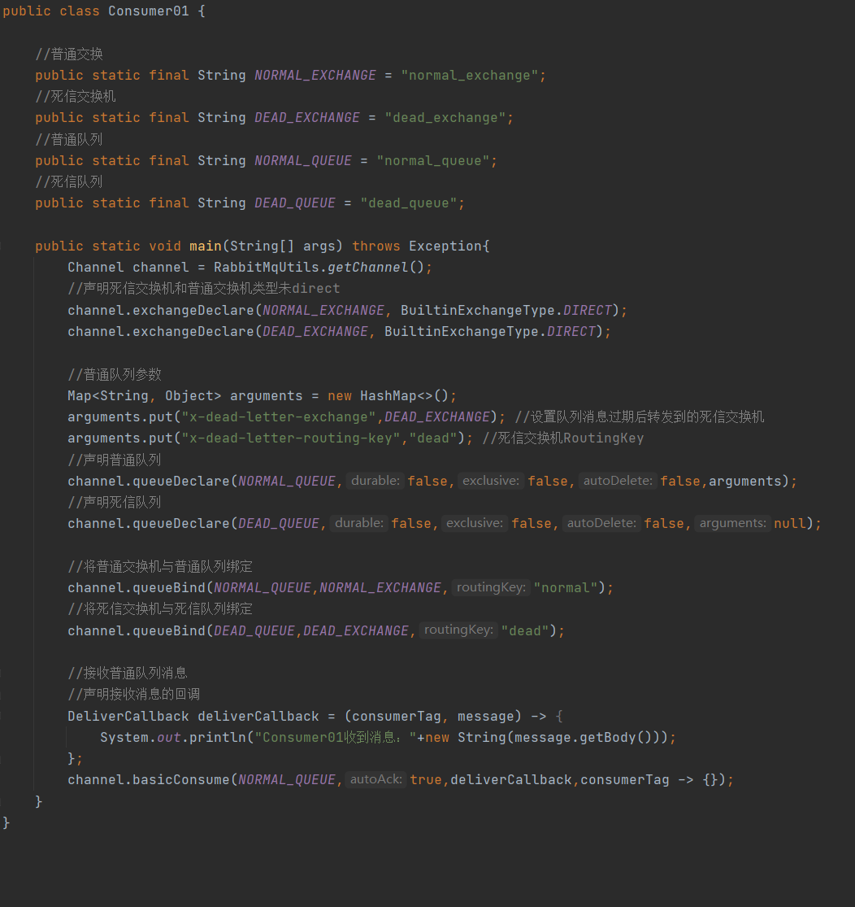

#  RabbitMQ-基础

> RabbitMQ，2007年发布，是一个AMQP(高级消息队列协议)基础上完成的，可复用的企业消息系统，是当前最主流的消息中间件之一
>
> RabbitMQ功能比较完备、健壮、稳定、易用、并且跨平台，支持语言如python、ruby、.net、java、jms、c、php、ajax，并且文档齐全，提供了开源的管理界面，很高的社区活跃度，更新频率相当高

## 四大核心概念

> 生产者：发送消息到的RabbitMQ客户端为生产者
>
> 交换机：是RabbitMQ非常重要的一个部件，用于接收来自生产者的消息，并且也需要将消息推送到队列中，交换机必须确切的知道如何处理接收到的消息，是将这些消息推送到指定队列还是多个队列，或是将消息丢弃都由交换机类型觉得
>
> 队列：是RabbitMQ中存储消息数据结构，生产者生产的消息最终会存放在队列中，消费者消费消息需要从队列中获取
>
> 消费者：并且并且消费队列中的消息为消费者

> Broker：接收和发消息的应用，RabbitMQ Server就是Message Broker
>
> Virtual host：用于多租户与安全因素设计的，可以将RabbitMQ Server划分成多个不同的分组，并且不同用户只能访问自己的分组，每个分组中都可以拥有多个exchange与queue等
>
> connection：生产者/消费者与broker之间家里的tcp连接
>
> channel：如果每次访问都建立一个connection那么是非常消息资源的，所以只建立一个connection利用channel在connection建立逻辑连接，如果应用程序支持多线程，通常每个thread创建单独的channel进行通讯，AMQP method包含了channelID帮助客户端和Broker识别channel，所以channel是完全隔离的
>
> exchange：message到达broker的第一步，根据分发规则匹配表中的routing key分发消息到queue中，常用类型有direct(point-to-point)、topic(publish-subscribe)、fancut(multicast)
>
> queue：消息最终被送到这里等待消费者消费
>
> Binding：exchange与queue之间的虚拟连接，一个exchange至少Binding1个queue，binding中包含routing key，Binding消息被保存到exchange中的查询表中，用于message的分发依据

## 单机/集群部署

文章：[Linux-RabbitMQ单机部署](../分布式中间件专栏/Liunx-RabbitMQ单机部署.md)

文章：[Linux-RabbitMQ集群部署](../分布式中间件专栏/Liunx-RabbitMQ集群部署.md)

## 六大模式

> 接下来介绍RabbitMQ中的6大模式工作流程，每个模式都会编写demo案例，demo仓库地址：https://gitee.com/smallpage/java-demo.git

### 简单模式

> 简单模式即最简单的消费生产模式，也交点对点模式，该模式下队列中只有一个生产者，一个消费者，生产者生产消息，消费者消费消息

#### 引入依赖

~~~xml
<dependency>
    <groupId>com.rabbitmq</groupId>
    <artifactId>amqp-client</artifactId>
    <version>5.8.0</version>
</dependency>
<dependency>
    <groupId>commons-io</groupId>
    <artifactId>commons-io</artifactId>
    <version>2.6</version>
</dependency>
~~~

#### 消息生产者

> 编写一个简单的生产者，往Rabbitmq中发送一个消息

> 执行成功后我们可以看到在mq中有一条待消费的消息

#### 消息消费者

> 编写一个简单的消费者

> 连接上的消费者会消费指定队列中的消息

#### 提取工具类

> 在编写的简单案例中可以发现，在生产者与消费者的代码中获取Channel的逻辑都是一样的，所以这里编写一个工具类提取出来，后面的案例将通过该工具类获取channel

### 工作队列模式

> 工作队列(又称任务队列)简单模式的一种进化版本，也是工作中最常用的模式，在简单模式下只有1个生产与消费者，性能存在一定的瓶颈，从而进化如工作队列模式一个生产者对多个消费者，多个消费者同时消费消息大大提升了消息的吞吐量
>
> 注意：这样做带来重复消费的问题，一个消息按照正常逻辑只能被一个消费者消费，如果一个消费者消费了消息，那么另外一个消费者就不会收到重复消息
>
> 消费模式，由于多个消费者同时消费一个队列，那么消费策略则很重要，即如何分发给多个消费者，RabbitMQ提供了轮询模式、

#### 轮询分发模式

##### 消息生产者

> 编写消息消费者

##### 消息消费者

> 编写消息消费者代码，并且开启多个实例

##### 测试

> 生产者依次输入需要发送的消息

> 消息被已轮询的方式分发到，消费者中

#### 消息的应答

> 消费者完成一个任务可能需要一段实际，如果消费者在处理任务期间突然宕机，那么消息最终是否被消费mq是不知道的，最后会导致消息的丢失，mq为了确认消息被正常消费引入了应答机制，即当消息被正常消费后消费者需要告诉mq消费成功，mq才会把该消息删除不在消费

##### 自动应答(不推荐)

> 当消息发送后立刻就被认定已经成功，该模式下拥有很高的吞吐量，没有对传递消息进行限制，但是会带来消息丢失的问题，该模式下如果消息在接收之前，消费者那边出现连接或者channel关闭，那么消息就会丢失，也有可能会导致消费者线程由于收到大量的消息积压，最终内存耗尽，最终这些消费者线程会被操作系统杀死，所以该模式下仅适用于消费者业务简单，执行效率高

##### 手动应答

###### 手动应答的方法

###### multiple参数

> 在basicAck与basicNack(basicReject没有该参数)中都会存在一个参数multiple(是否批量应答)，首先队列在每一次往channel中发送消息给消费者是有可能会批量发送，即一次发多条这时如果批量应答为true那么消费者会应答这一批消息都是成功的如何在依次消费，如果是false那么消费者只会按照顺序依次应答依次消费(工作中推荐使用false，标准消息可靠性)

##### 消息自动重新入队

> 若消费者消费消息时长时间未给mq返回ack，mq会认为消息未被成功消费，mq会将消息分发到其它消费者进行消息消费

##### 消息手动应答代码

> 应答代码，只需要写在消费者中即可，将自动应答关闭并且在消息消费回调最后手动应答mq，告知是否成功消费

#### 持久化

> 消息应答能保证发送给消费者的消息不丢失，那么消息持久化着是保证保存在mq中未被消费的消息不丢失，保证极端情况下RabbitMQ服务宕机了未发送给消费者的消息不会丢失

##### 队列持久化实现

> 队列是用与存储消息的，也是需要持久化的不然消息持久化了队列未持久化则没有任何意义，标记一个队列持久化只需要在创建队列时将durable参数设置为true即可

>开启了持久化的队列在，RabbitMQ的控制台中可以看到Features列中有一个`D`字母

##### 消息持久化实现

> 这里好多人会搞混，队列持久化与消息持久化，队列持久化是保证队列不丢失，即存储消息的容器不丢失，消息持久化着保证容器中的消息不丢失，标记一个消息持久化只需要再发送消息时增加一个参数`MessageProperties.PERSISTENT_TEXT_PLAIN`

> 消息持久化并不能保证100%的持久化，会存在部分消息丢失，因为有的消息可能在内存中还未被持久化时发生了宕机，如果需要强一致性的后面发布确认模式着可以解决这个问题

#### 分发逻辑

> RabitMQ默认分发消息的模式是轮询模式，但是在一些场景下这种策略并不是很好，因为有的机器硬件性能较高的消费者可能处理消息速度很快，有的硬件性能较低的消费者处理消息较慢如果使用平均分发会出现一个问题，能力强的消费者处理消息快有很多空闲时间，能力较弱的消费者着一直干活消费消息

##### 不公平分发

> 开启不公平分发原则，谁空闲就分发给谁，只需要在消费者端`channel.basicQos(1);`加入如下代码即可开启不公平分发

##### 预取值分发

> 预取值表示当前消费者最大堆积消息数量，若队列有7条消息，有2个消费者消费者1预取值=5另外消费者2预取值=2，那么mq在发生消息时会优先向消费者1发送消息，当消费者1堆积消息达到预取值，则将消息发给消费者2，往后的消息着是看谁空闲谁消费

### 发布确认模式

> 发布确认模式可以保证消息不会丢失，原理其实就是生产者消息发送给MQ后MQ持久化到磁盘上，才会返回ACK给生产者，该模式是作用与生产者的
>
> 发布确认模式的前提
>
> 1.需要设置队列为持久化
>
> 2.队列中的消息也必须持久化

#### 单个发布确认

> 单个发布确认即生产者发送一条，等待mq返回确认后才会发送下一条，也称同步确认，可以保证每一条消息都是成功发布的，这种方式带来的缺点也很明显，就是生产者发送消息效率低

#### 批量发布确认

> 批量发布确认即生产者发送到指定数量后如达到100条消息，等待mq返回确认后才会发送下一批消息，下一批也是发送100条后等待一次确认，这种方式带来的缺点也很明显，无法确认的这100条消息中有那些消息失败了

#### 异步发布确认

> 异步发布确认即生产者发送消息后，无序等待消息是否已经成功则继续发送下一条消息，消费成功或失败后会通过回调函数通知生产者，这种方式也是效率最高的也是最安全的方式

#### 耗时对比

> 在发送相同数量的消息下，异步消息是最快最可靠的

### 发布订阅模式

> 发布订阅模式即一个消息可以被多个消费者同时消息(如消息推送业务)，在我们之前学的工作队列模式是无法实现该功能的，实现这个发布订阅模式需要使用到交换机，交换机的工作就是将收到的消息同时发给多个绑定的队列，这样就可以将1条消息同时发送到多个队列，这样就可以被多个消费者消费了，注意每个队列中的消息只会被一个消费者消费

#### Exchangs

> 在RabbitMQ消息传递的核心思想是，生产者生产的消息不会直接发送到队列(之前的练习都是有走交换机的只是走的是默认交换机)
>
> 生产者只能将消息发送给交换机，交换机的工作就是接收消费者的消息，并且把这些消息推入队列，交换机需要确切的知道如何处理收到的消息，是一个把消息推送到特点队列还是把他推送到许多队列，还是丢弃它，这都是交换机觉得的

##### Exchangs类型

> 交换机总共有4种类型
>
> 1. 直接(direct)
> 2. 主题(topic)
> 3. 标题(headers) `已过时不讲`
> 4. 扇出(fanout)

##### 无名Exchangs

> 在前面的例子中我们对Exchangs还不了解时，仍然可以向队列中发送消息，因为我们使用的是默认交换机(无名Exchangs)，传空字符串表示使用默认交换机

> 在控制面板中，无名交换机叫(AMQP default)

##### Exchangs绑定队列

> 交换机与队列的绑定，在web界面都可以操作，首先创建一个新的队列名未queueq

> 创建一个交换机名为exchange1

> 点击交换机进入到交换机的详细界面

> 绑定指定交换机

> 可以成功效果如下，Routingkey是路由关键字，发送消息给交换机，交换机通过RoutingKey找到队列，发消息发给它，可以通过不同的RoutingKey开区分不同的队列

#### 扇出/广播模式(fanout)

> fanout是发布订阅模式最简单的模式，广播模式即将收到的每一台消费广播到所有的队列中，mq默认的提供一个amq.fanout交换机，即使广播交换机

##### 消息生产者

> 生产者在生产消息时，不再指定队列了，而是指定交换机，通过routingkey来确认需要发送到那些队列中，若routingkey为空字符串表示广播发送给所有队列

##### 消息消费者

> 消费者将创建好的队列绑定到交换机上，这样交换机就会根据生产者发消息routingkey来确认需要发送到那个队列中，可以发现2个生产者的将队列绑定到交换机时routingkey都是一样的空字符串(不是空字符串也行，只要一样就可以)，这样生产者在发消息给交换机时，交换机根据routingkey查找出多个队列同时发送过去，实现广播消息

##### 测试

> 生产者发送消息

> 2个消费者都会同时接收到相同的消息

#### 直接/路由模式(direct)

> 在扇出/广播模式下，我们可以自动如果多个队列绑定交换机并且routingkey是一致的，这些消息就会被广播到多个队列中，那么如果每个队列绑定的routingkey都是唯一的，这样生产者就可以根据routingkey发消息到指定的队列中，这称为直接交换机

##### 消息生产者

> 生产者在发送消息时，根据不同的消息分别指定routingkey发送，这样交换机收到消息后会根据routingkey推送到指定的队列种

##### 消息消费者

> 消费者1，创建了一个名为console队列，并且将该队列与direct_logs交换机绑定，指定了routingkey是info，warning，可以一个交换机下可以绑定多个相同队列名的队列只要routingkey不同即可

> 消费者2，创建了一个名为disk队列，并且将该队列与direct_logs交换机绑定，指定了routingkey是error

##### 测试

> 一个交换机中可以绑定多个相同的队列，只要routingkey不一样即可，交换机根据routingkey向队列发送消息

> 生产者分别发送3种不同的消息

> ReceiveLogsDirect01的通道分别绑定的routingkey是info和warn所以同时收到了info和warn消息

> ReceiveLogsDirect02的通道绑定的routingkey是err所以只收到err的消息

#### 主题模式(topic)

> 主题模式是在直接模式上的一种增强，比如选择有一个业务场景，info队列也有分日志类型，info.base和info.advantage，一些队列只接收info.base那么在直接模式上就无法解决这个问题，这使用就需要在direct中再细分，加多一个topic类型

##### topic规范

> 主题交换机的routing key不能随意，必须满足一定的要求必须是一个单词列表，以点分隔开(如 "info.base"，"info.advantage")，这种类型的，当然这个单词列表最多不能超过255个字节
>
> topic的通配符
>
> 1. *：可代替1个单词
>
>    例：(\*.orange.\*) => 表示中间带orange，3个单词的字符串
>
>    例：(\*.*\.rabbit) => 表示最后一个单词是rabbit的3个单词的字符串
>
> 2. #：可代替0个或多个单词
>
>    例：(lazy.\#) => 表示第一个单词是lazy，后面有多个单词的字符串
>
> 如果发送只带一个#表示广播到所有队列了
>
> 如果发送不带通配符那么就是直接模式了

##### 消息生产者

> 使用一个map保存着消息，key为routingKey，value为消息体，办理map给交换机发送消息

##### 消息消费者

> 消费者1，声明交换机使用主题模式，创建一个Q1队列，并且让Q1队列绑定交换机，设置处理routingKey为"\*.orange.\*"的消息

> 消费者2，声明交换机使用主题模式，创建一个Q2队列，并且让Q2队列绑定交换机，设置处理routingKey为"\*.\*.rabbit"或"lazy.\#"的消息

##### 测试

> 消费者遍历发送消息

> Q1会处理routingKey为"\*.orange.\*"的消息

>  Q2会处理routingKey为"\*.\*.rabbit"或"lazy.\#"的消息

## 临时队列

> 当我们在连接MQ是，我们有时会需要随机生成一个全新的队列，为此我们可以创建一个随机名称的临时队列，这种临时队列特点就是断开消费者的连接后，队列会被自动删除

~~~java
String queueName = channel.queueDeclare().getQueue()
~~~

> 临时队列的格式

## 死信队列

> 死信消息，消费者从queue中获取消息进行消费是，但某些时候由于特定的原因导致queue中的某些消息无法被消费，这些消息如果没有后续处理就变成死信消息，既然有死信消息那么就需要一个存储这些消息的队列，死信队列
>
> 死信队列应用场景也是比较广泛的，比如商城系统的订单业务消息数据即使是发送了异常也不能丢失的，这些异常的订单数据会进入到死信队列由人工排查处理，也可用于如用户下单成功在支付页面上在指定时间内未支付自动失效的功能

### 死信来源

1. 消息TTL过期(规定时间内未消费的消息)
2. 队列达到最大长度(队列满了无法添加消息到mq)
3. 消息被消费者拒绝(消费者返回basic.reject或basic.nack)并且requeue=false(不重试)

### 死信案例

> 死信队列也是拥有自己的交换机的，也是直接交换机，并且也拥有消费者，所有构建一个死信队列，需要将死信队列的交换机与普通队列绑定，这样普通队列中的消息发送异常后就会将消息转发到绑定好的死信交换机，死信交换机转发到死信队列，由专门的死信消费者消费这部分消息

#### 普通消费者

> 在消息消费者1要做的工作内容如下
>
> 1. 声明普通交换机与死信交换机类型为直接交换机
> 2. 声明普通并且声明时附带`x-dead-letter-exchange`与`x-dead-letter-routing-key`参数，告诉普通队列将死信消息发到那个交换机和routingkey中
> 3. 声明死信交换机
> 4. 将普通交换机与普通队列绑定
> 5. 将死信交换机与死信队列绑定
> 6. 接收处理普通消息

> 设置好后启动消费者1，启动成功可以从控制台中看到生成了2个交换机与2个队列，以及检查交换机与队列的绑定关系是否正常

#### 死信消费者

> 死信消费者编写很简单只负责消息消费即可

### TTL过期例子

> 消息TTL过期时间一般由消息生产者发送消息时指定，如图消息生产者在向普通交换机中发送11条，普通消息并且消息的过期时间是10s

> 当我们将普通消费者关闭后，表示这些消息会在在队列中无法消息，等到10秒过期时间到后，普通队列会将这些过期消息转发到死信交换机中

### 队列达到最大长度例子

> 当生产者发送大量消息，消息数量超出队列最大长度普通队列已经无法存放这些消息时超出的消息转发到死信队列中

> 修改普通消费者普通队列参数，设置队列最大容量为6`启动时需要先在在web控制面板删除normal_queue队列否则启动会报错`

> 关闭普通消息消费者演示消息无法消费，消息积压，编写生产者，向普通队列中发送10条消息

### 消息被拒

> 修改普通消息消费者关闭自动应答开启手动应答模式，拒绝消息内容为info5的消息，并且不重试该消息，让他成为死信消息

> 编写生产者，往普通队列中发送10条消息

> info5的消息被普通消费者拒绝了，而其余消息被普通消费者消费

