# RabbitMQ进阶

> RabbitMQ进阶，是对RabbitMQ基础进行一个补充，里面涵盖了集成SpringBoot框架的使用，以及集群搭建，已经集群相关知识

## 集成SpringBoot

> SpringBoot集成RabbitMQ，常用案例

[SpringBoot-集成RabbitMQ](https://blog.csdn.net/weixin_44642403/article/details/121016644)

## RabbitMQ集群部署

[Liunx-RabbitMQ集群部署](https://blog.csdn.net/weixin_44642403/article/details/121017230)

## 镜像队列

> 在RabbitMQ集群模式下，创建的队列是某一个节点下的，并不是集群节点之间共享的，所以当某个节点宕机那么该节点下的所有队列也无法访问了，通过镜像队列可以让不同节点之间队列相互备份，达到队列高可用

### 镜像队列添加

> 登录到RabbitMQ控制面板，在Admin下为`/`添加一个规则

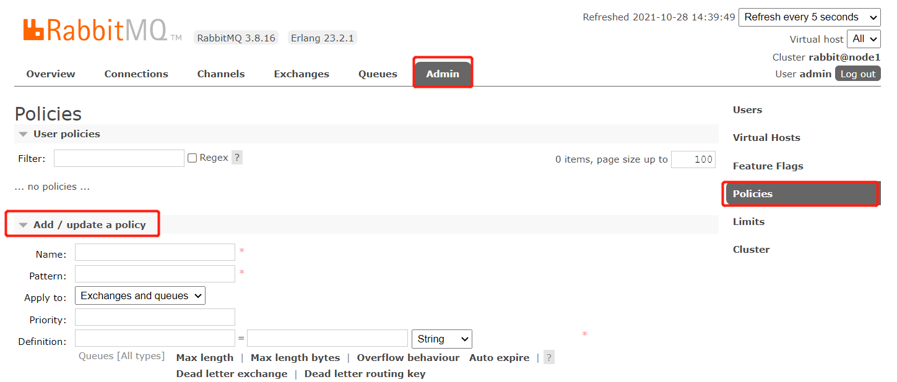

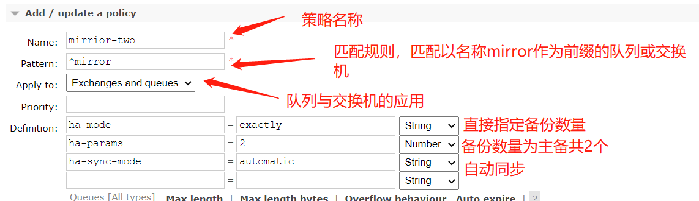

> 添加完毕后可以查看到添加的策略

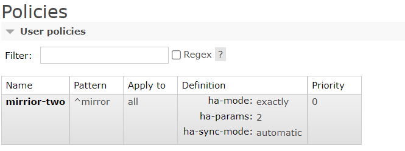

### 演示新增队列

> 在任意一个节点上创建一个队列，注意名称要与配置好的匹配规则相匹配，这里演示使用的是控制面板演示，当然如果使用代码在创建时只要遵守匹配规则创建的队列也是镜像队列

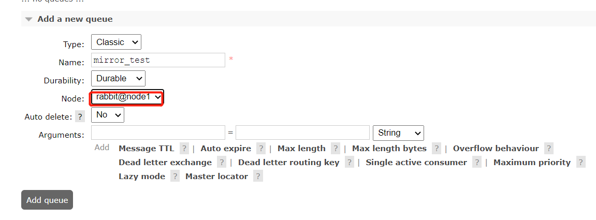

> 创建成功后可以看到队列，所属节点上有一个`+1`

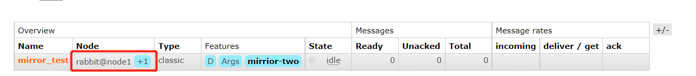

> 查看详细信息时可以看到主备队列所在的节点，这样即使节点1宕机了，也可以通过节点3访问到该队列

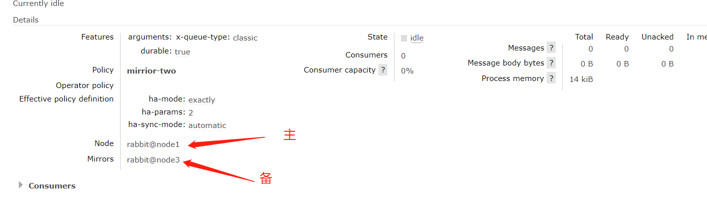

### 演示宕机

> 假如我们将节点1的RabbitMQ服务关闭模仿宕机，观察发现原本mirror_test挂在node1下，现在切换到node3节点了，并且由为node3下的mirror_test队列寻找了一个新的备份节点

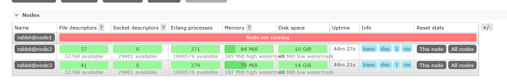

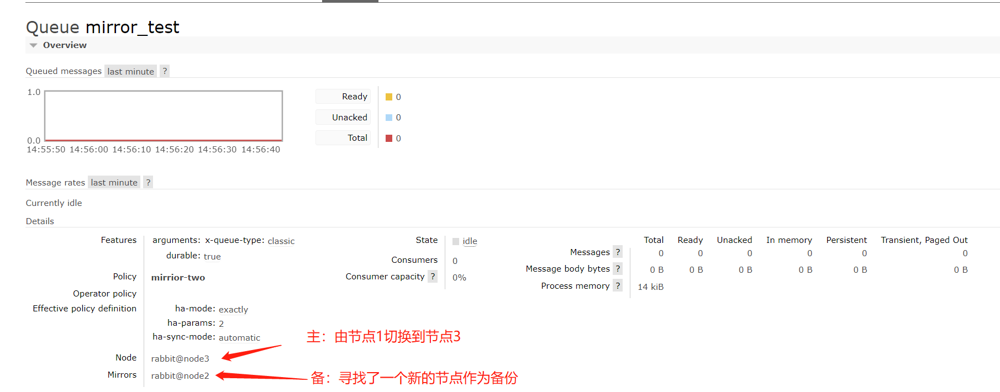

## 高可用负载均衡

> 由于RabbitMQ本身是没有负载均衡的，需要指定IP直连，这就会存在一个问题若当前集群有3个节点，假如node1宕机了那么意味着连接node1的节点所有客户端都不能使用了，其实集群还是健康的因为nod2与nod3还是提供服务的，只是客户端无法通过node1的ip连接上集群就认为集群不可用了

### Nginx负载均衡

> 由于RabbitMQ本身是没有负载均衡的，需要借助一些工具，这里使用到nginx做负载均衡，首先在我们本地部署一个nginx并且增加如下配置，启动nginx

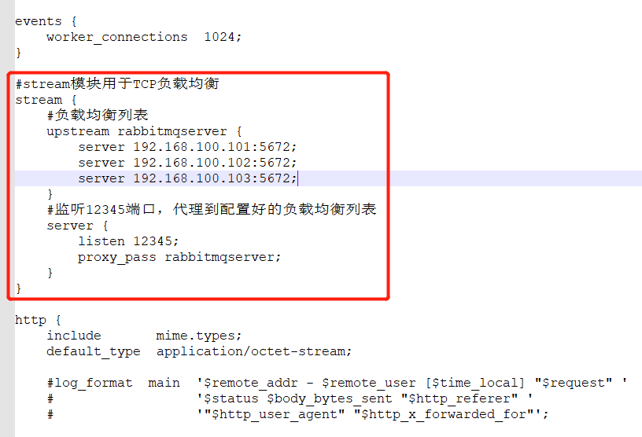

### 消息生产者

> 编写一个生产者，在连接rabbitmq时不直接指定mqip，而是连接nginx，通过nginx负载均衡代理到rabbitmq中

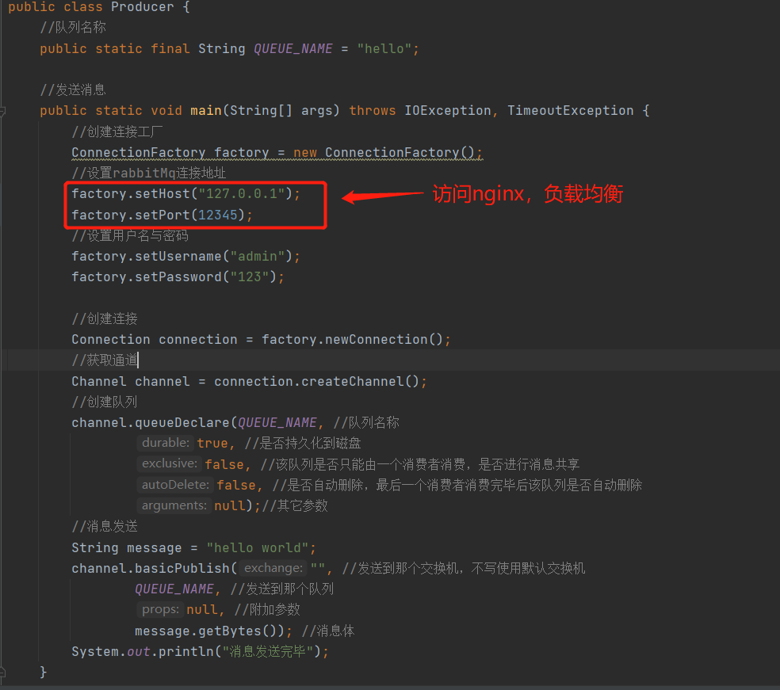

> 消息被成功发送

### 消息消费者

> 消费者也是如此，可以看到消费者成功的消费了消息

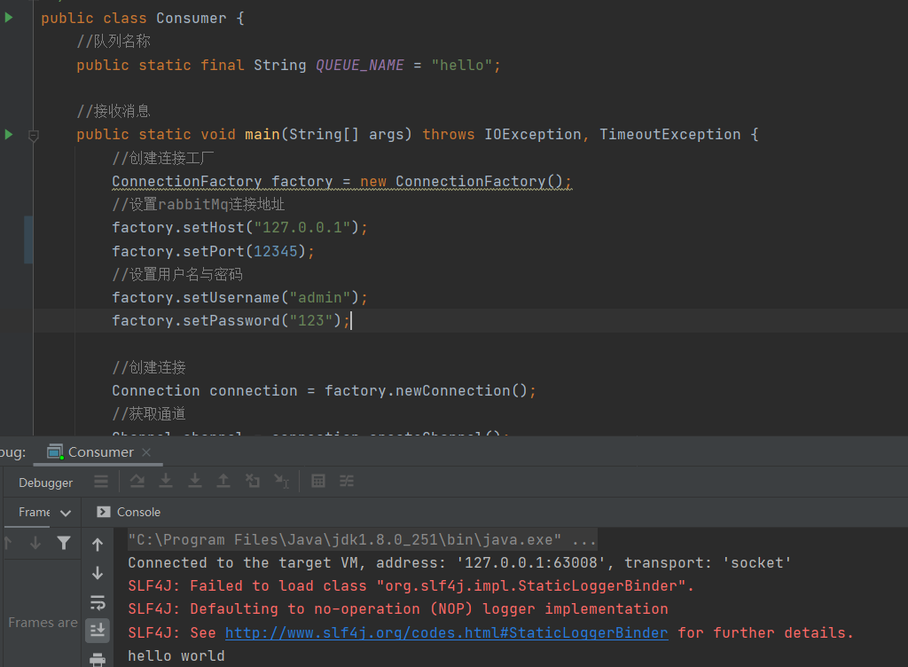

## FederationExchange

> 联合交换机

### 安装联邦插件

> 需要在集群的每台集群上都安装上该插件，分别在所有节点上执行如下命令

~~~shell
rabbitmq-plugins enable rabbitmq_federation
rabbitmq-plugins enable rabbitmq_federation_management
~~~

> 安装成功后无需重启，可以在控制面板中查看到多了2个配置项表示安装成功

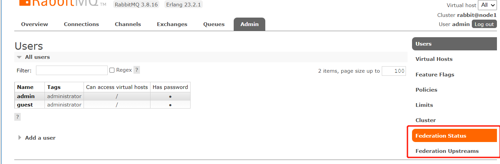

