# RocketMQ-基础

> RocketMQ是由阿里开源的一款中间件，16年捐赠给Apache基金会，在17年9月RocketMQ成为Apache顶级项目(TLP)，RocketMQ可是历经数十年的阿里双11的考验，性能与稳定性非常高

## 基本概念

> 在使用RocketMQ前首先需要了解5个基本概念

### 消息(Message)

> 消息是指，消息系统所传输信息的物理载体，生产和消费数据的最小单位，每条消息必须属于一个主题

### 主题(Topic)

> Topic表示一类消息的集合，每个主题包含若干条消息，每条消息只能属于一个主题，是RocketMQ进行消息订阅的基本得
>
> 一个生产者可以同时发送多种Topic的消息，而一个消费者只对某种特点的Topic感兴趣，即只可以定于和消费一种Topic的消息

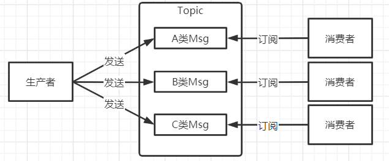

### 标签(Tag)

> 为消息设置的标签，用于同一主题下区分不同类型的消息，来自同一业务单元的消息，可以工具不同的业务目的在同一主题下设置不同标签，标签能够有效的保持代码的清晰度和连贯性，并优化RocketMQ提供的查询系统，消费者可以工具Tag实现对不同子主题的不同消费逻辑，实现更好的扩展性

### 队列(Queue)

> 存储消息的物理实体，一个Topic可以包含多个Queue，每个Queue中存放的就是Topic的消息，一个Topic的Queue每次消费只能被1个消费者消费，可以将1类(Tag)的消息拆分多个Queue这样就可以使用多个消费者同时消费

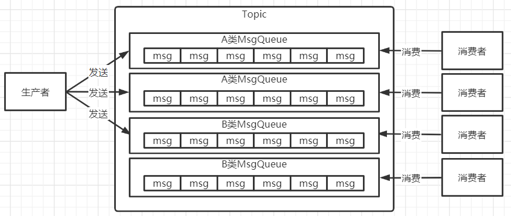

### 消息标识(MessageId/Key)

> 在RocketMQ中每个消息拥有一个MessageId，且可以携带具体的业务标识的Key，以方便对消息的查询，不过在RocketMQ种有3种Id都
>
> 1. msgId：生产者在send消息的时候会自动生成一个MessageId，规则：`producerIp+进程pid+MessageClientIDSetter类的ClassLoader的HashCode+当前时间+AutomicInteger自增计数器`
> 2. offsetMsgId：由Broker(中间件服务)端生成，消息发到Broker后会自动生成一个MessageId，规则：`brokerIp+物理分区的offset(Queue中的偏移量)`
> 3. key：由用户指定的业务相关唯一标识

## 系统架构

> 这是官方提供的系统架构图，首先从架构图中可以看出分为4部分，分别是Producer、Consumer、NameServer、Broker

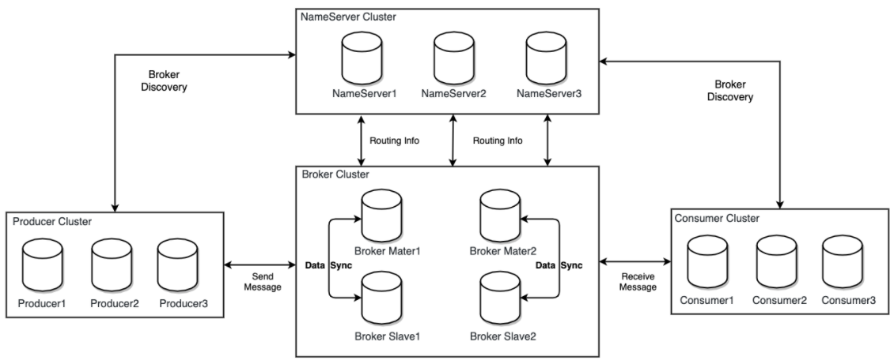

### Producer(生产者)

> Producer即消息生产者主要负责生产消息，Producer发送的消息会通过负载均衡模块，负载均衡模块会按情况选择相应的Broker集群中的队列进行消息投递，投递的过程支持快速失败并且低延迟
>
> RocketMQ中的消息生产者都是以生产者组(Producer Group)的形式出现的，生产者组中的生产者都是同一类的生产者，这些生产者都发送相同的Topic类型的消息

### Consumer(消费者)

> Consumer即消息消费者，负责消费消息，一个消息消费者会从Broker服务中获取到消息，并对消息进行相关业务处理
>
> RocketMQ中的消息消费者都是以消费者组(Consumer Group)的形式出现的，消费者组的同一类消费者的集合，这类Consumer消费的是同一个Topic类型的消息，消费者组使得在消费方面，实现负载均衡和容错的目标变的更加容易

### NameServer(注册中心)

> NameServer是一个Broker与Topic路由的注册中心，支持Broker的动态注册于发现，`其实在RocketMQ前身MetaQv1与v2版中注册中心用的是Zookeeper`
>
> 主要功能有2个
>
> 1. Broker管理：接收Broker集群的注册信息，并且保存下来作为路由信息的基本数据，提供心跳检查机制，检查Broker是否存货
> 2. 路由信息管理：每个NameServer中保存着Broker集群的整个路由信息和用于客户端查询的队列信息，Producer和Coumser通过NameServer可以获取到整个Broker集群的路由信息，进行消息投递和消费

#### 路由注册

>  NameServer通常也是以集群的方式部署，不过NameServer是无状态的，以及集群中的各节点都是无差异的，以及各节点也不相互通讯的，那这就引发一个问题各节点的数据如何同步？
>
> 在Broker节点启动时，会轮询NameServer列表，与每一个NameServer节点建立长连接，并且向NameServer集群中的每一个节点到发起注册
>
> Broker为了保证自己是存活的，他会每30秒向NameServer发送一次心跳，心跳包中包含BrokerId、Broker地址、Broker名称等，NameServer在收到心跳包后，会更新心跳的时间戳，记录这个Broker的最新存活时间

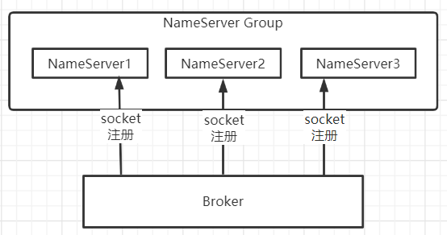

> NameServer存在的优缺点
>
> 1. 优点：由于NameServer集群的节点相互是不用互相通讯的，那么在集群扩容时就很简单直接启动服务即可
> 2. 缺点：由于NameServer节点并不会相互告知同步路由表，那么标识着Broker需要向所有的NameServer节点都发送注册消息，并且需要明确指定Broker往那几个Namer节点上注册，所如果NameServer扩容后就需要在Broker增加新的NameServer地址(IP+Port)否则最后Broker也不会注册上去，这个NameServer的路由信息也是空的

#### 路由剔除

> Broker在使用的时候可能由于某种原因导致宕机，这时需要NameServer将它从路由表中剔除
>
> 每一个NameServer中都有一个定时任务，每隔10秒都会扫码一次Broker表，查看每一个Broker的最新一次发送心跳包的记录的时间戳是不是距离当前时间超过120秒，就会判定Broker已经失效，并且将其剔除到路由表中

#### 路由发现

> RocketMQ的路由发现采用是Pull模型，当Topic路由信息出现变化时，NameServer不会主动推送给客户端，而是客户端定时去NameServer拉取最新的路由信息，默认客户端每30秒拉取一次最新路由

#### 客户端NameServer选择策略

> 客户端在配置时必须要写上所有NameServer集群的地址，那么客户端到底选择连接那个NameServer节点呢？
>
> 客户端首先会随机连接一个随机数从连接的NameServer节点数量取模后随机就连接一个，此时得到的就是所要连接的节点索引，然后回进行连接，如果连接失败则回采用round-robin策略，逐个尝试去连接其它节点

### Broker(中间件)

> Broker是RocketMQ的核心充当着消息中转角色，负责存储消息、转发消息，Broker在RocketMQ负责存储从生产者发送来的消息，同时为消费者的拉取请求做准备，Broker同时也存储消息相应的源数据，包括消费者组消费者进度偏移offset、主题、队列等
>
> Broker中结构如图，首先所有请求都会进入到Remoting Module，整个Broker的实体，负责处理clients端的求，而这个Broker实体则由以下模块工程
>
> 1. Client Manager：客户端管理器，负责接收、解析客户端请求，管理客户端，如五欸黑consumer的Topic订阅信息
> 2. Store Service：存储服务，提供方便简单的API接口，处理消息存储到物理硬盘和消息查询功能
> 3. HA Service：高可用服务，提供Master Broker和Slave Broker之间数据同步功能
> 4. Index Service：索引服务，根据特定的Message key，对投递到Broker的消息进行索引服务，同时也提供Message Key对消息进行快速查询的功能

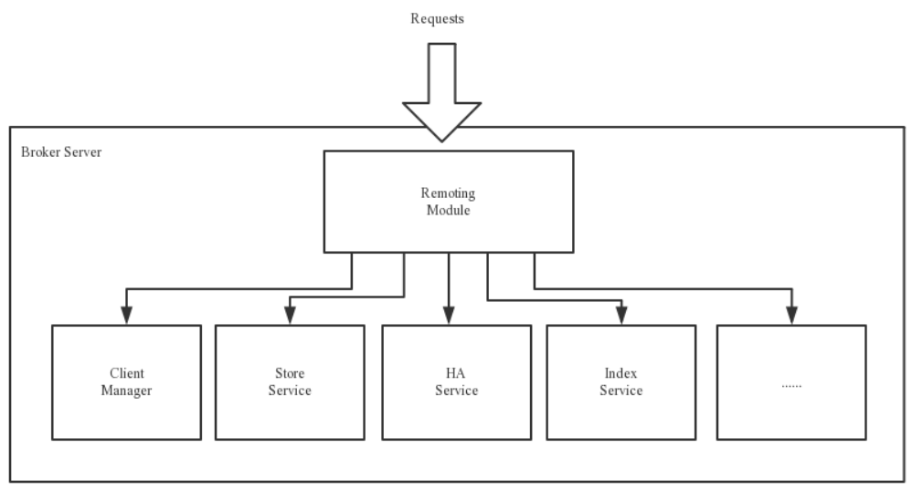

#### 集群部署

> 为了提高性能与吞吐量，Broker一般采用集群部署，一个Broker大集群会被分为多个主备集群，主备集群中具有Master和Slave 2个角色，在主备集群Master负责读写请求，Slave只负责数据备份，Slave是存在是为了保证集群的高可用，当Master宕机了Slave就顶替Master的工作
>
> 一个Master可以有多个Slave，但是一个Slave只能隶属于一个Master，Master与Slave的对于关系是通过指定相同的BrokerName、不同的BrokerId来确定的，BrokerId为0表示Master，非0表示Slave
>
> 每一个
>
> **主备集群与主从集群的区别，主从集群中主机与从机都需要处理客户端的请求，而主备集群中只有主机才处理客户端请求备机只作为数据备份以及确保高可用**

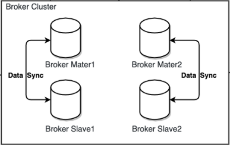

### 工作流程

#### 流程说明

> RocketMQ工作流程大致如下
>
> 1. 启动NameServer，NameServer启动超过后开始监听端口，等待Broler、Producer、Consumer连接
> 2. 启动Broker时，Broker会与所有的NameServer建立并保持长连接，然后每30买发送一个心跳包给NameServer
> 3. 在发送消息前，可以先创建Topic，创建Topic时需要指定Topic是要存储在那些Broker上，当然在创建Topic时也会将Topic与Broker的关系写入到NameServer中(这步是可选步骤，也可以在发送消息时自动创建Topic)
> 4. Producer启动，并且跟NameServer集群中任意一台建立长连接，并且获取路由信息Producer会先在本地缓存一份，并且每30秒去NamsServer获取更新本地缓存，在当前发送前会先从本地取到要发送的Topic消息的Queue与Broker的地址(IP+Port)，然后通过负载均衡计算选择一个Queue，与队列所在的Broker建立长连接并发送消息
> 5. Consumer跟Producer类似，也是跟一台NameServer建立长连接，获取所订阅的Topic的路由信息，然后根据算法策略从路由信息中获取需要消费的Queue，然后与Queue所在的Broker建立连接，开始消费其中的消息，Consumer获取到路由信息后也是每30秒去NamsServer获取更新本地缓存，Consumer与Producer不同之处就是Consumer会发心跳包给Broker，确保Broker的存活状态

#### Topic创建模式

> 在工作流程的第3点说Topic创建方式分为手机与自动创建
>
> 1. 手动创建：在手动创建Topic又有2种方式
>    * 集群创建：针对整个集群下所有的Broker创建的Topic，这样集群中所有的Broker种的Queue数量是相同的(即你创建时指定的数量)
>    * Broker创建：只针对某个或多个Broker创建的Topic在该集群中，利用Broker创建Topic看让每个Broker中的Queue数量可以不同
> 2. 自动创建：如果不手动创建着在发送消息时自动创建，自动创建默认采用的是Broker模式，会为每一个Broker默认创建4个Queue

#### 读/写队列

> 在创建Topic时填写队列数量时会发现队列分为2个队列读/写队列，其实从物理上来讲它们都是同一个队列来的，所有不会存在数据同步的问题，只是在逻辑上分为读/写队列
>
> 举个例子：如当前创建一个Topic，写队列设置8，读队列设置4，最终Broker都会创建8个队列，假如序号分别是1-8，由于设置写队列设置8那么如果Producer发送消息过来这些消息都会被轮流写入1-8的队列，由于读队列设置4那么Consumer再消费是只能消费1-4队列的消息，`可以发现4-8有数据但是消费者一直无法消费`
>
> 举个例子：如当前创建一个Topic，写队列设置4，读队列设置8，最终Broker都会创建8个队列，假如序号分别是1-8，由于设置写队列设置4那么如果Producer发送消息过来这些消息都会被轮流写入1-4的队列，由于读队列设置8那么Consumer会消费1-8队列的消息，`可以发现只有1-4有数据，但是还是有消费者会去消费4-8只不过4-8无消息可消费`
>
> 总结：我们可以发现，如果读/写队列数组不一样会造成如下问题
>
> * 读队列>写队列：有部分消费者会一直去消费一部分根本没有消息的队列
> * 写队列>读队列：有部分有消息的队列无法被消费者即使消费
>
> 那么为什么这样设置呢，其实这样设计是为了缩容而设计的，如果需要对某些Topic队列缩容那么可以先减少写队列，这样就会有的队列再也不会被写入消息了，等那些队列被消息被消费完了再修改读队列数量，这样就可以确保消息不丢失的情况下，动态缩容

## 单机/集群部署

文章：[Liunx-RocketMQ单机部署](https://blog.csdn.net/weixin_44642403/article/details/119121400)

文章：[Liunx-RocketMQ集群部署](https://blog.csdn.net/weixin_44642403/article/details/119225238)

## 运维工具

### 可视化工具

> RocketMQ拥有一个可视化工具dashboard，通过可视化工具可以更加方便的操作与查看RocketMQ服务
>
> gitHub下载地址：`https://github.com/apache/rocketmq-externals/releases`

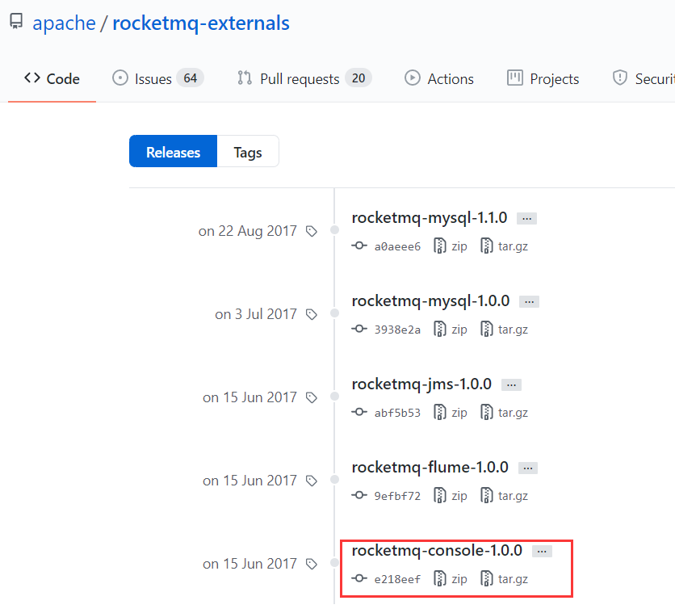

#### 修改配置

> 下载压缩包后解压可以发现这是一个Spring项目，只要打包运行就可以部署了，那么在部署之前首先先要修改一下配置文件，如修改端口、nameServer地址(必填，否则无法获取到路由信息)

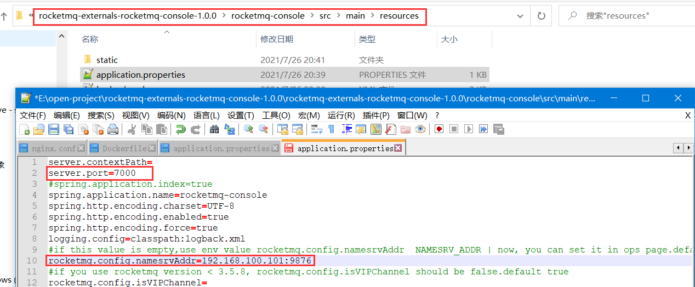

#### 添加依赖

> 还需要在项目的pom文件中追加如下依赖，否则启动是能启动但是会不停的报错
>
> `JAXB(java Architechture for Xml Binding)是用于XML绑定的java技术，是一项可以根据Xml Schema生成java类的标准`

~~~xml
<dependency> 
    <groupId>javax.xml.bind</groupId> 
    <artifactId>jaxb-api</artifactId> 
    <version>2.3.0</version>
</dependency>
<dependency> 
    <groupId>com.sun.xml.bind</groupId> 
    <artifactId>jaxb-impl</artifactId>
    <version>2.3.0</version>
</dependency> 
<dependency> 
    <groupId>com.sun.xml.bind</groupId> 
    <artifactId>jaxb-core</artifactId>
    <version>2.3.0</version>
</dependency> 
<dependency> 
    <groupId>javax.activation</groupId>
    <artifactId>activation</artifactId>
    <version>1.1.1</version>
</dependency>
~~~

#### 打包项目

> 打开cmd进入到项目目录下执行打包命令，跳过测试不然会报错`mvn clean package -Dmaven.test.skip=true`，提示BUILD SUCCESS即可

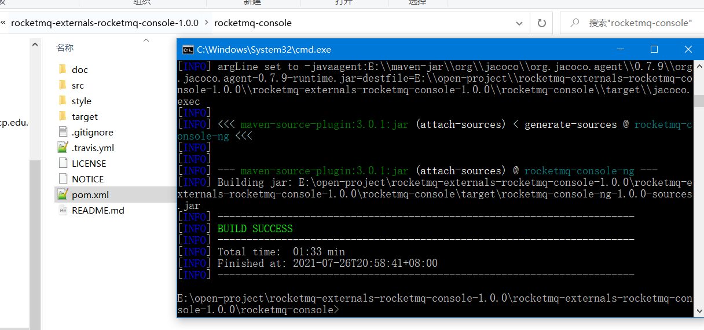

#### 项目运行

> 打包完毕后在项目目录下会有一个target文件夹，进去后会看到打包生成好的`rocketmq-console-ng-1.0.0.jar`在该目录打开cmd执行`java -jar rocketmq-console-ng-1.0.0.jar`启动项目即可
>
> 启动成功后通过`http://localhost:7000/`就可以访问到控制台了

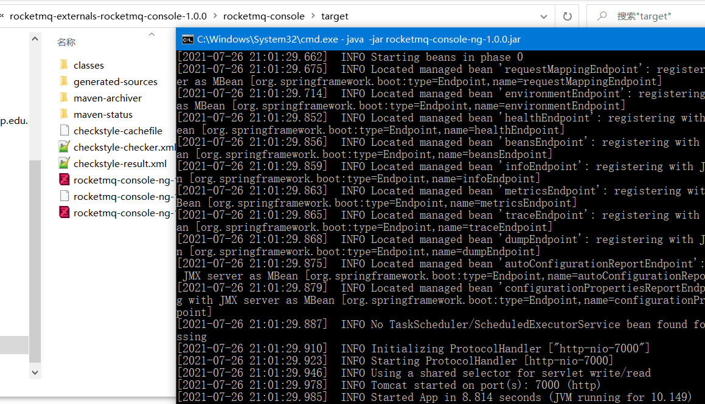

### mqadmin命令

> mqadmin是mq内置的运维命令，相较于可视化工具这个更加轻量与方便，可以对mq的主题、集群、broker等信息进行管理，接下来讲解一下如何使用该命令

#### 修改bin/tools.sh

> 在使用mqadmin之前首先需要修改，mq解压目录bin/tools.sh配置JDK的ext目录位置

~~~shell
# 本机mq bin目录下的tools.sh
vim bin/tools.sh
# 最后追加上本机的jdk ext路径
JAVA_OPT="${JAVA_OPT} -Djava.ext.dirs=${BASE_DIR}/lib:${JAVA_HOME}/jre/lib/ext:${JAVA_HOME}/lib/ext:/usr/local/jdk1.8.0_271/jre/lib/ext"
~~~

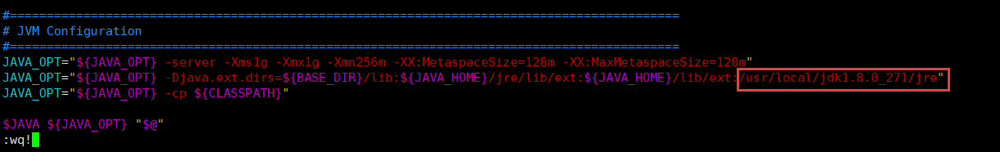

#### 命令解释

> 具体如何使用命令，我推荐阅读官方提供的中午文档，里面讲的更加的全面
>
> 官方文档连接：[mqadmin管理工具-官方中文文档](https://github.com/apache/rocketmq/blob/master/docs/cn/operation.md)

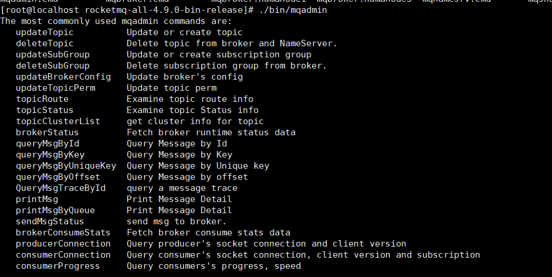

