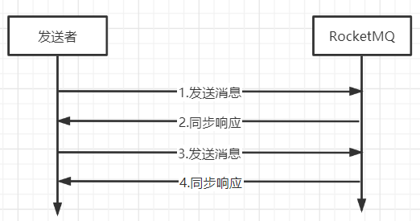
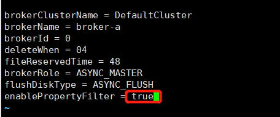

# RocketMQ-实战

## 普通消息

### 消息发送分类

#### 同步消息

> 同步消息发送是指，Producer发出消息后，需要收到MQ返回ACK之后才会发送下一条消息，该方式的消息可靠性最高，效率低

#### 异步消息

> 异步发送消息是指，Producer发出消息后无需等待MQ返回ACK，直接发送下一条消息，该方式消息可靠性有保障，效率也可以

#### 单向消息

> 单向发送是指，Producer只负责发消息，不等待，不处理MQ的ACK，MQ也不会返回ACK，该方式消息可靠性最低，效率最高

### 代码举例

#### 依赖引入

> 创建一个Maven工程，引入rocketmq依赖

~~~xml
<dependency>
    <groupId>org.apache.rocketmq</groupId>
    <artifactId>rocketmq-client</artifactId>
    <version>4.9.0</version>
</dependency>
~~~

#### 同步消息

> 使用producer.send(msg);方法发送消息后，可得到一个SendResult返回值，这是同步发送消息

~~~java
public class SyncProducer {
    public static void main(String[] args) throws MQClientException, RemotingException, InterruptedException, MQBrokerException {
        //创建一个producer，参数是Producer Group名称，多个Producer设置相同的Producer Group名称着是集群
        DefaultMQProducer producer = new DefaultMQProducer("SyncProducer");
        //指定nameServer地址
        producer.setNamesrvAddr("192.168.100.101:9876");
        //开启生产者
        producer.start();

        //生产并且发送100条消息
        for (int i = 0; i < 100; i++) {
            byte[] body = ("SyncMsgBody," + i).getBytes();
            Message msg = new Message("syncMsgTopic", "syncMsgTag", body);
            //发送消息
            SendResult sendResult = producer.send(msg);
            System.out.println(sendResult);
        }
        producer.shutdown();
    }
}
~~~

#### 异步发送

> 异步发送消息需要传入一个SendCallback的实现类，其中有2个回调函数onSuccess则是消息发送成功后执行的回调方法

~~~java
public class AsyncProducer {
    public static void main(String[] args) throws MQClientException, RemotingException, InterruptedException, MQBrokerException {
        //创建一个producer，参数是Producer Group名称，多个Producer设置相同的Producer Group名称着是集群
        DefaultMQProducer producer = new DefaultMQProducer("producerGroup");
        //指定nameServer地址
        producer.setNamesrvAddr("192.168.100.101:9876");
        //开启生产者
        producer.start();

        //生产并且发送100条消息
        for (int i = 0; i < 100; i++) {
            byte[] body = ("aSyncMsgBody," + i).getBytes();
            Message msg = new Message("asyncMsgTopic", "asyncMsgTag", body);
            //异步发送消息
            producer.send(msg, new SendCallback() {
                @Override
                //成功的回调事件
                public void onSuccess(SendResult sendResult) {
                    System.out.println(sendResult);
                }

                @Override
                public void onException(Throwable throwable) {

                }
            });
        }
        //生产环境下无需这样操作，如果不让线程挂起一下可能会消息未发送完毕后，主线程就退出了
        Thread.sleep(10);
        producer.shutdown();
    }
}
~~~

#### 单向消息

> 单向消息发送使用producer.sendOneway(msg);方法，无返回值

~~~java
public class OnewayProducer {
    public static void main(String[] args) throws MQClientException, RemotingException, InterruptedException, MQBrokerException {
        //创建一个producer，参数是Producer Group名称，多个Producer设置相同的Producer Group名称着是集群
        DefaultMQProducer producer = new DefaultMQProducer("OnewayProducer");
        //指定nameServer地址
        producer.setNamesrvAddr("192.168.100.101:9876");
        //开启生产者
        producer.start();

        //生产并且发送100条消息
        for (int i = 0; i < 100; i++) {
            byte[] body = ("msgBody," + i).getBytes();
            Message msg = new Message("msgTopic", "msgTag", body);
            //发送消息
            producer.sendOneway(msg);
        }
        producer.shutdown();
    }
}
~~~

#### 消息消费

> 这是一个简单的消费者，用于测试前面生产的消息

~~~java
public class ConsumerTest {
    public static void main(String[] args) throws MQClientException {
        //定义一个pull消费者
        //DefaultLitePullConsumer consumer = new DefaultLitePullConsumer("test");
        //定义一个push消费者
        DefaultMQPushConsumer consumer = new DefaultMQPushConsumer("test");
        //nameServer
        consumer.setNamesrvAddr("192.168.100.101:9876");
        //指定从第一条消息开始消费
        consumer.setConsumeFromWhere(ConsumeFromWhere.CONSUME_FROM_FIRST_OFFSET);
        //指定消费topic与tag
        consumer.subscribe("msgTopic","*");
        //注册消息监听器
        consumer.registerMessageListener(new MessageListenerConcurrently() {
            @Override
            public ConsumeConcurrentlyStatus consumeMessage(List<MessageExt> list, ConsumeConcurrentlyContext consumeConcurrentlyContext) {
                //逐条消费消息
                for (MessageExt messageExt : list) {
                    System.out.println(messageExt);
                }
                return ConsumeConcurrentlyStatus.CONSUME_SUCCESS;
            }
        });
        consumer.start();

    }
}
~~~

## 顺序消息

> 顺序消息：严格按照消息的发送顺序进行消费的消息(队列)
>
> 默认情况下默认情况下生产者会把消息以Round Robin轮询方式，发送到不同的Queue分区队列，而消费者消费是会从多个Queue上拉取消息
>
> 但有时候我们会有这样的业务场景，如一个订单我们希望这个消息是能够顺序消费的，像队列一样按照顺序先进去的先出来，那么我们要保证这个订单消费的有序性，那么就需要实现，这个订单从下单到结束的每一次消息都必须提交到同一个队列中，这样就可以保证这个订单是所有消息是被按顺序消费的

### 顺序消息分类

#### 全局有序

> 最简单粗暴的方式只给Topic配备一个Queue，所有的消息都写入到这个Queu那么这样就可以保证消息的顺序了，这称为`全局有序`
>
> 实现方式：
>
> 1. 在代码种创建Producer是，指定创建的Topic的Queue数量为1
> 2. 在RocketMQ可视化控制台种手动创建Topic时指定Queue数量1
> 3. 使用mqadmin命令手动创建Topic时指定Queue数量1

#### 分区有序

> 全局有序的缺点也显而易见，全局有序下的消费效率显然不够高，那么增加Queue如何保证消息的有序性呢，可以通过创建Producer时指定消息队列选择器，我们只需要实现自己的`MessageQueueSelector`即可，就要我们就可以控制消息始终有序的传给一个Queue中
>
> 那么如何计算一个订单始终都投递到相同的队列中呢
>
> 1. 将订单的唯一标识取模Queue的数量即可，由于订单唯一标识一直不变的所以可以确保每一次取模后结果都是一致，如果都被提交到相同的Queue中

### 代码举例

#### 全局有序

> 全局有序只需要在创建producer时，设置setDefaultTopicQueueNums为1即可

~~~java
public class TheOrderProducer {
    public static void main(String[] args) throws MQClientException, RemotingException, InterruptedException, MQBrokerException {
        //创建一个producer，参数是Producer Group名称，多个Producer设置相同的Producer Group名称着是集群
        DefaultMQProducer producer = new DefaultMQProducer("test");
        //指定nameServer地址
        producer.setNamesrvAddr("192.168.100.101:9876");
        //设置Topic只有一个Queue
        producer.setDefaultTopicQueueNums(1);
        //开启生产者
        producer.start();

        for (int i = 0; i < 100; i++) {
            byte[] body = ("msgBody," + i).getBytes();
            Message msg = new Message("msgTopic", "msgTag", body);
            SendResult sendResult = producer.send(msg);
            System.out.println(sendResult);
        }
    }
}
~~~

#### 分区有序

~~~java
public class TheOrderProducer {
    public static void main(String[] args) throws MQClientException, RemotingException, InterruptedException, MQBrokerException {
        //创建一个producer，参数是Producer Group名称，多个Producer设置相同的Producer Group名称着是集群
        DefaultMQProducer producer = new DefaultMQProducer("test");
        //指定nameServer地址
        producer.setNamesrvAddr("192.168.100.101:9876");
        //开启生产者
        producer.start();

        for (int i = 0; i < 100; i++) {
            int orderId = i;
            byte[] body = ("msgBody," + i).getBytes();
            Message msg = new Message("msgTopic", "msgTag", body);
            msg.setKeys(String.valueOf(orderId));
            //使用自定义的队列选择器发送消息
            SendResult sendResult = producer.send(msg, new MyMsgQueueSelector(), orderId);
            System.out.println(sendResult);
        }
    }

    //自定义队列选择器
    private static class MyMsgQueueSelector implements MessageQueueSelector {

        //发送消息给Queue的选择算法
        @Override
        public MessageQueue select(List<MessageQueue> list, Message message, Object arg) {
            //获取key 方式1 ： producer.send(msg,new MyMsgQueueSelector(),orderId); orderId 与 arg 对应
            //int orderId = (int) arg;
            //获取key 方式2(推荐) ：msg.setKeys(String.valueOf(orderId)); 从msg中获取
            Integer orderId = Integer.valueOf(message.getKeys());
            //将订单号取模当前Topic中的Queue数量
            int index = orderId % list.size();
            return list.get(index);
        }
    }
}
~~~

## 延时消息

> 当消息写入到Broker后，在指定的时长后才会被消费，这种称为延时消息
>
> RockerMQ的延时消息可以实现定时任务的功能，无需使用定时器，如超时未支付关闭订单这样的业务都可以实现(下单后发送一个延迟消息，30分钟后再给消费者消费，消费者收到后会判断该订单是否完成支付，若未完成就把库存退回去把超时订单删除)

### 延时等级

> 在RockerMQ的`延时时长不支持随意设置时长，是通过延时等级来指定的`，延时等级定义在RocketMQ服务端的MessageStoreConfig类中，如果延时等级设置为2表示5s后消息会被消费

> 当然如果需要修改延时等级也是可以修改的，需要通过修改broker的配置文件即可，配置文件在RocketMQ安装目录下的conf目录中(就是你平时修改的broker.conf)，增加如下配置即可

~~~shell
messageDelayLevel = 1s 5s 10s 30s 1m 2m 3m 4m 5m 6m 7m 8m 9m 10m 20m 30m 1h 2h 1d 2d
~~~

### 延时消息的实现

> 当你发送一个延时消息给RocketMQ其实经历了如下步骤
>
> 1. 第1步：消息会被写入到CommitLog文件中
> 2. 第2步：如果是延时消息那么他会进入到`SCHEDYLE_TOPIC_XXX`主题，队列中
> 3. 第3步：消息会被`ScheduleMessageService`消费掉，里面会管理每个延时消息的计时器
> 4. 第4步：当计算器到时间了，`ScheduleMessageService`会充当生产者把消息发到CommitLog中
> 5. 第5步：这时延时消息就变为正常消息，被写入到你的目标Topic中
> 6. 第6步：最终被你写好的消费者消费掉

### 代码举例

~~~java
public class DelayProducer {
    public static void main(String[] args) throws MQClientException, RemotingException, InterruptedException, MQBrokerException {
        //创建一个producer，参数是Producer Group名称，多个Producer设置相同的Producer Group名称着是集群
        DefaultMQProducer producer = new DefaultMQProducer("test");
        //指定nameServer地址
        producer.setNamesrvAddr("192.168.100.101:9876");
        //开启生产者
        producer.start();

        //生产并且发送10条消息
        for (int i = 0; i < 10; i++) {
            byte[] body = ("msgBody," + i).getBytes();
            Message msg = new Message("msgTopic", "msgTag", body);
            //延时等级3级，即延时10s后才被消费
            msg.setDelayTimeLevel(3);
            //延时消息
            SendResult sendResult = producer.send(msg);
            System.out.println(sendResult);
        }
        producer.shutdown();
    }
}
~~~

## 事务消息

> 在实际开发过程中，分布式系统下常常会使用到事务消息，通过如下举例解释为什么需要使用事务消息
>
> 如图是一个转账功能，在非事务的情况下执行，会发送什么
>
> 1. 当用户点击转账，首先工行系统会发送一个转账消息给Broker
> 2. Broker收到消息后返回确认ACK表示消息进入队列了，工行系统开始对用户A扣钱
> 3. 建行系统消费Broker中的消息，对用户B加强
>
> 存在问题：可以看出这其中存在一个问题，假如用户A扣钱失败了怎么办，但是转账消息已经给到Broker了，意思是不管工行系统是否有异常最终转账消息都会被建行系统消费，给用户B加钱，这就存在一个数据不一致的问题
>
> 解决思路：分析得出，工行系统中的发送转账消息、等待返回ACK、用户扣钱这3个步骤必须是一致性操作，要不全部成功扣款成功，如果有其中一个环节出现问题那么发送的转账消息必须回滚，不能让建行系统消费掉，使用分布式事务解决该问题

### 分布式事务思路

> 从转账问题中可以得出工行系统中的发送转账消息、等待返回ACK、用户扣钱这3个步骤必须是一致性操作，那么利用分布式事务的思路解决转账问题，首先这里面新增了2个角色TM(事务管理器，管理全局事务)、TC(事务协调者，管理分支事务)，首先我们将发送转账消息、等待返回ACK、用户扣钱定义为全局事务，那么TC着分别管理工行系统的分支事务
>
> 1. 事务管理器TM向事务协调器TC发起，`全局事务`指令
> 2. 工行系统需要转账的事务消息发给TC
> 3. TC会向Broker发送`半事务消息prepareHalf`，将消息`预提交`到Broker(这时的建行系统是看不到Broker中的转账消息的)
> 4. Broker返回`预提交`执行结果Report给TC
> 5. 如果预提交失败，TC会向TM上报预提交失败响应，全局事务结束，如果预提交成功，TC会调用工行系统的`回调操作`完成预扣款操作
> 6. 完成扣款操作后工行系统会发送执行结果给TC，即`本地事务状态`
> 7. TC收到扣款结果后会上报给TM
> 8. TM收到结果会向TC发出不同的最终指令
>    * 扣款成功(COMMIT_MESSAGE)：则TM向TC发送Global Commit指令
>    * 扣款失败(ROLLBACK_MESSAGE)：则TM向TC发送Global Rollback指令
>    * 状态未知(UNKNOW)：则会触发工行系统的本地事务状态回查操作，回查操作会将回查结果扣款成功/扣款失败给TC，TC再将结果上报给TM
> 9.  TC在接收到指令后会向Broker与工行系统发出确认指令

### 分布式事务基础

分布式事务，即一次性操作由若干个分支操作组成，`这些分支操作分别属于不同的应用中(不同的JVM)，分布在不同的服务器上`，分布式事务需要保证这些分支操作要么全部成功，要么全部失败，分布式事务与普通事务目的都是一样的，为了保证数据的一致性

#### 事务消息

> RocketMQ提供了类似X/Open XA的分布式事务功能，通过事务消息能达到分布式事务的最终一致性，XA是一种分布式事务解决方案，一种分布式事务处理模式

#### 半事务消息

> 半事务消息，即暂不能消费的消息，发送方已经成功将消息发送到Broker，但是Broker未收到最终确认指令，这时该消息被称为半事务消息，并且消费者也不会看到该消息

#### 本地事务状态

> Producer`回调操作执行的结果`为本地事务状态，会发送给TC，而TC会再发送给TM，TM会根据TC的本地事务状态来确认发出最终的确认指令Global Commit/Global Rollback
>
> 在RocketMQ中的提供的LocalTransactionState对象有3中本地事务状态
>
> 1. 事务执行成功
> 2. 事务执行失败
> 3. 不确定

#### 消息回查

>消息回查，即重新查询本地事务的执行状态，如果本地事务状态为`UNKONW(不确定)`或由于网络等原因TC未收到事务状态消息，那么这时就会一直触发消息回查，`直到本地事务状态返回COMMIT_MESSAGE或ROLLBACK_MESSAGE`才会停止
>
>RocketMQ消息回查设置，修改Broker配置文件如下配置
>
>transactionTimeout=20：指定TM在20秒内应将最终确认状态发送给TC，否则引发消息回查。默 认为60秒 transactionCheckMax=5：指定最多回查5次，超过后将丢弃消息并记录错误日志。默认15次。
>transactionCheckInterval=10：指定设置的多次消息回查的时间间隔为10秒。默认为60秒。

### XA模式组件

> XA（Unix Transaction）是一种分布式事务解决方案，一种分布式事务处理模式，是基于XA协议的， XA协议由Tuxedo（Transaction for Unix has been Extended for Distributed Operation，分布式操作扩 展之后的Unix事务系统）首先提出的，并交给X/Open组织，作为资源管理器与事务管理器的接口标准
>
> XA模式中有三个重要组件：TC、TM、RM
>
> 1. TC(Transaction Coordinator)：事务协调者，维护全局和分支事务的状态，驱动全局事务提交或回滚，`RocketMQ中Broker充当着TC`
> 2. TM(Transaction Manager)：事务管理器，定义全局事务的范围：开始全局事务、提交或回滚全局事务。它实际是全局事务的发起者，`RocketMQ中事务消息的Producer充当着TM`
> 3. RM(Resource Manager)：资源管理器，管理分支事务处理的资源，与TC交谈以注册分支事务和报告分支事 务的状态，并驱动分支事务提交或回滚，`RocketMQ中事务消息的Producer及Broker均是RM`

### XA模式架构

> XA模式是一个典型的2PC，其执行流程如下
>
> 1. TM向TC发起指令，开启一个全局事务(Begin Global Transaction)
> 2. 根据业务要想，各个RM会逐个向TC注册分支事务(Register Branch)，然后TC会逐个向RM发出执行指令
> 3. 各个RM在收到指令后会进行本地事务预执行
> 4. TM将本地事务预执行结果Report给TC(Banch Status Repon)，这结果可能是成功，也可能是失败
> 5. TC在接收到各个RM的Report后会将汇总结果上报给TM，根据汇总结果TM会向TC发出最终确认指令
>    * 若所有RM结果都是响应成功，则向TC发送Global Commit指令
>    * 只要有任意RM结果是失败响应，则向TC发送Global Rollback指令
> 6. TC在收到指令后再次向RM发送确认指令
>
> `RocketMQ的事务方案与典型的XA模式并不是完全一致的，可以看出XA模式下的分支事务RM都是异步的，而RocketMQ的事务消息预提交与预扣款操作是同步的`

### 代码举例

> 事务消息使用注意
>
> 1. 事务消息不支持延时消息
> 2. 对于事务消息要做好幂等性检查，因为事务消息存在回滚后重新提交的情况，所以可能会被多次消费

~~~java
public class TransactionProducer {
    public static void main(String[] args) throws MQClientException {
        TransactionMQProducer producer = new TransactionMQProducer("transaction");
        producer.setNamesrvAddr("192.168.100.101:9876");

        //定义一个线程池
        ExecutorService executorService = new ThreadPoolExecutor(2, 5, 100,
                TimeUnit.SECONDS, new ArrayBlockingQueue<>(2000), new ThreadFactory() {
            @Override
            public Thread newThread(Runnable r) {
                Thread thread = new Thread(r);
                thread.setName("client-transaction-msg-check-thread");
                return thread;
            }
        });

        //为生产者指定一个线程池
        producer.setExecutorService(executorService);
        //为生产者添加事务监听器
        producer.setTransactionListener(new ICBCTransactionListener());
        producer.start();

        //发送3种不同的消息
        String[] tags = {"msgTagCommit","msgTagRollback","msgTagUnknow"};
        for (int i = 0; i < 3; i++) {
            byte[] body = ("msgBody," + i).getBytes();
            Message msg = new Message("msgTopic", tags[i], body);
            SendResult sendResult = producer.sendMessageInTransaction(msg, null);
        }

    }

    //事务监听器
    private static class ICBCTransactionListener implements TransactionListener{

        //消息预提交成功后就会触发该回调
        @Override
        public LocalTransactionState executeLocalTransaction(Message message, Object o) {
            System.out.println("预提交消息成功："+message);
            switch (message.getTags()){
                //假如收到msgTagCommit消息，表示执行扣款业务成功
                case "msgTagCommit":
                    System.out.println("扣款业务执行成功");
                    return LocalTransactionState.COMMIT_MESSAGE;
                //假如收到msgTagRollback消息，表示执行扣款业务失败
                case "msgTagRollback":
                    System.out.println("扣款业务执行失败");
                    return LocalTransactionState.ROLLBACK_MESSAGE;
                //假如收到msgTagUnknow消息，表示执行扣款业务未有执行结果
                case "msgTagUnknow":
                    System.out.println("扣款业务执行中，未有结果");
                    return LocalTransactionState.UNKNOW;
                default:
                    return LocalTransactionState.UNKNOW;
            }
        }

        //消息回查
        @Override
        public LocalTransactionState checkLocalTransaction(MessageExt messageExt) {
            System.out.println("执行消息回查："+messageExt.getTags());
            System.out.println("正在查询数据库，获取预扣款结果");
            System.out.println("预扣款结果为成功");
            return LocalTransactionState.COMMIT_MESSAGE;
        }
    }
}
~~~

## 批量消息

### 批量发送

> 生产者在进行消息时可以一次性发送多条消息的，这可以很好的提高了Producer的生产效率，但是在使用批量发送时需要注意以下几点
>
> 1. 批量发送的消息必须是系统的Topic下
> 2. 批量发送的消息必须是系统的刷盘策略
> 3. 批量发送的消息不能是延时消息或事务消息
> 4. 默认情况下，每一批发送消息总大小不能超过4MB，若需要超过有2个解决方案
>    * 方案1：自己实现消息分解工具，将消息拆分若干个4M内的小消息集合分多次发送
>    * 方案2：修改Producer端配置`producer.setMaxMessageSize()`，相应的Broker的conf也需要修改`maxMessageSize=xx`，若不同时修改无法生效

#### 生产者发送消息结构

> 了解消息结构有助于后面编写消息分解工具，生产的Message消息对象，最后会被通过编码序列化成如下结构的byte流，该流由4部分组成
>
> Topic：Topic内容
>
> Body：消息体
>
> Log：消息日志，固定长度20字节
>
> Properties：已key-value方式存储的描述信息，如生产者地址、生产实际、发送到的QueueId等信息

### 批量消费

> 消费者在消费时也可以同时获取多条数据进行消费，在使用消费者时consumeMessage方法可以看到是接收List< MessageExt >容器的，默认情况下每次只能消费一条消息，即默认情况List< MessageExt >的Size为1
>
> 如果想要一次性处理多条消息，那么可以通过修改`consumer.setConsumeMessageBatchMaxSize()`表示当前消费者调用一次consumeMessage回调时传入的List的Size大小，但是该值不能超过32因为默认情况下消费者每次可以拉取最多32条数据，那么相应的你每次消费最多一次性消费32条
>
> 通过修改`consumer.setPullBatchSize()`就可以提高消费者一次性拉取的消息数量，也能相应的提高消费者一次性处理的消息条数
>
> 当然盲目的扩大pullBatchSize与consumeMessageBatchMaxSize并不能无限的提高效率，并且使用时需要注意以下几点
>
> 1. PullBatchSize设置的越大，导致每次都需要一次性拉取大量消息，那么Consumer每次去Brocker拉取一次消息的时间就会越长，且如果网络存在波动闪断，那么本批消息需要重新拉取那将会消耗跟多的时间
> 2. ConsumeMessageBatchMaxSize设置的越大，在Consumer每次调用回调耗时越长，那么Consumer的消息并发能力越低，并且由于每次都是消费一批消息最终只能能返回一个结果给Broker，那么表示如果这批消息若其中一条消息消费出现异常那么整批消息着需要重新消费

### 代码举例

#### 消息列表分割器

> 在前面说到，在进行消息分批发送时，每次发送的消息集合不能超过4M，所以需要自己实现消息列表分割器，将消息分为多个4M一个集合发送出去

~~~java
public class MessageListSplitter implements Iterator<List<Message>> {
    //指定最大4M
    private final int SIZE_LIMIT = 1204 * 1024 * 4;
    //存放所有需要发送的消息
    private final List<Message> messages;
    //拆分到的消息下标
    private int currIndex;

    public MessageListSplitter(List<Message> messages) {
        this.messages = messages;
    }

    @Override
    public boolean hasNext() {
        return currIndex < messages.size();
    }

    @Override
    public List<Message> next() {
        int nextIndex = currIndex;
        int totalSize = 0;
        for (;nextIndex < messages.size();nextIndex++){
            Message message = messages.get(nextIndex);
            //获取Message内容所有长度叠加
            int tmpSize = message.getTopic().length() + message.getBody().length;
            Map<String, String> properties = message.getProperties();
            for (Map.Entry<String, String> entry : properties.entrySet()) {
                tmpSize += entry.getKey().length() + entry.getValue().length();
            }
            tmpSize = tmpSize + 20;

            //临时存储消息大小 > 4M 结束循环
            if (tmpSize > SIZE_LIMIT){
                //若单条消息 > 4M 把下标移动一位，直接返回单条消息
                if (nextIndex - currIndex == 0){
                    nextIndex++;
                }
                break;
            }

            //将当前临时消息长度假如到总消息长度
            //若 > 4M 结束循环
            if (tmpSize + totalSize > SIZE_LIMIT){
                break;
            }else {
                totalSize += tmpSize;
            }

        }

        //根据其实位置与结束位置下标拆分消息列表
        List<Message> subList = messages.subList(currIndex, nextIndex);
        currIndex = nextIndex;
        return subList;
    }
}
~~~

#### 批量消息生产者

~~~java
public class BatchProducer {
    public static void main(String[] args) throws MQClientException {
        DefaultMQProducer producer = new DefaultMQProducer("test");
        producer.setNamesrvAddr("192.168.100.101:9876");
        //指定要发送的消息最大大小，默认4M
        //除了修改该属性，还需要同时修改broker的配置文件中的maxMessageSize属性才会生效
        producer.setMaxMessageSize(1024 * 1024 * 4);
        producer.start();

        //把要发送的消息都放入集合中
        List<Message> messageList = new ArrayList<>();
        for (int i = 0; i < 100; i++) {
            byte[] body = ("msgBody," + i).getBytes();
            Message msg = new Message("msgTopic", "msgTag", body);
            messageList.add(msg);
        }

        //需要自己手动拆分消息列表，每次发送不能超4M
        MessageListSplitter splitter = new MessageListSplitter(messageList);
        while (splitter.hasNext()){
            try {
                List<Message> list = splitter.next();
                producer.send(list);
            } catch (Exception e) {
                e.printStackTrace();
            }
        }

        producer.shutdown();
    }
}
~~~

#### 批量消息消费者

~~~java
public class BatchConsumer {
    public static void main(String[] args) throws MQClientException {
        //定义一个push消费者
        DefaultMQPushConsumer consumer = new DefaultMQPushConsumer("test");
        consumer.setNamesrvAddr("192.168.100.101:9876");
        consumer.setConsumeFromWhere(ConsumeFromWhere.CONSUME_FROM_FIRST_OFFSET);
        consumer.subscribe("msgTopic","*");
        //指定每次消费10条消息(List<MessageExt>.size = 10)，默认1
        consumer.setConsumeMessageBatchMaxSize(10);
        //指定每次从Broker拉取40条消息，默认32
        consumer.setPullBatchSize(40);

        //注册消息监听器
        consumer.registerMessageListener(new MessageListenerConcurrently() {
            @Override
            public ConsumeConcurrentlyStatus consumeMessage(List<MessageExt> list, ConsumeConcurrentlyContext consumeConcurrentlyContext) {
                //逐条消费消息
                for (MessageExt messageExt : list) {
                    System.out.println(messageExt);
                }
                //每一批消息，只能返回1个结果，返回失败意味着整批消息需要重新消费
                return ConsumeConcurrentlyStatus.CONSUME_SUCCESS;
            }
        });
        consumer.start();

    }
}
~~~

## 消息过滤

> 消费者在进行消息订阅时，除了可以指定要订阅的消息Topic外，还可以对指定消费Topic中的消息Tag，针对过滤Topic消息的方式有2种：Tag过滤与SQL过滤

### Tag过滤

> 通过`consumer.subscribe`方法就可以指定要订阅的消息的Tag，如果需要同时订阅多个那么就需要使用`||`进行分割

~~~java
DefaultMQPushConsumer consumer = new DefaultMQPushConsumer("test");
consumer.subscribe("Topic","TAGA || TAGB || TAGC");
~~~

### SQL过滤

> SQL过滤的使用比Tag更加的灵活，通过特定的表达式对消息中的`用户属性`进行筛选过滤，`注意：只有PUSH模式的消费者才能使用SQL过滤`

**常量类型**

| 常量类型 | 说明               | 例子                  |
| -------- | ------------------ | --------------------- |
| 数值     | 整数/小数          | 123 , 3.1415          |
| 字符     | 必须使用单引号包裹 | 'abc'                 |
| 布尔     | 表示真与假         | TRUE , FALSE          |
| NULL     | 表示空             | IS NULL , IS NOT NULL |

**运算符**

| 运算符   | 例子 |
| -------- |  ---- |
| 数值比较 | > , >= , < , <= , BETWEEN AND , = |
| 字符比较 | = , <> , IN |
| 逻辑运算 | AND , OR , NOT |
| NULL判断 | IS NULL , IS NOT NULL |

### 代码举例

#### Tag过滤消费者

> 该消费者只会订阅Topic为msgTopic，Tag为TAGA或TAGNB的消息

~~~java
public class FillerTagConsumer {
    public static void main(String[] args) throws MQClientException {
        //定义一个push消费者
        DefaultMQPushConsumer consumer = new DefaultMQPushConsumer("test");
        consumer.setNamesrvAddr("192.168.100.101:9876");
        consumer.setConsumeFromWhere(ConsumeFromWhere.CONSUME_FROM_FIRST_OFFSET);
        consumer.subscribe("msgTopic","TAGA || TAGNB");

        //注册消息监听器
        consumer.registerMessageListener(new MessageListenerConcurrently() {
            @Override
            public ConsumeConcurrentlyStatus consumeMessage(List<MessageExt> list, ConsumeConcurrentlyContext consumeConcurrentlyContext) {
                //逐条消费消息
                for (MessageExt messageExt : list) {
                    System.out.println(messageExt);
                }
                return ConsumeConcurrentlyStatus.CONSUME_SUCCESS;
            }
        });
        consumer.start();
    }
}
~~~

#### SQL过滤

##### SQL过滤功能开启

> 默认情况下该功能是关闭的，需要修改Broker配置文件，开启即可

~~~shell
# vim conf/broker.conf
enablePropertyFilter = true
# 关闭broker与namesrv
./bin/mqshutdown broker
./bin/mqshutdown namesrv
# 启动namesrv
./bin/mqshutdown namesrv
# 指定配置文件启动broker
nohup sh bin/mqbroker -n localhost:9876 -c conf/broker.conf &
~~~

##### SQL过滤生产者

> 生产者使用`msg.putUserProperty()`传入用户属性

~~~java
public class FillerSqlProducer {
    public static void main(String[] args) throws MQClientException, RemotingException, InterruptedException, MQBrokerException {
        DefaultMQProducer producer = new DefaultMQProducer("test");
        producer.setNamesrvAddr("192.168.100.101:9876");
        producer.start();

        //生产并且发送10条消息
        for (int i = 0; i < 10; i++) {
            byte[] body = ("msgBody," + i).getBytes();
            Message msg = new Message("msgTopic", "msgTag", body);
            //为消息传入用户属性
            msg.putUserProperty("age",i+"");
            SendResult sendResult = producer.send(msg);
            System.out.println(sendResult);
        }
        producer.shutdown();
    }
}
~~~

##### SQL过滤消费者

> 消费者通过`MessageSelector.bySql`指定需要过滤条件

~~~java
public class FillerSqlConsumer {
    public static void main(String[] args) throws MQClientException {
        DefaultMQPushConsumer consumer = new DefaultMQPushConsumer("test");
        consumer.setNamesrvAddr("192.168.100.101:9876");
        consumer.setConsumeFromWhere(ConsumeFromWhere.CONSUME_FROM_FIRST_OFFSET);
        //使用消息选择器(MessageSelector)，指定消费msgTopic中用户属性age 0-6的消息
        consumer.subscribe("msgTopic", MessageSelector.bySql("age between 0 and 6"));

        //注册消息监听器
        consumer.registerMessageListener(new MessageListenerConcurrently() {
            @Override
            public ConsumeConcurrentlyStatus consumeMessage(List<MessageExt> list, ConsumeConcurrentlyContext consumeConcurrentlyContext) {
                //逐条消费消息
                for (MessageExt messageExt : list) {
                    System.out.println(messageExt);
                }
                return ConsumeConcurrentlyStatus.CONSUME_SUCCESS;
            }
        });
        consumer.start();
    }
}
~~~

## 消息重试

### 消息重试设置

> 若出现消息消费过程中出现了问题，那么必须在监听器接口实现以下3种方式的一种后，问题消息将会被重试
>
> 1. 返回ConsumeConcurrentlyStatus.RECONSUME_LATER;(官方推荐)
> 2. 返回null
> 3. 抛异常

~~~java
public class RetryConsumer {
    public static void main(String[] args) throws MQClientException {
        DefaultMQPushConsumer consumer = new DefaultMQPushConsumer("test");
        consumer.setNamesrvAddr("192.168.100.101:9876");
        consumer.setConsumeFromWhere(ConsumeFromWhere.CONSUME_FROM_FIRST_OFFSET);
        consumer.subscribe("msgTopic","*");

        //注册消息监听器
        consumer.registerMessageListener(new MessageListenerConcurrently() {
            @Override
            public ConsumeConcurrentlyStatus consumeMessage(List<MessageExt> list, ConsumeConcurrentlyContext consumeConcurrentlyContext) {
                
                try {
                    //逐条消费消息
                    for (MessageExt messageExt : list) {
                        System.out.println(messageExt);
                    }
                    return ConsumeConcurrentlyStatus.CONSUME_SUCCESS;
                }catch (Throwable e){
                    //方法1：发送异常返回消息需要重试(官方推荐)
                    return ConsumeConcurrentlyStatus.RECONSUME_LATER;
                    //方法2：返回null
//                    return null;
                    //方法3：随意抛一个异常
//                    throw new RuntimeException("消费异常");
                }

            }
        });
        consumer.start();

    }
}
~~~

### 消息不重试设置

> 无论代码执行的怎么样都返回ConsumeConcurrentlyStatus.CONSUME_SUCCESS即可

~~~java
try {
    //逐条消费消息
    for (MessageExt messageExt : list) {
        System.out.println(messageExt);
    }
    return ConsumeConcurrentlyStatus.CONSUME_SUCCESS;
}catch (Throwable e){
    return ConsumeConcurrentlyStatus.CONSUME_SUCCESS;
}
~~~

