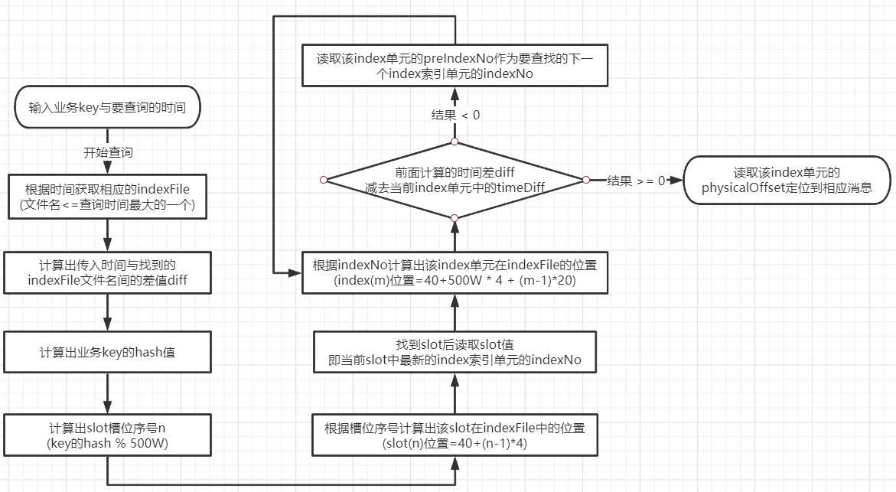
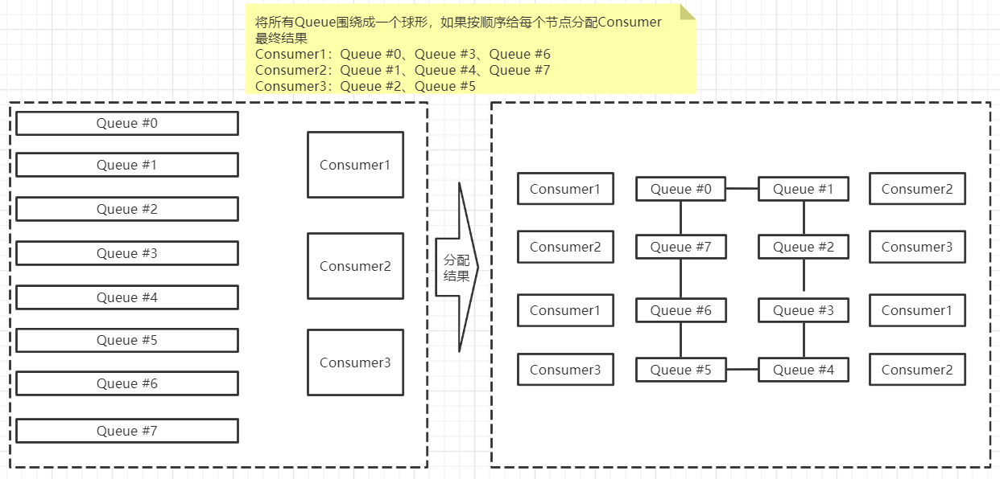

# RocketMQ原理

## 消息的生产

> Producer在将消息写入到某个Broker中的某个Queue中，经历了什么
>
> 1. Producer发送消息之前，会先向NameServer发出获取`消息Topic的路由信息`的请求
> 2. NameServer会返回Topic的`路由表`以及`Broker列表`给Producer
> 3. Producer会根据`负载均衡策略`，从Queue列表中选出一个用于消息的存储
> 4. Producer对消息会做一些特殊处理，如消息超过4M会进行压缩
> 5. Producer向选择出的Queue所在的Broker发出RPC请求，将消息发送到指定的Queue中
>
> 路由表：NameServer所返回的路由表是key,value格式的，key是Toicp名称，value是QueueData实例列表(里面包含着某个Broker中的某个Toicp下的所有Queue)
>
> Broker列表：NameServer所返回的Broker列表是key,value格式的，key是BrokerName名称，value是Broker对应的BrokerData实例(里面包含着同一个Broker下的多个Master-Slave小集群)，在在BrokerData中还包含在一个map，key为brokerId(brokerId为0表示Master，非0表示Slave)，value为该Broker对应的地址

## Queue算法

> 对于无序消息，其Queue选择算法，也称为消息投递算法，常见的有2种

**轮询算法**

> 轮询算法是Producer消息投递的默认算法，该算法保证每个Queue中可以均匀的获取到消息
>
> 缺点：由于是轮询投递所以每个Queue都会收到消息，Producer投递消息给Queue时需要等待Queue返回ACK才会投递下一个消息，这就会存在一个问题如果其中一个Queue响应时间很长，这样会导致Producer堆积很多没有投递的消息

**最小投递延迟算法**

> 最小投递延迟算法，可以缓解轮询算法的消息积压问题，该算法会统计每次消息投递的延迟，根据统计结果将消息投递到延迟最小的Queue中，如果延迟相同，则采用轮询算法投递
>
> 缺点：最小投递延迟算法虽然可以解决消息挤压的问题，但是还是有缺点的由于通过计算Queue返回ACK的延迟选择最短的投递，那么有些延迟较长的可能永远也收不到一条消息，极端情况下可能有一个Queue响应时间一直很块，那么所有消息都投递给它了，其它Queue只能无所事事

## store结构

> RocketMQ启动成功后默认会在`~/store`目录下生成一些文件，当然如果在配置文件配置了则会在你指定的地方生成
>
> * abort：当Broker启动后会自动创建，正常关闭Broker该文件也会自动消息，若在没启动Broker时发现有这个文件存在，表示上一次Broker关机是非正常关机的
>
> * checkpoint：里面存储着commitlog、consumequeue、index文件最后刷盘时间戳(持久化到磁盘的时间)
>
> * commitlog：消息都是被写道这个文件中的
>
> * config：存放Broker运行时的配置信息
>
> * consumequeue：队列信息存放在这个目录
>
> * index：存放着消息索引文件indexfile
>
> * lock：运行期间使用到的全局资源锁

### commitlog

#### mappedFile

> commitlog目录中存放很多的mappedFile文件，当前Broker中的所有消息都是落盘到这些mappedFile文件文件，mappedFile文件默认最大为1G，文件明是20位10进制数构成，表示当前文件的第一条消息起始偏移量
>
> 每一个mappedFile文件物理上是被拆分的，但是逻辑上是连续的如图可以看一个存放消息的mappedFile文件，可以看到第3个消息有一部分存在了第1个mappedFile另外一部分存在第2个mappedFile，所以第1个mappedFile文件名一定是0，第2个mappedFile的文件名则是1.2G的10进制接下来的文件以此类推

#### 消息单元

> 一个Broker中只会有一个commitlog目录，Broker接收到的所以消息都会`顺序`存放进mappedFile，不管你是什么Topic消息，也就是说Broker中存放消息时是没有按照Topic进行分类存放的，那是如何区分这些消息是那个Queue，那个Topic的呢
>
> 每1条消息最后会变成一行一行的消息单元存放到mappedFile，每1个消息单元的组成是由：MsgLen(消息总长)、PhysicalOffset(物理地址)、Body(消息内容)、BodyLength(消息内容长度)、BornHost(消息生产者)、BormTimestamp(消息发送的时间戳)、Topic(该消息主题)、QueueId(该消息所属QueueId)、QueueOffset(消息在Queue中的偏移量)等20多项数据

### consumequeue

> 刚刚讲到mappedFile是用于存放消息的各种信息，从这些信息可以知道当前消息属于那个Queue那个Topic，那么如果通过遍历mappedFile去获取消息是相当麻烦的事情
>
> 为了提高效率，RocketMQ在为每个Topic在`~/store/consumequeue`中创建一个目录，目录名称就是Topic的名称，在该Topic下会为每个Queue创建独立的目录，目录名为QueueId，每个目录中存放着若干的consumequeue文件，consumequeue是commitlog的索引文件，可以通过consumequeue定位到commitlog的具体消息
>
> consumequeue文件名也是20个数组构成，文件名表示当前的第一个索引条目的起始偏移量，与commitlog不同之处，consumequeue文件名是固定的，因为consumequeue大小是固定的

#### 索引条目

> 为什么说consumequeue文件名是固定的，因为consumequeue大小是固定呢？
>
> 因为是索引条目，每一个索引条目在consumequeue中是固定长度的，一个consumequeue文件中可以包含30w个索引条目，每一个索引条目都包含着3个关联消息的重要属性：CommitLog Office(8字节)、消息长度(4字节)、消息Tag的hashcode值(8字节)，这3个属性占20个字节

### 消息写入

> 一条消息进入到Broker后经过以下几个步骤最终会被持久化
>
> 1. Brocker根据queueId，获取到consumequeue写入偏移量(queueoffset)，即要从那个位置继续写入索引条目
> 2. 将queueId、queueoffset等数据，与消息一起封装为消息单元
> 3. 将消息单元写入到commitlog，同时形成消息索引目录
> 4. 将消息索引目录写入到相应的consumequeue

## 读写性能

> RocketMQ中，无论是消息本身还是消息索引，都是存储在磁盘上的，并且RocketMQ的性能在目前的MQ产品中性能是非常高的，它是如何做到高性能读写的呢
>
> 1. RocketMQ对文件的读写操作是通过[mmap零拷贝](../网络编程专栏/java-NIO性能优化.md)进行的，将对文件的操作转化为直接对内存地 址进行操作，从而极大地提高了文件的读写效率
> 2. consumequeue中的数据是顺序存放的，还引入了PageCache的预读取机制，使得对 consumequeue文件的读取几乎接近于内存读取，即使在有消息堆积情况下也不会影响性能
> 3. RocketMQ中可能会影响性能的是对commitlog文件的读取，因为对commitlog文件来说，读取消息时 会产生大量的随机访问，而随机访问会严重影响性能，不过，如果选择合适的系统IO调度算法，比如设置调度算法为Deadline（采用SSD固态硬盘的话），随机读的性能也会有所提升

## indexFile

> 除了通过正常的指定Topic进行消息消费外，RocketMQ还提供了一种根据key进行消息查询的功能，该查询通过store目录中的index子目录中的indexFile进行索引实现查询的，当Broker收到包含key的消息时这个消息索引就会被写入indexFile，如果消息没key不会写入

### 索引条目

> 每个Broker中会包含一组indexFile，每个indexFile都是以一个时间戳命名(这个indexFile创建时的时间戳)，每个indexFile文件由3部分组成：indexHeader、slots、indexes索引数据，每个indexFile文件中包含500w个slot槽，而每个slot槽由可能会挂载很多的index索引单元

#### indexHeader

> indexHeader固定40个字节，内容如下
>
> beginTimestamp：该indexFile中第一条消息的存储时间  endTimestamp：该indexFile中最后一条消息存储时间 beginPhyoffset：该indexFile中第一条消息在commitlog中的偏移量commitlog offset endPhyoffset：该indexFile中最后一条消息在commitlog中的偏移量commitlog offset  hashSlotCount：已经填充有index的slot数量(并不是每个slot槽下都挂载有index索引单元，这 里统计的是所有挂载了index索引单元的slot槽的数量)  indexCount：该indexFile中包含的索引单元个数（统计出当前indexFile中所有slot槽下挂载的所有index索引单元的数量之和）

#### indexes

> indexes单元默认20个字节，其中存放着以下4个属性
>
> keyHash：消息中指定的业务key的hash值 phyOffset：当前key对应的消息在commitlog中的偏移量commitlog offset timeDiff：当前key对应消息的存储时间与当前indexFile创建时间的时间差 
> preIndexNo：当前slot下当前index索引单元的前一个index索引单元的indexNo

#### slots与indexes

> 在indexFile中slots与indexes关系是最复杂的，在实际的存储下slots与indexes是分开存储的，但是它们最终逻辑上的关联如图，那么是如何传入将来的呢
>
> 1. Broker会对有key的消息的key进行计算hash值%500w得出slot(槽位)
> 2. 找到对应slot，修改slot中的indexNo为刚刚计算出来(这样slot的indexNo一直都是最新的消息)
> 3. 由于取模发送hash碰撞，发送碰撞的key会被用链表的形式存放到slot中，并且存放时会被放到第一位，他下一位则指向上一次存入slot的数据

### 文件创建

> indexFile的文件名位当前文件被创建的时间戳，通常根据业务key进行查询时，除查询条件key之外，还需要指定一个要查询的时间戳，表示要查询不大于该时间戳的最新的消息，即查询指定时间戳之前存储的最新消息，这个时间戳文件名可以简化查询，提高查询效率
>
> indexFile的条件有2个
>
> 1. 当第一条key的消息发送后，发现没有indexFile文件则会创建
> 2. 当indexFile内的索引条目达到2000W后，接收到key消息后会创建新的indexFile

### 查询流程

> 当消费者通过业务key查询相应的消息时，需要经过一个比较复杂的查询流程，首先在分析查询流程前，先了解一下几个定位公式
>
> 1. 计算指定消息key的slot槽位序号 `slot槽位序号=key的hash % 500W`
> 2. 计算槽位序号n的slot在ingdexFile的起始位置 `slot(n)位置=40 + ( n - 1 ) * 4`
> 3. 计算indexNo为m的index在indexFile中的位置 `index(m)位置=40 + 500W * 4 + ( m - 1 ) * 20`
>
> indexFile中的indexHeader的字节数=40 indexFile文件中包含500w个slot槽

## 消息的消费

> 消费者从Broker中获取消息的方式有两种：pull拉取方式和push推动方式，消费者的消息消费模式有2种：集群消费(Clustering)、广播消费(Broadcasting)

### 消息获取方式

#### 拉取式消费

> Consumer主动从Broker中拉取消息，主动权由Consumer控制，一旦获取了批量消息，就会启动消费过程，不过该方式实时性能较弱，即Broker中有了新的消息时消费者并不能及时发现并且消费

#### 推送式消费

> 该模式下Broker一旦收到消息后，会主动推送给Consumer，该获取方式一般实时性较高
>
> 该消费类型就是典型的发布-订阅模式，即Consumer向其关联的Queu注册了监听器，一旦有新消息写入着触发回调执行，回调方法是Consumer去Queue中拉取消息，而这些都是基于Consumer与Broker间的长连接的，长连接的维护需消耗系统资源

#### 对比

> * pull：需要自己实现对关联的Queue的遍历，实时性较差，但便于应用控制消息的拉取
> * push：已有封装对关联Queue遍历，实时性强，会占用一定的系统资源

### 消费模式

#### 广播消费

> 广播消费模式下，相同Consumer Group的每个Consumer实例都接收同一个Topic的全量消息，即每条消息都会发送到Consumer Group中的`每个`Consumer

#### 集群消费

> 集群消费模式下，相同Consumer Group的每个Consumer实例`平均分摊`同一个Topic的消息，即使每条消息只会发送到Consumer Group中`某个`Consumer中

#### 消息消费进度

> 广播消费：广播消费进度保存在Consumer中，因为广播模式下Consumer需要处理Queue中每一条消息，并且每个Consumer对Queue消息消费进度都不一样所以各自保持着消费进度
>
> 集群消费：集群消费进度保存在Broker中，因为集群模式下Queue中的消息会被平均分配到不同的Consumer中，同一个消息只会被一个Consumer消费，消费进度会参与到消费负载均衡中，所以消费进度需要共享给所有Consumer由Broker保存

#### 消费进度查询

##### 集群消费进度

> 集群的消费进度保存在Brokerd对应的`store/config/consumerOffset.json`中
>
> 可以看到`{0(队列):250(当前消费偏移量),1:250,2:250,3:250}` 可以看出当前TopicTest主题中有4个队列，并且每个队列的消费偏移量在250(已消费到250消息)

### Rebalance机制

> `在集群消费下Rebalance机制`是为了提升消息的并行消费能力，如一个Topic下有5个队列，在只有一个消费者情况下，这个消费者将负责消费这5个队列的消息，如果此时增加一个消费者，那么就会触发Rebalance机制(再均衡)，那么会给其中一个消费者分配2个队列，另外一个分配3个队列，从而提升消息的并行消费能力

#### Rebalance限制

> 由于一个队列最多分配给一个消费者，如果某一个消费者组下的消费者数量大于队列数量，那么多余的消费者将分配不到任何队列

#### Rebalance危害

> Rebalance虽然提升了消费能力，但是也带来了一些问题
>
> 1. 消费暂停：在触发Rebalance机制时，新的与原来的Consumer都需要暂停队列的消费，等待分配到的队列后才能继续消费
> 2. 消费重复：Consumer在消息新分配给自己的队列时，必须接着之前Consumer提交的消费进度的offset继续消费，然而默认情况下，offset是`异步提交`的，这个异步会导致提交到Broker的offset与Consumer实际消费的消息不一致，最终导致消息重复消费
> 3. 消费突刺：由于Rebalance可能导致重复消费，如果需要重复消费的消息过多，或Rebalance暂停时间过长会挤压部分消息，那么有可能导致在Rebalance结束后瞬间需要续费很多消息
>
> `offset同步提交`：Consumer提交了其消费完毕的一批消息的offset给broker后，等待broker的成功ACK，收到ACK后Consumer才会继续下一批消息消费，在等待ACK时Consumer是阻塞的
>
> `offset异步提交`：Consumer提交了其消费完毕的一批消息的offset给broker后，等待broker的成功ACK，直接获取并且消费下一篇数据

#### Rebalance触发原因

> 导致Rebalance机制触发的原因就2种
>
> 1. 消费者所订阅的Topic的Queue数量发送变化
> 2. 消费者组中消费者的数量发送变化

#### Rebalance过程

> 在Broker中维护着多个Map集合，这些集合中动态存放着当前Topic中Queue的信息与Consumer Group中Consumer实例信息，一旦发生消费者所有订阅的Queue数量变化或者消费者组消费者数量发生变化，立刻向Consumer Group中每一个实例发出Rebalance通知
>
> Consumer 在收到通知后会采用Queue分配算法自己获取到相应的Queue，即由Consumer实例自主进行Rebalance

### Queue分配算法

> 一个Topic中的Queue只能由Consumer Group中的一个Consumer进行消费，而一个Consumer可以同时消费多个Queue中的消息，那么Queue与Consumer的配对关系是如何确定，即Queue要分配给那个Consumer进行消费是算法策略，这些策略是通过创建Consumer时通过构造器传入进去的

#### 平均分配策略

> 该算法是根据`avg = QueueCount / consumerCount`的计算结果进行分配，先按照整除结果将avg个Queue逐个分配给Consummer，若有余数着按顺序将剩余的Queue分配给Consumer

#### 环形平均策略

> 根据消费者的顺序，依次从Queue的环形图中逐个分配

#### 一致性hash策略

> 计算所有的Consumer与Queue的Hash值，最终会落在一个2^32-1的hash环上，根据顺时针方向距离queue最近的consumer就需要消费这些queue

#### 同机房策略

> 该算法会根据Queue的部署机房位置和Consumer的位置，过滤当前Consumer相同机房的Queue，然后按照平均分配策略或者环形分配策略，对同机房的Queue进行分配，如果没有同机房的Queue则按照平均分配策略对所有Queue进行分配

### 至少一次原则

> RocketMQ有一个原则：每条消息必须要被成功消费一次
>
> 那么什么是成功消费？Consumer在消费完后会向其消费进度记录器提交其消息的offset，offset被成功记录到记录器中，那么这条消息就被消费成功了
>
> * 广播消费模式：Consumer本身就是消费进度记录器
> * 集群消费模式：Broker是消费进度记录器

## 订阅关系的一致性

> 订阅关系一致性是指，同一个消费者组(GroupID相同)下所有Consumer实例所订阅的Topic与Tag及对消息的处理逻辑必须完全一致，否则消息消费的逻辑就会混乱，甚至消息丢失

### 正确订阅关系

> 在消费者组中的每个消费者实例订阅关系保存一致

### 错误订阅关系

> 一个消费者同时订阅多个Topic，并且与该消费者组中其它消费者没有保存一致

## offset管理

> offset是用于记录每个Queue的消费进度的，根据消费进度记录器的不同，可以分为2种模式：本地模式和远程模式

### 本地模式

> 当消费模式为`广播模式时`，offset使用本地模式存储，因为每条消息会被所有的消费者消费，每个消费者需要自己管理自己的消费进度，各消费者之间的消费互不不相关
>
> Consumer在广播消费模式下offset相关数据是以json方式持久化到Consumer本地磁盘文件中，默认文件路径为当前用户目录下`.rocketmq_offsets/${clientId}/${group}/Offsets.json` 其中${clientId}为当前消费者id，默认为ip@DEFAULT；${group}为消费者组名称

### 远程模式

> 当消费模式为`集群模式时`，offset使用远程模式存储，所有Consumer消息消费采用的是均衡消费，所有的Consumer共享Queue的消费进度
>
> Consumer在广播消费模式下offset相关数据是以json方式持久化到Broker磁盘文件中，默认文件路径为`store/config/consumerOffset.json`
>
> Broker启动时会加载这个文件，并写入到一个双层Map(ConsumerOffsetManager)，外层map的key 为topic@group，value为内层map，内层map的key为queueId，value为offset，当发生Rebalance时， 新的Consumer会从该Map中获取到相应的数据来继续消费
>
> 集群模式下offset采用远程管理模式，主要是为了保证Rebalance机制

### 重试队列

> 当RocketMQ对消息的消费出现异常时，会将发生异常的消息的offset提交到Broker中的重试队列，系统在发生消息消费异常时会为当前的Topic创建一个重试队列，该队列已%RETRY%开头，到达重试时间后进行消费重试

## 消费幂等

> 幂等说明：若某一个操作执行多次后于执行一次后最终的结果都是相同的，则该操作就是幂等操作
>
> 当消费者对某条消息重复消费的情况时，重复消息的结果与消费一次的结果是相同的，且多次消费未对业务系统产生负面影响，那么这个消费过程就是消费幂等
>
> 在互联网应用中，尤其在网络不稳定的情况下，消息很有可能会出现重复发送和重复消费，如果重复的消息可能会影响业务处理，那么就应该对消息做幂等处理

### 消息重复分类

#### 发送时消息重复

> 当一条消息被成功发送到Broker并完成持久化，此时出现了网络闪断，从而导致Broker对Producer应答失败，此时Producer会觉得Broker并没有收到他的消息，并且会尝试重新发送，这样以来Broker就会收到2条来自Producer一模一样的消息

#### 消费时消息重复

> Consumer已经拿到Broker中一条消息进行消费，完毕后当Consumer给Broker反馈消费完成时，网络闪断Broker没有收到消费成功的响应，为确保消费至少被消费1次的原则，Broker会等网络恢复后尝试投递之前已经被处理过的消息，这样消费者就会收到一条与之前一模一样的消息

#### Rebalance时消息重复

> 当Consumer Group中的Consumer数量发生改变时，或者订阅的Queue数量发生改变时，会触发Rebalance，此时所有Consumer就会停止工作重新计算Queue，这时有的Consumer可能刚刚接到消息消费完毕后还没来的及反馈给Broker就遇到Rebalance了

### 通用解决方案

> 幂等解决解决方案的涉及中涉及2个要素：幂等令牌、与唯一处理，只要充分利用好这两要素，就能设计出很好的解决方案
>
> * 幂等令牌：是生产者和消费者中的既定协议，通常指唯一业务标识的字符串，如订单号、流水号，由Producer随着消息一同发送过来
> * 唯一性处理：服务端通过采用一定的算法策略，保证同一个业务逻辑不会被重复执行成功多次

**常见的解决方案**

> 1. 通过缓存去重，在缓存中如果已经存在了某幂等令牌，则说明本次操作是重复性操作，若缓存没有命中则进入下一步
> 2. 在唯一性处理之前，先在数据库中查询幂令牌作为索引的数据是否存在，若存在则说明本次操作为重复操作，若不存在则进入下一步
> 3. 在同一个事务中完成三项操作：唯一性处理后，将幂等令牌写入到缓存，并将幂等令牌作为唯一索引写入到DB中

### RocketMQ中的解决方案

> 消费幂等的解决方案在RocketMQ中很简单，为消息指定一个不会重复的唯一标识即可，因为MessageID有可能重复所以不建议使用MessageID，最好是以业务唯一标识作为幂等处理的关键依据，可以通过设置消息Key设置，代码如下

~~~java
Message message = new Message();
message.setKey("135245jk23459");
SendResult send = producer.send(message);
~~~

## 消息堆积与消费延迟

> 消息处理流程中，如果Consumer的消费数据跟不上Producer的发送速度，MQ中未处理的消息会越来越多，这部分消息被称为`堆积消息`，消息出现堆积进而照成消息的`消费延迟`，一下场景需要重点关注消息堆积和消费延迟问题
>
> 1. 业务系统上下游能力不匹配造成持续堆积，且无法直行恢复
> 2. 业务系统对消息的消费实时性要求较高，即使是短暂的堆积造成消费延迟也无法接受

### 产生原因

> Consumer使用长轮询Pull模式消费消息时，分2个阶段
>
> 1. 消息拉取：Consumer通过长轮询Pull模式方式从服务端获取消息，将拉取到的消息缓存到本地缓存队列中，对于拉取式消费，在内网环境下会有很高的吞吐量，所以这一阶段一般不会成为消息堆积的瓶颈
> 2. 消费消息：Consumer将本地缓存的消息提交到消费线程中，使用业务逻辑对消息进行处理，处理完毕后获取到一个结果，这是真正的消息消费过程，此时Consumer的消费能力与根据业务逻辑的复杂程度，以及业务处理消耗的时长相关，如果消费耗时较长则整体的消息吞吐量会下降，此时就会导致Consumer本地缓存队列达到上限，停止从服务端拉取新消息

### 消费耗时

> 影响消息处理时长的主要元素是代码逻辑，而代码逻辑中有2种类型的代码会影响到时长
>
> 1. CPU内部计算相关代码
> 2. I/O操作相关代码(多数情况)：如读写数据库、读写缓存、RPC远程调用

### 消费并发度

> 一般情况下，消费者端的消费并发度由单节点线程数和节点线程数量共同决定的，其值为`单节点线程数*节点数量`，通常先调整单节点的线程数，若单节点硬件资源达到上限，则增加节点数量提供消费并发度
>
> 单节点线程数：单给Consumer包含的线程数量
>
> 节点数量：Consumer Group中包含的Consumer数量

### 单线程数计算

> 对于一台主机中线程池中线程设置需要谨慎，不能盲目的调大线程数，设置过大的线程数反而会带来大量的线程切换的开销，理想环境下单节点的最优线程计算公式如下
>
> `C * (T1 + T2) / T1` (理论公式，生产环境下需要细微调整观察)
>
> C：CPU内核数
>
> T1：CPU内部逻辑计算耗时
>
> T2：外部IO操作耗时

### 如何避免

> 在业务设计阶段是就需要对整个业务逻辑进行完善的排查和梳理，其中最重要的是`梳理消息的消费耗时`和`设置消息消费的并发度`

#### 梳理消息的消费耗时

> 通过压力测试获取消息的消费平均耗时，对耗时较高的代码进行逻辑分析
>
> * 消息消费逻辑的计算是否复杂的过高，代码是否存在循环，递归等缺陷
> * 消息消费逻辑中I/O操作是否是必须的，能否用本地缓存规避等
> * 消息逻辑中复杂耗时的操作是否可以异步处理

#### 设置消息消费的并发度

> 对消息并发度的计算
>
> * 逐步调大单个Consumer节点的线程数，并观测系统指标，得到单给节点最优的消费线程数和消息吞吐量
> * 根据上下游流量峰值计算出需要设置的节点数量

## 消息的清理

> 被消费过的消息是不会被清理掉的，消息是被顺序存储在commitlog文件中，所以消息的清理是以commitlog文件为单位进行清理，否则如果commitlog内容多大会导致性能下降
>
> commitlog文件存在一个过期时间，默认为72小时，即三天，除了用户手动清理外，在以下情况下也 会被自动清理，无论文件中的消息是否被消费过
>
> 1. 文件过期，且达到清理时间点(默认凌晨4点)，自动调用清理过期文件
> 2. 文件过期，且磁盘空间占有率已达到`过期清理警戒线`(默认75%)，无论是否达到清理时间点(默认凌晨4点)，都会自动清理
> 3. 磁盘空间占有率已达到`清理警戒线`(默认85%)，开始按照设定好的规则清理文件，无论文件是否过期，默认从最老文件开始清理
> 4. 磁盘空间占有率已达到`系统危险清理警戒线`(默认90%)，Broker将拒绝消息写入

## 消息发送重试机制

> Producer对发送失败的消息会进行重新发送，该机制被称为发送重试机制，对于消息重试有以下几点要注意的
>
> 1. 生产者在发送消息时，如果使用同步或者异步发送方式，发送失败会重试，如果使用onewary消费发送方式失败是不会重试的
> 2. 只有普通消息具有重试机制，顺序消息是没有的(因为都是发同一个Queue上)
> 3. 消息重试机制可以保证消息尽可能的发送成功不丢失，但是可能会造成消息重复，消息重复在RocketMQ中是无法避免的问题，消息重复发送在一般情况下不会发送，当出现大量消息、网络抖动消息重复的概率会大大提升，以及Producer主动重发、consumer负载变化都会导致重复消息
> 4. 消息重复发送是无法避免的，要避免的就是消息被重复消费，避免消息重复消息的解决方案是，为消息增加唯一标识(消息key)，通过消费者对消息判断是否重复消费
> 5. 消息发送重试有3种策略：同步发送失败策略、异步发送失败策略、消息刷盘失败策略

### 同步发送失败策略

> 普通消息发送时默认使用的是轮询策略选择发送的队列，如果发送失败，默认会重试2次，但是重试时不会选择上一次的Broker发送，而是会选择其它Broker发送，当然如果只有一个Broker那么只能发送该Broker了，如果超过重试测试，则抛出异常
>
> 同时Broker具有失败隔离功能，使Producer尽量选择未发生发送失败的Broker作为目标Broker

~~~java
//设置同步发送失败时重试发送的次数，默认2
producer.setRetryTimesWhenSendFailed(3);
//设置发送超时限制，默认3s
producer.setSendMsgTimeout(5000);
~~~

### 异步发送失败策略

> 异步发送失败重试时，不会选择其它Broker，仅在同一个Broker上做重试，所有该策略无法保证消息不丢

~~~java
//设置发送失败不重试
producer.setRetryTimesWhenSendAsyncFailed(0);
~~~

### 消息刷盘失败策略

> 消息刷盘超时（Master或Slave）或slave不可用（slave在做数据同步时向master返回状态不是 SEND_OK）时，默认是不会将消息尝试发送到其他Broker的。不过，对于重要消息可以通过在Broker的配置文件设置retryAnotherBrokerWhenNotStoreOK属性为true来开启

## 消息发送重试机制

### 顺序消息消费重试

> 对于顺序消息，当Consumer消费消息失败后，为了保证消息的顺序性，其会`自动不断地进行消费重试`，直到消费成功，消费重试默认间隔时间为1000毫秒，重试期间应用会出现消息消费被阻塞的情况，`所有对于顺序消息消费失败需要监控并且及时处理否则会被永久的阻塞`

~~~java
//顺序消息消费重试间隔，默认1s，在修改时不能超过范围：10 < x < 30000
consumer.setSuspendCurrentQueueTimeMillis(5000);
~~~

### 无序消息消费重试

> 无序消息包括普通消息、延时消息、事务消息，当Consumer消费消息失败时，可以通过设置返回状态达到消息重试的效果，不过需要注意，无序消息的重试只对集群消费方式生效，广播消费方式不提供失败重试特性，即对于广播消费，消费失败后，失败消息不再重试，继续消费后续消息

#### 无序消息集群消费下的重试策略

> 无序消息集群消费下的重试策略，每条消息默认最多重试16次，每次重试的时间间隔都是不一样的会逐渐增加，当然也可以通过`consumer.setMaxReconsumeTimes(10);`修改重试10次数，若传入次数>16 往后的每一次重试都需要等2小时
>
> 若修改了一个consumer消费重试策略，就会应用到所有的实例，如果多个consumer同时都修改会相互覆盖
>
> 若重试到最终还是失败了，会进入`死信队列`(后面会说)

| 重试次数 | 与上次重试的间隔时间 | 重试次数 | 与上次重试间隔时间 |
| -------- | -------------------- | -------- | ------------------ |
| 1        | 10秒                 | 9        | 7分钟              |
| 2        | 30秒                 | 10       | 8分钟              |
| 3        | 1分钟                | 11       | 9分钟              |
| 4        | 2分钟                | 12       | 10分钟             |
| 5        | 3分钟                | 13       | 20分钟             |
| 6        | 4分钟                | 14       | 30分钟             |
| 7        | 5分钟                | 15       | 1小时              |
| 8        | 6分钟                | 16       | 1小时              |

### 重试队列

> 对于需要重试的消费的消息，并不是Consumer在等待指定的时间后再次去拉取进行消费，而是将这些需要重试的消息放入到一个特殊的Topic队列中，然后进行再次消费
>
> 当出现需要进行重试消费的消息时，Broker会为每个消费组都设置一个Topic名称 为`%RETRY%consumerGroup@consumerGroup`的重试队列
>
> 总结重试队列有几个特点
>
> 1. 从重试队列的命名可以看出，重试队列是针对消费者组创建的，一个Topic的消息可以让多个消费者组进行消费，所以会为这些消费者组创建一个重试队列
> 2. 只有出现需要重试消息时，重试队列才会被创建
> 3. 重试消息的处理是通过延时消息实现的，首先把消费发送到SCHEDYLE_TOPIC_XXX延时队列，延时时间到了后，会被投递到`%RETRY%consumerGroup@consumerGroup`的重试队列等待消费者消费

### 死信队列

> 当一条消息在不断的失败重试到设定的最后一次仍然无法正常消息，消费者不会立刻丢弃该消息，而让该消息就会进入到死信队列，死信队列中的消息都被称为死信消息
>
> 死信队列有以下特点
>
> 1. 死信队列中的消息是不会再被消费者消费的，即消费者是不可见的
> 2. 死信队列存储有效期与正常消息相同，为3天(commitlog文件的过期时间)，3天后会被自动删除
> 3. 死信队列就是一个特殊的Topic，名称为%DLQ%consumerGroup@consumerGroup，即每个消 费者组都有一个死信队列
> 4. 死信队列使用产生死信消息时才会被创建
>
> 死信消息处理
>
> 出现死信消息标志着你当前的代码存在问题，或者是接收到了异常的参数，导致持续无法按照正常的流程执行，这都需要开发者人工处理对代码BUG进行排查，然后再将原来的死信消息再次进行投递消费

