# Sharding-JDBC实战

## 基本概述

> Sharding-JDBC早期是由当当网开源的分布式数据库中间件，后期该项目被放入到ShardingSphere项目下，Sharding-JDBC是一个轻量级 Java 框架，在 Java 的 JDBC 层提供的额外服务， 它使用客户端直连数据库，以 jar 包形式提供服务，无需额外部署和依赖，可理解为增强版的 JDBC 驱动，完全兼容 JDBC 和各种 ORM 框架
>
> 在使用Sharding-JDBC首先要清楚以下几点
>
> 1. 它是一个轻量级的Java框架，可以理解是增强的JDBC驱动
> 2. Sharding-JDBC是不做分库分表的，库与表是由数据库工程师分好的，通过引入Sharding-JDBC.jar配置好配置，解决多数据源切换与多数据源的操作

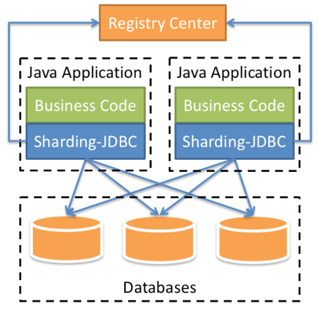

## 基础环境搭建

### Application

> 首先准备一个JavaWeb项目，所需环境：SpringBoot+MybatisPlus+Sharding-JDBC+Druid，项目所需依赖如下
>
> 项目的git仓库：https://gitee.com/smallpage/spring-boot-demo.git，下的sharding_jdbc_demo模块

~~~xml
<dependency>
    <groupId>org.springframework.boot</groupId>
    <artifactId>spring-boot-starter</artifactId>
</dependency>

<dependency>
    <groupId>org.springframework.boot</groupId>
    <artifactId>spring-boot-starter-test</artifactId>
    <scope>test</scope>
</dependency>

<dependency>
    <groupId>com.alibaba</groupId>
    <artifactId>druid-spring-boot-starter</artifactId>
    <version>1.1.20</version>
</dependency>

<dependency>
    <groupId>mysql</groupId>
    <artifactId>mysql-connector-java</artifactId>
</dependency>

<dependency>
    <groupId>org.apache.shardingsphere</groupId>
    <artifactId>sharding-jdbc-spring-boot-starter</artifactId>
    <version>4.0.0-RC1</version>
</dependency>

<dependency>
    <groupId>com.baomidou</groupId>
    <artifactId>mybatis-plus-boot-starter</artifactId>
    <version>3.0.5</version>
</dependency>

<dependency>
    <groupId>org.projectlombok</groupId>
    <artifactId>lombok</artifactId>
</dependency>
~~~

## 水平拆分

### 编写业务代码

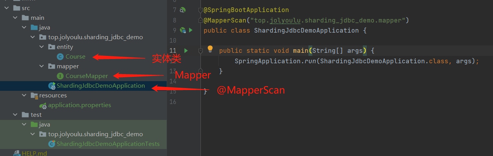

### 水平分表

#### 数据库准备

> 水平分表的方式在同一个库中创建多个相同结构的个表
>
> 1. 创建数据库course_db
> 2. 在数据库创建2个相同的表course_1和course_2
> 3. 数据操作规则：如果操作的数据id是偶数着操作course_1表，如果是奇数操作course_2表

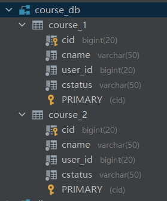

~~~sql
CREATE TABLE course_1(
    cid BIGINT(20) PRIMARY KEY,
    cname VARCHAR(50) NOT NULL,
    user_id BIGINT(20) NOT NULL,
    cstatus VARCHAR(50) NOT NULL
);
CREATE TABLE course_2(
    cid BIGINT(20) PRIMARY KEY,
    cname VARCHAR(50) NOT NULL,
    user_id BIGINT(20) NOT NULL,
    cstatus VARCHAR(50) NOT NULL
);
~~~

#### properties配置

> 修改application.properties增加shardingsphere配置在ShardingSphere官网用户手册=>ShardingSphere-JDBC=>配置手册中都有详细的说明
>
> 官方配置文档地址`https://shardingsphere.apache.org/document/legacy/4.x/document/cn/manual/sharding-jdbc/configuration/config-spring-boot/`

~~~properties
# 配置shardingjdbc分片策略
# 配置数据源，给数据源起别名
spring.shardingsphere.datasource.names=myds1

# 由于表数据库有2个相同的表，我们只有一个实体类，需开启允许bean覆盖
spring.main.allow-bean-definition-overriding=true

# 配置数据源具体内容：连接池、驱动、地址、用户名、密码
# spring.shardingsphere.datasource.{你的数据源别名}.type
spring.shardingsphere.datasource.myds1.type=com.alibaba.druid.pool.DruidDataSource
spring.shardingsphere.datasource.myds1.driver-class-name=com.mysql.cj.jdbc.Driver
spring.shardingsphere.datasource.myds1.url=jdbc:mysql://localhost:3306/course_db?serverTimezone=GMT+8
spring.shardingsphere.datasource.myds1.username=root
spring.shardingsphere.datasoaurce.myds1.password=123456

# 指定course_db表的分布情况，配置表在那个数据库中，表名称分别是什么
# spring.shardingsphere.rules.sharding.tables.{表规则}.actual-data-nodes={表达式规则}
# myds1.course_$->{1..2} => myds1数据中的course_开头的,course_1和course_2表
spring.shardingsphere.sharding.tables.course.actual-data-nodes=myds1.course_$->{1..2}

# 指定course主键生成策略 id生成策略SNOWFLAKE雪花算法
# spring.shardingsphere.rules.sharding.tables.{表规则}.database-strategy.standard.sharding-column
spring.shardingsphere.sharding.tables.course.key-generator.column=cid
spring.shardingsphere.sharding.tables.course.key-generator.type=SNOWFLAKE

# 指定分片策略，约定cid值偶数操作course_1，cid值奇数操作course_2
spring.shardingsphere.sharding.tables.course.table-strategy.inline.sharding-column=cid
spring.shardingsphere.sharding.tables.course.table-strategy.inline.algorithm-expression=course_$->{cid % 2 + 1}

# 打印sql输出日志
spring.shardingsphere.props.sql.show=true
~~~

#### 代码测试

> 编写测试程序测试插入效果，与查询效果

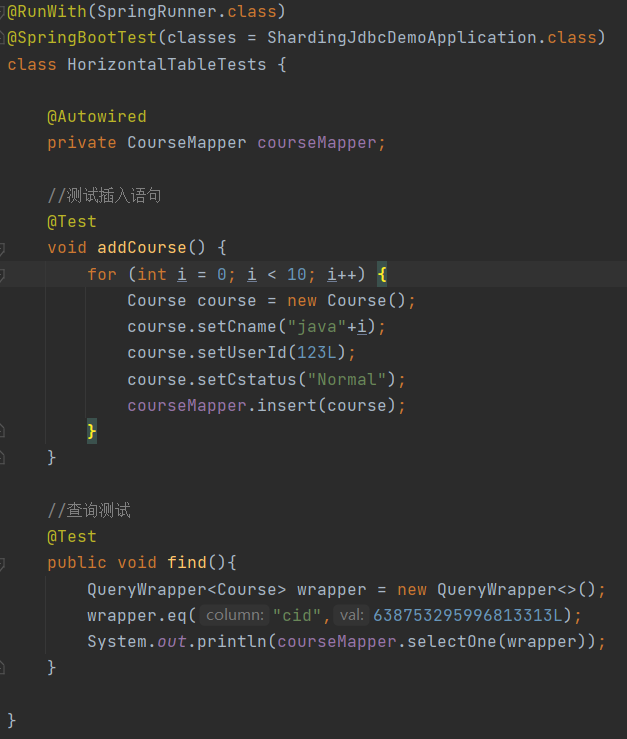

> 可以看到Sharding-JDBC会按照配置的规则向不同的表插入数据

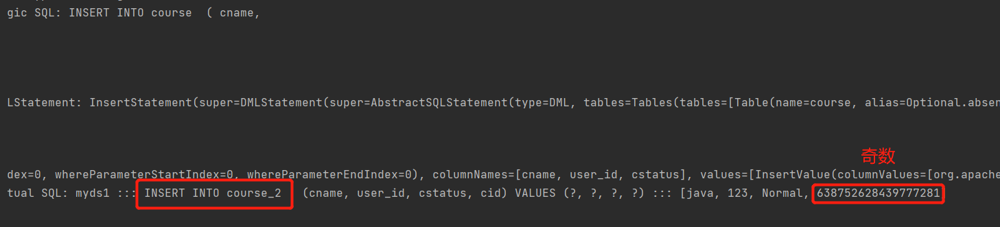

### 水平分库案例

#### 数据库准备

> 创建多个库，每个库都存在多个相同结构的表
>
> 1. 创建2数据库course_db_1，course_db_2
> 2. 在2个数据库中创建2个相同的表course_1和course_2
> 3. 数据操作规则：
>    * 如果操作的数据userId是偶数着操作course_db_1数据库，如果是奇数操作course_db_2数据库
>    * 如果操作的数据id是偶数着操作course_1表，如果是奇数操作course_2表

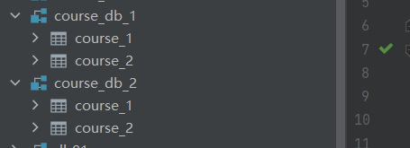

#### properties配置

> 修改application.properties增加shardingsphere配置在ShardingSphere官网用户手册=>ShardingSphere-JDBC=>配置手册中都有详细的说明
>
> 官方配置文档地址`https://shardingsphere.apache.org/document/legacy/4.x/document/cn/manual/sharding-jdbc/configuration/config-spring-boot/`

~~~properties
# 配置shardingjdbc分片策略
# 配置数据源，给数据源起别名
spring.shardingsphere.datasource.names=myds1

# 由于表数据库有2个相同的表，我们只有一个实体类，需开启允许bean覆盖
spring.main.allow-bean-definition-overriding=true

# 配置数据源具体内容：连接池、驱动、地址、用户名、密码
# spring.shardingsphere.datasource.{你的数据源别名}.type
spring.shardingsphere.datasource.myds1.type=com.alibaba.druid.pool.DruidDataSource
spring.shardingsphere.datasource.myds1.driver-class-name=com.mysql.cj.jdbc.Driver
spring.shardingsphere.datasource.myds1.url=jdbc:mysql://localhost:3306/course_db?serverTimezone=GMT%2B8
spring.shardingsphere.datasource.myds1.username=root
spring.shardingsphere.datasource.myds1.password=123456

# 指定course_db表的分布情况，配置表在那个数据库中，表名称分别是什么
# spring.shardingsphere.rules.sharding.tables.{表规则}.actual-data-nodes={表达式规则}
# myds1.course_$->{1..2} => myds1数据中的course_开头的,course_1和course_2表
spring.shardingsphere.sharding.tables.course.actual-data-nodes=myds1.course_$->{1..2}

# 指定course主键生成策略 id生成策略SNOWFLAKE雪花算法
# spring.shardingsphere.rules.sharding.tables.{表规则}.database-strategy.standard.sharding-column
spring.shardingsphere.sharding.tables.course.key-generator.column=cid
spring.shardingsphere.sharding.tables.course.key-generator.type=SNOWFLAKE

# 指定分片策略，约定cid值偶数操作course_1，cid值奇数操作course_2
spring.shardingsphere.sharding.tables.course.table-strategy.inline.sharding-column=cid
spring.shardingsphere.sharding.tables.course.table-strategy.inline.algorithm-expression=course_$->{cid % 2 + 1}

# 打印sql输出日志
spring.shardingsphere.props.sql.show=true
~~~

#### 代码测试

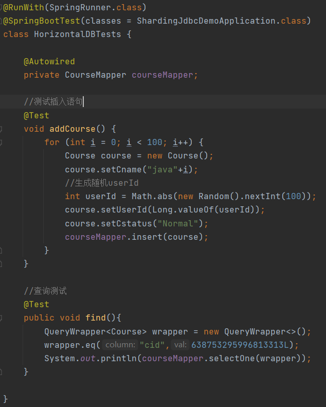

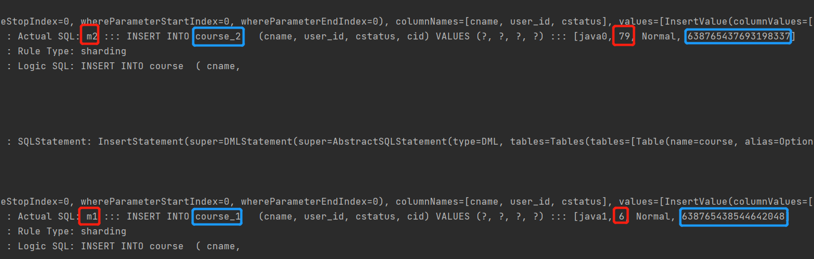

## 垂直拆分

### 编写业务代码

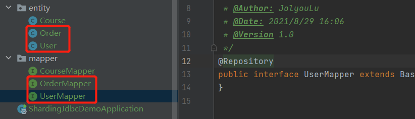

### 垂直分库

#### 数据库准备

> 将数据表按照业务拆分到不同的库中，实现专库专表
>
> 1. 创建2数据库user_db，order_db
> 2. user_db库有user_1表，order_db有order_1表
> 3. 数据操作规则：如果操作user对象的数据时只会操作user_db.user_1，如果操作user对象的数据时只会操作order_db.order_1

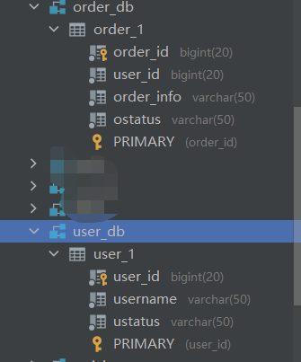

#### properties配置

~~~properties
# 配置shardingjdbc分片策略（垂直分库）
# 配置数据源，给数据源起别名
spring.shardingsphere.datasource.names=o1,u1

# 由于表数据库有2个相同的表，我们只有一个实体类，需开启允许bean覆盖
spring.main.allow-bean-definition-overriding=true

# 配置数据源具体内容：连接池、驱动、地址、用户名、密码
# spring.shardingsphere.datasource.{你的数据源别名}.type
spring.shardingsphere.datasource.o1.type=com.alibaba.druid.pool.DruidDataSource
spring.shardingsphere.datasource.o1.driver-class-name=com.mysql.cj.jdbc.Driver
spring.shardingsphere.datasource.o1.url=jdbc:mysql://localhost:3306/order_db?serverTimezone=GMT%2B8
spring.shardingsphere.datasource.o1.username=root
spring.shardingsphere.datasource.o1.password=123456

spring.shardingsphere.datasource.u1.type=com.alibaba.druid.pool.DruidDataSource
spring.shardingsphere.datasource.u1.driver-class-name=com.mysql.cj.jdbc.Driver
spring.shardingsphere.datasource.u1.url=jdbc:mysql://localhost:3306/user_db?serverTimezone=GMT%2B8
spring.shardingsphere.datasource.u1.username=root
spring.shardingsphere.datasource.u1.password=123456

# 指定order表的分布情况，配置表在那个数据库中，表名称分别是什么
# spring.shardingsphere.rules.sharding.tables.{表规则}.actual-data-nodes={表达式规则}
spring.shardingsphere.sharding.tables.order.actual-data-nodes=o$->{1}.order_1

# 指定course主键生成策略 id生成策略SNOWFLAKE雪花算法
# spring.shardingsphere.rules.sharding.tables.{表规则}.database-strategy.standard.sharding-column
spring.shardingsphere.sharding.tables.order.key-generator.column=order_id
spring.shardingsphere.sharding.tables.order.key-generator.type=SNOWFLAKE

# 指定表分片策略，所有与order相关操作都只操作order_1表
spring.shardingsphere.sharding.tables.order.table-strategy.inline.sharding-column=order_id
spring.shardingsphere.sharding.tables.order.table-strategy.inline.algorithm-expression=order_1

# 指定user表的分布情况，配置表在那个数据库中，表名称分别是什么
# spring.shardingsphere.rules.sharding.tables.{表规则}.actual-data-nodes={表达式规则}
spring.shardingsphere.sharding.tables.user.actual-data-nodes=u$->{1}.user_1

# 指定course主键生成策略 id生成策略SNOWFLAKE雪花算法
# spring.shardingsphere.rules.sharding.tables.{表规则}.database-strategy.standard.sharding-column
spring.shardingsphere.sharding.tables.user.key-generator.column=user_id
spring.shardingsphere.sharding.tables.user.key-generator.type=SNOWFLAKE

# 指定表分片策略，所有与order相关操作都只操作order_1表
spring.shardingsphere.sharding.tables.user.table-strategy.inline.sharding-column=user_id
spring.shardingsphere.sharding.tables.user.table-strategy.inline.algorithm-expression=user_1

# 打印sql输出日志
spring.shardingsphere.props.sql.show=true

~~~

#### 代码测试

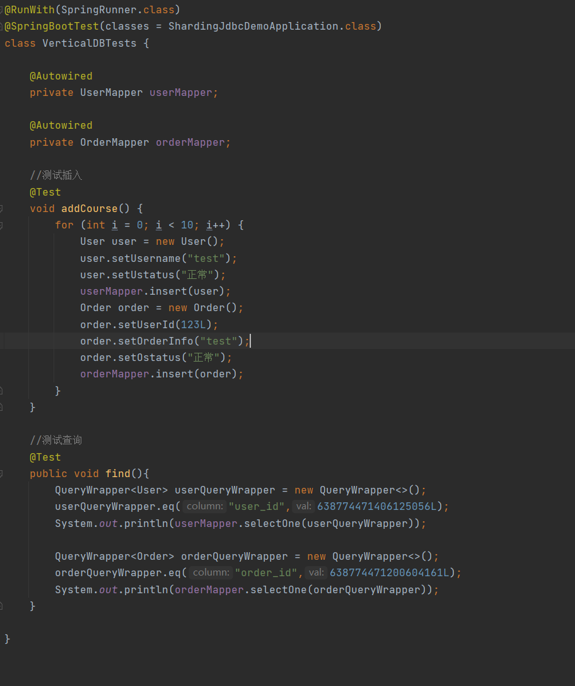

## 公共表操作

> 公共表通常用于可变数据较少的，数据固定的表，通常是字典表，公共表需在每个库中都建立相同的表，增删改查时会同时操作多个库中的字典表

### 编写业务代码

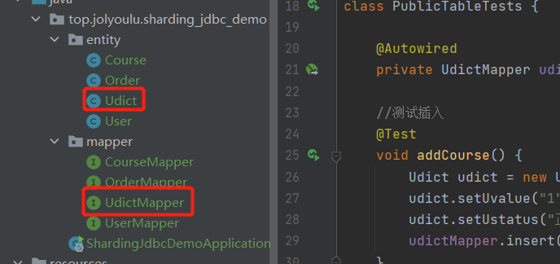

### 数据库准备

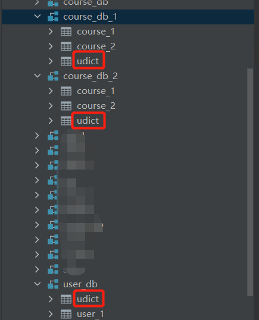

### properties配置

~~~properties
# 配置shardingjdbc分片策略（公共表配置）
# 配置数据源，给数据源起别名
spring.shardingsphere.datasource.names=m1,m2,u1

# 由于表数据库有2个相同的表，我们只有一个实体类，需开启允许bean覆盖
spring.main.allow-bean-definition-overriding=true

# 配置数据源具体内容：连接池、驱动、地址、用户名、密码
# spring.shardingsphere.datasource.{你的数据源别名}.type
spring.shardingsphere.datasource.m1.type=com.alibaba.druid.pool.DruidDataSource
spring.shardingsphere.datasource.m1.driver-class-name=com.mysql.cj.jdbc.Driver
spring.shardingsphere.datasource.m1.url=jdbc:mysql://localhost:3306/course_db_1?serverTimezone=GMT%2B8
spring.shardingsphere.datasource.m1.username=root
spring.shardingsphere.datasource.m1.password=123456

spring.shardingsphere.datasource.m2.type=com.alibaba.druid.pool.DruidDataSource
spring.shardingsphere.datasource.m2.driver-class-name=com.mysql.cj.jdbc.Driver
spring.shardingsphere.datasource.m2.url=jdbc:mysql://localhost:3306/course_db_2?serverTimezone=GMT%2B8
spring.shardingsphere.datasource.m2.username=root
spring.shardingsphere.datasource.m2.password=123456

spring.shardingsphere.datasource.u1.type=com.alibaba.druid.pool.DruidDataSource
spring.shardingsphere.datasource.u1.driver-class-name=com.mysql.cj.jdbc.Driver
spring.shardingsphere.datasource.u1.url=jdbc:mysql://localhost:3306/user_db?serverTimezone=GMT%2B8
spring.shardingsphere.datasource.u1.username=root
spring.shardingsphere.datasource.u1.password=123456

# 公共表配置
spring.shardingsphere.sharding.broadcast-tables=udict
spring.shardingsphere.sharding.tables.udict.key-generator.column=dict_id
spring.shardingsphere.sharding.tables.udict.key-generator.type=SNOWFLAKE

# 指定course_db表的分布情况，配置表在那个数据库中，表名称分别是什么
# spring.shardingsphere.rules.sharding.tables.{表规则}.actual-data-nodes={表达式规则}
# m$->{1..2}.course_$->{1..2} => m1或m2数据源中的course_1或course_2表
spring.shardingsphere.sharding.tables.course.actual-data-nodes=m$->{1..2}.course_$->{1..2}

# 指定course主键生成策略 id生成策略SNOWFLAKE雪花算法
# spring.shardingsphere.rules.sharding.tables.{表规则}.database-strategy.standard.sharding-column
spring.shardingsphere.sharding.tables.course.key-generator.column=cid
spring.shardingsphere.sharding.tables.course.key-generator.type=SNOWFLAKE

# 指定库分片策略，约定userId值偶数操作course_db_1数据库，如果是奇数操作course_db_2数据库
# default-database-strategy 对所有表操作都会先走库分片策略在走表，但是有可能我们只是部分表会分库分表，如果只是对部分表指定需要分库写入如下
# spring.shardingsphere.sharding.default-database-strategy.inline.sharding-column=user_id
# spring.shardingsphere.sharding.default-database-strategy.inline.algorithm-expression=m$->{user_id % 2 + 1}
spring.shardingsphere.sharding.tables.course.database-strategy.inline.sharding-column=user_id
spring.shardingsphere.sharding.tables.course.database-strategy.inline.algorithm-expression=m$->{user_id % 2 + 1}

# 指定表分片策略，约定cid值偶数操作course_1，cid值奇数操作course_2
spring.shardingsphere.sharding.tables.course.table-strategy.inline.sharding-column=cid
spring.shardingsphere.sharding.tables.course.table-strategy.inline.algorithm-expression=course_$->{cid % 2 + 1}

# 指定user表的分布情况，配置表在那个数据库中，表名称分别是什么
# spring.shardingsphere.rules.sharding.tables.{表规则}.actual-data-nodes={表达式规则}
spring.shardingsphere.sharding.tables.user.actual-data-nodes=u$->{1}.user_1

# 指定course主键生成策略 id生成策略SNOWFLAKE雪花算法
# spring.shardingsphere.rules.sharding.tables.{表规则}.database-strategy.standard.sharding-column
spring.shardingsphere.sharding.tables.user.key-generator.column=user_id
spring.shardingsphere.sharding.tables.user.key-generator.type=SNOWFLAKE

# 指定表分片策略，所有与order相关操作都只操作order_1表
spring.shardingsphere.sharding.tables.user.table-strategy.inline.sharding-column=user_id
spring.shardingsphere.sharding.tables.user.table-strategy.inline.algorithm-expression=user_1

# 打印sql输出日志
spring.shardingsphere.props.sql.show=true
~~~

### 代码测试

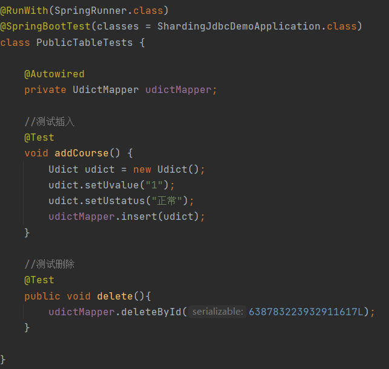

> 同时新增3个表

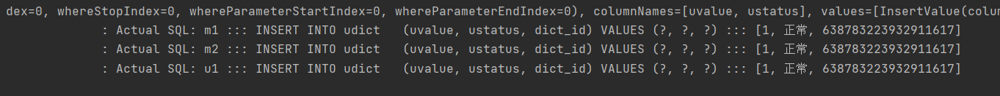

## 读写分离

> 读写分离也是一种很好的提升数据库性能的解决方案，在了解如何使用Sharding-JDBC之前首先需学会如何部署Mysql主从配置，如果还没部署过的前阅读以下文章
>
> Sharding-JDBC是不做主从复制数据同步的，主从复制需要通过配置Mysql实现，而Sharding-JDBC只是根据语义(CRUD)判断你是做增删改查的那种操作，并且给你路由到主库/从库

[Mysql-主从配置与读写分离](../数据持久化专栏/Mysql-主从配置与读写分离.md)

### properties配置

~~~properties
# 配置shardingjdbc分片策略
# 配置数据源，给数据源起别名
spring.shardingsphere.datasource.names=master,slave

# 由于表数据库有2个相同的表，我们只有一个实体类，需开启允许bean覆盖
spring.main.allow-bean-definition-overriding=true

# 配置数据源具体内容：连接池、驱动、地址、用户名、密码
# spring.shardingsphere.datasource.{你的数据源别名}.type
spring.shardingsphere.datasource.master.type=com.alibaba.druid.pool.DruidDataSource
spring.shardingsphere.datasource.master.driver-class-name=com.mysql.cj.jdbc.Driver
spring.shardingsphere.datasource.master.url=jdbc:mysql://192.168.100.101:3306/user_db?serverTimezone=GMT%2B8
spring.shardingsphere.datasource.master.username=root
spring.shardingsphere.datasource.master.password=root

spring.shardingsphere.datasource.slave.type=com.alibaba.druid.pool.DruidDataSource
spring.shardingsphere.datasource.slave.driver-class-name=com.mysql.cj.jdbc.Driver
spring.shardingsphere.datasource.slave.url=jdbc:mysql://192.168.100.102:3306/user_db?serverTimezone=GMT%2B8
spring.shardingsphere.datasource.slave.username=root
spring.shardingsphere.datasource.slave.password=root

#定义一个别名ds0，该并且设置别名主从数据库消息
spring.shardingsphere.sharding.master-slave-rules.ds0.master-data-source-name=master
spring.shardingsphere.sharding.master-slave-rules.ds0.slave-data-source-names=slave

# 指定course_db表的分布情况，配置表在那个数据库中，表名称分别是什么
spring.shardingsphere.sharding.tables.user.actual-data-nodes=ds0.user_1

# 指定course主键生成策略 id生成策略SNOWFLAKE雪花算法
spring.shardingsphere.sharding.tables.user.key-generator.column=user_id
spring.shardingsphere.sharding.tables.user.key-generator.type=SNOWFLAKE

# 指定分片策略
spring.shardingsphere.sharding.tables.user.table-strategy.inline.sharding-column=user_id
spring.shardingsphere.sharding.tables.user.table-strategy.inline.algorithm-expression=user_1

# 打印sql输出日志
spring.shardingsphere.props.sql.show=true

~~~

### 代码测试

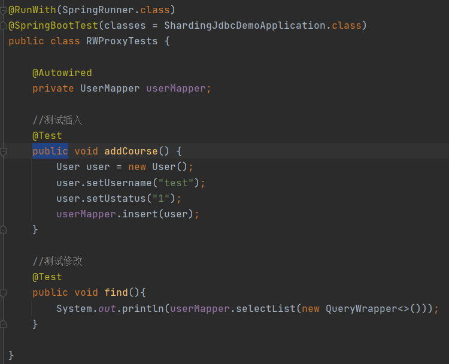

> 新增走Master

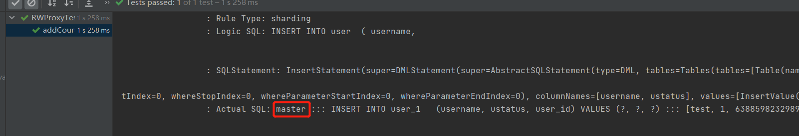

> 查询走Slave

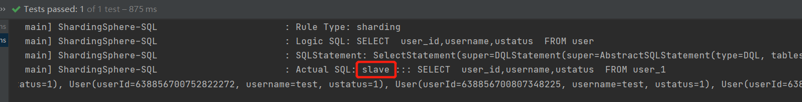