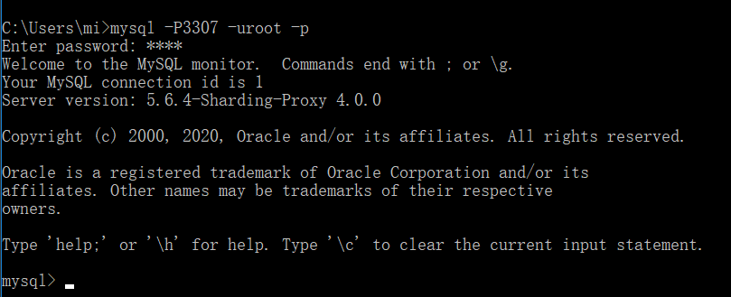

# Sharding-Proxy实战

## 基本概述

> 使用过Sharding-JDBC都知道需要为每一个运用到Sharding-JDBC的项目编写一大片配置文件，Sharding-Proxy就可以解决Sharding-JDBC上遇到问题，Sharding-Proxy定位为透明化的数据库代理端，提供封装了数据库二进制协议的服务端版本，用于完成对异构语言的支持，简单来说分库分表的工作都由Sharding-Proxy服务端去完成，Sharding-Proxy是Webapp服务端，你只管发增删改查不有管你要操作什么库，Sharding-Proxy受到你的消息后会自己安排去操作那个数据库然后把结果给回你
>
> Sharding-Proxy有以下几个特定
>
> 1. Sharding-Proxy是一个独立的服务，需要安装安装，并且做好分库分表配置
> 2. 目前只支持MySQL/PostgreSQL协议的的客户端

## 服务安装

### 安装包下载

> 这里我下载4.0.1的版本，[Sharding-Proxy下载地址](https://shardingsphere.apache.org/document/legacy/4.x/document/cn/downloads/)

### 解压安装包

> 使用命令解压压缩包，解压压缩包后进入到bin目录可以看到有几个启动脚本win下使用bat脚本，liunx使用sh脚本即可

~~~shell
# tar命令解压压缩包
tar -xvf apache-shardingsphere-incubating-4.0.1-sharding-proxy-bin.tar.gz
~~~

### 解压后的坑

> 注意这里有一个坑，解压压缩包后要检查一下lib下的文件是否完整，有时候解压完成后lib解压处理的文件会少了后缀名的，正常情况应该都是.jar后缀，如图这是异常情况，解决这个问题办法就是重新解压或者手动把那些文件名修改一下都不上.jar后缀，不让等一下启动服务时会提示找不到jar包

## 分表配置

### 修改server.yaml

> 进入到conf目录下，修改server.yaml文件
>
> server.yaml修改很简单，只需要将这部分内容的注释去掉即可

### 修改config-sharding.yaml

> 进入到conf目录下，修改config-sharding.yaml文件，里面有一些模板，配置其实和JDBC是一模一样的，在本地数据库中创建一个demo_ds_0，当然也可以使用已有的数据库

#### 使用注意

> 在配置文件中，可以那么一句话如果你要连接msyql那么需要手动的把mysql驱动的jar包放到lib目录下否则程序无法运行

### 服务启动

> 执行`start.bat `服务启动(liunx下执行sh文件)有2种方式带端口和不带端口
>
> 1. 不带端口：默认使用3307端口
> 2. 带端口：使用你指定的端口 `start.bat 8888`
>
> 看到如下内容表示启动成功

### 连接客户端

> 最好使用cmd命令行去连接，虽然如Navicat、DataGrip等这些客户端也是可以的，当时有时又不可以好奇怪的，所以这里使用cmd的mysql命令去连接Sharding-Proxy，就和连接数据库一样使用`mysql -P3307 -uroot -p`即可连接
>
> `注意不要搞混了哦这里连接的是Sharding-Proxy不是Mysql数据库，只是连接Sharding-Proxy方式和数据库一样`

### 使用sql命令操作

### 查看本地数据库

> 查看我们本机的实际数据库中发生的变化，可以发现我们只执行了一条建表语句，Sharding-Proxy根据配置文件配置的规则给我们创建了t_order_0和t_order_1，并且我执行插入order_id是奇数所以数据被插入在t_order_1表中

## 分库配置

### 修改config-sharding.yaml

### 服务启动

> 执行`start.bat `服务启动(liunx下执行sh文件)有2种方式带端口和不带端口
>
> 1. 不带端口：默认使用3307端口
> 2. 带端口：使用你指定的端口 `start.bat 8888`
>
> 看到如下内容表示启动成功

### 连接客户端

> 最好使用cmd命令行去连接，虽然如Navicat、DataGrip等这些客户端也是可以的，当时有时又不可以好奇怪的，所以这里使用cmd的mysql命令去连接Sharding-Proxy，就和连接数据库一样使用`mysql -P3307 -uroot -p`即可连接
>
> `注意不要搞混了哦这里连接的是Sharding-Proxy不是Mysql数据库，只是连接Sharding-Proxy方式和数据库一样`

### 使用sql命令操作

### 查看本地数据库

> 查看我们本机的实际数据库中发生的变化，可以发现我们只执行了一条建表语句，Sharding-Proxy根据配置文件配置的规则给我们创建了t_order_0和t_order_1，并且也根据相应的规则插入了数据

## 读写分离

> 读写分离也是一种很好的提升数据库性能的解决方案，在了解如何使用Sharding-Proxy之前首先需学会如何部署Mysql主从配置，如果还没部署过的前阅读以下文章
>
> Sharding-Proxy是不做主从复制数据同步的，主从复制需要通过配置Mysql实现，而Sharding-Proxy只是根据语义(CRUD)判断你是做增删改查的那种操作，并且给你路由到主库/从库

[Mysql-主从配置与读写分离](https://blog.csdn.net/weixin_44642403/article/details/119984259)

### 修改config-master_slave.yaml

> 进入到conf目录下，修改config-master_slave.yaml文件

### 服务启动

> 执行`start.bat `服务启动(liunx下执行sh文件)有2种方式带端口和不带端口
>
> 1. 不带端口：默认使用3307端口
> 2. 带端口：使用你指定的端口 `start.bat 8888`
>
> 看到如下内容表示启动成功

### 连接客户端

> 最好使用cmd命令行去连接，虽然如Navicat、DataGrip等这些客户端也是可以的，当时有时又不可以好奇怪的，所以这里使用cmd的mysql命令去连接Sharding-Proxy，就和连接数据库一样使用`mysql -P3307 -uroot -p`即可连接
>
> `注意不要搞混了哦这里连接的是Sharding-Proxy不是Mysql数据库，只是连接Sharding-Proxy方式和数据库一样`

### 使用sql命令操作

### 查看本地数据库

> 查看我们本机的实际数据库中发生的变化，可以发现主从库同时都有刚刚插入的数据

