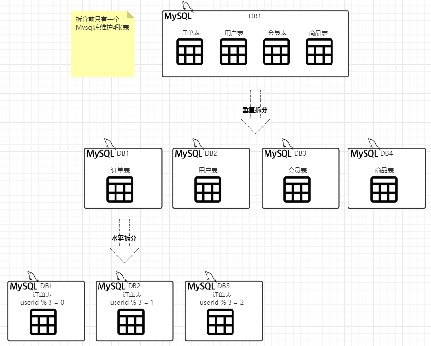

# 分布式数据库中间件

> 在分布式情况下随着用户量的增加，Mysql数据库表逐渐庞大随之而来的问题就是导致数据库性能的下降，当数据量超过500W行那么就可以考虑分库分表了

## 分库分表概述

### 什么是分库分表

> 分库分表，相信大家在编写Web项目的时都会使用到关系型数据库，通常在传统的Web项目中我们一个项目只会对应一个数据库，当对于类似电商这些用户量与数据量大的项目通常使用单个数据库是无法支撑的，所以就有了分库分表，即把项目中的表按不同的业务分别存放到不同的数据库中、或把一张表数据拆分到不同的数据库中

### 为什么要分库分表

> 分库分表是当前关系型数据库最后的优化手段了，简称杀手锏，所以在分库分表前必定会经历一些数据库优化过程，大概演变如下
>
> 单表数据超出数据库支持的容量=>更换数据库+缓存=>SQL优化、索引优化、字段优化=>读写分离=>分库分表

### 分库分表的常见方法

> 分库分表常见方法分2种：垂直拆分，水平拆分

#### 垂直拆分

> 垂直拆分，即将数据库中的多个表分别拆分到不同的数据库中，或者将字段较多的单个表拆分为2个表分别存放到不同的库中

#### 垂直拆分特点

> 垂直拆分也叫字段拆分，即将表按字段拆分成多个表，所以垂直拆分有以下特点
>
> 1. 拆分后表行数并未得到改变，表列数会有所减少
> 2. 拆分后业务清晰，专库专用
> 3. 实现动静态分析，冷热数据分离，说明：冷数据(很少修的数据)：如你发的朋友圈内容，热数据(改动频繁数据)：如你朋友圈的评论
> 4. 数据库性能受业务影响，如订单表的数据库性能在双11情况用户大量操作订单会扛不住，然而会员表数据库性能则可以保存一个良好的状态
> 5. 由于业务分布在不同的数据库下，对于一些跨业务关联join查询无法使用sql语句实现，只能通过java程序接口调用组合完成

#### 水平拆分

> 垂直拆分，即将数据库中一个表的数据分别拆分到不同的数据库中

#### 水平拆分特点

> 水平拆分也叫横向拆分，即负责多个相同结构的表，使用某种算法让数据平均分布在这些表中
>
> 1. 拆分后表结构未得到改变，单表行数会得到相应的减少，有助于性能的提示
> 2. 由于数据都被分散到多个表中，提高系统的稳定性和负载能力
> 3. 拆分规则很难抽象，如所以需要使用某种算法使得同一个用户的数据只会一直被保存到同一个库中
> 4. 数据扩容难度大，由于增加库于表后会导致原有的拆分规则有变动
> 5. 分片事务的一致性的问题，部分业务也是关联join查询无法使用sql语句实现，只能通过java程序接口调用组合完成

#### 垂直+水平拆分

> 上面已经介绍了垂直拆分于水平拆分了，那么在实际开发过程中使用那种是最好的呢，小孩子才做选择好吧在实际开发过程中2种结合一起使用
>
> 1. 首先在数据库设计阶段是就要考虑垂直分库和垂直分表
> 2. 随着数据库数据量的增加，不要立马考虑做水平切分，首先考虑缓存处理、读写分离，使用索引的方式尝试优化数据库，如果这些方式不能解决根本问题，再考虑做水平分库和水平分表

### 分库分表后带来的问题

> 1. 读写分离引发的主从同步，数据一致性，网络延迟问题
> 2. 多数据库多表导致维护成本的增加
> 3. 分布式事务
> 4. 跨库jion查询
> 5. 分布式全局唯一ID(雪花算法)
> 6. 多数据源管理问题

### 分库分表常见算法

> 分库分表算法常用于水平拆分，即按照一定规则使得某一个用户有史至终只会对同一个表进行操作
>
> 取模(Hash)：通过userid进行取模运算，使得数据分散均衡，当然如果需要扩容后所有的数据都需要进行重新Hash，一致性Hash可以缓解该问题，但不能完全解决
>
> 范围分区(range)：按日期、按地区去拆分数据
>
> 预定义(list)：对数据量预估，并且创建好相应的数据于库

## 分库分表解决方案

> 经过对分库分表后，可以发现分库分表将会带来很多的问题那么该如何解决呢
>
> 通常有2种实现方案：Proxy代理与Jdbc直连

### Proxy代理

> Proxy代理，顾名思义即Web应用将所有的增删改查sql发送到给一个代理服务，代理服务去数据库完成相应的操作后再返回给Web应用

### Jdbc直连

> Jdbc直连，增强JDBC包，对所有的数据库操作语句按照特定的要求分发到不同的库中

## ShardingSphere

> Apache ShardingSphere`https://shardingsphere.apache.org/index_zh.html` 是一套开源的分布式数据库解决方案组成的生态圈，它由 JDBC、Proxy 和 Sidecar（规划中）这 3 款既能够独立部署，又支持混合部署配合使用的产品组成。 它们均提供标准化的数据水平扩展、分布式事务和分布式治理等功能，可适用于如 Java 同构、异构语言、云原生等各种多样化的应用场景。

### 模式区别

> ShardingSphere同时提供了3种分布式数据库中间件解决方案：JDBC、Proxy、Sidecar(占不成熟)

### 快速上手

[Sharding-JDBC实战(水平分表、水平分库、垂直分表、公共表、读写分离)](Sharding-JDBC实战.md)

[Sharding-Proxy实战(水平分表、水平分库、垂直分表、读写分离)](Sharding-Proxy实战.md)