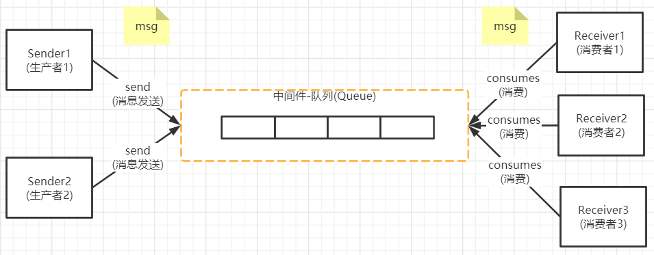
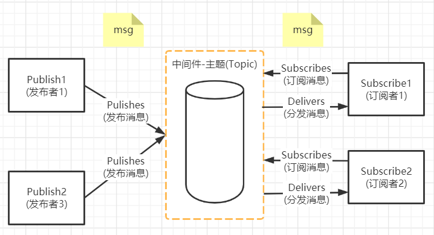
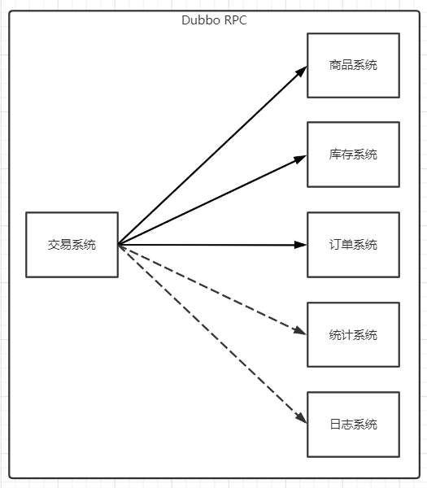
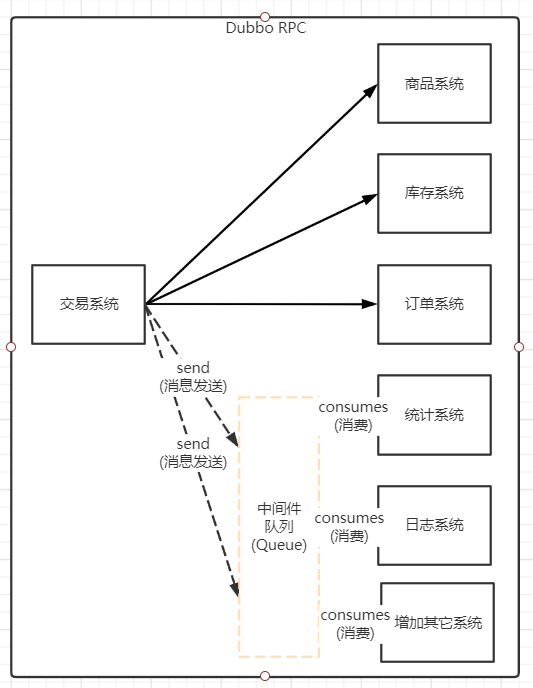
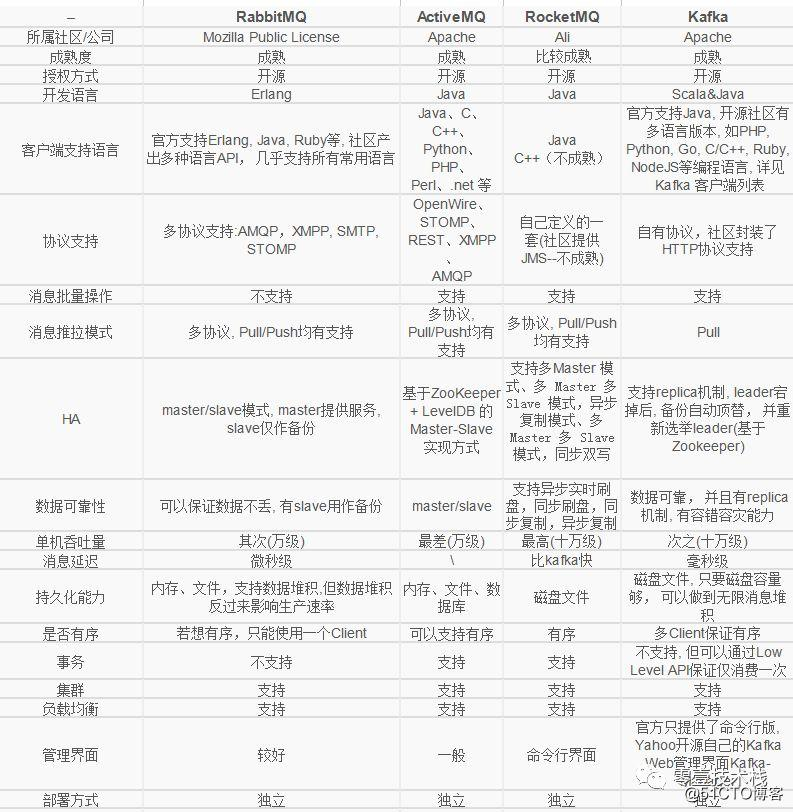

# 消息中间件介绍

## 什么是消息中间件

> 什么是消息中间件，我们可以将他拆开理解，消息+中间件的一个东西，要说明什么是消息中间件那么首先就要从JMS说起

### JMS

> 在了解消息中间件时，首先需要知道JMS即Java消息服务(Java Message Service)应用程序接口，这是一套由SUM公司在2002年提出的JMS规范，JMS是用于`两应用程序之间或分布式系统中发送消息，进行异步通讯`，java消息服务是一个`与具体平台无关的API(跨语言)`的API，JMS允许应用程序组件基于JavaEE平台创建、发送、接收、读取消息，它可让分布式通讯耦合度更低，消息服务更加可靠以及异步

### JMS中常用术语

> 在JMS中经常会遇到几个常用术语分别解释如下
>
> 1. 消息中间件(JMS Provider)：指提供对JMS协议的第三方组件，比如ActiveMQ(一款完全遵循JMS的老牌消息中间件)就是一个消息中间件，另外比较知名的还有KAFKA、RabbitMQ等
> 2. 消息模式：消息模式多分2种
>    * 第1种：点对点(Point to Point，即P2P)模式，数据结构为队列(Queue)
>    * 第2种：发布/订阅(Pub/Sub)模式，数据结构为主题(Topoic)
> 3. 消息(Message)：通讯内容的载体，其结构主要分消息头、属性、消息体，并且工具存储结构的不同分好几种 ，后面会详细说
> 4. 消息生产者：生产消息的一方，在P2P模式下，指消息发送者(Sender)，在P/S模式下指消息发布者(Publisher)
> 5. 消息消费者：接收消息的一方，在P2P模式下，指消息接收者(Receiver)，在P/S模式下指消息订阅者者(Subscriber)

### JMS体系结构

> JMS体系有以下几个重要的组成部分
>
> 1. JMS提供者：一个连接面向消息中间件的JMS接口的统一实现，提供者可以是Java平台的JMS实现也可以是非Java平台的面向消息中间件的适配器
> 2. JMS客户：生产或者消费者消息的基于Java的应用程序或者对象
> 3. JMS生产者：创建并且发送消息的JMS客户
> 4. JMS消费者：接收处理消息的JMS客户
> 5. JMS消息：JMS客户之间传输的数据对象
> 6. JMS队列：一个可以存放已发送等待阅读消息的区域，队列则表示着消息发送与阅读顺序
> 7. JMS主题：一种支持发送消息给多个订阅者的机制

### JMS消息模型

> JMS消息模型主要分为2种，P2P与P/S

#### 点对点模式(P2P)

#### 发布/订阅模式(P/S)

### JMS用于程序接口定义

> 当前只有ActiveMQ是完全遵循SUM-JMS规范开发的，其余的消息中间件只是并且没有完全遵循规范进行开发，所以以下内容只做参考

| 接口                            | 说明                                                         |
| ------------------------------- | ------------------------------------------------------------ |
| ConnectionFactory (连接工厂) | 创建ConnectionFactory(连接对象的工厂)，根据消息类型的不同，用户将使用队列连接工厂，或者主题连接工厂分别有QueueConnectionFactory和TopicConnectionFactory两种，可以通过JNDI来查找ConnectionFactory对象 |
| Destination (目标)           | Destination封装了消息的发送与接收的地点，对于生产者来说就是消息发送的目标，对于消费者来说就是消息消费的来源，Destination要不是个队列(Queue)或者是主题(Topic)，可以通过JNDI来查找Destination |
| Connection (连接)            | Connection表示客户端与JMS系统之间建立的连接(封装TCP/IP socket)，Connection可以产生一个或者多个Session，和ConnectionFactory一样Connection也分2种，QueueConnection和TopicConnection |
| Session (会话)               | Session是用于操作消息的接口，表示当前线程的上下文，用于发送消息和接收消息，可以通过session创建生产者、消费者、消息等，Session提供了事务的功能，当我们需要使用session发送/接收多个消息时，可以将这些发送/接收动作放到一个事务中，也分QueueSession和TopicSession |
| MessageProducer (消息生产者) | 通过Session可创建一个消息生产者，并将消息发送到Destination，并且消费者可以同步或异步接收队列和主题的消息，也分QueueSender和TopicPublisher，通过调用消息生产者的方法（send或publish方法）发送消息 |
| MessageConsumer (消息消费者) | 通过Session可创建一个消息消费者，并接收Destination中的消息，也分QueueReceiver和TopicSubscriber，分别通过session的createReceiver(Queue)或createSubscriber(Topic)来创建，也可以session的creatDurableSubscriber方法来创建持久化的订阅者 |
| Message (消息)               | 消费者与生产者之间传输的对象，也就是从一个程序发送到另一个程序的数据，区别主要有3部分组成 1.消息头(必须)：包含用于识别和为消息寻找路由的操作设置 2.一组消息属性(可选)：包含额外的属性，支持其他提供者和用户的兼容，可以创建定制的字段和过滤器(消息选择器) 3. 一个消息体(可选)：允许用户创建五种类型的消息(文本消息，映射消息，字节消息，流消息和对象消息)，消息接口非常灵活，并提供了许多方式来定制消息的内容 |
| MessageListener (消息监听器) | 消息监听器，如果注册了消息监听器，一旦消息到达，将自动调用监听器的onMessage方法 |

## 消息中间件用处

> 消息中间件用处是什么？为什么使用消息中间件？
>
> 这就要从当前分布式系统中说起了，在分布式项目中如果需要完成一个操作那么就会涉及通过RPC完成服务与服务之间的调用，那么在调用过程中就会产生一个问题就是，如当前交易系统如需要完成一笔交易那么就需要等待，商品、库存、订单、统计、日志系统返回后才能处理，虽然Dubbo提供了异步调用但是最后还是需要等待一些无关紧要的系统处理完毕才算完成(如统计系统、订单系统)，并且对增加与减少子业务系统时对交易系统也有较大的改动

> 增加消息中间件后，那么对于一些，不影响主线业务的系统(如统计、日志)的诞生，那么就可以利用消息队列可以达到应用程序之间的，`异步化提升性能、降低耦合度、流量削峰`

## 消息中间件对比

> 图片源于[百度](https://image.baidu.com/search/detail?ct=503316480&z=0&ipn=d&word=%E6%B6%88%E6%81%AF%E4%B8%AD%E9%97%B4%E4%BB%B6%E5%AF%B9%E6%AF%94&step_word=&hs=0&pn=162&spn=0&di=74580&pi=0&rn=1&tn=baiduimagedetail&is=0%2C0&istype=0&ie=utf-8&oe=utf-8&in=&cl=2&lm=-1&st=undefined&cs=4185512086%2C2187517816&os=1535740798%2C2594472744&simid=0%2C0&adpicid=0&lpn=0&ln=1348&fr=&fmq=1627151659489_R&fm=&ic=undefined&s=undefined&hd=undefined&latest=undefined&copyright=undefined&se=&sme=&tab=0&width=undefined&height=undefined&face=undefined&ist=&jit=&cg=&bdtype=0&oriquery=&objurl=https%3A%2F%2Fgimg2.baidu.com%2Fimage_search%2Fsrc%3Dhttp%3A%2F%2Fs2.51cto.com%2Fimages%2F20210205%2F1612530025196966.png%3Fx-oss-process%3Dimage%2Fwatermark%2Csize_16%2Ctext_QDUxQ1RP5Y2a5a6i%2Ccolor_FFFFFF%2Ct_100%2Cg_se%2Cx_10%2Cy_10%2Cshadow_90%2Ctype_ZmFuZ3poZW5naGVpdGk%3D%26refer%3Dhttp%3A%2F%2Fs2.51cto.com%26app%3D2002%26size%3Df9999%2C10000%26q%3Da80%26n%3D0%26g%3D0n%26fmt%3Djpeg%3Fsec%3D1629743904%26t%3Ded4a9c6803fdb3258d62370220352543&fromurl=ippr_z2C%24qAzdH3FAzdH3Fks52_z%26e3Bc8vp5_z%26e3Bv54AzdH3F8cabaa8mAzdH3Fdmdac0l&gsm=a4&rpstart=0&rpnum=0&islist=&querylist=&nojc=undefined)

### RocketMQ

[Liunx-RocketMQ单机部署](https://blog.csdn.net/weixin_44642403/article/details/119121400)

[Liunx-RocketMQ集群部署](https://blog.csdn.net/weixin_44642403/article/details/119225238)

[RocketMQ-基础（基本概念、基本架构、Producer、Consumer、NameServer、Broker、单机部署、集群部署、可视化工具）](https://blog.csdn.net/weixin_44642403/article/details/119466284)

[RocketMQ-进阶（Store结构、Queue算法、IndexFile结构、Rebalance机制、Offset管理、消费幂等）](https://blog.csdn.net/weixin_44642403/article/details/119466462)

[RocketMQ-实战（普通消息、顺序消息、延时消息、事务消息、批量消息、消息过滤、消息重试）](https://blog.csdn.net/weixin_44642403/article/details/119712596)

