# Dubbo快速入门

## Dubbo架构

> 该图取与Dubbo官网，先安标记的序号解释一下每一步是做说明
>
> 1. register：Provider(服务提供者)会将自己注册到Registry(注册中心)，Registry会将来Provider的IP地址、的口号、应用信息、服务信息等保存下拉
> 2. subscribe：Consumer(服务消费者)连接Registry(注册中心)
> 3. notify：Registry(注册中心)会将消费者所需要的服务信息返回给消费者，消费者会将该信息缓存下拉
> 4. invoke：Consumer(服务消费者)在缓存中抽取一个服务信息，直接发现远程调用
> 5. count：这个只是一个监控中心，可以查看消费者与提供者的情况

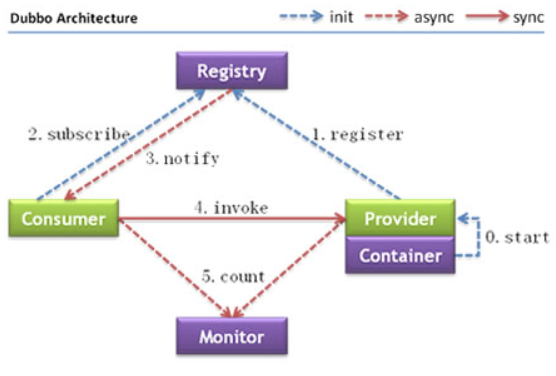

### Dubbo设计

> Dubbo设计中包含了许多的模块，每各模块的作用如下
>
> config：解析xml中的dubbo相关配置
>
> 注册中心：具体实现怎么与注册中心通讯
>
> proxy：增强易用性，服务于服务之间调用时无需知道怎么实现，让你像调用普通方法那样
>
> cluster：负载均衡的实现，轮询、Hash、最小连接数，调用方式，同步、异步
>
> monitor：对远程过程调用进行监控
>
> protocol：服务与服务之间交互的协议的实现，一般用dubbo协议
>
> exchange：封装请求的相应模式，返回结果的处理
>
> transport：服务与服务的通信协议，netty、mina等协议的实现
>
> serialize：java对象的序列化方式

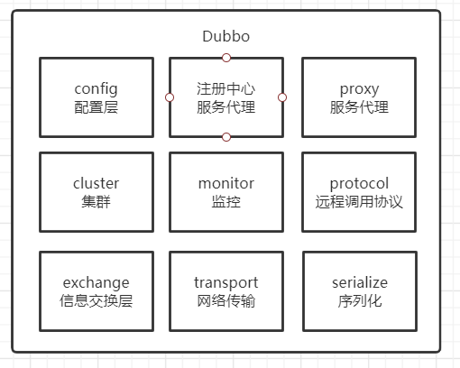

### Dubbo核心

> dubbo阿里开源的一个SOA服务治理框架，其实是一种RCP调用框架，单从RPC框架来说，功能完善，支持多种传输和序列化方案，所以他的核心功能就是：远程调用

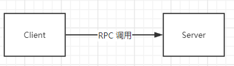

## 实战练习

### 基础实现

> 首先我们使用一个最简单的方式实现Dubbo，`基础实现是为了让大家可以更加清楚的了解dubbo是怎么运作的，在生产环境中一般不会 这样实现的`

#### 项目结构

> 首先创建一个Maven项目被在项目中加入2个模块，dubbo_client，dubbo_server
>
> dubbo_client：服务调用者
>
> dubbo_server：服务提供者

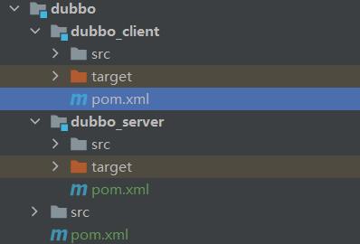

#### 依赖引入

> 如果需要实现一个最简单的dubbo只需要dubbo依赖即可

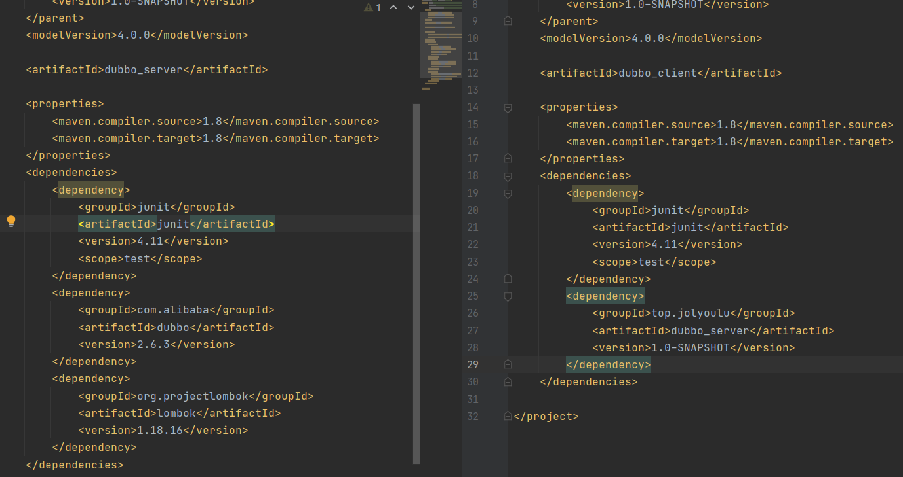

#### dubbo_server模块

> dubbo_server模块是服务提供者模块，主要功能，提供服务

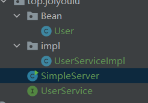

##### User

> User实体类，用于返回消息给服务调用者的一个对象，`注意需要实现Serializable序列化`

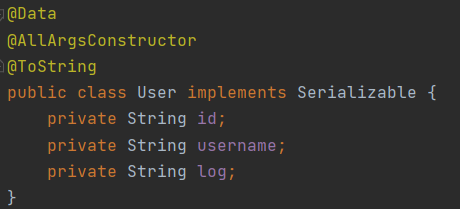

##### UserService

> UserService接口，提供服务的一个接口

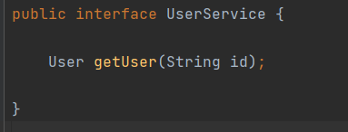

##### UserServiceImpl

> UserService具体的实现类

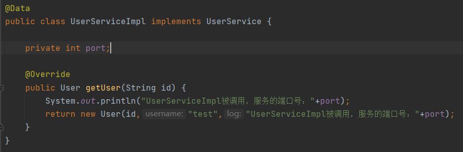

##### SimpleServer

> 将我们写好的接口暴露出去，注意这里还没有用到Zookeeper注册中心，依然能将我们的服务暴露出去

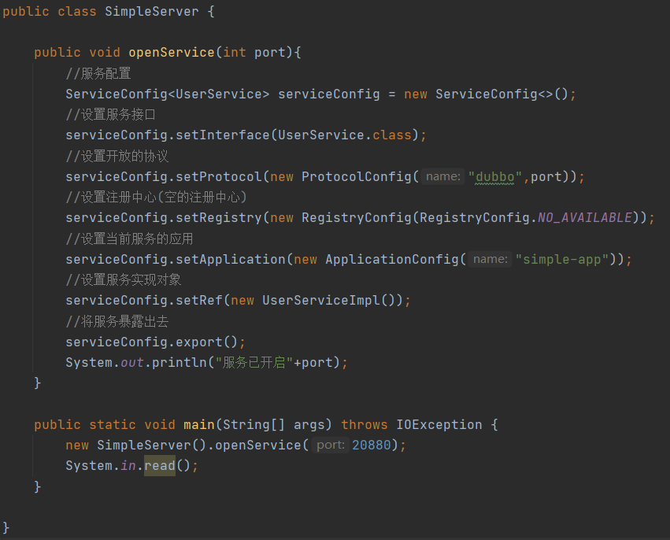

#### dubbo_client模块

> dubbo_lient模块就比较简单，只是对暴露的服务进行调用即可

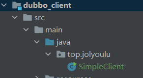

##### SimpleClient

> 一个服务消费者的实现

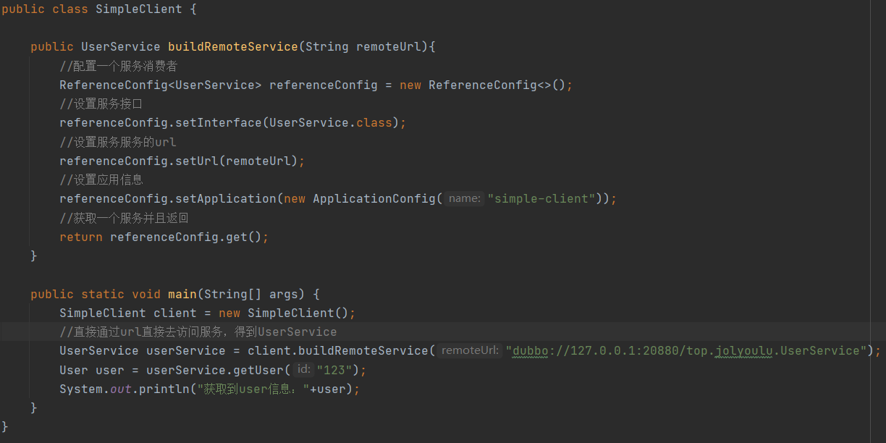

##### 测试

**SimpleServer**

> SimpleServer启动成功

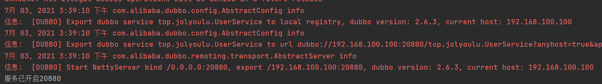

**SimpleClient**

> 通过访问本地的url获取到了需要的服务，并且调用get方法获取到了user的信息

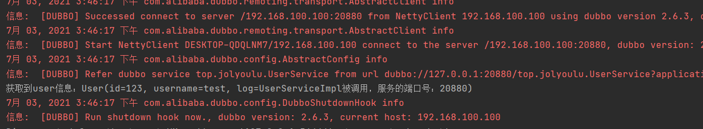

#### 改造增加注册中心

> 刚刚使用的是最基本的实现，可以看到服务服务提供者都是用了固定的url访问的，接下来我们需要得原有基础上进行改造，增加一个简单的注册中心，`注意这里使用的是广播组网作为注册中心，广播组网是最简单的利用局域网+广播实现的，Zookeeper实现后面会讲`

##### RolledServer

> 原来的Registry(注册中心)是null，现在我们传入一个multicast协议的注册中心，即组网广播在同一个局域网下，如果有服务提供者注册会广播到其它计算机中，这也是一个最简单的注册中心`注意使用组网广播协议必须以及multicast://224开头，后面随意，并且需要把你电脑的网络断开，否则会影响到协议的使用`

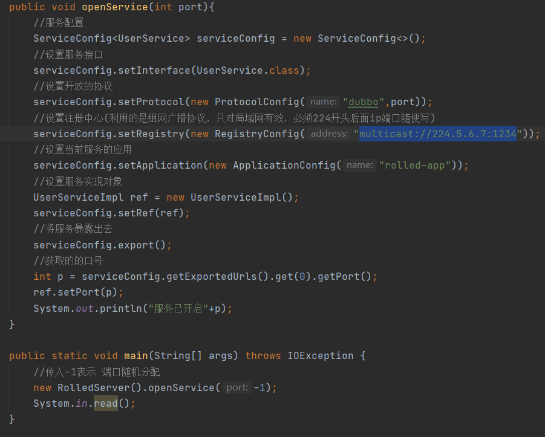

##### RolledClient

> Client端也要设置注册中心，这样就可以监听到224.5.6.7:1234上的信息

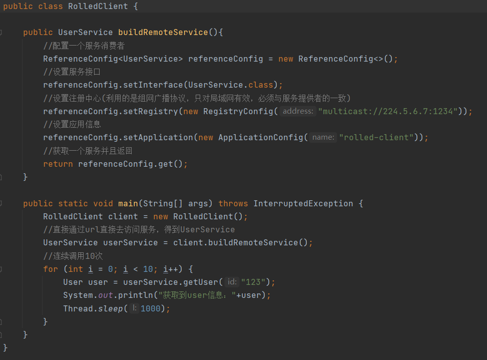

##### 测试

**RolledServer**

> 同时开启3个RolledServer服务提供者

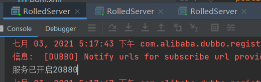

**RolledClient**

> 执行我们的服务消费者，可以发现每次调用的服务提供者都是不一样的，默认的负载均衡方式的随机

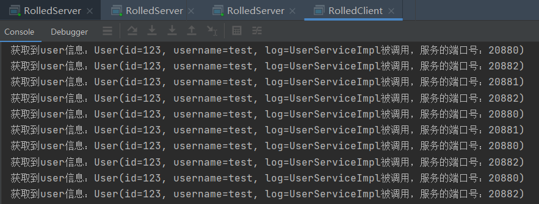

### Spring方式实现

> 以上讲的都是基础方式的实现，可以看到使用起来很繁琐，需要创建多对象个相互依赖，一般情况下使用Dubbo都会与Spring相互结合

#### dubbo_server模块

##### spring-provide.xml

> 在resources目录下增加一个`spring-provide.xml`配置文件

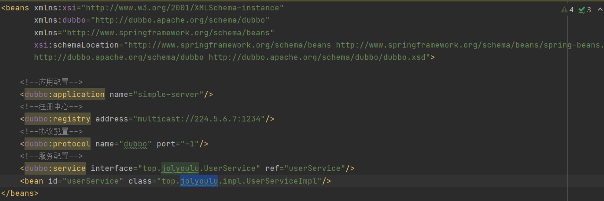

##### SpringSimpleClient

> 使用Spring方式启动与读取配置文件

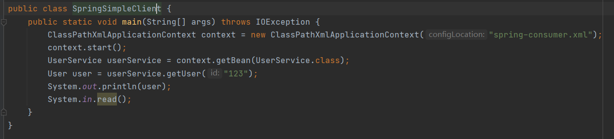

#### dubbo_client模块

##### spring-consumer.xml

> 在resources目录下增加一个`spring-consumer.xml`配置文件

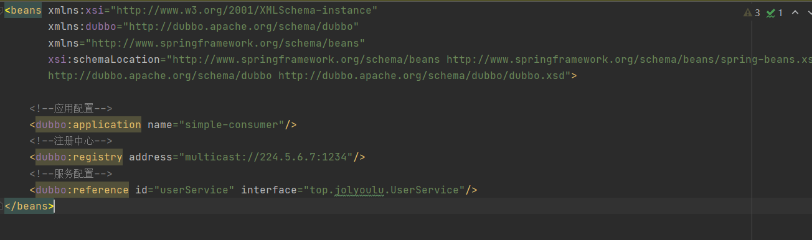

##### SpringSimpleServer

> 使用Spring方式启动与读取配置文件

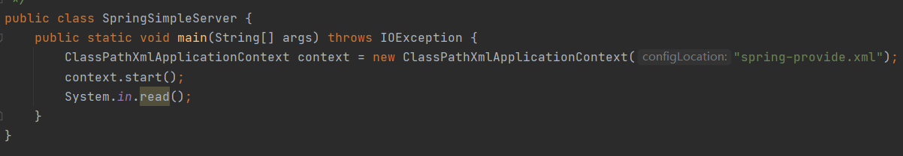

#### 测试

> 最后启动服务提供者与消费者，可以看到能够正常的完成RPC调用

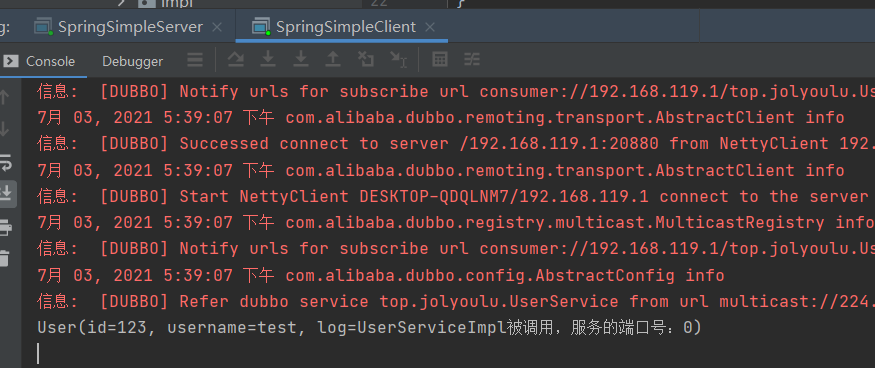

## Dubbo常用配置

> 经过了实战练习可以发现，需要使用dubbo那么服务的提供者与消费者必备的几个对象如下
>
> 服务提供者
>
> * ServiceConfig(服务提供者配置)
> * RegistryConfig(注册中心配置)
> * ProtocolConfig(协议类型配置)
> * ApplicationConfig(应用对象配置)
>
> 服务消费者
>
> * ReferenceConfig(服务消费者配置)
> * RegistryConfig(注册中心配置)
> * ApplicationConfig(应用对象配置)

### 常用标签说明

> 这里只列举了常用的，详细标签说明请阅读[dubbo官方文档](https://dubbo.apache.org/zh/docs/v2.7/user/configuration/xml/)

| 标签                  | 用途 | 说明                                                         |
| --------------------- | ---- | ------------------------------------------------------------ |
| \<dubbo:application/> | 公共 | 用于配置当前应用的信息                                       |
| \<dubbo:registry/>    | 公共 | 用于配置连接注册中心相关信息                                 |
| \<dubbo:protocol/>    | 服务 | 用于配置提供服务的协议信息，协议由提供方指定，消费方被动接收 |
| \<dubbo:service/>     | 服务 | 用于暴露一个服务，一个服务可以多个协议暴露，一个服务也可以注册到多个注册中心 |
| \<dubbo:consumer/>    | 引用 | 当ReferenceConfig没有配置配置时采用缺省值，可选项            |
| \<dubbo:reference/>   | 引用 | 用于创建一个远程服务代理，一个引用可以指向多个注册中心       |
| \<dubbo:method/>      | 公共 | 用于ServiceCionfig和ReferenceConfig指定方法级的配置信息      |
| \<dubbo:argument/>    | 公共 | 指定方法参数配置                                             |

### 常用标签属性

**registry 标签常用属性**

~~~xml
<!--register 是否将当前服务注册到注册中心，一般情况开发false 生成true-->
<!--check 是否进行检查注册中心是否连接上，默认true，true时如果注册中心连接不上服务无法启动-->
<dubbo:registry address="zookeeper://127.0.0.1:2181" register="true" check="true"/>
~~~

**service标签常用属性**

~~~xml
<!--interface 提供的服务接口-->
<!--ref 提供的服务接口具体实现-->
<!--timeout 服务调用超时时间-->
<!--retries 重试次数-->
<!--group 服务分组-->
<!--loadbalance 轮询策略-->
<dubbo:service interface="top.jolyoulu.UserService" ref="userService"
                   group="test" timeout="2000" retries="2" loadbalance="roundrobin"/>

~~~
**provider标签常用属性**

~~~xml
<!--provider 配置整个服务的公共属性，这样不用在每一个service增加timeout、retries等属性以及protocol标签等-->
<dubbo:provider group="test" timeout="2000" protocol="dubbo" port="-1" threads="800" threadpool="fixed" retries="2"/>
~~~

**consumer标签常用属性**

```xml
<!--consumer 配置整个服务的公共属性，与provider标签一样-->
<dubbo:consumer group="test" timeout="2000" threads="800" threadpool="fixed" retries="2"/>
```

### Dubbo配置常见坑