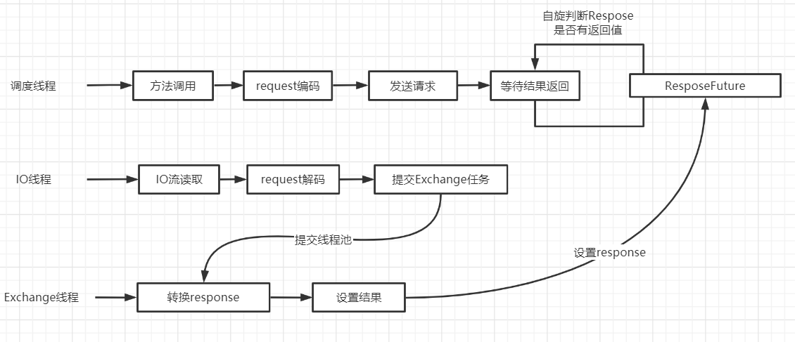

# Dubbo进阶

## 分布式项目开发规范

> 在企业家的Dubbo开发中存在的一些开发规范与单体项目是不一样的，首先我们先了解一下这些开发规范

### 接口暴露与引用

> 由于在分布式情况下，各模块都是一个独立的项目，那么这从中就存在一个问题就是，服务端开发了一个功能，那么消费端怎么才能得知你新增的接口与返回类型呢，面向接口编程即可解决这个问题将服务端，的所有即可都是基于接口实现的，并且将接口从服务端抽离出来另外放到一个独立的jar中，服务端与消费端都需要依赖这个jar，那么服务端新增/修改接口这样服务端也会知晓

### 自动化构建

> 随着项目的越来越庞大，带来的jar依赖也越来越复杂，如果只是使用传统的jar打包=>拷贝发布会很容易出错，并且难以控制，为了提示稳定性与效率，那么就需要一整套的自动化工具去完成接口的编写=>构建=>jar包=>发布，一般情况使用组合是git+Jenkins+maven

### 接口迭代注意

> 在分布式开发环境下，接口的迭代需要注意的是，由于涉及到兼容性所有的功能修改后都需要兼容原接口，如果直接在源接口上修改会导致，部分使用旧接口的服务无法正常运行，所有在升级时需要做到如下几点
>
> 1. 接口都要向下兼容：接口参数尽量以对象进行封装，Model属性只增不减，如果需要作废的方法需要添加`@Deprecated`标识
> 2. r如果出现不可兼容的变更，必须立刻通知调用方整改，并制定上线计划

### 开发与联调注意

> 用于分布式项目所以，经常在开发过程中都需要共有用到同一个注册中心，这样才能获取到其它服务的方法，如果2组服务需要联调的时候，如何保证调用的是目标服务

**临时分组联调**

~~~xml
<!--将开发中的provider与consumer设置为同一个group，这样2服务在同组直接才会被调用-->
<dubbo:provider group="test"/>
<dubbo:consumer group="test"/>
~~~

**直连提供者**

~~~xml
<!--消费者直接通过url制定了解的服务提供者-->
<dubbo:reference url="dubbo://127.0.0.1:20880" id="userService" interface="top.jolyoulu.UserService"/>
~~~
**只注册**

~~~xml
<!--如果当前服务即消费者也是提供者那么需要，将register设置false，防止其它服务订阅到这个正在开发中的服务提供者-->
<dubbo:registry address="zookeeper://192.168.100.101:2181" register="false"/>
~~~

## Dubbo控制管理后台

> Dubbo控制管理，是为开发者提供一个可视化的注册中心管理界面，可以方便开发者更好的管理自己的注册中心
>
> 在Dubbo 2.6.0之前，使用的是dubbo-admin作为管理后台，2.6以后以及去除掉了，并且采用了incubator-dubbo-ops作为新的管理后台，目前该后台还在开发中，还没发布正式的版本所以这里教大家如何部署dubbo-admin

### Dubbo控制台安装

#### 打包

> 安装也很简单，只需要从github拉取dubbo的源码并且将dubbo-admin打包成war包即可

~~~shell
#从githu克隆dubbo的项目
git clone https://github.com/apache/dubbo.git
#更新项目
git fetch
#切换到dubbo-2.5.8 版本
git checkouy dubbo-2.5.8
#进入到admin模块下
cd dubbo-admin/
#使用mvn命令构建war包，跳过测试
mvn clean package -Dmaven.test.skip=true
~~~

#### 部署

> 打好的war包会在target中看到一个war包

> 将来war包拷贝到你的tomcatWebapp目录下

> 项目运行后就会解压war后需要修改dubbo.properties配置文件

~~~properties
#你的注册中心ip地址
dubbo.registry.address=zookeeper://192.168.100.101:2181
#设置root用户与guest用户的密码，一般用默认即可
dubbo.admin.root.password=root
dubbo.admin.guest.password=guest
~~~

> 输入连接进入到这个页面表示部署成功

## Dubbo调用模块概述

> 在讲解Dubbo调用模块前，首先我们大致了解一下调用模块在Dubbo的承担了什么样的工作，从图中可以看到调用模块是在消费者端的，当一个消费者发起调用时，调用模块会获取服务列表，并且做负载均衡、容错、代理等工作，最终消费者就像调用一个普通的方法那样，获取结果无需关心其中的执行过程
>
> 1. 透明代理：通过动态代理技术，屏蔽远程调用细节以及提高编程友好性
> 2. 负载均衡：当同一个服务存在多个提供者，实现合理调用每一个提供者的算法
> 3. 容错机制：当服务调用失败时采取的策略
> 4. 调用方式：支持同步调用、异步调用

### 透明代理

> 什么是透明代理？首先我们先经过一个最原生的写法来调用一个服务，可以看到通过`client.buildRemoteService`获取到了一个`UserService`对象，然后使用`getUser`就和调用普通方法那样即可获取user对象了，实际上`getUser`这里表明看起来简单，其实里面包包含着`负载均衡、容错、编解码等`这些统统都是由代理帮我们实现了

**Dubbo的代理类型**

> Dubbo的代理分2种，Javassist（默认）与jdk

### 负载均衡

> Dubbo官方支持的负载均衡策略有4种
>
> 1. 随机(random)：按权重设置随机了轮询（默认算法）
> 2. 轮询(roundrobin)：按公约后的权重设置轮询比率
> 3. 最少活跃调用数(leastactive)：相同获取的随机，活跃指调用前后时间差
> 4. 一致性Hash(consistenthash)：相同参数总是发同一台机器
>
> `负载均衡设置如下，优先级由低至高`

~~~xml
<!-- 服务端级别-->
<dubbo:service interface="..." loadbalance="roundrobin" />
<!-- 客户端级别-->
<dubbo:reference interface="..." loadbalance="roundrobin" />
<!-- 服务端方法级别-->
<dubbo:service interface="...">
    <dubbo:method name="..." loadbalance="roundrobin"/>
</dubbo:service>
<!-- 客户端方法级别-->
<dubbo:reference interface="...">
    <dubbo:method name="..." loadbalance="roundrobin"/>
</dubbo:reference>
~~~

### 容错机制

> Dubbo官方提供的容错策略6种
>
> `这里所说的失败，都是连接异常、连接超时等原因导致的失败，而不是编写的业务发生异常导致的失败`
>
> 1. 失败自动切换：调用失败后基于`retries=2`属性重试其它服务器
> 2. 快速失败：只发起一次调用，失败立刻报错
> 3. 忽略失败：失败后忽略，不抛出异常给客户端
> 4. 失败重试：失败自动恢复，后台记录失败请求，定时重发
> 5. 并行调用：同时对多台服务发起调用，只要一个成功返回即可，通过`forks=2`设置最大并行数
> 6. 广播调用：广播调用所有提供者，逐个调用，任意一台报错则报错
>
> `设置方式如下2种，优先级由低到高`

~~~xml
<!-- 
Failover 失败自动切换 retries="1" 切换次数
Failfast 快速失败
Failsafe 勿略失败
Failback 失败重试，5秒后仅重试一次
Forking 并行调用  forks="2" 最大并行数
Broadcast 广播调用
-->
<dubbo:service interface="..." cluster="broadcast" />
<dubbo:reference interface="..." cluster="broadcast"/ >
~~~

### 调用方式

> Dubbo官方提供的调用方式1种
>
> 1. 同步调用
> 2. 异步调用

**异步调用**

> 同步调用就不细说了，重点说一下异步调用与同步调用的区别，异步调用可以实现在发起一次调用时无需等待上一个调用即可继续发现调用，一般入加载一个商品信息，你需要访问多个服务获取商品的信息、详情、图片、评价等，若使用同步调用，那么你需要等获取信息得到返回后、才你获取详情、等获取详情后才能获取图片，这样极大的影响了效率，若使用异步调用，那么这样就可以同时发起多个请求，最终等所有请求返回后把数据整合到一起即可

~~~xml
<!--在进行异步调用时 容错机制不能为  cluster="forking" 或  cluster="broadcast-->
<dubbo:reference id="asyncDemoService"
                 interface="com.tuling.teach.service.async.AsyncDemoService">
                 <!-- 异步调async：true 异步调用 false 同步调用-->
    <dubbo:method name="sayHello1" async="false"/>
    <dubbo:method name="sayHello2" async="false"/>
    <dubbo:method name="notReturn" return="false"/>
</dubbo:reference>
~~~

**异步获取结果**

> 异步调用获取结果需要使用到`RpcContext.getContext().getFuture()`，获取到一个Future对象利用`get`方法阻塞等待结果，如果不需要等待返回结果无需使用Future阻塞等待，效率会更加的高

~~~java
User user1 = userService.getUser("123");
Future<User> f1 = RpcContext.getContext().getFuture();
User user2 = userService.getUser("123");
Future<User> f2 = RpcContext.getContext().getFuture();

user1 = f1.get();
user2 = f2.get();
~~~

## Dubbo调用模块的实现

> Dubbo调用模块的默认实现是使用Netty实现的，使用是NIO+长连接

### 长连接实现与配置

> 既然消费者与提供者之间进行长连接，那么其中就存在几个问题需要解决
>
> 1. 如何建立连接
> 2. 如何保证连接的有效性
> 3. 断线重连
> 4. 连接消息

#### 如何建立连接

> 在NettyTransporter中可以看到一个connect方法，这个就是消费者与服务提供者建立连接是方法

> 最后跟踪到AbstractClient.connect的一个方法中，在改方法中就做了2个重要的动作、状态检查与实现连接

**状态检查**

> 在初始化连接之前，Dubbo首先会创建一个检查连接的任务，并且将来任务添加到线程池中，所以线程池定期会执行这个方法检查连接

**实现连接**

> 这里就是客户端连接的具体实现了，可以看到属性的Netty写法`bootstrap.connect();`

#### 心跳监测

> 在HeaderExchangeClient对象中消费者建立连接后会，由该类一直维持一个心跳

#### 断线重连

> Dubbo是如何做到断线重连的呢，其实在连接建立的时已经做好了断线重连的准备工作了，在消费者与服务者建立连接前调用的一个`initConnectStatusCheckCommand()`这时就会生成了一个定时任务，每2秒run方法都会被执行，并且检查连接是否正常，如果连接失效了会调用`connect()方法`，如果连接正常就打印一下测试连接的时间
>
> 这里引出了1个问题：如果服务端直接永远宕机了，那么这个定时任务岂不是还要一直跑下去浪费资源，当然这时Zookeeper用处就发挥出来了，如果真有一个服务宕机超过了40秒这时Zookeeper就会删除该节点，并且把事件告诉服务消费者，消费者收到事件后会最终会使用`destroyConnectStatusCheckCommand()`方法将定时任务销毁掉

#### 连接销毁

> 当注册中心有节点变更工作后，消费者会调用该方法销毁连接

### Dubbo传输协作线程

#### 客户调用流程

> 1. 客户端调度线程：用于发起远程方法调用
> 2. 客户端IO线程：由传输框架实现，用于request消息发送，response消息流读取与解码等
> 3. 客户端结果Exchange线程：当远程方法返回response后由该线程填充至，指定ResponseFuture，并且唤醒等待的调度线程

##### 客户端调度线程

> 在发起一次RPC调用时，客户端线程做的工作有：隐式传参、判断是否异步 同步 单向，并且同步不同的情况分别触发了不同的调用方法，可以看到在每一次调用`send`方法后都会调用一下`RpcContext.getContext().setFuture()方法`，这里就知道为什么在使用异步调用时需要使用`RpcContext.getContext().getFuture()`了把

> 无论是异步调用还是同步调用，可以看到最后都要调用一个`get()`方法，当请求发送过去后，客户端调度线程调用`get()`方法着进入了一个while的死循环判断response是否有返回值

##### 客户端IO线程

> 客户端IO线程，会监听服务提供者返回的所有IO事件，并且由`DubboCodec.decodeBody`处理这些事件，对response解码，解码完成后最终会由`AllChannelHandler.received()`方法，将返回结果放到了一个cexecutor的线程池中处理这个消息

##### 客户端结果Exchange线程

> 在IO线程获取到结果后，并且将来处理好的结果交由Exchange最后会进入到DefaultFuture.received()方法，将response赋值

##### 客户调用流程图

#### 服务端调用流程

>1. 服务端IO线程：由传输框架实现，用于request消息读取与解码，Response发送
>2. 业务执行线程：服务端具体业务方法的线程
## RPC协议的基本组成

> 我们舍去调用模块，也能实现RPC，但是如果我们舍去RPC协议那么就无法实现远程调用了，如图可以看到在一次调用过程中需要准备的东西，这也是一个RPC协议的注册，总结如下
>
> 1. IP与端口：既然Client要发消息给Server，那么首先需要知道Server端IP地址与端口，这样才能进行通讯
> 2. 序列化与反序列化：在计算机的世界中，它只认识字节，只认识0和1，那么Service需要将这写后到的字节组合序列化成对象，这样才能做接下来相应的操作
> 3. 协议编码与解码：拿到了序列化后的数据，就能发送了吗显然是不行的，Client与Server需要相互定好一个协议(比如书信格式)，Client将内容填写到书信中(编码)，Server收到你的信后根据双方约定好的头尾格式才能判断出你的内容是那一部分，并且提取出来
> 4. 数据传输：数据传输那么就需要使用TCP/IP协议Socket技术，这部分已经有可靠的框架帮助我们实现了入netty、mina等只需会用即可，当然如果你够强自己写一个NIO也行

### Dubbo协议使用与配置

~~~xml
 <!--
   name: 协议名称 dubbo|rmi|hessian|http|
   host:本机IP可不填，则系统自动获取
   port：端口、填-1表示系统自动选择
   server：运行服务  mina|netty|grizzy|servlet|jetty
   serialization：序列化方式 hessian2|java|compactedjava|fastjson
   详细配置参见dubbo 官网 dubbo.io
 -->
 <dubbo:protocol name="dubbo" host="192.168.0.1" port="2181" server="netty" 
  serialization=“hessian2” charset=“UTF-8” />
~~~

### Dubbo中支持的协议列表

> Dubbo在传输过程中支持多种协议，一般默认的使用dubbo协议

| **名称**    | **实现描述**                                                 | **连接描述**                           | **适用场景**                                                 |
| :---------- | :----------------------------------------------------------- | :------------------------------------- | :----------------------------------------------------------- |
| **dubbo**   | 传输服务: mina, netty(默认), grizzy 序列化: hessian2(默认), java, fastjson自定义报文 | 单个长连接NIO异步传输                  | 1、常规RPC调用 2、传输数据量小 3、提供者少于消费者 |
| **rmi**     | 传输：java rmi 服务 序列化：java原生二进制序列化        | 多个短连接BIO同步传输                  | 1、常规RPC调用 2、与原RMI客户端集成 3、可传少量文件 4、不支持防火墙穿透 |
| **hessian** | 传输服务：servlet容器 序列化：hessian二进制序列化       | 基于Http 协议传输，依懒servlet容器配置 | 1、提供者多于消费者 2、可传大字段和文件 3、跨语言调用 |
| **http**    | 传输服务：servlet容器 序列化：java原生二进制序列化      | 依懒servlet容器配置                    | 1、数据包大小混合                                            |
| **thrift**  | 与thrift RPC 实现集成，并在其基础上修改了报文头              | 长连接、NIO异步传输                    |                                                              |

### Dubbo中支持的序列化

| 方式          | 特点                                                         |
| :------------ | :----------------------------------------------------------- |
| fastjson      | 文本型：体积较大，性能慢、跨语言、可读性高                   |
| fst           | 二进制型：体积小、兼容 JDK 原生的序列化。要求 JDK 1.7 支持。 |
| hessian2      | 二进制型：跨语言、容错性高、体积小                           |
| java          | 二进制型：在JAVA原生的基础上 可以写入Null                    |
| compactedjava | 二进制型：与java 类似，内容做了压缩                          |
| nativejava    | 二进制型：原生的JAVA 序列化                                  |
| kryo          | 二进制型：体积比hessian2 还要小，但容错性 没有hessian2 好    |

