# Elasticsearch基础

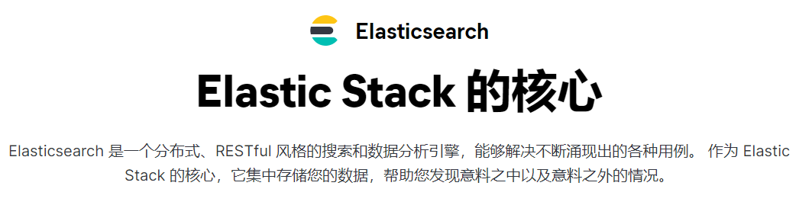

## 基本概述

> Elasticsearch简称ES，ES是一个开源的高扩展的分布式全文搜索引擎，是整个Elastic Stack技术栈的核心，它可以几乎实时的存储、检索数据，并且本身也有很好的扩展性，可以扩展到上百台服务器，处理PB级别的数据，常说的ELK Stark指：Elasticsearch+Logstash+Kibana

## ES安装

[Liunx-Elasticsearch单机与集群部署](https://blog.csdn.net/weixin_44642403/article/details/119988003)

[Win-Elasticsearch单机与集群部署](https://blog.csdn.net/weixin_44642403/article/details/120066286)

## 客户端的安装

> ES是HTTP协议，RESTful风格的搜索和数据分析引擎，所以如果需要操作ES，那么只需要对ES发RESTful风格HTTP请求即可，在浏览器中只能发送HTTP-GET请求，所以这里我们可以安装一个Postman能够方便的访问ES服务
>
> 相信大多小伙伴对Postman并不模式，它是一个强大的网络调试工具，可以发送任何类型的HTTP请求如GET、POST、HEAD、PUT等，还能附带任意类型的消息
>
> [点击进入Postman官网](https://www.postman.com/)，自行安装

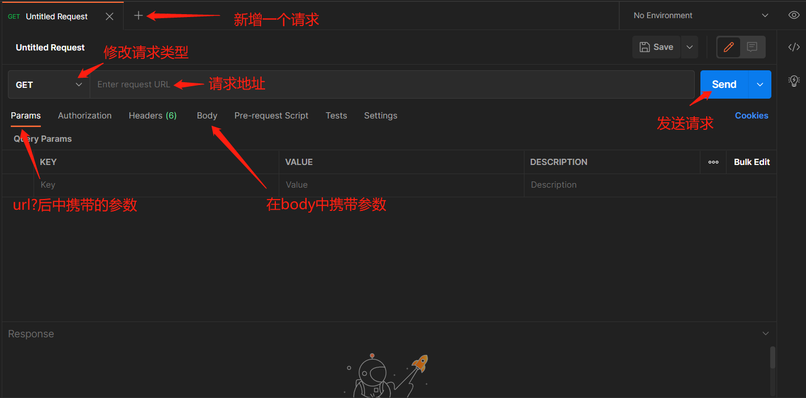

## ES数据格式

> ES是面向文档型数据库，一条数据在ES中就是一个文档，为了方便大家理解我们将ES里面存储文档的数据与Mysql做对比
>
> ES中Index(索引)：相当于Mysql的数据库
>
> ES中Type(类型)：相当于Mysql的表
>
> ES中Document(文档)：相当于Mysql行
>
> ES中Fields(字段)：相当于Mysql的列
>
> 其实ES查询数据方式和Msql差不多，查询某个数据库下的某个表的某条数据，这时就有疑问了，ES数据结构与Mysql类似那为什么还有用ES，他们两最大区别就在于索引，正所谓一种数据读写工具灵活所在真是他的索引，不同数据结构的所有对读写操作可是会有很大影响的

### 正排索引

> 基本市面上的关系型数据库使用的都是正排索引，什么是正向索引就拿Mysql举例，正向索引即从大到小，如下面有一个表那么索引是ID，那么我要获取张三的数据，那么我查询顺序应该是xxx库=>xxx表=>id为001的数据，这就是正排索引，可以看到的是id作为索引关联着数据
>
> 正排索引缺点，模糊查询需要全表扫描，但关系型数据库大部分情况都是精准查询所以关系型数据库使用的都是正排索引

| id   | content              |
| ---- | -------------------- |
| 001  | my name is zhang san |
| 002  | my name is li si     |

### 倒排索引

> ES为了能够快速的查询那么他使用的是倒排索引，倒排索引与正排索引相反，将关键字作为作为索引去去存储，那么这样就可以确保以最快的速度查询到我关心的内容

| key   | id      |
| ----- | ------- |
| my    | 001,002 |
| name  | 001,002 |
| is    | 001,002 |
| zhang | 001     |
| san   | 001     |
| li    | 002     |
| si    | 002     |

## ES客户端使用

> ES基本使用，主要是为简单的了解ES的一些增删改查操作，主要是使用Postman做演示，最简单的方式了解ES的增删改查，关于JavaAPI的使用与实战会在

### 索引操作

> ES的索引可以被理解为，Mysql中的库，在使用ES前首先需要创建索引，因为后面的所有的操作都是基于索引完成的

#### 索引创建

> 通过以下请求可以创建一个索引
>
> 向ES发`PUT`请求`http://localhost:9200/{索引名称}`

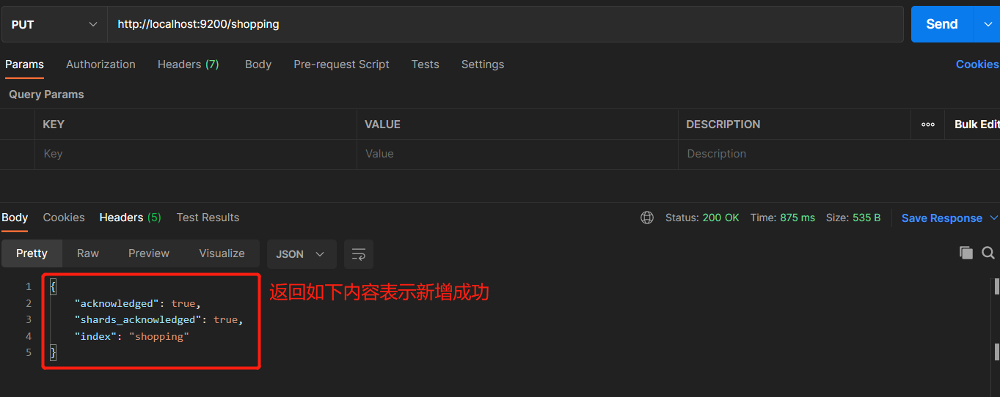

#### 获取指定索引信息

> 从索引信息中可以看到关于索引映射关系，后面会说到映射关系有什么用
>
> 向ES发`GET`请求`http://localhost:9200/{索引名称}`

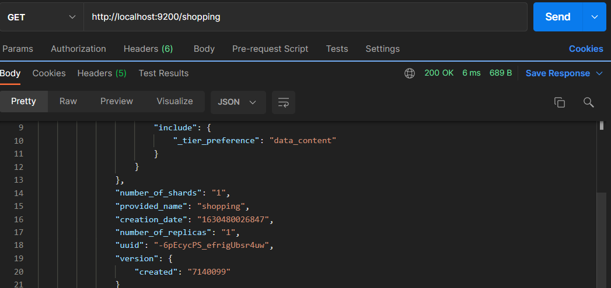

#### 获取所有索引信息

> 通过以下请求可以获取到当前ES中存在的所有索引文件信息
>
> 向ES发`GET`请求`http://localhost:9200/_cat/indices?v`

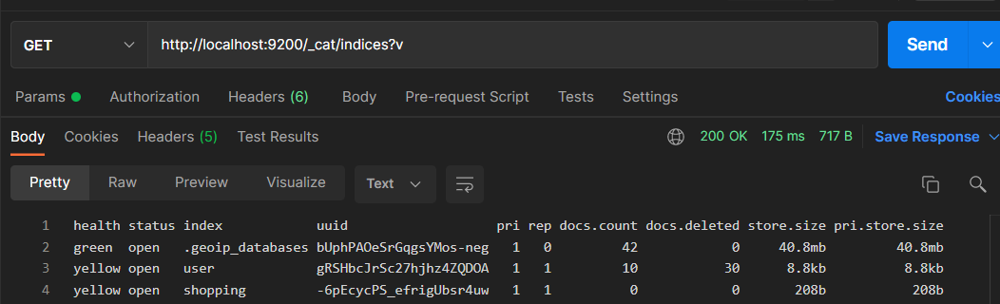

#### 删除索引

> 通过以下请求可以删除ES中的索引
>
> 向ES发`DELETE`请求`http://localhost:9200/{索引名称}`

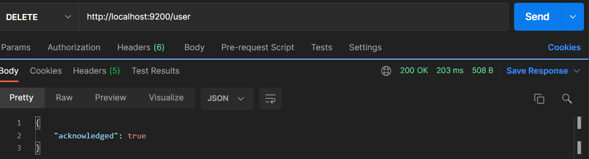

#### 创建索引映射关系

> 设置了索引映射关系的可以控制文档的内容那些是可以被查询的，那些是需要分词查询的，当然不设置也可以，ES会采用默认的type都为text，即使会被分词查找，分词查找在查询操作会有说明
>
> 向ES发`PUT`请求`http://localhost:9200/{索引名称}/_mapping`

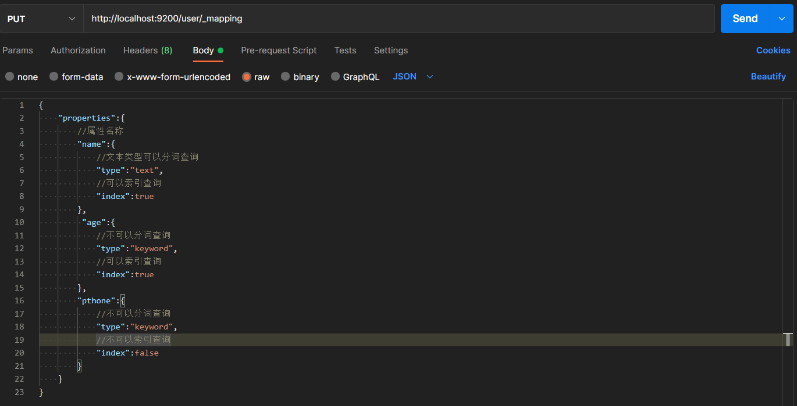

#### 查询索引映射关系

> 通过以下请求可以查看索引映射关系
>
> 向ES发`GET`请求`http://localhost:9200/{索引名称}/_mapping`

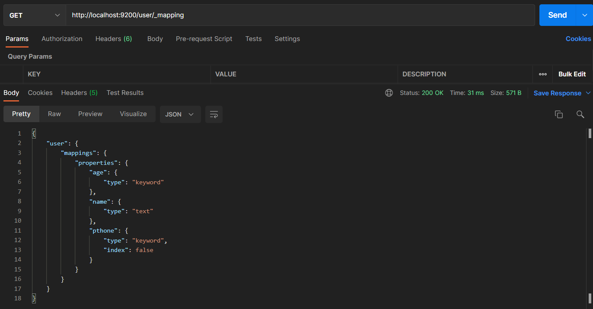

### 文档操作

> ES的文档可以被理解为Mysql中的一条一条的数据，相信这时大家就有一个疑问了，表呢？没有表怎么插入数据，并且在前面也有说ES的Type相当于Mysql的表
>
> 由于ES为了提高效率，对表的概念进行了弱化了，ES的每个索引下面只有一个名为_doc的表，并且你只能操作这个表增删改查，所以可以看到在文档操作的请求中是`http://xxx/xx/_doc/xxx`
>
> 这样用户就不用关系你的数据在那个表，你只要知道你要去那个索引下获取数据即可，因为他下面只有一个表

#### 创建文档(ID随机生成)

> 发送以下请求即可在索引中创建一个文档，文档的内容需要放在Body以Json的方式发送过去，若没知道ID，ES会为这条数据随机生成一个ID
>
> 向ES发`POST`请求`http://localhost:9200/{索引名称}/_doc`

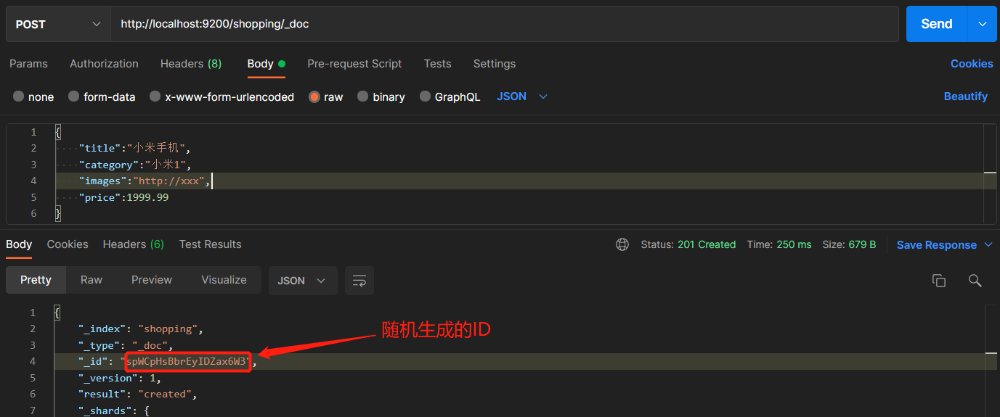

#### 创建/覆盖文档(ID指定)

>发送以下请求即可根据你指定的ID创建文档，若ES中已存在该ID的文档旧文档则会被覆盖
>
>向ES发`PUT`请求`http://localhost:9200/{索引名称}/_doc/{文档ID}`

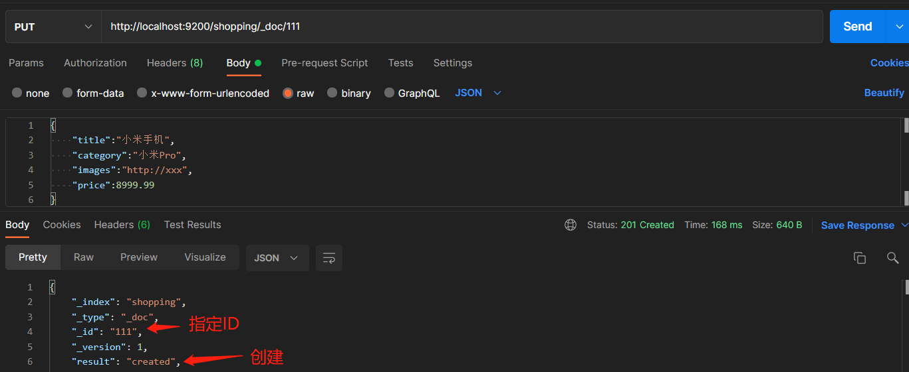

#### 局部更新文档内容

> 发送以下请求可以局部更新文档内容
>
> 向ES发`POST`请求`http://localhost:9200/{索引名称}/_update/{文档ID}`

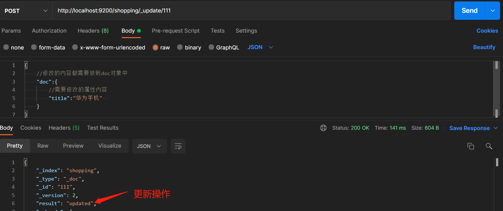

#### 删除文档(指定ID)

> 发送以下请求可以删除指定ID的文档
>
> 向ES发`DELETE`请求`http://localhost:9200/{索引名称}/_doc/{文档ID}`

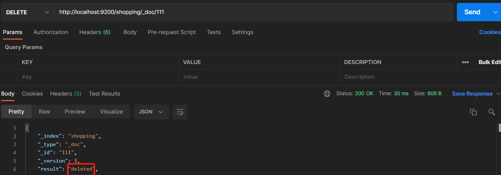

#### 根据ID查询文档

> 发送以下请求可以根据文档ID获取到文档中的数据
>
> 向ES发`GET`请求`http://localhost:9200/{索引名称}/_doc/{文档ID}`

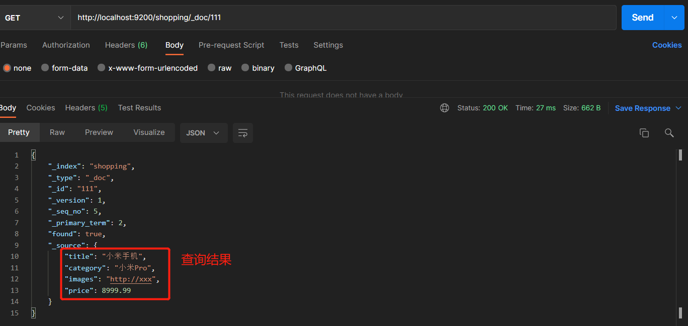

#### 查询所有

> 发送以下请求可以查询指定索引下的，所有文档包括文档内容
>
> 向ES发`GET`请求`http://localhost:9200/{索引名称}/_search`

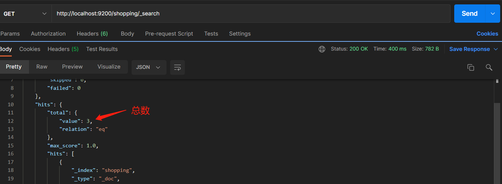

### 查询操作

> 查询操作也是平时使用ES使用的最多的操作，ES支持很多种查询方式如分页、排序、分组等，通过设置索引映射关系可以控制文档中的那些内容是需要分词查询、那些不能分词查询、那些不会被查询

#### 全文查询(分页+排序+过滤)

> 在发送查询请求时在请求体内附加以下参数实现分页、过滤、排序
>
> 向ES发`GET`请求`http://localhost:9200/{索引名称}/_search`

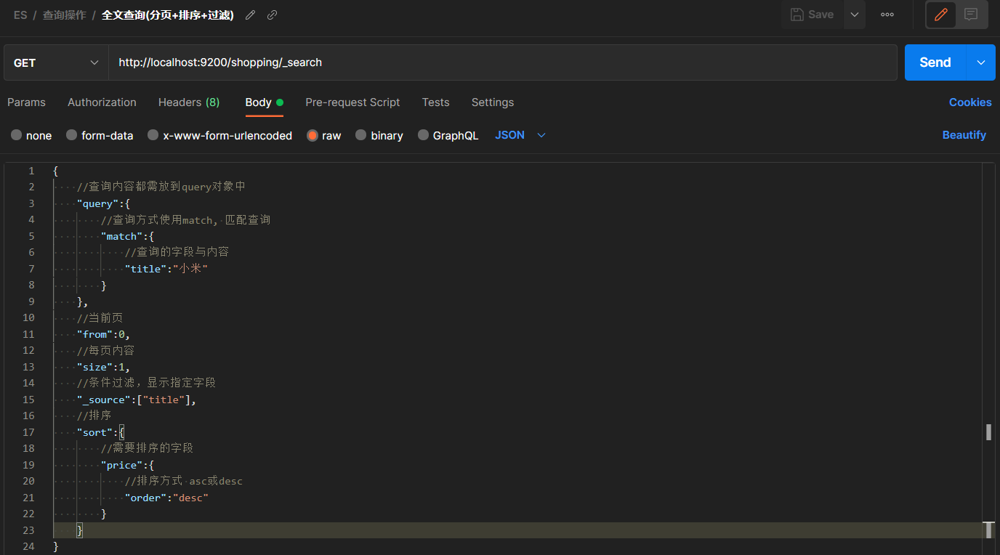

#### 全文查询(多条件AND查询)

> 在发送查询请求时在请求体内附加以下参数实现多条件AND
>
> 向ES发`GET`请求`http://localhost:9200/{索引名称}/_search`

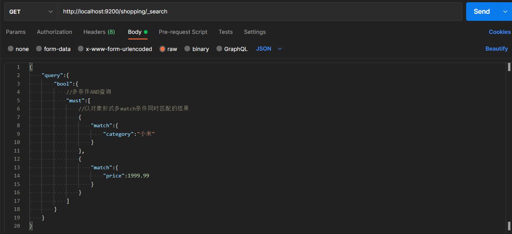

#### 全文查询(多条件OR查询)

> 在发送查询请求时在请求体内附加以下参数实现多条件OR
>
> 向ES发`GET`请求`http://localhost:9200/{索引名称}/_search`

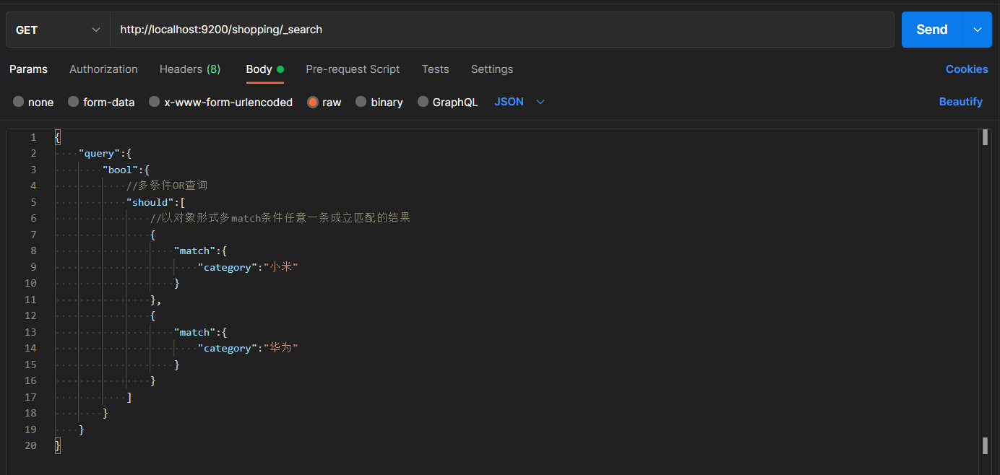

#### 全文查询(多条件+范围)

> 在发送查询请求时在请求体内附加以下参数实现多条件、范围
>
> 向ES发`GET`请求`http://localhost:9200/{索引名称}/_search`

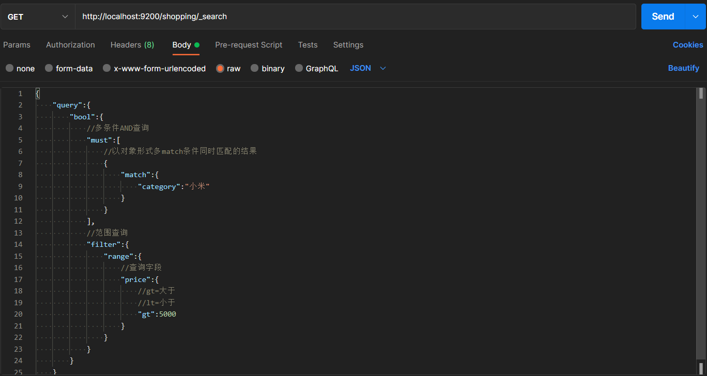

#### 全文查询(不分词匹配+高亮)

> 在发送查询请求时在请求体内附加以下参数实现不分词匹配
>
> 向ES发`GET`请求`http://localhost:9200/{索引名称}/_search`

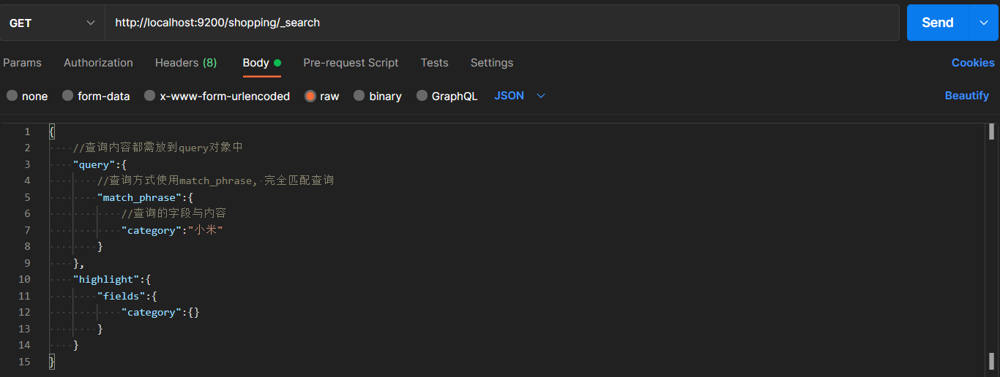

#### 全文查询(聚合操作)

> 在发送查询请求时在请求体内附加以下参数实现不聚合
>
> 向ES发`GET`请求`http://localhost:9200/{索引名称}/_search`

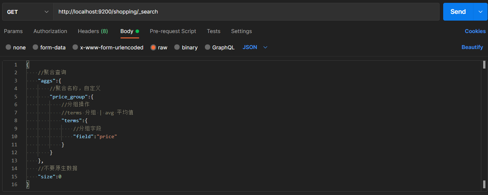

## kibana使用

> kibana是一款为ES提供数据可视化的工具，里面提供了很多的统计图模板，可根据需求自定义生成各种统计图

### 下载kibana

> 进入[kibana下载地址](https://www.elastic.co/cn/downloads/kibana)下载压缩包，下载完成后解压

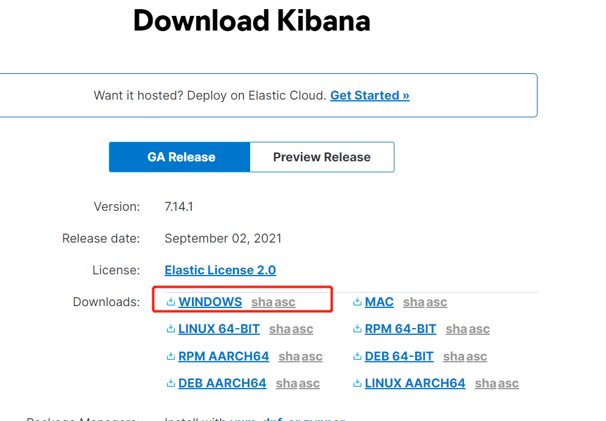

### 修改配置

> 修改config目录下的kibana.yml 文件

~~~yml
# 默认端口 
server.port: 5601 
# ES服务器的地址
elasticsearch.hosts: ["http://localhost:9200"] 
# 索引名
kibana.index: ".kibana" 
# 支持中文
i18n.locale: "zh-CN"
~~~

### 启动服务

> 执行bin目录下的`kibana.bat`，kibana启动比较慢所以等一会

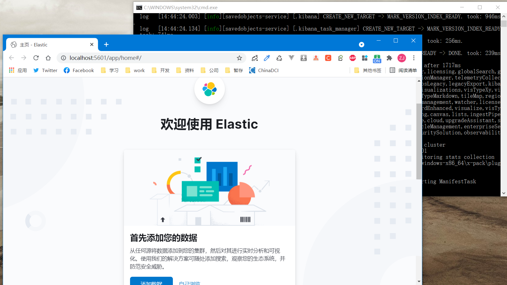

## ES JavaAPI使用

> 普通的java程序只需要引入一个jar包即可对es进行访问操作，以下提供一些案例
>
> 该案例的git仓库：https://gitee.com/smallpage/java-demo.git
>
> 由于代码量较大，这里就不一一列举了，但是会举一些简单的例子，要完整代码可以去以上git中下载

### 依赖引入

~~~xml
<dependency>
    <groupId>org.elasticsearch</groupId>
    <artifactId>elasticsearch</artifactId>
    <version>7.14.0</version>
</dependency>
<dependency>
    <groupId>org.elasticsearch.client</groupId>
    <artifactId>elasticsearch-rest-high-level-client</artifactId>
    <version>7.14.0</version>
</dependency>
<dependency>
    <groupId>org.slf4j</groupId>
    <artifactId>slf4j-nop</artifactId>
    <version>1.7.25</version>
    <scope>test</scope>
</dependency>
<dependency>
    <groupId>com.alibaba</groupId>
    <artifactId>fastjson</artifactId>
    <version>1.2.76</version>
</dependency>
<dependency>
    <groupId>junit</groupId>
    <artifactId>junit</artifactId>
    <version>4.12</version>
    <scope>test</scope>
</dependency>
<dependency>
    <groupId>org.projectlombok</groupId>
    <artifactId>lombok</artifactId>
    <version>1.18.16</version>
</dependency>
~~~

### 连接ES

> 通过构建一个RestHighLevelClient即可与es服务连接

~~~java
//创建ES客户端
RestHighLevelClient esClient = new RestHighLevelClient(
    RestClient.builder(new HttpHost("localhost", 9200, "http"))
);
//这里编写你的增删改查代码
//关闭客户端
esClient.close();
~~~

### 索引操作

> 索引的操作大致分3步，1.创建es客户端连接，2.构建索引操作request对象，3.发送索引操作请求

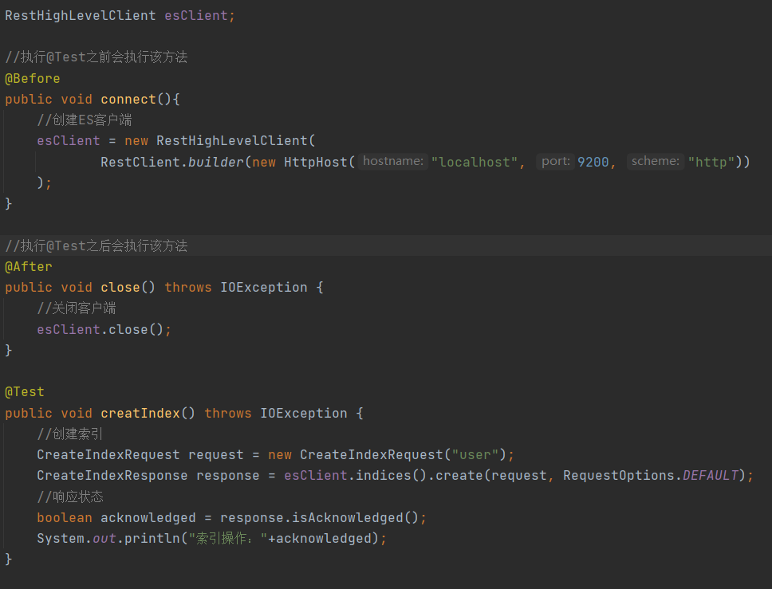

| request对象                     | 说明               |
| ------------------------------- | ------------------ |
| new CreateIndexRequest("user"); | 构建创建索引的请求 |
| new GetIndexRequest("user");    | 构建获取索引的请求 |
| new DeleteIndexRequest("user"); | 构建删除索引的请求 |

| esClient客户端方法                                         | 说明               |
| ---------------------------------------------------------- | ------------------ |
| esClient.indices().get(request, RequestOptions.DEFAULT)    | 发送查询索引的请求 |
| esClient.indices().create(request, RequestOptions.DEFAULT) | 发送创建索引的请求 |
| esClient.indices().delete(request, RequestOptions.DEFAULT) | 发送删除索引的请求 |

### 文档操作

> 文档操作大致分3步，1.创建es客户端连接，2.构建文档操作request对象，3.发送文档操作请求

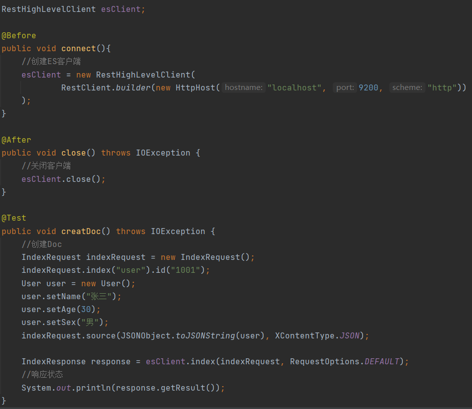

| request对象          | 说明                   |
| -------------------- | ---------------------- |
| new IndexRequest();  | 构建创建文档的请求     |
| new UpdateRequest(); | 构建更新文档的请求     |
| new GetRequest();    | 构建查询文档的请求     |
| new DeleteRequest(); | 构建删除文档的请求     |
| new BulkRequest();   | 构建批量操作文档的请求 |

| esClient客户端方法                                    | 说明                   |
| ----------------------------------------------------- | ---------------------- |
| esClient.index(indexRequest, RequestOptions.DEFAULT); | 发送创建文档的请求     |
| esClient.update(request, RequestOptions.DEFAULT);     | 发送更新文档的请求     |
| esClient.get(request, RequestOptions.DEFAULT);        | 发送查询文档的请求     |
| esClient.delete(request, RequestOptions.DEFAULT);     | 发送删除文档的请求     |
| esClient.bulk(request, RequestOptions.DEFAULT);       | 发送批量操作文档的请求 |

### 查询操作

> 查询操作就相较索引与文档要复杂，可以进行多条件查询，1.创建es客户端连接，2.构建查询请求，3.构建搜索源生成器，4.设置查询生成器，5.发送查询条件

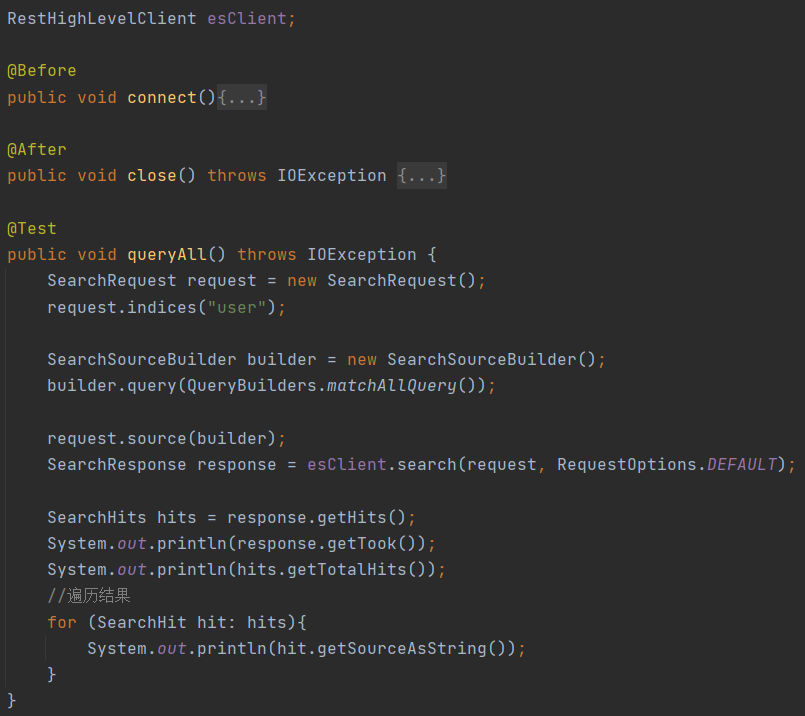

