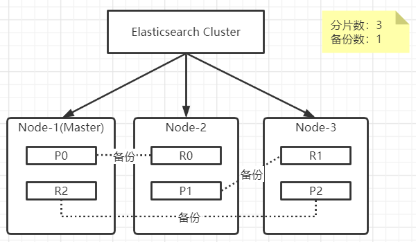
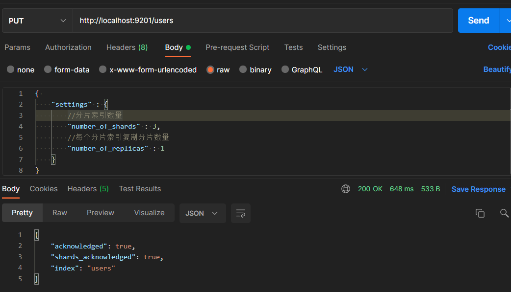
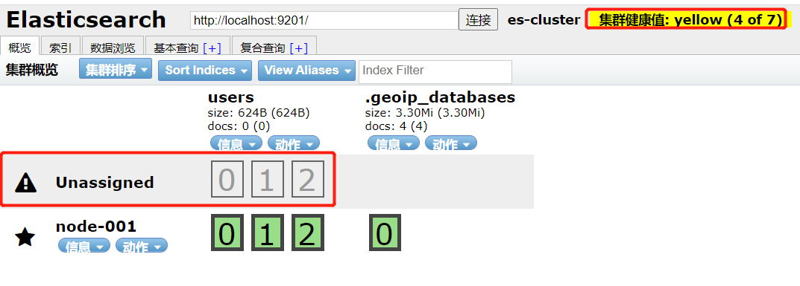
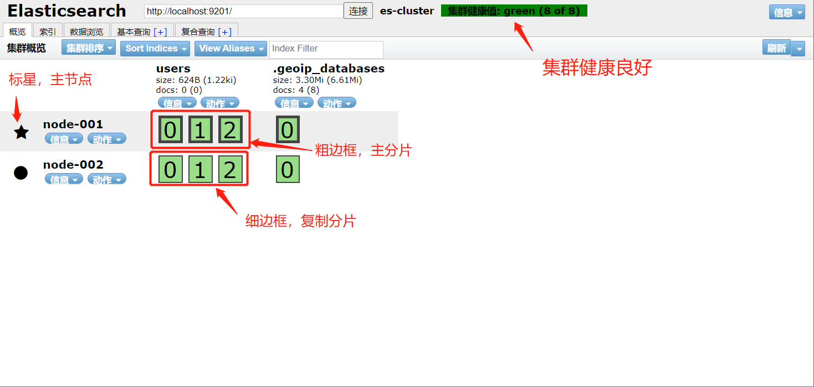
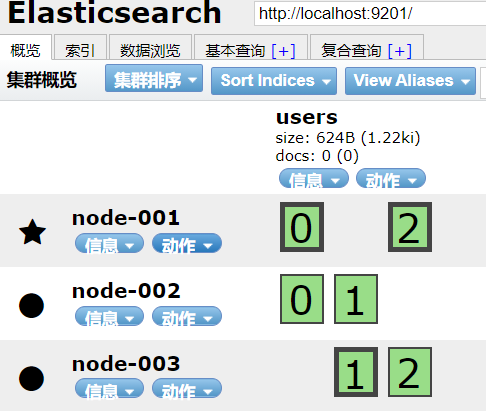
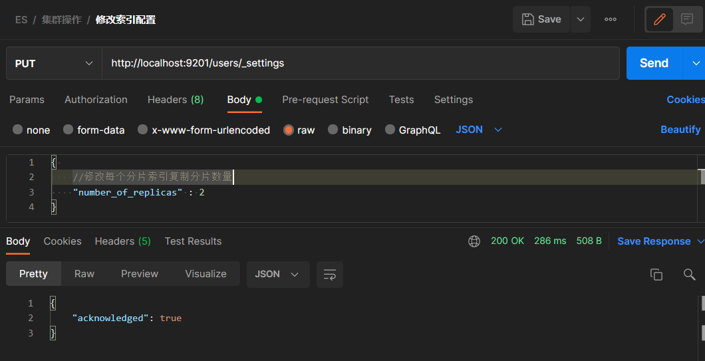
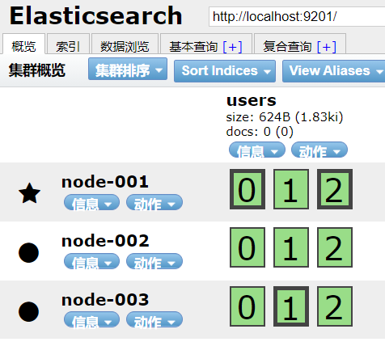
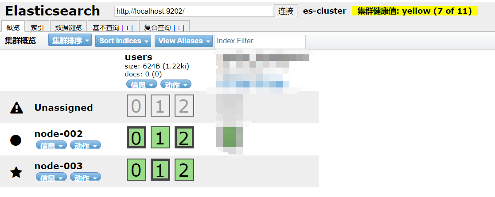
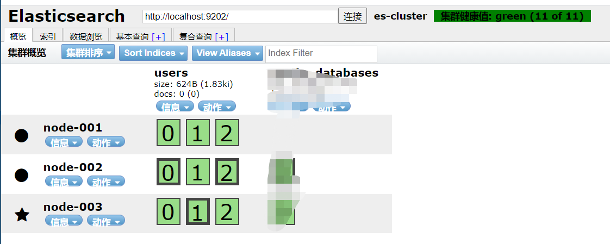

# Elasticsearch进阶

## ES核心概念

### 索引(Index)

> 一个索引就是一个拥有几分相似特征的文档的集合，如可以按用户信息、产品信息、订单信息分类放到不同的索引下，每个索引都有一个名称(必须全部是小写字母)，我们对所有的文档数据进行增删改查操作时都是需要先指定索引，再次操作该索引下的文档，在ES单机或集群中可以定义任意多的索引，只要能搜索的数据必须索引，ES索引的一切设计都是为了提高搜索性能

### 类型(Type)

> 在一个索引中，你可以定义1种或多种类型(6.x之前)，一个类型是索引的一个逻辑上的分类/分片，名称也是由你来定义，通常会把一组共同字段的文档定义为一个类型，不同的ES版本对类型的支持也发生变化

| 版本 | Type                                         |
| ---- | -------------------------------------------- |
| 5.x  | 支持多种type                                 |
| 6.x  | 只能有一种type                               |
| 7.x  | 不再支持自定义索引类型(使用默认类型为：_doc) |

### 文档(Document)

> 一个文档就是一个可被索引的基础信息单元，也就是一条数据
>
> 在ES中任何数据都是以文档的方式存储的，如一个用户的文档，一个产品的文档，一个订单的文档，文档的内容是以JSON格式标识的，在一个类型(Type)下，你可以存储任意多的文档

### 字段(Field)

> 相当于数据的字段，对文档数据根据不同属性进行的分类标识

### 映射(Mapping)

mapping可以在处理时间的方式和规则方面做一些限制，如某个字段的数据类型、默认值、是否被索引等，这些都是通过映射可以设置的，

### 分片(Shards)

> 在大数据的情况下可对索引进行分片，即数据划分到ES集群多个节点中，划分的每一份称为分片，但你创建一个索引是，你可以指定你想要的分片数量，每一个分片本身以上一个完善的独立的索引，这个索引被创建在集群中的任意节点上，至于分片节点如何分配，数据如何存放，数据如何查询这些都由ES管理用户无需关心，对用户来说只需使用普通的增删改查操作即可完成这些分片数据的操作
>
> 分片对ES来说是一个很重要的功能，主要原因如下
>
> 1. 允许你水平分割和扩展你的内容容量
> 2. 允许你在分片上进行分布式的、并行的操作、提高性能/吞吐量
>
> 容易混淆的概念是，一个Lucene索引在ES中称为分片，一个ES索引是分片的集合，当ES在索引中搜索的时候，他发送查询到每个索引的分片(Lucene索引)，然后合并每个分片的结果最后用户一个全局的结果集给用户

### 副本(Replicas)

> 既然有了集群，那么需要保证ES高可用的，就必须存在副本，ES中允许你为分片建立1份或多份的备份，这些备份称为复制分片(副本)，当一个所有被复制了，那么被复制的索引为主分区，复制索引的为复制分区，一个主分区可以拥有多个复制分区，复制分区的数据源于主分区
>
> 复制分片主要2个原因
>
> 1. 在分片/节点发生问题情况下，提供高可用，所以复制分片从来不会和主要分片置于同一台服务器上
> 2. 扩展你的搜索量/吞吐量，因为搜索可以在所有的副本上并行运行

### 分配(Allcation)

> 将分片分配给某个节点的过程，包括分配主分片或者副本，这写些都是由Master节点完成的

## ES集群架构

> 在一个集群中每个运行中的ES实例称为一个节点，而集群是由多个相同cluster.name配置的节点组成，它们同时承担数据和负载的压力，当有节点加入集群中或从集群中移除节点是，集群将会重新平均分布所有的数据
>
> 当集群中一个节点被选举成为主节点时，它负责管理集群范围内所有变更，如增加、修改、删除索引或节点等操作，而主节点并不需要涉及到文档级别的增删改查等操作，所以说当集群只拥有一个主节点即使流量的增加主节点也不会成为性能瓶颈，任何节点都可以成为主节点
>
> 用户可以将请求发送到集群中的任何节点，包括主节点，每个节点都知道任意文档所处的位置，并且能够将我们的请求直接转发到存储我们所需文档的节点，无聊我们将请求发送到那个节点，它都能负责从集群各节点收集我们所需的文档并且最终返回给客户端

## 分布式集群

### ES集群安装与部署

[Liunx-Elasticsearch单机与集群部署](https://blog.csdn.net/weixin_44642403/article/details/119988003)

[Win-Elasticsearch单机与集群部署](https://blog.csdn.net/weixin_44642403/article/details/120066286)

### ES集群健康插件

> 在chrome浏览器中可以通过一个`ElasticSearch Head`插件中看到集群的健康状态，在chrome商店中搜索下载即可

### 单节点集群

> 尝试在单节点情况下创建一个名为users索引，并且分片为3，分片索引备份数量为1

> 创建成功后，在浏览器中通过使用ES Head插件，查看集群状态可以看到当前健康值为yellow，并且以下内容可以发现users被分为3个分片，并且都在node-001节点上，但是3个分片的副本被标记为`Unassigned`(未分配)，这里验证了在ES核心概念中副本是不允许被放在相同的节点中的特性

### 故障转移

> 当集群中只有一个节点运行时，意味着会有单点故障的问题，说明的单节点集群就是一个典型的会存在单点故障的ES集群，解决这个问题很简单只需要再启动一个`cluster.name`一样的节点即可，它会自动发现集群并且加入

### 水平扩容

> ES中的水平扩容也是完全自动的，当我们启动多一个节点后ES会自动，平均分配主分片和副本分片

### 分片调整

> 当分片数量是3，复制分片3，那么极限情况下最多6个节点，当访问量量越来越大时，我们就需要更多的分片与节点来分担，所以需要扩容分片，主分片是在ES创建索引时已经确定了的所有是不允许修改的，但是副本分片是可以随时调整，可以通过修改副本分片数量，增加节点来实现更高的吞吐量

> 通过修改复制分片数量后，新增为3主分片，6个复制分片那么极限情况下可以组成9个节点的ES集群

### 故障应对

> 如果Master节点宕机后，ES集群会自动进行选举分配新的Master，并且会把主分片分配到存活节点中，可看到当前集群node-001已单机，node-003成为了Master，原有在node-001的0与2主分区，被移到了node-002中，健康值为黄色，当然限制ES集群还是能正常访问只是性能与吞吐能力有明显下降

> 重启node-001后集群健康状态会被恢复为绿色

