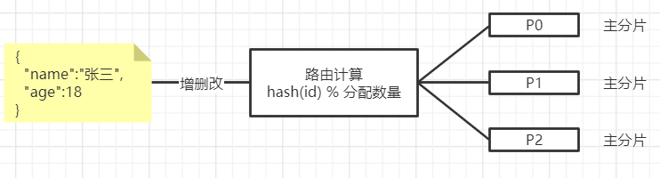
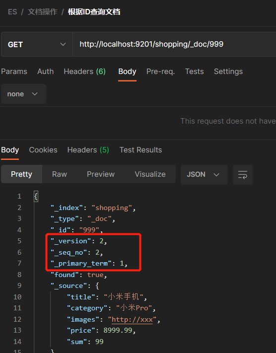

# Elasticsearch高级

## 数据写流程

> 1. 当对ES集群其中一个节点收到doc的增删改时
> 2. 首先ES会对doc的id进行hash计算，计算该文档需要由那个主分片操作，并将请求转发到相应的主分片中
> 3. 主分片收到请求完成写入后，会发送一条消息给复制分片，复制分片收到消息后同步数据，同步完毕后会返回消息给主分片
> 4. 最终主分片收到全部复制分片同步成功消息后，返回客户端操作成功

> 通过数据写流程可用发现，ES为了保证数据一致性主分片与复制分片每次写操作时都需要主分片与复制分片同时写入成功后才算成功，可通过consistency参数修改数据一致性策略

| 参数        | 说明                                                         |
| ----------- | ------------------------------------------------------------ |
| consistency | consistency 参数的值分为 one (只要主分片状态 ok 就允许执行_写_操 作) all (必须要主分片和所有副本分片的状态没问题才允许执行_写_操作) quorum (默认参数), 即大多数的分片副本状态没问题就允许执行_写_ 操作。 注意，规定数量 的计算公式中 number_of_replicas 指的是在索引设置中的设定 副本分片数，而不是指当前处理活动状态的副本分片数。如果你的索引设置中指定了当前索引拥有三个副本分片，那规定数量的计算结果即： int( (primary + 3 replicas) / 2 ) + 1 = 3 如果此时你只启动两个节点，那么处于活跃状态的分片副本数量就达不到规定数量，也因此您将无法索引和删除任何文档 |
| timeout     | 如果没有足够的副本分片会发生什么？ Elasticsearch 会等待，希望更多的分片出 现。默认情况下，它最多等待 1 分钟。 如果你需要，你可以使用 timeout 参数 使它更早终止： 100 100 毫秒，30s 是 30 秒 |

## 数据读流程

> 读流程则与写流程类似，唯一确保是写流程是只对主分区操作，读流程是对所有分区都可用操作
>
> 1. 客户端向任意节点发送获取请求
> 2. 节点使用文档的 _id 来确定文档属于那个分片 ，将请求转发到任意一个分片的副本分片处理
>
> 3. 分片副本节点送到请求处理完毕，将文档返回给原转发的节点，然后将文档返回给客户端

## 更新与批量操作

> 更新流程：就是读流程与写流程，结合先读后写，都是由ES内部完成
>
> 批量操作：批量操作流程时间是ES内部计算每个文档id进行分发到相应的主分片后完成的

## 倒排索引

> ES之所以能实现全文快速搜索，是因为ES使用了一种称为倒排索引的结果，与倒排索引向对立的那么就是正向索引
>
> 所谓的正向索引，就是搜索引擎会将待搜索的文件都对应一个文件 ID，搜索时将这个 ID 和搜索关键字进行对应，形成K-V对，然后对关键字进行统计计数，但是在在互联网上收录在搜索引擎中的文档数目是天文数字，并且通常搜索功能都是以模糊查询为主，显然正向索引不适合该业务
>
> 所以搜索引擎将正向索引重新构建为倒排索引，即把文件内容抽出根据关键字分开，这些关键字关联包含这些内容的多个文档

### 倒排索引构成

> 如现有2个文档，文档内容如下，将他构建成倒排索引，将所有文档中内容分词并且作为关键字，与文档id构成索引，通过关键字即可锁定有相关内容的文档id

## 文档搜索

> 早期的全文检索会为整个文档集合建立一个很大的倒排索引并将其写入到磁盘。 一旦 新的索引就绪，旧的就会被其替换，这样最近的变化便可以被检索到，倒排索引被写入磁盘后是不可变的，它永远不会修改，不可变带来了极大好处
>
> 1. 不需要锁，如果你从来不更新索引，那么你不需要当心多进程同时修改数据的问题
> 2. 一旦索引被读入内核的文件系统缓存，便会留在哪里，由于其不变性。只要文件系统缓存中还有足够 的空间，那么大部分读请求会直接请求内存，而不会命中磁盘，这提供了很大的性能提升
> 3. 其它缓存(像 filter 缓存)，在索引的生命周期内始终有效。它们不需要在每次数据改变时被重建，因为数据不会变化
> 4. 写入单个大的倒排索引允许数据被压缩，减少磁盘 I/O 和 需要被缓存到内存的索引的使用量
>
> 当然，不变的索引页有不好的地方，主要是她是不可变的，你不能修改她，那么如果你有一些新的文档需要被索引是，就需要重新建立整个索引，由于索引的庞大重新建立索引是相当耗时的

### 动态更新索引

> 在ES中索引是可动态更新的，ES会将索引拆分成多段，Elasticsearch基Lucene，这个 java 库引入了按段搜索的概念，每一 段本身都是一个倒排索引，但索引在 Lucene 中除表示所有段的集合外，还增加了提交点的概念 (一个列出了所有已知段的文件)
>
> 动态更新索引流程大致如下
>
> 1. 新文档被收集到内存索引缓存中
> 2. 不定时，缓存被提交，会生成一个新的段(追加的倒排索引)写入到磁盘
> 3. 磁盘同步，所有在文件系统缓存中等待写入都刷新到磁盘，确保他被写入物理文件中
> 4. 新的段被开启，让它包含的文档可被搜索
> 5. 内存缓存被清空，等待接收新的文档

> `当一个查询被触发，所有可搜索的段按顺序被查询`，这样就可以确保最新的文档位于最前面，词项统计会对所有段的结果进行聚合，以保证每个词和每个文档的关联都被准确计算
>
> 段是不可改变的，所以既不能从把文档从旧的段中移除，也不能修改旧的段来进行反映文档 的更新，取而代之的是，每个提交点会包含一个 .del 文件，文件中会列出这些被删除文档的段信息
>
> 当一个文档被删除其实只是被逻辑删除，该文档在查询时仍然会被匹配到，只是在结果返回前es会将被标记删除的文档从返回结果集种移除
>
> 当一个文档被更新实际是先将旧版本标记删除，生成新的文档被添加到新的索引段中提交

### 近实时搜索

> 在ES中索引的文档学习，并不是完全的实时变动的，而是非常接近实时ES是如何做到的呢，首先我们需知道文档需要在落盘之后才会被索引到，那么如果是数据需要写入磁盘是需要fsync来确保被物理性的写入磁盘，但是fsync操作的代价很大存在性能问题
>
> ES通过在内存与磁盘中间加多一层文件系统缓存，内存索引缓冲区的文档在写入新的段后，而不是直接被写入磁盘，而是先写入到文件缓存区稍后会被刷盘，这里的代价要比直接fsync低，并且当新的段写入到文件缓存那旧可以像其它文件一样打开和读取了
>
> ES中，写入和打开一个新段的轻量过程叫做refresh，默认情况下每个分片每秒会自动刷新一次，那么严格来说ES的文档变化并不是立刻可见，但是1秒内可见，当然也可以手动刷新`/{索引}/_refresh`
>
> 通过`PUT`请求`/{索引}/_settings`可以修改索引的刷新间隔

### 持久化

> 在前面提到过ES为了提高效率，新创建在内存中的文档并不会直接fsync到硬盘，而是放到一个文件缓存区，不定时的将文件缓存区的数据fsync到硬盘，那么这也带来一个问题就是若ES突然断电，那么在文件缓存区的索引信息将会被丢失，因为这些索引信息还没落盘
>
> ES为了确保可靠性增加了一个translog，也可交事务日志当一个文档被索引后，会被添加到内存缓冲区，并且追加到translog中才会给客户端相应200OK，若ES断电后重启ES首先会重放translog中的所有操作
>
> translog也被用于提高实时的CRUD，当你尝试通过ID对文档增删改是，ES会先检查translog中最近的变更，这意味着它总是能实时的获取到文档的最新版本
>
> 随着时间推移translog会变的越来越大，当缓冲区被清空一个提交点落盘后，ES会创建一个新的translog，老的translog会被删除
>
> ES执一次提交并且截断translog的行为称为一次flush，分片每30分钟被自动刷新，或者在translog太大时也会自动刷新
>
> 当然translog也有fsync间隔，默认是5秒1次或每次写请求完成后，都会发送fsync所以说在极端情况下translog偶尔会丢失几秒的数据但不会照成严重的集群问题

### 段合并

> 由于自动刷新流程，每秒都会创建新的段，这样会导致短时间内段的数量爆增，而段的数量太多也会带来较大的麻烦，每个搜索请求都必须轮询所有的段所以段越多，搜索也越慢
>
> ES通过段合并来解决这个问题，小的段被合并到大的段，然后这些大的段被合并到更大的段，段合并时会将那些旧的已删除的文档从文件系统中清理
>
> 段合并你不需要做任何事情这些都是ES内部完成的，在进行索引和搜索时会自动进行段合并不会中断索引与搜索

## 文档分析

> 文档分析与前面的倒排索引有紧密的关系，文档分析就是将一块文本根据一定的规则拆分词条，由这些词条组成倒排索引，索引一个好的文档分析可以很好的提升文档的可搜索性
>
> 文档分析器主要3个功能
>
> 1. 字符过滤器：任务就是在分词之前整理字符串，如一个字符过滤器可以去掉HTML标签，或将&转化成and
> 2. 分词器：经过过滤后的字符串，会被分词器分为单个词条，最简单分词器遇到空格和标点时，将文本拆分成词条
> 3. Token过滤器：最后词条会按顺序通过每个token过滤器，这过程会改变词条如将词条小写化，删除如a，and，the等无用词，增加词语如jump和leap这种同义词

### 内置分析器

> ES附带了一些可直接使用的预包装分析器，以下列出几个比较注意的分析器，测试分析器的分词效果可以通过`GET`请求`/_analyze`请求测试，具体说明可以查看官方文档`https://www.elastic.co/guide/en/elasticsearch/reference/6.0/analysis.html`

### 分析器测试

> `GET`请求`http://localhost:9201/_analyze`

### IK中文分析器

> 前面之所以不介绍ES的内置分析器，那是因为ES提供的分析器并不适合中文分词，一般如果使用中文全文检索，那么需要指定分析器，这里我使用一款IK分析器，下载地址(下载于ES相同的版本)`https://github.com/medcl/elasticsearch-analysis-ik/releases`
>
> 指定分析器的步骤非常简单，下载分析器后将解压的文件夹丢到ES的plugins中重启ES即可

> IK分词器，支持两种算法，分别为：
>
> - ik_smart ：最少切分
> - ik_max_word ：最细粒度切分
>
> 测试效果

#### 扩展词条

> 在ik分词器文件夹config目录下追加一个`xxx.dic`扩展字段

> 修改config目录修改`IKAnalyzer.cfg.xml`，重启ES即可

> 测试结果

## 文档冲突

> 在分布式情况下当多人同时对一个文档结果会被最后一次提交的请求所覆盖，这里就涉及到了多线程同时操作一份资源带来的线程安全问题，那么就需要通过锁来确保减库存为原子性操作，常见的锁分2种乐观锁和悲观锁

### 乐观锁

> ES仅支持乐观锁操作，在我们做文档的增删改操作时检查会发现返回的结果会包含一个version，ES就是通过比较version来确保这次更改是否合法，如果提交的请求中的版本号与索引中版本号一致，那么这次是合法修改修改成功后version会递增，若不一致那么就会拒绝修改

### 乐观锁实例

> 使用乐观锁修改某个文档，首先需要指定文档的  `_seq_no与_primary_term`属性值，所以先执行查询

> 使用POST请求修改文档内容，与普通修改唯一的区别就行需要在请求后带上`?if_seq_no=x&if_primary_term=x`参数，即刚刚通过查询获取到的，ES收到请求和会和自己版本对比若`_seq_no与_primary_term`与你发送的一致那么你就可以进行修改，并且修改完毕后`_seq_no`会递增

> 修改成功后再次查询可以看到`_version与_seq_no`都进行了递增

### 外部版本变更

> 刚刚演示的乐观锁实例，数据源是在ES中的，修改ES中的数据来的乐观锁称为内部版本变更，当然更多的情况下ES数据是源于Mysql，Mysql中的数据改变后在修改ES中的数据，那么这称为外部版本变更
>
> 外部版本变更ES是不会检查`_version`与自己的版本号是否相同，而是检查版本号是不是小于你提供的版本号，如果小于不更新，大于更新

### 外部版本变更实例

> `PUT`请求`/{索引}/_doc/{文档Id}?version={版本号}&version_type=external`
>
> 外部版本控制使用时需要注意如下几点
>
> 1. 发请求时需携带version_type=external表示该数据版本由自己控制
> 2. 因为PUT是覆盖操作，所以不支持局部修改属性，所以Body需要编写完整的文档内容

> 变更成功后可看到_version变为你传入的版本号

## ES集群脑裂

> 正常的集群下只会存在1个msater，但是有时可能由于网络抖动的问题导致master与其它node节点通讯不稳定，但是实际master还是正常的这时node可能会认为master以及宕机了，从而选举了新的master这样就会照成一个集群中存在2个master，这就是集群脑裂问题，
>
> 解决这个问题有，需按实际情况调整如下配置
>
> 1. discovery.zen.ping_timeout：节点状态的相应时间，默认是3S可以调大，如果master在该时间内没有做出响应，判断该节点以及挂掉了，调大该参数可以减少误判
> 2. discovery.zen.minimum_master_nodes：该参数是控制选举行为发生的最小集群主节点数量，当备选主节点的个数大于等于该参数的值， 且备选主节点中有该参数个节点认为主节点挂了，进行选举官方建议为（n/2）+1，n 为主节点个数 （即有资格成为主节点的节点个数）
> 3. 角色分离：master节点与data节点分离，确定那些节点可以参加选举那些节点不能参加选举
>    * 主节点配置为：node.master: true node.data: false
>    * 从节点配置为：node.master: false node.data: true

