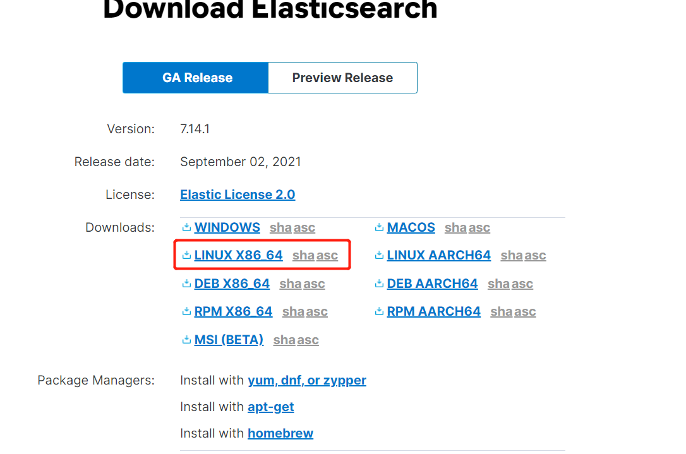
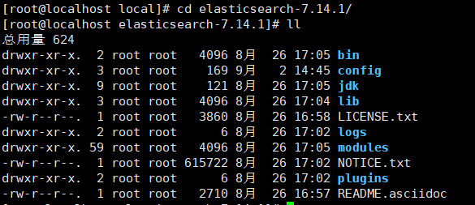
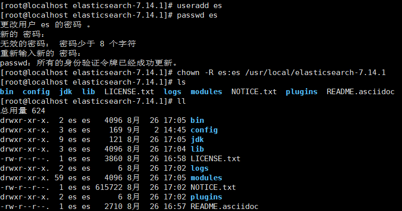
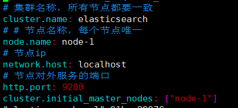
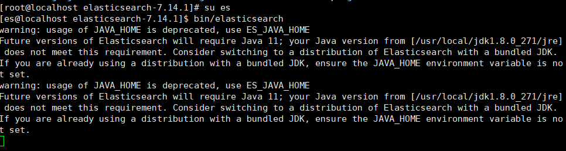
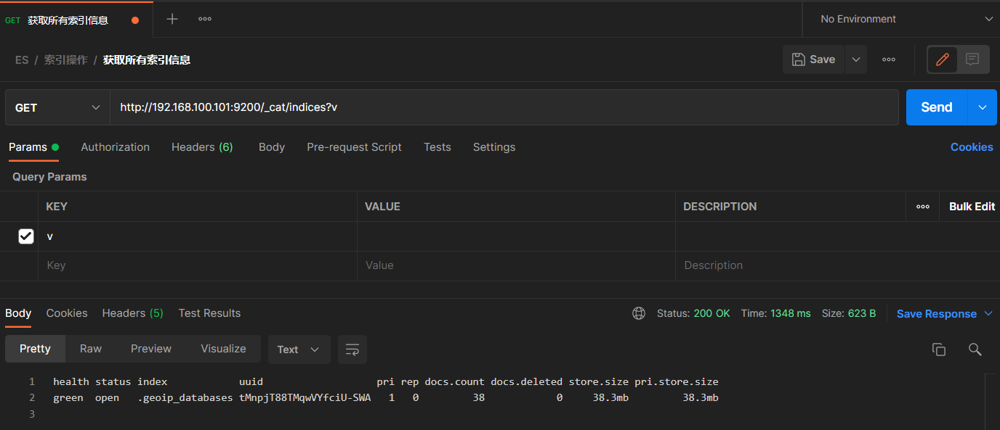
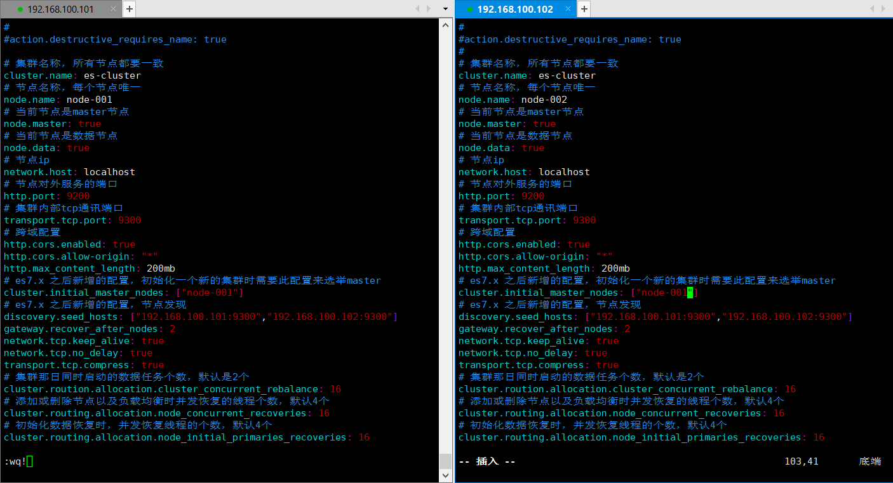
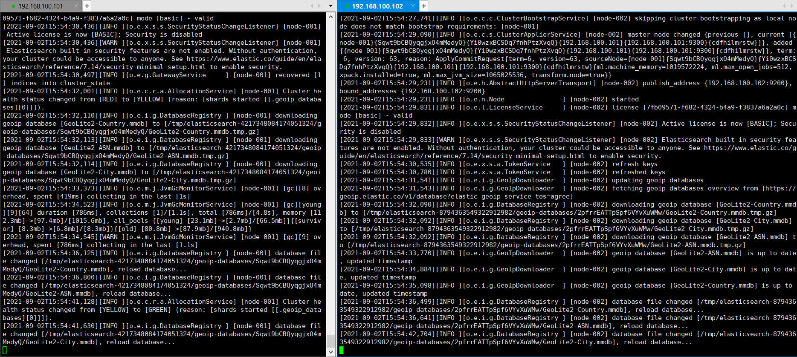
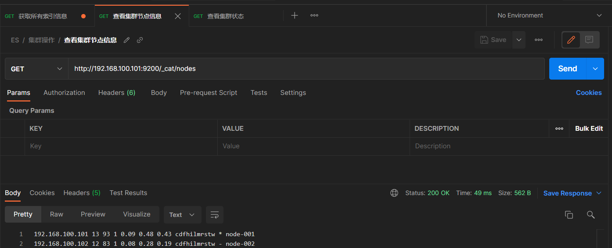
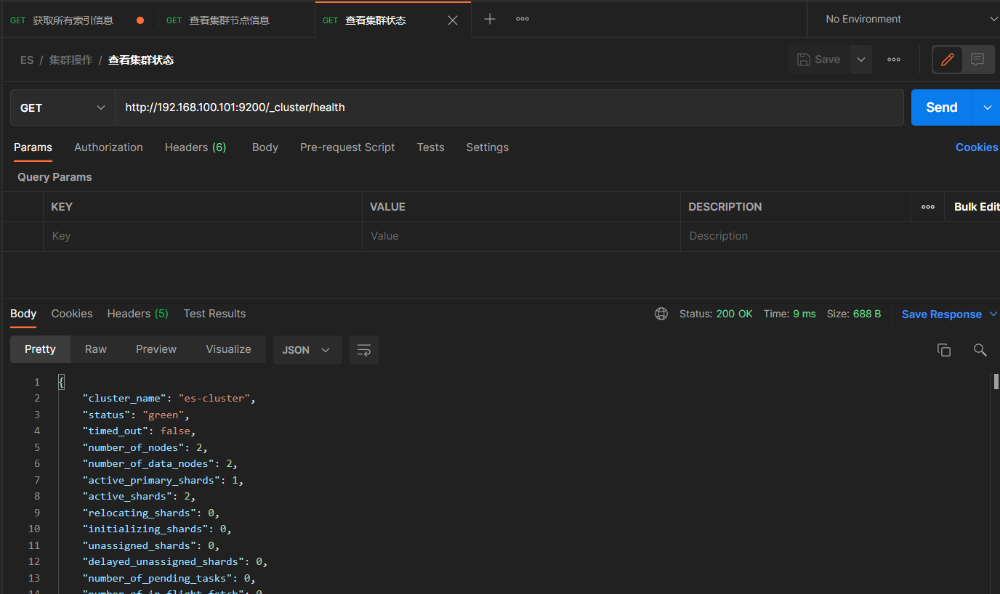

# Linux-Elasticsearch安装

## ES单机部署

> ES全称Elasticsearch，Elasticsearch是一个分布式、RESTful 风格的搜索和数据分析引擎，能够解决不断涌现出的各种用例。 作为 Elastic Stack 的核心，它集中存储您的数据，帮助您发现意料之中以及意料之外的情况，安装也很简单

### 下载安装包

> 从Elasticsearch官网下载安装包：`https://www.elastic.co/cn/downloads/elasticsearch`，选择Linux版本

### 解压安装包

> 将下载好的压缩包上传到Linux中，使用`tar -zxvf elasticsearch-7.14.1-linux-x86_64.tar.gz`完成解压

### 创建用户

> 因为安全问题，Elasticsearch不允许root用户直接运行，所有需要创建新用户

~~~shell
#新增es用户
useradd es
#为es用户设置密码es
passwd es
#修改文件夹所有者是es
chown -R es:es /usr/load/elasticsearch-7.14.1
~~~

### 修改配置文件

#### elasticsearch.yml

> 修改conf下的elasticsearch.yml配置文件，增加如下内容

~~~shell
# 集群名称，所有节点都要一致
cluster.name: elasticsearch
# # 节点名称，每个节点唯一
node.name: node-1
# 节点ip
network.host: localhost
# 节点对外服务的端口
http.port: 9200
cluster.initial_master_nodes: ["node-1"]
~~~

#### 修改Linux系统配置

> 由于elasticsearch进程创建文件数量巨大，Linux是会对进程创建文件数量有所限制，所以需要修改系统进程可以打开的最大文件数限制

##### limits.conf

~~~shell
# 修改limits.conf文件内容
vim /etc/security/limits.conf
# 在limits.conf末尾增加如下内容
es soft nofile 65536
es hard nofile 65536
~~~

##### 20-nproc.conf

~~~shell
# 修改20-nproc.conf文件内容
vim /etc/security/limits.d/20-nproc.conf
# 在20-nproc.conf末尾增加如下内容
es soft nofile 65536
es hard nofile 65536
* hard nproc 4096
~~~

##### sysctl.conf

~~~shell
# 修改sysctl.conf文件内容
vim /etc/sysctl.conf
# 在sysctl.conf末尾增加如下内容
vm.max_map_count=655360
#保存后执行如下命令，重新加载
sysctl -p
~~~

### 启动

> 进入到elasticsearch-7.14.1启动es服务，执行如下命令

~~~shell
# 切换到es用户
su es
# 进入到elasticsearch的目录下
cd /usr/local/elasticsearch-7.14.1/
# 前台启动elasticsearch
bin/elasticsearch
# 后台启动elasticsearch
bin/elasticsearch -d
~~~

### 测试

> 利用Postman查询所有索引

## ES集群部署

> 集群部署前期准备与单机部署系统，也是需要下载安装包、解压安装包、创建用户、修改配置文件，唯一不一样的地方就是修改elasticsearch.yml的方式，所以这里是做elasticsearch.yml配置修改说明

### 修改配置文件

#### node-1

~~~shell
# 集群名称，所有节点都要一致
cluster.name: es-cluster
# 节点名称，每个节点唯一
node.name: node-001
# 当前节点是否参与master选举
node.master: true
# 当前节点是数据节点
node.data: true
# 节点ip
network.host: localhost
# 节点对外服务的端口
http.port: 9200
# 集群内部tcp通讯端口
transport.tcp.port: 9300
# 跨域配置
http.cors.enabled: true
http.cors.allow-origin: "*"
http.max_content_length: 200mb
# es7.x 之后新增的配置，初始化一个新的集群时需要此配置来选举master
cluster.initial_master_nodes: ["node-001"]
# es7.x 之后新增的配置，节点发现
discovery.seed_hosts: ["192.168.100.101:9300","192.168.100.102:9300"]
gateway.recover_after_nodes: 2
network.tcp.keep_alive: true
network.tcp.no_delay: true
transport.tcp.compress: true
# 集群那日同时启动的数据任务个数，默认是2个
cluster.routing.allocation.cluster_concurrent_rebalance: 16
# 添加或删除节点以及负载均衡时并发恢复的线程个数，默认4个
cluster.routing.allocation.node_concurrent_recoveries: 16
# 初始化数据恢复时，并发恢复线程的个数，默认4个
cluster.routing.allocation.node_initial_primaries_recoveries: 16
~~~

#### node-2

> node-2配置与node-1拷过来就行了，只是节点名称修改一下即可

### 启动

> 进入到elasticsearch-7.14.1启动es服务，执行如下命令分别启动2个Linux中的ES

~~~shell
# 切换到es用户
su es
# 进入到elasticsearch的目录下
cd /usr/local/elasticsearch-7.14.1/
# 前台启动elasticsearch
bin/elasticsearch
# 后台启动elasticsearch
bin/elasticsearch -d
~~~

### 测试

> 发送`http://192.168.100.101:9200/_cat/nodes`查看节点信息

> 发送`http://192.168.100.101:9200/_cluster/health`查看集群状态

