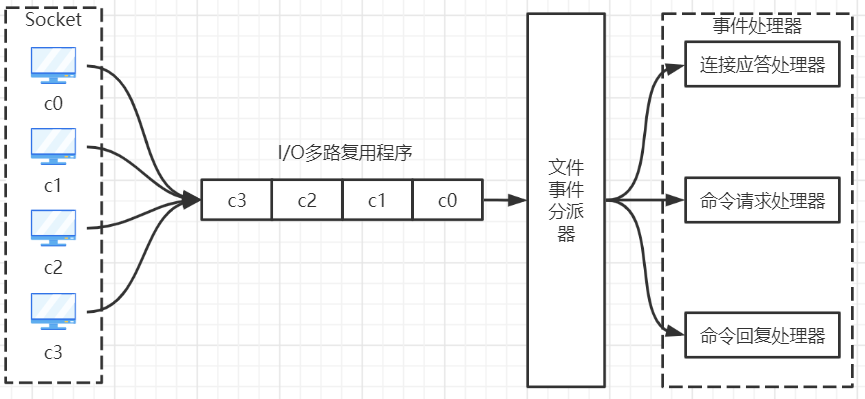
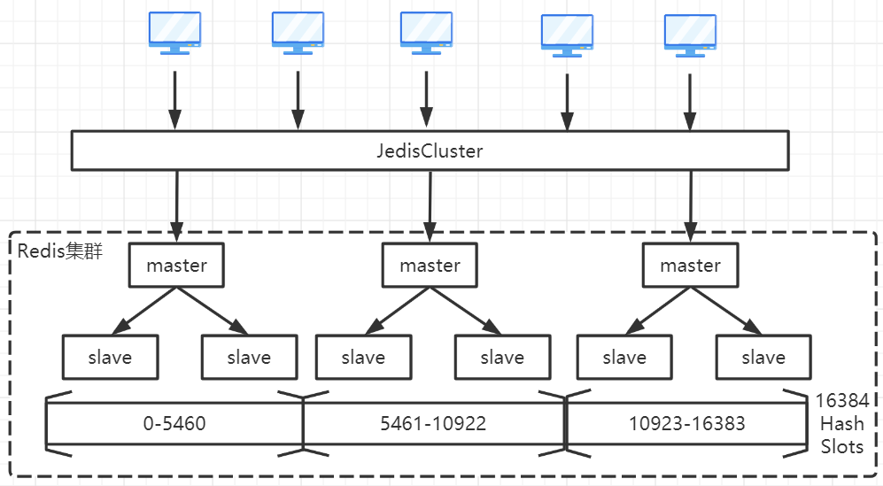
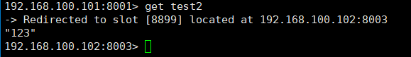
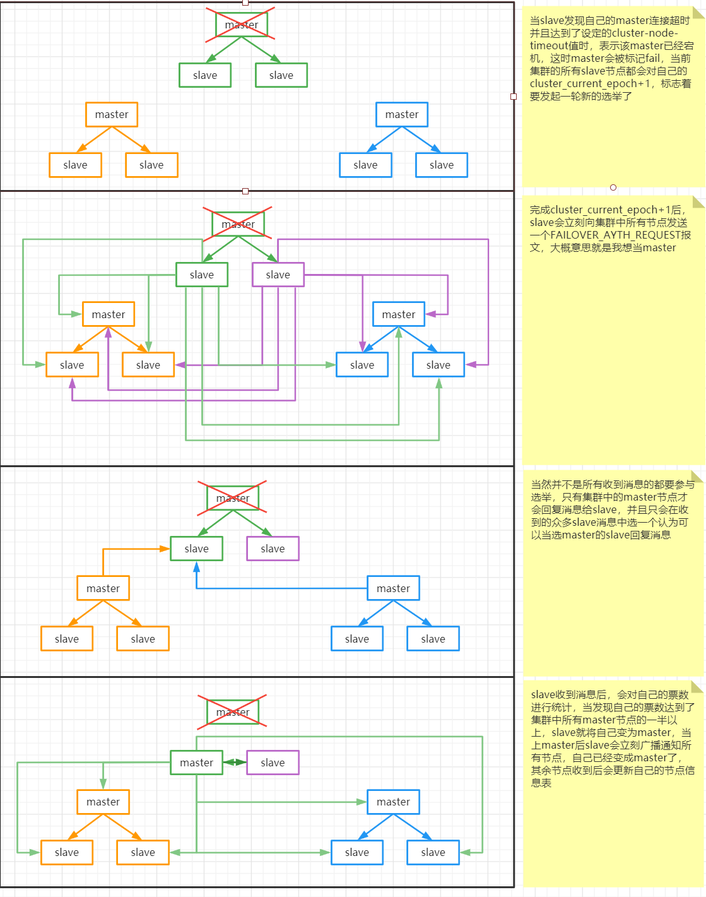
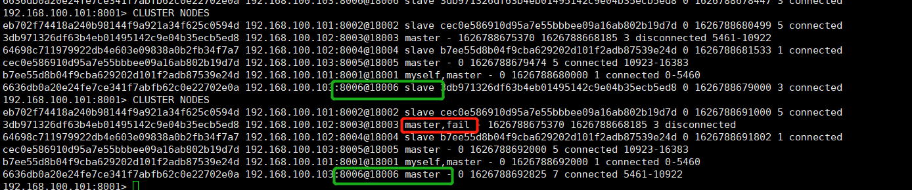

# Redis深入浅出

## 基础入门

> Redis的基础由于之前已经发布过文章了，所以在本专栏就不说， 不过大家可以通过阅读以下文章进行学习，`Redis常用命令是重点，虽然里面将的都是Linux命令，当是在实际开发过程中只是将来这些Linux命令封装成方法而且所以重复理解这些命令后学习学习任何工具类都易如反掌`

[Linux-安装Redis](../Redis专栏/Linux-安装Redis.md)

[Linux-Redis常用命令手册](../Redis专栏/Liunx-RedisCli常用命令手册.md)

## Redis的单线程和高性能

> 一直都说Redis是高性能的分布式缓存，重点在Redis是单线程应用是如何做到高性能的呢，因为它Redis所以数据都是存在与内存中，所以的运算都是内存级别的操作内存中的操作是极快的，并且避免了多线程的切换性能损耗问题，正因为Redis是单线程所以如果使用一些耗时指令会严重影响到Redis的性能如`Keys`，一定要谨慎使用

## Redis多路复用

> 既然是Redis是单线程，那么他是如何处理那么多的并发客户端连接的呢，Redis利用了epoll来实现IO多路复用，将连接信息和事件放到队列中，依次放到文件事件分派器，事件分派器会分发给事件处理器，`Nginx也是采用了IO多路复用解决C10K问题`

## Redis持久化

> Redis持久化分2种RDB与AOR，并且已写好了文章了，这里就不重复说明了，直接贴出文章连接

[Redis持久化](../Redis专栏/Redis持久化.md)

## Redis缓存淘汰策略

> 在一些大型项目或者频繁使用Redis的项目中，可能会出现问题就是Redis使用的内存超出机器的物理内存了，这时内存数据会开始借用磁盘内存与磁盘产生频繁的交换，极大的影响Redis的性能，这时就需要配置缓存淘汰策略

### 淘汰策略配置

~~~shell
# 当Redis使用内存达到xx时启用淘汰策略
maxmemory <bytes>
~~~

**常用的淘汰策略**

| 策略            | 说明                                                         |
| --------------- | ------------------------------------------------------------ |
| noeviction      | 不会继续服务写请求 (DEL 请求可以继续服务)，读请求可以继续进行。这样可以保证不会丢失数据，但是会让线上的业务不能持续进行。这是默认的淘汰策略 |
| volatile-lru    | 尝试淘汰设置了过期时间的 key，最少使用的 key 优先被淘汰，没有设置过期时间的 key 不会被淘汰，这样可以保证需要持久化的数据不会突然丢失 |
| volatile-ttl    | 跟上面一样，除了淘汰的策略不是 LRU，而是 key 的剩余寿命 ttl 的值，ttl 越小越优先被淘汰 |
| volatile-random | 跟上面一样，不过淘汰的 key 是过期 key 集合中随机的 key       |
| allkeys-lru     | 区别于 volatile-lru，这个策略要淘汰的 key 对象是全体的 key 集合，而不只是过期的 key 集合。这意味着没有设置过期时间的 key 也会被淘汰 |
| allkeys-random  | 跟上面一样，不过淘汰的策略是随机的 key                       |

> volatile-xx 策略只会针对带过期时间的key进行淘汰，如果你只是拿Redis做缓存，那应该使用allkeys-xx，客户端些缓存时不必携带过期时间，如果你还想使用Redis持久化功能，那就使用volatile-xx策略，这样可以保留没有设置过期时间的key，它们是永久的key不会给LRU算法淘汰

## Redis集群

### 哨兵模式

> Redis可利用哨兵模式保证Redis高可用以及主备热切换，哨兵模式下Redis永远只有一个Master由于Redis是单线程，所以单台Redis理论最多10W，如果需要更大的并发那么哨兵模式已经无法满足了

[主从复制、哨兵模式](../Redis专栏/Redis主从复制.md)

### 高可用集群模式

> 关于Redis集群的搭建，节点的配置，槽的分配，我另外独立编写了一篇文章说明，可以点击进入阅读该文章

[Redis-集群搭建](../Redis专栏/Redis集群搭建.md)

### Hash槽

> 在创建集群的时候可以看到这样一个参数`slots:[xxx-xxx] (xxx slots) master`这个是什么意思呢，在集群模式下Redis会将所有数据划分为16384个Slots槽位，每一个主节点会负责一部分的槽位
>
> 当客户端于集群建立连接后客户端会得到一份当前Redis集群的所有节点，并且每一个节点管理的槽位范围，需要操作某一个key时客户端会计算该key属于那个槽位然后访问对于的节点

### 跳转重定位

> 当一个客户端在任意一个主节点上发起一个key操作，然后如果当前key所在的槽位不归自己管理，这时会返回一个跳转指令给客户端`Redirected to slot [xxx] located at xxx:xxx`告诉客户端你要操作这个key你需要去到那个节点才能操作
>
> 一般情况使用Jedis这样的工具不会出现这种情况的，但是在节点扩容的情况下有新的节点加入，那边表示旧的槽位分片会被再拆分，这时Jedis客户端保留的是旧的节点于槽位信息对照表，Jedis按照旧的计算发送指令操作可能就会得到服务端返回跳转重定位指令，这样Jedis客户端就会同步最新的节点槽位信息表到本地

### 集群选举流程

> 当集群中的一个master宕机后，达到设定好的超时时长后该master下的所有slave就会发起一个选举，并且只有集群中的master才能参加这次选举，选举规则是拉票拿到票数是集群master数量的一半以上，即可当选master，大概的选举流程如图

