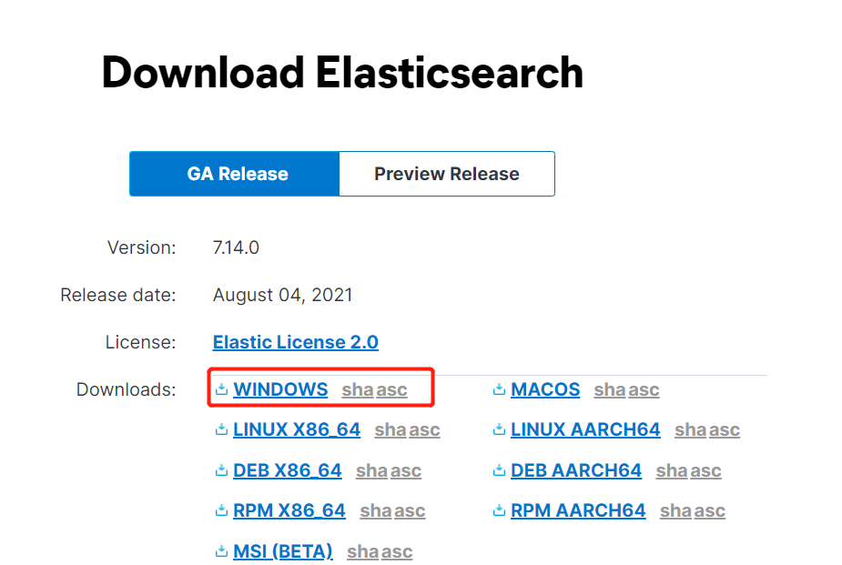
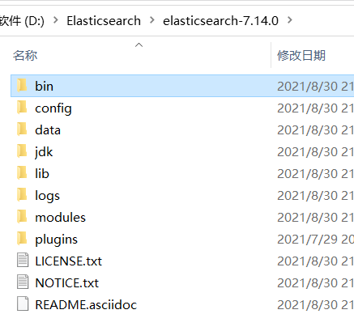
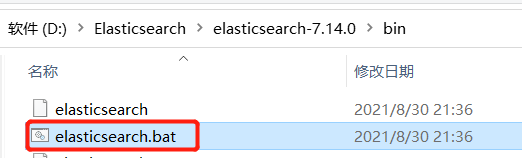
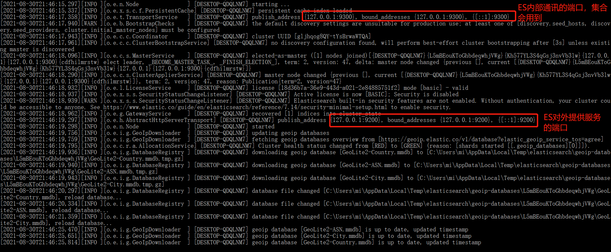
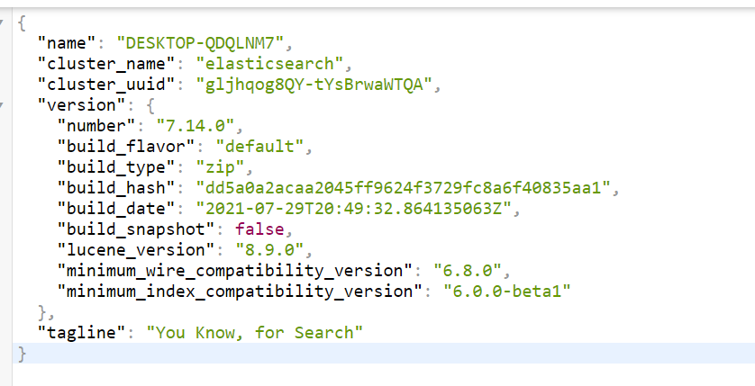
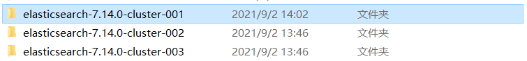
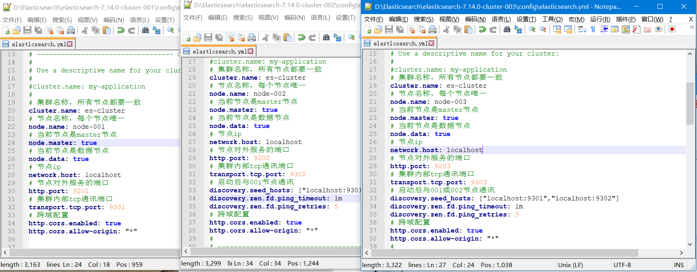
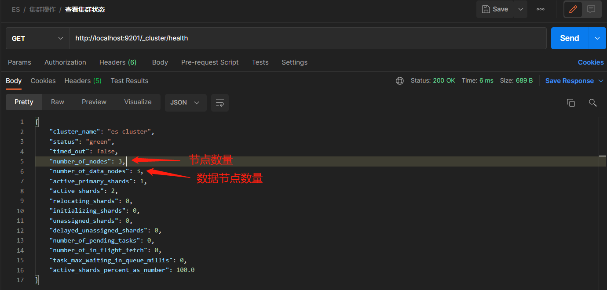

# Win-Elasticsearch安装

## ES单机部署

> ES全称Elasticsearch，Elasticsearch是一个分布式、RESTful 风格的搜索和数据分析引擎，能够解决不断涌现出的各种用例。 作为 Elastic Stack 的核心，它集中存储您的数据，帮助您发现意料之中以及意料之外的情况，安装也很简单

### 下载安装包

> Elasticsearch官网下载安装包：`https://www.elastic.co/cn/downloads/elasticsearch`，选择Win版本

### 解压安装包

> 下载完毕后直接解压

### 启动

> 注意：Elasticsearch最低支持JDK8，如果你所使用的JDK版本低于8并且配置了JAVA_HOME的环境变量，那么着无法正常使用ES，需要更换JDK8以上的版本
>
> 进入到bin目录点击`elasticsearch.bat`启动

> 启动成功后可以看到控制台打印2个端口，一个是ES内部通讯端口，一个是ES对外提供服务的端口

### 测试

> 打开浏览器，直接访问`localhost:9200`，看到如下内容表示ES启动成功

## ES集群部署

> ES的集群部署配置较简单，只需要修改conf下yml即可，首先下载3个ES的安装包并且解压

### 准备个ES

### 修改配置文件

> 修改每个es文件夹下config文件夹中的`elasticsearch.yml`文件，添加如下配置

#### node-1

~~~yml
# 集群名称，所有节点都要一致
cluster.name: es-cluster
# 节点名称，每个节点唯一
node.name: node-001
# 当前节点是否参与master选举
node.master: true
# 当前节点是数据节点
node.data: true
# 节点ip
network.host: localhost
# 节点对外服务的端口
http.port: 9201
# 集群内部tcp通讯端口
transport.tcp.port: 9301
# 跨域配置
http.cors.enabled: true
http.cors.allow-origin: "*"
~~~

#### node-2

~~~yml
# 集群名称，所有节点都要一致
cluster.name: es-cluster
# 节点名称，每个节点唯一
node.name: node-002
# 当前节点是否参与master选举
node.master: true
# 当前节点是数据节点
node.data: true
# 节点ip
network.host: localhost
# 节点对外服务的端口
http.port: 9202
# 集群内部tcp通讯端口
transport.tcp.port: 9302
# 启动后与001节点通讯
discovery.seed_hosts: ["localhost:9301"]
discovery.zen.fd.ping_timeout: 1m
discovery.zen.fd.ping_retries: 5
# 跨域配置
http.cors.enabled: true
http.cors.allow-origin: "*"
~~~

#### node-3

~~~yml
#cluster.name: my-application
# 集群名称，所有节点都要一致
cluster.name: es-cluster
# 节点名称，每个节点唯一
node.name: node-003
# 当前节点是否参与master选举
node.master: true
# 当前节点是数据节点
node.data: true
# 节点ip
network.host: localhost
# 节点对外服务的端口
http.port: 9203
# 集群内部tcp通讯端口
transport.tcp.port: 9303
# 启动后与001或002节点通讯
discovery.seed_hosts: ["localhost:9301","localhost:9302"]
discovery.zen.fd.ping_timeout: 1m
discovery.zen.fd.ping_retries: 5
# 跨域配置
http.cors.enabled: true
http.cors.allow-origin: "*"
~~~

### 启动

> 配置号yml后，按照顺序启动所有的ES服务，启动成功后服务通过Postman发送`http://localhost:9201/_cluster/health`查看集群状态

