# Zookeeper快速入门

## 基本介绍

> 官方介绍：Zookeeper是一个分布式的，开发源码的分布式应用协调服务，是Hadoop和Gbase的重要组件，它是一个为分布式应用提供一致服务的软件，提供的功能包括：配置维护、域名服务、分布式同步、组服务等

## Zookeeper下载

Zookeeper官网下载地址`https://zookeeper.apache.org/releases.html#download`

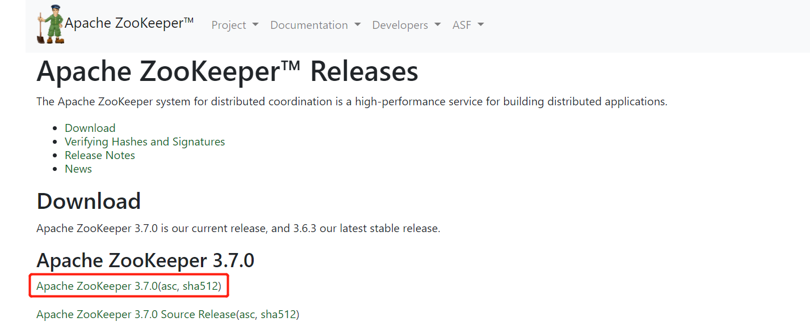

## Zookeeper解压

> tar -zxvf apache-zookeeper-3.7.0-bin.tar.gz

## Zookeeper配置

进入到conf目录下

~~~shell
cd apache-zookeeper-3.7.0-bin/conf/
~~~
#### 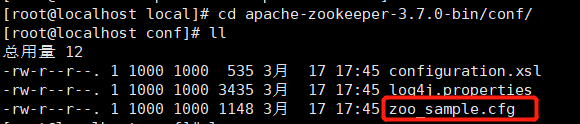
由于Zookeeper启动时需要读取zoo.cfg配置文件，所以需要将zoo_sample.cfg修改为zoo.cf

~~~shell
mv zoo_sample.cfg zoo.cf
~~~

进入到zoo.cf配置文件

~~~shell
vim zoo.cf
~~~

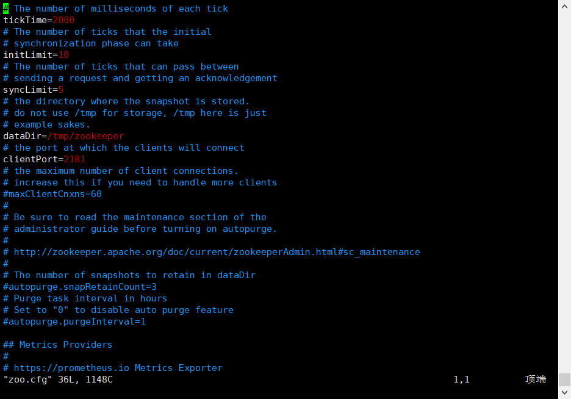

| 参数           | 说明                                                         |
| -------------- | ------------------------------------------------------------ |
| tickTime       | 2000                                                         |
| syncLimit      | Leader和follower之间的通讯时长最长不能超过                   |
| initLimt       | 接受客户端链接zk初始化的最长等待心跳时长                     |
| dataDir        | 数据目录                                                     |
| dataLogDor     | 日志忘记                                                     |
| clientPort     | 客户端连接服务器端口号                                       |
| Server.A=B:C:D | A：第几号服务器；B：服务器IP；C：Leder和follower通讯的端口；D：当C端口挂掉后选举Leder端口号 |
## Zookeeper基本命令

~~~shell
#启动Zookeeper
./zkServer.sh start
#查看Zookeeper状态
./zkServer.sh status
#连接Zookeeper
./zkCli.sh
#暂停Zookeeper
./zkServer.sh stop
~~~

## 单机模式

~~~shell
#进入Zookeeper到bin目录
cd apache-zookeeper-3.7.0-bin/bin/
#启动Zookeeper
./zkServer.sh start
#查看Zookeeper状态
./zkServer.sh status
~~~

Mode：standalone 单机模式

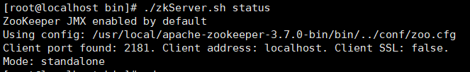

## 集群模式

#### 配置文件修改

准备3台Linux，同时下载与解压了Zookeeper包，并且修改配置文件

~~~shell
#进入Zookeeper到conf目录
cd apache-zookeeper-3.7.0-bin/conf/
#修改配置文件
vim zoo.cfg
~~~

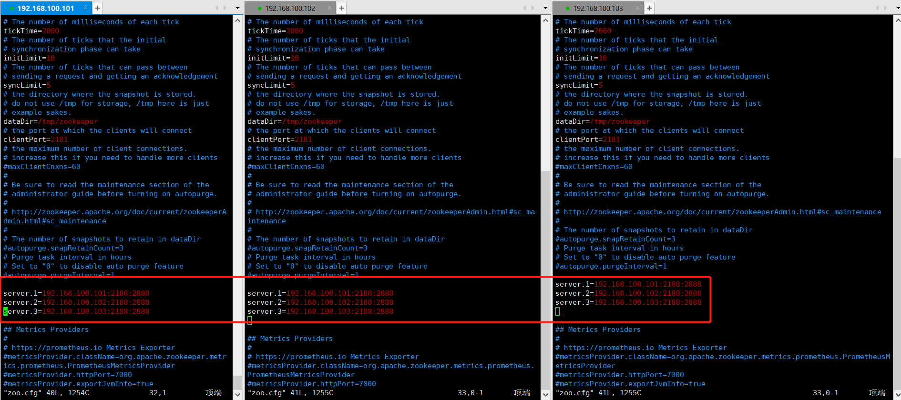

#### 指定Zookeeper的id

> 每一台都需要执行 `echo "你设定的Id" > /tmp/zookeeper/myid`命令指定id，不然集群不生效

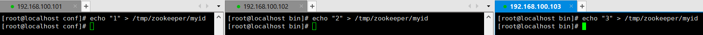

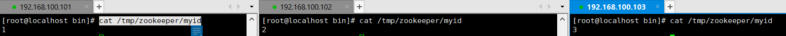

> 若再指定Id时显示，没有这个文件或目录，请按照如下操作先启动一下zookeeper再关闭一下，即可解决这个问题

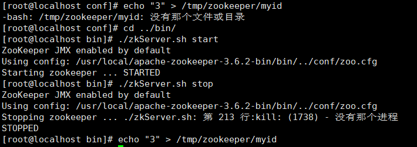

#### 启动Zookeeper

> 使用`./zkServer.sh start`命令分别启动3台Zookeeper，可以发现这3台服务中，有1个leader，2个follower

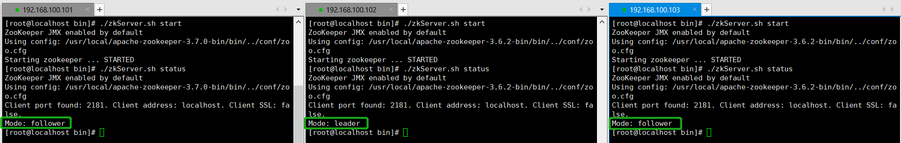

#### 连接Zookeeper集群

~~~shell
#连接集群时需要把所有集群的ip都写上并用”,“分割
./zkCli.sh -server 192.168.100.101:2181,192.168.100.102:2182,192.168.100.103:2181
~~~

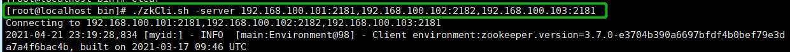

#### 集群中的角色

| 名称     | 作用                                                         |
| -------- | ------------------------------------------------------------ |
| leader   | leader是整个zookeeper集群中的主节点，负责响应所有zookeeper状态变更的请求，它会将每个状态请求进行排序和编号，以保证整个集群內部消息处理的FIFO，`写操作都走leader，leader在集群中只有一个` |
| follower | follower就比较简单，follower主要是帮助leader处理查询，并在leader提交该提议时在本地也进行提交，`只有follower是可以参加新leader的选举、响应leader的提议` |
| observer | observer与follower职责大致一样相同，`observer是不可以参加新leader的选举,observer也不会将事务持久化到磁盘，一旦observer被重启，需求从leader重新同步整个命名空间` |

## Zookeeper客户端命令

| 命令   | 说明                                                  |
| ------ | ----------------------------------------------------- |
| ls     | ls命令查看整个目录包含所有文件                        |
| ls2    | ls2命令与ls类似，不同点就是可以看到比ls更多的文件参数 |
| create | 创建znode，并设置初始内容                             |
| get    | 获取znode的数据                                       |
| set    | 修改znode内容                                         |
| dekete | 删除znode                                             |
| quit   | 退出客户端                                            |
| help   | 帮助命令                                              |
| rmr    | 递归删除，可以删除包含有子节点的                      |

## Zookepper部署常见问题

> 配置文件配置不当会导致服务无法启动一下列举了一些常见的配置文件配置问题

### 端口设置问题

> `Zookepper`集群部署下配置文件中会配置很多的端口，`注意这3个端口不是同一个东西所以不是设置一样会导致无法启动`以下列举各端口的含义
>
> * A：客户端连接服务器端口号
> * B：Leder和follower通讯的端口
> * C：如果Leder和follower无法通讯选举Leder端口号

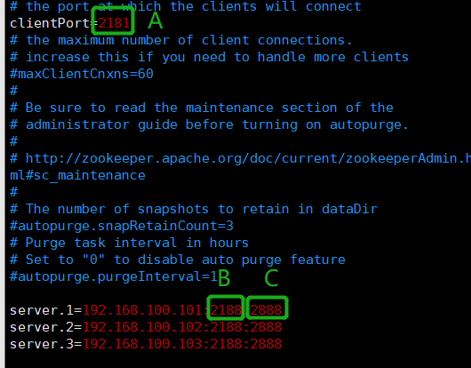

### 集群服务连接

> `连接集群时需要把所有集群的ip都写上并用”,“分割`，如当前有3台Zookepper集群若需要连接集群写法如下，若只写一个IP是无法连接的
~~~shell
./zkCli.sh -server 192.168.100.101:2181,192.168.100.102:2182,192.168.100.103:2181
~~~

