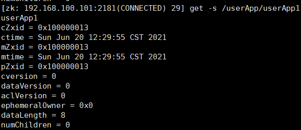
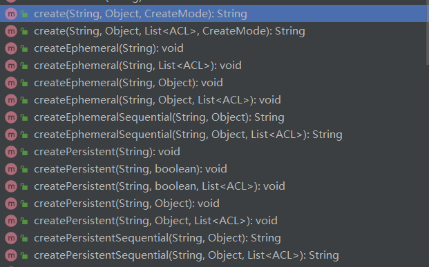

# Zookeeper核心概念

> Zookeeper是什么？
>
> 简单来说Zookeeper和Mysql，Redis一样都是用于存储数据的一个服务，那么Zookeeper有什么特点呢？
>
> Zookeeper是一个典型的分布式数据一致性的解决方案，分布式应用程序可以基于它实现诸如数据发布/订阅、负载均衡、命名服务、分布式协调/通知、集群管理、Master 选举、分布式锁和分布式队列等功能

## Zookeeper的数据结构

> Zookeeper的存储方式与以往我们使用的mysql、redis不一样，Zookeeper存储方式更加像一个文件系统，整个Zookeeper只有一个根节点`/`在存储文件时，就像平时我们使用的文件夹一样，每一个文件夹(节点)会对应着一些数据，每一个文件夹里面也可能还有文件夹(子节点)，并且同一级文件夹的名字是不允许重复的

## Zookeeper简单使用

> 首先使用简单的命令`creat、ls、get`，对Zookeeper进行节点创建
>
> `create(创建节点) /userApp(节点名称) userApp(该节点对应保存的数据)，ls /userApp(查看/userApp节点下的子节点)`

## znode

> Zookeeper操作和维护的一个个数据节点，称为znode，经过上面我们执行的`create`命令后Zookeeper中最终的数据结构如下，可以看出我们创建的每一个文件夹都是一个节点

## znode的类型

> znode共有4种类型：持久无序、临时无序、持久有序、临时有序

| 属性                  | 命令       | 说明                                                         |
| --------------------- | ---------- | ------------------------------------------------------------ |
| PERSISTENT(默认)      | create     | 持久无序类型，创建的节点需手动删除否则一直存在               |
| PERSISTENT_SEQUENTIAL | create -s  | 持久有序类型，创建节点也需要手动删除，并且创建的节点会自动在后面加上一个自增序号 |
| EPHEMERAL             | create -e  | 临时无序的，创建节点客户端在session失效就会自动删除节点，没有子节点 |
| EPHEMERAL_SEQUENTIAL  | create -es | 临时有序的，创建节点客户端session失效就会删除节点，并且创建的节点会自动在后面加上一个自增序号 |

## Stat数据结构

> Stat中记录这个Znode的3个数据版本信息
>
> 通过`get -s`命令可以获取节点状态信息、版本、权限相关

| 属性        | 说明                                   |
| ----------- | -------------------------------------- |
| cZxid       | 节点创建时的zxid(在整个集群中是唯一的) |
| ctime       | 节点创建时的时间戳                     |
| mZxid       | 节点最新一次更新发生时的zxid           |
| mtime       | 节点最新一次更新发生的时间戳           |
| cversion    |  其子节点的更新次数                                      |
| dataVersion | 节点数据的更新次数                     |
| aclVersion | 节点的ACL(授权信息)的更新次数                     |
| ephemeralOwner | 如果节点是EPHEMERAL(临时节点)，ephemeralOwner的值表示该节点绑定的sessionId如果该节点不是EPHEMERAL=0               |
| dataLength | 节点数据的字节数                    |
| numChildren | 子节点个数                   |

**更新节点内容查看Stat的变化**

## Session会话

> 每一个客户端与Zookeeper建立的是TCP/IP长连接，客户端的连接有3种状态，分别是连接中、连接成功、断开连接

| 状态       | 说明     |
| ---------- | -------- |
| CONNECTING | 连接中   |
| CONNECTED  | 连接成功 |
| CLOSED     | 断开连接 |

## watcher事件监听器

> Watcher(事件监听器)，是Zookeeper中一个很重要的特性，Zookeeper允许用户在指定的znod(节点)上注册一些Wathcher，并且在一些特定事件触发的时候，Zookeeper服务端会将事件通知到感兴趣的客户端上面，该机制是Zookeeper实现分布式协调服务的重要特性

**事件类型**

| KeeperState      | EventType         | 触发条件                                                     | 说明                                                         | 操作                                                   |
| ---------------- | ----------------- | ------------------------------------------------------------ | ------------------------------------------------------------ | ------------------------------------------------------ |
| SyncConnected(3) | None(-1)          | 客户端与服务端成功建立连接                                   | 此时客户端和服务器处于连接状态                               |                                                        |
| SyncConnected(3) | NodeCreated(1)    | 数据节点被创建                                               | 此时客户端和服务器处于连接状态                               | create /xxx                                            |
| SyncConnected(3) | NodeDeleted(2)    | 数据节点被删除                                               | 此时客户端和服务器处于连接状态                               | delete /xxx                                            |
| SyncConnected(3) | NodeDataChang(3)  | 数据节点被修改                                               | 此时客户端和服务器处于连接状态                               | set /xxx                                               |
| SyncConnected(3) | NodeChildChang(4) | 数据节点的子节点列表发送改变                                 | 此时客户端和服务器处于连接状态                               | create /xxx/xxx set /xxx/xxx delete /xxx/xxx |
| Disconnect(0)    | Node(-1)          | 客户端与Zookeeper服务断开连接                                | 此时客户端与服务器处于断开连接状态                           |                                                        |
| Expired(-112)    | Node(-1)          | 会话超时                                                     | 此时客户端会话失效，通常同时也会收到SessionExpiredException异常 |                                                        |
| AuthFailed(4)    | None(-1)          | 通常有2种情况 1、使用错误的schema进行权限检查  2、SASL权限检查失效 | 通常同时也会收到AuthFailedException异常                      |                                                        |

## ACL访问控制

> ACL(Access Control List)，对节点进行认证授权，那些节点访问需要认证，对那些节点操作需要权限

### 认证类型

| 类型        | 说明                                                         |
| ----------- | ------------------------------------------------------------ |
| world(默认) | 所有客户端都可以访问                                         |
| auth        | 认证通过的用户才能访问`cli中使用 addauth digest user:pwd`来添加授权用户 |
| digest      | 通过`用户名:密码`这种方式认证，这也是业务系统最常用的        |
| ip          | 使用IP地址认证                                               |

### 权限类型

| 类型   | 说明                       |
| ------ | -------------------------- |
| CREATE | 能创建子节点               |
| READ   | 能获取节点数据和列出子节点 |
| WRITE  | 能设置节点数据             |
| DELETE | 能删除子节点               |
| ADMIN  | 能设置权限                 |

### 查看认证类型与权限类型

> `'world,'anyone`：所有客户端都可以访问
>
> `: cdrwa`：所有权限都可以操作(cdrwa对应权限各类型首字母)

## 实战练习

> 刚刚演示的都是在Liunx上使用命令行对Zookeeper进行操作，那么接下来实战练习使用的是java客户端连接Zookeeper并且进行相应的操作

### 原生API

> 使用Zookeeper原生的API完成CRUD

#### 依赖引入

~~~xml
<dependency>
    <groupId>org.apache.zookeeper</groupId>
    <artifactId>zookeeper</artifactId>
    <version>3.4.9</version>
</dependency>
~~~

#### 增删改查

##### ZookeeperCrud

> 首先是最简单的CRUD

~~~java
public class ZookeeperCrud {

    private String connectString="192.168.100.101:2181";
    private ZooKeeper zooKeeper;

    /**
     * 建立连接
     */
    public ZookeeperCrud() {
        try {
            this.zooKeeper = new ZooKeeper(connectString,5000,new ZookeeperWatcher());
        } catch (IOException e) {
            e.printStackTrace();
        }
    }

    /**
     * 创建一个持久无序、无权限控制节点
     * @param path 路径
     * @param data 数据
     * @return
     */
    public String createPersistent(String path,String data){
        try {
            return zooKeeper.create(path,data.getBytes(), ZooDefs.Ids.OPEN_ACL_UNSAFE, CreateMode.PERSISTENT);
        } catch (KeeperException e) {
            e.printStackTrace();
        } catch (InterruptedException e) {
            e.printStackTrace();
        }
        return null;
    }

    /**
     * 创建一个临时无序、无权限控制节点
     * @param path 路径
     * @param data 数据
     * @return
     */
    public String createEphemeral(String path,String data){
        try {
            return zooKeeper.create(path,data.getBytes(), ZooDefs.Ids.OPEN_ACL_UNSAFE, CreateMode.EPHEMERAL);
        } catch (KeeperException e) {
            e.printStackTrace();
        } catch (InterruptedException e) {
            e.printStackTrace();
        }
        return null;
    }

    /***
     * 更新信息
     * @param path
     * @return
     * @throws KeeperException
     * @throws InterruptedException
     */
    public String getData(String path) throws KeeperException, InterruptedException {
        byte data[] = zooKeeper.getData(path,false,null);
        data = (data == null)? "null".getBytes() : data;
        return new String(data);
    }

    /***
     * 更新信息
     * @param path
     * @param data
     * @return
     * @throws KeeperException
     * @throws InterruptedException
     */
    public Stat setData(String path, String data) throws KeeperException, InterruptedException {
        return zooKeeper.setData(path, data.getBytes(), -1);
    }

    /***
     * 是否存在
     * @param path
     * @return
     * @throws KeeperException
     * @throws InterruptedException
     */
    public Stat exists(String path) throws KeeperException, InterruptedException {
        return zooKeeper.exists(path,false);

    }

    /***
     * 删除
     * @param path
     * @return
     * @throws KeeperException
     * @throws InterruptedException
     */
    public void delete(String path) throws KeeperException, InterruptedException {
        zooKeeper.delete(path,-1);
    }
    /***
     * 删除 递归
     * @param path
     * @return
     * @throws KeeperException
     * @throws InterruptedException
     */
    public void deleteRecursive(String path) throws KeeperException, InterruptedException {
        ZKUtil.deleteRecursive(zooKeeper, path);
    }

    /**
     * 隔壁客户端连接
     * @throws InterruptedException
     */
    public void close() throws InterruptedException {
        zooKeeper.close();
    }
}
~~~

##### ZookeeperCrudTest

> 编写测试类，报错信息是由于没有设置监听器而提示的空指针占时忽略，现在关注的是能不能完成CRUD操作，可以看到添加了一个节点并且打印了节点内容

#### 事件监听

##### ZookeeperWatcher

> ZookeeperWatcher对原来的ZookeeperCrud进行增强，实现了事件监听，并且可以设置事件监听

~~~java
public class ZookeeperWatcher implements Watcher {

    private String connectString="192.168.100.101:2181";
    private ZooKeeper zookeeper;

    public ZookeeperWatcher() {
        try {
            this.zookeeper = new ZooKeeper(connectString, 5000,this);
        } catch (Exception e) {
            e.printStackTrace();
        }
    }

    /***
     * 创建持久节点
     * @param path
     * @param data
     * @return
     */
    public String createPersistent(String path,String data){
        try {
            return  zookeeper.create(path, data.getBytes(), ZooDefs.Ids.OPEN_ACL_UNSAFE, CreateMode.PERSISTENT);
        } catch (KeeperException e) {
            e.printStackTrace();
        } catch (InterruptedException e) {
            e.printStackTrace();
        }
        return  null;
    }

    /***
     * 创建临时节点
     * @param path
     * @param data
     * @return
     */
    public String createEphemeral(String path,String data){
        try {
            return  zookeeper.create(path, data.getBytes(), ZooDefs.Ids.OPEN_ACL_UNSAFE, CreateMode.EPHEMERAL);
        } catch (KeeperException e) {
            e.printStackTrace();
        } catch (InterruptedException e) {
            e.printStackTrace();
        }
        return  null;
    }
    
    /***
     * 删除
     * @param path
     * @return
     * @throws KeeperException
     * @throws InterruptedException
     */
    public void delete(String path) throws KeeperException, InterruptedException {
        zookeeper.delete(path,-1);
    }
    /***
     * 删除
     * @param path
     * @return
     * @throws KeeperException
     * @throws InterruptedException
     */
    public void deleteRecursive(String path) throws KeeperException, InterruptedException {
        ZKUtil.deleteRecursive(zookeeper, path);
    }

    public void close() throws InterruptedException {
        zookeeper.close();
    }
    
    //新增方法如下====================================================================================

    /***
     * 更新信息
     * @param path
     * @return
     * @throws KeeperException
     * @throws InterruptedException
     */
    public String getData(String path,boolean watcher) throws KeeperException, InterruptedException {
        byte data[] = zookeeper.getData(path,watcher,null);
        data = (data == null)? "null".getBytes() : data;
        return new String(data);
    }

    /***
     * 更新信息
     * @param path
     * @param data
     * @return
     * @throws KeeperException
     * @throws InterruptedException
     */
    public Stat setData(String path, String data) throws KeeperException, InterruptedException {
        return zookeeper.setData(path, data.getBytes(), -1);
    }

    /***
     * 是否存在
     * @param path
     * @return
     * @throws KeeperException
     * @throws InterruptedException
     */
    public Stat exists(String path,boolean watcher) throws KeeperException, InterruptedException {
        return zookeeper.exists(path,watcher);

    }

    @Override
    public void process(WatchedEvent event) {
        // 连接状态
        Event.KeeperState keeperState = event.getState();
        // 事件类型
        Event.EventType eventType = event.getType();
        // 受影响的path
        String path = event.getPath();

        System.out.println("连接状态:"+keeperState+",事件类型："+eventType+",受影响的path:"+path);
        System.out.println("--------------------");
        if (Event.EventType.None.equals(eventType)){

        }

        try {
            if(null != path && null != this.exists(path,true)) {
                System.out.println("内容:"+ this.getData(path, true));
            }
        } catch (Exception e) {
            e.printStackTrace();
        }

    }
}
~~~

##### ZookeeperWatcherTest

> 设置监听节点，当节点发送改变时会触发事件

#### 权限控制

##### ZookeeperAcl

> ZookeeperWatcher对原来的ZookeeperAcl进行增强，增加了可以创建需要权限控制的节点

~~~java
public class ZookeeperAcl {

    private String connectString = "192.168.100.101:2181";
    private ZooKeeper zooKeeper;
    /**
     * 认证类型
     */
    final static String scheme = "digest";
    final static String auth = "jolyoulu:123";//用户名:密码

    /**
     * 创建连接
     * @param acl 是否开启认证
     */
    public ZookeeperAcl(boolean acl) {
        try {
            this.zooKeeper = new ZooKeeper(connectString, 5000, null);
            if (acl){
                zooKeeper.addAuthInfo(scheme, auth.getBytes());//给当前客户端添加认证信息
            }
        } catch (Exception e) {
            e.printStackTrace();
        }
    }
    
    //新增方法===================================================================
    /***
     * 创建持久节点
     * @param path
     * @param data
     * @return
     */
    public String createPersistentAcl(String path, String data) {
        try {
            return zooKeeper.create(path, data.getBytes(), ZooDefs.Ids.CREATOR_ALL_ACL, CreateMode.PERSISTENT);
        } catch (KeeperException e) {
            e.printStackTrace();
        } catch (InterruptedException e) {
            e.printStackTrace();
        }
        return null;
    }
    //新增方法===================================================================

    /***
     * 创建持久节点
     * @param path
     * @param data
     * @return
     */
    public String createPersistent(String path, String data) {
        try {
            return zooKeeper.create(path, data.getBytes(), ZooDefs.Ids.OPEN_ACL_UNSAFE, CreateMode.PERSISTENT);
        } catch (KeeperException e) {
            e.printStackTrace();
        } catch (InterruptedException e) {
            e.printStackTrace();
        }
        return null;
    }

    /***
     * 创建临时节点
     * @param path
     * @param data
     * @return
     */
    public String createEphemeral(String path, String data) {
        try {
            return zooKeeper.create(path, data.getBytes(), ZooDefs.Ids.OPEN_ACL_UNSAFE, CreateMode.EPHEMERAL);
        } catch (KeeperException e) {
            e.printStackTrace();
        } catch (InterruptedException e) {
            e.printStackTrace();
        }
        return null;
    }

    /***
     * 更新信息
     * @param path
     * @return
     * @throws KeeperException
     * @throws InterruptedException
     */
    public String getData(String path) throws KeeperException, InterruptedException {
        byte data[] = zooKeeper.getData(path, false, null);
        data = (data == null) ? "null".getBytes() : data;
        return new String(data);
    }

    /***
     * 更新信息
     * @param path
     * @param data
     * @return
     * @throws KeeperException
     * @throws InterruptedException
     */
    public Stat setData(String path, String data) throws KeeperException, InterruptedException {
        return zooKeeper.setData(path, data.getBytes(), -1);
    }

    /***
     * 是否存在
     * @param path
     * @return
     * @throws KeeperException
     * @throws InterruptedException
     */
    public Stat exists(String path) throws KeeperException, InterruptedException {
        return zooKeeper.exists(path, false);

    }

    /***
     * 删除
     * @param path
     * @return
     * @throws KeeperException
     * @throws InterruptedException
     */
    public void delete(String path) throws KeeperException, InterruptedException {
        zooKeeper.delete(path, -1);
    }

    /***
     * 删除
     * @param path
     * @return
     * @throws KeeperException
     * @throws InterruptedException
     */
    public void deleteRecursive(String path) throws KeeperException, InterruptedException {
        ZKUtil.deleteRecursive(zooKeeper, path);
    }

    public void close() throws InterruptedException {
        zooKeeper.close();
    }

}
~~~

##### ZookeeperAclTest

> 创建带权限控制的节点后，其它没有权限的客户端无法获取到节点信息

### ZkClientAPI

> ZkClient是对Zookeeper原生的API进一步分装，更加容易的使用，dubbo的是通过ZkClient操作Zookeeper的
>
> github仓库：`https://github.com/sgroschupf/zkclient.git`

#### 依赖引入

~~~xml
<dependency>
    <groupId>org.apache.zookeeper</groupId>
    <artifactId>zookeeper</artifactId>
    <version>3.4.9</version>
</dependency>
<!-- https://mvnrepository.com/artifact/com.101tec/zkclient -->
<dependency>
    <groupId>com.101tec</groupId>
    <artifactId>zkclient</artifactId>
    <version>0.11</version>
</dependency>
~~~

#### 快速上手

> ZkClient使用起来也很简单，直接通过构造方法获取即可，并且也提供了多种的构造方法，如设置session超时，连接超时，序列化方式等，以下是简单的使用

#### 增删改查

> 以`create`开头的方法都是创建节点，并且传参数的方式有多种，对象、容器等都可以``

> 以`delete`开头的方法都是删除节点

> 以`write`开头的方法都是修改节点

> 以`read`开头的方法都是读取节点内容

#### 事件监听

> ZkChild将来事件分为3类`ChildListener、DataListener、StateListener`

| 接口类           | 注册监听的方法                                               | 解除监听的方法                                               | 说明                     |
| ---------------- | ------------------------------------------------------------ | ------------------------------------------------------------ | ------------------------ |
| IZkChildListener | subscribeChildChanges(String path, IZkChildListener listener) | unsubscribeChildChanges(String path, IZkChildListener childListener) | 监听当前节点子节点的变化 |
| IZkDataListener  | subscribeDataChanges(String path, IZkDataListener listener)  | unsubscribeDataChanges(String path, IZkDataListener dataListener) | 监听当前节点发送的变化   |
| IZkStateListener | subscribeStateChanges(final IZkStateListener listener)       | unsubscribeStateChanges(IZkStateListener stateListener)      | 监听连接状态             |
|                  |                                                              | unsubscribeAll()                                             | 解除所有监听器           |

##### ZkClientWatcher

> 运行测试，发现事件能成功触发，每执行完需要让线程休息一下，是为了让回调函数执行完毕，否则监听的回调未执行完毕然后又执行了下一个操作回调函数是不会被触发的，大家可以删除几个sleep看一下，会发现如果2次操作相隔太近不会触发回调

### CuratorAPI

> Curator是由Apache开源的，现在已经是apache的顶级开源项目了，Curator使用起来更加的灵活已经有更加丰富的功能，如链式调用、分布式锁、自动重连、队列等
>
> Curator和原生的Zookeeper操作很像

#### 依赖引入

~~~xml
<dependency>
    <groupId>org.apache.zookeeper</groupId>
    <artifactId>zookeeper</artifactId>
    <version>3.4.9</version>
</dependency>
<!-- curator 基础框架 -->
<dependency>
    <groupId>org.apache.curator</groupId>
    <artifactId>curator-framework</artifactId>
    <version>5.1.0</version>
</dependency>
<!-- curator 分布式锁、队列等 -->
<dependency>
    <groupId>org.apache.curator</groupId>
    <artifactId>curator-recipes</artifactId>
    <version>5.1.0</version>
</dependency>
<!-- 客户端重试策略 -->
<dependency>
    <groupId>org.apache.curator</groupId>
    <artifactId>curator-client</artifactId>
    <version>5.1.0</version>
</dependency>
~~~

#### 增删改查

##### CuratorCrud

~~~java
public class CuratorCrud {

    public CuratorFramework cf;

    public CuratorCrud() {
        //自动重连设置 初试时间1S，重试10次
        ExponentialBackoffRetry retry = new ExponentialBackoffRetry(1000, 10);
        cf = CuratorFrameworkFactory.builder()
                .connectString("192.168.100.101:2181")
                .sessionTimeoutMs(5000)
                .retryPolicy(retry)
                .build();
        cf.start();
    }

    /**
     * 创建一个无序持久节点
     * @param path
     * @param data
     * @return
     */
    public String createPersistent(String path,String  data){
        try {
            cf.create().creatingParentsIfNeeded().withMode(CreateMode.PERSISTENT).forPath(path,data.getBytes());
        } catch (Exception e) {
            e.printStackTrace();
        }

        return  null;
    }

    /**
     * 获取节点数据
     * @param path
     * @return
     */
    public String getData(String path){
        try {
            return new String(cf.getData().forPath(path));
        } catch (Exception e) {
            e.printStackTrace();
        }
        return  null;
    }

    /**
     * 删除节点
     * @param path
     */
    public void delete(String path){
        try {
            cf.delete().guaranteed().deletingChildrenIfNeeded().forPath(path);
        } catch (Exception e) {
            e.printStackTrace();
        }

    }

    /**
     * 修改节点
     * @param path
     * @param data
     */
    public void setData(String path,String  data){
        try {
            cf.setData().forPath(path,data.getBytes());
        } catch (Exception e) {
            e.printStackTrace();
        }
    }
}
~~~

##### CuratorCrudTest

#### 事件监听

> 事件监听其实和原生的Zookeeper操作差不多，也是传入的是Watcher

## Zookeeper应用思路

### 分布式配置中心

> 什么是分布式配置中心？
>
> 随着我们的[微服务的演变-架构学习笔记31](https://blog.csdn.net/weixin_44642403/article/details/113743466)到最后每一个业务都被拆分成多个服务，随着服务的增多随之而来的那就是服务的管理，以及数据一致性的问题，比如某天突然需要修改mysql配置，那么这里带来问题如果我们有100台服务那么岂不是要修改100个配置文件重启100次，`这时就需要一个分布式配置中心，Zookeeper是一个很好的解决方案`
>
> 1. Zookeeper数据结构特性，可将来相同类型配置存放一起
> 2. Zookeeper的Watcjer(监听机制）能够解决服务之间数据一致性问题
> 3. 每个服务连接上Zookeeper获取整服务配置列表保存到本地，预防极端情况下整个Zookeeper宕机后也可以去本地服务列表获取相应服务保证高可用

### 分布式锁

> 利用Zookeeper的znode节点特性可以实现分布式锁，由于znode是不允许重复名称的那么表示如果有别的应用创建了该节点，其它应用想创建同一个节点时就会报错，那么利用这个特点就可以实现分布式锁，执行完毕后使用`delete`释放锁即可

### 分布式服务注册于订阅

> 什么是分布式服务注册于发现？
>
> 随着我们的[微服务的演变-架构学习笔记31](https://blog.csdn.net/weixin_44642403/article/details/113743466)到最后每一个业务都被拆分成多个服务，随着服务的增多随之而来的那就是那些服务能够正常访问、那些服务不能正常访问、我们当前有多少服务等问题，`这时就需要一个分布式服务注册于订阅，Zookeeper是一个很好的解决方案`
>
> 1. Zookeeper数据结构特性，可将来相同类型服务存放一起
> 2. Zookeeper的Watcjer(监听机制）若有服务宕机失去连接后zookeeper会通知订阅者

