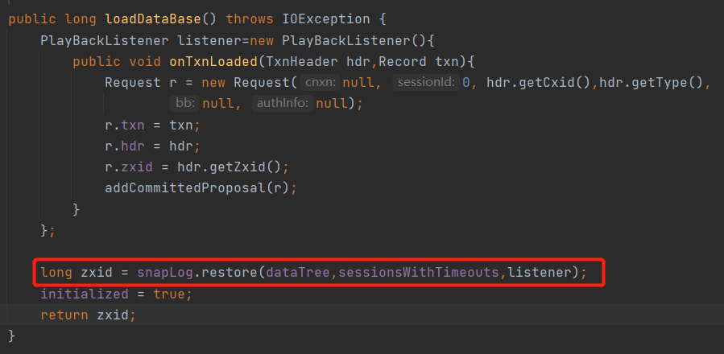
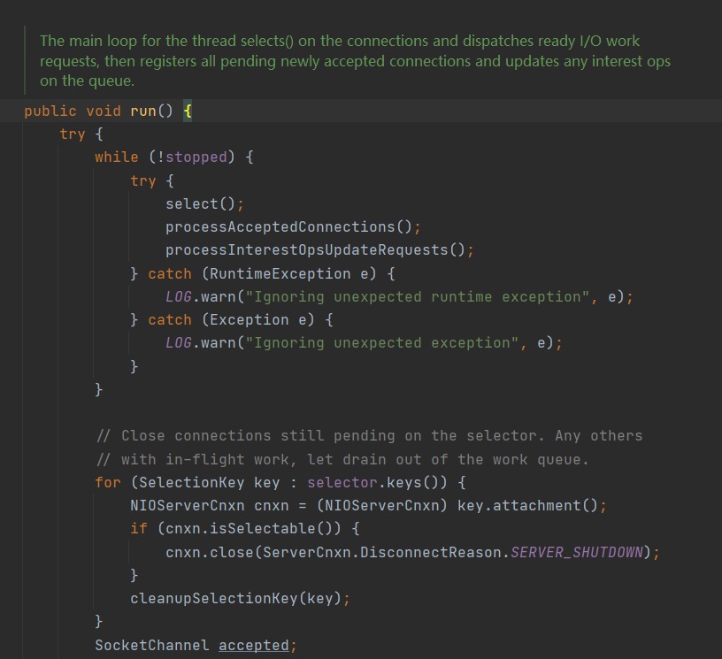

# Zookeeper高级

## 服务端的启动

### 查找启动类

> 要想了解一个应用的原理，那么我们首先要知道这个应用的启动类Main方法再那，Zookeeper的启动再Liunx是通过`zkServer.sh`脚本启动的，几乎所有JAVA编写的服务启动脚本通过`vim zkServer.sh`可以再里面找到一个ZOOMAIN参数这个就是服务启动会调用的Main方法

> 还有一种方法就是使用`jsp`命令可以查看到所有在运行的java进程的进程ID以及入口方法

### 启动流程

> Zookeeper的启动流程缩略版如下

#### QuorumPeerMain#main

> QuorumPeerMain#main是Zookeeper服务端程序启动的一个入口，可以看到方法中就中调用了一个`main.initializeAndRun(args);`方法即初始化与运行

#### QuorumPeerMain#initializeAndRun

> 进入到initializeAndRun方法后，首先会先去读取配置文件信息加载到`QuorumPeerConfig`对象中，然后启动定时清理日志的一个任务，接下来从配置文件中的servers配置判断是不是集群启动，并且执行相应的启动方法

#### QuorumPeerMain#runFromConfig

> 集群启动会进入runFromConfig方法在该方法中，首先会获取相关的网络配置对象，并且将来配置文件相关配置加载到`QuorumPeer`对象中，最后调用start()准备启动

#### QuorumPeer#start

> 在调用`quorumPeer.start();`最后进入的是`QuorumPeer#start`可以看到这个方法是一个同步代码块，在这同步代码块中分别做了加载数据=>启动网络=>选举=>真正的启动

##### 数据库加载

> Zookeeper到底使用的什么保存数据呢，这里就给大家揭晓，首先肯定用的不是mysql哈哈
>
> 进入`loadDataBase()`方法中可以看到一个`zkDb.loadDataBase();`

> 进入到loadDataBase方法内部，可以看到启动时会去读取快照和日志来恢复数据库数据，这里注意`dataTree`对象

> 进入到DataTree对象中，可以看到一个nodes属性类型是`ConcurrentHashMap`一个线程安全的Map这个就是Zookeeper保存数据的map了

> 临时节点着需要关联到这个map中，key是session，set中则是节点key，当session断线了后会根据session将来所有临时节点清理，具体执行过程可以看`DataTree#killSession`方法

##### 网络启动

> `cnxnFactory.start();`进入后发现cnxnFactory是一个抽象类，那么方法最终会调用到他的2子类实现

> 默认使用的是`NIOServerCnxnFactory#start`，由于该类的父类继承了Thread类，所以这里的start方法那么执行的肯定是run方法，我们直接去找run方法

> 最后这里就是NIO编程了，创建选择器，轮询选择器处理接收、读、写事件

##### 选举

> 这里先不细讲，下面会专门有一个主题说选举的流程

##### 最后的执行

> 最后调用的是`super.start();`最终执行的是当前对象的run方法，这里标志着服务端已经启动成功了

## 客户端的启动

> 客户端中包含几个重要队列
>
> QutgoingQueue：处理出站消息(将需要发送给服务端的消息都入到这个队列)
>
> PendingQueue：处理入站消息(服务端返回的消息都入到这个队列)
>
> WaitingEventsQueue：处理事件消息
>
> packet：与服务端传输的协议封装，使用jute消息体

> Zookeeper的构造函数则就是，客户端连接服务端的启动，首先通过构造函数可以看到，我们传入的string会被拆分，然后生成一个`StaticHostProvider`对象，然后创建一个连接，最后执行start方法

### ClientCnxn#ClientCnxn

> 进入到ClientCnxn方法后可以看到，该方法主要会创建一个Socket连接，在创建完毕后会创建2个线程`sendThread`与`eventThread`

### ClientCnxn#start

> 在返回创建好的ClientCnxn对象后紧接着就会调用，start方法这时会启动2个线程，接下来具体说一下这2线程是干嘛的

#### SendThread

> SendThread启动时首先会去关系一下客户端的连接，接下来进入到while中，如果客户端是活跃的那么就一直会在while循环中执行，我们看最后的`doTransport`方法这里是重点

> 进入到`doTransport`可以看到pendingQueue与outgoingQueue分别是2个队列，这2队列的作用如下
>
> * pendingQueue：已发送等待服务相应的
> * outgoingQueue：需要发送服务端

> 在doIO会在通道可写时将来需要发送的消息，会从outgoingQueue获取一个消息出来发送出去，然后把已经发送的消息当手收到相应的时候会把收到的消息入队到pendingQueue中

#### EventThread

> EventThread是一个专门处理事件的一个线程，利用的是观察者模式将来消息通知到各观察者，在SendThread#readResponse中如果收到事件消息就会传入到EventThread#queueEvent，并且添加到处理通知的队列waitingEvents中

## 分布式CAP

> 什么是分布式CAP，首先什么ACID相信用过mysql都连接过ACID就是数据库事务，因为myslq是单机的所以可以理解ACID是单机情况下的事务，那么CAP则是分布式事务来确保数据一致性

### CAP原则

>  CAP(一致性、可用性、分区容错性)与ACID最大的区别是mysql在单机情况下可以保证ACID所有特性，但是在分布式情况下的CAP是不能保证所有特性，由于C(一致性)与P(容错性)是相互冲突的2种特性，最终的只能CA、CP、AP，百度百科说明：[CAP原则](https://baike.baidu.com/item/CAP%E5%8E%9F%E5%88%99/5712863?fr=aladdin)

### Paxos算法

> Paxos算法：共识算法、选举算法，但是Zookeeper选举算法并且不是使用它，由于该算法很复杂实现起来很难，最终Zookeeper选择的是基于Paxos的简单版本ZAB，Redis的选举算法也是基于Paxos的简单版本Raft

### Zookeeper中的选举

#### 选举方法的创建

> 进入到QuorumPeer#startLeaderElection方法中

#### 选举的执行流程

> 选举的真正执行是在QuorumPeer#run方法中，选举分5个步骤
>
> 1. 初始化leader选举，投票
> 2. 每个服务器接收投票
> 3. 处理投票
> 4. 统计投票
> 5. 服务器状态变更

#### 选举状态分类

> 服务器分为4种状态，分别是LOOKING、OBSERVING、FOLLOWING、LEADING

| 状态      | 说明                                                         |
| --------- | ------------------------------------------------------------ |
| LOOKING   | 寻找Leader状态，当服务器处于该状态时，会认为集群中没有Leader会进入选举状态 |
| OBSERVING | 观察者状态，表明当前服务器是OBSERVING                        |
| FOLLOWING | 跟随者状态，表明当前服务器是FOLLOWING                        |
| LEADING   | 领导者状态，表明当前服务器是LEADING                          |

#### 运行过程中选举流程图解

> 这是的运行过程中的选举流程图解，加入寻找myid为4的zookeeper宕机了，那么接下来就是myid123服务选举的一个流程图解

### 容灾

> 容灾就是将我们的服务部署在不同的机房内，这样如果在极端情况下一个机房都断电了，那么其它的机房还能使用保存服务的正常运行，但是部署方式不能随便部署的，由于Zookeeper选举特性需要票数过半才能产生Leader

#### 错误的部署方式

> 如图，现在有有7个Zookeeper服务，分别部署在2个机房内，1号机房3个服务，2号机房4个服务，这是一种错误的部署方式，
>
> 可现象一下如果1号机房断电了那么剩下2号机房4台相互选举，那还是可写的因为7/2=3.5 4台服务器选举最高4票票数过半
>
> 那么如果2号机房断点了呢，那么剩下1号机房3台zookeeper怎么不管怎么选都没有任何一台服务达到票数过半的情况，这样一直无法选出Leaders那么Zookeeper服务就挂了

#### 正确的部署方式

> 正确的部署方式是，部署的地方需要部署在奇数个机房中，并且每一个机房数量不能大于`总Zookeeper数/机房数+1`，如图这样就可以解决容灾的问题了，就算其中一个机房断电了剩下的Zookeeper还能达到一半以上就不会有任何问题

