# 分布式系统

为什么现在都说微服务，微服务到底解决了什么问题，一个应用服务是如何进行发展演变的从单机到集群再到现在的微服务

通过该文章，表示我们就要进入分布式专题了，该文章是接下来分布式文章的前置知识

## 分布式的演变

### 单体服务

#### 简介

> 单体服务，是最简单的服务，在以前流量少的时代，基本所有的服务都是单体服务
>
> 单体服务大致分3部分，1浏览器、2服务、数据库，用户通过浏览器访问服务器，服务器对根据业务对数据库继续操作返回结果给浏览器 

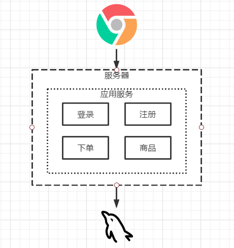

#### 单体架构存在问题

1. 基于jvm内部调用，都是一个进程中的调用
2. 随着浏览与并发上去后会存在单点故障的问题

### 集群服务

#### 简介

> 当并发与流量越来越高之后，单体架构将无法承受住压力，随之而来便有了新的解决方案，集群
>
> 集群，就是在2台服务器上部署一模一样的应用，然后通过nginx来做负载均衡，将客户端的服务平均的分发到2台不同的服务器上处理

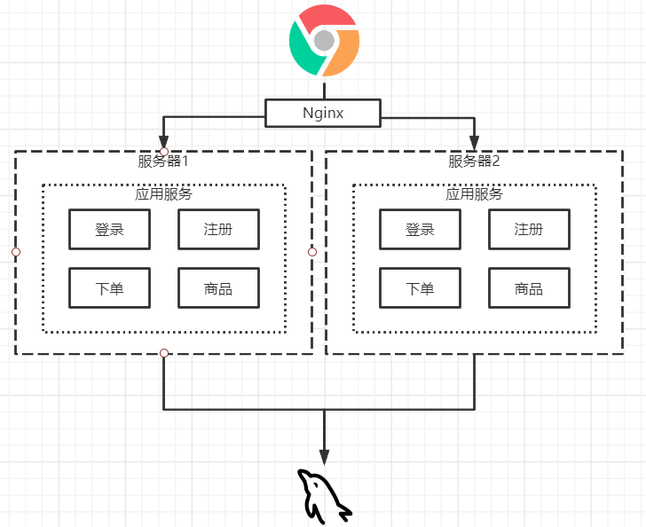

#### 集群服务存在问题

##### Session共享问题

即用户在第一次登录后连接的是服务器1，过了一段时间后由于服务器1的负载已经满，当用户再次访问请求后，Nginx将请求分发到了服务器2，由于服务器1与2是完全隔离的2个服务所以，用户请求分发到服务器2后，服务器2会认为用户并没有登录需要重新进行登录认证

##### Session共享问题解决方案

1. **Session Stick**

> Session Stick即利用Nginx的一种算法IP_Hash，当一个浏览器服务Nginx时，Nginx可以获取的带访问的浏览器的IP地址并且使用Hash算法得到对应的Hash值，然后指定该Hash值一直访问同一个服务器
>
> 存在问题一：由于并不是每一个客户端都有自己的IP地址，如一个公司从运营商接入的只有一根网线然后通过这根网线搭建公司内部的局域网分发到员工电脑上，但员工访问网页时最终实际用的都是同一个一根网线访问的互联网，所以Nginx计算Hash时都是同一个永远都只会分发到一个服务上，这样会导致负载不均衡的问题
>
> 存在问题二：由于是通过Hash进行计算指定服务器访问，那如果访问的服务宕机后，Ngxin也是全然不知的这市就会出现一个问题，但服务宕机后用户会被一直分发到一个宕机的服务上无法访问

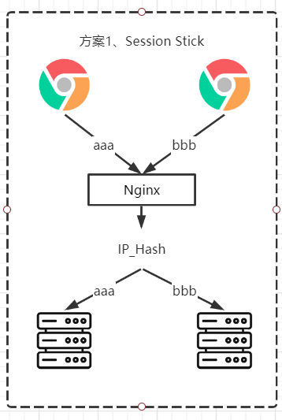

2. **Session Relication**

>Session Relication即通过配置Tomcat利用TCP/IP的特性当一个用户连接上一台服务后，该服务器会将这个用户的Session通知到其它的服务器上，这样子其它的服务器就会保存这个用户的Session并且知道这个用户是登录状态的
>
>存在问题一：如当前有10台服务集群那当一个用户连接上服务后，该服务器就需要将当前用户连接成功的Session通知到另外的9台服务器上，由于使用了TCP/IP其中会占用部分带宽影响服务器性能
>
>存在问题二：集群数量多时就会存在Session相互备份是Session冗余问题，因为在服务器相互通知Session后，每一个服务器都保存着一份完整的Session名单

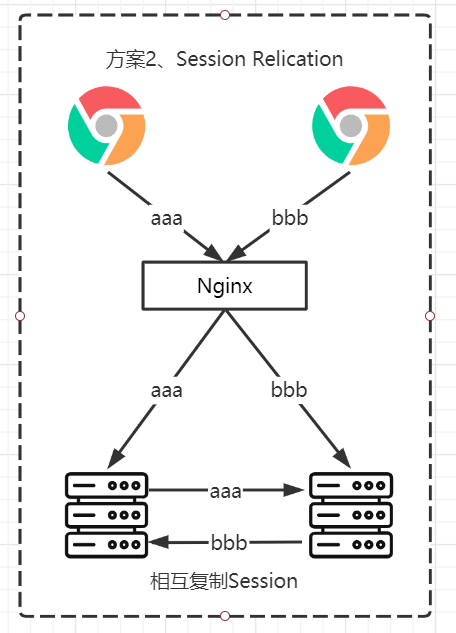

3. **Cookie Base**

>Cookie Base即将用户登录成功后认证的Session数据加密，并且保存在浏览器的Cookie中，但用户访问服务时就会认证用户Cookie中的Session数据进行认证，典型的例子Token就是基于Cookie Base实现的
>
>存在问题一：由于Session数据是存在与客户端中，客户端可以伪造别人的Session访问服务
>
>存在问题二：由于Session数据是存在与客户端中，Session更容易被别的不法分子盗取

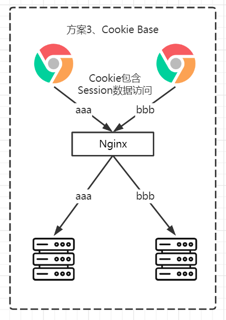

4. **Session Center**

>Session Center即将用户登录成功后认证服务器会将Session数据保存在Redis(一种内存数据库，特点读写速度快)中，当用户访问时服务器都会去Redis中获取当前用户Session验证合法性，该方法也是目前最广泛、安全的方法

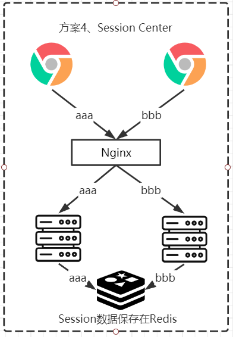

##### 数据库IO压力问题

在对服务器进行增加是缓和了用户的访问的并发，但是数据库始终还是单机版，最后随着用户访问流量上升，数据库IO压力逐渐增大，最终整个架构还是会存在并发瓶颈

##### 数据库IO压力问题解决方案

1. 读写分离、主从同步

> 读写分离即部署多个数据库，由于互联网的应用的特殊性读多写少 ，读写分离由主库以及多个从库组成，主库主要负责增删改操作，而从库主要负责查询操作，主库中的所有数据操作都会被实时同步到从库中保证从库数据与主库数据一致
>
> 读写分离分2种方式(proxy与jdbc)
>
> proxy：mycat、altas、mysql-proxy
>
> jdbc：tddl、sharding-jdbc

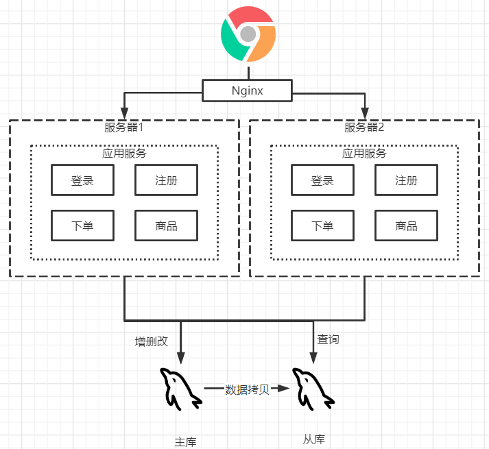

2. 分库分表

> 读写分离无法解决超大表查询插入耗时慢的问题，读写分离只是一个过渡的解决方案，如果要真正的获得性能最强的数据库，那么就要将读写分离与分库分表结合使用，即将来一个库拆分多个，以及数据表拆分，如一个库需要承受访问压力是10W那么我们拆成10个库从理论上来讲，每个数据库压力下降为1W了
>
> 分库分表分2种方式(proxy与jdbc)
>
> proxy：mycat、altas、mysql-proxy
>
> jdbc：tddl、sharding-jdbc

3. 换数据库，这个没啥好说的，有钱换Oracle数据库就行

### 服务化

##### 为什么要服务化

> 当系统涉及的业务越来越多，功能越来越多，如果还是一个单体应用在发布上线时就会存在一些问题，如当前一个电商项目分2个部门商品部门当前需求上新功能、会议部门修复已知BUG，但2个部门都完成任务并且通过测试后，部署上线，上线后发现商品部门的新功能存在问题，那么这次版本发布到底是成功还是失败，按现在情况应该是商品部门上线失败，会议部门上线成功，但是由于当前项目是一个整体，那么要进行回滚商品、会员上线的功能都要同时回滚

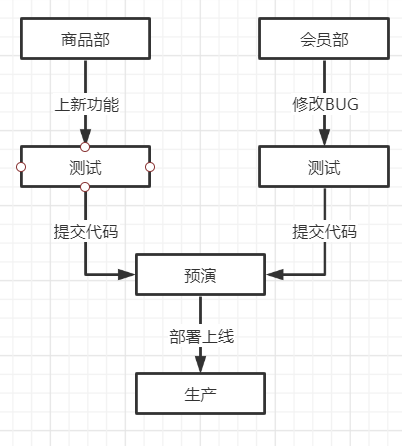

##### 服务化

> 以上部署时存在的问题，解决方法将整一个应用服务化，将功能进行按模块拆分，那么在上线时如果商品服务存在问题那么只需要回滚商品服务，并且在应用运行过程中如果订单中心宕机了，并不会影响到其余的服务的正常使用
>
> 由于对整个框架进行了分层那么这里如果应用层需要调用原子层的方法就会存在一个远程过程调用(RPC)
>
> RPC框架：dubbo、spring could

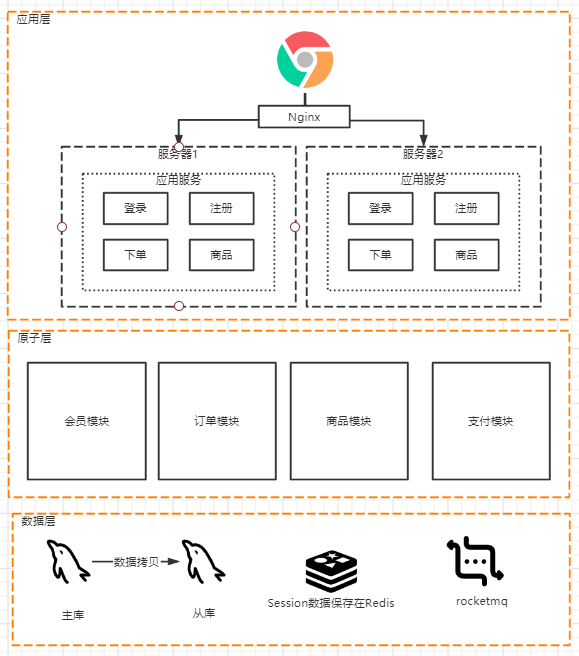

## 分布式架构的弊端

> 虽然分布式架构看起来高大上，但是使用之前请三思，因为分布式架构包含以下缺点以及风险

**分布式事务**：

> 单体项目下的事务是很好处理的，但是在分布式情况下服务都被拆分了，通常情况下一个操作会分成几个小操作在多个服务器上执行，要么成功，要么失败，这就算分布式事务需要解决的问题

**不允许服务有状态**:

> 无状态服务是指，单次请求的处理，不依其它请求，也就是说处理一次请求所需全部信息，要么都全部包含在这个请求里，要不就从外部获取（比如数据库），服务器本身不存储任何缓存信息

**服务依赖关系复杂**：

> 由于分布式架构的特性，会将应用拆分多个服务，有可能在修改某一个代码后会影响到其它的服务，单服务越多，对每一次的修改都会越来越困难

**运维成本增加**：

> 这个就不用过多解释了，错综复杂的服务调用了，涉及多服务的部署，多服务的发布等自然运维成功也会增加

**如何保证系统的伸缩性**：

> 伸缩性是指，当服务器硬件升级后，那么处理能力也要对应的提升

**分布式会话**：

> 由于服务都被拆分到多个服务器上，那么Session自然不能保存在服务器上，而是要利用分布式的Session解决方安

**分布式JOB**：

> 分布式job通常是指定时任务，定时任务一般情况下那么只能是在一台服务器上触发，但又由于分布式的背景下，那么自然这些定时任务会被运行在多个应用上，那么那台执行这个定时任务也是个问题，或者执行那台宕机了那谁来代替

## 分布式架构的选型

> 分布式最核心的功能是什么，就算远程过程调用(RPC)，服务于服务之间的调用问题，实现这种方式有3种方法

### 基于反向代理的集中式架构

> 最传统也是最简单的做法，在生产者于消费者中间添加一个代理对象，Nginx就是一个典型的例子，所有的的消费者都需要通过访问Nginx，Nginx可以基于域名做到服务的分发和负载均衡为所有消费者分发相应的服务提供者
>
> 方案：Http+Nginx
>
> 优点：简单快捷，几乎没有学习成本，基于Http协议跨平台
>
> 适用场景：轻量级分布式系统，局部分布式架构
>
> 瓶颈：Nginx中心负载，Http传输，Json序列化，开发效率，运维效率

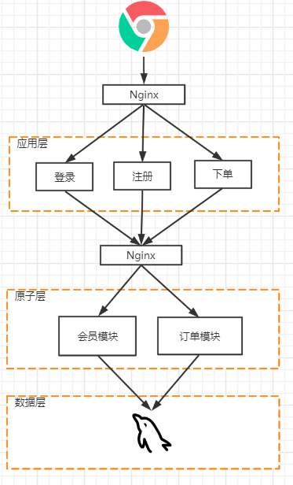

### 嵌入应用内部的去中心化架构

> 很多互联网公司流行使用的做法，不在使用Nginx进行服务的转发，而是直接让消费者去寻找服务提供者，这样就需要一个东西专门存储服务提供者的列表，这个就是注册中心，当服务提供者启动后会向注册中心注册，当服务消费者启动后会向注册中心订阅，这样消费者就可以通过注册中心得到服务提供者列表，这就是我们熟悉的dubbo、spring cloud Eureka+Ribbon都是这样实现的
>
> 方案：dubbo、spring cloud Eureka+Ribbon
>
> 优点：消费者直接访问提供者去中心化，动态的服务注册于发现、高效稳定的传输
>
> 适用场景：大型分布式系统

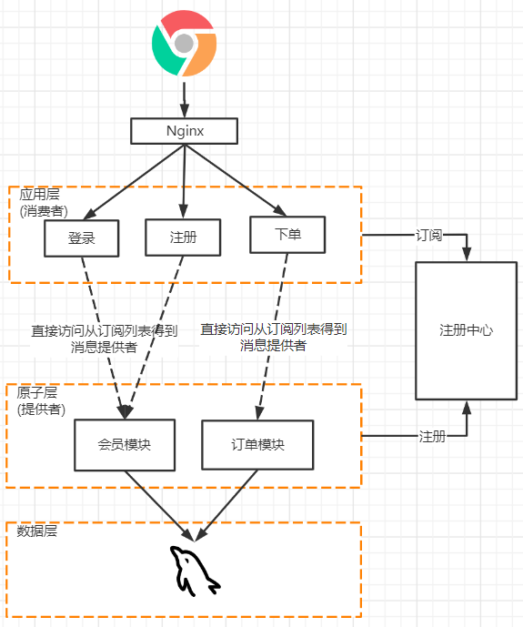

### 基于独立代理进程的Service Mesh架构

> 这种方式与上一种不同的就是每一个客户端不需要去注册中心订阅了，在每一个机器上都有一个独立的代理进程订阅与负载均衡，客户端只需要访问代理对象，代理对象就会将来消费者分发到相应的服务提供者，`乍一看好像nginx+http方案差不多，其实还是有很大区别的，注意这个Proxy代理是每一台机器上都会有一个的，不同nginx所有机器就访问一个`

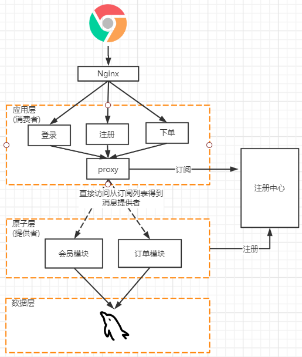
