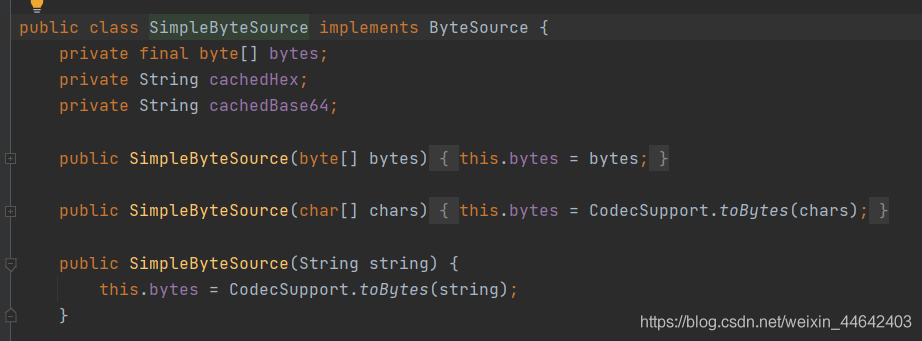
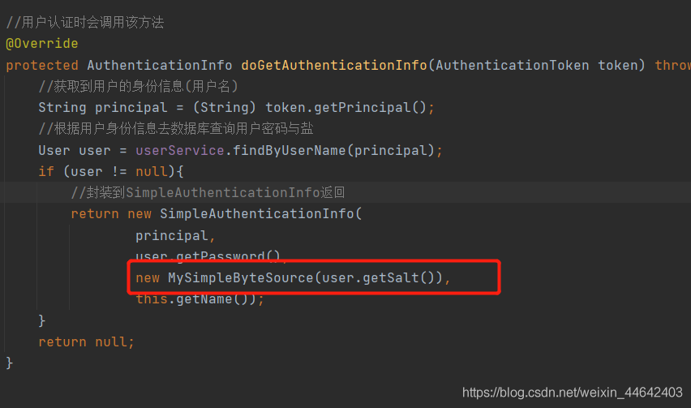
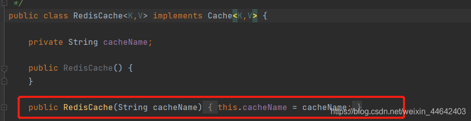
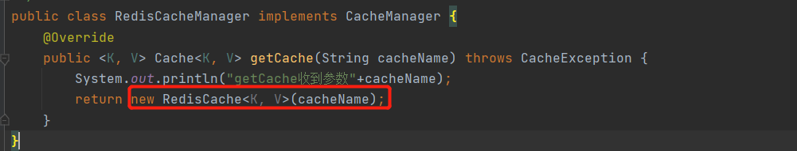
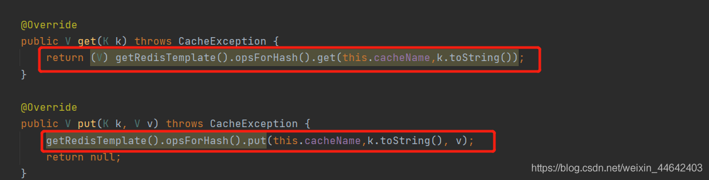

# Shiro-集成Redis序列化失败报错解决
## 踩坑点1
最近在使用Shiro集成Redis，使用分布式缓存时序列化与序列化时报错，报错信息如

>Cannot serialize; nested exception is org.springframework.core.serializer.support.SerializationFailedException: Failed to serialize object using DefaultSerializer; nested exception is java.io.NotSerializableException: org.apache.shiro.util.SimpleByteSource

查看SimpleByteSource可以看到该类并且没有实现Serializable接口所以导致序列化失败

### 解决方案1(推荐)
> 修改Redis序列化方式，解决该问题，Redis默认序列化使用的是Java`Serializable`序列化，所以需要被序列化的类都实现`Serializable`否则序列化将会失败，直接将来该类拷贝到项目任意一个文件夹解决该问题
~~~java
@Configuration
@EnableCaching
public class RedisConfig {

    @Bean
    public RedisTemplate<String, Object> redisTemplate(RedisConnectionFactory factory) {
        RedisTemplate<String, Object> template = new RedisTemplate<>();
        template.setConnectionFactory(factory);
        //Json序列化配置
        Jackson2JsonRedisSerializer jackson2JsonRedisSerializer = new Jackson2JsonRedisSerializer(Object.class);
        ObjectMapper om = new ObjectMapper();
        om.setVisibility(PropertyAccessor.ALL, JsonAutoDetect.Visibility.ANY);
        om.enableDefaultTyping(ObjectMapper.DefaultTyping.NON_FINAL);
        jackson2JsonRedisSerializer.setObjectMapper(om);
        //string的序列化
        StringRedisSerializer stringRedisSerializer = new StringRedisSerializer();
        //key采用string的序列化方式
        template.setKeySerializer(stringRedisSerializer);
        //hash的key也采用string的序列化方式
        template.setHashKeySerializer(stringRedisSerializer);
        //value序列化方式采用jackson
        template.setValueSerializer(jackson2JsonRedisSerializer);
        //hash的value序列化方式采用jackson
        template.setHashValueSerializer(jackson2JsonRedisSerializer);
        template.afterPropertiesSet();
        return template;
    }
}
~~~
### 解决方案2
> 既然Shiro提供SimpleByteSource没有实现序列化接口，那么我们就自己写一个自己的SimpleByteSource实现序列化即可
~~~java
public class MySimpleByteSource implements ByteSource, Serializable {
    private static final long serialVersionUID = 5175082362119580768L;

    private  byte[] bytes;
    private String cachedHex;
    private String cachedBase64;

    public MySimpleByteSource(){
    }

    public MySimpleByteSource(byte[] bytes) {
        this.bytes = bytes;
    }

    public MySimpleByteSource(char[] chars) {
        this.bytes = CodecSupport.toBytes(chars);
    }

    public MySimpleByteSource(String string) {
        this.bytes = CodecSupport.toBytes(string);
    }

    public MySimpleByteSource(ByteSource source) {
        this.bytes = source.getBytes();
    }

    public MySimpleByteSource(File file) {
        this.bytes = (new MySimpleByteSource.BytesHelper()).getBytes(file);
    }

    public MySimpleByteSource(InputStream stream) {
        this.bytes = (new MySimpleByteSource.BytesHelper()).getBytes(stream);
    }

    public static boolean isCompatible(Object o) {
        return o instanceof byte[] || o instanceof char[] || o instanceof String || o instanceof ByteSource || o instanceof File || o instanceof InputStream;
    }

    public void setBytes(byte[] bytes) {
        this.bytes = bytes;
    }

    @Override
    public byte[] getBytes() {
        return this.bytes;
    }

    @Override
    public String toHex() {
        if(this.cachedHex == null) {
            this.cachedHex = Hex.encodeToString(this.getBytes());
        }
        return this.cachedHex;
    }

    @Override
    public String toBase64() {
        if(this.cachedBase64 == null) {
            this.cachedBase64 = Base64.encodeToString(this.getBytes());
        }

        return this.cachedBase64;
    }

    @Override
    public boolean isEmpty() {
        return this.bytes == null || this.bytes.length == 0;
    }
    @Override
    public String toString() {
        return this.toBase64();
    }

    @Override
    public int hashCode() {
        return this.bytes != null && this.bytes.length != 0? Arrays.hashCode(this.bytes):0;
    }

    @Override
    public boolean equals(Object o) {
        if(o == this) {
            return true;
        } else if(o instanceof ByteSource) {
            ByteSource bs = (ByteSource)o;
            return Arrays.equals(this.getBytes(), bs.getBytes());
        } else {
            return false;
        }
    }

    private static final class BytesHelper extends CodecSupport {
        private BytesHelper() {
        }

        public byte[] getBytes(File file) {
            return this.toBytes(file);
        }

        public byte[] getBytes(InputStream stream) {
            return this.toBytes(stream);
        }
    }

}
~~~
> 在认证时返回盐使用自定义的类返回即可
> 

## 踩坑点2
如果纠正了Redis序列化后重启服务，并且测试登录后出现这个异常那么就很可能是保存缓存时数据结构使用的是`opsForValue()`改成`opsForHash()`即可，具体是为什么我占时不清楚，如果有大神知道请留下你的评论
> org.apache.shiro.authz.SimpleAuthorizationInfo cannot be cast to org.apache.shiro.authc.AuthenticationInfo
### 解决方案
> RedisCache创建一个带参构造器
> 

> 在设置自定义RedisCacheManager，new一个带参的构造器，并且将来收到的cacheName传入进去
> 

> Redis进行set与get操作时改成使用`opsForHash()`数据结构，并且把cacheName做为Map的名称

