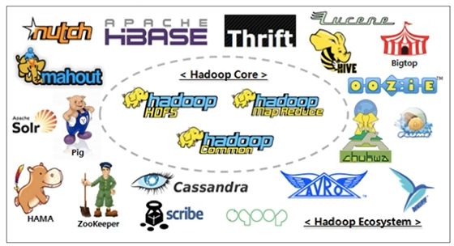
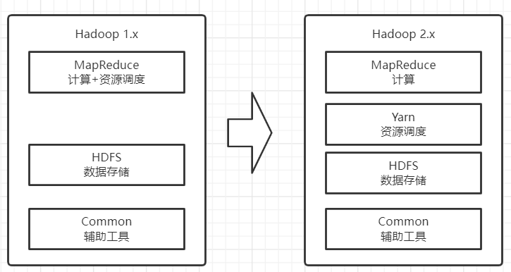
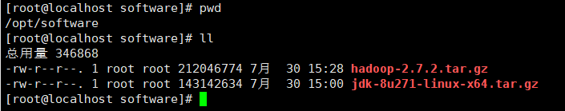
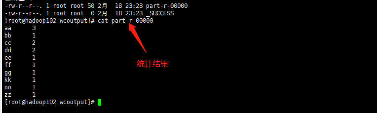
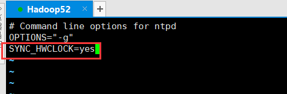

# Hadoop3.x-基础(部署)

## Hadoop是什么

> Hadoop是一个由Apache基金会所开发的分布式系统基础架构
>
> 主要解决海量数据的存储和海量数据的分析计算问题
>
> 广义上来说，Hadoop通常是指一个更广泛的概念——Hadoop生态圈

### Hadoop三大发行版本

> 2006年推出：Apache版本最原始(最基础)版本，对于入门学习最好
>
> 2008年推出：Cloudera内部集成了很多大数据框架，对应产品CDH
>
> 2011年推出：Hortonworks文档交好，对应产品HDP，Hortonworks现在已经被Cloudera公司收购，推出新的产品CDP

### Hadoop优势

> 1. 高可靠性：Hadoop底层维护多个数据副本，所以即使Hadoop某个计算节点或者存储出现故障，也不会导致数据丢失
> 2. 高扩展性：在集群间分配任务数据，可方便的扩展数以千计的节点，可实现热扩容热缩容
> 3. 高效性：在MapReduce的思想下，Hadoop是并行工作的，加快任务处理速度
> 4. 高容错：能够将失败的任务重新分配

### Hadoop组成

> Hadoop1.x与Hadoop2.x与Hadoop3.x差别
>
> 在1.x版本中MapReduce即负责计算又负责计算机的资源调度耦合性较大
>
> 升级后的2.x后MapReduce只负责计算，而资源调度由Yarn完成解决1.x的耦合性问题
>
> 在3.x版本中组成与2.x没有区别只是增加了部分新特性后面章节会说到

### HDFS

> HDFS(Hadoop Distributed File System)是Hadoop的数据存储模块
>
> HDFS的组成
>
> 1. NameNode(nn)：存储文件的元数据，如文件名，文件目录，文件属性(生成时间、副本数、文件权限)，以及每个文件的块列表和块所在的DataNode等
> 2. DataNode(dn)：在本地文件系统存储文件块数据，以及块数据的校验和
> 3. Secondary NameNode(2nn)：用来监控DHFS状态的辅助后台程序，每隔一段时间获取HDFS元数据的快照

### YARN

> YARN是Hadoop的资源调度模块，其中包含4个组件
>
> 1. ResourceManager(RM)：整个集群服务器资源Leader
> 2. NodeManager(NN)：单个节点服务器资源Leader
> 3. ApplicationMaster(AM)：单个任务运行的Leader
> 4. Container：容器，相当于一台独立的服务器，里面封装了任务运行时所需的资源如内存、CPU、磁盘、网络
>
> 说明：
>
> 1. 客户端可以有多个
> 2. 集群上可以运行多个ApplicationMaster
> 3. 每个NodeMangaer上可以有多个Container

### MapReduce

> MapReduce是将计算分两个阶段，Map和Reduce
>
> 1. Map阶段并行处理输入数据
> 2. Reduce阶段对Map结果进行汇总

### 大数据技术生态体系

> 以下是整个大数据生态中的框架以及场景，从下往上说
>
> 1. Zookeeper：管理整个集群的通用配置
> 2. 数据来源层：分析数据都来源于结构化数据(数据库中的数据)、半结构化数据(文件日志)、非结构化数据(视频、ppt等)
> 3. 数据存储层：存储数据的地方，通常保存在分布式文件存储系统中HDFS或非关系型数据库Hbase(一种k,v键值的数据库)
> 4. 资源管理层：YARN资源管理器，虚拟化出CPU、内存等空间提供给程序进行调度
> 5. 数据计算层：
>    * MapReduce离线计算：离线计算数据较安全宕机不会丢失，通过Hive进行数据查询，Hive提供(SQL语法的查询语句对数据查询)，Mahout进行数据挖掘
>    * Spark Core内存计算：内存计算数据安全低宕机数据丢失，Spark套件提供了强大的支持数据挖掘、数据分析、数据查询(类SQL语法)、实时计算(准实时、实际是分批小批多次计算)
>
> 5. 任务调度层：在集群中通常是上百个分析任务进行的，那么多个任务并行自然就有同步或某些任务需要基于其它任务的完成才进行，这里就由任务调度器统一管理
> 6. 业务模型层：主要是业务层面公司给予你的任务，如数据可视化报表

## Hadoop环境搭建

### Linux依赖准备
> 如何安装Linux系统安装请看 [Win10-VMware Linux安装](../Liunx专栏/VMware-安装Liunx.md)
>  在搭建环境之下Linux需要执行如下命令安装依赖与隔壁防火墙

~~~shell
#epel-release 是为"红帽系"操作系统提供额外的软件包
yum install -y epel-release
#net-tool工具包
yum install -y net-tools
#vim编辑器
yum install -y vim
#关闭防火墙
systemctl stop firewalld.service
systemctl disable firewalld.service
~~~

> 搭建hadoop环境需要jdk于hadoop

### JDK环境安装

> 环境使用的是jdk1.8

~~~shell
#删除所有用rpm安装的jdk包
rpm -qa | grep -i java | xargs -n1 rpm -e --nodeps
#将jdk解压到指定的目录
tar -zxvf jdk-8u271-linux-x64.tar.gz -C /opt/module/
~~~

> 添加java环境变量

~~~shell
#需要改环境变量
vi /etc/profile.d/my_evn.sh
~~~

> #在profile文件的末尾添加如下内容

~~~shell
#JAVA_HOME
export JAVA_HOME=/opt/module/jdk1.8.0_212
export PATH=$PATH:$JAVA_HOME/bin
~~~

~~~shell
#执行如下命令设置环境变量
source /etc/profile
#测试java
java -version
~~~

### Hadoop3.x安装

> 这里使用的Hadoop3.1.3，下载地址`https://archive.apache.org/dist/hadoop/common/hadoop-3.1.3/`

~~~shell
#将hadoop解压到指定的目录
tar -zxvf hadoop-3.1.3.tar.gz -C /opt/module/
~~~

> 添加hadoop环境变量

~~~shell
#需要改环境变量
vi /etc/profile.d/my_evn.sh
~~~

> #在profile文件的末尾添加如下内容

~~~shell
#HADOOP_HOME
export HADOOP_HOME=/opt/module/hadoop-3.1.3
export PATH=$PATH:$HADOOP_HOME/bin
export PATH=$PATH:$HADOOP_HOME/sbin
~~~

~~~shell
#执行如下命令设置环境变量
source /etc/profile
#测试hadoop
hadoop
~~~

## Hadoop运行模式

### 本地模式

> 本地模式也叫单节点模式，该模式下只有一个hadoop进行运行和分析任务

#### wordcount案例

> grep案例演示了如何使用hadoop在一堆文件中找到你想要的内容

~~~shell
#进入到hadoop目录
cd /opt/module/hadoop-3.1.3
#创建input文件
mkdir wcinput
#创建一个txt文件随便写几个单词进去
vim wcinput/word.txt
#执行hadoop的hadoop-mapreduce-examples对wcinput文件夹下的所有文件单词统计，输出到wcoutput文件夹
bin/hadoop jar share/hadoop/mapreduce/hadoop-mapreduce-examples-3.1.3.jar wordcount wcinput/ ./wcoutput
~~~

### 完全分布式

#### 环境准备

> 基于Hadoop51虚拟机克隆出3台虚拟机，并且关闭防火墙、修改id地址、设置主机名称
>
> 1. 修改ip地址：`vi /etc/sysconfig/network-scripts/ifcfg-ens33`
> 2. 修改主机名称：`vi /etc/sysconfig/network`
> 3. 修改hosts：28
> 4. `vi /etc/hosts`

| IP地址   | 192.168.10.102 | 192.168.10.103 | 192.168.10.104 |
| -------- | -------------- | -------------- | -------------- |
| 主机名称 | Hadoop102      | Hadoop103      | Hadoop104      |

#### 编写集群分发脚本

##### rsync命令

> 使用rsync前提需要目标主机举报rsync命令，安装rsync命令 `yum -y install rsync`
>
> rsync主要用于备份和镜像，其与scp命令区别在于rsyn只对有差异的文件做更新而scp是直接覆盖过去，所有rsync速度会更块可以避免负责相同的文件

~~~shell
#-r 递归
#-v 显示复制过程
#-l 拷贝符号理解
rsync -rvl 源路径 目标路径
~~~

###### 拷贝文件案例

> 登录到hadoop102执行如下命令将102的安装包拷贝到另外3台机器上

~~~shell
rsync -rvl /opt/module root@hadoop103:/opt/module
rsync -rvl /opt/module root@hadoop104:/opt/module

rsync -rvl /opt/software/ root@hadoop103:/opt/software
rsync -rvl /opt/software/ root@hadoop104:/opt/software
~~~

> 将环境变量拷贝到其它主机上

~~~shell
rsync -vl /etc/profile.d/my_evn.sh root@hadoop103:/etc/profile.d/my_evn.sh
rsync -vl /etc/profile.d/my_evn.sh root@hadoop104:/etc/profile.d/my_evn.sh
~~~

##### 自定义分发脚本

> 经过前面的使用已经对scp与rsync命令有了一定的理解，但是可以在文件分发时还是比较麻烦，每台远程主机对应都要执行一条命令当远程主机很多的情况下还是需要执行很多命令，所有需要编写shell脚本实现一条命令可以分发多个服务器

###### 脚本实现

> 在用户bin目录下创建一个脚本名称为xsync(名字自定义可以随便起)
>
> `/home/用户名/bin 在该目录下存放的脚本，对应用户可以在系统如何一个地方直接执行`

~~~shell
cd ~
mkdir bin
cd bin/
touch xsync
vi xsync
~~~

> 脚本内容

~~~shell
#!/bin/bash
#1. 判断参数个数
if [ $# -lt 1 ]
then
 echo Not Enough Arguement!
 exit;
fi

#2. 遍历集群所有机器
for host in hadoop102 hadoop103 hadoop104
do
 echo ==================== $host ====================
 #3. 遍历所有目录，挨个发送
 for file in $@
 do
   #4. 判断文件是否存在
   if [ -e $file ]
     then
       #5. 获取父目录
       pdir=$(cd -P $(dirname $file); pwd)
       #6. 获取当前文件的名称
       fname=$(basename $file)
       ssh $host "mkdir -p $pdir"
       rsync -av $pdir/$fname $host:$pdir
     else
       echo $file does not exists!
   fi
 done
done
~~~

> 将脚本设置为可执行 `chmod 777 xsync`

###### 测试

#### SSH无密码登录

> 在刚刚测试文件拷贝时可以发现，每拷贝一台服务器都需要输入密码登录操作还是比较反锁，接下来我们配置ssh无密码登录来解决这个问题

~~~shell
#进入到ssh目录
cd .ssh
#生产ssh公私钥
ssh-keygen -t rsa
#将公钥拷贝带其它电脑上，第一次需要输入密码
ssh-copy-id hadoop102
ssh-copy-id hadoop103
ssh-copy-id hadoop104
~~~

#### 集群配置

##### 集群部署规划

> 现有3台主机，首先规划好每台主机上分别部署什么应用，接下来所有的配置都只会在hadoop102主机上修改修改完毕后使用前面编写的集群分发脚本分发到102,104服务器上

|      | hadoop102             | hadoop103                      | hadoop104                      |
| ---- | --------------------- | ------------------------------ | ------------------------------ |
| HDFS | NameNode DataNode | DataNode                       | SecondaryNameNode DataNode |
| YARN | NodeManager           | ResourceManger NodeMangaer | NodeManager                    |

##### 核心配置

###### 配置core-site.xml

> 修改core-site中hdfs的namenode统一修改为hadoop102

~~~shell
vi /opt/module/hadoop-3.1.3/etc/hadoop/core-site.xml
~~~

~~~xml
<!-- 指定 NameNode 的地址 -->
<property>
    <name>fs.defaultFS</name>
    <value>hdfs://hadoop102:8020</value>
</property>
<!-- 指定 hadoop 数据的存储目录 -->
<property>
    <name>hadoop.tmp.dir</name>
    <value>/opt/module/hadoop-3.1.3/data</value>
</property>
<!-- 配置 HDFS 网页登录使用的静态用户为 root -->
<property>
    <name>hadoop.http.staticuser.user</name>
    <value>root</value>
</property>
~~~

##### HDFS配置

###### 配置hdfs-site.xml

> 现在有3台主机需要部署hdfs所有将副本数改为3，并且需要指定监控节点(SecondaryNameNode)地址
~~~shell
vi /opt/module/hadoop-3.1.3/etc/hadoop/hdfs-site.xml
~~~

~~~xml
<!-- nn web 端访问地址-->
<property>
    <name>dfs.namenode.http-address</name>
    <value>hadoop102:9870</value>
</property>
<!-- 2nn web 端访问地址-->
<property>i
    <name>dfs.namenode.secondary.http-address</name>
    <value>hadoop104:9868</value>
</property>
~~~

##### YARN配置

###### 配置yarn-site.xml

~~~shell
vi /opt/module/hadoop-3.1.3/etc/hadoop/yarn-site.xml 
~~~

~~~xml
<!-- 指定 MR 走 shuffle -->
<property>
    <name>yarn.nodemanager.aux-services</name>
    <value>mapreduce_shuffle</value>
</property>
<!-- 指定 ResourceManager 的地址-->
<property>
    <name>yarn.resourcemanager.hostname</name>
    <value>hadoop103</value>
</property>
<!-- 环境变量的继承 3.2.x 以上不需要-->
<property>
    <name>yarn.nodemanager.env-whitelist</name>       <value>JAVA_HOME,HADOOP_COMMON_HOME,HADOOP_HDFS_HOME,HADOOP_CONF_DIR,CLASSPATH_PREPEND_DISTCACHE,HADOOP_YARN_HOME,HADOOP_MAPRED_HOME</value>
</property>
<!-- 开启日志聚集功能 -->
<property>
    <name>yarn.log-aggregation-enable</name>
    <value>true</value>
</property>
<!-- 设置日志聚集服务器地址 -->
<property> 
    <name>yarn.log.server.url</name> 
    <value>http://hadoop102:19888/jobhistory/logs</value>
</property>
<!-- 设置日志保留时间为 7 天 -->
<property>
    <name>yarn.log-aggregation.retain-seconds</name>
    <value>604800</value>
</property>
~~~

##### MapReduce配置

###### 配置mapred-site.xml

~~~shell
vi /opt/module/hadoop-3.1.3/etc/hadoop/mapred-site.xml
~~~

~~~xml
<!-- 指定 MapReduce 程序运行在 Yarn 上 -->
<property>
    <name>mapreduce.framework.name</name>
    <value>yarn</value>
</property>
<!-- 历史服务器端地址 -->
<property>
    <name>mapreduce.jobhistory.address</name>
    <value>hadoop102:10020</value>
</property>
<!-- 历史服务器 web 端地址 -->
<property>
    <name>mapreduce.jobhistory.webapp.address</name>
    <value>hadoop102:19888</value>
</property>
~~~

##### 分发配置文件

~~~shell
#配置文件分发到其它节点
xsync /opt/module/hadoop-3.1.3/etc/hadoop/
~~~

##### **启动集群**

> 启动集群之前确保所有主机都已经配上了ssh无密码登录

###### 配置hadoop-env

> 如果使用root需要在hadoop-env添加如下环境

~~~shell
#进入hadoop-env.sh
vim /opt/module/hadoop-3.1.3/etc/hadoop/hadoop-env.sh
#添加如下内容
export YARN_RESOURCEMANAGER_USER=root
export YARN_NODEMANAGER_USER=root
export HDFS_NAMENODE_USER=root
export HDFS_DATANODE_USER=root
export HDFS_SECONDARYNAMENODE_USER=root
~~~

###### 配置workers

> 记录在workers中的主机域名是用于给hadoop启动集群时连接用的，所以不允许有任何空格

~~~shell
#配置集群数据节点(DataNode)
vi /opt/module/hadoop-3.1.3/etc/hadoop/workers
~~~

###### 分发文件

> 将文件分发到集群所有节点中

~~~shell
xsync /opt/module/hadoop-3.1.3/etc/hadoop/workers
~~~

**初始化(首次启动才执行，会清空HDFS中数据)**

~~~shell
hdfs namenode -format
~~~

###### 启动HDFS集群

> 进入到集群的`任意`一台主机下执行`sbin/start-dfs.sh `脚本，hadoop会使用ssh命令远程控制集群的其它节点一起启动

###### 启动Yarn集群

> 启动Yarn时，你的`ResourceManger在那台主机上就必须去那台主机上启动否则会报错`
>
> 进入到hadoop103节点(ResourceManger节点)执行`sbin/start-yarn.sh`脚本启动yarn

> 启动后查看与我们预期一致表示启动成功

|      | hadoop102             | hadoop103                      | hadoop104                      |
| ---- | --------------------- | ------------------------------ | ------------------------------ |
| HDFS | NameNode DataNode | DataNode                       | SecondaryNameNode DataNode |
| YARN | NodeManager           | ResourceManger NodeMangaer | NodeManager                    |

##### 简单测试

> 集群部署完毕后，需要对集群进行简单测试查看集群是否能够正常工作

###### 访问HDFS

> 在浏览器中输入http://hadoop102:9870查看是否能够正常访问

###### 服务Yarn

> 在浏览器中输入http://hadoop103:8088查看是否能够正常访问

###### 上传文件测试

> 在集群任意一台集群上使用hdfs命令上传任意文件到根目录

~~~shell
#上传一个文件到hdfs到根目录
hadoop fs -mkdir /wcinput
hadoop fs -put wcinput/word.txt /wcinput
~~~

> 上传成功后在web端查看根目录是否有文件
>
> Replication副本数是不是与设定的一致

> 在HDFS上的文件实际存储被分发到了3台不同的Hadoop中的data目录下

###### WordCount测试

~~~shell
#在集群任意一台机器上执行该命令
hadoop jar share/hadoop/mapreduce/hadoop-mapreduce-examples-3.1.3.jar wordcount /wcinput /wcoutput
~~~

##### 集群启动与停止

~~~shell
#启动/关闭 hdfs集群
start-dfs.sh/stop-dfs.sh
#启动/关闭 yarn集群(必须在resourcemanager下执行命令)
start-yarn.sh/stop-yarn.sh

#单独启动/停止HDFS中的组件
hdfs --daemon start|stop namenode|datanode|secondarynamenode
#单独启动/停止Yarn中的组件
yarn --daemon start|stop resourcemanager|nodemanager
#单独启动/停止日志收集
mapred --daemon start|stop historyserver
~~~

##### 集群常用脚本

**启动/停止 HDFS、Yarn、historyserver 脚本**

~~~shell
#!/bin/bash
if [ $# -lt 1 ]
then
  echo "No Args Input..."
  exit ;
fi
case $1 in
"start")
     echo " =================== 启动 hadoop 集群 ==================="
     echo " --------------- 启动 hdfs ---------------"
     ssh hadoop102 "/opt/module/hadoop-3.1.3/sbin/start-dfs.sh"
     echo " --------------- 启动 yarn ---------------"
     ssh hadoop103 "/opt/module/hadoop-3.1.3/sbin/start-yarn.sh"
     echo " --------------- 启动 historyserver ---------------"
     ssh hadoop102 "/opt/module/hadoop-3.1.3/bin/mapred --daemon start historyserver"
;;
"stop")
     echo " =================== 关闭 hadoop 集群 ==================="
     echo " --------------- 关闭 historyserver ---------------"
     ssh hadoop102 "/opt/module/hadoop-3.1.3/bin/mapred --daemon stop historyserver"
     echo " --------------- 关闭 yarn ---------------"
     ssh hadoop103 "/opt/module/hadoop-3.1.3/sbin/stop-yarn.sh"
     echo " --------------- 关闭 hdfs ---------------"
     ssh hadoop102 "/opt/module/hadoop-3.1.3/sbin/stop-dfs.sh"
;;
*)
  echo "Input Args Error..."
;;
esac
~~~

**查看多台主机JPS**

~~~shell
#!/bin/bash
for host in hadoop102 hadoop103 hadoop104
do
  echo =============== $host ===============
  ssh $host jps 
done
~~~

##### 集群时间同步

> `如果集群中所有机器都可连外网同步时间可跳过改步骤`
>
> 由于hadoop集群部署后需要经常执行定时任务，所以集群之间的时间需要同步，若集群中的每个节点时间都不相同，那么到执行任务时会乱套了
>
> 解决方案：找一台服务器作为时间服务器，其它机器使用crontab定时同步该服务器的时间

###### 时间服务器配置

> 检查是否安装ntp

~~~shell
#查看ntp是否安装
rpm -qa | grep ntp
#若没有如何内容显示，使用yum安装ntp
yum -y install ntp
~~~

> 修改ntp配置文件，
>
> * 授权10.168.10.0-10.168.10.255网段上的所有机器可以从这台机器上查询和同步时间
> * 集群中的主机在局域网中，不使用其它互联网的时间
> * 当时间服务器丢失网络时间，依然可以使用本地时间作为时间服务器为集群中其它节点提供时间同步

~~~shell
#修改ntp配置
vi /etc/ntp.conf
~~~

> 修改/etc/sysconfig/ntpd文件，让硬件时间与系统时间一起同步

~~~shell
vi /etc/sysconfig/ntpd
~~~

> 重启ntp服务
>
> 设置开启启动

~~~shell
#查看状态、启动ntpd、设置开机自启动
systemctl status ntpd
systemctl start ntpd
systemctl is-enabled ntpd
~~~

###### 集群节点配置

> 检查是否安装ntp
>

~~~shell
#查看ntp是否安装
rpm -qa | grep ntp
#若没有如何内容显示，使用yum安装ntp
yum -y install ntp
#关闭所有ntp
systemctl stop ntpd
systemctl disable ntpd
~~~

> 配置定时任务

~~~shell
crontab -e
~~~

> 每1分钟去hadoop52主机上同步时间

## Hadoop2.x与3.x区别总结

> 1、常用端口号
> hadoop3.x 
> 	HDFS NameNode 内部通常端口：8020/9000/9820
> 	HDFS NameNode 对用户的查询端口：9870
> 	Yarn查看任务运行情况的：8088
> 	历史服务器：19888
> hadoop2.x 
> 	HDFS NameNode 内部通常端口：8020/9000
> 	HDFS NameNode 对用户的查询端口：50070
> 	Yarn查看任务运行情况的：8088
> 	历史服务器：19888
> 2、常用的配置文件
>     3.x core-site.xml  hdfs-site.xml  yarn-site.xml  mapred-site.xml workers
>     2.x core-site.xml  hdfs-site.xml  yarn-site.xml  mapred-site.xml slaves
