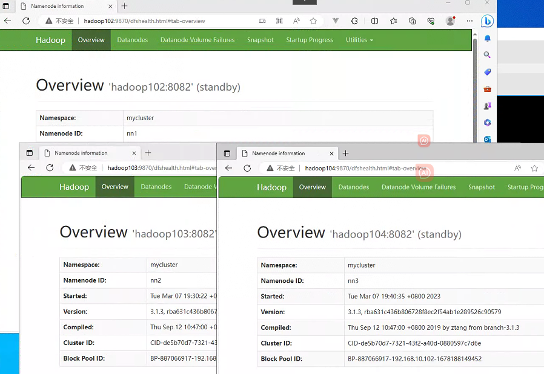

# Hadoop-高可用(HA)

> 在普通的Hadoop集群中，NameNode和ResourceManager只有一个节点，当它们其中一个在运行时发生问题后会导致整个Hadoop集群无法使用，本章节通过配置多个NameNode实现NameNode的热备，来解决问题

## HDFS-HA

### 集群规划

> 当前集群的部署情况，该集群存在单点故障问题

|      | hadoop102             | hadoop103 | hadoop104                      |
| ---- | --------------------- | --------- | ------------------------------ |
| HDFS | NameNode DataNode | DataNode  | SecondaryNameNode DataNode |

> 使用HA消除NameNode的单点故障问题，将hdfs集群改成如下规划

|      | hadoop102             | hadoop103              | hadoop104             |
| ---- | --------------------- | ---------------------- | --------------------- |
| HDFS | NameNode DataNode | NameNode DataNode | NameNode DataNode |

### 核心问题

1. 怎么保证三台namenode的数据一致性

   > Fsimage：让一台nn生成数据，让其他机器nn同步
   >
   > Edits：需要引进新的模块JournalNode来保证edits的文件和数据一致性

2. 怎么让同时只有一台nn是active，其他所有是standby的

   > 手动配置/自动配置

3. 2nn子ha架构中并不存在，定期合并fsimage和edits的活谁来干

   > standby的nn来干

4. 如果nn真发生了问题，怎么让其他nn上位干活

   > 手动故障转移/自动故障转移

### 手动模式的HA

> 环境准备
>
> 1. 修改IP
> 2. 修改主机名及主机名和IP地址的映射
> 3. 关闭防火墙
> 4. ssh免密登录
> 5. 安装JDK，配置环境变量

#### 集群规划

|      | hadoop102                              | hadoop103                               | hadoop104                              |
| ---- | -------------------------------------- | --------------------------------------- | -------------------------------------- |
| HDFS | NameNode JournalNode DataNode | NameNode JournalNode DataNode | NameNode JournalNode DataNode |

#### 修改配置文件

> 在op目录下创建ha文件夹，将`opt/module`下的hadoop-3.1.3拷贝到`opt/ha`下

~~~shell
#创建文件
cd /opt
mkdir ha
#复制旧数据到hadoop中
cp -r /opt/module/hadoop-3.1.3/ /opt/ha/
#把旧数据清理掉
rm -rf data/ logs/
~~~

> 配置core-site.xml

~~~xml
<configuration>
<!-- 指定 NameNode 的地址 -->
<property>
    <name>fs.defaultFS</name>
    <value>hdfs://mycluster</value>
</property>
<!-- 指定 hadoop 数据的存储目录 -->
<property>
    <name>hadoop.tmp.dir</name>
    <value>/opt/ha/hadoop-3.1.3/data</value>
</property>
<!-- 配置 HDFS 网页登录使用的静态用户为 root -->
<property>
    <name>hadoop.http.staticuser.user</name>
    <value>root</value>
</property>
</configuration>
~~~

> 配置hdfs-site.xml

~~~xml
<configuration>
    <!-- NameNode数据存储目录 -->
    <property>
        <name>dfs.namenode.name.dir</name>
        <value>file://${hadoop.tmp.dir}/name</value>
    </property>
    <!-- DataNode数据存储目录 -->
    <property>
        <name>dfs.datanode.data.dir</name>
        <value>file://${hadoop.tmp.dir}/data</value>
    </property>
    <!-- JournalNode数据存储目录 -->
    <property>
        <name>dfs.journalnode.edits.dir</name>
        <value>${hadoop.tmp.dir}/jn</value>
    </property>
    <!-- 完全分布式集群名称 -->
	<property>
		<name>dfs.nameservices</name>
		<value>mycluster</value>
	</property>
    <!-- 集群中NameNode节点都有哪些 -->
	<property>
		<name>dfs.ha.namenodes.mycluster</name>
		<value>nn1,nn2,nn3</value>
	</property>
    <!-- NameNode的RPC通信地址 -->
	<property>
		<name>dfs.namenode.rpc-address.mycluster.nn1</name>
		<value>hadoop102:8082</value>
	</property>
	<property>
		<name>dfs.namenode.rpc-address.mycluster.nn2</name>
		<value>hadoop103:8082</value>
	</property>
    <property>
		<name>dfs.namenode.rpc-address.mycluster.nn3</name>
		<value>hadoop104:8082</value>
	</property>
	<!-- NameNode的http通信地址 -->
	<property>
		<name>dfs.namenode.http-address.mycluster.nn1</name>
		<value>hadoop102:9870</value>
	</property>
	<property>
		<name>dfs.namenode.http-address.mycluster.nn2</name>
		<value>hadoop103:9870</value>
	</property>
    <property>
		<name>dfs.namenode.http-address.mycluster.nn3</name>
		<value>hadoop104:9870</value>
	</property>
	<!-- 指定NameNode元数据在JournalNode上的存放位置 -->
	<property>
		<name>dfs.namenode.shared.edits.dir</name>
	<value>qjournal://hadoop102:8485;hadoop103:8485;hadoop104:8485/mycluster</value>
	</property>
    <!-- 访问代理类：client，mycluster，active配置失败自动切换实现方式-->
	<property>
  		<name>dfs.client.failover.proxy.provider.mycluster</name>
		<value>org.apache.hadoop.hdfs.server.namenode.ha.ConfiguredFailoverProxyProvider</value>
	</property>
	<!-- 配置隔离机制，即同一时刻只能有一台服务器对外响应 -->
	<property>
		<name>dfs.ha.fencing.methods</name>
		<value>sshfence</value>
	</property>
	<!-- 使用隔离机制时需要ssh无秘钥登录-->
	<property>
		<name>dfs.ha.fencing.ssh.private-key-files</name>
		<value>/root/.ssh/id_rsa</value>
	</property>
</configuration>
~~~

> 在hadoop102 将ha文件夹下所有文件分发给其他机器

~~~shell
xsync ha/hadoop-3.1.3/
~~~

#### 修改环境变量

~~~shell
#修改环境变量，将hadoop环境变量指向ha
vim /etc/profile.d/my_env.sh
source /etc/profile
~~~

#### 启动journalnode

> 分别在102、103、104节点启动journalnode

~~~shell
hdfs --daemon start journalnode
~~~

#### 初始化并且启动(nn1)

> 当前有3个NameNode，只需要选择任意一台格式化接口，这里我选择了在102上进行格式化

~~~shell
#初始化
hdfs namenode -format
#启动namenode
hdfs --daemon start namenode
~~~

> 启动成功后可以通过`hadoop102:9870`访问到，在页面上可以看出当前节点是standby是一个手动的集群，并且集群名称，namenodeid都是和配置文件一致

#### 同步nn1的元数据信息(nn2,nn3)

~~~shell
#在103节点执行如下命令
hdfs namenode -bootstrapStandby
#在104节点执行如下命令
hdfs namenode -bootstrapStandby
~~~

> 从日志中可以看到数据是从102同步过来的

#### 启动nameNode(nn2,nn3)

~~~shell
#在103节点执行如下命令
hdfs --daemon start namenode
#在104节点执行如下命令
hdfs --daemon start namenode
~~~

> 启动完毕后可在页面3看到3个节点相继启动成功

#### 启动dataNode(nn1,nn2,nn3)

> 分别在

~~~shell
#在102节点执行如下命令
hdfs --daemon start datanode
#在103节点执行如下命令
hdfs --daemon start datanode
#在104节点执行如下命令
hdfs --daemon start datanode
~~~

#### 切换Active节点

> 在手动模式下，可以看到当前3个节点都是standby状态，现在使用如下命令将其中一个节点切换为active
>
> `手动模式下设置active是要确保整个集群都能够访问，否则无法切换这么做是为了反正集群脑裂`

~~~shell
#将nn1设置为Active
hdfs haadmin -transitionToActive nn1
#查看所有节点状态
hdfs haadmin -getAllServiceState
~~~

### 自动模式HA

> 自动故障转移为HDFS部署需要增加2个组件，Zookeeper和ZKFailoverController(ZKFC)

#### 集群规划

|      | hadoop102                                                    | hadoop103                                                    | hadoop104                                                    |
| ---- | ------------------------------------------------------------ | ------------------------------------------------------------ | ------------------------------------------------------------ |
| HDFS | NameNode JournalNode DataNode Zookeeper ZKFC | NameNode JournalNode DataNode Zookeeper ZKFC | NameNode JournalNode DataNode Zookeeper ZKFC |

#### 修改配置文件

> 在hdfs-site.xml中添加

~~~xml
<!-- 启动nn故障自动转移-->
<property>
	<name>dfs.ha.automatic-failover.enabled</name>
	<value>true</value>
</property>
~~~

> 在core-site.xml中添加

~~~xml
<!-- 指定zkfc要连接的zkServer地址-->
<property>
	<name>ha.zookeeper.quorum</name>
	<value>hadoop102:2181,hadoop103:2181,hadoop104:2181</value>
</property>
~~~

> 修复后分发配置文件

~~~sheel
xsync hdfs-site.xml
xsync core-site.xml
~~~

#### 停止原来hdfs

~~~shell
#在102服务器上执行如下命令
sbin/stop-dfs.sh
~~~

#### Zookeeper集群准备

> 首先需要部署一个Zookeeper集群

[Zookeeper集群准备](../分布式框架专栏/Zookeeper-快速入门.md)

#### 初始化Zookeeper的数据

~~~
hdfs zkfc -formatZK
~~~

#### 启动HDFS集群

~~~shell
#在102上执行如下命令
start-dfs.sh
~~~

#### 测试基本操作

~~~shell
#上传时可能会看到报错，不过这是正常的因为他回去连续所有namende找到可用的才上传
hadoop fs -put test.txt /
#也可用使用namenode地址访问
hadoop fs -put test.txt hdfs://mycluster/
~~~

## YARN-HA

> 环境准备
>
> 1. 修改IP
> 2. 修改主机名及主机名和IP地址的映射
> 3. 关闭防火墙
> 4. ssh免密登录
> 5. 安装JDK，配置环境变量
> 6. 配置Zookeeper集群

### 集群规划

|      | hadoop102                                      | hadoop103                                       | hadoop104                                      |
| ---- | ---------------------------------------------- | ----------------------------------------------- | ---------------------------------------------- |
| HDFS | ResourceManager NodeManager Zookeeper | ResourceManager NodeManager Zookeeper | ResourceManager NodeManager Zookeeper |

### 核心问题

> YARN的高可用实现为利用zk的临时节点，最先注册上zk的会成为active节点，其他节点变为standby同时也会定期轮询zk当发现active节点掉线了那么就会立刻将自己升级为active
>
> rm中途宕机：rm会将当前所有计算程序的状态存储在zk中，其他rm在升级为active时就会读取这些rm进行完成后面的工作

### 修改配置文件

> yarn-site.xml

~~~xml
<configuration>
    <property>
        <name>yarn.nodemanager.aux-services</name>
        <value>mapreduce_shuffle</value>
    </property>
    <!--启用resourcemanager ha-->
    <property>
        <name>yarn.resourcemanager.ha.enabled</name>
        <value>true</value>
    </property>
    <!--声明resourcemanager的地址-->
    <property>
        <name>yarn.resourcemanager.cluster-id</name>
        <value>cluster-yarn1</value>
    </property>
    <property>
        <name>yarn.resourcemanager.ha.rm-ids</name>
        <value>rm1,rm2,rm3</value>
    </property>
    <!--=========声明rm1的配置=========-->
    <!--指定主机名-->
    <property>
        <name>yarn.resourcemanager.hostname.rm1</name>
        <value>hadoop102</value>
    </property>
    <!--指定web端地址-->
    <property>
        <name>yarn.resourcemanager.webapp.address.rm1</name>
        <value>hadoop102:8088</value>
    </property>
    <!--指定内部通信地址-->
    <property>
        <name>yarn.resourcemanager.address.rm1</name>
        <value>hadoop102:8032</value>
    </property>
    <!--指定AM申请资源的地址-->
    <property>
        <name>yarn.resourcemanager.scheduler.address.rm1</name>
        <value>hadoop102:8030</value>
    </property>
    <!--指定供NM连接的地址-->
    <property>
        <name>yarn.resourcemanager.resource-tracker.address.rm1</name>
        <value>hadoop102:8031</value>
    </property>
    <!--=========声明rm2的配置=========-->
    <!--指定主机名-->
    <property>
        <name>yarn.resourcemanager.hostname.rm2</name>
        <value>hadoop103</value>
    </property>
    <!--指定web端地址-->
    <property>
        <name>yarn.resourcemanager.webapp.address.rm2</name>
        <value>hadoop103:8088</value>
    </property>
    <!--指定内部通信地址-->
    <property>
        <name>yarn.resourcemanager.address.rm2</name>
        <value>hadoop103:8032</value>
    </property>
    <!--指定AM申请资源的地址-->
    <property>
        <name>yarn.resourcemanager.scheduler.address.rm2</name>
        <value>hadoop103:8030</value>
    </property>
    <!--指定供NM连接的地址-->
    <property>
        <name>yarn.resourcemanager.resource-tracker.address.rm2</name>
        <value>hadoop103:8031</value>
    </property>
    <!--=========声明rm3的配置=========-->
    <!--指定主机名-->
    <property>
        <name>yarn.resourcemanager.hostname.rm3</name>
        <value>hadoop104</value>
    </property>
    <!--指定web端地址-->
    <property>
        <name>yarn.resourcemanager.webapp.address.rm3</name>
        <value>hadoop104:8088</value>
    </property>
    <!--指定内部通信地址-->
    <property>
        <name>yarn.resourcemanager.address.rm3</name>
        <value>hadoop104:8032</value>
    </property>
    <!--指定AM申请资源的地址-->
    <property>
        <name>yarn.resourcemanager.scheduler.address.rm3</name>
        <value>hadoop104:8030</value>
    </property>
    <!--指定供NM连接的地址-->
    <property>
        <name>yarn.resourcemanager.resource-tracker.address.rm3</name>
        <value>hadoop104:8031</value>
    </property>
    <!--指定zookeeper集群的地址--> 
    <property>
        <name>yarn.resourcemanager.zk-address</name>
        <value>hadoop102:2181,hadoop103:2181,hadoop104:2181</value>
    </property>
    <!--启用自动恢复--> 
    <property>
        <name>yarn.resourcemanager.recovery.enabled</name>
        <value>true</value>
    </property>
    <!--指定resourcemanager的状态信息存储在zookeeper集群--> 
    <property>
        <name>yarn.resourcemanager.store.class</name>
        <value>org.apache.hadoop.yarn.server.resourcemanager.recovery.ZKRMStateStore</value>
    </property>
    <!-- 环境变量的继承 -->
<property>
    <name>yarn.nodemanager.env-whitelist</name> 		
    <value>JAVA_HOME,HADOOP_COMMON_HOME,HADOOP_HDFS_HOME,HADOOP_CONF_DIR,CLASSPATH_PREPEND_DISTCACHE,HADOOP_YARN_HOME,HADOOP_MAPRED_HOME</value>
</property>
</configuration>
~~~

> 使用命令将配置分发到其他服务器

~~~shell
xsync yarn-site.xml
~~~

### 启动

~~~shell
#启动yarn
start-yarn.sh 
#查看yarn高可用集群状态
yarn rmadmin -getAllServiceState
#尝试使用kill -9 杀死active节点看是否能够正常选举，选举成功后再次使用该命令启动resourcemanager，在查看集群状态是否为1个active 2个standby
yarn --daemon start resourcemanager
~~~

### 测试

> 在Zookeeper中可以看到当前active的节点
>
> 在浏览器中访问hadoop102:8088会自动跳转到active节点表示成功

## 常见问题

> 在使用root用户时经常会出现用户问题，可以在环境变量中直接添加如下内容解决
>
> `vim /etc/profile.d/my_env.sh`

~~~shell
export HDFS_NAMENODE_USER=root
export HDFS_DATANODE_USER=root
export HDFS_SECONDARYNAMENODE_USER=root
export YARN_RESOURCEMANAGER_USER=root
export YARN_NODEMANAGER_USER=root
export HDFS_ZKFC_USER=root
export HDFS_JOURNALNODE_USER=root
~~~

> 集群配置了HA，所有的NameNode都为StandBy的状态说明的竞选机制失效

~~~shell
#停止hdfs集群
stop-dfs.sh
#重新初始化zk竞选文件
hdfs zkfc -formatZK
#启动hdfs集群
start-dfs.sh
~~~

