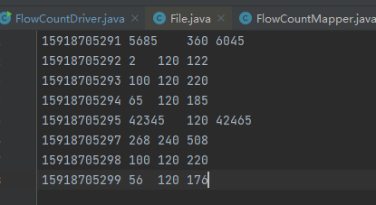
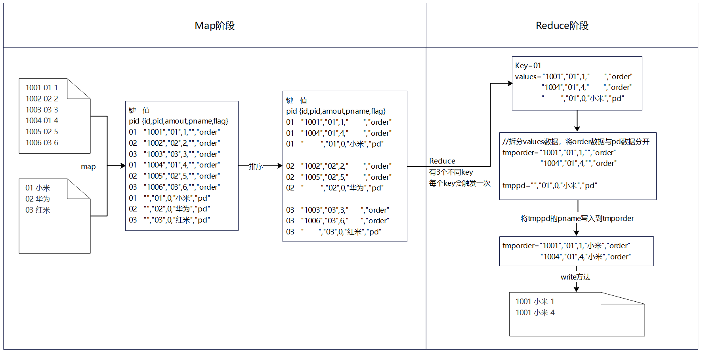
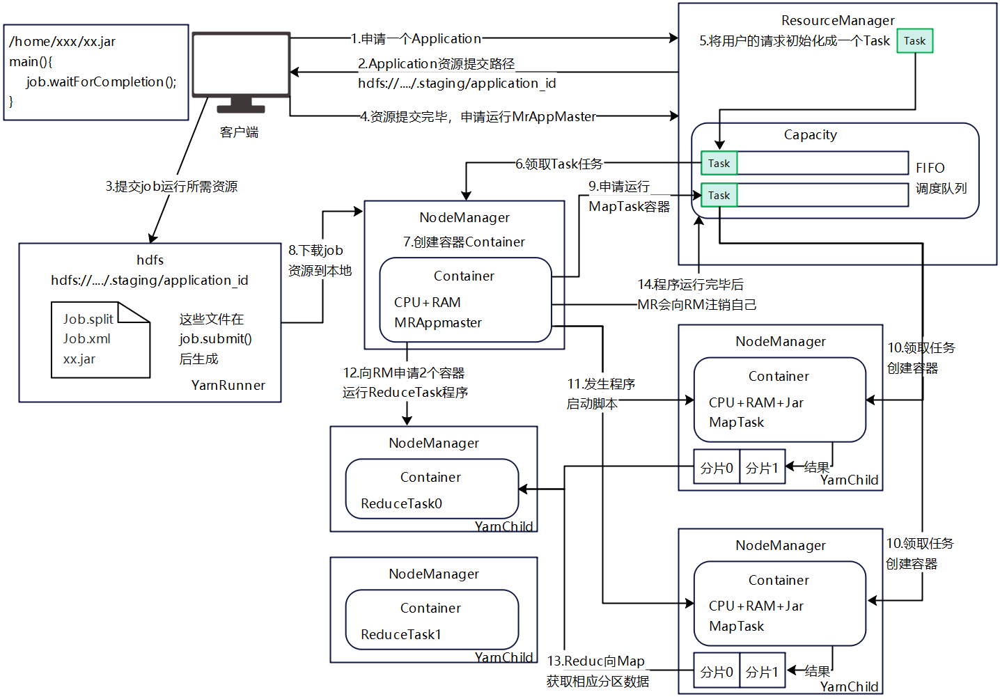

# Hadoop2.x-基础(MapReduce)

## MapReduce简介

> MapReduce是一个分布式运算程序的编程框架，是用户开发“基于Hadoop的数据分析应用”的核心框架
>
> MapReduce核心功能是将用户编写的业务代码和自带默认组件整合成一个完整的分布式运算程序，并运行再一个Hadoop集群上

### 优缺点

> 优点：
>
> 1. MapReduce易于编程：只需要简单实现一些接口，就可以完成一个分布式程序，如果你要编写一个分布式程序，你只需要根据MapReduce规范编写一个简单的串行程序一模一样，最终由MapReduce帮你完成在分布式下的资源调度与计算你只需专注与业务，这使得MapReduce编程变的非常流行
> 2. 良好的扩展性：当你计算机资源不满足当前运算的实现，只需要通过简单的增加机器来扩展它的计算能力
> 3. 高容错性：MapReduce设计初衷就是使程序能够不是在廉价的PC机器上，这一特点使得MapReduce具备高容错性，比如一台机器挂了，它可以把上面的计算任务转移到路外一个节点上运行，不至于这个任务运行失败，而且这个过程无需人工参与，由Hadoop内部完成的
> 4. 适合PB级以上海量数据的离线处理：可以实现上千服务器并发工作
>
> 缺点：
>
> 1. 不擅长实时计算：MapReduce无法像Mysql一样在毫秒或秒级返回结果
> 2. 不擅长流式计算：流式计算的输入数据是动态的，而MapReduce的输入数据集是静态的，不能动态变化，这是因为MapReduce自身的设计特点决定了数据源必须是静态的
> 3. 不擅长DAG(有向图)计算)：多个应用存在依赖关系，后一个应用程序的输入为前一个的输出，在这种情况下，MapReduce并不是不能做，而是使用后每个MapReduce作业的输出结果都会写入到磁盘，会造成大量的磁盘IO，导致性能非常地下

### 核心思想

> MapReduce的核心思想
>
> 1. MapReduce运算程序一般需要分成2个阶段Map阶段和Reduce阶段
> 2. Map阶段的并发MapTask，完全并行运行，互不相干
> 3. Reduce阶段的并发ReduiceTask，完全不相干但是它们的数据依赖上一个阶段的所有MapTask并发实例输出
> 4. MapReduce编程模型只能包含一个Map阶段和一个Reduce阶段，如果用户的业务逻辑非常复杂，那就只能多个MapReduce程序串行执行

### 工作进程

> 一个完整的MapReduce程序在分布式运行时有三类实例进程
>
> 1. MrAppMaster：负责整个程序的过程调度及状态协调
> 2. MapTask：负责Map阶段的整个数据处理流程
> 3. ReduceTask：负责Reduce阶段的整个数据处理流程

### 数据序列化类型

> java中数据类型对于Hadoop中数据序列化类型

| Java类型 | Hadoop Writable类型 |
| -------- | ------------------- |
| boolean  | BooleanWritable     |
| byte     | ByteWritable        |
| int      | IntWritable         |
| folat    | FolatWritable       |
| long     | LongWritable        |
| double   | DoubleWritable      |
| String   | TextWritable        |
| map      | MapWritable         |
| array    | ArrayWritable       |

### 编码规范

> 编写MapReduce程序，需要按照hadoop提供的一套固定的编码规范

**Mapper阶段**

> 1. 用户自定义的Mapper要继承自己的父类
> 2. Mapper的输入数据是KV对的形式（KV的类型可自定义）
> 3. Mapper的业务逻辑写在map()方法中
> 4. Mapper的输出数据的KV对的形式(KV的类型可自定义)
> 5. map()方法(MapTask进程)对每一个<K,V>调用一次

**Reducer阶段**

> 1. 用户自定义的Reducer要继承自己的父类
> 2. Reducer的输入类型对应Mapper的输出类型，也是KV
> 3. Reducer的业务逻辑写在reduce()方法中
> 4. ReduceTask进程对每一组相同k的<K,V>组调用一次reduce()方法

**Driver阶段**

> 相当于YARN集群的客户端，用于提交我们整个程序刀YARN集群，提交的是封装了MapReduce程序相关运行参数的job对象

## 实现单词统计

> 在之前都是使用官方案例完成单词统计的，现在我们根据Hadoop的规范自己别一个单词统计的案例
>
> 本文章所有案例仓库：https://gitee.com/smallpage/big-data-demo.git

### 实例代码

**pom文件**

~~~xml
<dependency>
    <groupId>junit</groupId>
    <artifactId>junit</artifactId>
    <version>4.13.2</version>
    <scope>test</scope>
</dependency>
<dependency>
    <groupId>org.apache.logging.log4j</groupId>
    <artifactId>log4j-core</artifactId>
    <version>2.8.2</version>
</dependency>
<dependency>
    <groupId>org.apache.hadoop</groupId>
    <artifactId>hadoop-common</artifactId>
    <version>2.7.2</version>
</dependency>
<dependency>
    <groupId>org.apache.hadoop</groupId>
    <artifactId>hadoop-client</artifactId>
    <version>2.7.2</version>
</dependency>
<dependency>
    <groupId>org.apache.hadoop</groupId>
    <artifactId>hadoop-hdfs</artifactId>
    <version>2.7.2</version>
</dependency>
~~~

**编写Map类**

> 根据编码规范Hadoop程序最新执行的是Map类，创建一个WordCountMapper继承Mapper类

**编写Reducer类**

> 根据编码规范Hadoop程序Map阶段完毕后会执行Reducer，创建一个WordCountReducer继承Reducer类

**编写Driver类**

> Driver是整个MapReducer程序的加载器，它负责创建一个job并且提交

### 测试

> 编写Map、Reduce、Driver后可以执行main方法进行本地测试，传入输入输出路径

> 可以看到程序成功执行，并且在指定的输出位置生成了相应的文件

### 发布到Hadoop集群

**修改pom**

> 在pom文件中添加 如下打包参数

~~~xml
<build>
    <plugins>
        <plugin>
            <artifactId>maven-compiler-plugin</artifactId>
            <configuration>
                <source>1.8</source>
                <target>1.8</target>
            </configuration>
        </plugin>
        <plugin>
            <artifactId>maven-assembly-plugin</artifactId>
            <configuration>
                <descriptorRefs>
                    <descriptorRef>jar-with-dependencies</descriptorRef>
                </descriptorRefs>
                <archive>
                    <manifest>
                        <mainClass>top.jolyoulu.wordcount.WordCountDriver</mainClass>
                    </manifest>
                </archive>
            </configuration>
            <executions>
                <execution>
                    <id>make-assembly</id>
                    <phase>package</phase>
                    <goals>
                        <goal>single</goal>
                    </goals>
                </execution>
            </executions>
        </plugin>
    </plugins>
</build>
~~~

> 打包完毕会看到有2个jar包，with-dependencies结尾是附带着hadoop依赖的可以直接运行，因为我们在hadoop集群是带有hadoop依赖的所有只需要使用不带with-dependencies包即可

**上传jar包**

> 将jar包上传到hadoop集群中

**执行程序**

> 在hdfs的/test文件夹下准备一个需要测试的文件，如果执行如下命令对该文件的单词进行统计

~~~shell
hadoop jar word-count1-1.0-SNAPSHOT.jar top.jolyoulu.wordcount.WordCountDriver /test/t1.txt /test/t1_out.txt
~~~

> 执行完毕后将结果文件下载后可以看到，统计结果

## Hadoop序列化

> 由于Java自带的序列化Serializable，对象序列化后附带信息较多不便于高效的在网络中传输，所有Hadoop自己实现了一套序列化机制(Writale)

### 特点

> 1. 紧凑：高效利用存储空间
> 2. 快速：读写数据的额外开销小
> 3. 可扩展：随着通信协议的升级而升级
> 4. 互操作：支持多语言的交互

### 自定义序列化

> 在前面讲到的Hadoop提供的数据序列化类型，在一些复杂业务上是无法满足需求的，Hadoop提供了自定义的序列化类型，分为如下步骤
>
> 1. 实现Writable接口
>
> 2. 生成空参构造，反序列化时，需要反射调用空参构造函数
>
> 3. 重写序列化方法
>
> 4. 重写反序列化方法
>
> 5. 要想把结果显示在文件中，需要重写toString()，可用"\t"分开，方便后续用
>
> 6. 如果需要将自定义的bean对象放到key中传输，则需要实现Comparable接口，因为MapReduce中的Shuffle过程要对key进行排序
>
> 注意：序列化与放序列化的顺序需要完全一致

~~~java
//1.实现Writable接口
public class FlowBean implements Writable {

    private long upFlow;   //上行流量
    private long downFlow; //下行流量
    private long sumFlow;  //总流量

    //2.生成空参构造
    public FlowBean() {
    }

    //3.重写序列化方法
    @Override
    public void write(DataOutput out) throws IOException {
        //注意：序列化与放序列化的顺序需要完全一致
        out.writeLong(upFlow);
        out.writeLong(downFlow);
        out.writeLong(sumFlow);
    }

    //4.重写反序列化方法
    @Override
    public void readFields(DataInput in) throws IOException {
        //注意：序列化与放序列化的顺序需要完全一致
        upFlow = in.readLong();
        downFlow = in.readLong();
        sumFlow = in.readLong();
    }

    //5.重写toString()
    @Override
    public String toString() {
        return upFlow + "\t" + downFlow + "\t" + sumFlow;
    }

    //以下省略get/set方法
}
~~~

### 自定义序列化案例

> 以下是利用自定义序列化对，指定的手机下载与上传流量进行分组合并统计，统计的数据格式如下

**编写Map类**

> Map接收每一行的字符串数据，进行切割提取转换为自定义的FlowBean对象，key为手机号码

**编写Reducer类**

> Reducer阶段对所有的key相同的FlowBean的上传与下载流量进行合计最后输出结果

**编写Driver类**

**测试**

> 测试结果如下

## MapReduce原理

### InputFormat数据输入

#### FileInputFormat切片

> FileInputFormat是Hadoop的默认切片机制，即对文件流进行切割

##### 切片过程

> 在Hadoop执行的前期阶段会生成相应的job，在生成job时就会有`FileInputFormat#getSplits`对数据进行切片，切片的过程如下
>
> 1. 先找到难度数据存储目录
>
> 2. 开始遍历整个目录的每一个文件，进行规划切片
>
> 3. 遍历每个文件时的工作如下
>
>    * 获取文件大小`fs.szieOf()`
>
>    * 计算切片大小`computeSplitSize(blockSize, minSize, maxSize)`
>
>      核心代码：`Math.max(minSize, Math.min(maxSize, blockSize))`
>
>      minSize = 1
>
>      maxSize = mapreduce.input.fileinputformat.split.maxsize 配置的大小
>
>      blockSize= hdfs中的block大小 (默认情况下的值)
>
>    * 开始切片，形成第1个切片：xxx.txt—0:128M、形成第2个切片：xxx.txt—128:256M、形成第3个切片：xxx.txt—256:300M
>
>      每次进行切片时都会判断当前剩余的快大小是否大于切片大小的1.1倍，大于就进行切
>
> 4. 将切片信息写到一个切片规划文件中
> 5. 整个切片的核心过程在getSplit()方法中完成
> 6. InputSplit只记录切片的源数据信息，比如起始位置、长度以及所在的节点列表等
> 7. 提交到YARN上，YARN上的MrAppMaster就可以根据切片规划文件计算开启MapTask个数

##### 切片机制

> 1. 简单按照文件的内容长度进行切片
> 2. 切片大小，默认等于block大小
> 3. 切片不考虑数据集整体，而是逐个针对每个文件单独切片

##### 切片参数

> 从源码中可以得到切片的计算公式如下
>
> Math.max(minSize, Math.min(maxSize, blockSize))
>
> minSize = mapreduce.input.fileinputformat.split.minsize 配置的大小
>
> maxSize = mapreduce.input.fileinputformat.split.maxsize 配置的大小
>
> blockSize= hdfs中的block大小 (默认情况下的值)

##### 参数控制

> 可以通过调整maxSize 和 minSize 控制切片规则
>
> maxSize(切片最大值)：参数如果设置的比blockSize小，则会使用maxSize作为切片大小
>
> minSize(切片最小值)：参数如果设置的比blockSize大，则会使用minSize作为切片大小

**获取切片信息api**

~~~java
//根据文件类型获取切片信息
FileSplit inputSplit = (FileSplit) context.getInputSplit();
//获取切片的文件名称
inputSplit.getPath().getName();
~~~

#### CombineTextInputFormat切片

> 框架默认使用的是TextInputFormat按文件规划切片，不管文件大小都会单独切一个片提交给MapTask，如果有大量的小文件就会产生大量的MapTask，处理效率急剧下降

##### 应用场景

> CombineTextInputFormat用于小文件过多的场景，它可以将多个小文件逻辑上规划到一个切片中，这样多个小文件就可以一起交给一个MapTask处理

##### 参数设置

> 设置4M `CombineTextInputFormat.setMaxInputSlitSize(job,1024 * 1024 * 4); `
>
> 虚拟存储切片最大设置最后根据实际的小文件大小情况来设置

##### 切片机制

> 加入setMaxInputSlitSize值为4M，当前有4个文件小文件，切片流程如下
>
> 1. 首先会进行虚拟存储
>    * 如 文件<4M，形成一个切片
>    * 如 4M<文件<4M * 2，将文件/2，形成2个切片
>    * 如 文件>4M * 2，文件划分出一块4M大小做虚拟存储，剩余的文件继续继续判断划分直到划分完毕为止
> 2. 将切换的块依次从上往下合并，直到>4M就生成一个切片
>
> 最终4个小文件被切成4个切片

##### 实现过程

> 如果需要修改InputFormat只需要在Driver类中添加如下代码即可

~~~java
//如果不设置InputFormat默认使用的是TextInputFormat.class
job.setInputFormatClass(CombineFileInputFormat.class);
//虚拟存储切片最大值设置4M，一般根据实际环境设置通常设置128M
CombineFileInputFormat.setMaxInputSplitSize(job,1024 * 1024 * 4);
~~~

#### FileInputFormat实现类

> 在运行MapReduce程序时，输入的文本格式可以为日志文件、二进制文件、数据库表等针对不同的文件有不同的FileInputFormat实现类实现读取逻辑

**实现类**

| 类名                    | 说明                                                         |
| ----------------------- | ------------------------------------------------------------ |
| TextInputFormat         | 纯文本文件处理，以换行符做为切割拆分读取                     |
| KeyValueTextInputFormat | 纯文本文件处理，以换行符做为切割，行由分隔符字节分为键和值部分，如果不存在这样的字节，则键将是整行，值将为空 |
| NLineInputFormat        | 根据行数切片，按照设定n继续数据切片                          |
| CombineTextInputFormat  | 对小文件继续合并                                             |
| 自定义InputFormat       | 自己实现InputFormat                                          |

##### TextInputFormat

> TextInputFormat是默认的FileInputFormat实现类，按行读取每条记录读取完毕后形成的KV内容如下
>
> key：存储该行在整个文件中的起始偏移量，LongWritable类型
>
> value：存储该行的内容，不保存终止符(换行符或回车符)，Text类型_

##### KeyValueTextInputFormat

> KeyValueTextInputFormat每一行一条记录，利用分隔符分割key与value，可以通过在驱动添加如下配置

~~~java
//设置用空格作为间隔符
conf.set(KeyValueLineRecordReader.KEY_VALUE_SEPERATOR," ");
//使用KV格式化
job.setInputFormatClass(KeyValueTextInputFormat.class);
~~~

##### NLineInputFormat

> NLineInputFormat代表每个map进程处理的InputSplit不再按Block块去划分，而是按NLineInputFormat指定的行数N来划分，即输入文件的总数/N=切片数，如果不整除则切片数=商+1
>
> 注意NLineInputFormat与CombineTextInputFormat控制的是切片规则

~~~java
//设置切片 与 2行1个切片规则
job.setInputFormatClass(NLineInputFormat.class);
NLineInputFormat.setNumLinesPerSplit(job,2);
~~~

##### 自定义InputFormat

> Hadoop也提供了自定义的InputFormat可以根据特定情况编写特定是切片规则
>
> 自定义InputFormat步骤如下
>
> 1. 自定义继承FileInputFormat
> 2. 改写RecordReader，实现一次性读取一个完整文件封装成KV
> 3. 再输出时使用SequenceFileOutPutFormat输出合并文件

**案例代码**

> 在前面介绍过合并小文件可以使用CombineTextInputFormat，我们也可以通过自定义的InputFormat来实现一个小文件合并，将多个小文件合并成一个SequenceFile文件，SequenceFile文件是Hadoop用来存储二进制形式的key-value对的文件个数，SequenceFile里面保存着多个文件，存储形式为文件路径+名称key，文件内容是value
>
> 需求：当前有3个文件one.txt、two.txt、three.txt，因为3个都是小文件希望将它们合并到一个文件内容里面去，key为文件路径，value为文件内容

**实现步骤**

> 1. 继承一个FileInputFormat
>    * 重写isSplitable()方法，返回false不可切割
>    * 重写creatRecordReader()，创建自定义的RecordReader对象，并初始化
> 2. 改写RecordReader，实现一次读取一个完整文件封装为KV
>    * 采用IO流一次读取一个文件输出到value中，因为设置了不可切片，最终把所有文件都封装到value中
>    * 获取文件路径信息+名称，并设置key
> 3. 设置Driver
>    * job.setInputFormatClass(自定义的class)
>    * job.setOutputFormatClass(自定义的class)

**WholeFileInputFormat**

> 编写WholeFileInputFormat继承FileInputFormat实现createRecordReader方法，在读取到一个切片时最先会触发该方法，该方法需要返回一个RecordReader对象，Mapper通过读取不断的读取该对象中的key，value触发map方法

**WholeRecordReader**

> WholeRecordReader是一个非常重要的类，因为分片信息在读取后会给到该对象，然后该对象会返回给Mapper，Mapper通过不断的调用nextKeyValue()方法获取key与value以及，该方法返回的boolean也是判断该分片的map阶段是否已经完成的依据
>
> 由于我们是把整个小文件的数据以key与value返回所有key是文件的路径，value是整个分片文件的内容，只需要读取一次所有首先nextKeyValue()方法返回true，接下来就设置false表示该分片已经全部读取完毕了

**SequenceFileMapper**

> SequenceFileMapper继承Mapper，接收key与value参数与WholeRecordReader一致
>
> 由于WholeRecordReader中一个分片只会有一个key和value所有map阶段不用处理直接将内容输出给reducer阶段

**SequenceFileReducer**

> SequenceFileReducer继承Reducer，接收key与value参数与SequenceFileMapper输出一致
>
> 在Reducer要将3个Map的内容全部合并到一个文件中，所有需要遍历所有values并且输出即可

**SequenceDriver**

> 最后编写驱动类，驱动类基本结构与之前的一样就是需要多添加2个配置`设置inputFormat和outputFormat`

**运行测试**

> 准备3个小文件，因为这样可以确保每个文件不会大于128M，即每个小文件都会被当做一个切片进行

> 运行测试后可以看到输出结果文件中保存形式，key为文件路径，value为文件内容，这样就将多个小文件合并到一个文件中，当下次需要读取时只需要读取该结果文件就可以获取到3个文件的地址以及数据

### Shuffle机制

> Map方法后，Reduce方法之前的数据处理过程称为Shuffle

#### Partition分区

> 在一些业务下会需要将统计结果按照条件输出到不同的文件中(分区)，比如：根据商品不同分类输出到不同文件中，默认情况下Map后的数据会根据key的hashcdoe对reduceTask大个数进行取模得到分区，用户无法控制那个key对应那个分区

##### 自定义Partition

> 默认的分区是根据hash进行分区的，如果需要根据自己所需进行分区那么只需要
>
> 1. 继承Partitioner重写getPartition方法
> 2. 在Job驱动中设置自定义的Partition
> 3. 自定义Partition后，要根据自定义的Partition的逻辑设置相应数量的ReduceTask
>
> 需求：在Hadoop序列化章节中我们做过对手机号码合计流量的案例，下面我们在那个案例的基础上啊对手机号码开头3位进行分类，分别将154，155，156开头的手机分3个放假输出，其余手机放到相同文件中

**CustomPartitioner**

> 继承Partitioner重写getPartition方法并且根据需求返回不同的numPartitions，就可以输出到指定的Partitioner文件中

**FlowCountDriver**

> 修改驱动类，在原有的基础上关联上自定义的Partitioner类以及设置ReduceTasks数量，ReduceTasks数量要和你要输出的分区总数一致

**测试**

> 执行测试后可以看到输出结果被拆分成多个分区，并且手机号码根据自定义的分区规则都被存放到指定的文件下

#### 排序

> 排序是MapReduce框架的重要操作之一，MapTask和ReduceTask都会对key进行排序，该操作是Hadoop的默认行为，任何程序中的数据均会被排序，而不管逻辑上是否需要
>
> 默认排序是按照字典顺序排序，且实现该排序的方法是快速排序

##### MapTask排序

> 对于MapTask，它会将处理的结果暂时放到环形缓冲区，当环形缓冲区使用率达到一定阈值后，再对缓存区中的数据进行一次快速排序，并将有序数据溢写到磁盘上，而当数据处理完毕后，它会对磁盘上所有文件进行归并排序

##### ReduceTask排序

> 对于ReduceTask，它从每个MapTask上远程拷贝相应的数据文件，如果文件大小超过一定阈值，则溢写磁盘上，否则存储在内存中，如果磁盘上文件数目达到一定阈值，则进行一次归并排序以生成更大文件，如果内存中文件大小或者数量超过一定阈值，则进行一次合并后将数据溢写到磁盘上，当所有数据拷贝完毕后，ReduceTask统一对内存和磁盘上所有数据进行一次归并排序

##### 排序的分类

> MapReduce共分4类型
>
> 1. 部分排序：MapReduce根据记录的键对数据进行排序，保证输出的每个文件有序
> 2. 全排序：最终输出结果只有一个文件，且文件内部有序，实现方式是只设置一个ReduceTask，但该方法处理大型文件时效率极低，因为一台机器处理所有文件，完全丧失了MapReduce所提供的并行架构
> 3. 辅助排序：在Reduce端对Key进行分组，应用于：在接收的key为bean对象时，想让一个或几个字段相同(全部字段比较不同)的key进入到相同一个reduce方法时，可以采用分组排序
> 4. 二次排序：在自定义排序过程中，如果compareTo中的条件为2个即为二次排序

##### WritableComparable自定义排序

###### 应用场景

> bean对象作为key传输，需要实现WritableComparable接口重写compareTo方法，就可以实现排序

###### 排序案例

> 我们对前面的 Hadoop序列化-自定义序列化案例的结果文件进行排序，在统计每个手机总消耗流量后对总流量进行排序

**编写Bean类**

> 因为输出的结果需要排序，所有bean类需要实现WritableComparable接口，相比正确的Writable，WritableComparable接口需要多实现一个compareTo方法，该方法就是用于排序的

**编写Map类**

> Mapper无太多改动，只是将bean作为了map阶段的key，而不是用手机号码

**编写Reducer类**

> Reducer，再次将key，value交换，手机号码作为key，bean作为value输出

**编写Driver类**

> Driver无改动，还是使用相同的模板

**测试**

> 执行driver后可以看到每个手机号码使用的总流量降序排序

###### 分区内排序案例

> 在多数情况下Reduce是多个而不是1个，所有接下来就对上面例子进行改造对分区进行排序

**编写Partitioner**

> 编写Partitioner实现好相应的分区规则

**修改Driver**

> 修改驱动类，增加分区规则和分区数量

**测试**

#### Combiner合并

> Combiner是Mapper和Reducer之外的一种组件，Combiner组件的父类就是Reducer，Combiner和Reducer的区别在于运行的位置Combiner总是在每个MapTask所在节点运行，Reducer是接收全局所有的Mapper的输出结果
>
> Combiner的一样就是对每个MapTask的输出进行局部汇总，以减少网络传输量，Combiner能够应用的前提是不能影响最终的业务逻辑，而且Combiner的输出kv应该跟Reducer的输入kv类型要对应起来
>
> Combiner在MapTask后进行一次合并这样可以使得ReduceTask需要接收的数据集更加小节省网络资源，不过Combiner并不时候运用在所有场景，只适合计算统计下使用，如计算平均值可能会由于Combiner的局部汇总导致结果错误

##### Combiner案例

> 根据上图的需求，我们需要利用Combiner对MapTask得出的数据进行局部合并后在给ReduceTask，实现Combiner合并的方法有2种
>
> 第1种：增加一个WordCountCombiner类继承Reducer，在WordCountCombiner类种实现统计单词的汇总将结果输出
>
> 第2种：直接将WordCountReducer作为Combiner在Driver中指定job.setCombinerClass(WordCountReducer.class)

**编写Map类**

> Map节点负者读取数据，并且组合成kv后输出

**编写Combiner类**

> Combiner对Map节点的数据进行一次局部的合并，这样可以优化整个执行的效率

**编写Reduce类**

> Reduce将不同的MapTask传输来的数据进行一次最终的汇总输出，从这里可以发现Combiner和Reduce中代码中的合并逻辑是一致的所有在编写时有个方案二是直接使用`job.setCombinerClass(WordCountReducer.class);`也是可以的

**编写Driver类**

> Driver中使用`job.setCombinerClass(WordCountCombiner.class);`关联Combiner类

**测试**

> 结果是没问题，不过通过结果查看并不明显，需要在WordCountCombiner和WordCountReducer打断点后就可以看到执行逻辑了

#### GroupingComparator分组案例

> GroupingComparator即分组+排序，在数据进入Reduce之前可以对数据进行一次分组排序
>
> 如图从左往右分别是 订单、商品、价格
>
> 需求：需要对图中数据根据订单分组，然后对商品价格进行排序获取最贵的

**编写Bean**

> 经过分析需要获取的是每个订单的价格最高的数据，那么需要定义一个Bean中包含orderId和price，并且有OrderBean作为Key，由于需要获取最高价格所以需要对Key进行排序需要重写compareTo方法，将相同订单放一起并且根据价格降序

**编写Map**

> Map阶段会读取拆分数据，将订单号和价格提出来，作为Key传输到Reduce中

**编写Reduce**

> Reduce做不做任何处理只需要将数据输出即可

**编写GropingComparator**

> GropingComparator是整个阶段的最重要的部分，该类继承了WritableComparator重写了compare方法，在执行Reduce方法时会一直使用GropingComparator.compare方法进行比较传入Reduce的参数，直到当compare发生一次不为0之后的第二次0的适合这时就会触发reduce方法写出数据

**编写Driver**

> 编写启动类，和平时相比需要增加多啊`job.setGroupingComparatorClass(OrderGroupingComparator.class);`参数

**测试**

### OutputFormat数据输出

> OutputFormat是MapReduce输出的基类，所有实现MapReduce输出都实现了OutputFormat接口，OutputFormat实现类分如下几种
>
> 1. 文本输出TextOutputFormat：默认的输出格式是TextOutputFormat，它把每条数据输出为文本，它的键和值可以是任意类型，以为TextOutputFormat调用toString()方法把它转换为字符串
> 2. SequceFileOutputFormat：将SequceFileOutputFormat输出作为后续MapReduce任务的输入，这便是一种好的输出格式，因为它的格式紧凑，很容易被压缩
> 3. 自定义OutputFormat：根据用户需求，自定义实现输出

#### 自定义OutputFormat

##### 应用场景

> 自定义OutputFormat可以使得用户能够高度的自定义输出路径，如保存到Mysql、Redis、指定磁盘路径等

##### 实例代码

> 需求：当前有一个用户访问请求的日志文件，需要在MapReduce时将所有包含baidu的请求保存到baidu.log文件中，剩余其它请求就保存到other.log文件中

**编写Map**

**编写Reduce**

**编写OutPutFormat**

> FilterOutputFormat需要继承FileOutputFoemat重写getRecordWriter，在getRecordWriter中需要返回一个RecordWriter的实例，该实例就是具体的自定义输出

> RecordWriters 是自定义输出的具体实现，其中需要编写几个属于方法
>
> 1. 构造方法：可以得到job，在job中可以获取到文件系统，这样就可以对文件系统进行操作
> 2. write：但数据需要写出时会调用该方法
> 3. close：输出完毕后需要关闭流

**编写Driver**

> 在Driver中需要使用`job.setOutputFormatClass(FilterOutputFormat.class);`指定自定义的输出，虽然输出有自定义的实现但是并不代表`FileOutputFormat.setOutputPath`就不用写了，使用自定义输出后结果是自定义输出了，不过在setOutputPath中会输出一些执行结果如SUCCESS

**测试**

> 在指定位置可以发现出现了2个文件，baidu.lgo和other.log，打开文件后内容显示无问题

## MapReduce工作机制

### MapTask工作机制

### ReduceTask工作机制

### Shuffle工作机制

## Join多种应用

### Reduce Join工作原理

> Map阶段的主要工作：为来自不同表或文件的key/value对，打标签以区别不同来源的记录，然后用连接字段作为key，其余部分和新加的标注作为value，最后进行输出
>
> Reduce阶段主要工作：在Reduce端以连接字段作为key的分组已经完成，我们只需要在每一个分组当中将那些来源于不同文件的记录(在Map阶段已经打标志)分开，最后进行合并就ok了
>
> 缺点：由于合并工作集中在Reduce阶段，假如Map阶段数据量极大时那么再Reduce阶段进行数据合并会是一个极其消耗时间的过程

### Reduce Join案例

> 需求，当前有2个文件，需要将该2个文件中的相同pid的数据进行组合，输出一个新的数据

> 思路如图

**编写Bean**

> 编写bean，该bean可以同时保存order.txt和pd.txt中的数据信息

**编写Map**

> Map阶段通过setup获取到当前分片的文件名称后，通过分片的名称区分不同的数据对tableBean进行不同的封装，最后将pid作为key，tableBean作为value进行输出

**编写Reducer**

> Reducer阶段时会获取到key相同的一组values数据，对value数据进行遍历分类order添加到list，pd添加到pd对象中，分类完毕后通过遍历order数组足个写入pd中的pname，输出即可

**编写Driver**

> 驱动类无特殊参数，使用最基本的设置即可

**测试**

> 查看测试结果

### Map Join工作原理

> Map Join时候在一个表十分小，一个表十分大的情况下合并
>
> 思路：在Map端缓存小表，在读取大表数据时去查询已缓存的小表从而在Map端完成数据的合并，减少Reduce数据的压力

### Map Join案例

> 具体办法：
>
> 1. 在Mapper的setup阶段，将文件读取到缓存集合中
> 2. 在驱动函数中加载缓存`job.addCacheFile(new URI("文件路径"))`

**编写Driver**

> 首先写Driver，Driver去平时写法有差别
>
> 1. 因为没有Reduce阶段，无需编写`job.setReducerClass`
> 2. 因为将Map直接作为最终输出，无需编写`job.setMapOutputKeyClass`,`job.setMapOutputValueClass`
> 3. 加载指定缓存文件`job.addCacheFile`
> 4. 设置0ReduceTask`job.setNumReduceTasks(0)`

**编写Map**

> setup方法：通过context可以获取到driver中加入缓存的文件路径，使用流的方式读取该文件编写加入到一个map容器中
>
> map方法：具体的合并逻辑，读取order.txt的每行数据，将数据中的pid通过预先加入缓存的pdMap获取到相应的value，重写组合数据输出即可

**测试**

> 成功将pid的编号该为对应的值

## 计数器应用

> Hdoop为每个作业维护若干内置计数器，以描述多项指标，例如某些计数器记录已处理字节数和记录数，使用户可监控已处理的输入数据量和已产生的输出数据量
>
> 计数器是Hadoop非常重要的调试工具，计数器的使用在后面的数据清洗案例中有说明

**计数器采用枚举的方式统计计数**

~~~java
enum MyCounter{MALFORORMED,NORMAL}
//对枚举定义的自定义计数器加1
context.getCounter(MyCounter.MALFORORMED).increment(1)
~~~

**采用计数器组、计数器名称的方式统计**

~~~java
//计数器组名字随便起，最好有意义的
context.getCounter("countGroup","counter").increment(1)
~~~

## 数据清洗

> 在运行MapReduce程序之前，往往需要先对数据进行清洗，清理掉不符合用户要求的数据，清理的过程中往往只需要运行Mapper程序，不需要运行Reduce程序

### 实例代码

> 假如当前要对某个文件中的数据进行数据清洗将来去除一些长度不够11的数据，实现代码如下
>
> 数据清洗就是过滤数据，常常在Map阶段完成所有大部分情况下使用的是MapJoin完成

**编写Map**

**编写Drive**

**测试**

> 测试结果可以看到，计算机中返回符合条件的数据与文件中总行数是一样的

## 数据压缩

> 数据压缩能够减少底层存储系统(HDFS)读写字节数，压缩提高了网络带宽和磁盘空间的效率，再运行MR程序是，i/o操作、网络操作、shuffle和Merge都要花费大量的时间，尤其再数据规模很大的工作负载密集的情况下，如果能够使用数据压缩那么可以提高数据的处理
>
> 压缩是提高hadoop运行效率的一种优化策略，通过对Mapper、Reducer运行过程的数据进行压缩，以减少磁盘IO提高MR程序运行速度
>
> 注意：采用压缩技术减少了磁盘IO，但同时增加了CPU运算负担，所以压缩特性运用得当能高性能，但是运用不当也可能降低性能
>
> 压缩原则：1、运算密集型job，少用压缩 2、IO密集型job，多用压缩

### MR支持的压缩编码

| 压缩格式 | 是否自带     | 算法    | 文件扩展名 | 是否可切分 | 换成压缩格式后原程序是否需修改 |
| -------- | ------------ | ------- | ---------- | ---------- | ------------------------------ |
| DEFLATE  | 是，直接使用 | DEFLATE | .deflate   | 否         | 和文本处理一样，无需修改       |
| Gzip     | 是，直接使用 | DEFLATE | .gz        | 否         | 和文本处理一样，无需修改       |
| bzip2    | 是，直接使用 | bzip2   | .bz2       | 是         | 和文件处理一样，无需修改       |
| LZO      | 否，需安装   | LZO     | .lzo       | 是         | 需要建索引，还需要指定输入格式 |
| Snappy   | 否，需安装   | Snappy  | .snappy    | 否         | 和文件处理一样，无需修改       |

### 压缩方式说明

#### Gzip压缩

> 优点：压缩效率比较高，而且压缩/解压速度也比较快，Hadoop本身支持，在应用中处理Gzip格式的文件就和直接处理文本一样，大部分Linux系统自带Gzip命令，使用方便
>
> 缺点：不支持Split
>
> 应用场景：当每个文件压缩后在130M以内的(1个块大小内)，都可以考虑Gzip压缩格式，例如说一天活一个小时的日志压缩成一个Gzip文件

#### Bzip2压缩

> 优点：支持Split，具有很高的压缩率，比Gzip压缩率都高，Hadoop本身自带，使用方便
>
> 缺点：压缩/解压速度慢
>
> 应用场景：适合对速度要求不高，但需要较高的压缩率的时候，例如输出之后的数据较大处理后的数据需要压缩存档并且以后数据用的比较少的情况，或对单个很大的文本文件想压缩减少储存空间同时又要支持Split，并且需要兼容之前的程序应用

#### Lzo压缩

> 优点：压缩/解压速度比较块，合理的压缩率，支持Split是Haddop中最流行的压缩格式，在Linux系统下安装lzop命令，使用方便
>
> 缺点：压缩率比Gzip要低一些，Hadoop本身不支持，需要安装在应用中对Lzo格式的文件要做特殊处理(为了支持Split需要建立索引，还需要指定InputFormat未Lzo格式)
>
> 应用场景：一个很大的文本文件，压缩之后还大于200M以上的可以考虑而且单个文件越大Lzo优点越明显

#### Snappy压缩

> 优点：高速压缩速度和合理的压缩率
>
> 缺点：不支持Split，压缩率比Gzip要低，Hadoop本身不支持，需要安装
>
> 应用场景：当MapReduce作业的Map输出的数据比较大的时候，作为Map到Reduce的中间数据的压缩格式，或者作为一个MapReduce作业的输出和另外一个MapReduce作业的输入

### 压缩位置的选择

> Map输入端：在有大量数据并计划重复处理的情况下，应该考虑对输入数据进行压缩，你无需显示的指定使用的编码方式，Hadoop会自动检查文件扩展名如果扩展名匹配，就会使用恰当的编解码方式对文本进行压缩和解压，否则Hadoop不会使用任何编码器
>
> Map输出端：当Map任务输出的中间数据量很大时，应考虑在此阶段采用压缩技术这能显著的改善内部数据的Shuffle过程，而Shuffle过程Hadoop处理过程是消耗资源最多的环节，如果数据量打会造成网络传输缓慢，应该考虑使用压缩技术
>
> Reduce输出端：在此阶段启用压缩技术能够减小呀存储的数据量，因此降低所需的磁盘空间

### 压缩参数配置

| 参数                                                         | 默认值                                                       | 阶段        | 建议                                                |
| ------------------------------------------------------------ | ------------------------------------------------------------ | ----------- | --------------------------------------------------- |
| io.compression.codecs （在core-site.xml配置）            | org.apache.hadoop.io.compress.DefaultCodec org.apache.hadoop.io.compress.GzipCodec org.apache.hadoop.io.compress.BZip2Codec | 输入压缩    | Hadoop使用文件扩展名判断是否支持某种编码器          |
| mapreduce.map.output.compress （在mappred-site.xml配置） | false                                                        | mapper输出  | 该参数设置true后表示启动压缩                        |
| mapreduce.map.output.compress.codec （在mappred-site.xml配置） | org.apache.hadoop.io.compress.DefaultCodec                   | mapper输出  | 在开启mapper输出压缩后这里配置使用那种压缩方式输出  |
| mapreduce.output.fileoutputformat.compress （在mappred-site.xml配置） | false                                                        | reducer输出 | 该参数设置true后表示启动压缩                        |
| mapreduce.output.fileoutputformat.compress.codec （在mappred-site.xml配置） | org.apache.hadoop.io.compress.DefaultCodec                   | reducer输出 | 在开启reducer输出压缩后这里配置使用那种压缩方式输出 |
| mapreduce.output.fileoutputformat.compress.type （在mappred-site.xml配置） | RECORD                                                       | reducer输出 | SequenceFile输出使用的压缩类型NONE或BLOCK           |

### 压缩案例

> 下面演示Gzip与BZip2压缩使用的案例
>
> 由于2种压缩都是Hadoop可以直接支持使用的所以map与reduce代码无需改动，Driver类下添加如下配置即可

#### Map输出压缩

~~~java
//打开map端输出压缩
conf.setBoolean("mapreduce.map.output.compress",true);
//设置map压缩方式
conf.setClass("mapreduce.map.output.compress.codec", BZip2Codec.class, CompressionCodec.class);
~~~

#### Reducer输出压缩

~~~java
//设置reduce端输出压缩开启
FileOutputFormat.setCompressOutput(job,true);
//设置压缩方式
FileOutputFormat.setOutputCompressorClass(job,org.apache.hadoop.io.compress.BZip2Codec.class);
~~~

**测试**

> 最终输出文件是压缩后的文件

## Yarn资源调度器

> Yarn是一个资源调度平台，负载为运算程序提供服务器运算资源，相当于一个分布式的操作系统平台，而MapReduce等运算程序相当于运行在操作系统之上的应用程序

### Yarn基本架构

### Yarn工作机制

### Yarn作业提交流程

> 通过Yarn工作机制的图解在加上之前所学的MapReduce，我们可以列举出如下Yarn整个作业提交流程

#### (1)作业提交

* 第1步：Client调用job.waitForCompletion方法，向整个集群提交MapReduc作业
* 第2步：Client向RM申请一个作业id
* 第3步：RM给Client返回该job资源的提交路径和作业id
* 第4步：Client提交jar包、切片信息和配置文件到指定的资源提交路径
* 第5步：Client提交完资源后，向RM申请运行MRAppMaster

#### (2)作业初始化

* 第6步：当RM收到Client的请求后，将该job添加到容量调度器中
* 第7步：某一个空闲的NM领取到Job
* 第8步：该NM创建Container，并产生MRAppmaster
* 第9步：下载Client提交的资源到本地

#### (3)任务分配

* 第10步：MrAppMaster向RM申请运行多个MapTask任务资源
* 第11步：RM将运行MapTask任务分配给另外两个NodeManager，另外两个NodeManager分别领取任务并创建容器

#### (4)任务运行

* 第12步：MR向两个接收到任务的NodeManager发送程序启动脚本，这两个NodeManager分别启动MapTask，MapTask对数据分区排序
* 第13步：MRAppMaster等待所有MapTask运行完毕后，向RM申请容器运行ReduceTask
* 第14步：ReduceTask向MapTask获取相应分区的数据
* 第15步：程序运行完毕后，MR会向RM申请注销自己

#### (5)进度和状态更新

* Yarn中的任务将其进度和状态(包括 counter)返回给应用管理器，客户端每秒(通过mapreduce.client.progressmonitor.pollinterval设置)向应用管理器请求进度更新, 展示给用户

#### (6)作业完成

* 除了向应用管理器请求作业进度外, 客户端每5秒都会通过调用waitForCompletion()来检查作业是否完成。时间间隔可以通过mapreduce.client.completion.pollinterval来设置。作业完成之后, 应用管理器和Container会清理工作状态。作业的信息会被作业历史服务器存储以备之后用户核查

### 资源调度器

> 目前，Hadoop作业调度器主要三种：FIFO、Capacity Schedule和Fair Scheduler，Hadoop2.x默认使用的调度器是Capacity Schedule，具体可以通过yarn-default.xml文件看到

#### 队列调度器(FIFO)

> 1. 遵循先进先出规则，最先进入的job最先被处理

#### 容量调度器(Capacity Schedule)

> 1. 支持多个队列，每个队列可以配置一定的资源量，每个队列采用FIFO调度策略
> 2. 为了防止同一个用户的作业独占队列中的资源，该调度器会对同一用户提交的作业所占资源量进行限定
> 3. 首先，计算每个队列中正在运行的任务数与其应该分得的计算资源之间的比值，选择比值最小的队列(最闲的)

#### 公平调度器(Fair Scheduler)

> 1. 支持多队列多用户，每个队列中的资源量可以配置，同一队列中的作业公平共享队列中所有资源
> 2. 如有3个队列：qA、qB、qC，每个队列中的job按照优先级分配资源，优先级越高分配的资源越多，但是每个job都会分配到资源以确保公平
> 3. 在资源有限的情况下，每个job理想情况下获得的计算资源与实际获得的计算资源存在一种差距，这差距叫缺额
> 4. 在同一个队列中，job的资源缺额越大，越先获得资源优先执行，作业是按照缺额的高低来先后执行的，而且可以看到图中有多个作业同时运行

### 任务的推测执行

#### 作业完成时间取决于最慢的任务完成时间

> 一个作业由若干个Map任务和Reduce任务构成，因硬件老化、软件Bug等，某些任务可能运行非常慢
>
> 例：如果系统中有99%的Map任务都完成了，只有少数的几个Map老是进度很慢完成不了，怎么办？

#### 推测执行机制

> 发现拖后腿的任务，比如某个任务运行速度远慢于任务平均速度，为拖后腿任务启动一个备份任务，同时运行，谁先运行完，则采用谁的结果

#### 执行推测任务的前提条件

> 1. 每个Task只能有一个备份任务
> 2. 当前Job已完成的Task必须不小于0.05（5%）
> 3. 开启推测执行参数设置，mapred-site.xml文件默认是打开的

#### 不能启动推测执行机制情况

> 1. 任务间存在严重负责倾斜
> 2. 特殊任务，比如任务向数据库中写数据

#### 推测执行算法

> 假设某一时刻，任务`T`的执行进度为`progress`，则可通过一定的算法推测出该任务的最终完成时刻`estimateEndTime`，另一个方面，如果此刻任务启动一个备份任务，则可推断出它可能的完成时刻`estimateEndTime'`，于是可以得到如下几个公式

> 1. MR总是选择(estimateEndTime - estimateEndTime' ) 差值最大的任务，并为其启动备份任务
> 2. 为了防止大量任务同时启动备份任务造成的资源浪费，MR为每个作业设置了同时启动的备份任务数目上限
> 3. 推测执行机制实际上采用了经典的优化算法(以空间换时间)，它同时启动多个相同任务处理相同的数据，并让这些任务竞争以缩短数据处理时间，显然这种需要占用更多的计算资源，在集群资源紧缺的情况下，应当合理使用该机制，争取在用少量资源的情况下，减少作业计算时间