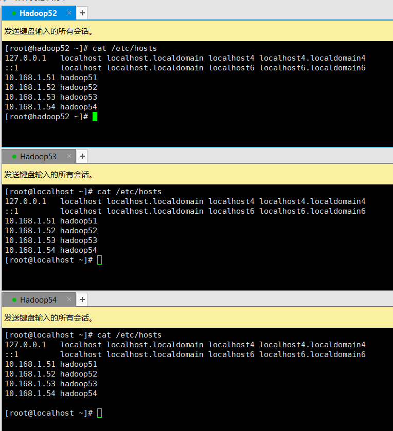
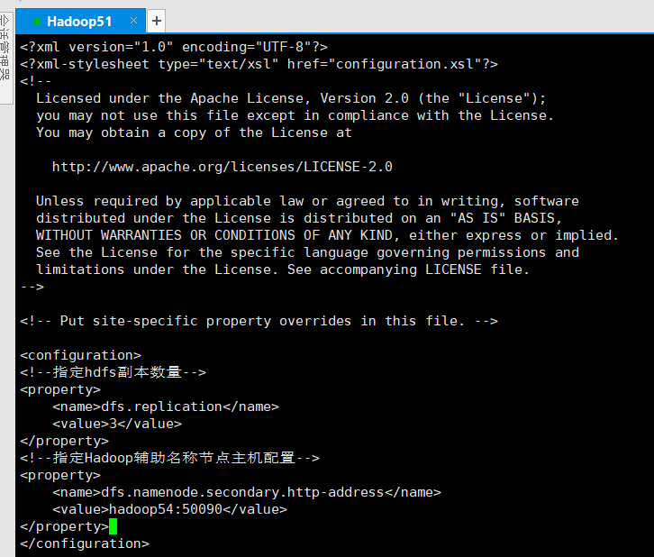
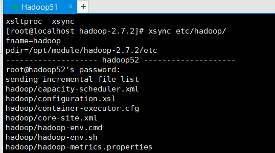

# Hadoop2.x-基础(部署)

## Hadoop是什么

> Hadoop是Apache基金会所开发的分布式系统基础机构，主要是用于解决海量数据的存储，和海量数据的分析计算问题
>
> Hadoop在大部分情况下并不只的是Hadoop框架，而是整个Hadoop的生态圈

   

## Hadoop三大发行版

> Hadoop三大发行版本，Apache、Cloudera、Hortonworks
>
> Apache：原始版本也叫基础版，对于入门学习最好
>
> Cloudera：在大型互联网企业中用的较多
>
> Hortonworks：文档较好

### Apache Hadoop

> 官方网站：https://hadoop.apache.org/
>
> 下载地址：https://hadoop.apache.org/releases.html
>
> 学习过程中使用的版本，Apache版本缺点生态中各组件的版本需要自己控制

### Cloudera/Hortonworks Hadoop

> Cloudera也叫CDH，现在Cloudera与Hortonworks已经合并了所以官网相同
>
> 在工作中更多的可能是使用CDH，因为CDH有很好的版本管理每个Hadoop版本对应的生态中其它组件的版本都给你管理好了
>
> 官方网站：https://www.cloudera.com/
>
> 下载地址：https://www.cloudera.com/downloads.html

## Hadoop的优势

> 1. 高可靠性：Hadoop底层维护多个数据副本，所以即使Hadoop其中某个计算元素或存储出现故障，也不会导致数据的丢失
> 2. 高扩展性：在集群分配任务数据，可方便的扩展数以千计的节点
> 3. 高效性：在MapReduce的思想下，Hadoop是并行工作的，以加快任务处理速度
> 4. 高容错性：能够自动将失败的任务重新分配

## Hadoop组成

> Hadoop1.x与Hadoop2.x差别
>
> 在1.x版本中MapReduce即负责计算又负责计算机的资源调度耦合性较大
>
> 升级后的2.x后MapReduce只负责计算，而资源调度由Yarn完成解决1.x的耦合性问题

### HDFS

> HDFS(Hadoop Distributed File System)是Hadoop的数据存储模块
>
> HDFS的组成
>
> 1. NameNode(nn)：存储文件的元数据，如文件名，文件目录，文件属性(生成时间、副本数、文件权限)，以及每个文件的块列表和块所在的DataNode等
> 2. DataNode(dn)：在本地文件系统存储文件块数据，以及块数据的校验和
> 3. Secondary NameNode(2nn)：用来监控DHFS状态的辅助后台程序，每隔一段时间获取HDFS元数据的快照

### YARN

> YARN是Hadoop的资源调度模块，其中包含4个组件
>
> 1. ResourceManager：整个集群的Leader
> 2. NodeManager：每个节点的Leader
> 3. ApplicationMaster：每个Job的Leader
> 4. Container：类似于Vmware将每个节点虚拟出多个资源

### MapReduce

> MapReduce是将计算分两个阶段，Map和Reduce
>
> 1. Map阶段并行处理输入数据
> 2. Reduce阶段对Map结果进行汇总

## 大数据技术生态体系

> 以下是整个大数据生态中的框架以及场景，从下往上说
>
> 1. Zookeeper：管理整个集群的通用配置
> 2. 数据来源层：分析数据都来源于结构化数据(数据库中的数据)、半结构化数据(文件日志)、非结构化数据(视频、ppt等)
> 3. 数据存储层：存储数据的地方，通常保存在分布式文件存储系统中HDFS或非关系型数据库Hbase(一种k,v键值的数据库)
> 4. 资源管理层：YARN资源管理器，虚拟化出CPU、内存等空间提供给程序进行调度
> 5. 数据计算层：
>    * MapReduce离线计算：离线计算数据较安全宕机不会丢失，通过Hive进行数据查询，Hive提供(SQL语法的查询语句对数据查询)，Mahout进行数据挖掘
>    * Spark Core内存计算：内存计算数据安全低宕机数据丢失，Spark套件提供了强大的支持数据挖掘、数据分析、数据查询(类SQL语法)、实时计算(准实时、实际是分批小批多次计算)
>
> 5. 任务调度层：在集群中通常是上百个分析任务进行的，那么多个任务并行自然就有同步或某些任务需要基于其它任务的完成才进行，这里就由任务调度器统一管理
> 6. 业务模型层：主要是业务层面公司给予你的任务，如数据可视化报表

### 推荐系统框架

> 利用刚刚所了解到的生态系统，下面就推荐系统实现的思路
>
> 用户购买商品=>ngin=>tomcat记录日志=>flume对日志收集解析=>保存到HDFS中=>YARN分配CPU、内存、磁盘解析分析=>由于是数据需要实时所以使用SPark Core内存计算，利用Spark Streaming进行数据分析=>将分析结果保存到数据库或文件=>业务层从数据库或文件读取给用户的推荐商品回传给前端

## Hadoop环境搭建

> 搭建hadoop环境需要jdk于hadoop

### JDK环境安装

> 环境使用的是jdk1.8

~~~shell
#将jdk解压到指定的目录
tar -zxvf jdk-8u271-linux-x64.tar.gz -C /opt/module/
~~~

> 添加java环境变量

~~~shell
#需要改环境变量
vi /etc/profile
~~~

> #在profile文件的末尾添加如下内容
> `export JAVA_HOME=/opt/module/jdk1.8.0_271`
> `export PATH=$PATH:$JAVA_HOME/bin`

~~~shell
#执行如下命令设置环境变量
source /etc/profile
#测试java
java -version
~~~

### Hadoop2.x安装

> 这里使用的Hadoop2.7.2，下载地址`https://archive.apache.org/dist/hadoop/common/hadoop-2.7.2/`

~~~shell
#将hadoop解压到指定的目录
tar -zxvf hadoop-2.7.2.tar.gz -C /opt/module/
~~~

> 添加hadoop环境变量

~~~shell
#需要改环境变量
vi /etc/profile
~~~

> #在profile文件的末尾添加如下内容
>
> `export HADOOP_HOME=/opt/module/hadoop-2.7.2`
> `export PATH=$PATH:$HADOOP_HOME/bin`
> `export PATH=$PATH:$HADOOP_HOME/sbin`

~~~shell
#执行如下命令设置环境变量
source /etc/profile
#测试hadoop
hadoop
~~~

## Hadoop运行模式

### 本地模式

> 本地模式也叫单节点模式，该模式下只有一个hadoop进行运行和分析任务

#### grep案例

> grep案例演示了如何使用hadoop在一堆文件中找到你想要的内容

~~~shell
#进入到hadoop目录
cd /opt/module/hadoop-2.7.2
#创建input文件
mkdir input
#将etc/hadoop/下所有xml文件拷贝到input文件夹中
cp etc/hadoop/*.xml input/
#执行hadoop的hadoop-mapreduce-examples例子测试hadoop，该例子是在指定文件夹中找到符合正则表达式的内容
#hadoop jar xxx.jar 使用hadoop运行指定jar包
#grep input/ output 'dfs[a-z.]+'，指定输入目录是input文件夹，指定结果输出搭配output文件夹(输出文件夹不能存在否则报错) 'dfs[a-z.]+'在input中找到符合正则表达式的内容
hadoop jar share/hadoop/mapreduce/hadoop-mapreduce-examples-2.7.2.jar grep input/ output 'dfs[a-z.]+'
~~~

#### wordcout案例

> wordcout案例用于统计单词数量，这个非常重要因为所有涉及到统计的业务都会需要使用到它

**测试数据准备**

> 首先准备一些测试数据(一些随意的单词数据)

~~~shell
#创建输入文件夹
mkdir wcinput
#进入到文件夹
cd wcinput
#创建一个文件
touch wc.input
#编辑文件
vi wc.input
~~~

> 在wc.input中添加一些单词，添加完毕后保存

**执行hadoop脚本分析**

~~~shell
hadoop jar share/hadoop/mapreduce/hadoop-mapreduce-examples-2.7.2.jar wordcount wcinput/ wcouput
~~~

### 伪分布式

> 伪分布式模式下配置是于完全分布式一样的，只不过伪分布式实际运行的是一台hadoop适合单台电脑搭建测试环境

#### 配置Hosts

> 如果测试机是公网ip以及拥有域名的，不用修改本地的hosts文件

#### 启动HDFS并且运行MapReduce程序

##### 配置hadoop-env.sh

> 配置hadoop的环境变量，添加javahome环境变量，分布式情况下必须配置否则hadoop会找不到java环境变量
>
> ` vi etc/hadoop/hadoop-env.sh  `

##### 配置core-site.xml

> core-site是核心配置文件在里面配置上hdfs协议访问的地址，和hadoop运行时产生的文件位置

~~~shell
vi etc/hadoop/core-site.xml 
~~~

~~~xml
<!--指定hdfs中的namenode的地址-->
<property>
    <name>fs.defaultFS</name>
    <value>hdfs://hadoop51:9000</value>
</property>
<!--指定hadoop运行时生产的文件的存储目录-->
<property>
    <name>hadoop.tmp.dir</name>
    <value>/opt/module/hadoop-2.7.2/data/tmp</value>
</property>
~~~

##### 配置hdfs-site.xml

> hdfs-site设置hdfs的副本数量，确保集群的可靠性
~~~shell
vi etc/hadoop/hdfs-site.xml
~~~

~~~xml
<!--指定hdfs副本数量-->
<property>
    <name>dfs.replication</name>
    <value>1</value>
</property>
~~~

##### 启动集群

> `危险操作：格式化NanmeNode(一般第一次启动时才格式化，以后不要总格式化)`
>
> 格式化时需确保3点：
>
> 1. DataNode与NameNode已删除
> 2. hadoop目录下的data文件夹已删除
> 3. hadoop目录下的logs文件夹已删除

~~~shell
bin/hdfs namenode -format
~~~

> 启动namenode
>
> 启动datanode

~~~shell
sbin/hadoop-daemon.sh start namenode
sbin/hadoop-daemon.sh start datanode
~~~

> 启动成功后通过浏览器访问`http://10.168.1.51:50070/`，可以看到HDFS的管理界面

##### 简单测试

~~~shell
#在hdfs上生产一个文件路径
bin/hdfs dfs -mkdir -p /user/test/input
#将本地文件上传带hdfs上
bin/hdfs dfs -put wcinput/wc.input /user/test/input
#查看hdfs中的文件内容
bin/hdfs dfs -cat /user/test/output/p*
#执行hadoop程序，统计hdfs上的input文件夹中的单词数，结果保存到hdfs上
bin/hadoop jar share/hadoop/mapreduce/hadoop-mapreduce-examples-2.7.2.jar wordcout /user/test/input /user/test/output
~~~

> 测试完毕可在web端的hdfs文件系统中看到，操作的文件

#### 格式化NanmeNode注意

> 格式化NanmeNode会将数据确保清除 格式化时需确保3点：
>
> 1. DataNode与NameNode已删除
> 2. hadoop目录下的data文件夹已删除
> 3. hadoop目录下的logs文件夹已删除

**为什么不要经常格式化NameNode**

> 在正常的部署情况下NamdNode与DataNode的集群id都是一致的，由于每次格式化NameNode会导致产生新的集群id，若在格式化NameNode时不先删除data和log文件夹那么就会导致，NamdNode与DataNode集群id不一致无法相互通信
>
> `若没配置hadoop.tmp.dir那么data与log目录的默认路径是	/tmp/hadoop-${user.name}`

#### 启动Yarn并且运行MapReduce程序

##### 配置yarn-env.sh

> 配置yarn的环境变量，添加javahome环境变量
>
> ` vi etc/hadoop/yarn-env.sh  `

##### 配置yarn-site.xml

~~~shell
vi etc/hadoop/yarn-site.xml 
~~~

~~~xml
<!--Reducer获取数据的方式-->
<property>
    <name>yarn.nodemanager.aux-services</name>
    <value>mapreduce_shuffle</value>
</property>
<!--指定Yarn的ResourceManager的地址-->
<property>
    <name>yarn.resourcemanager.hostname</name>
    <value>hadoop51</value>
</property>
~~~

##### 配置mapred-env.sh
> 配置mapred-env的环境变量，添加javahome环境变量
>
> ` vi etc/hadoop/mapred-env.sh  `

##### 配置mapred-site.xml

~~~shell
#将mapred-site.xml.template重命名为mapred-site.xml
mv etc/hadoop/mapred-site.xml.template etc/hadoop/mapred-site.xml
~~~

~~~xml
<!--指定MR运行在Yarn上-->
<property>
    <name>mapreduce.framework.name</name>
    <value>yarn</value>
</property>
~~~

##### 启动集群

> 启动前必须保证NameNode和DataNode已经启动

~~~shell
sbin/yarn-daemon.sh start resourcemanager
sbin/yarn-daemon.sh start nodemanager
~~~

> 启动成功后通过浏览器访问`http://10.168.1.51:8088/`，可以看到Yarn管理界面

##### 简单测试

>  提交一个分析任务给Yarn

#### 配置历史服务器

> 未配置历史服务器之前在Yarn的管理界面查看任务的历史进去页面是空白的

##### 配置mapred-site.xml

> 添加如下配置

~~~xml
<!--历史服务器端地址-->
<property>
    <name>mapreduce.jobhistory.address</name>
    <value>hadoop51:10020</value>
</property>
<!--历史服务器web端地址-->
<property>
    <name>mapreduce.jobhistory.webapp.address</name>
    <value>hadoop51:19888</value>
</property>
~~~

##### 启动历史服务器

~~~shell
sbin/mr-jobhistory-daemon.sh start historyserver
~~~

##### 简单测试

> 点击job信息的History可以进入表示没问题

#### 配置日志的聚集

> 配置日志聚集后可以查看到分析程序执行时的日志信息，可以方便的查看程序的运行情况与开发调试
>
> `注意：开启日志聚集功能，需要重启NodeMaster、ResourceManager、HistoryManager`

##### 配置yarn-site.xml

~~~xml
<!--开启yarn日志聚集-->
<property>
    <name>yarn.log-aggregation-enable</name>
    <value>true</value>
</property>
<!--日志保留时间7天-->
<property>
    <name>yarn.log-aggregation.retain-seconds</name>
    <value>604800</value>
</property>
~~~

##### 关闭NodeMaster、ResourceManager、HistoryManager

~~~shell
sbin/mr-jobhistory-daemon.sh stop historyserver
sbin/yarn-daemon.sh stop nodemanager
sbin/yarn-daemon.sh stop resourcemanager
~~~

##### 启动NodeMaster、ResourceManager、HistoryManager

~~~shell
sbin/yarn-daemon.sh start resourcemanager
sbin/yarn-daemon.sh start nodemanager
sbin/mr-jobhistory-daemon.sh start historyserver
~~~

##### 简单测试

> 重新执行一个分析任务

~~~shell
#删除分析输出目录
bin/hdfs dfs -rm -r /user/test/output
#执行单词统计分析任务
hadoop jar share/hadoop/mapreduce/hadoop-mapreduce-examples-2.7.2.jar wordcount /uer/test/input /user/test/output
~~~

### 完全分布式

#### 环境准备

> 基于Hadoop51虚拟机克隆出3台虚拟机，并且关闭防火墙、修改id地址、设置主机名称
>
> 1. 修改ip地址：`vi /etc/sysconfig/network-scripts/ifcfg-ens33`
> 2. 修改主机名称：`vi /etc/sysconfig/network`
> 3. 修改hosts：28
> 4. `vi /etc/hosts`

| IP地址   | 10.168.1.52 |    10.168.1.53   |      10.168.1.54|
| -------- | ----------- | ---- | ---- |
| 主机名称 | Hadoop52 | Hadoop53 | Hadoop54 |

#### 编写集群分发脚本

##### scp命令

> scp是一种远程拷贝的命令，可以实现
>
> * 将本地文件拷贝到远程主机 => `scp -r 本地目录 用户名@主机IP:路径`
> * 将远程主机文件拉取到本地 => `scp -r 用户名@主机IP:路径 本地目录`
> * 将指定远程主机文件拷贝到另一个远程主机中 => `scp -r 用户名@主机IP:路径 用户名@主机IP:路径`

~~~shell
#源路径如果是远程服务器使用  用户名@主机IP:路径
#目标路径如果是远程服务器使用  用户名@主机IP:路径
scp -r 源路径 目标路径
#输入完毕后如果源路径/目标路径是远程服务器会弹出要你输入远程服务器的密码，若配置了ssh公钥那么可以跳过密码验证
~~~

###### 拷贝文件案例

> 登录到hadoop51执行如下命令将51的安装包拷贝到另外3台机器上

~~~shell
scp -r /opt/module root@hadoop52:/opt/module
scp -r /opt/module root@hadoop53:/opt/module
scp -r /opt/module root@hadoop54:/opt/module

scp -r /opt/software/ root@hadoop52:/opt/software
scp -r /opt/software/ root@hadoop53:/opt/software
scp -r /opt/software/ root@hadoop54:/opt/software
~~~

> 将环境变量拷贝到其它主机上

~~~shell
scp /etc/profile root@hadoop52:/etc/profile
scp /etc/profile root@hadoop53:/etc/profile
scp /etc/profile root@hadoop54:/etc/profile
~~~

##### rsync命令

> 使用rsync前提需要目标主机举报rsync命令，安装rsync命令 `yum -y install rsync`
>
> rsync主要用于备份和镜像，其与scp命令区别在于rsyn只对有差异的文件做更新而scp是直接覆盖过去，所有rsync速度会更块可以避免负责相同的文件

~~~shell
#-r 递归
#-v 显示复制过程
#-l 拷贝符号理解
rsync -rvl 源路径 目标路径
~~~

###### 拷贝文件案例

> 登录到hadoop51执行如下命令将51的安装包拷贝到另外3台机器上

~~~shell
rsync -rvl /opt/module root@hadoop52:/opt/module
rsync -rvl /opt/module root@hadoop53:/opt/module
rsync -rvl /opt/module root@hadoop54:/opt/module

rsync -rvl /opt/software/ root@hadoop52:/opt/software
rsync -rvl /opt/software/ root@hadoop53:/opt/software
rsync -rvl /opt/software/ root@hadoop54:/opt/software
~~~

> 将环境变量拷贝到其它主机上

~~~shell
rsync -vl /etc/profile root@hadoop52:/etc/profile
rsync -vl /etc/profile root@hadoop53:/etc/profile
rsync -vl /etc/profile root@hadoop54:/etc/profile
~~~

##### 自定义分发脚本

> 经过前面的使用已经对scp与rsync命令有了一定的理解，但是可以在文件分发时还是比较麻烦，每台远程主机对应都要执行一条命令当远程主机很多的情况下还是需要执行很多命令，所有需要编写shell脚本实现一条命令可以分发多个服务器

###### 脚本实现

> 在用户bin目录下创建一个脚本名称为xsync(名字自定义可以随便起)
>
> `/home/用户名/bin 在该目录下存放的脚本，对应用户可以在系统如何一个地方直接执行`

~~~shell
cd ~
mkdir bin
cd bin/
touch xsync
vi sxync
~~~

> 脚本内容

~~~shell
#!/bin/bash
#获取输入参数个数，如果没有参数，直接退出
pcount=$#
if((pcount==0));then
echo no args;
exit;
fi

#获取第1个参数路径中最后一个文件/文件夹
p1=$1
fname=`basename $p1`
echo fname=$fname

#获取第1个参数文件/文件夹上级全路径
pdir=`cd -P $(dirname $p1); pwd`
echo pdir=$pdir

#获取当前用户名称
user=`whoami`

#循环
for((host=52; host<55; host++));do
    echo -------------------- hadoop$host --------------------
    rsync -rvl $pdir/$fname $user@hadoop$host:$pdir
done
~~~

> 将脚本设置为可执行 `chmod 777 xsync`

###### 测试

#### SSH无密码登录

> 在刚刚测试文件拷贝时可以发现，每拷贝一台服务器都需要输入密码登录操作还是比较反锁，接下来我们配置ssh无密码登录来解决这个问题

~~~shell
#进入到ssh目录
cd .ssh
#生产ssh公私钥
ssh-keygen -t rsa
#将公钥拷贝带其它电脑上，第一次需要输入密码
ssh-copy-id hadoop51
ssh-copy-id hadoop52
ssh-copy-id hadoop53
ssh-copy-id hadoop54
~~~

#### 集群配置

##### 集群部署规划

> 现有3台主机，首先规划好每台主机上分别部署什么应用，接下来所有的配置都只会在51主机上修改修改完毕后使用前面编写的集群分发脚本分发到52-54服务器上

|      | hadoop52              | hadoop53                       | hadoop54                       |
| ---- | --------------------- | ------------------------------ | ------------------------------ |
| HDFS | NameNode DataNode | DataNode                       | SecondaryNameNode DataNode |
| YARN | NodeManager           | ResourceManger NodeMangaer | NodeManager                    |

##### 核心配置

**配置core-site.xml**

> 修改core-site中hdfs的namenode统一修改为hadoop52

~~~shell
vi etc/hadoop/core-site.xml
~~~

~~~xml
<!--指定hdfs中namenode的地址-->
<property>
    <name>fs.defaultFS</name>
    <value>hdfs://hadoop102:9000</value>
</property>
~~~

##### HDFS配置

**配置hadoop-env.sh**

> 添加环境变量

~~~shell
vi etc/hadoop/hadoop-env.sh
#添加环境变量
#export JAVA_HOME=/opt/module/jdk1.8.0_27
~~~

**配置hdfs-site.xml**

> 现在有3台主机需要部署hdfs所有将副本数改为3，并且需要指定监控节点(SecondaryNameNode)地址
~~~shell
vi etc/hadoop/hdfs-site.xml
~~~

~~~xml
<!--指定hdfs副本数量-->
<property>
    <name>dfs.replication</name>
    <value>3</value>
</property>
<!--指定Hadoop辅助名称节点主机配置-->
<property>
    <name>dfs.namenode.secondary.http-address</name>
    <value>hadoop54:50090</value>
</property>
~~~

##### YARN配置

**配置yarn-env.sh**

> 添加环境变量
>

~~~shell
vi etc/hadoop/yarn-env.sh
#添加环境变量
#export JAVA_HOME=/opt/module/jdk1.8.0_271
~~~

**配置yarn-site.xml**

~~~shell
vi etc/hadoop/yarn-site.xml 
~~~

~~~xml
<!--Reducer获取数据的方式-->
<property>
    <name>yarn.nodemanager.aux-services</name>
    <value>mapreduce_shuffle</value>
</property>
<!--指定Yarn的ResourceManager的地址-->
<property>
    <name>yarn.resourcemanager.hostname</name>
    <value>hadoop53</value>
</property>
~~~

##### MapReduce配置

**配置mapred-env.sh**

> 添加环境变量

~~~shell
vi etc/hadoop/mapred-env.sh
#添加环境变量
#export JAVA_HOME=/opt/module/jdk1.8.0_271
~~~

**配置mapred-site.xml**

~~~shell
#将mapred-site.xml.template重命名为mapred-site.xml
mv etc/hadoop/mapred-site.xml.template etc/hadoop/mapred-site.xml
~~~

~~~xml
<!--指定MR运行在Yarn上-->
<property>
    <name>mapreduce.framework.name</name>
    <value>yarn</value>
</property>
~~~

##### 分发配置文件

~~~shell
#配置文件分发到其它节点
xsync etc/hadoop/
~~~

##### 集群同时启动HDFS

> 启动集群之前确保所有主机都已经配上了ssh无密码登录

**配置slasves**

~~~shell
#配置集群数据节点(DataNode)
vi etc/hadoop/slaves
~~~

**分发文件**

> 将文件分发到集群所有节点中

~~~shell
xsync etc/hadoop/slaves
~~~

**启动集群**

> 进入到集群的容易一台主机下执行`sbin/start-dfs.sh`脚本，hadoop会使用ssh命令远程控制集群的其它节点一起启动

> 启动后查看与我们预期一致表示启动成功

##### 集群同时启动Yarn

> 启动Yarn时一个非常坑而且也要注意的问题是，你的ResourceManger在那台主机上就必须去那台主机上启动，否则会报错，与HDFS不一样只要slaves配好在那台主机执行启动都行，再重复异常Yarn必须在ResourceManger那台服务器上启动

**启动集群**

> 进入到hadoop53节点(ResourceManger节点)执行`sbin/start-yarn.sh`脚本启动yarn

##### 简单测试

> 集群部署完毕后，需要对集群进行简单测试查看集群是否能够正常工作

**访问HDFS**

> 在浏览器中输入http://hadoop52:50070/查看是否能够正常访问，已经基本信息查看节点是否符合预期

**上传文件测试**

> 在集群任意一台集群上使用hdfs命令上传任意文件到根目录

~~~shell
#上传一个文件到hdfs到根目录
bin/hdfs dfs -put wcinput/wc.input /
~~~

> 上传成功后在web端查看根目录是否有文件
>
> Replication副本数是不是与设定的一致

> 随便找个大于128M的文件上传，上传完毕后查看文件是否已经被分片，点击下载看是否能够下载成功

##### 集群启动与停止总结

**单节点启动**

> 使用如下命令登录到每个服务器上单节点启动指定服务器的hadoop服务

~~~~shell
#分别启动HDFS
sbin/hadoop-daemon.sh start|stop namenode|datanode|secondarynamenode
#分别启动Yarn
sbin/yarn-daemon.sh start|stop resourcemanager|nodemanager
~~~~

**集群启动**

~~~shell
#启动这个hdfs集群
sbin/strt-dfs.sh
sbin/stop-dfs.sh
#启动整个yarn集群(必须在resourcemanager下执行命令)
sbin/strt-yarn.sh
sbin/stop-yarn.sh
~~~

##### 集群时间同步

> 由于hadoop集群部署后需要经常执行定时任务，所以集群之间的时间需要同步，若集群中的每个节点时间都不相同，那么到执行任务时会乱套了
>
> 解决方案：找一台服务器作为时间服务器，其它机器使用crontab定时同步该服务器的时间

**时间服务器配置**

> 检查是否安装ntp

~~~shell
#查看ntp是否安装
rpm -qa | grep ntp
#若没有如何内容显示，使用yum安装ntp
yum -y install ntp
~~~

> 修改ntp配置文件，
>
> * 授权10.168.1.0-10.168.1.255网段上的所有机器可以从这台机器上查询和同步时间
> * 集群中的主机在局域网中，不使用其它互联网的时间
> * 当时间服务器丢失网络时间，依然可以使用本地时间作为时间服务器为集群中其它节点提供时间同步

~~~shell
#修改ntp配置
vi /etc/ntp.conf
~~~

> 修改/etc/sysconfig/ntpd文件，让硬件时间与系统时间一起同步

~~~shell
vi /etc/sysconfig/ntpd
~~~

> 重启ntp服务
>
> 设置开启启动

~~~shell
#启动ntpd
systemctl start ntpd
#查看状态
systemctl status ntpd
#设置开机启动
systemctl enable ntpd
~~~

**集群节点配置**
> 检查是否安装ntp
>
> 

~~~shell
#查看ntp是否安装
rpm -qa | grep ntp
#若没有如何内容显示，使用yum安装ntp
yum -y install ntp
~~~

> 配置定时任务

~~~shell
crontab -e
~~~

> 每1分钟去hadoop52主机上同步时间

> 尝试修改时间，过一段时间后时间同步回来了

## Hadoop编译源码

> 在日常使用Hadoop过程中有时可以需要一些定制化的功能需要集成到Hadoop中，接下来就讲解如何编译一个Hadoop，如官方提供的Hadoop是32位的接下来我们自己编译一个64位的

### 准备工作

> 1. 准备一台配置较好的CentOS虚拟机，并且能够连接外网(ping www.baidu.com畅通)
> 2. 注意编译过程中操作使用root角色减少权限问题
> 3. jar包准备
>    * hadoop-2.7.2-src.tar.gz
>    * jdk-7u80-linux-x64.tar
>    * apache-ant-1.9.9-bin.tar.gz(build工具打包用的)
>    * apache-maven-3.0.5-bin.tar.gz
>    * protobuf-2.5.0.tar.gz(序列化框架)

### 安装环境

> 将所需的安装包全部拷贝到/opt目录下

**JDK8安装**

~~~shell
#解压缩jdk到/opt/module/
tar -zxvf jdk-7u80-linux-x64.tar.gz -C /opt/module/
#添加环境变量
vi /etc/profile
~~~

> #JAVA_HOME
> export JAVA_HOME=/opt/module/jdk1.7.0_80
> export PATH=$PATH:$JAVA_HOME/bin

~~~shell
#加载环境变量
source /etc/profile
#验证
java -version
~~~

**Maven安装**

~~~shell
#解压缩maven到/opt/module/
tar -zxvf apache-maven-3.0.5-bin.tar.gz -C /opt/module/
#添加环境变量
vi /etc/profile
~~~

> #MAVEN_HOME
> export MAVEN_HOME=/opt/module/apache-maven-3.0.5
> export PATH=$PATH:$MAVEN_HOME/bin

~~~shell
#加载环境变量
source /etc/profile
#验证
mvn -v
~~~

> 修改Maven远程仓库地址

~~~shell
#进入到maven配置目录
cd /opt/module/apache-maven-3.0.5/conf/
#修改配置文件
vi settings.xml
~~~

> 找到mirrors标签添加如下内容

~~~xml
<mirror>
    <id>nexus-aliyun</id>
    <mirrorOf>central</mirrorOf>
    <name>Nexus aliyun</name>
    <url>http://maven.aliyun.com/nexus/content/groups/public/</url>
</mirror>
~~~

**Ant安装**

~~~shell
#解压缩ant到/opt/module/
tar -zxvf apache-ant-1.9.9-bin.tar.gz -C /opt/module/
#添加环境变量
vi /etc/profile
~~~

> #ANT_HOME
> export ANT_HOME=/opt/module/apache-ant-1.9.9
> export PATH=$PATH:$ANT_HOME/bin

~~~shell
#加载环境变量
source /etc/profile
#验证
ant -version
~~~

**glibc-headers安装**

~~~shell
yum -y install glibc-headers
yum -y install gcc-c++
~~~

**make和cmake安装**

~~~shell
yum -y install make
yum -y install cmake
~~~

**protobuf安装**

~~~shell
#解压缩protobuf到/opt/module/
tar -zxvf protobuf-2.5.0.tar.gz -C /opt/module/
#进入解压目录
cd /opt/module/protobuf-2.5.0/
#编译安装protobuf
./configure
make
make check
make install
ldconfig
#添加环境变量
vi /etc/profile
~~~

> #LD_LIBRARY_PATH
> export LD_LIBRARY_PATH=/opt/module/protobuf-2.5.0
> export PATH=$PATH:$LD_LIBRARY_PATH
~~~shell
#加载环境变量
source /etc/profile
#验证
protoc --version
~~~

**openssl安装**

~~~shell
yum -y install openssl-devel
~~~

**ncurses-devel库安装**

~~~shell
yum -y install ncurses-devel
~~~

### 编译源码

~~~shell
#解压Hadoop源代码
tar -zxvf hadoop-2.7.2-src.tar.gz -C /opt/
#进入到Hadop源码主目录
cd /opt/hadoop-2.7.2-src/
#使用maven命令打包
mvn package -Pdist,native -DskipTests -Dtar
~~~

> 在构建过程中mavne经常下不到包，多次取消重新执行mvn打包命令后最后就可以打包成功了，打包完毕后hadoop.tar.gz就在`/hadoop-dist/target/`目录下

