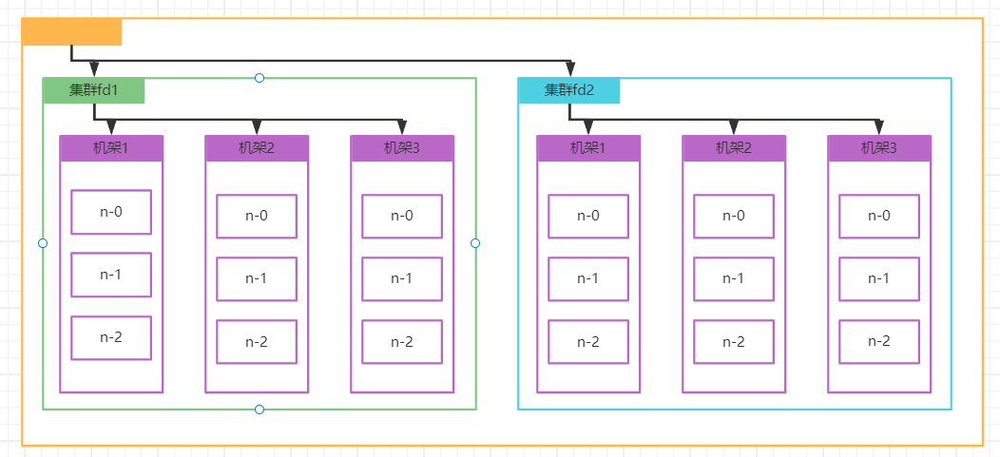

# Hadoop3.x-基础(HDFS)

## HDFS简介

> HDFS(Hadoop Distributed File System)，是一个文件系统，用于存储文件，通过目录树来定位文件，并且它是分布式的
>
> 在大数据环境下，随着数量越来越多在一个主机下已经不能存下所有数据了，所以就需要将数据分布在不同的主机磁盘上，但是这就会带来一个问题就是数据分布在各个主机上对于数据的读取与数据的写入维护非常不方便，这时就需要一种解决方案能够管理这些分布式的数据，HDFS就是这些分布式文件管理系统中的一种
>
> HDFS的使用场景：适合一次写入，多次读的场景，且不支持文件的修改，适合做数据分析，并不适合做文件增删查改业务

### HDFS优缺点

**优点**

> 1. 高容错性
>    * 数据自动保存多个副本，它通过增加副本的形式，提供容错性
>    * 某个副本丢失以后，它可以自动恢复
> 2. 适合处理大数据
>    * 数据规模：能处理达到GB、TB甚至PB级别的数据
>    * 文件规模：能处理百万规模以上的文件数量，数量相对大
> 3. 可构建廉价机器上，通过多副本机制，提高可靠性

**缺点**

> 1. 不适合低延时数据访问，比如毫秒级别的存储数据，是做不到的
> 2. 无法高效的对大量小文件存储
>    * 存大量小文件的话，它会占用NameNode大量的内存来存储文件目录的块信息，这样是不可取的，因为NameNode的内存总是有限的
>    * 小文件的存储寻址时间会超过读取时间，它违反了HDFS的设计目标
> 3. 不支持并发写入，文件随机修改
>    * 一个文件只能有一个写，不允许多个线程同时写
>    * 仅支持数据追加，不支持文件的随机修改

### HDFS的组成

> 1. NameNode(nn)：就是Master，它是一个主管、管理者
>    * 管理HDFS的名称空间
>    * 配置副本策略
>    * 管理数据块(Block)映射信息
>    * 处理客户端读写请求
> 2. DataNode：就是Slave，NameNode下达命令，DataNode执行实际的操作
>    * 存储实际的数据块
>    * 执行数据块的读/写操作
> 3. Client：就是客户端
>    * 文件切片，文件上传HDFS的时候，Client将文件切分成一个一个Block，然后进行上传
>    * 与NameNode交互，获取文件的位置信息
>    * 与DataNode交互，读取或写入数据
>    * Client提供一些命令来管理HDFS，比如NameNode格式化
>    * Client可以通过一些命令访问HDFS，比如对HDFS增删改查等操作
> 4. Secondary NameNode(2nn)：并不是NameNode的热备，当NameNode挂掉的时候，它不能马上替换NameNode并提供服务
>    * 辅助NameNode，分担其工作量，比如定期合并Fsimage和Edits，并推送给NameNode
>    * 在紧急情况下，可辅助恢复NameNode

### HDFS文件块大小

> HDFS文件在物理上是分块存储的(Blok)，块大小可以通过参数(dfs.blockszie)来规定，默认大小在Hadoop2.x版本是128M，老版本中是64M
>
> HDFS块设置太小，会增加寻找时间程序一直在找块的开始位置
>
> HDFS块设置太大，从磁盘传输数据的时间会明显大于定位这个块开始位置所需的时间，导致程序在处理这块数据时，会非常慢
>
> HDFS块的大小设置主要取决于磁盘的传输速率

## HDFS的Shell操作

> 使用hdfs的shell命令有2种方法，区别dfs是fs的实现类
>
> 1. bin/hadoop fs <命令>
>
> 2. bin/hdfs dfs <命令>

### 常用命令

| 命令           | 说明                                 | 例子                                                     |
| -------------- | ------------------------------------ | -------------------------------------------------------- |
| -help          | 显示命令的说明文档                   | hadoop fs -help rm                                       |
| -ls            | 显示目录信息                         | hadoop fs -ls /                                          |
| -mkdir         | 在hdfs上创建目录                     | hadoop fs -mkdir -p /test/lzj                            |
| -moveFromLocal | 将本地指定文件剪切到hdfs上           | hadoop fs -moveFromLocal ./testt.txt /test/lzj/          |
| -appendToFile  | 将指定文件内容追加到指定文件内容后面 | hadoop fs -appendToFile ./append.txt /test/lzj/testt.txt |
| -cat           | 查看文件内容                         | hadoop fs -cat /test/lzj/testt.txt                       |
| -chgrp         | 修改文件归属组                       | hadoop fs -chgrp lzj /test/lzj/testt.txt                 |
| -chmod         | 修改文件权限                         | hadoop fs -chmod 777 /test/lzj/testt.txt                 |
| -chown         | 修改所有者和归属组                   | hadoop fs -chown lzj /test/lzj/testt.txt                 |
| -copyFromLocal | 将本地文件复制到hdfs上               | hadoop fs -copyFromLocal ./testt2.txt /test/lzj/         |
| -copyToLocal   | 将hdfs文件拷贝到本地                 | hadoop fs -copyToLocal /test/lzj/testt2.txt ./testt2.txt |
| -cp            | 拷贝文件到hdfs的另一处               | hadoop fs -cp /test/lzj/testt.txt /test/aaa/             |
| -mv            | 移动文件到hdfs的另一处               | hadoop fs -mv /test/lzj/testt.txt /test/aaa/             |
| -get           | 相当于copyToLocal将文件下载下来      | hadoop fs -get /test/lzj/testt2.txt ./                   |
| -getmerget     | 合并下载多个文件                     | hadoop fs -getmerge /test/lzj/* ./m.txt                  |
| -put           | 相当于copyFromLocal                  | hadoop fs -put ./LICENSE.txt /test/lzj                   |
| -tail          | 显示一个文件的末尾                   | hadoop fs -tail /test/lzj/LICENSE.txt                    |
| -rm            | 删除指定文件                         | hadoop fs -rm /test/lzj/LICENSE.txt                      |
| -rmdir         | 删除空文件夹                         | hadoop fs -rmdir /test                                   |
| -du            | 统计文件夹大小                       | hadoop fs -du -h / hadoop fs -du -h  -s /             |
| -setrep        | 设置hdfs中文件副本数                 | hadoop fs -setrep 2 /test/lzj/LICENSE.txt                |

## HDFS客户端操作(Java)

### Hadoop环境变量

> 下载hadoop，镜像链接：https://hadoop.apache.org/release/2.7.2.html
>
> 下载winutils，选择2.7版本下载 win下安装hadoop需要这些部分文件链接：https://github.com/steveloughran/winutils

**解压hadoop-2.7.2**

**覆盖bin目录**

**配置环境变量**

> 将Hadoop的目录配置到win系统环境变量中

### 创建一个Maven工程

**依赖引入**

> 创建一个快报的maven项目，并且在项目中引入如下依赖

~~~xml
<dependency>
      <groupId>org.apache.logging.log4j</groupId>
      <artifactId>log4j-core</artifactId>
      <version>2.8.2</version>
    </dependency>
    <dependency>
      <groupId>org.apache.hadoop</groupId>
      <artifactId>hadoop-common</artifactId>
      <version>2.7.2</version>
    </dependency>
    <dependency>
      <groupId>org.apache.hadoop</groupId>
      <artifactId>hadoop-client</artifactId>
      <version>2.7.2</version>
    </dependency>
    <dependency>
      <groupId>org.apache.hadoop</groupId>
      <artifactId>hadoop-hdfs</artifactId>
      <version>2.7.2</version>
</dependency>
~~~

**log4j.properties配置**

> 由于使用log4j作为日志系统，所有需要在resources下创建一个配置文件，否则启动log4j会报错

~~~properties
log4j.rootLogger = info,stdout
log4j.appender.stdout = org.apache.log4j.ConsoleAppender
log4j.appender.stdout.Target = System.out
log4j.appender.stdout.layout = org.apache.log4j.PatternLayout
log4j.appender.stdout.layout.ConversionPattern = [%d{yyyy-MM-dd HH:mm:ss,SSS}] [%p] %m%n
~~~

**HDEFClient**

> 编写一小段客户端代码，操作远程HDFS测速是否配置成功

~~~java
public class HDEFClient {
    public static void main(String[] args) throws Exception {
        //定义配置
        Configuration conf = new Configuration();
        //获取一个hdfs客户端
        //参数1：hdfs地址
        //参数2：配置
        //参数3：使用什么用户访问
        FileSystem fs = FileSystem.get(new URI("hdfs://hadoop52:9000"),conf,"root");
        //在hdfs上创建路径
        fs.mkdirs(new Path("/java/client"));
        //关闭资源
        fs.close();
        System.out.println("over");
    }
}
~~~

**测速**

> 代码运行完毕后，可看到远程的hdfs上已经成功的创建了该文件

### HDFS常用API

#### 文件上传

> 一个文件上传例子

~~~java
@Test
public void testCopyFromLocalFile() throws Exception{
    //1.获取fs对象
    Configuration conf = new Configuration();
    FileSystem fs = FileSystem.get(new URI("hdfs://hadoop52:9000"),conf,"root");
    //2.执行上传api
    fs.copyFromLocalFile(new Path("C:\\Users\\mi\\Downloads\\jdk-7u80-linux-x64.tar.gz"),new Path("/jdk-7u80-linux-x64.tar.gz"));
    //3.关闭资源
    fs.close();
}
~~~

#### 配置优先级

> 在java代码的resource中添加的hdfs配置要优于服务器内的hdfs配置

> 执行测试代码可以看到，dfs的分片规则适用的是resource下的配置文件的

#### 文件下载

> 从Hadoop上下载文件到本地

~~~java
//文件下载
@Test
public void testCopyToLocalFile() throws Exception{
    //1.获取fs对象
    Configuration conf = new Configuration();
    FileSystem fs = FileSystem.get(new URI("hdfs://hadoop52:9000"),conf,"root");
    //2.执行上传api
    fs.copyToLocalFile(new Path("/jdk-7u80-linux-x64.tar.gz"),new Path("C:\\Users\\mi\\Downloads\\jdk7.tar.gz"));
    //3.关闭资源
    fs.close();
}
~~~

#### 文件删除

> 删除hdfs上的文件

~~~java
//文件删除
@Test
public void testDeleteFile() throws Exception{
    //1.获取fs对象
    Configuration conf = new Configuration();
    FileSystem fs = FileSystem.get(new URI("hdfs://hadoop52:9000"),conf,"root");
    //2.执行上传api
    fs.delete(new Path("/java"),true);
    //3.关闭资源
    fs.close();
}
~~~

#### 文件重命名

> 可以修改hdfs上的文件名称

~~~java
//文件改名
@Test
public void testRename() throws Exception{
    //1.获取fs对象
    Configuration conf = new Configuration();
    FileSystem fs = FileSystem.get(new URI("hdfs://hadoop52:9000"),conf,"root");
    //2.执行
    fs.rename(new Path("/jdk-7u80-linux-x64.tar.gz"),new Path("/jdk7.tar.gz"));
    //3.关闭资源
    fs.close();
}
~~~

#### 文件详情查看

> 文件详情是一个非常有用的命令，可以获取到hdfs上指定目录下所有文件的权限、名称、大小等信息

~~~java
//文件详情
@Test
public void testListFile() throws Exception{
    //1.获取fs对象
    Configuration conf = new Configuration();
    FileSystem fs = FileSystem.get(new URI("hdfs://hadoop52:9000"),conf,"root");
    //2.执行
    RemoteIterator<LocatedFileStatus> listFiles = fs.listFiles(new Path("/"), true);
    while (listFiles.hasNext()){
        LocatedFileStatus next = listFiles.next();
        System.out.println("文件名称："+next.getPath().getName());
        System.out.println("文件权限："+next.getPermission());
        System.out.println("文件大小："+next.getLen());
        System.out.println("块信息：");
        for (BlockLocation blockLocation : next.getBlockLocations()) {
            System.out.println("块存储的目标主机："+Arrays.asList(blockLocation.getHosts()));
        }
        System.out.println("===========================");
    }
    //3.关闭资源
    fs.close();
}
~~~

#### 判断文件/文件夹

> 判断HDFS上某个文件是文件夹还是文件

~~~java
//文件或文件夹判断
@Test
public void testListStatus() throws Exception{
    //1.获取fs对象
    Configuration conf = new Configuration();
    FileSystem fs = FileSystem.get(new URI("hdfs://hadoop52:9000"),conf,"root");
    //2.执行
    FileStatus[] listStatus = fs.listStatus(new Path("/"));
    for (FileStatus status : listStatus) {
        if (status.isFile()){
            System.out.println("这是一个文件："+status.getPath().getName());
        }else {
            System.out.println("这是一个文件夹："+status.getPath().getName());
        }
    }
    //3.关闭资源
    fs.close();
}
~~~

### HDFS的I/O操作

> 以上都是使用api去获取和上传资源，接下来演示如何通过io流的反射操作hdfs

#### 文件上传

~~~java
@Test
public void putFileHDFS() throws Exception{
    //获取对象
    Configuration conf = new Configuration();
    FileSystem fs = FileSystem.get(new URI("hdfs://hadoop52:9000"), conf, "root");
    //获取输入流（本地文件）
    FileInputStream fis = new FileInputStream(new File("C:\\Users\\mi\\Downloads\\jetbrains-toolbox-1.25.12424.exe"));
    //获取输出流（HDFS上的文件）
    FSDataOutputStream fos = fs.create(new Path("/jetbrains-toolbox-1.25.12424.exe"));
    //流的对拷
    IOUtils.copyBytes(fis,fos,conf);
    //关闭资源
    IOUtils.closeStream(fos);
    IOUtils.closeStream(fis);
    fs.close();
}
~~~

#### 文件下载

~~~java
@Test
public void getFileHDFS() throws Exception{
    //获取对象
    Configuration conf = new Configuration();
    FileSystem fs = FileSystem.get(new URI("hdfs://hadoop52:9000"), conf, "root");
    //获取输入流（HDFS上的文件）
    FSDataInputStream fis = fs.open(new Path("/jetbrains-toolbox-1.25.12424.exe"));
    //获取输出流（本地文件）
    FileOutputStream fos = new FileOutputStream(new File("C:\\Users\\mi\\Downloads\\toolbox.exe"));
    //流的对拷
    IOUtils.copyBytes(fis,fos,conf);
    //关闭资源
    IOUtils.closeStream(fos);
    IOUtils.closeStream(fis);
    fs.close();
}
~~~

#### 下载指定分区

> 通过io可以下载指定分区的文件

~~~java
@Test //下载第一块
public void readFileSeek1() throws Exception{
    //获取对象
    Configuration conf = new Configuration();
    FileSystem fs = FileSystem.get(new URI("hdfs://hadoop52:9000"), conf, "root");
    //获取输入流
    FSDataInputStream fis = fs.open(new Path("/hadoop-2.7.2.tar.gz"));
    //获取输出流
    FileOutputStream fos = new FileOutputStream(new File("C:\\Users\\mi\\Downloads\\hadoop_128M_1.tar.gz"));
    //流的对拷(只拷128m)
    byte[] buf = new byte[1024]; //定义一个1kb的缓存
    for (int i = 0; i < 1024 * 128; i++) { //循环 1024 * 128 次 => 1024 * 1024 * 128 = 128M
        fis.read(buf);
        fos.write(buf);
    }
    //关闭资源
    IOUtils.closeStream(fos);
    IOUtils.closeStream(fis);
    fs.close();
}

@Test //下载第二块
public void readFileSeek2() throws Exception{
    //获取对象
    Configuration conf = new Configuration();
    FileSystem fs = FileSystem.get(new URI("hdfs://hadoop52:9000"), conf, "root");
    //获取输入流
    FSDataInputStream fis = fs.open(new Path("/hadoop-2.7.2.tar.gz"));
    //跳过第一个块的大小，从第二个块开始读
    fis.seek(1024 * 1024 * 128);
    //获取输出流
    FileOutputStream fos = new FileOutputStream(new File("C:\\Users\\mi\\Downloads\\hadoop_128M_2.tar.gz"));
    //流的对拷
    IOUtils.copyBytes(fis,fos,conf);
    //关闭资源
    IOUtils.closeStream(fos);
    IOUtils.closeStream(fis);
    fs.close();
}
~~~

> 下载完毕后，将2个分区合并，合并完毕后可以看到内容没有出错

~~~cmd
type hadoop_128M_2.tar.gz >> hadoop_128M_1.tar.gz
~~~

## HDFS的数据流

### 写数据流程

> 客户端创建链接后，首先访问NameNode，NameNode收到请求后会通过节点计算，计算理客户端最近的节点，并且告诉客户端将数据存储到那个节点上，客户端创建输出流将数据发往dn1，dn1收到数据会只会保存增加所需要的那一部分保存完毕后会将剩余数据传递给dn2以此类推，直到数据全部保存完毕后返回结果给客户端

### 读数据流

> 客户端创建链接后，首先访问NameNode，NameNode通过查询元数据的信息找到该数据是存放在那个block返回给客户端，客户端收到后创建读取流，依次访问相应的dn读取数据

### 节点计算

> 在上传数据时NameNode会给客户端返回离客户端最近的DataNode，DHFS的节点距离计算规则就是`两个节点到底最近的共同祖先的距离总和`
>
> 例：fd1-机架1-n2节点与fd1-机架1-n0节点长度计算
>
> n2与n0节点共同祖先是集群fd1，n2节点到机架1经过1条线，n0节点到机架1经过1条线，那么d1-机架1-n2节点与fd1-机架1-n0节点距离总和是2
>
> 例：fd1-机架1-n0节点与fd2-机架1-n0节点长度计算
>
> fd1-机架1-n0节点与fd2-机架1-n0节点祖先是最顶层，n0到机架1到fd1到root=3，n0到机架1到fd2到root=3，fd1-机架1-n0节点与fd2-机架1-n0节点距离总和是6

### 副本选择

> HDFS副本策略
>
> 第一个副本在Clinet所处在节点上，如果客户端在集群外，随机选一个
>
> 第二个副本和第一个副本位于相同机架，随机节点
>
> 第三个副本位于不同机架，随机节点

## NameNode与SecondaryNameNode

### NN和2NN的工作机制

> 由于客户端经常需要访问NameNode所有NameNode中的元数据是保存在内存中的，那么这就有一个问题就是内存中的数据当断电后元数据就会丢失，整个集群无法工作，因此需要在磁盘有一个元数据的备份FsImage
>
> 有了备份那么，内存中的元数据被更新是FsImage也要同时更新才行，但是这会导致NameNode效率低如果不更新又怕数据丢失，因此引入了Edits文件，当内存元数据被修改后操作会被追加(追加比修改效率高)到Edits文件中，一旦断电后可以将Edits与FsImage合并得到最新数据
>
> 有了Edits文件，又带来了一个新的问题由于Edits是追加操作所有Edits会越来越大，当一个超大的Edits做合并操作时那么消耗时间就会很慢，所以添加了SecondaryNameNode专门辅助NameNode进行Edits与FsImage合并
>
> 工作流程
>
> SecondaryNameNode会定期发送请求检查是否需要设置检查点，若达到指定条件后就会触发
>
> 1. 将NameNode原edits更名，并且创建一个新的空白edits代替原有的继续保存日志
> 2. 将原有的edits与当前的fsimage拷贝到SecondaryNameNode服务上，在内存中继续2个文件的合并
> 3. 合并完毕后将文件拷贝会NameNode覆盖原来的fsimage就完成了

### Fsimage与Edits

~~~shell
#Fsimage与Edits所在目录（NameNode）
cd /opt/module/hadoop-2.7.2/data/tmp/dfs/name/current
#在SecondaryNameNode也有一个文件夹，该文件夹内容就是从NameNode拷贝过去的
cd /opt/module/hadoop-2.7.2/data/tmp/dfs/namesecondary/current
~~~

**Fsimage内容查看**

~~~shell
#使用oiv将Fsimage转成可阅读文件
hdfs oiv -p XML -i fsimage_000000000000000014 -o fsimage.xml
~~~

**Edits内容查看**

~~~shell
#使用oev将edit转成可阅读文件
hdfs oev -p XML -i edits_inprogress_0000000000000000146 -o edits.xml
~~~

### CheckPoint时间设置

> 一般情况下SecondaryNameNode每隔一个小时会合并一次数据，可通过修改hdfs-site.xml设置间隔时间

~~~xml
<property>
    <name>dfs.namenode.checkpoint.period</name>
    <value>36000</value>
</property>
~~~

> 设置每次checkpoint请求间隔时间

~~~xml
<!--当达到100万次请求后就会进行一次数据合并-->
<property>
    <name>dfs.namenode.checkpoint.txns</name>
    <value>1000000</value>
</property>
<!--每隔1分钟发送一次检查点请求-->
<property>
    <name>dfs.namenode.checkpoint.check.period</name>
    <value>60</value>
</property>
~~~

### NameNode故障处理

> 在整个HDFS集群当中只有一个NameNode，那么当NameNode出现故障了表示整个HDFS系统就出问题了，如何恢复NameNode至关重要的，可以通过以下2种方法恢复NameNode的数据

#### 方法1

> 将SecondaryNameNode中数据拷贝到NameNode存储数据目录下可以恢复大部分数据

~~~shell
#在NameNode执行如下命令，将SecondaryNameNode数据拷贝过来
scp -r root@hadoop54:/opt/module/hadoop-2.7.2/data/tmp/dfs/namesecondary/* ./
#单独启动NameNode
cd /opt/module/hadoop-2.7.2
sbin/hadoop-daemon.sh start namenode
~~~

#### 方法2

> 使用-importCheckpoint选项启动NameNode，从而将SecondaryNameNode中数据拷贝到NameNode目录中

**修改hdfs-site.xml(NameNode节点)**

~~~xml
<!--缩短checkporint的时间间隔，否则需要等很久才导入数据-->
<property>
    <name>dfs.namenode.checkpoint.period</name>
    <value>120</value>
</property>
<!--namenode文件目录的配置-->
<property>
    <name>dfs.namenode.name.dir</name>
    <value>/opt/module/hadoop-2.7.2/data/tmp/dfs/name</value>
</property>
~~~

**拷贝文件夹(NameNode节点)**

~~~shell
#进入到namenode
cd /opt/module/hadoop-2.7.2/data/tmp/dfs
#将namesecondary整个文件夹拷贝到namenode目录下
scp -r root@hadoop54:/opt/module/hadoop-2.7.2/data/tmp/dfs/namesecondary ./
#删除in_use文件
rm namesecondary/in_use文件.lock 
~~~

**导入检查点(NameNode节点)**

~~~shell
#执行导入检查点
hdfs namenode -importCheckpoint 
#这时NameNode会启动，从web界面可以观察到数据同步
#同步完毕后ctrl+c关闭进程，后台启动namenode
cd /opt/module/hadoop-2.7.2
sbin/hadoop-daemon.sh start namenode
~~~

### 集群安全模式

#### NameNode启动

> NameNode启动，首先将镜像文件(Fsimage)载入内存，并执行编辑日志(Edits)中的各项操作，一旦在内存中成功距离文件系统元数据映像，则创建一个新的Fsimage文件，和一个空的编辑日志，此时NameNode开始监听DataNode请求，这给过程期间，NameNode一直运行在安全模式，即NameNode的文件系统对客户端只读

#### DataNode启动

> 系统中的数据块的位置并不是由NameNode维护的，而是以块的形式存储在DataNode中，在系统正常操作期间，NameNode会在内存中保留所有块位置信息，在安全模式下各个DataNode会向NameNode发送最新的块列表信息，NameNode了解到足够多的块位置信息后，即可高效运行文件系统

#### 安全模式退出判断

> 如果满足最小副本条件，NameNode会在30秒之后退出安全模式，所谓最小副本条件指的是在整个文件系统中99.9%的块满足最小副本数(默认值dfs.replication.min=1)，在启动一个刚刚格式化的HDFS集群时，因为系统中没有任何块，所有NameNode不会进入安全模式

#### 安全模式常用命令

> 默认情况下集群正常启动后安全模式会退出，也可以使用命令手动开启和关闭安全模式

~~~shell
#查看安全模式状态
hdfs dfsadmin -safemode get
#进入安全模式状态
hdfs dfsadmin -safemode enter
#退出安全模式状态
hdfs dfsadmin -safemode leave
#等待安全模式状态
hdfs dfsadmin -safemode wait
~~~

> 在web界面也可以看到安全模式的状态

#### NameNode多目录

> NameNode的目录可以配置成多个，且每个目录存放内容相同，增加了可靠性

**停止集群**

~~~shell
#进入到hadoop53
stop-yarn.sh
#进入到hadoop52
stop-dfs.sh
#删除hadoop52、53、54中的相关文件
rm -rf data/ logs/
~~~

**修改hdfs-site.xml**

~~~xml
<property>
    <name>dfs.namenode.name.dir</name>
    <value>file:///${hadoop.tmp.dir}/dfs/name1,file:///${hadoop.tmp.dir}/dfs/name2</value>
</property>
~~~

**分发配置文件**

~~~shell
#将配置文件分发到各服务器
xsync etc/hadoop/
~~~

**启动集群**

~~~shell
#进入hadoop52中队namenode格式化看配置是否生效
hdfs namenode -format
#进入hadoop52中启动集群
sbin/start-dfs.sh
~~~

## DataNode

### 工作机制

> DataNode是真正存储数据的地方
>
> 1. 当DataNode上线后首先会向NameNode注册
> 2. 注册成功后NameNode会返回消息给DataNode表示DataNode已经可以使用了
> 3. DataNode会在每个小时将自己的所有块信息上报给NameNode更新元数据里面的信息
> 4. DataNode每3秒会发送一个心跳给NameNode让NameNode知道DataNode还存活，若超过10分钟没用收到DataNode的心跳，NameNode会认为该节点已经无法使用再也不会在这个节点保存任何内容

### DataNode掉线时限参数

> DataNode进程死亡或者由于网络问题与NameNode无法通信后，NameNode不会立刻把该节点判定为死亡，而是需要达到某个超时时间，HDFS默认的超时时长为10分钟+3秒
>
> 自定义超时时间为TimeOut那么，超时计算时长公式如下
>
> TimeOut = 2 * dfs.namenode.heartbeat.recheck-interval + 10 * dfs.heartbeat.interval
>
> 默认的 dfs.namenode.heartbeat.recheck-interval = 5分钟
>
> 默认的 dfs.heartbeat.interval = 3秒

### 服役新节点

> 随着业务增长，数据量越来越大，原有的数据节点容量已经不能满足存储数据的需求，需要在原来的集群基础上动态的增加数据节点

**前期准备**

> 准备一台Hadoop55服务器，并且安装了基础的jdk与hadoop环境
>
> 并且为该节点配上hdfs相关配置
>
> [Hadoop3.x-基础](Haddop3.x-基础(部署).md)

**启动节点**

~~~shell
#进入到hadoop目录下
cd /opt/module/hadoop-2.7.2
#执行如下命令启动datanode节点
/sbin/hadoop-daemon.sh start datanode
~~~

> 启动完毕后可从集群中看到新增的节点自动连接上了集群

### 服役白名单

> 在前面服役新节点案例中可以发现，在新增节点时无需任何认证只需要namenode配置正确后就能直接加入到集群，这也带来了问题就是假如有人知道你的namenode地址那么可以配置并且连接上你的集群这样会导致数据不安全
>
> 通过添加白名单的方式，可以控制那些节点可以了解namenode，不在白名单内的namenode会被退出
>
> `不允许白名单与黑名单中有相同的主机名称`

**配置白名单**

> 在namenode的hadoop-2.7.2/etc/hadoop/下创建dfs.hosts文件

~~~shell
cd /opt/module/hadoop-2.7.2/etc/hadoop/
touch dfs.hosts
vi dfs.hosts
~~~

> 添加如下主机名称

~~~shell
hadoop52
hadoop53
hadoop54
~~~

> 在NameNode的hdfs-site.xml配置文件中添加dfs.hosts属性

~~~xml
<property>
    <name>dfs.hosts</name>
    <value>/opt/module/hadoop-2.7.2/etc/hadoop/dfs.hosts</value>
</property>
~~~

**刷新配置**

> 在NameNode执行如下命令刷新配置

~~~shell
#这个在namenode中执行
hdfs dfsadmin -refreshNodes
#这个需要在集群所有集群中执行
yarn rmadmin -refreshNodes
~~~

> 刷新完毕后可以看到hadoop55主机由于没用在白名单中所有被踢出集群了

**集群重新平衡**

> 因为配置了白名单导致一个节点退出了，那么这时集群的各节点负载可能就不平衡了，所有需要执行命令重新平衡集群中的节点

~~~shell
./sbin/start-balancer.sh
~~~

### 退役黑名单

> 黑名单与白名单相反，即记录在黑名单的节点不让加入集群
>
> `不允许白名单与黑名单中有相同的主机名称`

**配置黑名单**

> 在namenode的hadoop-2.7.2/etc/hadoop/下创建dfs.hosts.exclude文件

~~~shell
cd /opt/module/hadoop-2.7.2/etc/hadoop/
touch dfs.hosts.exclude
vi dfs.hosts.exclude
~~~

> 添加如下主机名称

~~~shell
hadoop54
~~~

> 在NameNode的hdfs-site.xml配置文件中添加dfs.hosts.exclude属性

~~~xml
<property>
    <name>dfs.hosts.exclude</name>
    <value>/opt/module/hadoop-2.7.2/etc/hadoop/dfs.hosts.exclude</value>
</property>
~~~
**刷新配置**

> 在NameNode执行如下命令刷新配置

~~~shell
#这个在namenode中执行
hdfs dfsadmin -refreshNodes
#这个需要在集群所有集群中执行
yarn rmadmin -refreshNodes
~~~

> 刷新完毕后可以看到hadoop55主机被标记为退役，还有一个退役中的状态标记着hadoop55正在拷贝数据到其它节点，拷贝完毕后会标记退役

**单节点退出**

> 因为现在hadoop55节点已经退役，那么在hadoop55主机上启动的datanode已经没有用处了需要单节点退出，登录上hadop55上执行如下命令关闭datanode

~~~shell
./sbin/hadoop-daemon.sh stop datanode
~~~

### DataNode多目录

> 前面学习过NameNode多目录，DataNode也可以配置成多个目录，与NN不同的就是DN的每个目录存储的数据不一样的

**停止集群**

~~~shell
#进入到hadoop53
stop-yarn.sh
#进入到hadoop52
stop-dfs.sh
#删除hadoop52、53、54中的相关文件
rm -rf data/ logs/
~~~

**修改hdfs-site.xml**

~~~xml
<property>
    <name>dfs.datanode.data.dir</name>
    <value>file:///${hadoop.tmp.dir}/dfs/data1,file:///${hadoop.tmp.dir}/dfs/data2</value>
</property>
~~~

**分发配置文件**

~~~shell
#将配置文件分发到各服务器
xsync etc/hadoop/
~~~

**启动集群**

~~~shell
#进入hadoop52中队namenode格式化看配置是否生效
hdfs namenode -format
#进入hadoop52中启动集群
sbin/start-dfs.sh
~~~

## HDFS2.X新特性

### 集群文件拷贝

**scp实现方式**

> 在2.x之前都是使用scp目录进行主机与主机之间的文件拷贝

~~~shell
#将本地文件推送到目标服务器
scp -r [本地路径] 用户@主机:远程路径
#将目标服务器文件拉取到本地
scp -r 用户@主机:远程路径 [本地路径] 
#2个远程主机中互传
scp -r 用户@主机:目录路径 用户@主机:目录路径
~~~

**distcp命令**

> 2.x的hadoop中带有distcp命令可以使用2个hadoop集群之间的递归数据复制

~~~shell
bin/hadoop distcp hdfs://hadoop52:9000/test.txt hdfs://hadoop53:9000/test.txt
~~~

### 小文件存档

> HDFS存储小文件存在弊端，因为每个文件按块存储，每给块的元数据存储在NameNode的内存中，所以HDFS存储小文件会非常低效，如果有大量的小文件那么会耗尽NameNode的大部分内存，值得一提小文件的磁盘占用空间和块大小无关，即有一个1MB的文件设置128MB的块，实际使用磁盘空间是1MB
>
> 2.x解决小文件的方法之一
>
> HDFS存档文件或HAR文件，是一个更高效的文件存档工具，它可以将多个小文件共用一个HDFS块的空间，对于NameNode是一个整体，但是在文件内部还是一个一个独立的文件

**启动YARN**

> 首先需求确保yarn已启动，未启动的请启动

**归档文件**

> 把/dir1下的小文件全部归档成一个叫file.har的归档文件，并且把规定后的文件存储到/dir1/output路径下

~~~~shell
#存档文件
bin/hadoop archive -archiveName file.har -p /dir1 /dir1/output
#查看归档文件
hadoop fs -ls -R har:///dir1/output/file.har
~~~~

> 执行完毕后可以看到小文件已经被归档到指定目录下

### 回收站

> 开始回收功能，如果删除了文件会进入到回收站，等文件超时后才会被自动删除可以防止误删操作，回收站功能在HDFS是关闭的因为很少情况下会需要删除数据，一般都是一年半载删除一次不需要的数据

**回收站参数**

> 默认值：fs.trash.interval=0，表示文件在回收站存活时间(分钟)将它改成>0表示回收站开启
>
> 默认值：fs.trash.checkpoint.interval=0，表示检查回收站的时间间隔如果为0表示与fs.trash.interval值相同

**开启回收站**

> 修改core-site.xml添加回收站配置，设置回收站过期时间1分钟

~~~xml
<property>
    <name>fs.trash.interval</name>
    <value>1</value>
</property>
<!--如果没权限访问回收站，添加如下配置value你将以那个用户身份访问网页版的文件系统-->
<property>
    <name>hadoop.http.staticuser.user</name>
    <value>root</value>
</property>
~~~

**删除文件**

> 使用hdfs命令删除文件，可以看到多了一行提示

> 在web端访问该路径可以看到回收站中有刚刚被删除的文件，过1分钟后文件就没了

### 快照管理

> 快照实际是对目录做备份，快照并不会复制所有文件而是指向相同的文件，当写入发生时才会产生新的文件

**命令说明**

| 命令                                              | 说明                                   |
| ------------------------------------------------- | -------------------------------------- |
| hdfs dfsadmin -allowSnapshot [路径]               | 开启指定目录的快照功能                 |
| hdfs dfsadmin -disallowSnapshot [路径]            | 禁用指定目录的快照功能，默认都是禁用的 |
| hdfs dfs -createSnapshot [路径]                   | 对指定目录创建快照(文件名：当前实际)   |
| hdfs dfs -createSnapshot [路径] [名称]            | 对指定目录创建快照，指定名称           |
| hdfs dfs -renameSnapshot [路径] [旧名称] [新名称] | 对指定快照名称修改                     |
| hdfs lsSnapshottableDir                           | 列出当前用户所有可快照的目录           |
| hdfs snapshotDiff [路径] . [路径]                 | 比较2个快照目录不同之处                |
| hdfs dfs -deleteSnapshot [路径] [名称]            | 删除快照                               |

