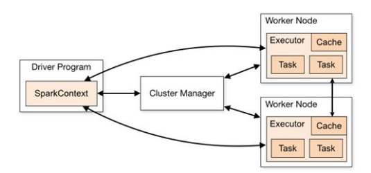
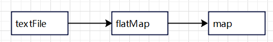
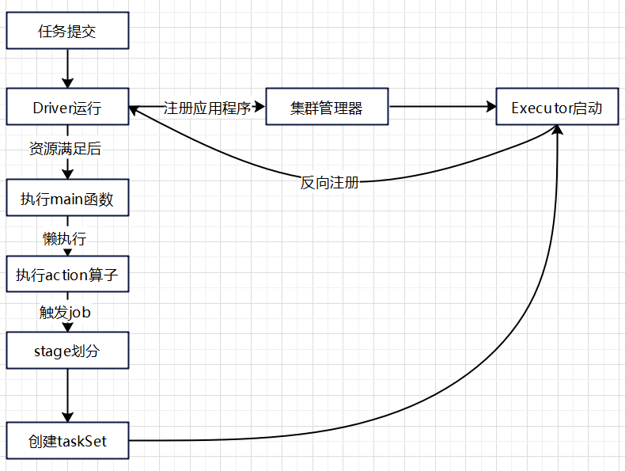
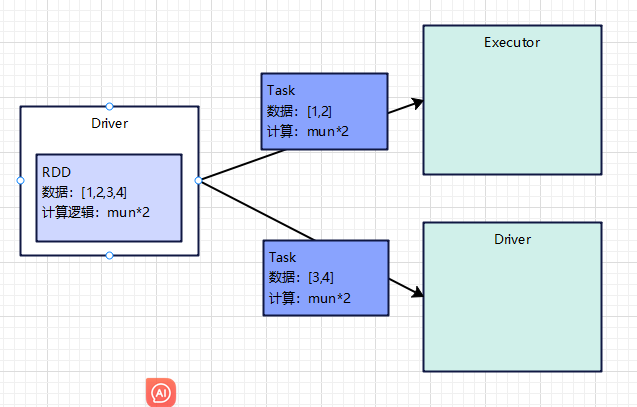

# Spark3.x-基础(Core)

## 运行架构

> Spark 框架的核心是一个计算引擎，整体来说，它采用了标准 master-slave 的结构。 如下图所示，它展示了一个 Spark 执行时的基本结构。图形中的 Driver 表示 master， 负责管理整个集群中的作业任务调度。图形中的 Executor 则是 slave，负责实际执行任务



## 核心组件

**Driver**

> 从上图可以看到Driver是Spark的核心组件之一，是Spark的驱动节点，在执行Spark任务中的main方法，负责实际代码的执行工作，主要工作职责如下

1. 将用户程序转化为作业(job)
2. 在Executor之间调度任务(task)
3. 跟踪Executor的执行情况
4. 通过UI展示查询运行情况

**Executor**

> 从上图可以看到Driver是Executor的核心组件之一，是集群中工作节点(Worker)中的一个JVM进程，负责在Spark作业中运行具体任务(Task)，任务彼此之间相互独立，Spark应用启动时Executor节点会同时启动，并且始终伴随着整个 Spark 应用的生命周期而存在。如果有 Executor 节点发生了 故障或崩溃，Spark 应用也可以继续执行，会将出错节点上的任务调度到其他 Executor 节点 上继续运行

1. 负责运行组成 Spark 应用的任务，并将结果返回给驱动器进程
2. 它们通过自身的块管理器（Block Manager）为用户程序中要求缓存的 RDD 提供内存 式存储。RDD 是直接缓存在 Executor 进程内的，因此任务可以在运行时充分利用缓存 数据加速运算

**Master & Worker**

> Spark 集群的独立部署环境中，不需要依赖其他的资源调度框架，自身就实现了资源调 度的功能，所以环境中还有其他两个核心组件：Master 和 Worker，这里的 Master 是一个进 程，主要负责资源的调度和分配，并进行集群的监控等职责，类似于 Yarn 环境中的 RM, 而 Worker 呢，也是进程，一个 Worker 运行在集群中的一台服务器上，由 Master 分配资源对 数据进行并行的处理和计算，类似于 Yarn 环境中 NM

**ApplicationMaster**

> Hadoop 用户向 YARN 集群提交应用程序时,提交程序中应该包含 ApplicationMaster，用 于向资源调度器申请执行任务的资源容器 Container，运行用户自己的程序任务 job，监控整 个任务的执行，跟踪整个任务的状态，处理任务失败等异常情况。 说的简单点就是，ResourceManager（资源）和 Driver（计算）之间的解耦合靠的就是 ApplicationMaster

## 核心概念

**Executor与Core**

> Spark Executor是集群中运行在工作节点(Worker)中的一个JVM进程，是整个集群中的专门用于计算的节点，在提交应用中可以提供参数指定计算节点的个数，以及对应的资源这里的资源一般指的是工作节点Executor的内存大小和使用的虚拟CPU核(Coure)数量
>
> 在提交任务时通过如下参数调整Executor

| 名称              | 说明                                   |
| ----------------- | -------------------------------------- |
| --num-executors   | 配置 Executor 的数量                   |
| --executor-memory | 配置每个 Executor 的内存大小           |
| --executor-cores  | 配置每个 Executor 的虚拟 CPU core 数量 |

**并行度(Parallelism)**

> 在分布式计算框架中通常是多个任务同时执行的，任务会被分配到不同节点同时执行，所以才能实现真正的并行执行，`并发与并行的区别可以自行百度`在整个集群中可并行执行的任务数量称为并行度，一个作业的并行度是多少取决于框架的配置

**有向无环图(DAG)**

> 在Spark中计算的过程通常都是有先后顺序的，有的任务必须等待另外一些任务执行的限制，就必须对任务进行排队，那么就会形成一个任务对立的集合这个任务集合就是DAG图，每个顶点就是一个任务，每条边代表一种约束(Spark中的依赖关系)



**提交流程**

> 提交流程就是我们编写好的Spark应用程序通过Spark客户端提交给Spark运行环境执行计算的流程，在不同的部署环境中提交流程基本一致，只有细微的区别，这里只列举Yarn环境的提交流程



> Spark应用程序提交Yarn环境执行一般有2中部署方式，Client和Cluster

**Yarn Client模式**

> Client 模式将用于监控和调度的 Driver 模块在客户端执行，而不是在 Yarn 中，所以一 般用于测试

1. Driver 在任务提交的本地机器上运行
2. Driver 启动后会和 ResourceManager 通讯申请启动 ApplicationMaster
3. ResourceManager 分配 container，在合适的 NodeManager 上启动 ApplicationMaster，负责向 ResourceManager 申请 Executor 内存
4. ResourceManager 接到 ApplicationMaster 的资源申请后会分配 container，然后 ApplicationMaster 在资源分配指定的 NodeManager 上启动 Executor 进程
5. Executor 进程启动后会向 Driver 反向注册，Executor 全部注册完成后 Driver 开始执行 main 函数
6. 之后执行到 Action 算子时，触发一个 Job，并根据宽依赖开始划分 stage，每个 stage 生 成对应的 TaskSet,之后将 task 分发到各个 Executor 上执行

**Yarn Cluster 模式**

> Cluster 模式将用于监控和调度的 Driver 模块启动在 Yarn 集群资源中执行。一般应用于 实际生产环境

1. 在 YARN Cluster 模式下，任务提交后会和 ResourceManager 通讯申请启动 ApplicationMaster
2. 随后 ResourceManager 分配 container，在合适的 NodeManager 上启动 ApplicationMaster， 此时的 ApplicationMaster 就是 Driver
3. Driver 启动后向 ResourceManager 申请 Executor 内存，ResourceManager 接到 ApplicationMaster 的资源申请后会分配 container，然后在合适的 NodeManager 上启动 Executor 进程
4. Executor 进程启动后会向 Driver 反向注册，Executor 全部注册完成后 Driver 开始执行 main 函数
5. 之后执行到 Action 算子时，触发一个 Job，并根据宽依赖开始划分 stage，每个 stage 生 成对应的 TaskSet，之后将 task 分发到各个 Executor 上执行

## 核心编程

> Spark 计算框架为了能够进行高并发和高吞吐的数据处理，封装了三大数据结构，用于 处理不同的应用场景。三大数据结构分别是

1. RDD : 弹性分布式数据集
2. 累加器：分布式共享只写变量
3. 广播变量：分布式共享只读变量

### RDD

> RDD（Resilient Distributed Dataset）叫做弹性分布式数据集，是 Spark 中最基本的数据 处理模型。代码中是一个抽象类，它代表一个弹性的、不可变、可分区、里面的元素可并行 计算的集合
>
> RDD是一个最简单的计算单元，在执行过程中RDD会将任务工具Executor数量进行拆分并且发送到各个Executor中完成计算，当多个RDD串连起来就可以组成一个复杂的操作



#### 特点

1. 弹性

   * 存储的弹性：内存于磁盘自动切换

   * 容错的弹性：数据丢失可以自动恢复

   * 计算的弹性：计算出错有重试机制

   * 分片弹性：可工具需要重新分片

2. 分布式：数据存储在大数据集群不同节点上

3. 数据集：RDD封装了计算逻辑，并不保存数据

4. 数据抽象：RDD是一个抽象类，需要子类具体实现

5. 不可变：RDD 封装了计算逻辑，是不可以改变的，想要改变，只能产生新的 RDD，在 新的 RDD 里面封装计算逻辑

6. 可分区、并行计算

#### RDD的创建

##### 从内存中创建RDD

~~~scala
object Spark01_RDD_Memory {
    def main(args: Array[String]): Unit = {
        //准备环境 [*]:表示使用当前系统最大核
        val sparkConf: SparkConf = new SparkConf().setMaster("local[*]").setAppName("RDD")
        val sc: SparkContext = new SparkContext(sparkConf)
        //创建RDD，从内存中创建，将内存集合数据作为数据源
        val seq: Seq[Int] = Seq[Int](1,2,3,4)
        val rdd: RDD[Int] = sc.makeRDD(seq)
        rdd.collect().foreach(println)
        //关闭环境
        sc.stop()
    }
}
~~~

##### 从文件中创建RDD

~~~scala
object Spark01_RDD_File {
    def main(args: Array[String]): Unit = {
        //准备环境 [*]:表示使用当前系统最大核
        val sparkConf: SparkConf = new SparkConf().setMaster("local[*]").setAppName("RDD")
        val sc: SparkContext = new SparkContext(sparkConf)
        //创建RDD，从文件中创建，将文件作为数据源
        //path路径默认当前环境的根路径为基准，可以使用绝对路径
        //path可以为目录，就会读取目录下全部文件
        //path可以使用通配符匹配文件，就会读取匹配的全部文件
        //path可以是分布式文件系统的路径
        //sc.wholeTextFiles("datas/1.txt") 已文件的方式读取内容，读取的结果是一个2元组，[文件名，内容]
        val rdd: RDD[String] = sc.textFile("datas/1.txt")
        rdd.collect().foreach(println)
        //关闭环境
        sc.stop()
    }
}
~~~

##### 创建并行度与分区

> makeRDD方法的第二参数就是指定分区与并行度的大小

~~~scala
object Spark01_RDD_Memory_Par {
    def main(args: Array[String]): Unit = {
        //准备环境 [*]:表示使用当前系统最大核
        val sparkConf: SparkConf = new SparkConf().setMaster("local[*]").setAppName("RDD")
        val sc: SparkContext = new SparkContext(sparkConf)
        //创建RDD
        //参数1：数据源来，参数2：分区数
        val rdd: RDD[Int] = sc.makeRDD(
            List(1, 2, 3, 4), 2
        )
        //将数据保存为分区文件
        rdd.saveAsTextFile("output")
        //关闭环境
        sc.stop()
    }
}
~~~

> 当并行度不传，那么会使用一个默认值，默认值缘于启动时配置的参数


#### RDD常用方法

##### 转换操作(算子)

> 转换功能通常用于将旧的RDD包装成新的RDD用

###### map

将待处理的数据逐条读取发到计算节点处理

签名：

~~~scala
def map[U: ClassTag](f: T => U): RDD[U]
~~~

场景：map可以将数据逐条处理映射转换成想要的类型，在map操作时分区内的数据是有序的，不同分区的执行是无序的

~~~scala
val rdd: RDD[Int] = sc.makeRDD(List(1, 2, 3, 4))
//将旧的RDD转换成新的RDD
val mapRDD: RDD[Int] = rdd.map(_ * 2)
~~~

###### mapPartitions

将待处理的数据以分片的方式读取全部后发送给计算节点处理

签名：

```scala
def mapPartitions[U: ClassTag](
      f: Iterator[T] => Iterator[U],
      preservesPartitioning: Boolean = false): RDD[U]
```

场景：mapPartitions是为了解决map的一个一个读取速度较慢的问题，mapPartitions会将整个分片的数据读取进来所以在传入的匿名函数如参是一个迭代器

缺点：在内存小，分区数据集大时容易出现内存溢出

~~~scala
val rdd: RDD[Int] = sc.makeRDD(List(1, 2, 3, 4), 2)
//将旧的RDD转换成新的RDD
val mpRDD: RDD[Int] = rdd.mapPartitions(iter => {
    iter.map(_ * 2)
})
~~~

###### mapPartitionsWithIndex

将待处理的数据以分区为单位发送给计算节点进行处理，并且在处理时可以获取到当前分区的索引

签名：

~~~scala
def mapPartitionsWithIndex[U: ClassTag](
    f: (Int, Iterator[T]) => Iterator[U],
    preservesPartitioning: Boolean = false): RDD[U]
~~~

场景：可以读取指定分区的数据，获取过滤指定分区数据

~~~scala
val rdd: RDD[Int] = sc.makeRDD(List(1, 2, 3, 4), 2)
//获取1分区内容
val mpRDD: RDD[Int] = rdd.mapPartitionsWithIndex((index, iter) => {
    if (index == 1) {
        iter
    } else {
        Nil.iterator //空迭代器
    }
})
~~~

###### flatMap

签名：

~~~scala
def flatMap[U: ClassTag](f: T => TraversableOnce[U]): RDD[U]
~~~

场景：将多维数组扁平映射，拆分单词组，拆分多种未知类型的数据集

```scala
//案例1
val rdd: RDD[List[Int]] = sc.makeRDD(List(List(1, 2), List(3, 4)))
//将二维的数据拉成一维数组
val flatRDD: RDD[Int] = rdd.flatMap(list => {
    list
})
//案例2
val rdd: RDD[String] = sc.makeRDD(List("Hello Scala","Hello Spark"))
//将多组单词组拆成单个单词
val flatRDD: RDD[String] = rdd.flatMap(s => {
    s.split(" ")
})
//案例3
val rdd: RDD[Any] = sc.makeRDD(List(List(1, 2), 3, List(3, 4)))
//将多组不同规则的数据拆开
val flatRDD: RDD[Any] = rdd.flatMap(data => {
    //模式匹配
    data match {
        case list: List[_] => list //数组直接返回
        case dat => List(dat)      //非数组封装为数组
    }
})
```

###### glom

将同一个分区的数据放入数组中，形成一个二维数组

签名：

```scala
def glom(): RDD[Array[T]]
```

场景：获取每个分区最大值并且求和

~~~scala
//案例1
val rdd: RDD[Int] = sc.makeRDD(List(1,2,3,4),2)
//将分区数据放入数组中
val glomRDD: RDD[Array[Int]] = rdd.glom()
//获取每个分区最大值
val maxRDD: RDD[Int] = glomRDD.map(array => array.max)
//求和
println(maxRDD.collect().sum)
~~~

###### groupBy

对数据进行分组，根据函数返回的key值进行分组，分区数量不变数据会被打乱重新组合，这个操作叫做shuffle

签名：

```scala
def groupBy[K](f: T => K)(implicit kt: ClassTag[K]): RDD[(K, Iterable[T])]
```

场景：对数据进行分组，对数据分组后合计

~~~scala
//案例1
val rdd: RDD[Int] = sc.makeRDD(List(1,2,3,4),2)
//groupBy对数据解析分组，根据返回的key进行分组
val groupRDD: RDD[(Int, Iterable[Int])] = rdd.groupBy(num => {
    num % 2
})
//案例2
val rdd: RDD[String] = sc.textFile("datas/apache.log")
val timeRDD: RDD[(String, Iterable[(String, Int)])] = rdd.map(data => {
    //截取日期
    val datas: String = data.split(" ")(3)
    //格式化
    val date: Date = new SimpleDateFormat("dd/MM/yyyy:HH:mm:ss").parse(datas)
    val time: String = new SimpleDateFormat("HH").format(date)
    (time, 1)
}).groupBy(_._1) //根据time分组

//将分组后合计
timeRDD.map({
    case (hour,iter) => {
        (hour,iter.size)
    }
}).collect().foreach(println)
~~~

###### filter

根据根据指定规则进行筛选过滤，符合规则的数据保留不符合的数据过滤，过滤后分区不变但是分区内数据会不均衡导致数据倾斜

签名：

```scala
def filter(f: T => Boolean): RDD[T]
```

场景：过滤器数据

缺点：数据倾斜

```scala
//案例1
val rdd: RDD[Int] = sc.makeRDD(List(1,2,3,4))
//过滤掉偶数数据
val filterRDD: RDD[Int] = rdd.filter(num => num % 2 != 0)
//案例2
val rdd: RDD[String] = sc.textFile("datas/apache.log")
//过滤掉非17/05/2015数据
rdd.filter(
    line => {
        val time: String = line.split(" ")(3)
        time.startsWith("17/05/2015")
    }
).collect().foreach(println)
```

###### sample

根据指定规则从数据集中抽取数据，基于伯努利随机算法

签名：

```scala
def sample(
    withReplacement: Boolean,
    fraction: Double,
    seed: Long = Utils.random.nextLong): RDD[T]
```

场景：处理数据倾斜让数据重新分布

```scala
val rdd: RDD[Int] = sc.makeRDD(List(1,2,3,4,5,6,7,8,9,10))
//抽取一个数据
//参数1：抽取后是否把数据放回，true放回 false丢弃
//参数2：每条数据可能被抽取的概率，基准值达到这个基准值就算抽中
//参数3：抽取数据时随机算法的种子，如果种子固定那么抽取的数据就是固定了，不传时种子是随机的
println(rdd.sample(
    false,
    0.4,
    1
).collect().mkString(","))
```

###### distinct

签名：

```scala
def distinct(): RDD[T]
```

场景：数据去重

```scala
val rdd: RDD[Int] = sc.makeRDD(List(1,2,3,4,1,2,3,4))
//去重
rdd.distinct().collect().foreach(println)
```

###### coalesce

可对分区进行缩减，默认情况下缩减分区时数据不会被打乱平均分，如果需要打乱重新分区(shuffle)将shuffle=true即可，也可以扩大分区，但是再扩大分区时不进行shuffle那么扩大分区是没有意义的需要打乱重新组合

签名：

```scala
def coalesce(numPartitions: Int, shuffle: Boolean = false,
             partitionCoalescer: Option[PartitionCoalescer] = Option.empty)
            (implicit ord: Ordering[T] = null) : RDD[T]
```

场景：将分区合并

```scala
val rdd: RDD[Int] = sc.makeRDD(List(1,2,3,4),4)
//将4分区合并为2分区
rdd.coalesce(2).saveAsTextFile("output")
```

###### sortBy

对数据进行排序，排序操作分区会进行shuffle操作，默认升序通过修改ascending=false改为降序

签名：

```scala
def sortBy[K](
    f: (T) => K,
    ascending: Boolean = true,
    numPartitions: Int = this.partitions.length)
    (implicit ord: Ordering[K], ctag: ClassTag[K]): RDD[T]
```

场景：

```scala
//案例1
val rdd: RDD[Int] = sc.makeRDD(List(1,5,4,3,2,6),2)
//对数据排序
rdd.sortBy(num => num).saveAsTextFile("output")
//案例2
```

###### intersection

获取2组数据中的交集，数据类型必须相同

签名：

```scala
def intersection(other: RDD[T]): RDD[T]
```

场景：取交集

```scala
val rdd1: RDD[Int] = sc.makeRDD(List(1, 2, 3, 4))
val rdd2: RDD[Int] = sc.makeRDD(List(3, 4, 5, 6))
//交集
println(rdd1.intersection(rdd2).collect().mkString(","))
```

###### union

获取2组数据中的并集，数据类型必须相同

签名：

```scala
def union(other: RDD[T]): RDD[T]
```

场景：取并集

```scala
val rdd1: RDD[Int] = sc.makeRDD(List(1, 2, 3, 4))
val rdd2: RDD[Int] = sc.makeRDD(List(3, 4, 5, 6))
//交集
println(rdd1.union(rdd2).collect().mkString(","))
```

###### subtract

获取2组数据中的差集，数据类型必须相同

签名：

```scala
def subtract(other: RDD[T]): RDD[T]
```

场景：取差集

```scala
val rdd1: RDD[Int] = sc.makeRDD(List(1, 2, 3, 4))
val rdd2: RDD[Int] = sc.makeRDD(List(3, 4, 5, 6))
//交集
println(rdd1.subtract(rdd2).collect().mkString(","))
```

###### zip

将2组数据关联上，分区数量必须相同分区中数据必须相同

签名：

```scala
def zip[U: ClassTag](other: RDD[U]): RDD[(T, U)]
```

场景：将多组数据关联上

```scala
val rdd1: RDD[Int] = sc.makeRDD(List(1, 2, 3, 4))
val rdd2: RDD[Int] = sc.makeRDD(List(3, 4, 5, 6))
//交集
println(rdd1.zip(rdd2).collect().mkString(","))
```

###### partitionBy

对分区数据全部重新分区，与coalesce不同的是partitionBy会将所有数据根据新的规则重新分区

签名：

```scala
def partitionBy(partitioner: Partitioner): RDD[(K, V)]
```

场景：对分区数据全部重新分区

```scala
val rdd: RDD[Int] = sc.makeRDD(List(1, 2, 3, 4))
//将数据转换为kv类型
val mapRDD: RDD[(Int, Int)] = rdd.map((_, 1))
//使用HashPartitioner进行重新分区
mapRDD.partitionBy(new HashPartitioner(2)).saveAsTextFile("output")
```

###### reduceByKey

将相同key的数据进行两两聚合，当key有2个或者以上的数据才会执行，否则就直接返回

签名：

```scala
def reduceByKey(partitioner: Partitioner, func: (V, V) => V): RDD[(K, V)]
```

场景：同key数据聚合

```scala
val rdd: RDD[(String, Int)] = sc.makeRDD(List(
  ("a", 1), ("a", 2), ("a", 3), ("b", 4)
))
//将相同的key数据的value进行聚合
// ("a", 1), ("a", 2) 聚合得到 ("a", 3)
// ("a", 3), ("a", 3) 聚合得到 ("a", 6)
val reduceRDD: RDD[(String, Int)] = rdd.reduceByKey((x: Int, y: Int) => {
  x + y
})
reduceRDD.collect().foreach(println)
```

###### groupByKey

将相同key的数据进行分组形成一个元组

groupByKey和reduceByKey区别：他们都存在shuffle操作那么意味着会落盘存在IO操作，但是reduceByKey在落盘前可以进行一个两类聚合减小落盘的数据量，使得IO更快，而groupByKey只能进行分组落盘然后通过map再聚合

签名：

```scala
def groupByKey(): RDD[(K, Iterable[V])]
```

场景：

```scala
val rdd: RDD[(String, Int)] = sc.makeRDD(List(
  ("a", 1), ("a", 2), ("a", 3), ("b", 4)
))
//将相同的key数据的分在相同组中，形成元组
//元组内容 => (key，相同key的value集合)
val groupRDD: RDD[(String, Iterable[Int])] = rdd.groupByKey()
groupRDD.collect().foreach(println)
```

###### aggregateByKey

reduceByKey只能用于分区内和分区间计算规则是一样的情况下，aggregateByKey可以传入2个计算规则同时计算分区间和分区内的计算规则

签名：

```scala
def aggregateByKey[U: ClassTag](zeroValue: U, partitioner: Partitioner)(seqOp: (U, V) => U,
    combOp: (U, U) => U): RDD[(K, U)]
```

场景：计算key的出现次数，计算key的出现平均次数

```scala
//案例1
val rdd: RDD[(String, Int)] = sc.makeRDD(List(
    ("a", 1), ("a", 2), ("a", 3), ("a", 4)
),2)
//分区内获取最大值，分区间两两求和
//参数列表1: 初始值，用于在进行第一个key时将初始值传入与第一个做计算
//参数列表2: 参数1分区内计算规则，参数2分区间计算规则
rdd.aggregateByKey(0)(
    (x,y) => math.max(x,y),
    (x,y) => x + y
).collect().foreach(println)
//案例2
val rdd: RDD[(String, Int)] = sc.makeRDD(List(
    ("a", 5), ("a", 4), ("a", 2), ("a", 3),
    ("b", 5), ("b", 4), ("b", 2), ("b", 3)
),2)
//计算字母出现次数的平均值
//参数列表1: 初始值，用于在进行第一个key时将初始值传入与第一个做计算
//参数列表2: 参数1分区内计算规则，参数2分区间计算规则
val newRDD: RDD[(String, (Int, Int))] = rdd.aggregateByKey((0, 0))(
    (t, v) => {
        (t._1 + v, t._2 + 1) //数量相加，次数相加
    },
    (t1, t2) => {
        (t1._1 + t2._1, t1._2 + t2._2)
    }
)
//对map中的value转换
val resultRDD: RDD[(String, Int)] = newRDD.mapValues({
    case (num, cnt) => {
        num / cnt
    }
})
resultRDD.collect().foreach(println)
```

###### join

对2组kv数据集进行关联，关联后相同k的数据会被组合一起形成 (k,(v,w))的一组rdd

签名：

```scala
def join[W](other: RDD[(K, W)], partitioner: Partitioner): RDD[(K, (V, W))]
```

场景：相同key的value需要合并到一起（原理类似SQL的inner join）

缺点：2个数据集数据量大时会产生笛卡尔积效应

```scala
val rdd1: RDD[(String, Int)] = sc.makeRDD(List(
  ("a", 1), ("b", 2), ("c", 3)
))
val rdd2: RDD[(String, Int)] = sc.makeRDD(List(
  ("a", 4), ("b", 5), ("c", 6)
))
val joinRDD: RDD[(String, (Int, Int))] = rdd1.join(rdd2)
joinRDD.collect().foreach(println)
```

###### leftOuterJoin

对2组kv数据集进行关联，关联后相同k的数据会被组合一起形成 (k,(v,w))的一组rdd

签名：

```scala
def leftOuterJoin[W](
    other: RDD[(K, W)],
    partitioner: Partitioner): RDD[(K, (V, Option[W]))]
```

场景：以左边的数据集为主表关联右边相同key的value需要合并到一起（原理类似SQL的left join）

```scala
val rdd1: RDD[(String, Int)] = sc.makeRDD(List(
  ("a", 1), ("b", 2), ("c", 3)
))
val rdd2: RDD[(String, Int)] = sc.makeRDD(List(
  ("a", 4), ("b", 5)
))
val leftJoinRDD: RDD[(String, (Int, Option[Int]))] = rdd1.leftOuterJoin(rdd2)
leftJoinRDD.collect().foreach(println)
```

###### rightOuterJoin

对2组kv数据集进行关联，关联后相同k的数据会被组合一起形成 (k,(v,w))的一组rdd

签名：

```scala
def rightOuterJoin[W](other: RDD[(K, W)], partitioner: Partitioner)
    : RDD[(K, (Option[V], W))]
```

场景：以右边的数据集为主表关联左边相同key的value需要合并到一起（原理类似SQL的right join）

```scala
val rdd1: RDD[(String, Int)] = sc.makeRDD(List(
  ("a", 1), ("b", 2), ("c", 3)
))
val rdd2: RDD[(String, Int)] = sc.makeRDD(List(
  ("a", 4), ("b", 5)
))
val rightJoinRDD: RDD[(String, (Option[Int], Int))] = rdd1.rightOuterJoin(rdd2)
rightJoinRDD.collect().foreach(println)
```

###### cogroup

对2组kv数据集进行关联，关联后相同k的数据会被组合一起形成 (k,(集合,集合))的一组rdd，与join类似不过连接后的数据是集合数据不是单个元素

签名：

```scala
def cogroup[W1, W2, W3](other1: RDD[(K, W1)],
    other2: RDD[(K, W2)],
    other3: RDD[(K, W3)],
    partitioner: Partitioner)
    : RDD[(K, (Iterable[V], Iterable[W1], Iterable[W2], Iterable[W3]))]
```

场景：相同key的value需要分组并且合并到一起（原理类似SQL的inner join）

```scala
val rdd1: RDD[(String, Int)] = sc.makeRDD(List(
  ("a", 1), ("b", 2), ("c", 3)
))
val rdd2: RDD[(String, Int)] = sc.makeRDD(List(
  ("a", 4), ("b", 5)
))
val rightJoinRDD: RDD[(String, (Iterable[Int], Iterable[Int]))] = rdd1.cogroup(rdd2)
rightJoinRDD.collect().foreach(println)
```

##### 行动操作(算子)

> 行动功能通常用于触发任务的调度和作业的执行


###### collect

采集操作，实际是触发创建job

签名：

```scala
def collect(): Array[T]
```

场景：创建job

```scala
val rdd: RDD[Int] = sc.makeRDD(List(1, 2, 3, 4))
//触发job的执行
rdd.collect().foreach(println)
```

###### count

获取数据源中数据的个数

签名：

```scala
def count(): Long
```

###### first

获取数据源中的数据第一个

签名：

```scala
def first(): T
```

###### take

从数据源中获取指定数量的数据

签名：

```scala
def take(num: Int): Array[T]
```

###### takeOrdered

对数据排序后从数据源中获取指定数量的数据

签名：

```scala
def takeOrdered(num: Int)(implicit ord: Ordering[T]): Array[T]
```

###### aggregate

直接触发分区内操作和分区间操作并返回结果，与aggregateByKey不同的是aggregateByKey会产生新的RDD，aggregate直接产生结果，aggregateByKey发初始值只会参与分区内计算，aggregate初始值会参与分区内计算并且参与分区间计算

签名：

```scala
def aggregate[U: ClassTag](zeroValue: U)(seqOp: (U, T) => U, combOp: (U, U) => U): U
```

场景：

```scala
val rdd: RDD[Int] = sc.makeRDD(List(1, 2, 3, 4))
//触发job的执行
val result: Int = rdd.aggregate(0)(_ + _, _ + _)
println(result)
```

###### fold

假如分区内操作和分区间操作一样那么可以使用fold操作算子，该算子逻辑和aggregate一样

签名：

```scala
def fold(zeroValue: T)(op: (T, T) => T): T
```

场景：

```scala
val rdd: RDD[Int] = sc.makeRDD(List(1, 2, 3, 4))
//触发job的执行
val result: Int = rdd.fold(0)(_ + _)
println(result)
```

###### countByKey

对元组的第一位作为key，统计key的出现次数

签名：

```scala
def countByKey(): Map[K, Long]
```

场景：

```scala
val rdd = sc.makeRDD(List(
    ("a",1),("a",2),("a",3)
))
//合计a的出现次数
val map: collection.Map[String, Long] = rdd.countByKey()
println(map)
```

###### reduce

聚合RDD中的所有元素，先聚合分区内数据，再聚合分区间数据

签名：

~~~scala
def reduce(f: (T, T) => T): T
~~~

###### save

将RDD输出到文件中

签名：

~~~scala
def saveAsTextFile(path: String): Unit
def saveAsObjectFile(path: String): Unit
def saveAsSequenceFile(
      path: String,
      codec: Option[Class[_ <: CompressionCodec]] = None): Unit
~~~

场景：

~~~scala
val rdd: RDD[(String, Int)] = sc.makeRDD(List(
    ("a",1),("a",2),("a",3)
),2)
//保存数据
rdd.saveAsTextFile("output")
rdd.saveAsObjectFile("output1")
rdd.saveAsSequenceFile("output2")

//关闭环境
sc.stop()
~~~

###### foreach

签名：

~~~scala
def foreach(f: T => Unit): Unit
~~~

场景：

~~~scala
val rdd: RDD[Int] = sc.makeRDD(List(1,2,3,4))
//foreach是Driver端内存集合的循环遍历
rdd.collect().foreach(println)
println("****************")
//foreach是Executor端内存数据打印
rdd.foreach(println)
~~~

