# Spark3.x-基础(部署)

> Apache Spark 是专为大规模数据处理而设计的快速通用的计算引擎
>
> Spark是一种与 Hadoop 相似的开源集群计算环境，但是两者之间还存在一些不同之处，这些有用的不同之处使 Spark 在某些工作负载方面表现得更加优越，换句话说，Spark 启用了内存分布数据集，除了能够提供交互式查询外，它还可以优化迭代工作负载

## Spark核心模块

> Spark Core:提供了Spark最基础与最核心的功能，如SQL、Streaming、MLIB、GraphX都是具有他扩展的
>
> Spark SQL:是Spark用来操作机构化数据的组件，如果Spark SQL用户可以使用SQL或者Hive版本的SQL语言来查询数据
>
> Spark Streaming:是最实时数据就行流式计算的组件，提供了丰富的处理数据流的API
>
> Spark MLIB:是Spark提供的一个机器学习算法库，MLIB不仅提供了模型评估、数据导入等额外功能，还提供一些更底层的机器学习原语
>
> Spark GraphX:是Spark面向图计算提供的框架与算法库

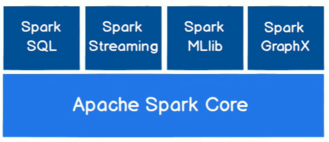

## 开发环境准备

> 因为Spark使用Scala语言开发，所以需要准备Sacla环境以及接下来所有练习都使用Scala进行编写
>
> `Sacla版本2.12.11 Spark版本3.0.0`

### Sacla环境

> 橡下载jdk一样下载好对应的scala安装，并且配置完毕环境变量，并且在控制台中输入scala能够查看到版本号表示安装完毕

Scala下载：https://www.scala-lang.org/download/all.html

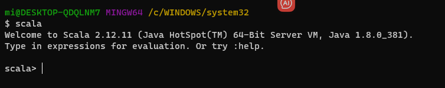

> 安装完毕后要想使用Scale先确保idea安装了scala插件

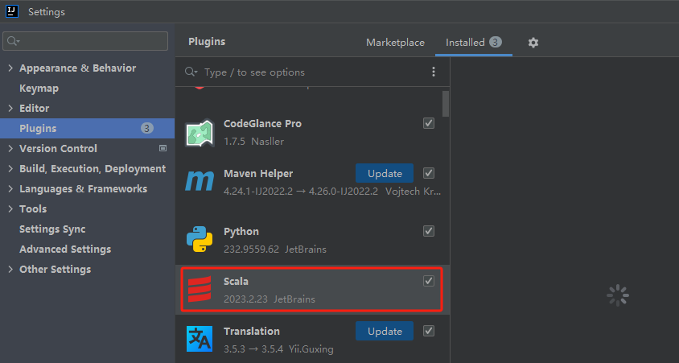

### Maven项目创建

> 创建一个普通Maven项目，并且引入Spark-Cork依赖

~~~xml
<dependency>
    <groupId>org.apache.spark</groupId>
    <artifactId>spark-core_2.12</artifactId>
    <version>3.0.0</version>
</dependency>
~~~

> 在`File`选项卡中进入到`Project Structure`选项，并且全局lib中添加本地的scala环境

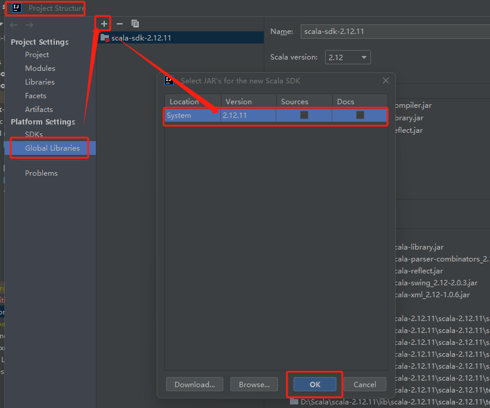

> 创建一个`Test.scala文件`并且测试用例

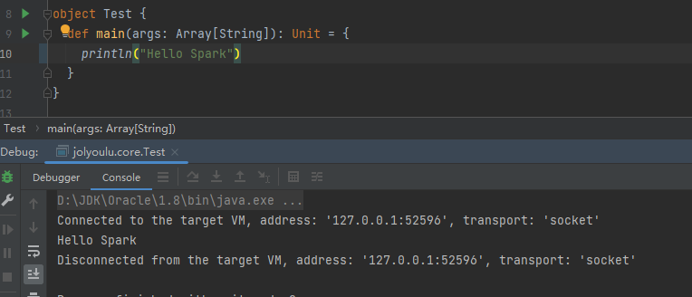

## WorkCount案例

> 在学习之前先利用Spark实现一个最基础的单词统计小案例
>
> 当前在datas文件夹下存在2个文件，并且文件内容如下，我们需要统计出文件中的单词出现次数

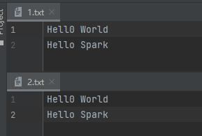

### 思路

> 实现思路与Hadoop基本一致，拆分=>分组=>汇总

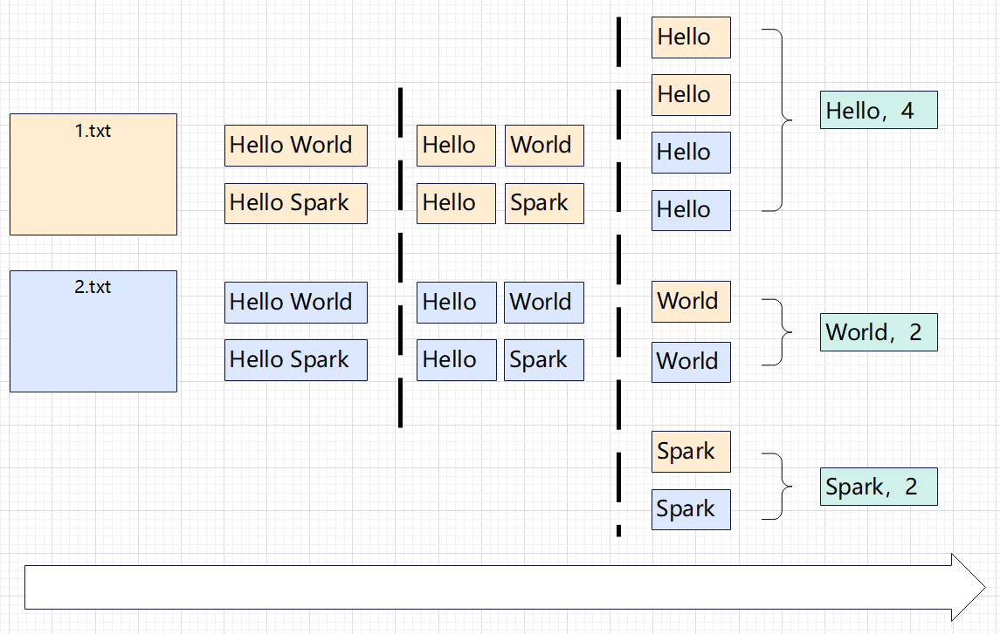

### 代码实现

~~~scala
object Spark01_WordCount {
  def main(args: Array[String]): Unit = {
    //建立和Spark的连接
    val sparkConf: SparkConf = new SparkConf().setMaster("local").setAppName("WordCount")
    val sc = new SparkContext(sparkConf)
    //读取文件
    val lines: RDD[String] = sc.textFile("datas")
    //利用flatMap对数据进行，map+flat
    val words: RDD[String] = lines.flatMap(_.split(" "))
    //根据指定条件分组
    val wordGroup: RDD[(String, Iterable[String])] = words.groupBy(word => word)
    //统计
    val wordToCount: RDD[(String, Int)] = wordGroup.map {
      case(word,list) => {
        (word,list.size)
      }
    }
    //结果转array
    val list: Array[(String, Int)] = wordToCount.collect()
    //输出结果
    list.foreach(println)
    //关闭连接
    sc.stop()
  }
}
~~~

> 测试结果

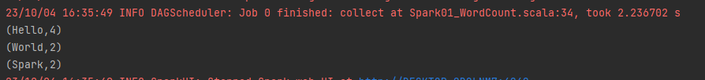

### 常见问题

> 假如运行时提示这个，阅读该文章

[Win-连接HDFS客户端](./Win-连接HDFS客户端.md)

## Spark部署模式

> Spark作为数据处理和计算框架，被设计在所有常见的集群环境中运行，就像Spring常常运行中tomcat中那样，在国内Spark主要是将他运行在Yarn中

### Local模式(单节点)

> 这里的Local模式并不是前面在代码中写道的Local模式只是代码运行时初始化结束就没了，这里的Local模式指的是一个本地的Spark运行环境，在我们电脑按安装一台虚拟机并且部署在虚拟机中

spark-3.0.0-bin-hadoop3.2.tgz下载：https://archive.apache.org/dist/spark/spark-3.0.0/

> 下载完毕后将该包拷贝到你的linux虚拟机中并且解压

~~~shell
#解压缩并且修改名称
tar -zxvf spark-3.0.0-bin-hadoop3.2.tgz -C /opt/module
cd /opt/module 
mv spark-3.0.0-bin-hadoop3.2 spark-local
#启动Local环境
cd spark-local/
bin/spark-shell
~~~

> 在本地模式中可以直接使用scala编写代码

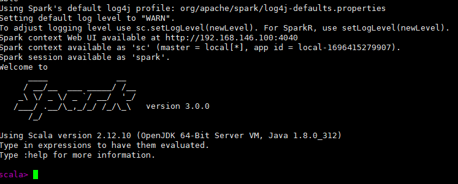

> 启动成功后可以通过`http://192.168.146.100:4040`访问到Spark监控页面

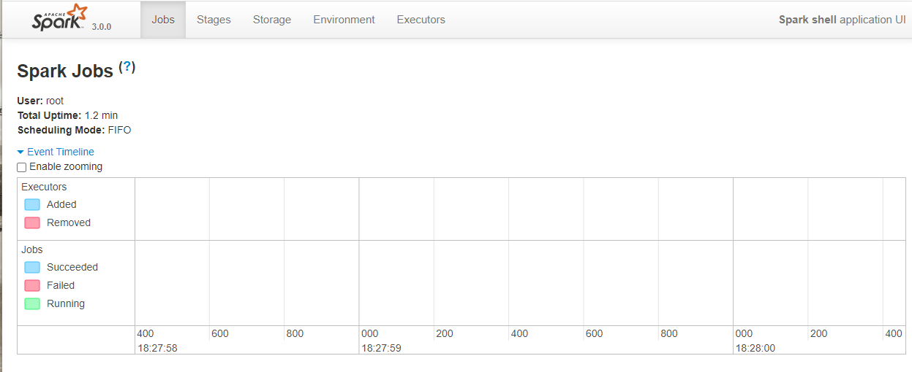

**退出本地模式**

~~~scala
:quit
~~~

**提交应用**

> 本地环境提交应用方式，即将写好的scala文件编译为jar后，上传到虚拟机提交使用命令行提交给spark执行

~~~shell
#--class 表示要执行程序的主类，此处可以更换为咱们自己写的应用程序
#--master local[2] 部署模式，默认为本地模式，数字表示分配的虚拟 CPU 核数量
#spark-examples_2.12-3.0.0.jar 运行的应用类所在的 jar 包，现在使用的是spark实例jar包，实际情况是自己的的jar包
#数字 10 表示程序的入口参数，用于设定当前应用的任务数量
bin/spark-submit \
--class org.apache.spark.examples.SparkPi \
--master local[2] \
./examples/jars/spark-examples_2.12-3.0.0.jar \
10
~~~

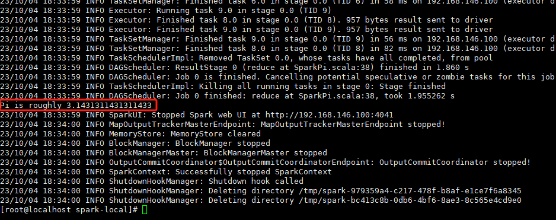

### Standalone模式(集群)

> local本地模式只是用来进行开发环境上的测试，在真爽的工作环境中都是将任务提交到集群中运行的，Standalone模式是Spark自身节点运行的集群模式，也叫独立部署模式，Spark的Standalone的部署方式主要是的master-slave模式

#### 集群部署

> 我们在之前部署过Hadoop集群的102、103、104机器上部署Spark

|       | hadoop102      | hadoop103 | hadoop104 |
| ----- | -------------- | --------- | --------- |
| Spark | Worker(Master) | Worker    | Worker    |

**解压缩安装包**

> 将spark-3.0.0-bin-hadoop3.2.tgz拷贝到102机器上并且解压

~~~shell
#解压缩并且修改名称
tar -zxvf spark-3.0.0-bin-hadoop3.2.tgz -C /opt/module
cd /opt/module 
mv spark-3.0.0-bin-hadoop3.2 spark-standalone
~~~

**修改配置文件**

> 修改slaves文件

~~~shell
#进入到配置文件夹
cd /opt/module/spark-standalone/conf/
#修改文件名
mv slaves.template slaves
#修改文件内容，将机器中的节点都添加进来
vim slaves
~~~

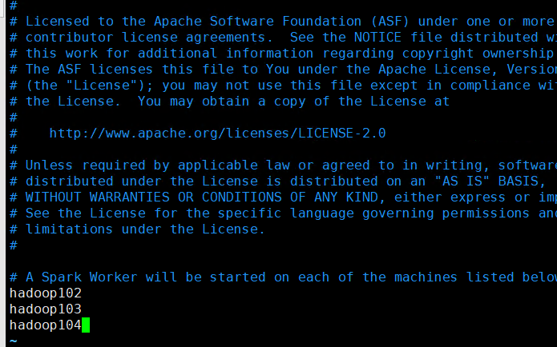

> 修改spark-env文件

~~~shell
#进入到配置文件夹
cd /opt/module/spark-standalone/conf/
#修改文件名
mv spark-env.sh.template spark-env.sh
#修改文件内容，添加java环境变量，以及master主机信息
vim spark-env.sh

###########以下是添加的内容###########
export JAVA_HOME=/opt/module/jdk1.8.0_212
#master节点 web页面端口
export SPARK_MASTER_WEBUI_PORT=8180
#master节点 地址
SPARK_MASTER_HOST=hadoop102
#master节点 通信端口
SPARK_MASTER_PORT=7077
#work节点 web页面端口
export SPARK_WORKER_WEBUI_PORT=8181
~~~

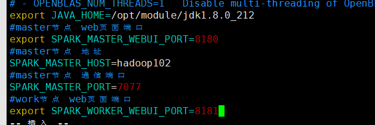

**分发配置文件**

> 将spark与配置文件分发到103、104上

~~~shell
xsync spark-standalone/
~~~

**启动集群**

~~~shell
cd /opt/module/spark-standalone/
sbin/start-all.sh
~~~

> 启动完毕后通过jps命令查看各个节点是否有2个Worker 1个Master

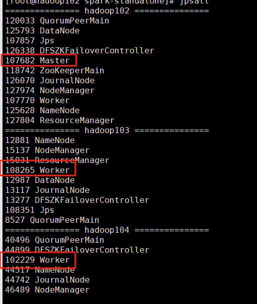

> 在浏览器中访问`http://hadoop102:8180/`

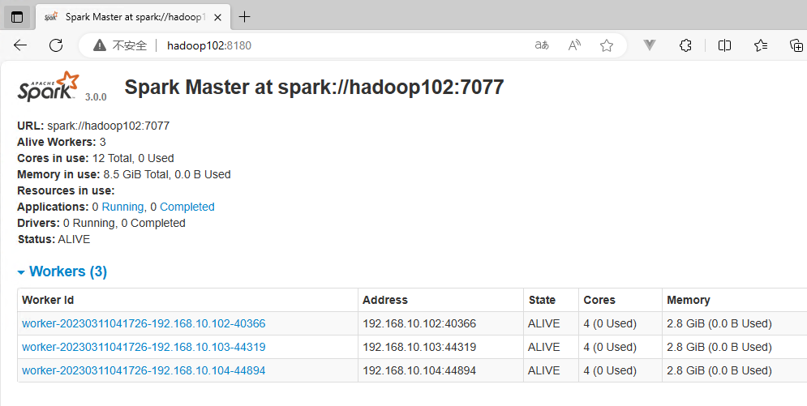

**提交应用**

> 集群环境提交应用方式，即将写好的scala文件编译为jar后，上传到虚拟机提交使用命令行提交给spark执行

~~~shell
#--class 表示要执行程序的主类，此处可以更换为咱们自己写的应用程序
#--master spark://hadoop102:7077 Standalone模式
#spark-examples_2.12-3.0.0.jar 运行的应用类所在的 jar 包，现在使用的是spark实例jar包，实际情况是自己的的jar包
#数字 10 表示程序的入口参数，用于设定当前应用的任务数量
bin/spark-submit \
--class org.apache.spark.examples.SparkPi \
--master spark://hadoop102:7077 \
./examples/jars/spark-examples_2.12-3.0.0.jar \
10
~~~

#### 集群高可用

> 在前面的部署可以发现Master节点只有一个，容易出现单点故障，可以通过设置多个Master解决该问题，那么就需要部署高可用的Saprk，需要配合Zookeeper

|       | hadoop102                     | hadoop103                     | hadoop104             |
| ----- | ----------------------------- | ----------------------------- | --------------------- |
| Spark | Worker(Master) Zookeeper | Worker(Master) Zookeeper | Worker Zookeeper |

> 修改spark-env文件

~~~shell
#进入到配置文件夹
cd /opt/module/spark-standalone/conf/
#修改文件内容
vim spark-env.sh

###########注释以下的内容###########
#SPARK_MASTER_HOST=linux1
#SPARK_MASTER_PORT=7077
###########以下是添加的内容###########
export SPARK_DAEMON_JAVA_OPTS="
-Dspark.deploy.recoveryMode=ZOOKEEPER 
-Dspark.deploy.zookeeper.url=hadoop102,hadoop103,hadoop104
-Dspark.deploy.zookeeper.dir=/spark"
~~~

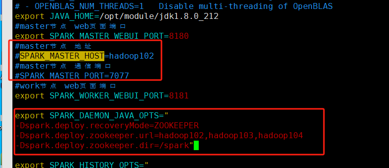

**分发配置信息**

~~~shell
cd /opt/module/spark-standalone/conf/
xsync conf/
~~~

**启动**

~~~shell
#启动集群
sbin/start-all.sh
~~~

> 在hadoop102上启动的集群，现在我们去到hadoop103中在启动一个master节点用于备用

~~~shell
#当前操作是在103上操作的
sbin/start-master.sh
~~~

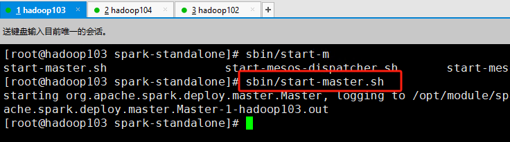

> 启动成功后可以通过`http://hadoop103:8180/`看到当前节点状态是Standby

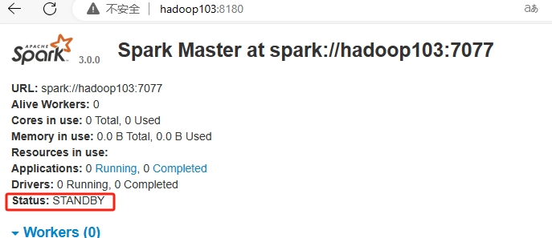

### Yarn模式

> 独立模式(Standalone)需要自己部署一个Spark服务等，是由Spark自身即使资源，这样可以做到不需要第三方框架就能独立运行，Yarn模式就是可以将Spark的任务提交到Hadoop上进行运行Yarn来进行资源分配

**解压缩安装包**

> 将spark-3.0.0-bin-hadoop3.2.tgz拷贝到102机器上并且解压

~~~shell
#解压缩并且修改名称
tar -zxvf spark-3.0.0-bin-hadoop3.2.tgz -C /opt/module
cd /opt/module 
mv spark-3.0.0-bin-hadoop3.2 spark-yarn
~~~

**修改Hadoop配置**

> 需要修改Hadoop集群中的yarn-site.xml配置文件，添加如下内容

~~~xml
<!--是否启动一个线程检查每个任务正使用的物理内存量，如果任务超出分配值，则直接将其杀掉，默认是 true -->
<property>
 <name>yarn.nodemanager.pmem-check-enabled</name>
 <value>false</value>
</property>
<!--是否启动一个线程检查每个任务正使用的虚拟内存量，如果任务超出分配值，则直接将其杀掉，默认是 true -->
<property>
 <name>yarn.nodemanager.vmem-check-enabled</name>
 <value>false</value>
</property>
~~~

**修改Spark配置**

> 修改 conf/spark-env.sh，添加 JAVA_HOME 和 YARN_CONF_DIR 配置

~~~shell
#进入到配置文件夹
cd /opt/module/spark-standalone/conf/
#修改文件名
mv spark-env.sh.template spark-env.sh
#修改文件内容
vim spark-env.sh

###########以下是添加的内容###########
export JAVA_HOME=/opt/module/jdk1.8.0_212
YARN_CONF_DIR=/opt/ha/hadoop-3.1.3/etc/hadoop
~~~

**提交应用测试**

> 修改配置文件后确保Hadoop集群正常运行就可以提交应用了

~~~shell
bin/spark-submit \
--class org.apache.spark.examples.SparkPi \
--master yarn \
--deploy-mode cluster \
./examples/jars/spark-examples_2.12-3.0.0.jar \
10
~~~

> 看到如下内容表示执行成功

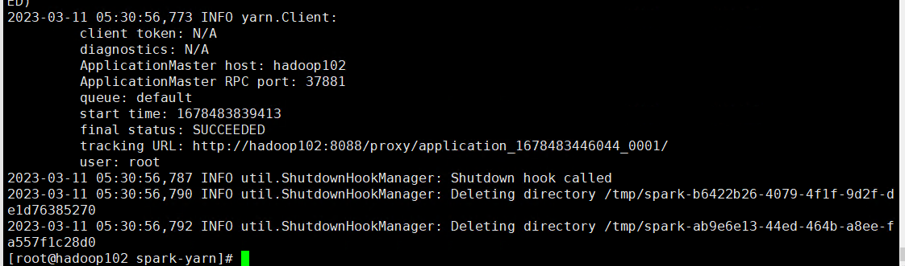

> 可以YarnWeb页面看看执行情况

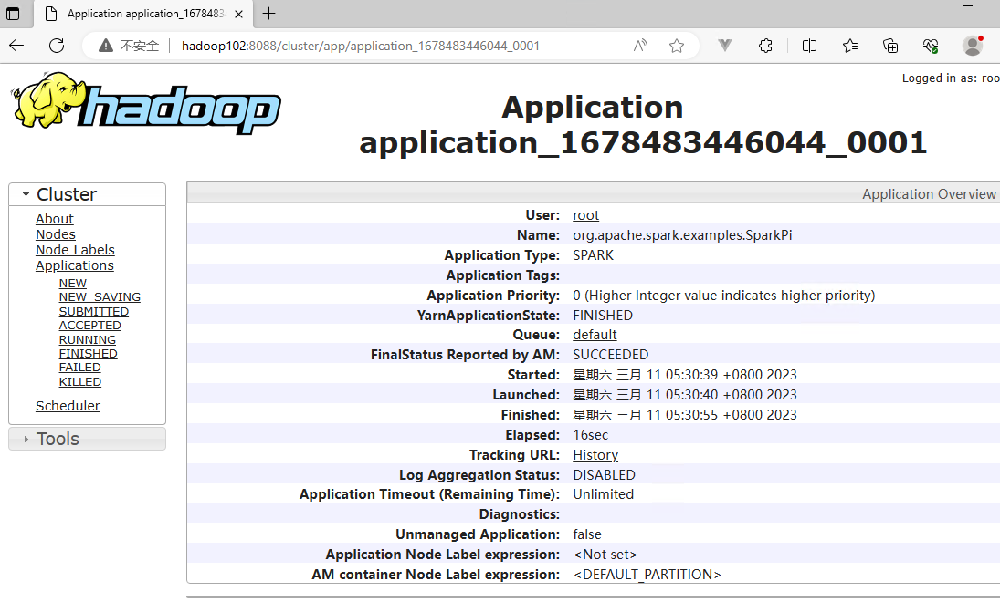

### 配置历史服务 

> 由于spark-shell停止后，集群监控hadoop102:4040就看不懂历史任务的运行情况了，所以需要配置一个历史服务器记录运行情况
>
> 修改sprk-defaults文件

~~~shell
#进入到配置文件夹
cd /opt/module/spark-standalone/conf/
#修改文件名
mv spark-defaults.conf.template spark-defaults.conf
#修改文件内容
vim spark-defaults.conf

###########以下是添加的内容###########
spark.eventLog.enabled true
#启动前先确保hadoop中有这个文件夹
spark.eventLog.dir hdfs://hadoop104:8082/directory

###########Yarn模式需要多加这个###########
spark.yarn.historyServer.address=hadoop102:18080
spark.history.ui.port=18080
~~~

> 修改spark-env文件

~~~shell
#进入到配置文件夹
cd /opt/module/spark-standalone/conf/
#修改文件内容
vim spark-env.sh

###########以下是添加的内容###########
#-Dspark.history.ui.por webui访问端口号18080
#-Dspark.history.fs.logDirectory 指定历史服务器日志存储路径
#-Dspark.history.retainedApplications 指定保存 Application 历史记录的个数，如果超过这个值，旧的应用程序 信息将被删除，这个是内存中的应用数，而不是页面上显示的应用数
export SPARK_HISTORY_OPTS="
-Dspark.history.ui.port=18080 
-Dspark.history.fs.logDirectory=hdfs://hadoop104:8082/directory
-Dspark.history.retainedApplications=30"
~~~

**分发配置信息**

~~~shell
cd /opt/module/spark-standalone/conf/
xsync conf/
~~~

**启动**

~~~shell
#启动历史服务器
sbin/start-history-server.sh
~~~

> 启动成功后提交一个任务后访问`http://hadoop102:18080/`

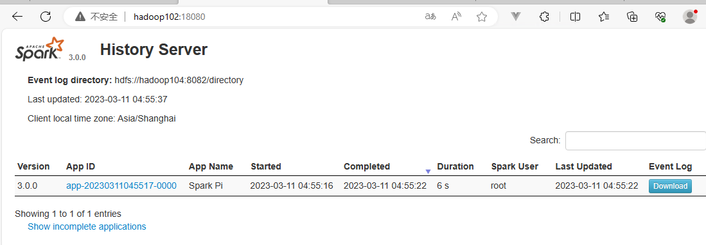

### 提交应用参数

| 参数                     | 说明                                                         | 举例                                       |
| ------------------------ | ------------------------------------------------------------ | ------------------------------------------ |
| --class                  | Spark 程序中包含主函数的类                                   |                                            |
| --master                 | Spark 程序运行的模式(环境)                                   | 模式：local[*]、spark://linux1:7077、 Yarn |
| --executor-memory 1G     | 指定每个 executor 可用内存为 1G                              |                                            |
| --total-executor-cores 2 | 指定所有executor使用的cpu核数 。 为 2 个                     |                                            |
| --executor-cores         | 指定每个executor使用的cpu核数                                |                                            |
| application-jar          | 打包好的应用 jar，包含依赖。这 个 URL 在集群中全局可见。 比 如 hdfs:// 共享存储系统，如果是file:// path，那么所有的节点的 path 都包含同样的 jar |                                            |
| application-arguments    | 传给 main()方法的参数                                        |                                            |

### Win下的Local模式

> 平时在开发时使用虚拟机操作比较复杂，这里就告诉大家如何在Win环境下运行Local模式，只需要将下载好的Spark解压

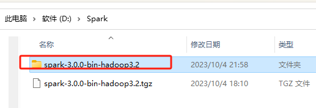

> 进入到bin目录，直接双击`spark-shell.cmd`

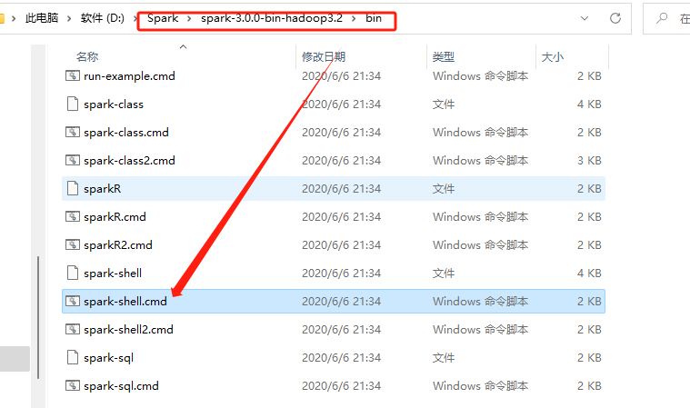

> 看到如下内容表示本地环境启动成功

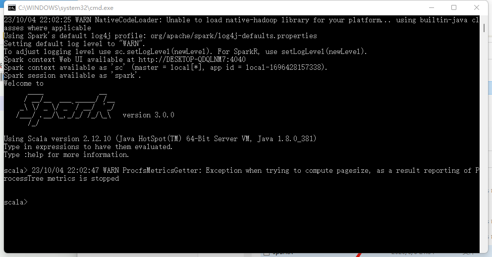

### 部署模式对比

| 模式       | Spark安装集群数 | 需启动的进程   | 所属者 | 应用场景 |
| ---------- | --------------- | -------------- | ------ | -------- |
| Local      | 1               | 无             | Spark  | 测试     |
| Standalone | 3               | Master、Worker | Spark  | 单独部署 |
| Yarn       | 1               | Yarn、HDFS     | Hadoop | 混合部署 |

* Spark 查看当前 Spark-shell 运行任务情况端口号：4040（计算） 

* Spark Master 内部通信服务端口号：7077 

* Standalone 模式下，Spark Master Web 端口号：8080（资源）

* Spark 历史服务器端口号：18080 

* Hadoop YARN 任务运行情况查看端口号：8088
