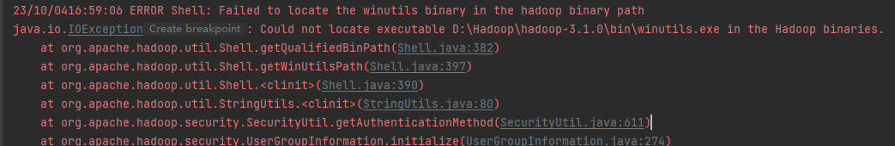
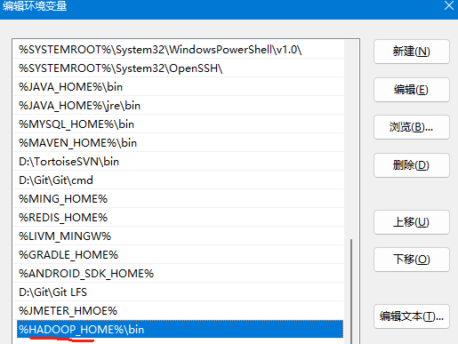
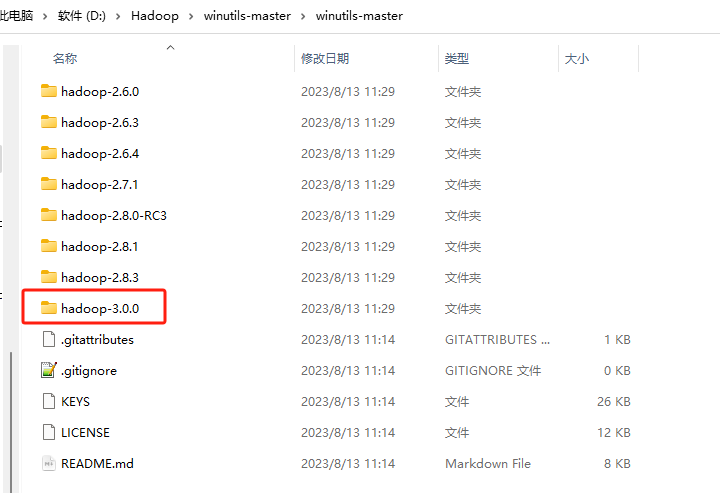
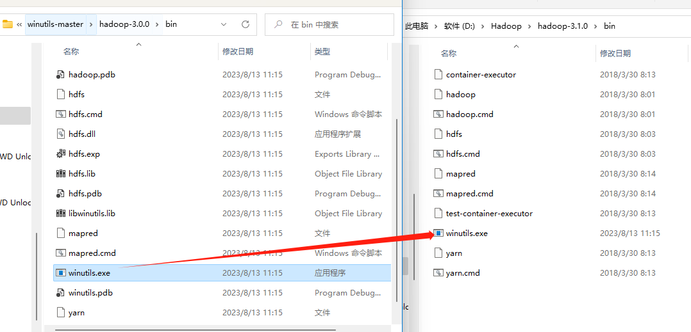

# Win-连接HDFS客户端

**hadoop**

> 平时开发过程中大多数使用的是Win系统，在win系统下连接Hadoop会出现以下问题，这是因为Hadoop目前是不支持win平台的，要想正常连接需要配合一个叫`winutils.exe `的工具

Hadoop下载地址：https://hadoop.apache.org/releases.html

winutils下载地址：https://github.com/steveloughran/winutils

## 环境变量配置

> 将下载好的Hadoop一般是一个`tar.gz`压缩包，这里我使用的是7-Zip进行解压，解压后放入文件夹，并且配置Hadoop环境变量

**winutils**

> winutils下载完毕后解压可以看到不同文件夹分好各个版本的hadoop

> 找到对应版本，将文件夹中的`winutils.exe`拷贝到Hadoo的环境变量的bin目录下即可，可以尝试双击`winutils.exe`如果发现一个黑窗口一闪而过没有任何报错表示配置完毕

