# 并发编程-基础

> 在学习并发编程时，首先需要具备如下几个条件才能让你跟好的阅读该专栏的文章
>
> 1. `希望你不是一个初学者`，对于一些线程安全问题，需要接触过java Web开发、Web服务器、分布式框架时才会遇到，所以需要具备一定实际开发经验才能更好的理解到文章中的例子
> 2. 完成javaSE中的所有知识点学习，了解如何搭建maven项目
> 3. 了解jdk8的新特性，最好对函数式编程和lambda有一定了解
> 4. 对slf4j有所了解，文章中的日志打印都使用slf4j
> 5. 对lombok插件有所了解，文章中使用Lombok简化java bean编

## 项目依赖

> 项目只需要使用Lombok与logback依赖

~~~xml
<properties>
    <maven.compiler.source>8</maven.compiler.source>
    <maven.compiler.target>8</maven.compiler.target>
</properties>

<dependencies>
    <dependency>
        <groupId>org.projectlombok</groupId>
        <artifactId>lombok</artifactId>
        <version>1.18.16</version>
    </dependency>
    <dependency>
        <groupId>ch.qos.logback</groupId>
        <artifactId>logback-classic</artifactId>
        <version>1.2.3</version>
    </dependency>
</dependencies>
~~~

**logback**

> logback.xml的配置

~~~xml
<?xml version="1.0" encoding="UTF-8"?>
<configuration>
    <appender name="STDOUT" class="ch.qos.logback.core.ConsoleAppender">
        <!-- encoders are assigned the type
             ch.qos.logback.classic.encoder.PatternLayoutEncoder by default -->
        <encoder>
            <pattern>%d{HH:mm:ss.SSS} [%thread] %-5level %logger{36} - %msg%n</pattern>
        </encoder>
    </appender>

    <logger name="c" level="debug" additivity="false">
        <appender-ref ref="STDOUT" />
    </logger>

    <root level="debug">
        <appender-ref ref="STDOUT" />
    </root>
</configuration>
~~~

## 进程与线程

### 进程

> 程序是由指令和数据组成，指令需要运行、数据需要读写，那么就需要将指令加载到CPU中，在win下`xxx.exe`文件在打开后都会产生一个进程
>
> 如打开一个QQ就是打开了一个进程，你的电脑登录了3个QQ那么表示着你电脑运行着3个QQ的进程，它们是独立运行相互不相干的
>
> 当然也有一些程序只能有一个进程，如360安全卫士、QQ音乐

### 线程

> 在一个进程中可以分配很多的线程来干活
>
> 一个线程就是一个指令流，指令流中的一条条指令以一定的顺序交给CPU执行
>
> 在java中，线程是最新的调度单位，进程作为资源分配的最小单位，在win中进程是不活动的，进程只作为线程的容器，真正活动的是线程

### 总结

> * 进程基本上是相互独立的，而线程存在于进程内，是进程的子集
> * 进程拥有共享的资源，如内存空间等，可供内部线程共享
> * 进程之间通信比较复杂
>   1. 相同计算机的进程通信称为IPC(Inter-process communication)
>   2. 不同计算机之间的进程通信，就需要使用到网络，并且遵守共同的协议，如HTTP
>
> * 线程通信相对简单，因为它们共享进程内的内存，多个线程可以访问到同一个共享的变量
> * 线程更轻量，线程上下文切换比进程要低

## 并发与并行

### 并发

> 进程的运作全靠CPU去执行指令，到单核CPU下进程中的线程都是并发执行的
>
> 图中描绘了在进程中的线程是如何并发执行的，可以发现当进程在执行中，在某一刻时候有一个线程在工作，CPU将时间片划分给不同的线程，不停快速切换到不同的线程工作，由于CPU切换线程是非常快速的所有会给你觉得这3个线程是同时进行的，实际是交替进行的这被称为并发执行

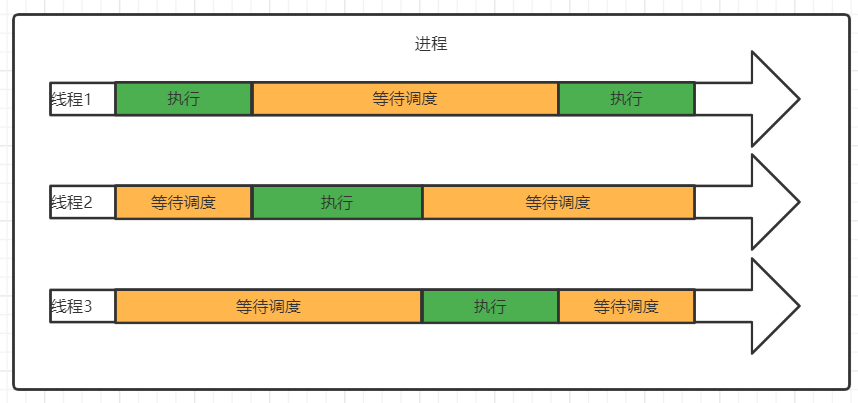

### 并行

> 当一个进程在一个多核的CPU上运行时，那么多个线程就可以并行执行
>
> 图中描绘了在进程中的线程是如何并行执行的，可以发现当进程在执行中，多个线程可以同时工作，当然这取决于计算机的CPU核心数，越多核的CPU就能支持越多线程同时工作，这被称为并行执行

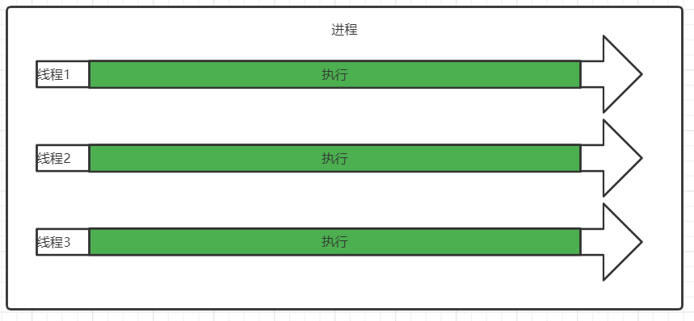

### 总结

> 在跟多的情况下线程既有并行也并发
>
> 例如：你的电脑CPU配置为4核心，那么表示电脑能同时支持4个线程并行执行，当然实际情况电脑在运行时开了一堆软件，成百上千的线程等待着CPU的时间分片，所有并行于并发是同时存在的，某一刻可以有4个线程并行执行，CPU会快速的在几百个线程中切换并发执行

## JAVA线程

### 创建和运行线程

> 每一个java进程在启动后必定会创建一个mian线程，即主方法线程，在运行期间我们还能使用java提供的API创建线程

#### Thread

> 实现Thread对象，重写run方法，在run方法种编写的代码即该线程执行的代码，调用start方法启动线程

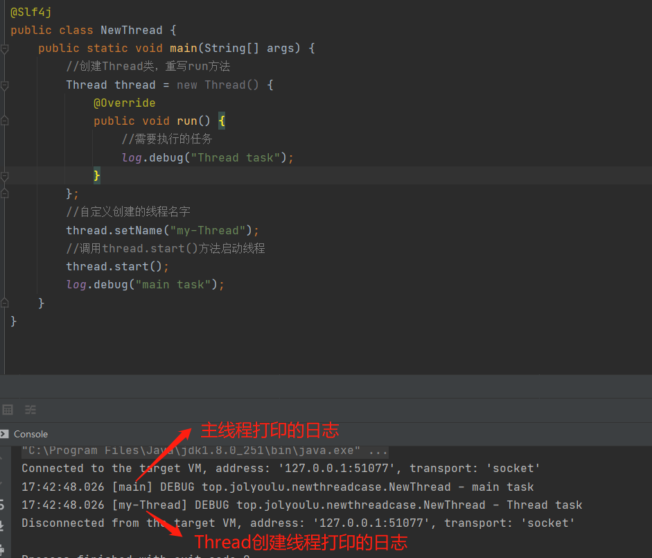

#### Runnable

> Runnable是一个接口需要配置Thread对象使用，实现Runnable后必须实现run方法，在run编写线程需要执行的代码，构建Thread类传Runnable，调用start方法启动线程

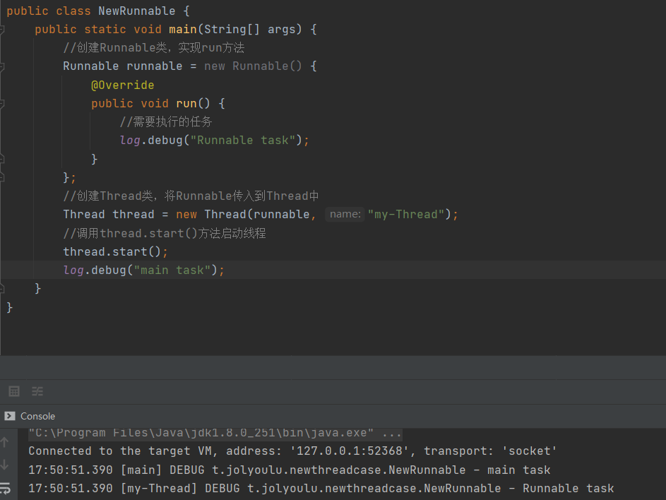

#### Thread于Runnable的区别

> Thread是通过继承的方式覆写了run方法，所有在start后run方法执行的就是用户覆写的内容
>
> Runnable实际也是调用的Thread中的run方法，如下我们如果Thread源码构造方法

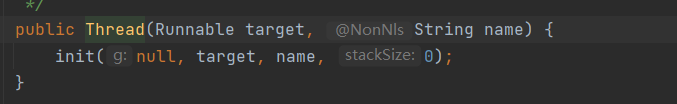

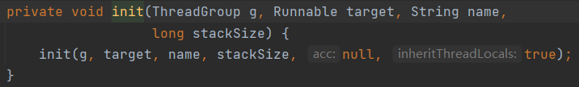

> 跟踪到init方法后，可以看到Runnable被赋值到了target属性上

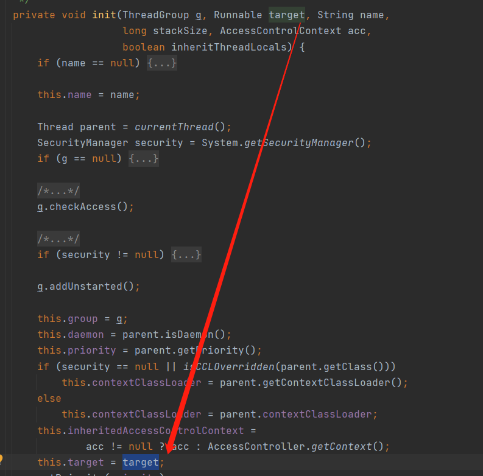

> 在Thread的run方法中也可以发现，在执行时会判断target非空就执行target的run方法，这正是Runnable

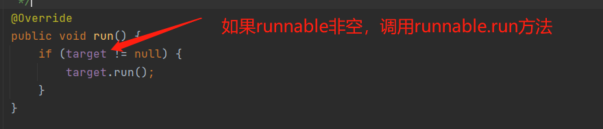

#### FutureTask

> FutureTask可以接受一个callable，可以添加返回执行结果

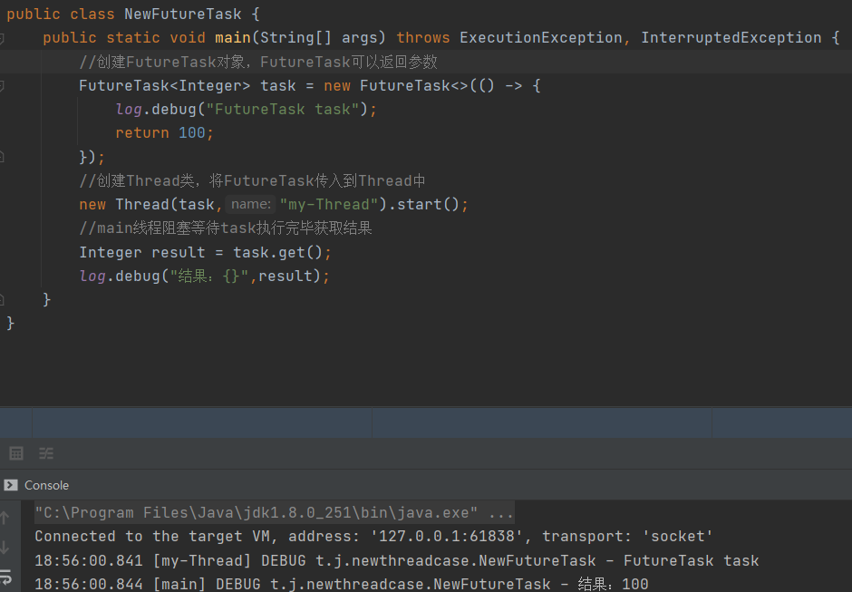

### 查看进程方法

> 不同平台下查看进程的方式也不一样

#### Windows

| 命令     | 说明     |
| -------- | -------- |
| tasklist | 查看进程 |
| taskkill | 杀死进程 |

#### Liunx

| 命令            | 说明                    |
| --------------- | ----------------------- |
| ps -ef          | 查看所有进程            |
| ps -fT -p <PID> | 查看某个进程的所有线程  |
| kill <PID>      | 杀死指定pid进程         |
| top             | 按大写H切换是否显示线程 |
| top -H -p <PID> | 查看某个进程的所有线程  |

#### Java

| 命令         | 说明                                 |
| ------------ | ------------------------------------ |
| jps          | 查看所有java进程                     |
| jstack <PID> | 查看java进程的所有线程状态           |
| jconsole     | 查看java进程中线程运行情况(图形界面) |

> jconsole是可以连接远程的java进程的，需要在目标java程序增加如下启动参数

~~~shell
java -Djava.rmi.server.hostname=ip地址 -Dcom.sun.management.jmxremote -Dcom.sun.management.jmxremote.port=连接端口 -Dcom.sun.management.jmxremote.ssl=是否安全连接 -Dcom.sun.management.jmxremote.authenticate=是否认证 java类
~~~

> 如果要认证访问，还需要做如下步骤 
>
> 复制 jmxremote.password 文件
>
> 修改 jmxremote.password 和 jmxremote.access 文件的权限为 600 即文件所有者可读写 连接时填入 controlRole（用户名），R&D（密码）

### 常见方法

> 在使用多线程时，需要了解一些比较常见的方法

| 方法             | 说明                                                       | 注意                                                         |
| ---------------- | ---------------------------------------------------------- | ------------------------------------------------------------ |
| start()          | 启动一个线程，在new Thread后需要调用该方法启动线程         | start方法只是让线程进入就绪状态，不一定立刻执行，而是告诉cpu我做不好了，等待cpu的时间分片 |
| run()            | 新线程启动后会执行的方法                                   | 如果Thread对象传递了Runnable，则形成启动后会调用Runnable.run()，否则默认不执行任何操作，可以通过继承Thread重写run方法覆盖默认行为 |
| join()           | 等待线程运行结束                                           |                                                              |
| join(long)       | 等待下次运行结束，最多等待多少毫秒                         |                                                              |
| getId()          | 获取线程长整型的id                                         | id唯一                                                       |
| getName()        | 获取线程名                                                 |                                                              |
| setName(String)  | 修改线程名                                                 |                                                              |
| getPriority()    | 获取线程优先级                                             |                                                              |
| getPriority(int) | 设置线程优先级                                             |                                                              |
| getState()       | 获取线程状态                                               | java中规定线程状态有6种，分别为：NEW、RUNNABLR、BLOCKED、WAITING、TIMED_WAITING、TERMINATED |
| isInterrupted()  | 判断是否被打断                                             | 不会清理打断标记                                             |
| idAlive()        | 线程是否存活(还没运行完毕)                                 |                                                              |
| interrupt()      | 打断线程                                                   | 如果打断真正sleep、wait、join会导致被打断的线程抛出InterruptedException，并清除打断标记 如果打断正在运行的线程，则会设置打断标记 park的线程被打断，也会设置打断标记 |
| interrupted()    | 判断当前线程是否被打断                                     | 会清理打断标记                                               |
| currentThread()  | 获取当前正在运行的线程                                     |                                                              |
| sleep(long)      | 让当前执行的线程休眠n毫秒，休眠时让出cpu的时间片给其它线程 |                                                              |
| yield()          | 提示线程调度器让出当前线程对cpu的使用                      | 主要是测试和调试                                             |

#### start与run区别

> 对于初学者来说，往往会分不清start与run方法的区别，如果你在调用run方法时其实相当于普通的方法调用而已，从日志中可以看到运行该方法的是main线程

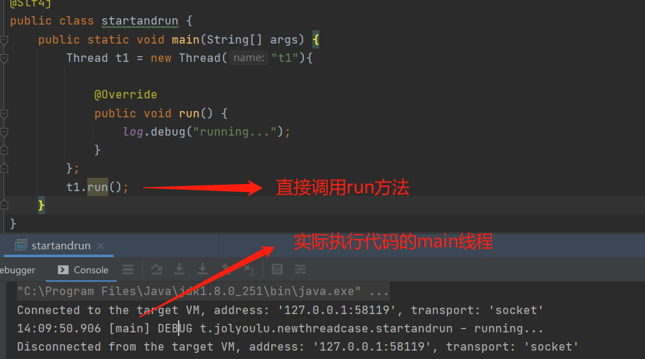

> 当调用start方法时，那么就是真正的开启了线程，去执行该任务，可以看到日志是由t1线程打印的

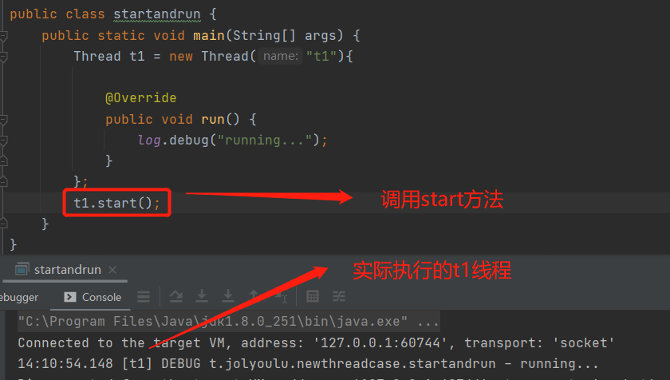

#### sleep与yield区别

**sleep**

> 1. 调用sleep会让当前线程从RUNNING进入到TIMED_WAITING状态
> 2. 其它线程可以使用interrupt()方法打断正在睡眠的线程，这时sleep方法会抛出InterruptedException
> 3. 睡眠结束后的线程未必立刻执行
> 4. 建议用TimeUnit的sleep代替Thread的sleep来获得更好的可读性

**yield**

> 1. 调用yield会让当前线程从RUNNING进入到RUNNABLE(就绪)状态，然后调度执行其它线程
> 2. 具体的实现依赖于操作系统的任务调度器

#### 线程优先级

> 线程优先级越高的线程就越任意得到cpu的时间分片，有了cpu的时间分配就可以执行代码了，所有通过例子可以看出将t2的优先级设置到最高后t2执行的次数也比t1更多

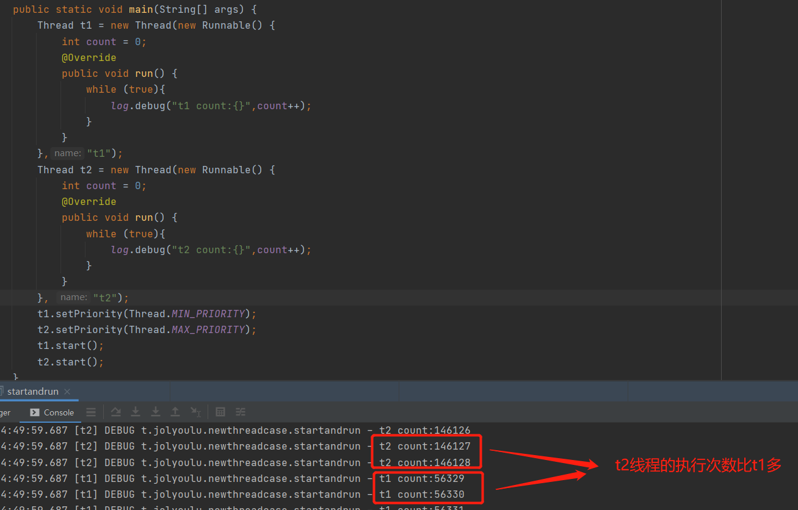

#### join

> 带多线程的代码运行中，常常会遇到流程控制的问题，流程控制长没做好程序则会在运行中出错，如下代码编写者其实是想开启一个t1线程去执行计算代码，最后需要在main获取到结果但从日志中可以发现到最后并不是想要的结果，由于t1与main线程是2个独立的线程，独立执行所有你不能确保t1一定比main线程先执行完毕，解决这个问题那么就需要使用join()让main等待t1线程

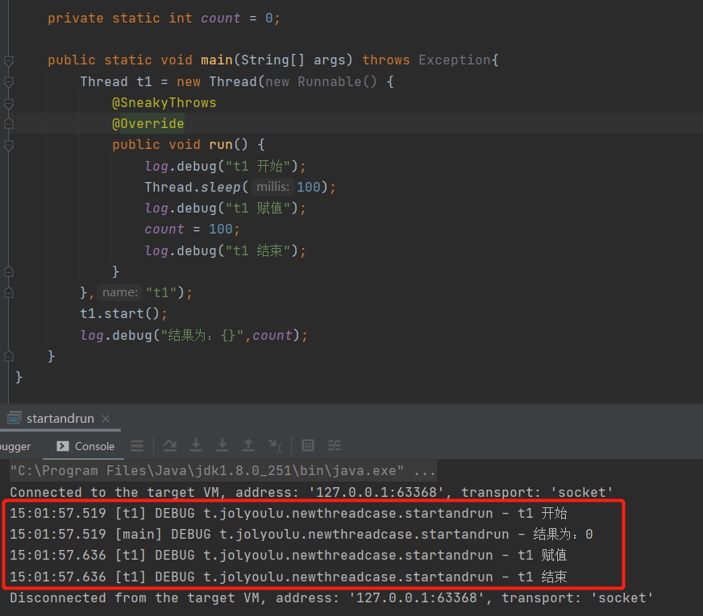

> 在主线程中调用t1.join()表示main需要等待t1结束继续执行后续代码，修正后可以看到程序按照预期的逻辑执行

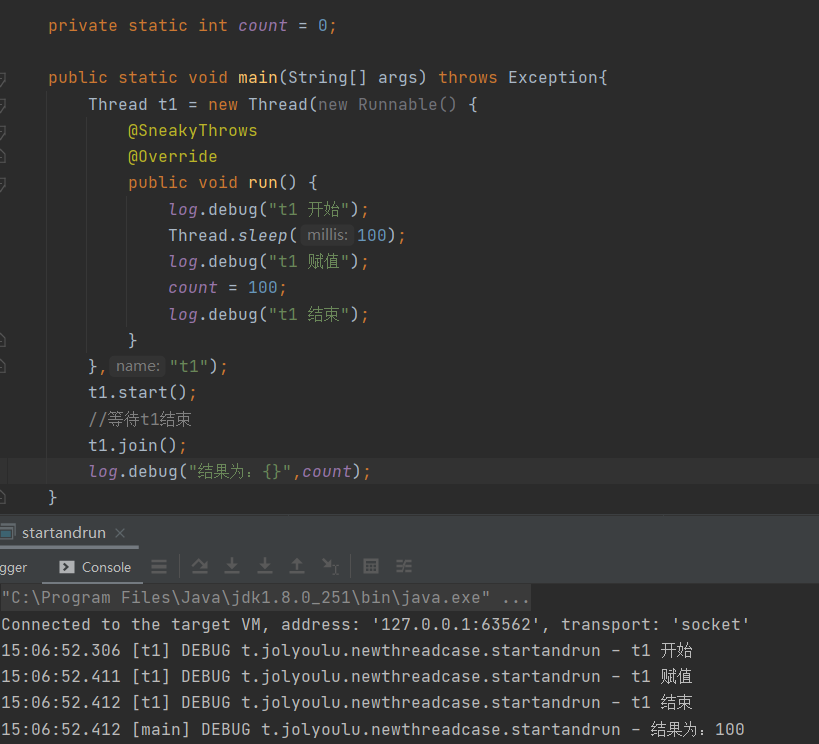

#### interrupt

> interrupt可用于打断线程，interrupt的使用是初学者最容易混淆的一个知识

##### interrupt作用

> 有很多的初学者都会认为调用interrupt后线程就会自动停止工作，然而并不是interrupt只是会标记线程的打断标记`true`而且，被标记的线程如果是非`sleep、wait、jion`仍然是在执行中的，开发者需要在自己的代码中判断打断标记是否true，如果是true手动编写代码取消
>
> 可以发现interrupt只是标记线程被打断，并没用对线程做任何的额外操作，之所以这样设计是将打断操作交给开发者自己，设想如果调用interrupt线程就被打断在某种情况下是不合理的，因为有可能某一个线程工作中如果被突然停止可能会出现不可预测的问题，所以最好的做法就是将打断交给开发者自己处理是直接关闭线程还是先清理资源再关闭，重要的事情一定要记住`interrupt并不会停止运行中的线程，只是会标记线程打断状态，最终如何打断由开发者自己的代码处理`
>
> 如图：充分证明调用interrupt但不处理interrupt线程是永远不会停下来的，接下来就教大家如何打断线程

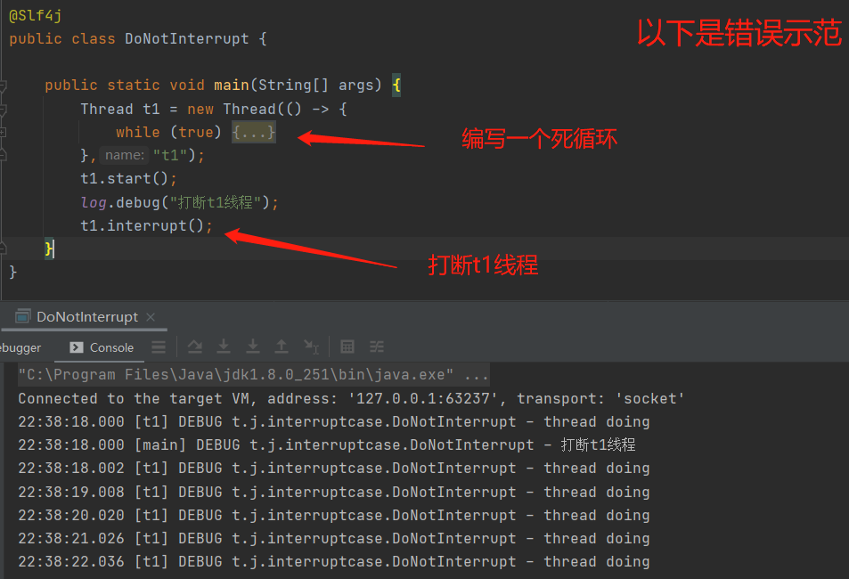

##### 打断阻塞

> 当线程在阻塞状态下(如代码中利用了：sleep、wait、jion)，那么调用interrupt后着会进入到一个InterruptedException异常，你可以在异常里面处理你需要如何关闭这个线程，当然你也可以在这里面恢复取消打断状态
>
> 注意：线程在阻塞状态下被打断后进入异常，打断标记会被重制为`false`，如果需要打断那么需要重新调用`interrupt`

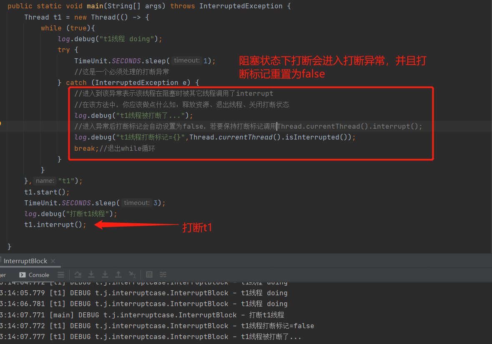

##### 打断正常

> 当线程在正常执行时，需要编写代码检查线程是否被标记打断，一般在任务开始前进行判断，判断线程是否被打断有2种方法
>
> Thread.currentThread().isInterrupted()：获取当前线程的打断标记`不会重置打断标记`
>
> Thread.interrupted()：获取当前线程的打断标记，获取完毕后`会重置打断标记为false`

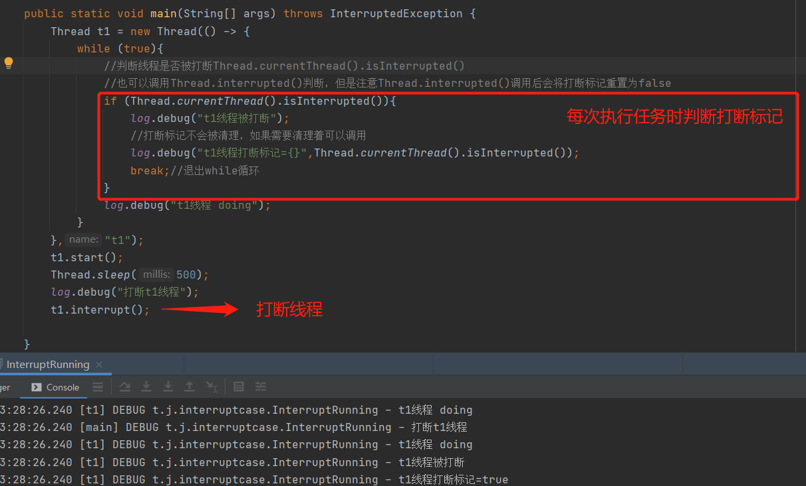

##### 打断Park

> interrupt可以唤醒调用了park的线程
>
> 注意：当线程的打断标记为true后，`LockSupport.park();`会失效

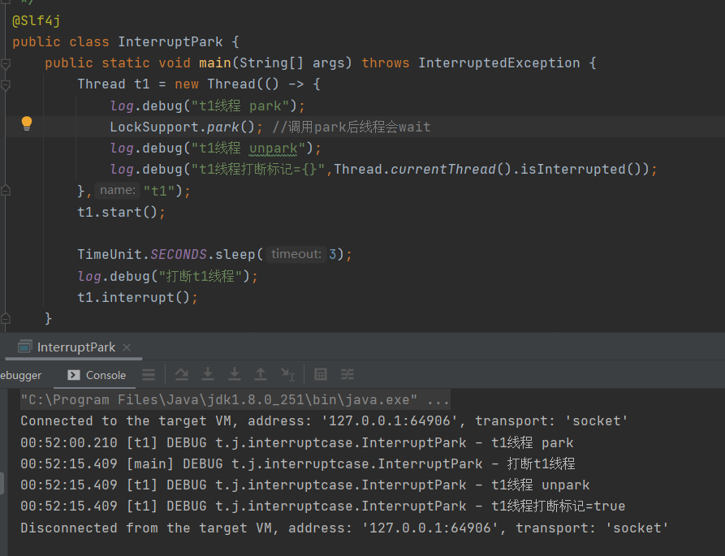

### 主线程与守护线程

#### 主线程

> 主线程就是mian线程，这里就不作过多解释了

#### 守护线程

> 默认情况下，Java进程需要等待所有非守护线程都运行结束才会结束整个java进程，但有的特殊线程叫守护线程java进程结束时是不会管守护线程代码有没有执行完的，而是直接强制结束
>
> 垃圾回收器就是一种守护线程，java进程关闭后无需等待垃圾回收线程停止而是可以关闭

~~~java
Thread t1 = new Thread();
t1.setDaemon(true); //设置t1是守护线程
t1.start();
~~~

### 线程的状态

#### 操作系统的线程状态

> 在操作系统层面线程通常有4种状态
>
> 初始状态：在语言层面表示创建了一个线程对象，还没与操作系统线程关联
>
> 可运行状态：表示该线程已经与操作系统关联，准备就绪等待CPU调度
>
> 运行状态：获取到了CPU的`时间分片`，线程中的代码正在被执行，当时间分片用完了会重新进入到`可运行状态`，等待下一次的时间分片
>
> 阻塞状态：阻塞等待某个IO操作(如：读写文件)，当IO操作完成后会会重新进入到`可运行状态`，等待CPU调度，阻塞状态下的线程CPU是不会分配时间分片给它的

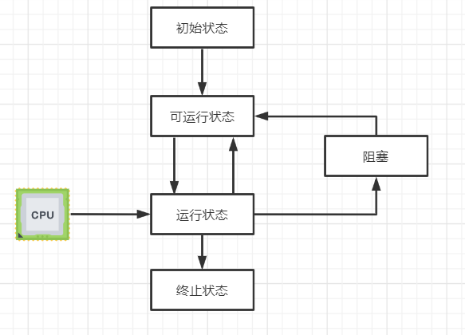

#### java中的线程状态

> Thread.State枚举中包含着java线程运行时的状态
>
> 状态java中也有自己的线程状态，java中的线程状态是对操作系统中的线程状态做合并细化操作，将操作系统中的可运行、运行、阻塞状态做了合并为RUNNABLE状态，并且在运行期间新增加了BLOCKED、WAITING、TIMED_WAITING状态

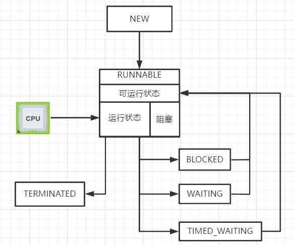

| 状态          | 说明                                                         |
| ------------- | ------------------------------------------------------------ |
| NEW           | 线程刚被创建，但是还没调用start方法                          |
| RUNNABLE      | 当调用start方法后，线程就标记为RUNNABLE，注意在该状态下包含了操作系统层面的可运行、运行中、阻塞3种状态，所以在BIO导致的线程阻塞在java中通过线程状态是无法区分的 |
| BLOCKED       | 当线程等待其它线程释放锁时会进入该状态，当该线程得到其它线程释放锁后会重新回到`RUNNABLE`状态 |
| WAITING       | 当线程调用wait或其它线程调用当前线程的join会进入该状态，当线程等待其它线程唤醒后重新回到`RUNNABLE`状态 |
| TIMED_WAITING | 当线程调用sleep方法时，会进入该状态，达到指定sleep后会重新回到`RUNNABLE`状态 |
| TERMINATED    | 表示线程已经执行完毕                                         |

> 各个线程中状态的示例

~~~java
@Slf4j
public class ThreadState {

    public static void main(String[] args) {
        Object lock = new Object();

        //NEW状态
        Thread t1 = new Thread(() -> {}, "t1");

        //RUNNABLE状态
        Thread t2 = new Thread(() -> {
            while (true);
        }, "t2");
        t2.start();

        //TERMINATED状态
        Thread t3 = new Thread(() -> {
        }, "t3");
        t3.start();

        //TIMED_WAITING状态
        Thread t4 = new Thread(() -> {
            try {
                synchronized (lock){
                    TimeUnit.DAYS.sleep(1);
                }
            } catch (InterruptedException e) {
                e.printStackTrace();
            }
        }, "t4");
        t4.start();

        //WAITING状态
        Thread t5 = new Thread(() -> {
            Thread current = Thread.currentThread();
            synchronized (current){
                try {
                    current.wait();
                } catch (InterruptedException e) {
                    e.printStackTrace();
                }
            }
        }, "t5");
        t5.start();

        //BLOCKED状态
        Thread t6 = new Thread(() -> {
            synchronized (lock){

            }
        }, "t6");
        t6.start();

        log.debug("t1 start {}",t1.getState());
        log.debug("t2 start {}",t2.getState());
        log.debug("t3 start {}",t3.getState());
        log.debug("t4 start {}",t4.getState());
        log.debug("t5 start {}",t5.getState());
        log.debug("t6 start {}",t6.getState());
    }
}
~~~

