# 多线程设计模式

## 两阶段终止模式

> 两阶段终止模式，是一种常见的线程多线程设计模式，该设计模式可让在一个线程t1中如何优雅的终止t2线程

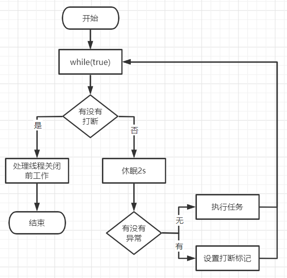

### interrupt方式示例

~~~java
@Slf4j(topic = "TwoPhaseTermination")
class TwoPhaseTermination{
    private Thread monitor;

    //启动监控线程
    public void start(){
        monitor = new Thread(() ->{
            while (true){
                Thread current = Thread.currentThread();
                if (current.isInterrupted()){
                    log.debug("处理线程关闭前工作");
                    break;//结束循环
                }
                //睡眠2s后执行业务代码
                try {
                    TimeUnit.SECONDS.sleep(2);
                    log.debug("执行监控记录");
                } catch (InterruptedException e) {
                    //如果在sleep中被打断了，进入到异常时打断标记会被重置
                    //需要重新设置打断标记为true
                    current.interrupt();
                }
            }
        });
        monitor.start();
    }

    //停止监控线程
    public void stop(){
        monitor.interrupt();
    }
}
~~~
> 编写测试用例：
>
> 主线程调用start后，监控线程每隔2秒会执行一次监控任务
>
> 主线程调用stop后，监控线程无论在阻塞状态或执行状态下都能正常的停止

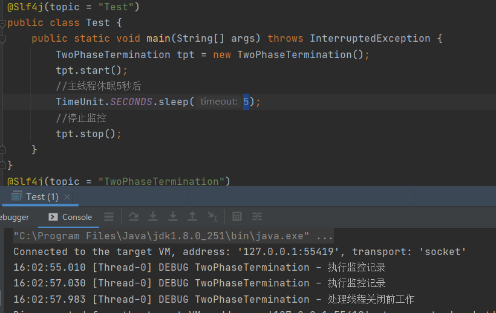

### volatile方式示例

~~~java
@Slf4j(topic = "TwoPhaseTermination")
public class TwoPhaseTermination {
    private Thread monitor;
    //停止标记
    private volatile boolean stop = false;

    //启动监控线程
    public void start() {
        monitor = new Thread(() -> {
            while (true) {
                if (stop) {
                    log.debug("处理线程关闭前工作");
                    break;//结束循环
                }
                //睡眠2s后执行业务代码
                try {
                    TimeUnit.SECONDS.sleep(2);
                    log.debug("执行监控记录");
                } catch (InterruptedException e) {
                    //当线程休眠时被打断会触发该
                    //这里不做如何处理进入下次循环后通过stop判断
                }
            }
        });
        monitor.start();
    }

    //停止监控线程
    public void stop() {
        stop = true;
        monitor.interrupt(); //设置打断标记
    }
}
~~~

> 编写测试用例：
>
> 主线程调用start后，监控线程每隔2秒会执行一次监控任务
>
> 主线程调用stop后，监控线程无论在阻塞状态或执行状态下都能正常的停止

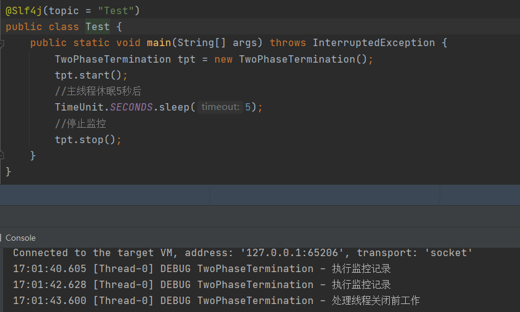

## 保护性暂停模式(同步模式)

> 当有一个结果需要从一个线程传递到另一个线程，让他们关联同一个GuardedObject
>
> 如果有结果不断从一个线程到另一个线程那么可以使用消息队列
>
> JDK中，join的实现、Future的实现，采用的就是该模式
>
> 因为一方需要等待另一方的结果，所有该模式的同步模式

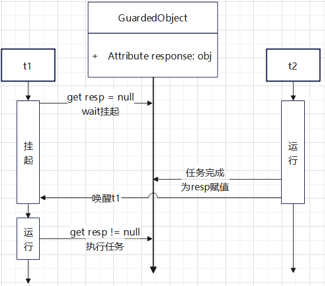

### 简单示例

> 编写GuardedObject对象，其中包含get方法与complete方法
>
> 1. 调用get方法时首先会判断response如果空将读取线程挂起
> 2. 调用complete会赋值response并且唤醒所有等待的线程

~~~java
class GuardedObject<T> {
    //结果
    private T response;

    //获取结果
    public T get(){
        synchronized (this){
            //还没有结果
            while (response == null){
                try {
                    this.wait();
                } catch (InterruptedException e) {
                    e.printStackTrace();
                }
            }
            return response;
        }
    }

    //产生结果
    public void complete(T response){
        synchronized (this){
            //将结果赋值
            this.response = response;
            this.notifyAll();
        }
    }
}
~~~

> 编写测试用例：创建2个线程，t1、t2
>
> t1最先被启动，并且启动后就立刻调用get方法获取response由于初始为null，所有t1会被挂起
>
> t2会去执行下载任务，执行完毕后会调用complete并且将结果传入，这时后会唤醒t1去获取结果

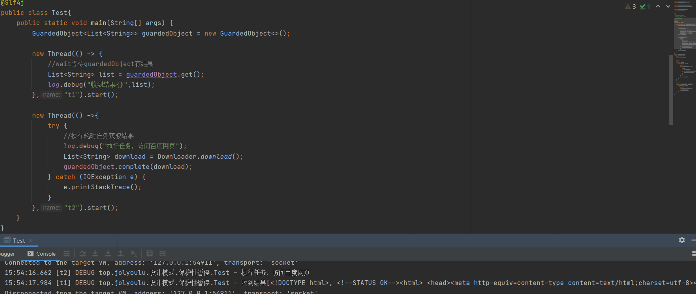

### 解耦优化示例

> 在简单示例中可以看到使用起来并不是非常的方便，因为t1(结果等待者)于t2(结果生产者)都要共用同一个GuardedObject，这就会造成在实际开发过程中需要各线程间相互传递GuardedObject，因此需要设计一个解耦的中间类对结果等待于结果生产者解耦，还能支持多任务管理

> GuardedObject增加多一个参数id

~~~java
@ToString
class GuardedObject{

    private String id;
    private Object response;//结果

    public GuardedObject(String id) {
        this.id = id;
    }

    //获取结果
    public Object get() {
        synchronized (this) {
            //还没有结果
            while (response == null) {
                try {
                    this.wait();
                } catch (InterruptedException e) {
                    e.printStackTrace();
                }
            }
            return response;
        }
    }

    //获取结果，带超时
    public Object get(long timeout) {
        synchronized (this) {
            long begin = System.currentTimeMillis(); //记录开始时间
            long passedTime = 0; //经历的时间

            //还没有结果
            while (response == null) {
                //计算这次wait需要多久时间，timeout减上一次经历的时间
                long waitTime = timeout - passedTime;
                //判断是否已经超时
                if (waitTime <= 0) {
                    break;
                }
                try {
                    this.wait(waitTime);
                } catch (InterruptedException e) {
                    e.printStackTrace();
                }
                //记录这次wait共用了多久
                passedTime = System.currentTimeMillis() - begin;
            }
            return response;
        }
    }

    //产生结果
    public void complete(Object response) {
        synchronized (this) {
            //将结果赋值
            this.response = response;
            this.notifyAll();
        }
    }

    public String getId() {
        return id;
    }
}
~~~

>Futures将作为中间层主要负责GuardedObject的存储、获取，这样结果等待者的GuardedObject引用无需传递给结果生产者了，结果生产者只需要通过id去Futures中获取相应的GuardedObject即可

~~~java
public class Futures {

    private static Map<String, GuardedObject> futures = new ConcurrentHashMap<>();

    //构建一个GuardedObject
    public static GuardedObject createGuardedObject() {
        GuardedObject go = new GuardedObject(generateId());
        futures.put(go.getId(), go);
        return go;
    }

    //根据id获取
    public static GuardedObject getGuardedObject(String id) {
        return futures.remove(id);
    }

    //获取ids
    public static Set<String> getIds() {
        return futures.keySet();
    }

    //产生唯一id
    private static String generateId() {
        return UUID.randomUUID().toString().replace("-", "");
    }
}
~~~

> 编写测试用例
>
> People对象，为消息等待者
>
> Postman对象，消息生产者，每个等待着都有对于的生产者生产消息

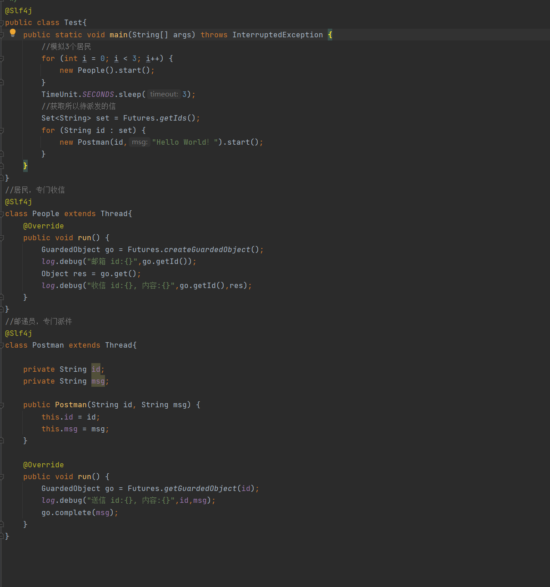

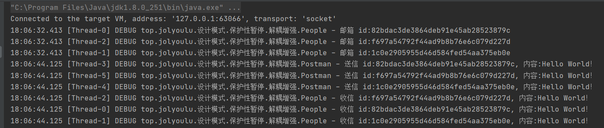

## 生产/消费模式(异步模式)

> 与前面保护性暂停中的GuardObject不同，不需要使产生结果和消费结果线程对应
>
> t1、t2、t3：生产者，只负责生产数据不关心数据如何处理，只需要能成功将任务put到队列中即可
>
> t4：消费者，只负责从队列中获取任务并且消费，并不关心任务是谁生产的
>
> 消息队列：一般由队列实现(先进先出原则)，且消息队列可有容量限制，满时不会再put数据，空时不会take数据
>
> jdk中各种阻塞队列，采用的就是这中模式

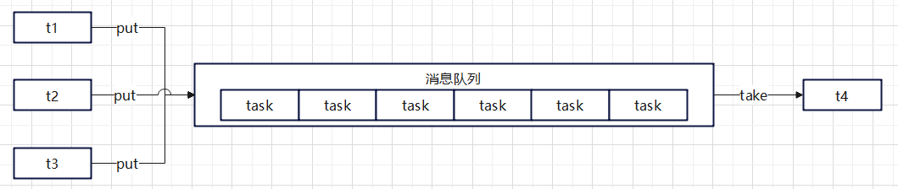

### 简单示例

> 定义消息对象，value用于保存需要消费的消息，id任务的唯一标识

~~~java
@Getter
@ToString
@AllArgsConstructor
@NoArgsConstructor
public final class Message {
    private Integer id;
    private Object value;
}
~~~

> MessageQueue一个简单的消息队列实现
>
> take：从队列中获取消息消费，当队列空时会挂起当前线程
>
> put：将消息存入队列，当队列满时会挂起当前线程

~~~java
@Slf4j
public class MessageQueue {

    private static final LinkedList<Message> list = new LinkedList<>();  //消息队列集合
    private int capacity; //队列容量

    public MessageQueue(int capacity) {
        this.capacity = capacity;
    }

    //接收消息
    public Message take() {
        synchronized (list) {
            while (list.isEmpty()) { //队列空，挂起等待
                try {
                    log.debug("队列空，消费者挂起等待");
                    list.wait();
                } catch (InterruptedException e) {
                    e.printStackTrace();
                }
            }
            Message message = list.removeFirst();
            log.debug("已消费消息 {}",message);
            list.notifyAll();
            return message;
        }
    }

    //存入消息
    public void put(Message message) {
        synchronized (list) {
            while (list.size() == capacity) { //队列已满，挂起等待
                try {
                    log.debug("队列已满，生产者挂起等待");
                    list.wait();
                } catch (InterruptedException e) {
                    e.printStackTrace();
                }
            }
            list.addLast(message);
            log.debug("已生产消息 {}",message);
            list.notifyAll();
        }
    }
}
~~~

## 固定运行顺序(同步模式)

> 在编写并发程序时，经常会遇到顺序处理问题，如某个线程需要带某些条件后才能执行，这种顺序控制称为固定运行顺序

### 固定运行顺序

> 如必须在打印2后打印1

#### wait notify方式示例

~~~java
public class Test {
    private static final Object lock = new Object(); //创建锁对象
    private static volatile boolean t2Runed = false; //标记t2是否已运行过

    public static void main(String[] args) {
        Thread t1 = new Thread(() -> {
            synchronized (lock) {
                while (!t2Runed) {  //判断t2是否已经执行
                    try {
                        lock.wait(); //如果t2未执行，t1进入entrySet挂起
                    } catch (InterruptedException e) {
                        e.printStackTrace();
                    }
                }
            }
            log.debug("1"); //等t2执行完毕后，执行t1业务代码
        }, "t1");
        Thread t2 = new Thread(() -> {
            log.debug("2"); //执行t2业务代码
            synchronized (lock) {
                t2Runed = true; //设置t2已运行
                lock.notifyAll(); //唤醒entrySet中的线程
            }
        }, "t2");
        
        t1.start();
        t2.start();
    }
}
~~~

> 执行测试用例，可以看到t2最先被执行，待t2执行完毕后t1被执行
>

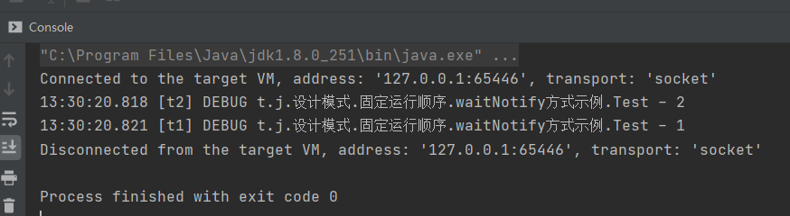

#### park unpark方式示例

~~~java
@Slf4j
public class Test {
    public static void main(String[] args) {
        Thread t1 = new Thread(() -> {
            LockSupport.park(); //挂起t1线程
            log.debug("1");
        }, "t1");

        Thread t2 = new Thread(() -> {
            log.debug("2");
            LockSupport.unpark(t1); //执行完毕后取消挂起t1
        }, "t2");

        t1.start();
        t2.start();
    }
}
~~~

> 执行测试用例，可以看到t2最先被执行，待t2执行完毕后t1被执行

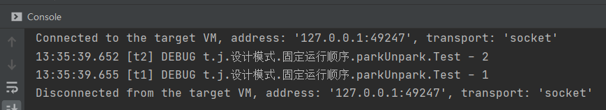

### 交替运行

> 线程t1、t2、t3，交替输出输出5次abc

#### wait notify方式示例

~~~java
public class WaitNotify {

    private static final Object lock = new Object();
    private int flag;
    private int loopNumber; //循环次数

    public void print(String str,int waitFlag,int nextFlag){
        for (int i = 0; i < loopNumber; i++) { //循环loopNumber次
            synchronized (lock){ //获得锁
                while (flag != waitFlag){ //如果当前flag与期望的flag不一致，挂起当前线程
                    try {
                        lock.wait();
                    } catch (InterruptedException e) {
                        e.printStackTrace();
                    }
                }
                //flag与期望的flag一致，执行业务代码
                System.out.println(str);
                flag = nextFlag; //修改flag为下一个值唤醒下个线程执行任务
                lock.notifyAll(); //唤醒其它等待的线程
            }
        }
    }

    public WaitNotify(int flag, int loopNumber) {
        this.flag = flag;
        this.loopNumber = loopNumber;
    }
}
~~~

> 编写测试用例
>
> t1 期望标记1时打印，打印后修改标记为2
>
> t2 期望标记2时打印，打印后修改标记为3
>
> t3 期望标记3时打印，打印后修改标记为1

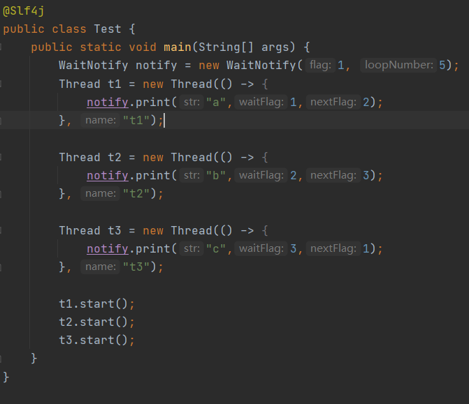

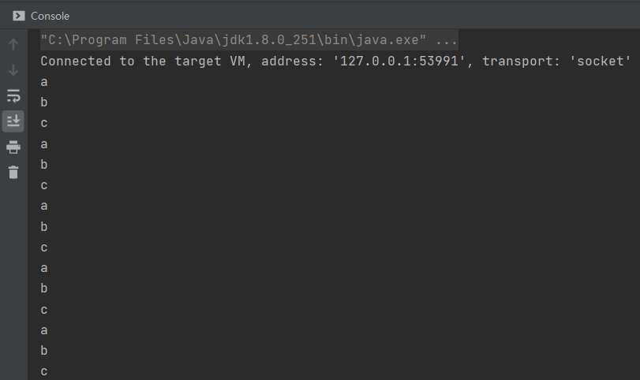

#### reentrantLock方式示例

~~~java
public class AwaitSignal extends ReentrantLock {
    private int loopNumber;

    public AwaitSignal(int loopNumber) {
        this.loopNumber = loopNumber;
    }

    /**
     * 打印方法
     * @param str 打印的内容
     * @param current 进入那间休息室
     * @param next 打印内容后唤醒那个休息室
     */
    public void print(String str, Condition current,Condition next){
        for (int i = 0; i < loopNumber; i++) {
            lock();
            try {
                current.await(); //先让当前线程进入相应的休息室
                System.out.println(str); //如果被唤醒后执行如下代码
                next.signal(); //唤醒指定休息室的线程
            } catch (InterruptedException e) {
                e.printStackTrace();
            } finally {
                unlock();
            }
        }
    }
}
~~~

> 编写测试用例
>
> t1 休息室a，打印后唤醒休息室b线程
>
> t2 休息室b，打印后唤醒休息室c线程
>
> t3 休息室c，打印后唤醒休息室a线程

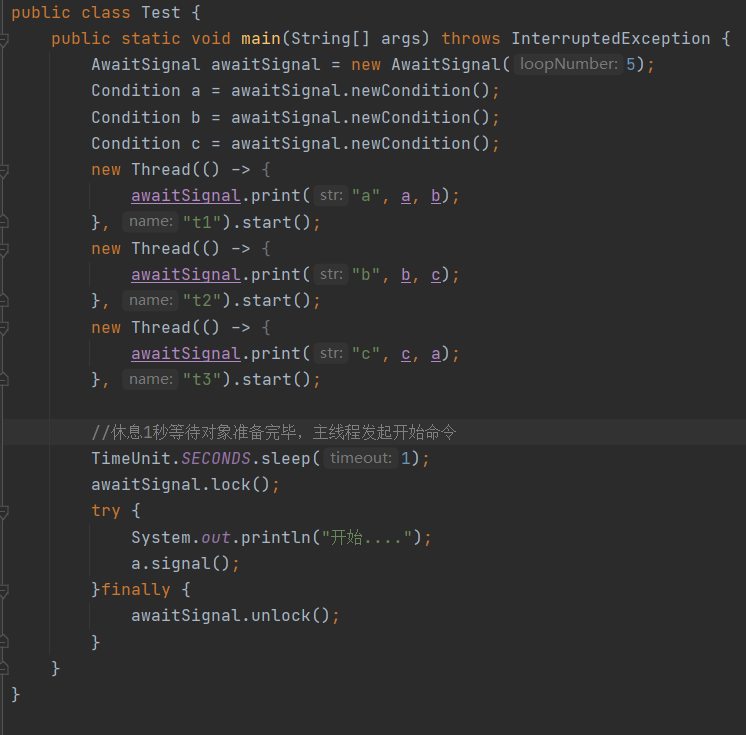

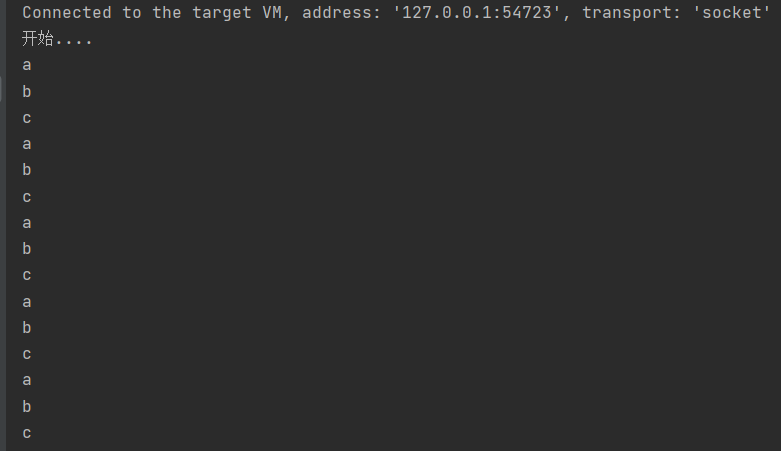

#### park unpark方式示例

~~~java
public class ParkUnpark {
    private int loopNumber;

    public ParkUnpark(int loopNumber) {
        this.loopNumber = loopNumber;
    }

    /**
     * 打印
     * @param str 打印的内容
     * @param next 打印完毕后需要唤醒的线程
     */
    public void print(String str,Thread next){
        for (int i = 0; i < loopNumber; i++) {
            LockSupport.park();
            System.out.println(str);
            LockSupport.unpark(next);
        }
    }
}
~~~

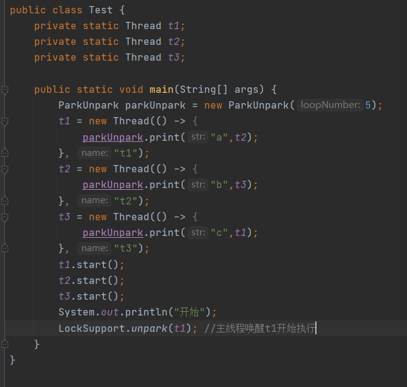

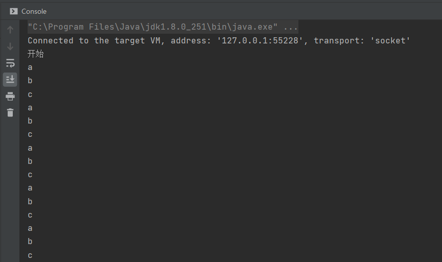

## 异步模式

> 该模式是24种设计模式中的一种，应用场景当需要重用数量有限的相同对象时该设计模式可以很好的实现对象的复用节省内存空间，包装类、连接池、线程池都是享元模式的实现

###   生产/消费模式

> 利用享元模式实现一个简单的连接池，当然这个连接池还有需要优化的地方
>
> 1. 连接池容量动态扩缩容
> 2. 连接保活(检查池中连接是否可用)
> 3. 等待超时处理(获取连接超时处理)
> 4. 分布式hash

**Connection实现**

> MockConnection实现Connection接口，实现的方法都是空方法来的只是测试用没有真正的实现该接口的所有方法，在MockConnection增加name属性用于打印日志用

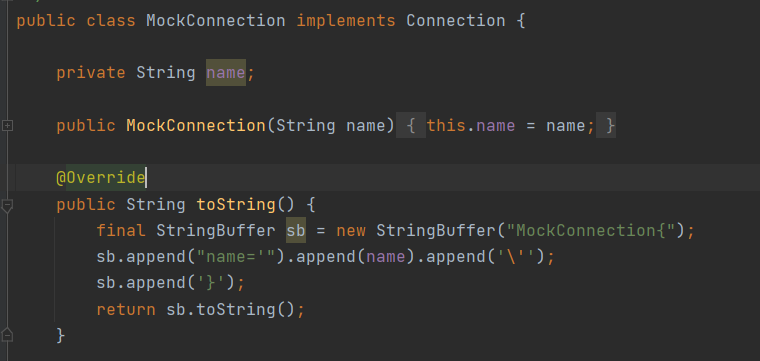

**DiyPool**

> DiyPool自定义实现的一个连接池，连接对象存放在Connection[]中，AtomicIntegerArray用于标记连接对象数组中对应下标的连接是否处于空闲状态
>
> DiyPool初始化时会对连接池进行初始化
>
> 调用borrow会遍历AtomicIntegerArray获取到可用连接对象
>
> * 有可用会使用cas更新为繁忙返回连接对象
> * 无可用连接会进入thie的wait休息室
>
> 调用free会修改Connection在AtomicIntegerArray中对应标准为可用，同时唤醒在thie的wait休息室的线程

~~~java
@Slf4j
public class DiyPool {
    //连接池大小
    private final int poolSize;
    //连接对象数组
    private Connection[] connections;
    //连接状态数组 0空闲 1繁忙
    private AtomicIntegerArray states;

    //构造方法
    public DiyPool(int poolSize) {
        this.poolSize = poolSize;
        this.connections = new Connection[poolSize];
        this.states = new AtomicIntegerArray(new int[poolSize]);
        //循环创建连接对象
        for (int i = 0; i < poolSize; i++) {
            connections[i] = new MockConnection("Connection"+i);
        }
    }

    //借出连接
    public Connection borrow(){
        while (true){
            //循环检查空闲连接
            for (int i = 0; i < poolSize; i++) {
                if (states.get(i) == 0){ //发现空闲返回连接
                    if (states.compareAndSet(i,0,1)){ //cas替换成功后返回连接
                        log.debug("{} 借出 {}",Thread.currentThread().getName(),connections[i]);
                        return connections[i];
                    }
                }
            }
            //如果没有空闲连接
            synchronized (this){
                try {
                    log.debug("{} wait...",Thread.currentThread().getName());
                    this.wait();//让线程在this锁上等待
                } catch (InterruptedException e) {
                    e.printStackTrace();
                }
            }
        }
    }
    //归还连接
    public void free(Connection conn){
        for (int i = 0; i < poolSize; i++) {
            if (connections[i] == conn) { //判断是不是相同对象
                states.set(1,0);
                synchronized (this){//唤醒在this锁上等待的线程
                    log.debug("{} 归还 {}",Thread.currentThread().getName(),conn);
                    this.notifyAll();
                }
                break;
            }
        }
    }

}
~~~

