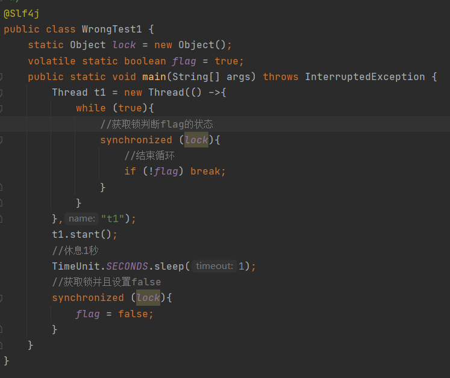
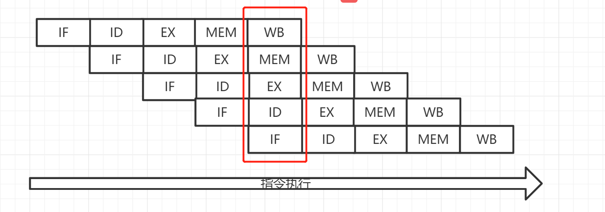

# 并发编程-进阶[volatile篇]

## CPU如何工作

在了解锁之前我们先需要知道CPU是如何工作的，为什么我们使用多线程时会出现不同步的问题

CPU是如何工作的，CPU到我们的硬盘粗略讲是需要经过 一级二级三级缓存=>内存=>硬盘，为什么CPU不能直接对硬盘IO操作呢，首先我们先了解一下CPU，缓存，内存，硬盘运算速度

1. CPU的运算速度一般是GHz，GHz=1000MHz，像2.0，就表示CPU的运算速度是2000000000次/秒（速度极快）

2. 缓存是才CPU内部的相当于一条流水线，CPU只管高速生产，直接交给缓存，再由缓存交给内存（速度仅此CPU）

   参考一篇知乎解释缓存：https://www.zhihu.com/question/22431522

3. 内存，一般内存是2000-3000MHz这里就可以看出CPU与内存的差距了把，相差最少10倍，所以需要经过缓存再到内存（速度低CPU10倍）

4. 硬盘，就拿比较好的固态硬盘来说速度一般是3,200 MB/s，CPU到硬盘那就更加不用说了，差距很大（慢）

经过以上的了解，我们大致解了CPU，缓存，内存，硬盘的速度后我们会发现CPU和内存的运算速度有极大差距，频率不匹配这样就知道为什么CPU到硬盘需要经过，那么多步骤了把，但是多核中间存在一个问题了，如核心1从内存拿到了一个int=0运算后+1，但是核心2又去内存取但是这时int=1还在缓存中，然后核心2拿出来又是0他又+1，你会发现这中间存在一个很大的问题整个运算过程中int不能保证一致，那我核心1做操作核心2又做操作，这样子我们的程序就会有很大的问题

**解决方案**

那怎么解决这个问题呢，CPU厂家intel和amd提出协议：总线锁、缓存一致性的解决方案

### 缓存一致性

MESI协议缓存状态

| 状态                   | 描述                                                         | 监听任务                                                     |
| ---------------------- | ------------------------------------------------------------ | ------------------------------------------------------------ |
| M修改(Modified)        | 该 Cache line 有效，数据被修改了，和主内存中的数据不一致，数据只存在于本 Cache 中 | 缓存行必须时刻监听所有试图读该缓存行相对就主存的操作，这种操作必须在缓存将该缓存行写回主存并将状态变成 S（共享）状态之前被延迟执行 |
| E独享、互斥(Exclusive) | 该 Cache line 有效，数据和内存中的数据一致，数据只存在于本Cache 中 | 缓存行也必须监听其它缓存读主存中该缓存行的操作，一旦有这种操作，该缓存行需要变成 S（共享）状态 |
| S共享(Shared)          | 该 Cache line 有效，数据和内存中的数据一致，数据存在于很多Cache 中 | 缓存行也必须监听其它缓存使该缓存行无效或者独享该缓存行的请求，并将该缓存行变成无效（Invalid）。 |
| I无效(Invalid)         | 该 Cache line 无效                                           | 无                                                           |

## Java 内存模型(JMM)

java虚拟机内存模型其实他是一个虚拟的概念，因为不同的操作系统他们去调用CPU的运算过程是不一样的，为了解决不同操作系统的他们底层的工作原理不一致，为了在不同的操作系统上都能运行JVM就设计出了一套java内存模型规范。

### Heap(堆)

java 里的堆是一个运行时的数据区，堆是由垃圾回收来负责的， 堆的优势是可以动态的分配内存大小，生存期也不必事先告诉编译器， 因为他是在运行时动态分配内存的，java 的垃圾回收器会定时收走不用的数据， 缺点是由于要在运行时动态分配，所有存取速度可能会慢一些 

### Stack(栈)

栈的优势是存取速度比堆要快，仅次于计算机里的寄存器，栈的数据是可以共享的，  缺点是存在栈中的数据的大小与生存期必须是确定的，缺乏一些灵活性 栈中主要存放一些基本类型的变量，比如 int，short，long，byte，double，float，boolean，char， 对象句柄

我们的方法都会放到栈里面，每一个栈都会对应一个对象，假如我们在Object1调用了Object2的方法我们的Object里面就会有一个Object2的副本

**什么是副本**

加入我现在有2个线程，thread1和thread2，主内存有一个int=0，那thread1和thread2需要运算他们会先从主内存中拷贝一个副本int=0到工作内存中，对工作内存的int运算完毕后会覆盖内存的int

## 为什么提出java内存模型

> java内存模型提出是保证我们java并发编程的3个概念
>
> **原子性**
>
> 即一个操作或者多个操作 要么全部执行并且执行的过程不会被任何因素打断，要么就都不执行，比如在前面原子性章节中提到的锁，或在开发中数据库事务实现都是原子性的
>
> **可见性**
>
> 可见性是指当多个线程访问同一个变量时，一个线程修改了这个变量的值也就是上面所说的工作内存中的副本，其他线程能够立即看得到修改的值
>
> **有序性**
>
> 即程序执行的顺序按照代码的先后顺序执行，程序顺序和我们的编译运行的执行不一定是一样，因为CPU会做编译优化和指令重排提高运行速度，这时可能就会出现我编译后和我们写的顺序不一致，CPU做编译优化会遵循一些原则保证程序优化后结果不会出错如：shiHappens-before: 传递原则：lock unlock A>B>C  A>C的原则  

### 可见性

#### 无法退出循环

> 以下就是一个最常见由于可见性问题而导致的死循环，这段代码t1线程永远也无法停止，main线程在改变flag后写入到内存，jvm为了提高执行效率flag读取的是t1线程中的副本所有拥有也读取不到内存最新变化

##### 解决办法1

> 对属性使用volatile关键字修饰，告诉cpu在获取flag每次都去内存中获取最新的值，这样t1就能获取到flag的被动

##### 解决办法2

> 当然除了使用volatile还可以利用前面学的锁(原子性)解决这个问题，相较于锁volatile更加轻量效率更加高

### 可见性与原子性

> 通过前面2个例子很多人会误以为既然有了volatile并且效率还比锁高那么为什么要用锁呢，首先要明白volatile与synchronized的不一样，volatile用于保证可见性，synchronized用于保证原子性
>
> volatile不能保证原子性操作

#### volatile错误用法

> 当前有一个需求，一个student对象只需要初始化一次即可，多个访问返回第一次初始化的student即可，这里使用了volatile关键字保证了多多线程情况下的flag的可见性，接下来我们就测试一下在并发情况下student线程安全吗？

> 通过测试发现Student在并发情况下居然产生了2个不一样id的student发生了这事情疑问这student在并发情况下非线程安全的，这是为什么？
>
> 这就是刚刚接触volatile最容易混淆的地方，首先volatile的确是确保可见性所有线程都能随时监听到flag的改变了，但是他并不能保护临界区代码的原子性很显然多个线程都通过了`if (!flag){}`的判断执行了里面的代码

##### 问题解决

> 在临界区代码出加锁锁后，那么student就可保证单例了

#### volatile应用场景

> volatile应用场景一般用于监听其它线程对某个属性的修改，如多个线程死循环同时监听一个属性，当这个属性被其它线程修改了那么这写监听的线程需要立刻感知到
>
> 因为单个操作属性赋值是原子性的，如 `flag = true或status = 0`这些赋值操作都是原子性操作所有可以利用volatile方式来监听属性的变化
>
> 但是如复合操作使用volatile方式就会失效，如`i++或i--`由于这些操作是由多个步骤组成，其它线程通过volatile只能监听属性当前最新的值，但是不能保证只能有一个线程执行`i++`操作

**synchronized补充说明**

> synchronized以及其它锁工具，即能保证可见性也能保证原子性，缺点则是比volatile消耗的资源要多

### 有序性

> 由于jvm在执行程序时会对一些程序的执行顺序在不影响结果的情况下做出调整，阅读如下代码可以看到程序执行的时候i与j的赋值操作如果顺序掉乱并不会影响i与j的最终结果，想这样的代码在执行过程中jvm可能就会对指令进行重排(调整了代码的执行顺序)

~~~java
static int i;
static int j;
//某个线程对其进行赋值操作
i = ..;
j = ..;
~~~

> 在单线程下指令重排对程序并没有任何的影响，但是在多线程的情况下指令重排可能就会导致程序执行的异常，为什么会对程序执行执行重排，其实这与cpu的工作原理相关

#### 执行重排原理

> 在cpu执行每条指令的时候，都会进行如下5个步骤才能完成一条指令的执行

| 指令步骤                | 说明     |
| ----------------------- | -------- |
| instruction fetch(IF)   | 取指令   |
| instruction decode(ID)  | 指令译码 |
| execute(EX)             | 执行指令 |
| memory access(MEM)      | 内存访问 |
| registrt write back(WB) | 数据写回 |

> 如果CPU正常的按照个指令5个步骤的一条一条的去执行，显然效率不会很高

#### 支持流水线的处理器

> 在现代的CPU中都支持多级指令流水线，简单来说可以同时执行5条指令中的不同阶段，这样就可以提升指令的吞吐量，可以发现在流水线的处理器中多条指令会交错进行所有在执行的时候就可能会发现指令重排

#### 指令重排的前提

> 对指令进行重排的前提是，重排的指令不能影响结果例如

~~~java
//可以重排的
int a = 10; //指令1
int b = 20; //指令2
System.out.pringtln(a+b);

//不能重排的例子
int a = 10; //指令1
int b = a - 5; //指令2
~~~

## volatile原理

### 保证可见性

> volatile通过读写屏障的方式保证变量的可见性，读写屏障用贴切的方式可以理解为springAOP、代理模式，即在一个指令执行的前后添加一些代码使得对该指令进行增强

**写屏障**

>  写屏障(sfence)保证在该屏障之前的，对变量的改动都同步到主存当中

~~~java
num = 0;
volatile boolean read = false;

public void test(){
    num = 2;
    read = true; //read是volatile赋值带写屏障
    //写屏障(这里会把最新数据写入主存中)
}
~~~

**读屏障**

> 读屏障(ifence)保证在该屏障之后，对共享变量的读取，加载的是主存中最新的数据

~~~java
public void test(){
    //读屏障(这里从主存中读取最新数据)
    if(read){ //read是volatile读取值带写屏障
        num = 5;
    }
}
~~~

### 保证有序性

> volatile的有序性只能保证本线程内存，因为有了读写屏障的保护那么在写屏障之前的代码就不会跑到写屏障之后，在读屏障之后的代码就不会跑跑到之前，这样就能保存的代码执行的有序性
>
> 但是在多线程的情况下不能保证指令的交错，因为多线程执行顺序是有线程获得的cpu时间片决定的，所有写屏障仅仅只能保证写完之后那一定能读到最新的数据，但不能保证读指令跑到写指令之前

## happens-before

> happens-before是可见性与有序性的一套规则总结，在开发过程中遵循如下规则编写的程序那么一定能保证可见性与有序性，若不遵循如下给那么jmm并不能保证一个线程对共享变量的写，对于其它线程对共享变量的可见

### 规则1

**线程解锁m之前对变量的写，对于接下来对m加锁的其它线程对该变量的读可见**

~~~java
//当t1(写操作线程)比t2(读操作线程)先执行，那么t2肯定能够读取到t1的写入
static int x;
static Object m = new Object();

new Thread(()->{
	synchronized(m){
        x = 10; //在解锁前写入
    }   
},"t1").start();

new Thread(()->{
	synchronized(m){
        System.out.println(x); //在加锁中读取
    }   
},"t2").start();
~~~

### 规则2

**线程对volatile变量的写，对接下来其它线程对该变量的读可见**

~~~java
//当t1(写操作线程)比t2(读操作线程)先执行，那么t2肯定能够读取到t1的写入
volatile static int x;

new Thread(()->{
    x = 10; 
    //写屏障
},"t1").start();

new Thread(()->{
    //读屏障
    System.out.println(x); 
},"t2").start();
~~~

### 规则3

**线程在start前对变量的写，对该线程开始后对该变量的读可见**

~~~java
//t2(读操作线程)执行前对x赋值，那么t2线程启动后肯定能够读取到写入
static int x;

x = 10; 

new Thread(()->{
    System.out.println(x); 
},"t2").start();
~~~

### 规则4

**线程结束前对变量的写，对其它得知它已经结束后的读可见(如某线程利用isAlive或join等待其它线程它的结束)**

~~~java
//t1在结束前对x写入，等待t1结束的线程对t1在结束前的写可见
static int x;

Thread t1 = new Thread(()->{
    x = 10; 
},"t1").start();

t1.join();
//t1结束后可以读取到t1的写
System.out.println(x); 
~~~

### 规则5

**线程t1打断t2前对变量的写，对于其它线程得知t2被打断后对变量的读取可见**

~~~java
static int x;
public static void main(String[] args) {
    Thread t2 = new Thread(() -> {
        while (true){
            if (Thread.currentThread().isInterrupted()){
                //t2线程被打断后，可读取到t1线程对变量的写
                System.out.println(x);
                break;
            }
        }
    }, "t2");
    t2.start();

    //t1线程在1秒后，对x赋值并且打断t2线程
    new Thread(() -> {
        try {
            TimeUnit.SECONDS.sleep(1);
        } catch (InterruptedException e) {
            e.printStackTrace();
        }
        x = 10;
        t2.interrupt();
    },"t1").start();
    while (!t2.isInterrupted()){
        Thread.yield();
    }
    //其它线程得知t2被打断后，可读取到t1线程对变量的写
    System.out.println(x);
}
~~~

### 规则6

**对于变量的默认值(0,false,null)的写，其它线程对该变量的可见**

### 规则7  

**线程在volatile属性前的写操作全部都会同步到主存，对于其它线程在volatile属性后的读操作都可见**

~~~java
//当t1(写操作线程)比t2(读操作线程)先执行，那么t2肯定能够读取到t1的写入
volatile static int x;
static int y

new Thread(()->{
    y = 20;
    x = 10; 
    //写屏障，写屏障前的所有写操作都会被同步到主存
},"t1").start();

new Thread(()->{
    //读屏障
    System.out.println(x); //x=20对t2可见，同时y=10对t2也可见
},"t2").start();
~~~

