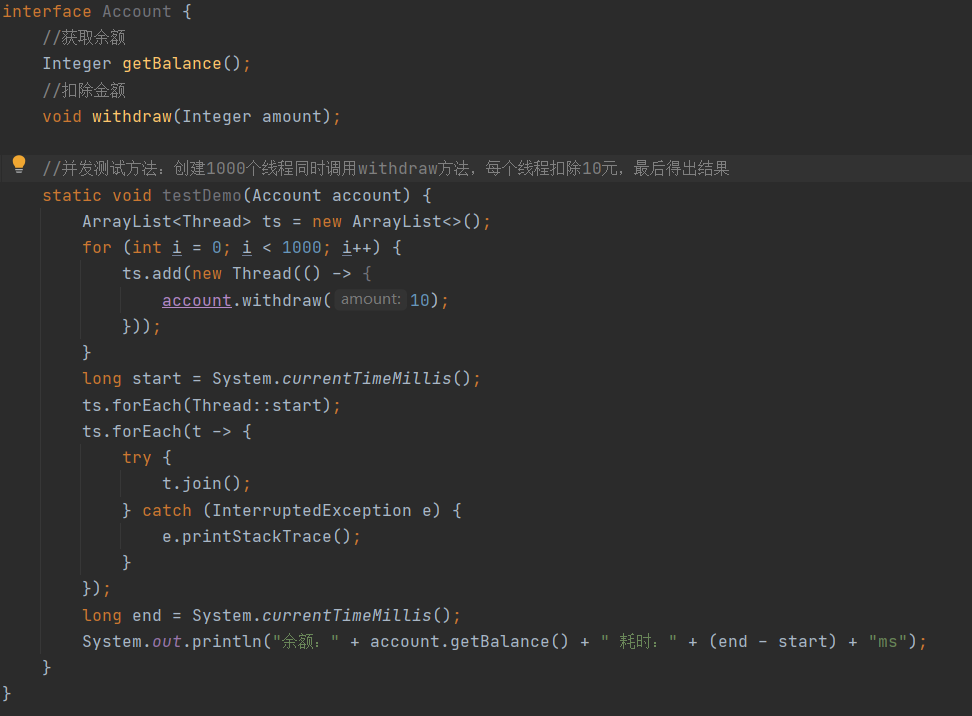
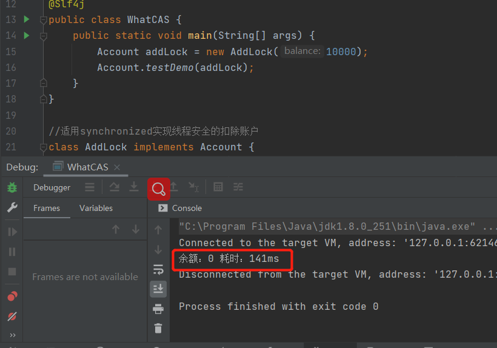

# 并发编程-进阶[无锁并发]

> 在前面的学习中通常解决共享数据的原子性问题都是通过加锁而实现的，那么接下来了解更加高级的内容那么就是在不加锁的情况下实现线程安全

## 共享模型之无锁

### 案例入门

> 接下来我们首先通过一个小案例来了解什么是CAS
>
> 需求：现有一个账户接口，里面分别有获取余额和扣除金额方法，编写该账户的实现类使得让账户在执行测试方法时线程安全

#### 加锁实现

> 利用前面所学的知识首先最先想到的就是加锁，在AddLock对象balance变量是共享变量所有对balance操作需加锁才能确保线程安全

**测试**

> 编写测试用例初始化1W金额，在1000线程下每个线程扣除10最终结果为0，表示该代码是线程安全的

#### CAS实现

> 前面使用锁顺利的解决了账户扣款的并发问题，接下来介绍一种CAS无锁并发的方法实现线程安全，这里使用的是最原始CAS写法，即CAS的本质执行`比较替换`，若不理解后面会有更详细的分析

**测试**

> 编写测试用例初始化1W金额，在1000线程下每个线程扣除10最终结果为0，表示该代码是线程安全的，并且可以发现整个程序的执行时长比加锁的要稍微快一点

## CAS与volatile

> 回顾刚刚扣除余额的代码，从代码中可以发现最后调用了一个`compareAndSet`比较与设值的方法，简称CAS（Compare And Swap），这个方法就是灵魂所在

### CAS算法

> 什么是CAS算法，CAS(Compare-And-Swap)即比较与交换，CAS算法是硬件对于并发操作提供的数据共享支持，CAS的变量都带有Volatile保证了可见性，CAS怎么保证原子性呢，CAS中包含了三个操作数：内存值 V，预估值 A，更新值 B，只有V == A 时，CPU会尝试把B赋值到V上，否则不做任何操作，大致意思就是首先去获取当前内存中的值V，在我修改之前我再去获取一次内存放到A，那如果这是V == A 那意思就是内存中的值还没修改这时我只需要把B（新值）写入主内存即可完成修改了，因为B回写主内存只有一步所以可以保证原子性

### 为什么无锁效率高

> 从cas代码编写中可以看出外面总被套着一个while(true)循环，即失败重试，线程对于每次更新更新失败后而是立马去获取最新值不断重试，直到更新成功为止
>
> 而在使用锁的代码当中，若线程未获得锁的时候会被挂起进入等待队列这时cpu需要进行上下文切换，直到锁被释放后在原本在等待的线程会被唤醒重新竞争锁这时cpu也会发生上下文切换，每一次的上下文切换都是相对昂贵操作

## CAS实现类

> 在JUC并发包下提供了很多的原子操作类实现，基本数据类型的实现已经的CAS操作jdk已为我们实现了，当然如果不满足需求可以使用原子引用实现

### 原子整数

> AtomicBoolean，AtomicInteger， AtomicLong这些我都归类为原子整数，使用方法都是大同小异，这里使用AtomicInteger作为释放

~~~java
AtomicInteger i = new AtomicInteger(0);
//先获取i，后递增1（i=0,结果i=1，返回0）
System.out.println(i.getAndIncrement());
//先自动递增1，返回递增后结果（i=1,结果i=2，返回2）
System.out.println(i.incrementAndGet());
//指定递增5，返回递增后结果（i=2,结果i=7，返回2）
System.out.println(i.getAndAdd(5));
//先获取i，后自减1（i=7,结果i=6，返回7）
System.out.println(i.getAndDecrement());
//自动递减1，返回递增后结果（i=6,结果i=5，返回5）
System.out.println(i.decrementAndGet());

//原子自定义运算公式
//使用lambda语法，x当前值 -> {return 自定义计算公式}
System.out.println(i.updateAndGet(x -> x * 10));
~~~

### 原子引用 

> 前面介绍的一些原子整数类型在实际开发过程中可能无法满足特定场景加应用，jdk提供了更加灵活的原子应用类型给我们使用，利用原子应用类型可以实现自己的原子操作类   AtomicReference、AtomicMarkableReference、AtomicStampedReference

#### ABA问题

> 在使用CAS操作最核心的功能那么就是比较替换，比较替换虽然速度快但是有一个缺点就是可能会遇到ABA问题，那么什么是ABA问题的请看下面的代码，你决定main线程中的A能被替换成C吗

> 什么是线程安全，当多个线程同时访问一个对象时，如果不用考虑这些线程在运行时环境下 的调度和交替执行，也不需要进行额外的同步，或者在调用方进行任何其他的协调操作，调用这个对象的行为都可以获得正确的结果，那就称这个对象是线程安全的引用自《JAVA并发编程实战》
>
> 请问一些main行为是正确的行为吗？显然不是，这就是由于在比较替换时main只能判断A是不是与开始获取的值一样的它并不指定该值已经被替换了所以仍然替换成功了
>
> 如何解决这个问题呢？关比较值不行还需要多加一个版本号每次修改版本号都会自增那么在比较替换时通过版本号就能确定该值有没有被动过

#### AtomicStampedReference

> AtomicStampedReference 在 AtomicReference 基础上增加多了一个版本号，以下利用该原子引用对上面aba问题案例进行改造

> 测试结果符合预期，main无法将A替换为C

#### AtomicMarkableReference

> 在前面都可以看到是比较替换，有时我们可能并不关心版本号而只是关心这个值能不能被替换，如现在有一个需求有一个固定容量的容器，当容器被装满时需要重新构建一个容器去替换
>
> 为什么需要CAS替换，因为类的初始化与赋值操作并不是原子性操作，当new Obj()时会经历如下过程
>
> memory = allocate();      // 1：分配对象的内存空间
>
> ctorInstance(memory);  // 2：初始化对象 
>
> instance = memory;       // 3：设置instance指向刚分配的内存地址

### 原子数组

> 当对象是单个时使用原子引用可以实现CAS，但如果需要CAS的是一个数组的时候那么就需要利用原子数组来确保数组中的元素的CAS安全性 AtomicIntegerArray、AtomicLongArray、AtomicReferenceArray

#### 不安全的数组操作

> 首先我们准备一个通用的测试方法，为了确保程序的通用性所有这里使用的都是函数式编程，demo方法4个参数都是通过传入相应的函数，在方法中执行这些函数取得结果，以下是一个线程不安全的示例

> 从测试结果可以看出数组的内容并没有达到预期，因为代码逻辑中每次遍历会将1W次的自增取模平均分配带各个下班下，即每次循环每个元素会增加1000，循环10次那么最终结果是数组的每个元素都是1W，因为这不是线程安全的

#### AtomicIntegerArray

> AtomicIntegerArray是一个原子性的数组，在操作AtomicIntegerArray时能够确保数组中的每一个元素都是原子性操作，接下来我们使用AtomicIntegerArray运行刚刚的测试用例

> 可以看到执行结果符合预期，表示该数组的线程安全的

#### AtomicReferenceArray

> AtomicReferenceArray 原子引用数组使用起来就更加的灵活，可以自定义自己的对象并且进行原子性操作，也是使用相同的测试方法

> 执行结果，确保对象中的num属性都是1w符合预期

### 字段更新器

> 在前面原子引用数组AtomicReferenceArray案例中我们可以发现在对属性累计的过程都是在重新构建对象进行替换，这是一个耗时，耗内存的操作
>
> 字段更新器就更加灵活了，接下来我们使用字段更新器可以实现对指定对象的字段进行CAS更新 AtomicReferenceFieldUpdater、AtomicIntegerFieldUpdater、AtomicLongFieldUpdater

**特别提示**

> `注意：使用字段更新器针对某个对象域(Field)进行原子性操作时，只能配合volatile修饰的字段使用否则会抛出如下异常`

~~~java
Exception in thread "main" java.lang.IllegalArgumentException: Must be volatile type
~~~

> `注意：使用字段更新器针对某个对象域(Field)进行原子性操作时，确保被更新的对象属性不能为私有并且能够被访问到否则会抛出如下异常`

~~~java
Exception in thread "main" java.lang.RuntimeException: java.lang.IllegalAccessException: Class xxx.xxx.xxx can not access a member of class xxx.xxx.xxx with modifiers "private volatile"
~~~

#### AtomicReferenceFieldUpdater

> 使用时需要首先使用`AtomicReferenceFieldUpdater.newUpdater()`方法构建一个AtomicReferenceFieldUpdater对象出来后，接下来就可以使用cas进行操作了

### 原子累加器

> 原子累加器是jdk8新增的，它相较于之前学习的原子整数性能要高很多

> 可以看到AtomicLong平均耗时都是30-50毫秒，而JDK8提供的累加器效率都是在20毫秒内0ms是因为这里统计是毫秒为单位的，而累加器的执行速度太快了在纳秒内已经完成了，所有才会出现0ms

## Unsafe

> Unsafe对象是一个能在jdk文档中找到的最底层的对象，它可以直接操作内存在前面所学的原子性操作类都是基于它实现的，由于它能直接操作内存所有被命名为Unsafe(不安全的)

### Unsafe获取

> 由于Unsafe是不能直接new出来的，它的实现是它的成员变量Unsafe并且这个成员变量是私有的，所以需要通过反射的方式获取

~~~java
//使用反射获取 Unsafe
Field theUnsafe = Unsafe.class.getDeclaredField("theUnsafe");
theUnsafe.setAccessible(true);
Unsafe unsafe = (Unsafe) theUnsafe.get(null);
System.out.println(unsafe);
~~~

### CAS操作

> 通过结果可发现，修改成功

