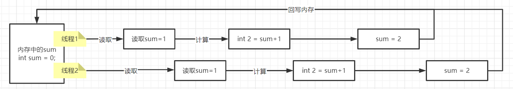
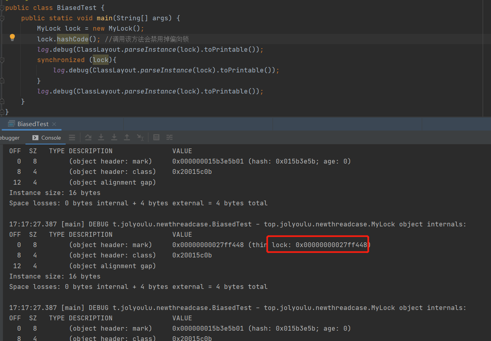
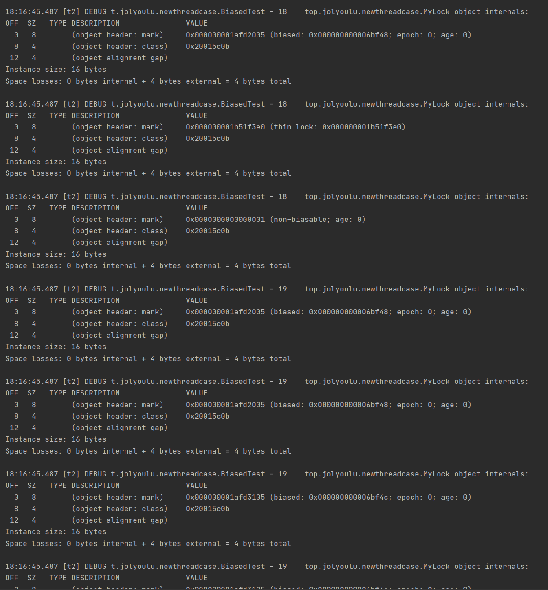
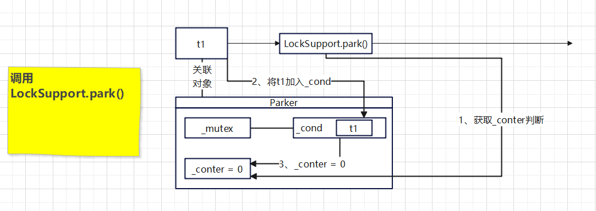
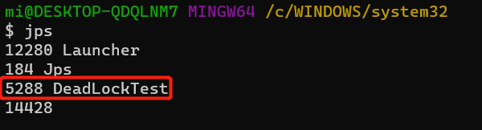

# 并发编程-进阶[锁篇]

## 共享带来的问题

> 在开发中通常需要操作共享变量，如下案例则是一个加法计算，构建了2个线程同时操作sum对其进行+1，根据逻辑那么2个线程最终结果应该是2000，多次执行下可以发现有时结果并不符合预期，这是就是共享带来的问题

### 问题分析

> 在sum+=1并不是一个原子性操作，可以先简单理解为不是一次性操作(如：sum=1、sum=2、sum=3这些就是一次性操作)
>
> sum+=1在实际执行时是3个步骤
>
> 1. 将sum读取到寄存器中
> 2. 寄存器+1
> 3. 将结果写回内存sum中
>
> 所以在多线程情况下对共享数据操作可能就会出现如下问题2个线程，这并不是我们想要的

### 解决方案

> 解决该问题目标，如果能够保证每一个sum+=1的所有步骤只能有一个线程 去完成那么就能解决这个问题，那怎么将一部分的代码只允许一个线程执行呢，那么久需要加锁

> 修改代码将sum+=1复合操作加锁锁只允许一个线程执行这段代码，这样久可以保证多线程情况下共享数据的安全，`synchronized`后面会有详细说明，这里只是解释如何解决共享带来的问题，当然解决方案不止一种在后面的学习中会看到跟多的解决方案

### 临界区

> 一个程序运行多线程本身是没有问题的，问题在于在多个线程访问共享资源
>
> * 多个线程`读取`共享资源其实是没有问题的
> * 多个线程对共享资源`读写`操作时发生指令交错，就会出现问题
>
> 如果在一段代码块内存在对共享资源的`读写操作`，称这段代码为临界区

### 竞争态条件

> 多个线程在临界区内执行，由于代码的执行序列不同而导致结果无法预测，称为发生了竞太条件

## 竞争态条件解决

> 避免竞争态条件解决方案有2大种
>
> 1. 阻塞式解决方案：synchronized、Lock
> 2. 非阻塞式解决方案：原子变量

### 阻塞式解决方案

#### synchronized

> synchronized是一种阻塞解决方案，俗称对象锁，从名字也大概理解到synchronized需要配合对象使用，它采用互斥的方式让同一时刻至多只有一个线程能持有这个对象锁，其它线程想获取就需要阻塞等待持有该锁的线程释放后才能获取并且运行临界区内的代码

##### 语法

> synchronized需要在括号内传入一个对象，{}内就是临界区的代码，多个线程需要确保使用相同的对象否则锁会失效，

~~~java
synchronized(对象){
    //临界区代码
}
~~~

##### 使用例子

##### 方法上的synchronized

**成员方法上**

> 很多初学者都会以为synchronized加在成员方法上与方法有什么关系，其实synchronized和方法并没有任何关系，只是一个比较简单的写法，在方法上的synchronized等价于`synchronized(this){}`

~~~java
class Test{
    public synchronized void test(){}
}
//等价于
class Test{
    public void test(){
        synchronized(this){}
    }
}
~~~

**静态方法上**

> 注意的是如果synchronized被加载静态方法上那么相当于`synchronized(Test.class){}`，锁的是Test.class而不是Test实例

~~~java
class Test{
    public synchronized static void test(){}
}
//等价于
class Test{
    public void test(){
        synchronized(Test.class){}
    }
}
~~~

## 变量线程安全分析

> 如何判断一个变量是否线程安全也是并发编程中一个很主要的步骤，若对线程安全的变量附加锁会导致程序运行缓慢，若对存在线程安全的变量不加锁会导致线程执行结果与预期不符合

**成员变量和静态变量是否线程安全**

> 1. 如果它们没有共享，则线程安全
> 2. 如果它们被共享了，根据它们的状态是否能够改变，分以下2种情况
>    * 如果只读，则线程安全
>    * 如果有读写操作，则这段代码是临界区，需要考虑线程安全

**局部变量是否线程安全**

> 1. 局部变量是线程安全的
> 2. 但局部变量引用的对象未必线程安全
>    * 如果引用的对象没有逃离方法的作用范围，它是线程安全的
>    * 如果引用的对象逃离方法的作用范围，需要考虑线程安全问题

### 局部变量线程安全问题

> 如下代码，在方法中创建一个局部变量i，并+1该方法是线程安全的

~~~java
public static void test(){
    int i = 10;
    i++;
}
~~~

> 通过反编译从字节码文件中可以看到test方法中包含如下4条指令，可以发现所有操作都是在方法内进行的所有该方法中的i值是线程安全的
>
> pipush  10：获取一个10
>
> istore_0：将10存入本地变量
>
> iinc 0,1：对10加一
>
> return：退出方法

### 成员变量线程安全问题

> 如图中，ThreadUnsafe类中有一个成员变量list，并且里面有2个方法分别对list添加元素与删除元素，在多线程情况下可以发现发生了异常，这是由于list成员变量并不是线程安全的，有可能线程在执行add后remove前被其它线程插队执行了remove最少list已经没有元素了再remove就直接越界

### 常见的线程安全类

> 可以发现自己编写线程安全的类是比较复杂，容易出错，在java中提供了很多线程安全的类供开发者使用，如我们常见的String、Integer、StringBuffer、Random、Vector、Hashtable、java.util.concurrent包等类都是线程安全的，注意的是这些类的每个方法是原子性的，如果一次操作需要组合调用这些类方法那么是非线程安全的

### 不可变类线程安全性

> String、Integer等都是不可变类，因为内部的状态不可改变，因此它们是线程安全的，这时肯定就有人有疑问了String不是有replace、substring等方法改变值吗，那么是怎么做到线程安全的呢
>
> 以String.substring为例，可以从源码中发现在调用substring中最后你得到的是一个新的String对象，原来的String并没有改变

## Monitor

### Java对象头

> 在jvm中每一个对象都有对象头，对象头中包含着一些对象的关键信息，以32位虚拟机为例

**普通对象**

> 一个普通的对象的对象头中会包含2样东西
>
> Klass Word：保存着对象是那个class类型
>
> Mark Word：后面详细说明

~~~shll
|--------------------------------------------------------------|
|                     Object Header (64 bits)                  |
|------------------------------------|-------------------------|
|        Mark Word (32 bits)         |    Klass Word (32 bits) |
|------------------------------------|-------------------------|
~~~

**数组对象**

> 数组对象比普通对象多出array length用于表示数组长度

~~~shell
|---------------------------------------------------------------------------------|
|                                 Object Header (96 bits)                         |
|--------------------------------|-----------------------|------------------------|
|        Mark Word(32bits)       |    Klass Word(32bits) |  array length(32bits)  |
|--------------------------------|-----------------------|------------------------|
~~~

**Mark Word**

>  Mark Word包含着对象中很多关键信息如hashcode、分代年龄、是否持有锁等， Mark Word中有5种状态Normal、Biased、Lightweight Locked、Heavyweight Locked、Marked for GC，分别表示对象当前的状态

~~~java
|-------------------------------------------------------|--------------------|
|                  Mark Word (32 bits)                  |       State        |
|-------------------------------------------------------|--------------------|
| identity_hashcode:25 | age:4 | biased_lock:0 | 01     |       Normal       |
|-------------------------------------------------------|--------------------|
|  thread:23 | epoch:2 | age:4 | biased_lock:1 | 01     |       Biased       |
|-------------------------------------------------------|--------------------|
|               ptr_to_lock_record:30          | 00     | Lightweight Locked |
|-------------------------------------------------------|--------------------|
|               ptr_to_heavyweight_monitor:30  | 10     | Heavyweight Locked |
|-------------------------------------------------------|--------------------|
|                                              | 11     |    Marked for GC   |
|-------------------------------------------------------|--------------------|
~~~

### Monitor锁

> 每个java对象都可以关联一个Monitor对象，如果使用synchronized给对象上锁之后，该对象头的 Mark Word中就会被设置指向Monitor对象的指针
>
> Monitor对象中包含WaitSet、EntryList、Owner
>
> Owner：在最开始是Owner为null的，当Thread-2执行到临界区代码时，会通过Synchronized(obj)中的obj去查找该obj对于的Monitor对象，发现Owner为null，就将Owner设置为Thread-2
>
> EntryList：其它线程在进入Synchronized(obj)也会去查找该obj对于的Monitor对象，此时发现Owner绑定了Thread-2那么它们会进入EntryList，EntryList是一个等待队列(链表实现)在该队列中的线程都是阻塞状态，当Thread-2释放了Owner，EntryList中的所有线程都会被唤醒去抢夺Owner(非公平竞争)
>
> WaitSet：WaitSet中的线程是已经获取过锁的，但由于某些条件不满足进入到了WAITING，等待notify后会被唤醒重新判断条件若为满足会再次进入到WAITING
>
> 注意：Synchronized(obj)中obj必须是相同的对象的monitor才有以下效果，不加Synchronized的对象不会关联Monitor，不遵循此规则

### Synchronized原理

#### 字节码分析

> 从字节码的上分析Monitor是怎么

~~~java
static final Object lock = new Object();
static int counter = 0;

public static void main(String[] args) {
    synchronized (lock){
        counter++;
    }
}
~~~

> 对于字节码解析
>
> 从0-15可以看到整个synchronized加锁与解锁过程
>
> 从19-23行可以发现synchronized在发生异常后会自动解锁

~~~java
  public static void main(java.lang.String[]);
    Code:
       0: getstatic     #2  // 获取lock引用(synchronized开始)
       3: dup         
       4: astore_1          // 将lock用存入slot 1(留下引用后面解锁用)
       5: monitorenter      // 将lock对象Mark Word置为Monitor指针(State：Heavyweight Locked)
       6: getstatic     #3  // i
       9: iconst_1          // 准备常数 i
      10: iadd              // i+1
      11: putstatic     #3  // i
      14: aload_1           // 拿到lock的引用
      15: monitorexit       // 将lock对象Mark Word重置(State：Normal)，唤醒EntryList
      16: goto          24  // 执行24 return返回了 19-23(异常时会执行)
      19: astore_2          // 将异常e存入到slot 2
      20: aload_1           // 拿到lock的引用
      21: monitorexit       // 将lock对象Mark Word重置(State：Normal)，唤醒EntryList
      22: aload_2           // 拿到e的引用
      23: athrow            // throw e
      24: return
    Exception table:
       from    to  target type
           6    16    19   any   //监测6-16行的执行，如果发生异常执行19行指令
~~~

### Synchronized优化

> 大家都说Synchronized是重量级锁，为什么重呢那是因为Synchronized是有Monitor，而Monitor是操作系统层面的所以使用Monitor的成本比较高，从java6开始就对Synchronized获取锁的方式做了很多的优化，增加了轻量级锁、偏向锁

#### 轻量级锁

> 如果一个对象虽然有多线程访问，但多线程访问的时间是错开的(没有竞争)，那么这时就可以使用轻量级锁优化，轻量级锁对使用者是透明的，所以语法仍然是Synchronized(obj){}
>
> 假设method1与method2同时都加了锁，在method1间接的调用了method2那么

~~~java
static final Object lock = new Object();

public static void method1(){
    synchronized (lock){
        method2();
    }
}
public static void method2(){
    synchronized (lock){
        //执行其它业务
    }
}
~~~

**method1执行到synchronized (lock)堆变化**

**method1执行到调用method2()；堆变化**

> 当代码执行到method1调用method2时，method2方法那么就需要再次获取一次锁，也是相同的步骤创建Lock Record关联Object Reference，但是在交换Mark Word显然失败了，因为在method1已经将Object的Mark Word交换了，synchronized锁重入了，所以在method2只需要添加一条Lock Record作为重入计数

**当method2执行完毕退出synchronized代码块时**

> 当method2执行完毕退出synchronized代码块时会弹出method2 Lock Record，由于null，所以只需要计数器减一即可

**当method1执行完毕退出synchronized代码块时**

> 当method1执行完毕退出synchronized代码块时会弹出method1 Lock Record，首先会进行CAS交换，将之前交换的Hashcode Age Bias 01给回Object，取消Object Reference关联，那么这时就解锁成功，Object已经恢复成无锁状态了
>
> 如果在解锁过程中失败了，说明轻量级锁进行了锁膨胀升级重量级锁，进入重量级锁解锁流程

#### 锁膨胀

> 如果在尝试加轻量级锁的过程中，CAS操作无法成功的原因是由于其它线程为该对象加锁了轻量级锁(有竞争)，这时就需要锁膨胀，将轻量级锁变为重量级锁

**当Thread-1尝试使用轻量级锁与Object交换，发现已经被Thread-0上锁了**

**这时Thread-1加轻量级失败，进入锁膨胀流程**

> Thread-1为Object对象向操作系统申请Monitor锁，让Object指向重量级锁的地址
>
> 然后Thread-1会进入到EntryList阻塞等待

**由于当前使用重量级锁，当Thread-0做CAS交换时必定失败，就会进入重量级锁解锁流程**

> 解锁流程：按照Monitor找到Monitor地址，将Owner设为null，唤醒EntryList中的所有线程

**自旋优化**

> 重量级锁竞争时，还可以使用自旋优化，即获取锁的线程若锁已经被其它线程持有，获取锁线程不会立刻挂起而是自旋一定次数尝试获取锁，若在成功(持有锁线程已释放)就可以避免当前线程进入阻塞
>
> 如果直旋多次后无法成功后着会进入到EntryList，java6以后自旋次数是由动态的如果jvm认为这次自旋获得锁成功率高那么久会自旋交多次

#### 偏向锁

> 在了解过轻量级锁后可以发现已经减少了使用Monitor锁提示了性能，但每次重入synchronized是都需要执行CAS操作
>
> java6中引入了偏向锁对轻量级锁进行了进一步的优化，只有第一次使用CAS将线程ID设置到对象的Mark Wrod头，之后重入的synchronized发现这个线程ID是自己的久表示没有竞争，不用重新CAS，以后只要不发生竞争，这个对象就归该线程所有

~~~java
static final Object lock = new Object();

public static void method1(){
    synchronized (lock){
        method2();
    }
}
public static void method2(){
    synchronized (lock){
        method3();
    }
}
public static void method3(){
    synchronized (lock){
        //执行其它业务
    }
}
~~~

##### 再次回忆对象头

> 在前面的学习都了解了轻量锁与重量锁对象头的区别了，那么偏向锁是怎么标记的呢
>
> biased_lock标记：表示当前对象偏向锁是否启用，0未启用、1表示启用
>
> 如果是排序状态那么State会变为Biased，可以看到biased_lock:1，并且对象的hashcode去除了，换成了thread和epoch

~~~java
|-------------------------------------------------------|--------------------|
|                  Mark Word (32 bits)                  |       State        |
|-------------------------------------------------------|--------------------|
| identity_hashcode:25 | age:4 | biased_lock:0 | 01     |       Normal       |
|-------------------------------------------------------|--------------------|
|  thread:23 | epoch:2 | age:4 | biased_lock:1 | 01     |       Biased       |
|-------------------------------------------------------|--------------------|
|               ptr_to_lock_record:30          | 00     | Lightweight Locked |
|-------------------------------------------------------|--------------------|
|               ptr_to_heavyweight_monitor:30  | 10     | Heavyweight Locked |
|-------------------------------------------------------|--------------------|
|                                              | 11     |    Marked for GC   |
|-------------------------------------------------------|--------------------|
~~~

> 当一个对象创建时：
>
> 1. 偏向锁是默认开启的，但是不是立刻开启而是延迟开启的，如果想避免这个延迟那么可以增加VM参数`-XX:+UseBiasedLocking -XX:BiasedLockingStartupDelay=0`禁用延迟

**测试偏向锁**

> 由于增加了JVM参数，所有lock在创建之后对象头默认是开启偏向锁的`0x5(十六进制)=101(二进制)`，在执行syn代码块是可以看到biased绑定了一个id，在执行syn代码后再次打印可以发现biased与在syn中的一致，表示偏向锁已经指向main线程了

##### 禁用于开启偏向锁

> `-XX:+UseBiasedLocking`开启偏向锁
>
> `-XX:-UseBiasedLocking `禁用偏向锁
>
> ` -XX:BiasedLockingStartupDelay=0`关闭偏向锁延迟加载

##### 偏向锁的失效

**1、hashcode会导致偏向锁失效**

> 当一个可偏向对象调用了hashcode方法后可以发现对象，对象已经无法使用偏向锁了，这是因为只有对象头状态在Normal下才能保存hashcode，而对象在Biased无法保存到hashcode，默认情况下对象的hashcode为0当调用了hashcode方法后那么对象头需要空间存储自然无法存储偏向锁指向的线程了
>
> 这时就可能有人会有疑问那么轻量锁和重量锁的hashcode在哪里呢
>
> * 轻量级锁的对象头信息被备份在持有锁的线程中，解锁时会还原
>
> * 而重量级锁的对象头保存在Monitor中，解锁时会还原

**2、当有其它线程使用偏向锁对象时，偏向锁会失效升级轻量级锁**

> 首先是t2线程执行，可以发现t2线程执行时lock对象使用的是偏向锁

> 当t2执行完毕后，这时t1也需要获取lock对象可以发现lock对象头进行了升级，在syn之前还是偏向锁偏在进入syn代码块后升级为轻量级锁了

**3、wait/notify调用时失效**

> 这个就不演示了，很好理解因为只有Monitor锁才能使线程wait/notify，那么以为着如果使用到wait/notify那么锁就会升级为重量级锁

##### 批量重偏向

> 如果对象虽然被多个线程访问，但没有竞争，这时偏向了线程T1的对象仍然有机会重新偏向T2，重偏会将重置对象头的ThreadId
>
> 当如果偏向锁偏向的对象被频繁撤销，超过20次jvm会觉得，我是不是偏向错了呢，于是就会在加锁时重新偏向一个其它程序

~~~java
//有其它线程使用偏向锁对象时，偏向锁会失效升级轻量级锁
public static void test2(){
    Vector<MyLock> list = new Vector<>();
    Thread t1 = new Thread(()->{
        //循环生成30个锁对象，加入list中
        for (int i = 0; i < 30; i++) {
            MyLock lock = new MyLock();
            list.add(lock);
            //加锁：使得这些对象锁偏向t1
            synchronized (lock){
                log.debug(i+"\t"+ClassLayout.parseInstance(lock).toPrintable());
            }
        }
        //唤醒t2
        synchronized (list){
            list.notifyAll();
        }
    },"t1");
    t1.start();

    Thread t2 = new Thread(()->{
        //阻塞等待t1唤醒
        synchronized (list){
            try {
                list.wait();
            } catch (InterruptedException e) {
                e.printStackTrace();
            }
        }
        log.debug("=======================================================================");
        //从list获取锁对象
        for (int i = 0; i < 30; i++) {
            MyLock lock = list.get(i);
            list.add(lock);
            log.debug(i+"\t"+ClassLayout.parseInstance(lock).toPrintable());
            //对这些对象加锁，前20次偏向锁会撤销，升级成轻量锁
            //撤销次数多了后(默认20)，剩下的对象都会批量重偏向到t2
            synchronized (lock){
                log.debug(i+"\t"+ClassLayout.parseInstance(lock).toPrintable());
            }
            log.debug(i+"\t"+ClassLayout.parseInstance(lock).toPrintable());
        }
    },"t2");
    t2.start();
}
~~~

> 在t2的第18次打印可以看到还是使用的是轻量级锁，当第19次还是发生了撤销时可以发现已经不使用轻量级锁了，而是使用了偏向锁，而且这个重偏向是批量的后面剩余的所有锁对象都修改了

##### 批量撤销

> 当撤销偏向锁值超过了40次后，jvm会认为锁的竞争过于激烈了，于是将整个类的所有对象变为不可偏向的，包括新建的对象也不可偏向

~~~java
//偏向锁批量撤销
static Thread t1,t2,t3;
public static void test3() throws InterruptedException {
    Vector<MyLock> list = new Vector<>();
    t1 = new Thread(()->{
        //循环生成30个锁对象，加入list中
        for (int i = 0; i < 39; i++) {
            MyLock lock = new MyLock();
            list.add(lock);
            //加锁：使得这些对象锁偏向t1
            synchronized (lock){
                log.debug(i+"\t"+ClassLayout.parseInstance(lock).toPrintable());
            }
        }
        //唤醒t2
        LockSupport.unpark(t2);
    },"t1");
    t1.start();

    t2 = new Thread(()->{
        //阻塞等待t1唤醒
        LockSupport.park();
        log.debug("=======================================================================");
        //从list获取锁对象
        for (int i = 0; i < 39; i++) {
            MyLock lock = list.get(i);
            list.add(lock);
            log.debug(i+"\t"+ClassLayout.parseInstance(lock).toPrintable());
            //对这些对象加锁，前20次偏向锁会撤销，升级成轻量锁
            //撤销次数多了后(默认20)，剩下的对象都会批量重偏向到t2
            synchronized (lock){
                log.debug(i+"\t"+ClassLayout.parseInstance(lock).toPrintable());
            }
            log.debug(i+"\t"+ClassLayout.parseInstance(lock).toPrintable());
        }
        //唤醒t3
        LockSupport.unpark(t3);
    },"t2");
    t2.start();

    t3 = new Thread(()->{
        //阻塞等待t2唤醒
        LockSupport.park();
        log.debug("=======================================================================");
        //从list获取锁对象
        for (int i = 0; i < 39; i++) {
            MyLock lock = list.get(i);
            list.add(lock);
            log.debug(i+"\t"+ClassLayout.parseInstance(lock).toPrintable());
            //对这些对象加锁，前20次偏向锁会撤销，升级成轻量锁
            //撤销次数多了后(默认20)，剩下的对象都会批量重偏向到t3
            synchronized (lock){
                log.debug(i+"\t"+ClassLayout.parseInstance(lock).toPrintable());
            }
            log.debug(i+"\t"+ClassLayout.parseInstance(lock).toPrintable());
        }
    },"t2");
    t3.start();
    t3.join();
    //新创建的对象也不会有偏向锁了
    log.debug("main \t"+ClassLayout.parseInstance(new MyLock()).toPrintable());
}
~~~

##### 锁消除

> jvm在编译运行时JIT会对代码进行进一步的优化，在优化的时候JIT会发现有一些代码没有加锁的必要，会自动锁消除，即编译后synchronized去除了，如果需要关闭增加jvm参数`-XX:EliminateLocks`

~~~java
//这个方法在运行时会锁消除
//该方法内没有共享变量
public void increment(){
    Object o = new Object();
    int sum = 0;
    synchronized (o){
        sum++;
    }
}
~~~

### wait notify

#### 原理

> Owner在执行过程中发现条件不满足，调用wait方法，即可进入搭配WaitSet，状态更改为WAITING
>
> BLOCKED和WAITING的消除都处于阻塞状态，不占用CPU时间片
>
> BLOCKED线程会在OWNER线程释放锁时唤醒
>
> WAITING线程会在Owner线程调用notify或notifyAll时唤醒，但唤醒后并不意味者立刻获得锁，仍需进入EntryList重新竞争

#### 语法

> 在使用wait/notify方法时有一个非常重要的前提，必须持有相应的obj锁才能调用obj.wait/notify方法

| 方法            | 说明                                        |
| --------------- | ------------------------------------------- |
| obj.wait()      | 让进入object监视器的线程带waitSet等待       |
| obj.notify()    | 在object上正在waitSet等待的线程中挑一个唤醒 |
| obj.notifyAll() | 让object上正在waitSet等待的全部线程唤醒     |

> 通过上面的例子运行可以看到t1和t2在执行到wait之后就挂起了，等main线程休息2秒后调用lock.notifyall后t1于t2都会唤醒了并且继续执行了后面的代码

#### wait与sleep区别

> sleep是Thread的方法，而wait是Object的方法
>
> sleep不要强制和synchronized配合使用，但wait需要和synchronized一起使用
>
> sleep在睡眠的同时不会释放对象锁，但wait在等待的时候会释放对象锁
>
> 共同点：当线程进入sleep/wait时线程状态都是TIME_WAITING

**sleep**

> 当一个线程调用sleep时该线程持有的锁对象`不会释放`给其它线程

**wait**

> 当一个线程调用wait时该线程持有的锁对象会`释放`给其它线程

#### wait notify编写

> 常见的wait notify代码编写模板

~~~java
synchronized(lock){
    while(条件不成立){
        lock.wait();
    }
    //执行业务
}

//另外一个线程
synchronized(lock){
    lock.notifyAll();
}
~~~

### park unpark

#### 语法

> Park/Unpark是LockSupport类的方法
>
> wait，notify和notifyAll必须配合Object Monitor一起使用，而Park/Unpark不需要
>
> Park/Unpark是以线程为单位`阻塞/唤醒`线程
>
> Park/Unpark的使用，Unpark可以再Park之前调用也，而wait/notify中的notify必须在wait之后调用

~~~java
//暂停当前线程
LockSupport.park();
//恢复指定线程的运行
LockSupport.unpark(暂停线程对象);
~~~

#### 示例

~~~java
@Slf4j
public class Test {
    public static void main(String[] args) throws InterruptedException {
        Thread t1 = new Thread(() -> {
            log.debug("start...");
            try {
                TimeUnit.SECONDS.sleep(1);
            } catch (InterruptedException e) {
                e.printStackTrace();
            }
            log.debug("park...");
            LockSupport.park();
            log.debug("resume...");
        }, "t1");
        t1.start();
        TimeUnit.SECONDS.sleep(2);
        log.debug("unpark...");
        LockSupport.unpark(t1);
    }
}
~~~

**unpark可以在park之前调用**

#### 原理

> 每个线程都有自己的一个Parker对象，由三部分组成\_counter，\_cond，\_mutex
>
> \_counter：条件变量(0/1，默认0)用于标记当前线程是否需要挂起，0需要挂起，1无需挂起
>
> \_cond：当线程被挂起时会进入到\_cond中
>
> \_mutex：互斥锁

**调用LockSupport.park()**

> 当线程t1在正常的执行过程中调用了LockSupport.park()此时逻辑是这样的(前提条件没有其它线程调用该线程unpark)
>
> 首先Parker会判断\_counter，发现为0这时就会去获取\_mutex并将t1线程加入到\_cond阻塞等待，然后将\_counter设为0

**park()后调用LockSupport.unpark()**

> 当线程t1调用LockSupport.park()后，被t2调用unpark(t1)此时逻辑是这样的
>
> 首先Parker会判断\_counter，发现为1这时就会将t1线程从\_cond移除，然后将\_counter重置设为0

**park()前调用LockSupport.unpark()**

> 当线程t2先调用unpark(t1)，后t1调用LockSupport.park()后，被t2调用unpark(t1)此时逻辑是这样的
>
> 首先Parker会判断\_counter，发现已经为1(t2调unpark(t1))，然后t1将正常执行，过后将\_counter重新设置为1

## 多把锁

> 在实际开发过程中，有时会使用多把锁，如果全部业务都使用同一把锁那么疑问着每个线程要执行临界区的代码那么久需要获得锁才行，会导致大量线程阻塞等待锁让系统的并发降低

### 单把锁示例

> 如下有一个Room类，里面包含2个方法sleep与study，sleep与study方法需要加锁确保线程安全，首先使用单把锁，当线程需要执行sleep/study方法必须获得room对象锁

> 通过日志可以看出，由于锁的限制导致创建的2个线程无法并发执行和单线程执行没有任何区别，这就是单把锁带来的问题

### 多把锁示例

> 我通过刚刚例子可以发现，由于单锁使用不但会导致程序并发下降，我们使用多锁对刚刚的例子进行改造使得多线程可并发执行，首先可以发现sleep/study方法是2个独立方法独立的业务互不相干，所以可以使用多把锁，每个方法使用一把锁

> 使用多把锁后，可以发现sleep/study方法在多线程的情况下可以并发执行了

### 锁颗粒度细分

> 在多线程程序设计中锁颗粒度细分是很考验技术的，锁细分颗粒度过大会导致多线程下运行甚至比单线程还慢，锁颗粒度过细会导致程序不安全、死锁等问题，所以合理的锁颗粒度对一个并发程序很重要
>
> 将锁的颗粒度细分产生的好处与坏处
>
> 好处：可以增强并发程度
>
> 坏处：如果一个线程需要同时获取多把锁，就容易产生死锁

### 线程的活跃性

> 什么是线程的活跃性？例如你有一个业务代码只有几行，但是有线程进入到业务代码后就永远也执行不完里面的代码这就表明代码设计存在问题导致线程很活跃容易都不会停下来，常见的线程活跃性问题有死锁、活锁等

#### 死锁

> 为了增强程序的并发程度，在设计并发程序时通常会使用多把锁，这就存在一个问题就是一个线程需要同时获取多把锁，这时就容易发生死锁

##### 死锁示例

> t1线程持有A对象锁，后想获取B对象的锁
>
> t2线程持有B对象锁，后想获取A对象的锁

> 通过日志可以看到，t2获取B锁，t1获取A锁
>
> 他们都持有对方需要的锁，并且又想去获取对方的锁，最终导致t1t2永远都无法执行程序也卡住了，这就是死锁

##### 死锁定位

> 死锁在多线程开发的过程中是非常常见是，如何去发现死锁非常重要

**jstack命令定位死锁**

> 首先确保java环境变量已经配置成功，在命令行中输入jps查看当前本机有的java进程与PID

> 使用`jstack 进程号`打印当前进程的堆栈快照，在堆栈快照中可以看到各线程的状态并且可发现死锁，通过快照可以看到，jstack 进程到t1与t2发生死锁了

##### 死锁解决

> 在后面的ReentrantLock中介绍

#### 活锁

> 当有2个线程在不断改变对方线程结束执行的条件，导致双方都无法结束，这就是线程的活锁

##### 活锁示例

> 从日志可以看到t1与t2线程最终都无法停止

##### 活锁解决

> 当在实际开发过程中出现活锁的问题，可以在出现中增加一些随机的sleep时长这样就可以解决线程的活锁问题了

#### 饥饿

> 线程的饥饿比较难演示，如果在程序的并发执行中发现某些线程获得锁的几率非常的少，某些线程获得锁几率特别高，这就导致相同的时间下某给线程执行的次数远远低于其它线程，这就是线程的饥饿

## ReentrantLock

> ReentrantLock是java.util.concurrent包的类也是一种锁的实现，相较于synchronized有以下特点
>
> 1. 可中断
> 2. 可设置超时时间
> 3. 可设置为公平锁
> 4. 支持多个条件变量
>
> `与synchronized一样，支持可重入`

### 语法

> ReentrantLock实现前首先需要构建一个ReentrantLock对象，通过该对象进行锁的获取与锁的释放等操作

~~~java
//构建一个synchronized对象
ReentrantLock lock = new ReentrantLock();

lock.lock(); //获得锁
try {
    //临界区
}finally {
    //释放锁
    lock.unlock();
}
~~~

### 可重入

> 可重入表示当线程首次获得锁后，那么表示线程是该锁的永远着，如果在执行过程中需要重复获取该锁时可直接获取无需阻塞
>
> 相反不可重复线程在首次获取锁喉，再次重复获取相同锁无法获取到，因为被自己首次获取锁阻挡
>
> `ReentrantLock与synchronized都是可重入锁`

> 从日志可以看出线程顺序执行完毕并且没发生阻塞问题，在method1与method2也同样能对已加锁的对象再次加锁，表示该锁可重入

### 可打断

> synchronized在获取锁的无法取得会进入到EntryList中一直阻塞等待直到锁空闲，并且无法中断等待操作
>
> ReentrantLock提供看可打断的阻塞等待`lock.lockInterruptibly()`需要处理一个`InterruptedException`（当线程在阻塞队列中被打断后将会抛出该异常）

### 锁超时

> 前面的可打断是被动(其它线程调用目标线程的interrupt方法)的方式解决线程永久停留在阻塞队列的问题
>
> 锁超时提供一种主动打断的方式，可让线程尝试获取锁当获取不到锁不进入阻塞队列而是立刻失败

**无超时时长**

**有超时时长**

> 带超时时长的tryLock相当于lockInterruptibly的增强版，在tryLock指定的时间内容会不断的尝试获取锁当有其它线程调用interrupt时，若tryLock还没超时会抛出中断异常

### 公平锁

> ReentrantLock实现默认是非公平锁，非公平锁意味着每个线程获得锁的几率都是随机的有的锁有的锁
>
> ReentrantLock通过构造方法的方式可以创建公平锁

~~~java
//构造公平锁
ReentrantLock lock = new ReentrantLock(true);
~~~

### 条件变量

> 在synchronized中的条件变量，就是Monitor的waitSet，当条件不满足时进入等待
>
> ReentrantLock的条件变量比synchronized强大之处在于，它支持多个条件变量
>
> synchronized不满足条件都在相同的waitSet等待消息，而ReentrantLock支持多个waitSet每个可以指定waitSet唤醒，这样可以避免唤醒一些不必要的线程
>
> 使用流程
>
> 1. await前需要获得锁
> 2. await执行后，会释放锁，进入conditionObject等待
> 3. await的线程被唤醒（打断、超时）重新竞争lock锁
> 4. 竞争lock成功后，执行await后面的代码

